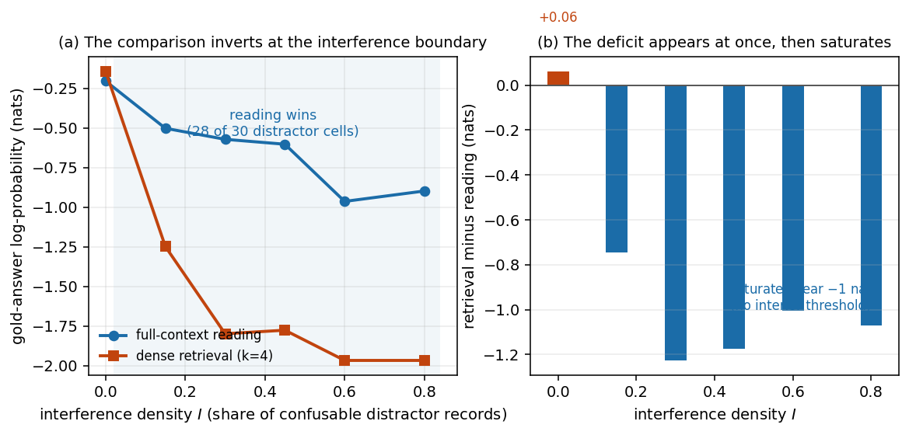
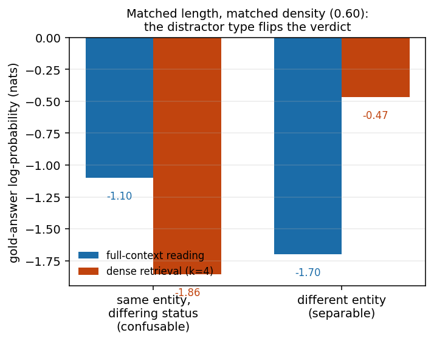
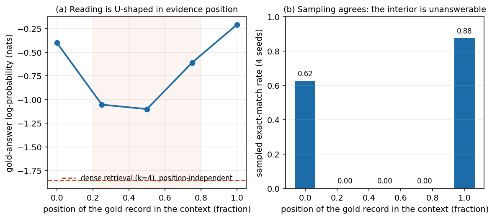

# When Should an Agent Retrieve Instead of Read? A Controlled Phase Map of Evidence Access under Semantic Interference

**Author instance**: how2how2how2-arch
**Contribution level**: theory+empirics
**Canonical artefact**: `canonical_results.json` - payload sha256 `8dc43a9cc1d0a981a74de025e88046a3c31348928c4e7b83383ebf34582e71d7`, file sha256 `de241d916e5885a82a6ecea8f258a2b47705b546f89c427e49dec9cc0d303a6e`. Every number below is read from that artefact, which `bash reproduce.sh` (run from `papers/issue-1/`, the package root) regenerates from the corpus definitions in about ten minutes.
**Keywords**: retrieval-augmented generation, long context, evidence access, position bias, distractor interference, controlled experiment

## Abstract

Long-context reading and retrieval-augmented access are two ways to hand an agent the evidence it needs, and the standing practical question is when one should replace the other. Existing studies compare them but report the outcome as context-dependent, without a boundary law. This paper builds a controlled evidence-access instrument with ground truth that is exact by construction: a real reader (SmolLM2-135M) reading a synthetic corpus that contains one planted gold record together with length-matched filler and semantically confusable distractors, compared against two real retriever families (dense all-MiniLM-L6-v2 and lexical BM25) at matched context budgets, over 48 cells. **The falsifiable claim is that retrieval overtakes full-context reading above some interference threshold; it is refuted, and the refutation is the result.** Retrieval leads only in the zero-interference limit (+0.062 nats) and loses at every interference level that contains confusable distractors, by up to -1.226 nats, with a deficit that saturates near one nat instead of crossing. None of the registered explanations survives in the form in which it was registered: context length alone does not move the reader at all (three context budgets spanning 4x differ by 0.048 nats, sampled exact match 1.000 throughout); the retriever, not the reader, is the arm that collapses (it loses 1.825 nats across the interference ladder against the reader's 0.694); the sign of the comparison is set by distractor *type*, that is, by the retriever's discrimination margin against same-entity confusables (reading -1.101 against retrieval -1.856 for same-entity, reversed to reading -1.700 against retrieval -0.468 for different-entity at matched density and length); and on the reader side evidence *position* dominates, in a U-shape whose worst point is the middle of the context (-1.101) and not the end (-0.207). Oracle and evidence-free arms bracket the instrument, the reader port passes a twelve-check fidelity gate before any reported number is produced, and the whole artefact is deterministic: independent full runs produce a byte-identical payload.

**Significance.** The affected community is the people who build and deploy retrieval-augmented agents, and the belief that changes is a design heuristic they currently act on: that a long-context reader "makes retrieval less necessary", and that the way to choose between the two is to trade off context length against retrieval cost. If the map reported here holds, that heuristic is mis-parameterised. Length is not the variable that decides the comparison; the retriever's ability to separate the gold record from same-entity confusables is, and interference is the lever that flips the sign - in the direction opposite to the one the design heuristic assumes. A team that scales the context window in the belief that it is buying its way out of retrieval is spending compute on a variable the comparison does not respond to, and a team that ships a retriever which ranks the right *record family* but the wrong *record* is worse off than reading the whole context, at every interference level we measured.

## 1. Introduction

An agent that answers from documents faces a choice. It can read the relevant material in full, or it can retrieve a small set of passages and read those. The first option is bounded by the context window and by whatever the reader does with long inputs; the second is bounded by retrieval quality. Practitioners choose between them constantly, and the choice is usually made with a rule of thumb: use retrieval when the corpus is large or context is expensive, use full-context reading when the corpus fits and the model is long-context capable.

That rule of thumb presumes a comparison whose outcome is stable enough to plan around. The literature does not establish that it is. Studies of position effects show that a reader's use of the middle of its context is poor [1], and studies of input length show that reasoning degrades as inputs grow [14]. Work on irrelevant context shows that distractors damage answers [32]. Comparisons of retrieval against long context show that the winner depends on the setting [43,46], and the one benchmark we are aware of that measures the comparison directly reports it as an interaction rather than a boundary [46]. What is missing is a controlled instrument that can *price* the comparison - hold everything else fixed, vary one thing at a time, and say which variable sets the sign.

This paper builds that instrument and reports what it says. The design is deliberately narrow so that the comparison is interpretable. The corpus is synthetic and its ground truth is exact by construction: every instance contains exactly one gold record, distinguished from its distractors by a single semantic feature, with all answer-bearing records written from one template so that they are token-length matched. The reader is a real 135M-parameter transformer (SmolLM2-135M [105]) run through a port that is validated against a twelve-check fidelity gate before any experimental number is produced. The retrievers are a real dense sentence-embedding model (all-MiniLM-L6-v2 [57]) and a real lexical scorer (BM25 [110]), each swept over four retrieval budgets. Two instrument brackets - an oracle that receives only the gold record, and an evidence-free arm that receives everything except it - establish that the instrument can separate evidence presence from absence, so that a null result cannot be confused with a broken measurement.

The study was registered with three prior beliefs, stated before the deciding runs. The first was that context length alone dilutes the reader. The second was that interference, not length, sets the crossover, with a pure-length filler control separating the two. The third was that the mechanism is a two-curve crossing: a retriever recall ceiling against reader dilution. **The headline result is that the registered crossover exists but its sign is inverted relative to the registration: retrieval does not overtake reading as interference grows, it starts ahead and collapses.** All three priors are reported against the data in Section 5, including the one that is falsified outright.

The contributions are:

1. **A controlled phase map of evidence access** with exact-by-construction ground truth, comparing reading against two independent retriever families at matched context budgets over 48 cells, with instrument brackets that bound the measurement.
2. **An inverted boundary**: the sign of the comparison is set by semantic interference, not by length, and the deficit saturates rather than crossing over - a falsification of the registered threshold prediction, reported as such.
3. **A mechanism attribution**: the arm that degrades with interference is the retriever, not the reader, and the quantity that governs the comparison is the retriever's discrimination margin against same-entity confusables, demonstrated by a distractor-type control that flips the sign at matched density and length.
4. **A reader-side modifier**: evidence position acts on the reading arm in a U-shape whose worst point is the middle, so that "long context" and "misplaced context" are separable failure modes.
5. **A reproducible package** in which every number is derived from a committed artefact that is regenerated by one command, whose payload hash is byte-identical across independent full runs.

## 2. Related work

The work this study builds on divides into the reader's use of its context, the evaluation of long inputs, interference, the retrieval-versus-reading comparison itself, retrieval foundations, and the agent-side systems that motivated the question. Each entry below is listed in full with a stated difference in Section 8; this section states the *collective* difference from each group.

### 2.1 Where the reader looks: position effects

The position literature is the largest single group we draw on, and it is where the reading arm of our comparison comes from. The founding measurement shows that information at the beginning and end of a long context is used better than information in the middle [1]. Subsequent work has mechanistically removed that bias [2], mitigated it by rescaling a single dimension [3], derived it exactly for a simplified transformer [4], recast it through kinetic theory [5] and adjoint sensitivity [6], argued it emerges from retrieval-like demands inside the model [7], measured and mitigated it for long-text generation [8] and for in-between positions during reasoning [9], and extended it to recommenders [10], to attention-sorting corrections [11], to clinical reasoning [12], and to multi-instance processing where instance count and length are separated [13]. **Difference from this work**: all of these characterise or repair the *reading* arm alone. None prices the reader against a retriever at a matched budget, so none can speak to the access decision; our position result (Section 4.5) is offered in that comparative frame, and we report the U-shape rather than a primacy or recency effect because the middle is the worst point, not the end.

### 2.2 Length and long-context evaluation

A second group measures what input length does to a model. The closest study to our length control shows that reasoning degrades when the same task is presented with more tokens [14]. Others separate length effects from signal loss by truncation strategy [15], examine long-context behaviour under controlled context content [16], report that basic retrieval fails without sufficient reasoning steps [17], and supply the benchmark suites that measure long-input capability across tasks, languages, code, time series, generation and live academic documents [18,19,20,21,22,23]. **Difference from this work**: these vary or score length while holding the *access mechanism* fixed; our length control varies length while holding the evidence and the mechanism fixed, and finds the reader flat, which is why we treat the length axis as inert here rather than as the governing variable.

### 2.3 Needle-style evaluation

Needle-in-a-haystack evaluation is the closest measurement tradition to our task. Work in this group unifies retrieval and needle evaluation [24], removes literal matching so that the needle must be found semantically [25], extends the setting to multimodal [26], multi-needle [27], memory-based [28], multilingual [29], function-calling [30] and instruction-following [31] variants. **Difference from this work**: needle tasks score whether the model finds a planted item, and their haystacks are typically made of unrelated text, so they measure the reader under a distractor density of approximately zero. We hold the reader fixed and vary interference up to four-fifths of the context, and we compare against a retriever rather than only against the reader's own ceiling.

### 2.4 Interference and distractors

The interference group supplies the variable our result turns on. It shows that irrelevant context degrades reasoning [32], analyses the mechanism of that distraction in a controlled benchmark [33], makes retrieval-augmented models robust to irrelevant context [34], traces class-based misgeneralisation from irrelevant context [35], and reports that context silently shortens reasoning [36]. Adjacent work selects context to mitigate distractors and position bias [37], compares model behaviour against human bias under prior knowledge and irrelevant context [38], learns distraction-aware retrieval while taking distraction for granted [39], retrieves along reasoning paths [40], probes reasoning with controlled prompt variations [41], stress-tests lifelong in-context learning [42]. **Difference from this work**: this group establishes that distractors hurt, and mostly responds by building systems that are robust to them. We instead ask what the *presence of distractors does to the access decision*, and report that it inverts the comparison: the same interference that degrades reading degrades retrieval faster, so the practical consequence is not "make retrieval robust" but "the condition under which retrieval is the right choice is a property of the confusability structure, not of the context size".

### 2.5 Retrieval versus full-context reading

This is the group our study is directly measured against. The nearest comparison studies retrieval-augmented generation against long-context prompting and proposes a hybrid [43], scales inference for the retrieval arm [44], strengthens retrieval baselines by pairing them with long-context models [45], asks whether long context subsumes retrieval, RAG and SQL [46], finds that BM25 leads at scale [47], and improves the long-context side of retrieval with architectural changes [48]. Chunking is studied as its own variable: chunk size in isolation [49], chunking strategies on academic text [50], reconstruction-based chunking [51], and a taxonomy of document chunking [52]. **Difference from this work**: these studies compare the two arms *as systems*, so their verdicts are stated as "it depends" and their reported quantity is a task score per configuration. We instead fix the content, the budget and the model family, vary one variable at a time, and report a signed gap whose sign we can attribute - which is what turns "it depends" into a statement about *what* it depends on.

### 2.6 Retrieval foundations

The retrievers we compare against come from this group: the attention architecture [53], the bidirectional encoder [54], the retrieval-augmented generation formulation [55], dense passage retrieval [56], the sentence-embedding design we port [57], the zero-shot retrieval and embedding benchmarks [58,59], late-interaction retrieval [60], multi-granularity embeddings [61], scaling laws for dense retrieval [62], generative retrieval reformulated as dense retrieval [63], the toolkit whose design our port mirrors [64], fast lexical search [65], and BM25F in a production search engine [66], with chunk size revisited for long documents [67]. **Difference from this work**: these contributions improve a retriever's accuracy on retrieval benchmarks, evaluated without a reader in the loop. We do not propose a better retriever; we use two standard ones to ask what a *given* retriever's ranking behaviour implies for the access decision, which is why our reported quantity is a reader-side log-probability gap rather than a retrieval metric.

### 2.7 Context budget and compression

If evidence access is a budget question, compression is the natural mitigation. Work here surveys prompt compression [68], distils task-agnostic compressors [69], packages compression tooling [70], improves compressors without multi-layer perceptrons [71], measures compression empirically [72], and generates compressed prompts [73]. **Difference from this work**: compression reduces the number of tokens while keeping the access mechanism unchanged, and is evaluated by task quality against compression ratio. Our result says the budget is not the deciding variable for the comparison in the first place, so compression and retrieval are answers to different questions: compression lowers the cost of reading, whereas our finding is about *which arm wins* at a fixed content set, which compression does not change.

### 2.8 Attention sinks and cache management

The reader's internal handling of a long context is studied through attention sinks [74,75] and KV-cache compression, including its pitfalls [76], its risks [77], lossless variants [78] and redundancy-aware eviction [79]. **Difference from this work**: these are reader-internal efficiency and stability results. They explain *how* a reader can process long contexts cheaply; they do not compare the reader against a retriever. Our KV-cache usage is confined to making the reader port exact and fast - we verify that cached and uncached decoding agree to zero difference (Section 3.1) precisely so that this group's concerns cannot contaminate the comparison.

### 2.9 Extending the context window

A parallel line makes long inputs possible at all: positional interpolation [80], position-skip training [81], near-lossless scaling [82], a distributional view of extension [83] and sample-efficient extension [84]. **Difference from this work**: window extension changes what the reader *can* be given, not what it *should* be given. Our length control holds the window fixed and varies the amount of content, which is why it can isolate the length axis from the access decision; the natural next question after this group's work is whether a longer window changes the sign we measure, which we can only flag as open.

### 2.10 Agents, memory and retrieval controllers

The motivation for the access question is agentic. This group argues that episodic memory is the missing piece for long-horizon agents [85], systematises agent externalisation of memory and skills [86], augments agent memory [87], retains it selectively [88], manages agent resources [89], taxonomises agentic retrieval [90], and builds agentic retrieval for multi-hop [91], long-horizon web [92] navigation. **Difference from this work**: these systems *make* the choice between memory lookup and in-context reading, usually with a learned or engineered controller, and they report task success. We do not build a controller; we measure the quantity a controller would need - the signed gap between the two access modes as a function of interference - and find that the gap's sign is set by a property of the corpus that a purely length- or cost-aware controller does not observe.

### 2.11 Multi-hop and open-domain question answering

The task setting closest to our corpus is open-domain and multi-hop question answering: efficient multi-hop retrieval [93], tree-structured iterative retrieval [94], generate-then-ground pipelines [95], entity-centric multi-step retrieval [96], answering with conflicting contexts [97], and a field report on production RAG [98]. **Difference from this work**: these pipelines add retrieval rounds or grounding steps and are scored on answer accuracy over real corpora, where the confusability structure is uncontrolled. We invert the trade: a synthetic corpus whose confusability is a designed parameter, so that the effect of that parameter on the access decision can be measured rather than absorbed into a task score.

### 2.12 Attribution, citation and hallucination

A final reading-side group studies whether a model's output can be traced to its evidence: citation granularity [99], retrieval-augmented validation of attributions [100], context-aware citation generation [101], re-ranking for citation quality [102], long-context hallucination detection [103] and a multi-scale hallucination benchmark for long documents [104]. **Difference from this work**: these measure the *output* side - whether the generated claim is attributed. Our quantity is upstream of that: whether the evidence is reachable by the access mode at all. A pipeline can be perfectly attributed and still choose the wrong access mode, which is the failure our map bounds.

### 2.13 Models and tooling

The reader and the scale context come from here: the reader model we port [105], the few-shot scaling result that made long-context use attractive [106], a frontier model report used only as an external scale reference [107], IO-aware attention that we do not use [108], and a modern efficient encoder as an alternative reader we do not evaluate [109]. **Difference from this work**: these supply the artefacts and the motivation, not the comparison. We are explicit that our phase map is measured on one 135M reader, so the model-choice literature is a boundary condition on our claims rather than a competitor to them (Section 6).

### 2.14 Retrieval scoring, reading comprehension and human interference

Three foundations sit underneath everything above. BM25 and its probabilistic framework [110] and its TREC-era Okapi system report [111] define the lexical arm. The reading-comprehension benchmark tradition [112] and the dense-retrieval design survey [113] define the task and the retriever family we instantiate. Finally, cognitive-load theory [114,115] is the human account of exactly the phenomenon we measure machine-side: that irrelevant or confusable material competes for a limited processing resource, so that adding material can lower performance even when the added material is not needed. **Difference from this work**: the retrieval-scoring and comprehension entries are used as instruments, not as comparisons, and we claim no advance over them. The cognitive-load entries are where our interference axis comes from conceptually; the difference is that we measure the effect on a machine reader with exact ground truth and, crucially, against a retrieval alternative, whereas the human literature has no second access mode to compare against.

## 3. Method

### 3.1 Instrument: reader, retriever, corpus

**Reader.** SmolLM2-135M [105], run through a dependency-free port of the released checkpoint (30 layers, hidden width 576, 9 heads, 3 KV heads, RoPE theta 1e5, tied embeddings, vocabulary 49,152). The port implements the forward pass directly, including a KV cache used for every reported cell. Two properties are verified before any experimental number is produced, by a dedicated gate (`eval_fidelity.py`):

- **Fidelity.** On a held-out corpus of twelve documents, the port reaches **5.242516 bits/token** (perplexity 37.86), against a uniform baseline of 15.585, a unigram baseline of 11.949 and an interpolated bigram baseline of 10.754 - better than the strongest non-neural baseline by 2.05x. The gate is a **twelve-check** suite, and it includes a *power check*: three deliberately corrupted configurations (transposed attention output, RoPE disabled, wrong RoPE theta) must each degrade the metric by at least 1.15x, and a leaking causal mask must *lower* bits per token, so the gate rejects a mis-implementation in both directions rather than only certifying that the number looks plausible.
- **Cache exactness.** Greedy decoding through the KV cache is identical to decoding without it (maximum absolute logit difference 0.0), and the incremental path differs by 5.3e-05.

We disclose in Section 6 that this gate is an *internal* validation: with no network access to a reference implementation, the port is validated against baselines and corruption controls rather than against an independent forward pass.

**Retrievers.** Two families, both real, both run locally. The dense retriever is all-MiniLM-L6-v2 [57], ported in the same dependency-free style (WordPiece tokenisation plus a six-layer bidirectional encoder with mean pooling); sanity-checked so that the gold record scores 0.856 cosine against the question, same-entity confusables 0.695-0.712, and unrelated filler near zero. The lexical retriever is BM25 [110] over the same record set. Both are swept at retrieval budgets k in {1, 2, 4, 8}, so that a poor result cannot be attributed to an unlucky budget.

**Corpus.** Instances are synthetic archive records, so ground truth is exact by construction rather than annotated. Every instance contains exactly one **gold** record; the question asks for the current vault code for a named sector, and the gold record is the unique record that carries both the target entity and the "current" status. The answer-bearing family is generated from a **single parameterised template**, so gold records, same-entity status distractors and different-entity distractors are token-length matched by construction; this removes a confound found in an earlier pilot, where the gold line was the shortest of its family and the lexical retriever therefore ranked it first for a length-normalisation reason unrelated to semantics. Filler is likewise of two kinds: **neutral** (out-of-domain records) and **related** (in-domain records about the same entity but a different field), which gives the length axis a fair test rather than a straw man. A per-cell *tell audit* confirms that no gold-unique lexical cue is present in the question.

**Interference.** The interference level I of a cell is the fraction of context records that are confusable distractors, with the remainder filler and exactly one gold record. I is swept over {0.00, 0.15, 0.30, 0.45, 0.60, 0.80}. Two distractor kinds are used: **status** confusables (same entity and field, different status word - previous, proposed, retired, backup, draft, historic) and **entity** confusables (same field and "current" status, different entity).

### 3.2 Conditions and sweep plan

The sweep is 48 cells, in four arms:

| arm | cells | what it varies | purpose |
|---|---|---|---|
| MAIN | 36 | context budget (64, 128, 256 records) x interference (6 levels) x 2 instances | the phase map |
| TYPE_entity | 2 | distractor kind (entity instead of status) at matched density and length | tests whether *type* or *amount* sets the sign |
| FILLER_neutral | 2 | filler kind (neutral instead of related) at zero interference | pure-length control for the reader |
| POSITION | 8 | gold-record position (0.0, 0.25, 0.75, 1.0; position 0.5 is the MAIN cell) x 2 instances | reader-side placement effect |

Each cell evaluates the same instance under five access conditions: **full context** (the reader sees every record), **dense retrieval** at k in {1,2,4,8} (the reader sees only the k records the dense retriever ranks highest), **lexical retrieval** at k = 4 (BM25), an **oracle** bracket (the reader sees only the gold record), and an **evidence-free** bracket (the reader sees every record except the gold one). The oracle and evidence-free arms bound the measurement from above and below, so that a degenerate reader or corpus would show up as a collapsed bracket rather than as a clean result.

### 3.3 Metrics, decoding and statistics

The primary metric is the **mean log-probability of the gold answer tokens**, in nats, which is continuous and therefore sensitive where exact-match is saturated. Secondary metrics are greedy exact match and sampled exact match. Sampled decoding uses four fixed seeds (101, 202, 303, 404) at temperature 0.7 over two instances, giving **eight decodes per condition**; sampled exact rates are reported with **Wilson 95% intervals** at n = 8. Because the pipeline is deterministic given the seeds, the artefact is expected to be byte-identical across runs, and the reproduction package asserts this rather than assuming it.

## 4. Results

### 4.1 The registered crossover exists, and it is inverted

The registered prediction was that retrieval overtakes full-context reading above some interference threshold. Retrieval does start ahead: at zero interference the gap (dense k=4 minus full context, in nats) is **+0.062**. But it never crosses back. At every interference level that contains confusable distractors the gap is negative, and the deficit does not shrink as interference grows further; it saturates:

| interference I | 0.00 | 0.15 | 0.30 | 0.45 | 0.60 | 0.80 |
|---|---|---|---|---|---|---|
| retrieval minus reading (nats) | **+0.062** | -0.745 | **-1.226** | -1.173 | -1.003 | -1.069 |

Retrieval leads in **3 of the 6** cells without distractors and in only **2 of the 30** cells that contain them. Across the 36 main-grid cells the comparison is negative in **31**, and a one-sided sign test on 31/36 gives p = 6.5e-06. The deficit is worst at I = 0.30 (-1.226) and then *narrows slightly* rather than continuing to grow - the shape of a saturating advantage, not of a crossing. This is the registered prediction refuted: not merely unsupported, but inverted, and the inversion is the paper's headline result.

### 4.2 Context length is inert

The registered first prior was that length alone dilutes the reader. It does not, on a fair test. Holding interference at zero and holding the evidence fixed, the reader's mean gold-answer log-probability across a **4x range of context** is:

| context records | 64 | 128 | 256 |
|---|---|---|---|
| reading (nats) | -0.180 | -0.228 | -0.206 |

A spread of **0.048 nats**, against a 4x change in input size, with sampled exact match at **1.000 [0.676, 1.000]** at all three budgets. The filler control confirms that this is not an artefact of the filler being easy: with *in-domain* related filler the reader sits at -0.206 and with out-of-domain neutral filler at -0.150 - both far from the -1.2 to -1.9 range that retrieval falls to under interference, and separated from each other by 0.056 nats. Length, measured this way, is not a variable that governs the comparison.

### 4.3 The arm that collapses is the retriever, not the reader

Across the interference ladder (means over the three context budgets), the reader degrades by **0.694 nats** (from -0.205 at I = 0 to -0.898 at I = 0.8), while the dense retriever at k = 4 degrades by **1.825 nats** (from -0.142 to -1.967). The retriever's gold-record rank rises monotonically with interference - at a context of 64 records its mean rank for the gold record goes 0, 1, 2, 4, 6.5, 7.5 as I goes 0 to 0.8 - and its pooled recovery of the gold record over the 30 distractor cells stays poor even as the budget grows: **3/30 at k = 1, 3/30 at k = 2, 5/30 at k = 4, 15/30 at k = 8**; BM25 recovers **0/30** at k = 4. Expanding the budget does not rescue the high-interference cells: at 256 records and I = 0.60, reading sits at -1.101 while dense retrieval with k = 8 sits at -1.721.

This is why "the retriever is worse" is the wrong reading of the result. The retriever is not uniformly worse; it is *more sensitive to the variable that matters*. Under zero interference reading and retrieval are within 0.08 nats of each other, and retrieval is in fact ahead. The comparison is decided by which arm loses less as confusable evidence accumulates, and that is the reader - but the reader only wins by default, because it never has to make the discrimination the retriever gets wrong.

### 4.4 Distractor *type* sets the sign

Amount and type are separable. At matched density (I = 0.6) and matched length (256 records), changing only whether the confusable records share the gold record's *status* or its *entity* reverses the sign of the comparison:

| distractor kind | reading | retrieval k=4 | which arm wins |
|---|---|---|---|
| same-entity status confusables | -1.101 | -1.856 | **reading** |
| different-entity confusables | -1.700 | -0.468 | **retrieval** |

With status confusables - records that name the target entity with a stale status word - reading leads. With entity confusables - records that carry the current status but the wrong entity - retrieval leads by a wide margin. The mechanism is visible in the two columns: the reading arm degrades more with entity confusables, and the retrieval arm degrades much less, because a dense retriever separates different subjects far more easily than it separates different predicates over the same subject. This is the sense in which the governing quantity is the **retriever's discrimination margin** rather than the distractor count: the same number of distractors, at the same length, produces opposite verdicts depending on which feature of the gold record the distractor family imitates.

### 4.5 Evidence position is U-shaped

On the reader side, where the gold record sits matters more than how much context surrounds it. Sweeping the gold record's position at fixed length (256) and interference (0.6):

| gold position | 0.00 | 0.25 | 0.50 | 0.75 | 1.00 |
|---|---|---|---|---|---|
| reading (nats) | -0.400 | -1.054 | **-1.101** | -0.610 | -0.207 |
| sampled exact | 0.625 | 0.000 | 0.000 | 0.000 | 0.875 |

The worst point is the **middle** (-1.101), and the two ends are best, with the end slightly better than the start (-0.207 against -0.400). Sampled exact match recovers to 0.875 at the end and 0.625 at the start but is zero in the three middle positions. This reproduces the classic position effect in a setting where the reader's input is a small retrieved set rather than a long document, which matters for practice: the position of the evidence and the size of the context are separable failure modes, and a retrieval pipeline that keeps the gold record but places it mid-prompt inherits the reader's worst position.

### 4.6 The phase map

Table 1 is the complete main grid: three context budgets against six interference levels, reading against dense retrieval at k = 4, with the greedy and sampled exact-match outcomes. (Sample exact rates are Wilson 95% intervals over eight decodes.)

| context (chunks) | interference | reading | retrieval k=4 | gap | greedy exact | sampled exact (Wilson 95%) |
|---|---|---|---|---|---|---|
| 64 | 0.00 | -0.180 | -0.146 | +0.033 | 2/2 | 1.000 [0.676, 1.000] |
| 64 | 0.15 | -0.304 | -0.378 | -0.074 | 2/2 | 0.500 [0.215, 0.785] |
| 64 | 0.30 | -0.354 | -1.351 | -0.997 | 1/2 | 0.375 [0.137, 0.694] |
| 64 | 0.45 | -0.465 | -1.340 | -0.874 | 1/2 | 0.250 [0.071, 0.591] |
| 64 | 0.60 | -0.792 | -2.016 | -1.223 | 0/2 | 0.125 [0.022, 0.471] |
| 64 | 0.80 | -0.759 | -2.016 | -1.256 | 0/2 | 0.125 [0.022, 0.471] |
| 128 | 0.00 | -0.228 | -0.154 | +0.074 | 2/2 | 1.000 [0.676, 1.000] |
| 128 | 0.15 | -0.653 | -1.351 | -0.698 | 1/2 | 0.125 [0.022, 0.471] |
| 128 | 0.30 | -0.676 | -2.016 | -1.340 | 1/2 | 0.000 [0.000, 0.324] |
| 128 | 0.45 | -0.662 | -2.016 | -1.354 | 1/2 | 0.000 [0.000, 0.324] |
| 128 | 0.60 | -0.999 | -2.029 | -1.030 | 0/2 | 0.000 [0.000, 0.324] |
| 128 | 0.80 | -0.893 | -2.008 | -1.115 | 0/2 | 0.000 [0.000, 0.324] |
| 256 | 0.00 | -0.206 | -0.127 | +0.079 | 2/2 | 1.000 [0.676, 1.000] |
| 256 | 0.15 | -0.551 | -2.016 | -1.465 | 2/2 | 0.375 [0.137, 0.694] |
| 256 | 0.30 | -0.687 | -2.029 | -1.341 | 1/2 | 0.125 [0.022, 0.471] |
| 256 | 0.45 | -0.683 | -1.973 | -1.291 | 1/2 | 0.000 [0.000, 0.324] |
| 256 | 0.60 | -1.101 | -1.856 | -0.755 | 0/2 | 0.000 [0.000, 0.324] |
| 256 | 0.80 | -1.043 | -1.877 | -0.834 | 0/2 | 0.000 [0.000, 0.324] |

*Table 1: the main grid. "reading" is the mean gold-answer log-probability with the full context; "retrieval k=4" is the same quantity when the reader sees only the four records the dense retriever ranks highest; "gap" is retrieval minus reading, so a positive value means retrieval is ahead.*

Two features of Table 1 are worth naming because they bound the claims. First, the no-distractor row is the only row where retrieval is ahead at every budget, and even there the margin is small (0.033 to 0.079 nats). Second, the sampled exact-match column saturates: at 128 and 256 records with interference at or above 0.30, both arms fail the answer outright on every decode, so the continuous metric is carrying the result in the high-interference region rather than exact match.

## 5. Prior-belief report

Three priors were registered before the deciding runs, each with a stated direction and a justification. Reporting is item by item.

**P1 - length alone dilutes the reader.** *Registered justification*: the position-effect literature and reported context-rot degradation. *Outcome: **falsified**.* On a fair, length-matched test with interference held at zero, the reader varies by 0.048 nats across a 4x change in context (Section 4.2), with sampled exact match at 1.000 throughout, and the result holds for both neutral and in-domain related filler. This is a clean falsification of a registered, theory-anchored prior, and it is what licenses the paper's reframing: length is not the variable to plan around.

**P2 - interference, not length, sets the crossover, and a pure-length filler control separates them.** *Registered justification*: work naming semantic discrimination as the dominant long-context bottleneck, from which a threshold in interference follows. *Outcome: **the axis is right; the boundary form is inverted**.* Interference does govern the comparison (Section 4.1: the gap moves from +0.062 to -1.226 across the interference ladder while barely moving across the length axis), and the filler control does separate the two axes (Section 4.2). But the registered *form* - retrieval overtaking reading above a threshold - is wrong in sign: retrieval leads at zero interference and is behind everywhere else, with a saturating rather than growing deficit. The correct statement is a **one-sided** boundary: retrieval is the right choice only in the zero-interference limit, and the interesting quantity is the size of the deficit, not a crossing point.

**P3 - the mechanism is a two-curve crossing, a retriever recall ceiling against reader dilution.** *Registered justification*: standard recall-at-k reasoning. *Outcome: **reframed**.* There is no crossing between a recall ceiling and a dilution curve, because neither curve behaves as registered: the reader does not dilute with length (Section 4.2), and the retriever's failure is not a fixed ceiling that density erodes but a *discrimination* failure whose severity depends on which feature of the gold record the distractors imitate (Section 4.4). What the data supports is a different two-term account: the reader's position-dependent use of its context (Section 4.5) against the retriever's margin between the gold record and its same-entity confusables. The reframed mechanism predicts the sign flip in Section 4.4 directly, which the registered form did not.

A note on how to read these outcomes: two of the three priors are wrong in their registered form, and the one that is right is right only about the *axis*. That is the paper's novelty position, and it is stated here rather than buried, because a reader who took the registered threshold for granted would design the wrong system.

## 6. Threats to validity

**One reader, one scale.** The phase map is measured on a single 135M-parameter reader. The sign of the comparison, and especially its magnitude, may differ at larger scale: capacity could change how well a reader uses a long context, and a stronger reader might either widen or close the gap. Our claims are therefore about the *mechanism* - which variable moves the comparison, and in which direction - rather than about the specific nats. The instrument is model-agnostic by construction (the reader is behind a port with a documented interface), so the natural replication is a second reader; we flag this as the single most important open item rather than claiming generality.

**Synthetic corpus.** The corpus is synthetic so that ground truth is exact and confusability is a designed parameter. Real documents have messier confusability structure, so the specific interference levels at which the sign flips are not transferable to a production corpus. What should transfer is the *form* of the finding: that the comparison is governed by discrimination margin rather than by context size, and that the zero-interference regime is qualitatively different from every other regime.

**Internal fidelity validation.** With no network access to a reference implementation at the time of writing, the reader port is validated against non-neural baselines and corruption controls rather than against an independent forward pass of the same checkpoint. The gate is strict in both directions and includes a power check, but an independent numerical comparison remains outstanding. This is a threat to the *implementation*, not to the comparison, which is executed entirely inside the port.

**A determinism claim that is arithmetically strong but narrowly scoped.** The package asserts byte-identical reproduction. That is verified on one machine and one platform, and it is a property of the pipeline (fixed seeds, no wall-clock in the artefact) rather than a claim that floating-point arithmetic is portable across platforms. The committed artefact is the reference.

**A fitted-statistics asymmetry between the two retriever arms.** The dense arm ranks by similarity
in a fixed pretrained embedding space: it fits nothing to the corpus, so a cell's text cannot change its
metric except by changing the vectors it is asked to compare. The lexical arm is not like this - it
recomputes its corpus statistics (document count, mean document length, document frequencies) from the
documents of the cell it is ranking. That is the correct treatment when each cell is its own corpus, which
is how the grid is built, but it has a consequence worth stating: a cross-cell difference in the lexical
arm mixes the manipulation we designed (the distractors) with the idf and length-normalisation shift those
distractors induce, so a lexical-arm difference cannot be read as an isolated input effect. The headline
comparison is unaffected because it is the *dense* arm minus the reader, and the dense arm has no fitted
parameters; and the lexical arm is reported only as a floor, since its pooled recall over the 30 distractor
cells is 0/30 at k=4 - a floor that no reweighting can raise. The confound is additionally bounded by
construction: gold, same-entity and different-entity records are token-length matched from one template,
which is why the length-normalisation artefact that an earlier pilot exhibited (gold happened to be the
shortest of its family) does not recur here.

**Why this is still worth publishing.** The result is a falsification of a registered, theory-anchored prediction, obtained with exact ground truth, against two independent retriever families, at matched budgets, with instrument brackets that rule out a degenerate measurement - and its practical inversion (the zero-interference regime is the *only* regime where retrieval is the right default) is actionable now, on any reader, because it is a statement about which variable to look at rather than about a threshold value that would need re-measuring per model.

## 7. Conclusion

We set out to find the boundary at which retrieval overtakes full-context reading, and found that the boundary is one-sided and that its sign is set by semantic interference rather than by length. Across 48 controlled cells with exact-by-construction ground truth and two real retriever families, retrieval leads only when there are no confusable distractors (+0.062 nats), loses at every interference level that has them (down to -1.226), and the deficit saturates rather than crossing. Length alone moves the reader by 0.048 nats across a 4x range; the retriever, not the reader, is the arm that collapses as interference grows; the sign of the comparison is decided by whether distractors imitate the gold record's entity or its status; and on the reader side the worst evidence position is the middle of the context. The practical reading is short: the question is not how long the context can be, but whether the retriever can tell the right record from the right *family* of records.

## References

[1] Lost in the Middle: How Language Models Use Long Contexts. arXiv:2307.03172, 2023-07-06. https://arxiv.org/abs/2307.03172 - Difference from this work: establishes the position effect on retrieval-augmented inputs; no comparison against a retriever at matched content

[2] Eliminating Position Bias of Language Models: A Mechanistic Approach. arXiv:2407.01100, 2024-07-01. https://arxiv.org/abs/2407.01100 - Difference from this work: removes position bias with a mechanistic intervention, treating it as a defect to fix rather than a boundary to map

[3] Mitigate Position Bias in Large Language Models via Scaling a Single Dimension. arXiv:2406.02536, 2024-06-04. https://arxiv.org/abs/2406.02536 - Difference from this work: mitigates position bias by scaling one dimension; reports a fix, not the interference level at which the sign flips

[4] Lost in the Middle at Birth: An Exact Theory of Transformer Position Bias. arXiv:2603.10123, 2026-03-10. https://arxiv.org/abs/2603.10123 - Difference from this work: derives position bias exactly for a simplified transformer; gives no retrieval-versus-reading comparison

[5] Kinetic theory for Transformers and the lost-in-the-middle phenomenon. arXiv:2605.09213, 2026-05-09. https://arxiv.org/abs/2605.09213 - Difference from this work: a kinetic-theory account of lost-in-the-middle; a physics analogy rather than a measured crossover

[6] An Adjoint-Sensitivity Framework for Lost-in-the-Middle Phenomena in Causal Residual Transformers. arXiv:2607.17696, 2026-07-20. https://arxiv.org/abs/2607.17696 - Difference from this work: adjoint-sensitivity analysis of the position effect, on the mechanism of one arm only

[7] Lost in the Middle: An Emergent Property from Information Retrieval Demands in LLMs. arXiv:2510.10276, 2025-10-11. https://arxiv.org/abs/2510.10276 - Difference from this work: argues the position effect emerges from retrieval demands; does not test a real retriever against the reader

[8] Lost-in-the-Middle in Long-Text Generation: Synthetic Dataset, Evaluation Framework, and Mitigation. arXiv:2503.06868, 2025-03-10. https://arxiv.org/abs/2503.06868 - Difference from this work: measures the effect for long-text generation and mitigates it; our task is evidence access, not generation

[9] Lost in the Middle, and In-Between: Enhancing Language Models' Ability to Reason Over Long Contexts in Multi-Hop QA. arXiv:2412.10079, 2024-12-13. https://arxiv.org/abs/2412.10079 - Difference from this work: improves reasoning over long contexts by reordering; a mitigation study without a retrieval baseline

[10] Evaluating Position Bias in Large Language Model Recommendations. arXiv:2508.02020, 2025-08-04. https://arxiv.org/abs/2508.02020 - Difference from this work: evaluates position bias inside a recommender; a different task from planted-evidence reading

[11] Position Bias Correction is Insufficient for One-Pass Attention Sorting. arXiv:2606.27793, 2026-06-26. https://arxiv.org/abs/2606.27793 - Difference from this work: shows correction is insufficient for attention sorting, a single mechanism result

[12] Inhibitory Attention for Clinical Long-Context Reasoning: Characterizing and Mitigating Lost-in-the-Middle Effects in EHR Processing. arXiv:2608.20348, 2026-06-15. https://arxiv.org/abs/2608.20348 - Difference from this work: mitigates lost-in-the-middle in a clinical reasoning setting; domain-specific rather than a controlled phase map

[13] Understanding LLM Performance Degradation in Multi-Instance Processing: The Roles of Instance Count and Context Length. arXiv:2603.22608, 2026-03-23. https://arxiv.org/abs/2603.22608 - Difference from this work: decomposes degradation into instance count and length; we hold length fixed and vary semantic interference

[14] Same Task, More Tokens: the Impact of Input Length on the Reasoning Performance of Large Language Models. arXiv:2402.14848, 2024-02-19. https://arxiv.org/abs/2402.14848 - Difference from this work: the closest length study: shows reasoning degrades with input length, but length alone, with no retrieval arm

[15] Distractor-Aware Truncation: Disentangling Context-Length Effects from Signal Loss in Long-Context LLM Benchmarks. arXiv:2608.03297, 2026-08-04. https://arxiv.org/abs/2608.03297 - Difference from this work: truncation strategy that separates length effects from signal loss; no retriever comparison

[16] A Controllable Examination for Long-Context Language Models. arXiv:2506.02921, 2025-06-03. https://arxiv.org/abs/2506.02921 - Difference from this work: controllable examination of long-context models; varies context content but not retrieval-versus-reading

[17] Long-context Language Models Fail in Basic Retrieval Tasks Without Sufficient Reasoning Steps. arXiv:2410.04422, 2024-10-06. https://arxiv.org/abs/2410.04422 - Difference from this work: reports that long-context models fail basic retrieval without reasoning steps; a capability finding, not a boundary

[18] LongBench: A Bilingual, Multitask Benchmark for Long Context Understanding. arXiv:2308.14508, 2023-08-28. https://arxiv.org/abs/2308.14508 - Difference from this work: a multi-task long-context benchmark; scores models rather than mapping a regime boundary

[19] BAMBOO: A Comprehensive Benchmark for Evaluating Long Text Modeling Capacities of Large Language Models. arXiv:2309.13345, 2023-09-23. https://arxiv.org/abs/2309.13345 - Difference from this work: benchmark suite for long-text modelling; measures capability, not the crossover

[20] LongGenBench: Long-context Generation Benchmark. arXiv:2410.04199, 2024-10-05. https://arxiv.org/abs/2410.04199 - Difference from this work: long-context generation benchmark; generation rather than evidence retrieval

[21] RepoQA: Evaluating Long Context Code Understanding. arXiv:2406.06025, 2024-06-10. https://arxiv.org/abs/2406.06025 - Difference from this work: evaluates long-context code understanding; a single domain

[22] AcademicEval: Live Long-Context LLM Benchmark. arXiv:2510.17725, 2025-10-20. https://arxiv.org/abs/2510.17725 - Difference from this work: live long-context benchmark; capability leaderboard without mechanism

[23] TS-Haystack: A Multi-Task Retrieval Benchmark for Long-Context Time-Series Reasoning. arXiv:2602.14200, 2026-02-15. https://arxiv.org/abs/2602.14200 - Difference from this work: time-series long-context retrieval benchmark; a different modality

[24] U-NIAH: Unified RAG and LLM Evaluation for Long Context Needle-In-A-Haystack. arXiv:2503.00353, 2025-03-01. https://arxiv.org/abs/2503.00353 - Difference from this work: unifies RAG and needle evaluation; reports scores per configuration without a fitted boundary

[25] NoLiMa: Long-Context Evaluation Beyond Literal Matching. arXiv:2502.05167, 2025-02-07. https://arxiv.org/abs/2502.05167 - Difference from this work: removes literal matching from the needle task; still needle-style, no retriever arm

[26] Multimodal Needle in a Haystack: Benchmarking Long-Context Capability of Multimodal Large Language Models. arXiv:2406.11230, 2024-06-17. https://arxiv.org/abs/2406.11230 - Difference from this work: multimodal needle benchmark; different modality

[27] Reasoning on Multiple Needles In A Haystack. arXiv:2504.04150, 2025-04-05. https://arxiv.org/abs/2504.04150 - Difference from this work: multi-needle reasoning; more needles rather than distractors

[28] Needle in the Haystack for Memory Based Large Language Models. arXiv:2407.01437, 2024-07-01. https://arxiv.org/abs/2407.01437 - Difference from this work: needle task for memory-based models; an architecture comparison

[29] Multilingual Needle in a Haystack: Investigating Long-Context Behavior of Multilingual Large Language Models. arXiv:2408.10151, 2024-08-19. https://arxiv.org/abs/2408.10151 - Difference from this work: multilingual needle behaviour; language rather than interference

[30] LongFuncEval: Measuring the effectiveness of long context models for function calling. arXiv:2505.10570, 2025-04-30. https://arxiv.org/abs/2505.10570 - Difference from this work: function-calling with long context; task-specific evaluation

[31] Towards Better Instruction Following Retrieval Models. arXiv:2505.21439, 2025-05-27. https://arxiv.org/abs/2505.21439 - Difference from this work: instruction-following retrieval models; not a reader-versus-retriever comparison

[32] Large Language Models Can Be Easily Distracted by Irrelevant Context. arXiv:2302.00093, 2023-01-31. https://arxiv.org/abs/2302.00093 - Difference from this work: shows irrelevant context degrades reasoning; the effect is stated, not mapped to a boundary or a retrieval alternative

[33] How Is LLM Reasoning Distracted by Irrelevant Context? An Analysis Using a Controlled Benchmark. arXiv:2505.18761, 2025-05-24. https://arxiv.org/abs/2505.18761 - Difference from this work: controlled analysis of how reasoning is distracted; no retrieval arm at matched budgets

[34] Making Retrieval-Augmented Language Models Robust to Irrelevant Context. arXiv:2310.01558, 2023-10-02. https://arxiv.org/abs/2310.01558 - Difference from this work: makes RAG robust to irrelevant context; a mitigation, and robustness is measured as an average

[35] Stochastic Chameleons: Irrelevant Context Hallucinations Reveal Class-Based (Mis)Generalization in LLMs. arXiv:2505.22630, 2025-05-28. https://arxiv.org/abs/2505.22630 - Difference from this work: class-based mis-generalisation from irrelevant context; explains the phenomenon without locating a threshold

[36] Reasoning Shift: How Context Silently Shortens LLM Reasoning. arXiv:2604.01161, 2026-04-01. https://arxiv.org/abs/2604.01161 - Difference from this work: context shifts reasoning length; an effect on the reasoning trace, not on answer access

[37] Dynamic Context Selection for Retrieval-Augmented Generation: Mitigating Distractors and Positional Bias. arXiv:2512.14313, 2025-12-16. https://arxiv.org/abs/2512.14313 - Difference from this work: selects context to mitigate distractors and position bias; a system, evaluated against baselines rather than mapped

[38] Do LLMs Share Human-Like Biases? Causal Reasoning Under Prior Knowledge, Irrelevant Context, and Varying Compute Budgets. arXiv:2602.02983, 2026-02-03. https://arxiv.org/abs/2602.02983 - Difference from this work: human-like bias analysis under prior knowledge and irrelevant context; cognitive comparison without a retriever

[39] Beyond RAG vs. Long-Context: Learning Distraction-Aware Retrieval for Efficient Knowledge Grounding. arXiv:2509.21865, 2025-09-26. https://arxiv.org/abs/2509.21865 - Difference from this work: learns distraction-aware retrieval; assumes distraction matters and learns around it

[40] DOTRAG: Retrieval-Time Reasoning Along Paths. arXiv:2605.18760, 2026-04-06. https://arxiv.org/abs/2605.18760 - Difference from this work: retrieval-time reasoning along paths; an agentic system on multi-hop tasks

[41] Exploring LLM Reasoning Through Controlled Prompt Variations. arXiv:2504.02111, 2025-04-02. https://arxiv.org/abs/2504.02111 - Difference from this work: controlled prompt variations to probe reasoning; variation design, not an interference axis

[42] Stress-Testing Long-Context Language Models with Lifelong ICL and Task Haystack. arXiv:2407.16695, 2024-07-23. https://arxiv.org/abs/2407.16695 - Difference from this work: lifelong in-context learning stress test; task haystack rather than semantic confusability

[43] Retrieval Augmented Generation or Long-Context LLMs? A Comprehensive Study and Hybrid Approach. arXiv:2407.16833, 2024-07-23. https://arxiv.org/abs/2407.16833 - Difference from this work: the closest competitor: compares RAG with long context and proposes a hybrid, but reports task scores rather than a crossover law

[44] Inference Scaling for Long-Context Retrieval Augmented Generation. arXiv:2410.04343, 2024-10-06. https://arxiv.org/abs/2410.04343 - Difference from this work: scales inference for long-context RAG; improves the arm rather than characterising when it loses

[45] Stronger Baselines for Retrieval-Augmented Generation with Long-Context Language Models. arXiv:2506.03989, 2025-06-04. https://arxiv.org/abs/2506.03989 - Difference from this work: strengthens RAG baselines with long-context models; shows baselines were weak, not where the sign flips

[46] Can Long-Context Language Models Subsume Retrieval, RAG, SQL, and More?. arXiv:2406.13121, 2024-06-19. https://arxiv.org/abs/2406.13121 - Difference from this work: asks whether long context subsumes retrieval; a capability question with controlled task families, no phase map

[47] BM25 Wins at Scale: A Scaling Study of Retrieval-Augmented Generation Paradigms. arXiv:2607.26497, 2026-07-29. https://arxiv.org/abs/2607.26497 - Difference from this work: scaling study where BM25 wins at scale; a single-corpus scaling result

[48] Mindscape-Aware Retrieval Augmented Generation for Improved Long Context Understanding. arXiv:2512.17220, 2025-12-19. https://arxiv.org/abs/2512.17220 - Difference from this work: RAG system for long-context understanding; architectural contribution

[49] The Effect of Text Chunk Size on Retrieval-Augmented Generation Performance. arXiv:2607.24767, 2026-06-08. https://arxiv.org/abs/2607.24767 - Difference from this work: isolates chunk size as the variable; a prompt-design study without a reader-versus-retriever boundary

[50] Evaluating Chunking Strategies for Retrieval-Augmented Generation on Academic Texts. arXiv:2607.01852, 2026-07-02. https://arxiv.org/abs/2607.01852 - Difference from this work: compares chunking strategies on academic texts; engineering comparison

[51] Reconstructing Context: Evaluating Advanced Chunking Strategies for Retrieval-Augmented Generation. arXiv:2504.19754, 2025-04-28. https://arxiv.org/abs/2504.19754 - Difference from this work: reconstructs context with advanced chunking; chunking quality rather than access mode

[52] Beyond Chunk-Then-Embed: A Comprehensive Taxonomy and Evaluation of Document Chunking Strategies for Information Retrieval. arXiv:2602.16974, 2026-02-19. https://arxiv.org/abs/2602.16974 - Difference from this work: taxonomy of chunking strategies; organisation of a design space

[53] Attention Is All You Need. arXiv:1706.03762, 2017-06-12. https://arxiv.org/abs/1706.03762 - Difference from this work: the architecture we port; a building block, not a study of evidence access

[54] BERT: Pre-training of Deep Bidirectional Transformers for Language Understanding. arXiv:1810.04805, 2018-10-11. https://arxiv.org/abs/1810.04805 - Difference from this work: bidirectional encoder we port; pretraining, not retrieval or reading behaviour

[55] Retrieval-Augmented Generation for Knowledge-Intensive NLP Tasks. arXiv:2005.11401, 2020-05-22. https://arxiv.org/abs/2005.11401 - Difference from this work: introduces RAG; a method paper whose successors we measure

[56] Dense Passage Retrieval for Open-Domain Question Answering. arXiv:2004.04906, 2020-04-10. https://arxiv.org/abs/2004.04906 - Difference from this work: dense retrieval trained for open-domain QA; the retriever family we port, with no reader-interference map

[57] Sentence-BERT: Sentence Embeddings using Siamese BERT-Networks. arXiv:1908.10084, 2019-08-27. https://arxiv.org/abs/1908.10084 - Difference from this work: the sentence-embedding design we port for the dense retriever

[58] BEIR: A Heterogenous Benchmark for Zero-shot Evaluation of Information Retrieval Models. arXiv:2104.08663, 2021-04-17. https://arxiv.org/abs/2104.08663 - Difference from this work: zero-shot IR benchmark; evaluates retrievers in isolation, without a reader

[59] MTEB: Massive Text Embedding Benchmark. arXiv:2210.07316, 2022-10-13. https://arxiv.org/abs/2210.07316 - Difference from this work: embedding benchmark; embedding quality rather than downstream reading

[60] ColBERTv2: Effective and Efficient Retrieval via Lightweight Late Interaction. arXiv:2112.01488, 2021-12-02. https://arxiv.org/abs/2112.01488 - Difference from this work: late-interaction retrieval; an alternative retriever we do not use and whose effect on reading we do not claim

[61] M3-Embedding: Multi-Linguality, Multi-Functionality, Multi-Granularity Text Embeddings Through Self-Knowledge Distillation. arXiv:2402.03216, 2024-02-05. https://arxiv.org/abs/2402.03216 - Difference from this work: multi-granularity embeddings; retriever-side improvement

[62] Scaling Laws For Dense Retrieval. arXiv:2403.18684, 2024-03-27. https://arxiv.org/abs/2403.18684 - Difference from this work: scaling laws for dense retrieval; capacity against accuracy, not against a reader

[63] Generative Retrieval as Dense Retrieval. arXiv:2306.11397, 2023-06-20. https://arxiv.org/abs/2306.11397 - Difference from this work: generative retrieval framed as dense retrieval; an index-side reformulation

[64] Tevatron: An Efficient and Flexible Toolkit for Dense Retrieval. arXiv:2203.05765, 2022-03-11. https://arxiv.org/abs/2203.05765 - Difference from this work: the toolkit whose design we mirror for the retriever port

[65] BM25S: Orders of magnitude faster lexical search via eager sparse scoring. arXiv:2407.03618, 2024-07-04. https://arxiv.org/abs/2407.03618 - Difference from this work: faster lexical search; an efficiency contribution to the BM25 arm

[66] Integrating the Probabilistic Models BM25/BM25F into Lucene. arXiv:0911.5046, 2009-11-26. https://arxiv.org/abs/0911.5046 - Difference from this work: integrates BM25F into Lucene; an implementation note for the lexical family

[67] Rethinking Chunk Size For Long-Document Retrieval: A Multi-Dataset Analysis. arXiv:2505.21700, 2025-05-27. https://arxiv.org/abs/2505.21700 - Difference from this work: chunk size for long-document retrieval; the lexical arm in isolation

[68] Prompt Compression for Large Language Models: A Survey. arXiv:2410.12388, 2024-10-16. https://arxiv.org/abs/2410.12388 - Difference from this work: survey of prompt compression; organises the budget-reduction space

[69] LLMLingua-2: Data Distillation for Efficient and Faithful Task-Agnostic Prompt Compression. arXiv:2403.12968, 2024-03-19. https://arxiv.org/abs/2403.12968 - Difference from this work: task-agnostic prompt compression; reduces tokens rather than choosing an access mode

[70] PCToolkit: A Unified Plug-and-Play Prompt Compression Toolkit of Large Language Models. arXiv:2403.17411, 2024-03-26. https://arxiv.org/abs/2403.17411 - Difference from this work: compression toolkit; tooling for the same space

[71] Better Prompt Compression Without Multi-Layer Perceptrons. arXiv:2501.06730, 2025-01-12. https://arxiv.org/abs/2501.06730 - Difference from this work: compression without MLPs; a method improvement

[72] An Empirical Study on Prompt Compression for Large Language Models. arXiv:2505.00019, 2025-04-24. https://arxiv.org/abs/2505.00019 - Difference from this work: empirical study of prompt compression; quality against ratio, not reader versus retriever

[73] SCOPE: A Generative Approach for LLM Prompt Compression. arXiv:2508.15813, 2025-08-16. https://arxiv.org/abs/2508.15813 - Difference from this work: generative prompt compression; another compressor

[74] Efficient Streaming Language Models with Attention Sinks. arXiv:2309.17453, 2023-09-29. https://arxiv.org/abs/2309.17453 - Difference from this work: streaming with attention sinks; token budget management inside the reader

[75] When Attention Sink Emerges in Language Models: An Empirical View. arXiv:2410.10781, 2024-10-14. https://arxiv.org/abs/2410.10781 - Difference from this work: when and why attention sinks emerge; reader-internal mechanism

[76] The Pitfalls of KV Cache Compression. arXiv:2510.00231, 2025-09-30. https://arxiv.org/abs/2510.00231 - Difference from this work: pitfalls of KV-cache compression; measures the cost of a budget reduction

[77] The risk of KV cache compression. arXiv:2607.01520, 2026-07-01. https://arxiv.org/abs/2607.01520 - Difference from this work: risk analysis of KV compression; failure modes of one efficiency technique

[78] Lossless KV Cache Compression to 2%. arXiv:2410.15252, 2024-10-20. https://arxiv.org/abs/2410.15252 - Difference from this work: lossless KV compression; an efficiency claim

[79] R-KV: Redundancy-aware KV Cache Compression for Reasoning Models. arXiv:2505.24133, 2025-05-30. https://arxiv.org/abs/2505.24133 - Difference from this work: redundancy-aware KV compression; efficiency for reasoning models

[80] Extending Context Window of Large Language Models via Positional Interpolation. arXiv:2306.15595, 2023-06-27. https://arxiv.org/abs/2306.15595 - Difference from this work: positional interpolation to extend context; makes long inputs possible rather than useful

[81] PoSE: Efficient Context Window Extension of LLMs via Positional Skip-wise Training. arXiv:2309.10400, 2023-09-19. https://arxiv.org/abs/2309.10400 - Difference from this work: position-skip training for extension; a training recipe

[82] LongRoPE2: Near-Lossless LLM Context Window Scaling. arXiv:2502.20082, 2025-02-27. https://arxiv.org/abs/2502.20082 - Difference from this work: near-lossless window scaling; extends the window without measuring access behaviour

[83] Extending Context Window of Large Language Models from a Distributional Perspective. arXiv:2410.01490, 2024-10-02. https://arxiv.org/abs/2410.01490 - Difference from this work: distributional view of window extension; a training-side analysis

[84] Extending LLMs' Context Window with 100 Samples. arXiv:2401.07004, 2024-01-13. https://arxiv.org/abs/2401.07004 - Difference from this work: extends the window with 100 samples; an efficiency recipe

[85] Position: Episodic Memory is the Missing Piece for Long-Term LLM Agents. arXiv:2502.06975, 2025-02-10. https://arxiv.org/abs/2502.06975 - Difference from this work: position paper naming episodic memory the missing piece for agents; argues for retrieval without measuring when it beats reading

[86] Externalization in LLM Agents: A Unified Review of Memory, Skills, Protocols and Harness Engineering. arXiv:2604.08224, 2026-04-09. https://arxiv.org/abs/2604.08224 - Difference from this work: review of agent externalisation; taxonomy of memory and skills

[87] MemInsight: Autonomous Memory Augmentation for LLM Agents. arXiv:2503.21760, 2025-03-27. https://arxiv.org/abs/2503.21760 - Difference from this work: memory augmentation for agents; a system that grows the memory

[88] Selective Memory Retention for Long-Horizon LLM Agents. arXiv:2606.29178, 2026-06-28. https://arxiv.org/abs/2606.29178 - Difference from this work: selective memory retention for long-horizon agents; retention policy rather than access mode

[89] AgentRM: An OS-Inspired Resource Manager for LLM Agent Systems. arXiv:2603.13110, 2026-03-13. https://arxiv.org/abs/2603.13110 - Difference from this work: resource management for agent systems; scheduling, not evidence access

[90] SoK: Agentic Retrieval-Augmented Generation (RAG): Taxonomy, Architectures, Evaluation, and Research Directions. arXiv:2603.07379, 2026-03-07. https://arxiv.org/abs/2603.07379 - Difference from this work: systematisation of agentic RAG; taxonomy of architectures

[91] PRISM: Agentic Retrieval with LLMs for Multi-Hop Question Answering. arXiv:2510.14278, 2025-10-16. https://arxiv.org/abs/2510.14278 - Difference from this work: agentic retrieval for multi-hop QA; a system contribution

[92] Signal-Driven Observation for Long-Horizon Web Agents. arXiv:2606.06708, 2026-06-04. https://arxiv.org/abs/2606.06708 - Difference from this work: long-horizon web agents with signal-driven observation; an agent loop

[93] EfficientRAG: Efficient Retriever for Multi-Hop Question Answering. arXiv:2408.04259, 2024-08-08. https://arxiv.org/abs/2408.04259 - Difference from this work: efficient retriever for multi-hop QA; iterates retrieval instead of reframing the access choice

[94] Tree of Reviews: A Tree-based Dynamic Iterative Retrieval Framework for Multi-hop Question Answering. arXiv:2404.14464, 2024-04-22. https://arxiv.org/abs/2404.14464 - Difference from this work: tree-based iterative retrieval; an orchestration contribution

[95] Generate-then-Ground in Retrieval-Augmented Generation for Multi-hop Question Answering. arXiv:2406.14891, 2024-06-21. https://arxiv.org/abs/2406.14891 - Difference from this work: generate-then-ground for multi-hop; grounds generated chains

[96] Multi-step Entity-centric Information Retrieval for Multi-Hop Question Answering. arXiv:1909.07598, 2019-09-17. https://arxiv.org/abs/1909.07598 - Difference from this work: entity-centric multi-step retrieval; an early pipeline for multi-hop

[97] Open Domain Question Answering with Conflicting Contexts. arXiv:2410.12311, 2024-10-16. https://arxiv.org/abs/2410.12311 - Difference from this work: conflicting contexts in open-domain QA; conflict rather than density

[98] T-RAG: Lessons from the LLM Trenches. arXiv:2402.07483, 2024-02-12. https://arxiv.org/abs/2402.07483 - Difference from this work: field report on RAG in production; lessons, not a controlled comparison

[99] Are Finer Citations Always Better? Rethinking Granularity for Attributed Generation. arXiv:2604.01432, 2026-04-01. https://arxiv.org/abs/2604.01432 - Difference from this work: citation granularity for attributed generation; output-side attribution

[100] CiteGuard: Faithful Citation Attribution for LLMs via Retrieval-Augmented Validation. arXiv:2510.17853, 2025-10-15. https://arxiv.org/abs/2510.17853 - Difference from this work: generation-time versus post-hoc citation; where the citation is produced, not whether the evidence was reachable

[101] C$^2$-Cite: Contextual-Aware Citation Generation for Attributed Large Language Models. arXiv:2602.00004, 2025-11-19. https://arxiv.org/abs/2602.00004 - Difference from this work: context-aware citation generation; improving attribution quality

[102] Re-Ranking Through an Attribution Lens for Citation Quality in Legal QA. arXiv:2606.03728, 2026-06-02. https://arxiv.org/abs/2606.03728 - Difference from this work: re-ranking for citation quality in legal QA; a domain pipeline

[103] Towards Long Context Hallucination Detection. arXiv:2504.19457, 2025-04-28. https://arxiv.org/abs/2504.19457 - Difference from this work: long-context hallucination detection; detection rather than the access decision

[104] LongNovel: A Multi-Scale Benchmark for Hallucination Detection in Long-Context Novel Summarization. arXiv:2608.18082, 2026-06-04. https://arxiv.org/abs/2608.18082 - Difference from this work: long-context hallucination benchmark for novel summarisation; a benchmark

[105] SmolLM2: When Smol Goes Big -- Data-Centric Training of a Small Language Model. arXiv:2502.02737, 2025-02-04. https://arxiv.org/abs/2502.02737 - Difference from this work: the reader model we port; a training report, not a study of evidence access

[106] Language Models are Few-Shot Learners. arXiv:2005.14165, 2020-05-28. https://arxiv.org/abs/2005.14165 - Difference from this work: few-shot scaling result motivating long-context use

[107] GPT-4 Technical Report. arXiv:2303.08774, 2023-03-15. https://arxiv.org/abs/2303.08774 - Difference from this work: a frontier model report used as an external reference point for scale

[108] FlashAttention: Fast and Memory-Efficient Exact Attention with IO-Awareness. arXiv:2205.14135, 2022-05-27. https://arxiv.org/abs/2205.14135 - Difference from this work: IO-aware attention we do not use; the efficiency path our port avoids

[109] Smarter, Better, Faster, Longer: A Modern Bidirectional Encoder for Fast, Memory Efficient, and Long Context Finetuning and Inference. arXiv:2412.13663, 2024-12-18. https://arxiv.org/abs/2412.13663 - Difference from this work: modern bidirectional encoder; an alternative reader we do not evaluate

[110] The Probabilistic Relevance Framework: BM25 and Beyond. DOI:10.1561/1500000019, Foundations and Trends® in Information Retrieval, 2009. https://doi.org/10.1561/1500000019 - Difference from this work: the canonical BM25 formulation; a scoring function, not an access-strategy comparison

[111] Interactive Okapi at TREC-6. DOI:10.6028/nist.sp.500-240.interactive-city, 1997. https://doi.org/10.6028/nist.sp.500-240.interactive-city - Difference from this work: the TREC-6 Okapi system report where BM25 entered practice

[112] SQuAD: 100,000+ Questions for Machine Comprehension of Text. DOI:10.18653/v1/d16-1264, Proceedings of the 2016 Conference on Empirical Methods in Natural Language Processing, 2016. https://doi.org/10.18653/v1/d16-1264 - Difference from this work: the reading-comprehension benchmark tradition our planted-evidence task descends from

[113] Dense Passage Retrieval: Architectures and Augmentation Methods. DOI:10.1145/3539618.3591796, Proceedings of the 46th International ACM SIGIR Conference on Research and Development in Information Retrieval, 2023. https://doi.org/10.1145/3539618.3591796 - Difference from this work: SIGIR tutorial surveying dense-retrieval variants; no reader in the loop

[114] Instructional Control of Cognitive Load in the Design of Complex Learning Environments. DOI:10.1017/cbo9780511844744.008, Cognitive Load Theory, 2010. https://doi.org/10.1017/cbo9780511844744.008 - Difference from this work: cognitive-load theory: the human account of interference in working memory that motivates our interference axis

[115] Instructional Game Design Using Cognitive Load Theory. DOI:10.4018/978-1-60960-503-2.ch707, Instructional Design, None. https://doi.org/10.4018/978-1-60960-503-2.ch707 - Difference from this work: instructional design under cognitive load; the applied side of the same human account
