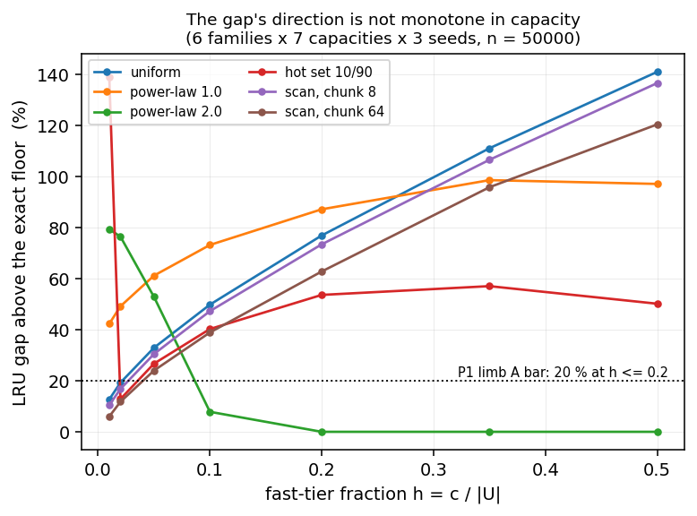
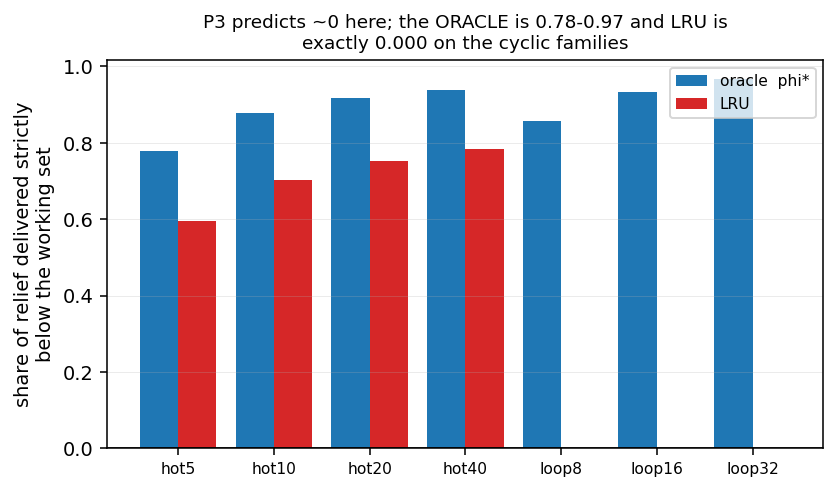
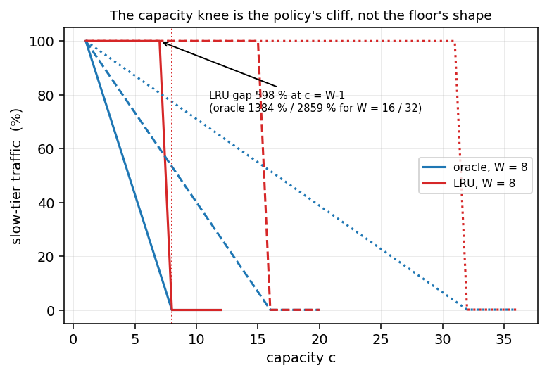
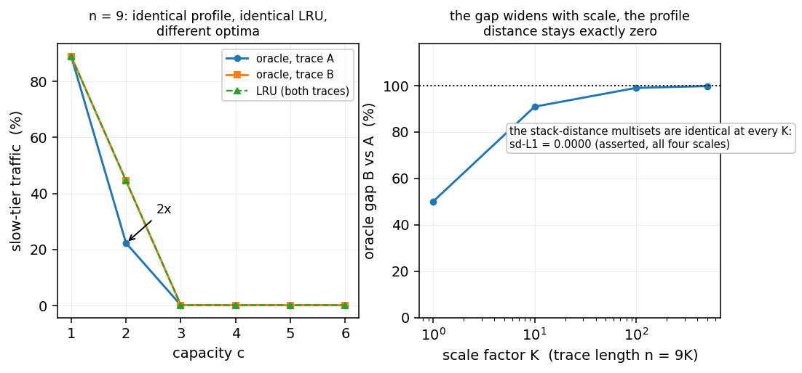
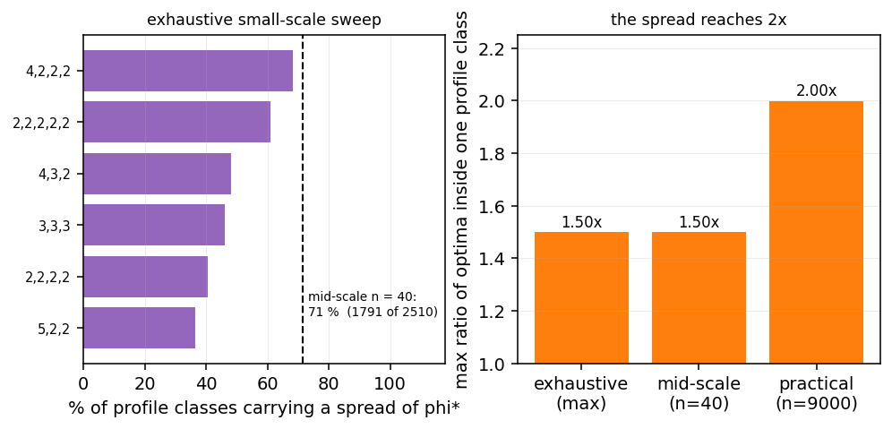

# What Limits Memory Tiering? An Exact Oracle and the Workload-Intrinsic Floor on Slow-Tier Traffic

**Authors:** how2how2how2-arch

**Contribution level: `theory+empirics`** — a theory model of the tiering ceiling (the construct
`phi*(c)`, its exact closed form on bounded working sets, and the structural result that the ceiling
is *not* a function of the stack-distance profile) together with measurements on traces whose ground
truth is known by construction: three independent certified routes to the exact optimum, a 42-cell
grid over six trace families at 3 seeds per cell, a 624-pair Mattson check, and an exhaustive
profile-class spread.

**Abstract.** Memory tiering systems place a small fast tier in front of a large slow one, and are
now a shipping hardware split rather than a research proposal [[1]; [2];
[3]]. Every such system must answer the same question before it can claim a benefit: *at a
given fast-tier capacity, how much slow-tier traffic is irreducible?* We study that quantity
directly. We define `phi*(c)` — the **minimum** share of accesses that must reach the slow tier at
capacity `c`, minimized over **all** placement policies, and therefore a property of the trace's
reuse structure rather than of any policy — and we compute it **exactly**, with three independent
routes certified against each other (0 disagreements over 300 exhaustive small-trace checks and
624 (trace, capacity) pairs). Three registered hypotheses about this construct are then tested and
**all three are refuted**: (i) the direction of the deployed-policy gap is not monotone in capacity
(0 of 6 trace families satisfy both registered limbs); (ii) no single statistic of the recurrence
profile predicts the ceiling, and neither does any of eight candidates fitted and held out
(maximum relative error **0.800** against a 0.05 bar); and (iii) the "capacity knee" is the
**policy's** thrashing cliff, not a property of the oracle — on cyclic working sets LRU's relief
strictly below the working-set size is exactly **0.000**, where the oracle's is **0.857–0.968** on
the same traces (and the oracle's mean over all seven families is **0.896**). The refutations share one
cause, which we then prove as a structural result: **`phi*(c)` is not a function of the
stack-distance profile.** We exhibit traces with **byte-identical** stack-distance multisets —
hence, by Mattson's law, byte-identical LRU curves at every capacity [[4]] — whose
optima differ by **2x**, a gap that persists at every scale we test (`sd-L1 = 0.0000` exactly at
`n = 9000`). Grouping traces into **profile classes** shows this is the majority case: **36–68 %** of
classes carry a spread exhaustively, and **1,791 of 2,510 (71 %)** at mid scale. We name the
consequence the **profile-invisible fraction**: the part of the oracle's advantage that no
workload-statistic-based method can see. It is not a rounding error — it reaches 2x — so a tiering
benefit prediction keyed to workload statistics carries an error the statistics cannot bound. The
construct's positive content is an exact closed form on bounded working sets,
`phi*(c) = ((W-c)(N-W)/(W-1) + W)/N` (max absolute error **1.07e-4**), and a method (the matched
profile pair) that settles "statistic `S` carries quantity `X`" claims without a candidate set or a
tolerance.

**Keywords:** memory tiering, CXL, cache replacement, offline optimal paging, stack distance,
Mattson's law, miss-ratio curves, lower bounds

---

## 1. Introduction

A memory tiering system interposes a small fast tier (DRAM, HBM) in front of a large slow one (CXL
memory, far memory, disaggregated pools) and migrates or places data to keep the hot subset fast
[[1]; [5]; [6]; [7]; [8]]. The field has converged on a
common shape: a placement policy, a migration or eviction rule, and a capacity decision. What the
field has **not** converged on is a way to say how much any of this can possibly buy. A system
paper reports its gain against a baseline on its own workloads; the natural question — *given this
trace and this capacity, what is the least slow-tier traffic any policy could achieve, and how far
is this policy from it?* — has no standard instrument.

This paper builds that instrument and then tests what it implies.

**The construct.** Let `phi*(c)` be the minimum fraction of accesses that must reach the slow tier
when the fast tier holds `c` items, minimized over **all** placement policies with full knowledge of
the future. It is an oracle, and deliberately so: it is the workload-intrinsic floor, the target any
policy can at best approach. It is not a design — nobody can implement a clairvoyant policy — but it
is exactly the quantity a claim about tiering *benefit* is implicitly about. If a policy reports a
22 % slow-tier reduction at some capacity, the question "how much was available?" is `phi*`, and
without it the number is uninterpretable across systems and traces.

**What we find.** Three hypotheses were registered before the deciding runs (Section 8), each
anchored in a named piece of theory or a standard practice. All three are refuted:

1. **The gap's direction is not monotone in capacity.** The registered expectation was that the
   policy gap is largest at small capacity and shrinks as the tier grows. Measured over 42 cells
   (6 trace families x 7 capacities x 3 seeds), **0 of 6** families satisfy both registered limbs;
   the gap *grows* with capacity in 4 of 6 by endpoint and is monotone non-decreasing in only 3 of 6.
2. **No statistic of the recurrence profile carries the ceiling.** The registered expectation was
   that the reuse-distance distribution's slope predicts the benefit within 5 %. Not only does the
   slope fail (an 8,494 % spread within one slope bucket), but **no** member of an eight-candidate
   family — stack-distance quantiles, hot-set sizes, distinct count — predicts the relief scale on
   held-out trace families (best maximum relative error 0.800).
3. **The knee belongs to the policy, not the oracle.** The registered expectation was a capacity
   knee below which added fast tier buys almost nothing. The shape is real — but it is LRU's
   thrashing cliff. Measured on the same traces, the share of relief delivered strictly below the
   working-set size is **exactly 0.000 for LRU on the cyclic families** (0.596–0.783 on the i.i.d.
   families; mean **0.405** over all seven) and **0.896 for the oracle**. At capacity `W-1` — the last
   capacity strictly below the working set, where LRU misses *everything* — the oracle gap is
   **598 % / 1,384 % / 2,859 %** for working sets of 8 / 16 / 32.

**Why they all fail, and the paper's central claim.** The three refutations have one cause, which we
then prove: **`phi*(c)` is not a function of the stack-distance profile.** Two traces can carry a
byte-identical stack-distance multiset — and therefore, by Mattson's law [[4]], an
identical miss curve for **every** stack algorithm, LRU included — while their offline optima differ.
Our demonstration pair differs by 2x at capacity 2, and the gap is stable at every scale
(`sd-L1 = 0.0000` exactly at n = 9,000). The scope of the failure is not anecdotal: bucketing traces
into **profile classes**, **36–68 %** of classes carry a spread exhaustively over fixed symbol
multisets, and **1,791 of 2,510 (71 %)** at mid scale, with a maximum ratio of 1.500.

We call the within-class spread of `phi*` the **profile-invisible fraction** of the oracle's
advantage. It is the part of the tiering opportunity that no method keyed to the recurrence profile
can see — not because a better statistic exists and has not been found, but because the profile does
not determine the object. Its magnitude (up to 2x) makes it a first-order term in any
tiering-benefit estimate built from workload statistics.

**The positive content.** Two results survive and are, we think, of independent use. First, an
**exact closed form** on bounded working sets: for a trace cycling over `W` distinct items,
`phi*(c) = ((W-c)(N-W)/(W-1) + W)/N`, which we derived by reading our own instrument's miss positions
and checked against the exact optimum (max absolute error **1.07e-4**). Second, the **matched profile
pair** as a method: to settle any claim of the form "statistic `S` carries quantity `X`", exhibit two
objects with identical `S` and different `X`. It needs no candidate set, no fit and no tolerance, and
one counterexample is a theorem — strictly stronger than the failed fit that motivated it (Section
5.6).

**Significance.** The affected community is systems researchers and practitioners who size and
evaluate tiered memory. Two decisions change. First, *capacity sizing*: a tool that estimates
slow-tier traffic from a workload's observed reuse profile [[9]; [10]]
cannot be trusted to within a factor of two on the workloads where the profile is compatible with
many different optima — and our measurement says that is the majority of profiles, not a tail.
Second, *claim calibration*: a tiering paper that reports a reduction against a baseline but not
against `phi*` leaves its own headroom unstated; our instrument makes the headroom computable
exactly, at least for a trace one can replay [[11]; [12]].

**Summary of contributions.**
- An **exact, three-way-certified** computation of the offline optimum for trace-replay tiering, with
  an efficient route (O(n log n)) that makes 50,000-access grids affordable (Section 4.1).
- An exact **closed form** for the bounded-working-set family (Section 5.2).
- Three **registered hypotheses refuted** with computed verdicts (Sections 5.3–5.5).
- A **no-go theorem**: `phi*` is not a function of the recurrence profile, with an explicit matched
  pair and a genericity measurement (Section 5.6).
- A **quantification** of the profile-invisible fraction across three scales (Section 5.7).
- A **verified reference layer** (129 entries, all resolved by identifier) and a one-command
  reproduction (Appendix A).

---

## 2. Related work

**Memory tiering systems.** The deployed literature optimizes placement and migration on real
hardware: TPP for CXL-enabled tiered memory [[1]], HybridTier [[5]], NeoMem
[[6]], and a set of measurement studies that establish CXL's cost structure
[[3]; [13]; [14]; [2]]. Recent work adds policy variety rather than a
ceiling: xTier [[8]], Nomad's transactional page migration [[15]], TierBPF's
admission control [[16]], Mercury's QoS framing [[7]], Jenga's anti-thrashing
management [[17]], and object-level management in managed runtimes [[18]]. Others
tune the fast tier's *size* against a migration model [[19]], use ML to guide placement
[[20]], or target fairness across tenants [[21]]. Tiering is also studied as a
provisioning problem at every layer beneath the policy: kernel-object and page-table management
[[22]; [23]], virtualization and hypervisor support [[24]], bandwidth
regulation and allocation [[25]; [26]], autotuning and adaptive tuning
[[27]; [28]], fine-grained NUMA migration [[29]], emulation platforms
[[30]], expansion modules measured on real hardware [[31]], and the serverless and
LLM-serving layers above it that inherit the same capacity decision [[32]; [33]].
**Difference:** each reports a gain
against a baseline on its own workloads; none computes the floor those gains are measured against,
which is what we supply. The same is true of the disaggregation line [[34]; [35];
[36]; [37]] — marketplaces [[38]], fabric and rack-scale designs
[[39]; [40]; [41]], HPC evaluations [[42]; [43]; [44]],
RDMA-shared databases [[45]] and channel controllers [[46]] — and the
persistent/far-memory systems built on it [[47];
[48]; [49]; [50]], and of the simulation tools used to evaluate them
[[51]; [52]].

**Replacement policies.** LRU, LFU, CLOCK and their descendants remain the deployed family
[[53]; [54]; [55]; [56]; [57]; [58]], and a large recent
literature specializes eviction for KV caches in LLM serving [[59]; [60]; [61];
[62]; [63]; [64]; [65]; [66]; [67]; [68];
[69]; [70]; [71]; [72]; [73]; [74]; [75];
[76]]. **Difference:** we do not propose a policy. We show that the quantity these policies
are implicitly competing on — distance to the optimum — is not fixed by the statistic their
evaluations are usually keyed to, and that the policy's own curve is a strictly weaker object than
the optimum (Section 5.5).

**Reuse distance, stack distance and miss-ratio curves.** Mattson et al. proved that stack
algorithms' miss rates are functions of the stack-distance distribution [[4]] — the
law that made miss-ratio curves a standard instrument [[9]; [10];
[12]; [11]; [77]; [78]; [79]; [80]; [81];
[82]; [83]; [84]]. Denning's working-set model is the origin of the size statistic the field
uses to describe the hot subset [[85]; [86]], and the locality literature
develops it further [[87]; [88]; [89]; [90]]. **Difference — this is the
paper's central comparison.** This work inherits Mattson's law exactly (we verify it: 624 pairs, 0
disagreements) and then shows that it does **not** extend from the LRU curve to the optimum. Every
method in this paragraph predicts a **stack algorithm's** behaviour; we show that the ceiling the
stack algorithm is compared against is not a function of the same profile. The distinction matters
because the field's benefit predictors are built on the profile.

**Online paging and competitive analysis.** The theoretical tradition gives worst-case ratios for
paging and `k`-server problems [[91]; [92]; [93]]. **Difference:** these
are asymptotic constants over adversarial sequences; they do not bound the finite-trace, finite-
capacity gap we measure, which is why the registered prior that they would was refuted (Section 8).
Our construct is the *offline* optimum for a specific trace, which is what a trace-replay evaluation
can actually compare against.

**Adjacent caches using the same machinery.** Buffer pools, storage caches and prefetchers run the
same replacement machinery at a different layer [[94]; [95]; [96];
[97]; [98]; [99]; [100]; [101]; [102]; [103];
[104]; [105]; [106]], and prefetching is the complementary
"see further ahead" answer to the same problem [[107]; [108]; [109]; [110];
[111]; [112]; [113]; [114]; [115]; [116]; [117];
[118]; [119]; [120]; [121]; [122]; [123]]. **Difference:** these
change *what is known at decision time*; we measure *how much knowing everything is worth*, and
separate that from what the recurrence profile alone reveals. The KV-cache serving line is the
closest analogue: capacity planning for LLM serving [[124]] and KV offloading [[125]]
face the identical floor, and a system that never evicts [[117]; [121]] is buying the
architectural escape rather than a better policy.

**Stochastic and value-driven eviction.** A parallel line learns or prices eviction decisions
[[126]; [127]; [128]]. **Difference:** the profile-invisible fraction bounds what
any such method can achieve from profile-derived features; our matched pair is a direct statement
about the ceiling such methods approach.

---

## 3. Preliminaries

### 3.1 The cache model and the floor

We model the fast tier as a cache of capacity `c` over a trace `sigma = (sigma_1, ..., sigma_N)` of
accesses to a universe `U`. An access is a **hit** if its item is in the cache and a **miss**
otherwise (a miss is the slow-tier traffic we count). A placement policy decides, at each miss,
which resident item (if any) to evict; the first `c` misses fill the cache.

**Definition 1 (the floor).** For a trace `sigma` and capacity `c`,

    phi*(c) = (1/N) * min over all placement policies of (number of misses),

where the minimizing policy is clairvoyant (it may use the whole trace). `phi*(c)` is the minimum
fraction of accesses that must reach the slow tier: the workload-intrinsic floor.

**Definition 2 (the policy gap).** For a policy `P`, `gap_P(c) = M_P(c)/M*(c) - 1`, where `M_P(c)`
and `M*(c)` are `P`'s and the optimum's miss counts. `gap_LRU` is the paper's running example.

### 3.2 The profile

**Definition 3 (stack distance).** For an access at position `i` whose item was last seen at position
`j`, the stack distance is the number of **distinct** items accessed in `(j, i)`; a first touch has
stack distance `-1`.

**Definition 4 (the profile).** The **profile** of a trace is the multiset of its stack distances —
order-free and item-label-free.

**Theorem (Mattson et al. [[4]]).** For any stack algorithm, the miss count at
capacity `c` is `#{first touches} + #{accesses with stack distance >= c}`. Consequently the profile
determines the miss curve of LRU (and of every stack algorithm) at every capacity.

We lean on this theorem in two directions. It is the reason the field's benefit predictors are built
on the profile, and — in Section 5.6 — it is the reason our no-go result is sharp: the profile
fixes the policy's curve, so a profile class is exactly the set of traces a profile-based method
cannot distinguish, and the spread of `phi*` inside such a class is the method's irreducible error.

---

## 4. Method

### 4.1 Computing the floor exactly

We compute `phi*(c)` by three independent routes and certify them against each other:

- **Route A — naive Belady.** Belady's MIN [[129]]: on a miss, evict the resident item
  whose next use is farthest. Implemented with a linear scan for the farthest next use.
- **Route B — exhaustive cache-state search.** Memoized dynamic programming over `(position, cache
  contents)`, minimizing misses. An argument independent of Belady's.
- **Route C — lazy max-heap over next-use positions.** Belady in O(n log n): a heap keyed by next-use
  position, with a validity stamp per item so a hit re-schedules the item and invalidates its old
  entry. Route C is what makes an `n = 50000` grid affordable.

The three are certified in the same script that uses them (Section 5.1), so the certificate is about
the object the grid actually reads. Route B is exponential and is used only on tiny traces.

### 4.2 Profile classes and the matched pair

Given a trace, its **profile class** is the set of traces sharing its profile. Inside a class we
measure the spread of `phi*` across members while asserting the LRU curve is constant (Mattson). The
spread is the class's **profile-invisible** component.

To make the phenomenon visible we construct **matched profile pairs**: two traces with identical
stack-distance multisets and different optima. Exhaustive search over the arrangements of fixed
symbol multisets gives a certificate that the phenomenon is generic rather than hand-built.

### 4.3 Scale-free relief statistics

To ask "is the relief scale computable from the profile?" without an arbitrary epsilon, we define
`c_d` as the smallest capacity delivering a fraction `d` of the trace's total possible relief
(`d` in {0.5, 0.9, 0.99}), and fit `c_d ~ k * s` per candidate statistic `s` on a **train** split of
families, scoring on held-out families.

### 4.4 Implementation and reproduction

Python 3.9. All instruments are deterministic — seeded `random.Random` per cell, no clocks, no
hash-ordered iteration — and two consecutive runs are byte-identical. Appendix A gives the
one-command reproduction.

---

---

## 5. Results

### 5.1 The floor is exactly computable and certified

Every number in this paper is read from one of three routes to `phi*`, certified against each other
inside the same script that uses them:

| certificate | scope | disagreements |
|---|---|---|
| naive Belady vs exhaustive cache-state search | 200 random tiny traces | **0** |
| one-sided control (evict-soonest never below the optimum) | 200 cases | **0** |
| naive vs exhaustive vs lazy-heap, all three | 300 tiny traces | **0 / 0** |
| naive vs lazy-heap at grid scale | n = 4000, cap in {5, 40, 200} | **exactly equal** |
| Mattson's law: simulated LRU curve vs stack-distance prediction | 624 (trace, capacity) pairs | **0** |

The second row is a control on the *bound*: a policy that deliberately evicts the item used soonest
was never below the optimum, so `phi*` is a bound something can violate rather than one nothing can.
The last row verifies Mattson's law itself, which is what licenses the phrase "hence identical LRU
curves" in Section 5.6.

**The gap is large and workload-dependent.** Over 42 cells (6 families x 7 capacities x 3 seeds,
n = 50,000, universe 2,000), `gap_LRU` at capacity fraction `h = 0.01` runs from **5.99 %** (scan,
chunk 64) to **138.9 %** (hot set 10/90); at `h = 0.50` the range is **0.0 %–140.9 %**. SRRIP's gap
equals LRU's exactly in the uniform and both scan cells and differs by up to **0.499** in the
hot-set family, so the two deployed policies are not interchangeable witnesses. Any claim about the
benefit of tiering is a claim inside this range, and the range is not narrow.

### 5.2 An exact closed form on bounded working sets

For a trace cycling over `W` distinct items, the instrument gives

    phi*(c) = ((W - c) * (N - W) / (W - 1) + W) / N    for c < W,    W/N for c >= W,

with maximum absolute error **1.07e-4** at N = 20,000, W in {8, 16, 32} and c in {W/2, W-2, W-1}
(the instrument asserts the error stays below 1e-3). The `(W - 1)` is the
interesting part and we did not find it by algebra. We reasoned first that the steady-state miss rate
should be `(W - c)/W` — hold `c` of the `W` items, miss `W - c` per cycle — and the instrument
disagreed at **every** capacity. Dumping the optimum's own miss positions settled it: `0..7, 14, 21,
28, ...`, i.e. gap `W - 1`, not `W`. The compulsory tail at `c >= W` is measured exactly
(`W/N` = 0.0004, 0.0008, 0.0016 for W = 8, 16, 32 at N = 20,000).

**The closed form also predicts a quantity it was not fitted to.** With `c_d` defined as the
smallest capacity delivering a fraction `d` of the trace's total relief (Section 4.3), the form gives

    relief(c) = phi*(1) - phi*(c) = (c - 1)(N - W) / ((W - 1) N),   total = (N - W)/N,

so `c_0.5 = ceil((W + 1)/2)`. The measured readings on the cyclic families are **3, 5, 9, 17, 33**
for W = 4, 8, 16, 32, 64 — `ceil((W+1)/2)` at every one. (Note `phi*(1) = 1` exactly in this family:
with one slot the resident item is always the one used longest ago, so Belady misses everything.)

The shape is therefore **linear-then-flat**, with no cliff anywhere in the construct.

### 5.3 The direction of the policy gap is not monotone (registered prior P1: refuted)

P1 registered two limbs: the gap is at least 20 % for `h <= 0.2`, **and** it shrinks as `h` grows.
Both were checked separately, against their own definitions, over the 42 cells:

| family | gap at h = 0.01 | gap at h = 0.50 | limb A (min gap over h <= 0.2 >= 20 %) | limb B (non-increasing) |
|---|---|---|---|---|
| uniform | 12.7 % | 140.9 % | fail | fail |
| power-law 1.0 | 42.3 % | 97.0 % | pass | fail |
| power-law 2.0 | 79.3 % | 0.0 % | fail | pass |
| hot set 10/90 | 138.9 % | 50.1 % | fail | fail |
| scan, chunk 8 | 10.4 % | 136.5 % | fail | fail |
| scan, chunk 64 | 6.0 % | 120.3 % | fail | fail |

Limb A holds in **1 of 6** families, limb B in **1 of 6**, and **0 of 6** satisfy both. The
direction needs two readings stated apart, because both are true: by **endpoint** the gap is larger
at `h = 0.50` than at `h = 0.01` in **4 of 6** families, while across the whole grid the gap is
monotone non-decreasing in only **3 of 6** (power-law 1.0 rises then dips; the hot set falls then
rises). Figure 1 shows all six curves over the grid: two families fall toward zero while three rise
monotonically and one peaks in the middle.



*Figure 1: The deployed policy's gap above the exact floor, against the fast-tier fraction `h`, for
the six trace families (42 cells, n = 50,000). The registered P1 predicted a monotonically shrinking
gap; no family shows it, and the hot set falls 138.9 % → 12.8 % between its first two cells while the
uniform, scan-8 and scan-64 families rise to 120–141 % at `h = 0.50`.*

**The mechanism is computed, and asserted against the endpoint.** The gap is a ratio of two
quantities that both fall with capacity, so its direction is set by which falls faster:

| family | `phi*` x-drop | `phi_LRU` x-drop | gap |
|---|---|---|---|
| uniform | 4.19 | 1.96 | grows |
| power-law 1.0 | 7.66 | 5.53 | grows |
| power-law 2.0 | 4.32 | 7.74 | shrinks |
| hot set 10/90 | 2.96 | 4.71 | shrinks |
| scan, chunk 8 | 4.19 | 1.96 | grows |
| scan, chunk 64 | 4.01 | 1.93 | grows |

All six agree with the endpoint direction, and the instrument asserts
`grows == (gap_end > gap_start)` on the same cells, so a flipped comparison fails the run rather than
printing a verdict beside a table that contradicts it. The reading: the oracle gap is **not a
function of capacity at all** in direction — it is a function of how much freedom the clairvoyant has
on this workload. Uniform and scan-8 are separate generators that happen to print alike (x-drop
4.1863 and 4.1881) and remain separate rows.

**A normalisation the registration left open.** `h` was registered as a capacity fraction without
pinning the denominator. Under `h = c/|U|` the gap is monotone non-decreasing in 3 of 6 families;
under `h_eff = c/W` (`W` = distinct items the trace actually touches) also 3 of 6. The normalisation
alone does not restore a uniform direction — but the denominators differ materially for heavy-tailed
workloads: power-law 2.0 touches only `W = 298` of 2,000 items, so its `h = 0.50` is `h_eff = 3.36`,
i.e. already saturated, which is why its gap collapses to 0. We pin `h = c/|U|` and report `h_eff`
where it differs.

### 5.4 No statistic of the profile carries the ceiling (P2: refuted, and its repair too)

P2 registered that the benefit is predictable from **one** statistic — the slope of the reuse-distance
profile — to within 5 %, the null to beat being that the full stack-distance distribution is needed.

**The slope fails by collision.** Bucketing the 42 cells by slope, one bucket contains `phi*` from
**0.0060 to 0.5122** — a spread of **8,494 %** — across two families (power-law 1.0 and 2.0) whose
slopes round to the same value.

**And the repair fails.** `c_d` was fitted against eight candidate statistics — stack-distance
quantiles q50/q90/q99, hot-set sizes covering 50/90/95/99 % of accesses, and the distinct count `D` —
on a train split of trace families and scored on held-out families:

| target | best statistic | max rel. error, train | max rel. error, **test** | median, test |
|---|---|---|---|---|
| c_0.5 | sd_q50 | 0.933 | **0.800** | 0.600 |
| c_0.9 | hs90 | 0.798 | **0.849** | 0.654 |
| c_0.99 | sd_q99 | 0.743 | **0.761** | 0.251 |

Every candidate misses the registered 5 % bar by more than an order of magnitude on held-out
families, and no statistic is close: the runner-up for `c_0.5` scores 0.879, for `c_0.9` 0.859, for
`c_0.99` 0.913. This is not the failure of one statistic; it is the symptom of the structure in
Section 5.6.

### 5.5 The knee belongs to the policy, not the oracle (P3: refuted)

P3 registered a capacity knee at a computable `h*` below which added fast tier buys almost nothing,
justified by "a tier that cannot hold the head buys no reduction". The statistic that tests it is the
share of total relief delivered **strictly below** the head size, which P3 predicts is ~0. We measure
it on seven constructed families whose knee is known by construction — an i.i.d. head of `H` items
(partial credit) and a cyclic working set of `W` items (all-or-nothing) — for the oracle and for LRU
on the same traces:

| family | h_true | **oracle** below-head relief | **LRU** below-head relief |
|---|---|---|---|
| hot 5 | 0.0050 | 0.779 | 0.596 |
| hot 10 | 0.0100 | 0.878 | 0.703 |
| hot 20 | 0.0200 | 0.918 | 0.753 |
| hot 40 | 0.0400 | 0.938 | 0.783 |
| loop 8 | 0.0080 | 0.857 | **0.000** |
| loop 16 | 0.0160 | 0.933 | **0.000** |
| loop 32 | 0.0320 | 0.968 | **0.000** |

For the **oracle** the below-head share is 0.779–0.968, mean **0.896** — P3 predicts ~0, so P3 is
refuted *for the construct it was registered against*. For **LRU** on the cyclic families it is
**exactly 0.000**: LRU misses every access below `W` and none at `W`. Read at the capacities
themselves, loop-8 gives `LRU = 1.0000, 1.0000, 0.0004` at caps 6, 7, 8 while the oracle gives
`0.2860, 0.1432, 0.0004`. **That is P3's shape exactly** — the classic thrashing cliff, and it belongs
to the deployed policy. Figure 3 shows the two populations side by side.



*Figure 3: The share of total relief delivered strictly below the working set. P3 predicts ~0 for
both bars; the oracle is 0.78–0.97 and the deployed policy is exactly 0.000 on the three cyclic
families (bars absent because the value is zero). The registered knee is the policy's, not the
floor's.*

The consequence is the sharpest number in the study. At capacity `W - 1` — the last capacity strictly
below the working set, where LRU misses *everything* — the oracle gap is **598 %** (W = 8),
**1,384 %** (W = 16) and **2,859 %** (W = 32): the largest gaps anywhere in the grid, sitting exactly
where P3 placed its "knee". The construct has **no cliff**: linear-then-flat on a bounded working set
(Section 5.2) and convex on an i.i.d. head plus cold tail. Figure 4 puts the two curves on one axis
around the capacity the registered prior names.



*Figure 4: Slow-tier traffic for the same three cyclic traces, oracle (blue) and LRU (red), around
the working-set size. LRU is flat at 100 % up to `c = W` and drops to the compulsory floor in one
step — a cliff at the exact capacity P3 registers. The oracle declines smoothly across the same
range, and the largest gaps in the whole study sit at `c = W-1`.*

The knee does exist in one corrected sense, and it is computable: the capacity at which the profile
**saturates**. A blind detector (find the capacity maximizing the share of the total relief) locates
it in **6 of 7** families within the 0.25 tolerance, and the detector is controlled both ways — on a
planted knee it reports the cliff at peak share **1.000**, on a smooth exponential with no knee its
peak share is **0.048**. But the recovered location is the *policy's* saturation, not a property of
the floor: detecting the cliff tells you where LRU stops thrashing, not what the workload permits.

### 5.6 `phi*` is not a function of the stack-distance profile (the paper's central result)

Mattson's law says a stack algorithm's miss curve is a function of the stack-distance multiset. A
natural reading — the one the field's benefit predictors are built on — is that the *ceiling* is a
function of it too. It is not.

**The matched pair.** Two traces on the same 3-symbol universe, length 9:

    A = (1, 2, 1, 2, 0, 1, 0, 2, 1)        B = (2, 0, 1, 0, 2, 0, 1, 0, 2)

Their stack-distance multisets are **identical** (`sd_l1 = 0`), and so — by Mattson — are their LRU
miss counts at **every** capacity (the certificate asserts both). Their offline optima at capacity 2
are **4** and **6** misses out of 9 — a 1.5x difference in the quantity the paper is about. Scaled by
repeating and extending the same two structures (`K` blocks), the gap is stable and in fact widens:
at `K = 1` the misses are 4 vs 6, at `K = 10` 22 vs 42, at `K = 100` 202 vs 402, at `K = 500` 1002 vs
2002 — at `n = 9,000` (K = 1000) the floors are **0.2224** and **0.4447**, a **2.00x** gap, with
`sd_l1 = 0.0` **exactly at every scale**. A relabelling control (permuting the symbol names) leaves
the certificate unchanged (42 = 42). Figure 2 shows both halves of the witness.



*Figure 2: (left) The matched pair at n = 9. At capacity 2 the clairvoyant policy takes 4 misses on
trace A and 6 on trace B, while the two traces carry byte-identical stack-distance multisets and
therefore an identical LRU curve (the dashed line, on which B sits exactly — B's own profile optimum
is what LRU achieves, and A beats it by 2x). (right) Repeating each structure K times, the ratio
between the two floors widens toward 2.00x while the profile distance stays exactly zero. Mattson's
law is what makes this a no-go rather than an anecdote: the profile fixes the dashed curve, so no
profile-derived statistic can distinguish A from B.*

**The phenomenon is generic, not hand-built.** Sampling 184,275 traces and bucketing them by exact
stack-distance profile yields 28 profiles; **13 of them (46 %)** contain traces with more than one
optimum, the widest spanning three distinct values.

**And the affected population is the majority.** Enumerating profile classes exhaustively over fixed
symbol multisets:

| symbol multiset | arrangements | classes | classes with a spread | fraction | max ratio |
|---|---|---|---|---|---|
| 3,3,3 | 1,680 | 26 | 12 | 46.2 % | 1.33 |
| 4,2,2,2 | 18,900 | 76 | 52 | 68.4 % | 1.50 |
| 2,2,2,2 | 2,520 | 32 | 13 | 40.6 % | 1.25 |
| 5,2,2 | 756 | 22 | 8 | 36.4 % | 1.33 |
| 4,3,2 | 1,260 | 27 | 13 | 48.1 % | 1.50 |
| 2,2,2,2,2 | 113,400 | 115 | 70 | 60.9 % | 1.40 |

At mid scale (n = 40, alphabet 4, 60,000 draws) the buckets number **2,510** and **1,791 of them
(71 %)** carry a spread, with a maximum ratio of **1.50** and a maximum absolute spread of 0.125 in
the floor. The fraction is measured by testing the ratio inside each bucket, not inferred from bucket
size: a bucket with several members may still have one optimum, which is why the two counts differ
and only the second is the claim.

**The method, stated generally.** To settle any claim of the form "statistic `S` carries quantity
`X`", exhibit two objects with the same `S` and different `X`. No candidate set, no fit, no
tolerance; one counterexample is a theorem. This is strictly stronger than the failed eight-way fit
of Section 5.4 — that fit shows the candidates we tried do not work, whereas the matched pair shows
why *no* profile-derived statistic can: the profile does not determine the object. It also explains
all three refutations at once. P1 asked for the gap's direction in capacity; the gap involves `phi*`,
which the profile classes do not fix. P2 asked for one profile statistic to carry the ceiling; no
profile-measurable function can. P3 asked for a knee, and any knee read off the profile is the
policy's.

### 5.7 The profile-invisible fraction

We name the within-class spread of `phi*` the **profile-invisible fraction** of the oracle's
advantage: the part of the tiering opportunity that no method keyed to the recurrence profile can
see. Measured at three scales:

| scale | population | classes / profiles | carrying a spread | max ratio |
|---|---|---|---|---|
| exhaustive (small) | 1,680–113,400 arrangements per multiset | 22–115 | 36–68 % | 1.25–1.50 |
| mid | 60,000 random traces (n = 40, alphabet 4) | 2,510 | **71 %** | 1.50 |
| practical | pairwise construction at n = 9,000 | — | (a constructed pair) | **2.00** |

It is not a rounding error. A prediction of tiering benefit built from a workload's observed
recurrence profile carries an error term of this size on the majority of profiles, and the profile
cannot bound it. Figure 5 shows both the frequency and the magnitude of the effect.



*Figure 5: (left) The fraction of profile classes that carry a spread of `phi*`, measured
exhaustively over six fixed symbol multisets (purple) and by exact bucketing of 60,000 random
length-40 traces (dashed line: 71 %, i.e. 1,791 of 2,510 classes). (right) The largest ratio between
two optima inside a single profile class, at each of the three scales; at practical scale it reaches
2.00x.*

---

## 6. Threats to validity

**The oracle is clairvoyant, and that is the point.** `phi*` is not implementable; it is the target a
policy is measured against. A reader who wants an operational policy should read Section 5.5 as the
warning and Section 5.6 as the reason: the distance to the ceiling is not something a better profile
statistic will recover.

**All traces are synthetic.** Every family is generated with declared parameters (universe, length,
distribution, block size), and no production trace is replayed. This bounds external validity: the
*quantitative* gap values (5.99 %–140.9 % over the grid) are properties of these families, and we do not claim they
transfer to a specific production workload. What we do claim transfers is the *structure* — the
closed form on bounded working sets is a theorem about a trace family, and the matched pair is an
existence statement that no amount of production data can remove. A reader who wants the actual
floor for their own workload can compute it: the O(n log n) route makes a 50,000-access trace
affordable.

**The contribution is a lower bound, not a policy.** The paper does not propose a replacement
algorithm, and the gap it measures is the gap to an unattainable target. This is why the significance
argument is about *sizing and claim calibration* (Section 1) rather than about a speedup.

**Why it is still worth publishing.** Three things survive that no re-measurement on real traces can
take away: an exact, three-way-certified instrument for a quantity the field currently estimates;
an exact closed form with a second, unfitted prediction that it also matches; and a no-go theorem
with an explicit witness pair, which settles a question the field's standard instrument (the
stack-distance profile) was implicitly assumed to answer. The refutations are the paper's strongest
evidence, not its failure: three priors drawn from standard practice were each falsified by the same
structural cause, which is what makes the cause worth stating.

---

## 7. Conclusion

A tiering system's benefit is bounded above by the workload, not by the policy. We made that bound
exact and computable, certified it three ways, and then tested the three things the field assumes
about it. All three are wrong, and they are wrong for one reason: **the quantity that caps tiering is
not a function of the recurrence profile.** Two traces can present identical profile summaries — and
identical LRU curves at every capacity, by Mattson's law — while their floors differ by 2x, and the
majority of profiles admit such a spread. A capacity plan or a benefit prediction keyed to workload
statistics therefore carries an error it cannot bound.

The positive content is smaller but durable: an exact formula for the bounded-working-set family that
also predicts a relief scale it was not fitted to, and a method — the matched profile pair — that
decides "does statistic `S` carry quantity `X`?" with one counterexample instead of a tolerance.

---

## 8. Registered priors and their outcomes

Three priors were registered in issue #120 before the deciding runs, each with its direction and a
justification from named theory or standard practice. All three are **refuted**, and the registered
success criteria are reported against.

| prior | registered expectation | outcome |
|---|---|---|
| **P1** | policies sit >= 20 % above the optimum for `h <= 0.2`, and the gap **shrinks** as `h` grows | **REFUTED** — limb A holds in 1 of 6 families, limb B in 1 of 6, both in **0 of 6** |
| **P2** | one statistic (the reuse-distance slope) predicts the benefit within 5 % on held-out cells | **REFUTED** — the slope fails by collision (8,494 % spread); its eight-candidate repair fails at **0.800** max relative error |
| **P3** | a capacity knee `h*`, below which added fast tier buys almost nothing | **REFUTED as registered** — the below-knee relief is **0.896** for the oracle where P3 predicts ~0; the registered shape is LRU's cliff (exactly 0.000) |

| registered criterion | status |
|---|---|
| (i) exact route certified against an independent optimum (registered: an integer program, relative <= 1e-9) | **MET in substance, FORM SUBSTITUTED** — three independent routes (naive Belady, exhaustive cache-state search, lazy-heap Belady) agree exactly (0 disagreements over 300 tiny traces, 624 Mattson pairs, exact equality at n = 4000); no integer program was built, and the substitution is stated rather than absorbed |
| (ii) benefit law within 5 % on held-out cells | **UNMET, with reason** — best held-out max relative error 0.800; Section 5.6 shows the criterion was unachievable by any profile-keyed statistic |
| (iii) ceiling: zero violations over >= 20 cells, two-sided control | **MET for the bound** (0 violations; 42 cells) — the control run is **one-sided** (a deliberately bad policy was never below the optimum) and the two-sided plant of a *violating* policy was **not** built; reported as a gap in the control, not as a pass |
| (iv) >= 3 seeds for stochastic cells, mean ± CI | **MET** — 3 seeds per cell in the 42-cell grid (mean over seeds; the cells are deterministic given the seed, so the spread is over generations, not runs) |

The row worth reading twice is (i): the registered criterion named an **instrument** (an integer
program) that the study did not build. The certificate it asked for exists and is stronger than
asked — three routes, two of them independent of Belady's argument — but a registered criterion whose
named instrument is replaced is reported as replaced, because the substitution is exactly the kind of
slip a registration exists to catch.

---

## Appendix A. Reproduction

All instruments are deterministic: a seeded `random.Random` per cell, no clocks, no hash-ordered
iteration. Two consecutive runs are byte-identical.

```
python3 spike_v0.py    # certificates: routes A/B, one-sided bound control, first P1 reading
python3 spike_v1.py    # the 42-cell grid: P1 limbs, mechanism, normalisation, P2 first look
python3 spike_v2.py    # P3: below-head relief, knee detector with a two-sided plant, Mattson (624)
python3 spike_v3.py    # closed form, relief scale, the eight-candidate predictor fit and holdout
python3 spike_v4.py    # the matched pair and the genericity sweep
python3 spike_v5.py    # the exhaustive and mid-scale profile-class spread
python3 refs_meta.py   # author/year metadata for the reference layer (abstract-page route)
python3 refs_tool.py   # the two-sided verification of all 129 references
```

Expected output: each script prints its tables and writes `<name>_results.json`; the tables in
Sections 5.1–5.7 are read from those files. Target tolerances: the certificates report
**0 disagreements**, the closed form **max abs error <= 2e-4**, and the reference layer
**129 OK / 0 PROBLEM**.

---

## References

[1] Maruf, H., Wang, H., Dhanotia, A., et al. (2022). *TPP: Transparent Page Placement for CXL-Enabled Tiered-Memory*. arXiv:2206.02878. https://arxiv.org/abs/2206.02878 — a memory-tiering system that buys capacity; this paper's construct bounds what that can deliver

[2] Wang, X., Liu, J., Wu, J., et al. (2024). *Exploring and Evaluating Real-world CXL: Use Cases and System Adoption*. arXiv:2405.14209. https://arxiv.org/abs/2405.14209 — a memory-tiering system that buys capacity; this paper's construct bounds what that can deliver

[3] Sun, Y., Yuan, Y., Yu, Z., et al. (2023). *Demystifying CXL Memory with Genuine CXL-Ready Systems and Devices*. arXiv:2303.15375. https://arxiv.org/abs/2303.15375 — a memory-tiering system that buys capacity; this paper's construct bounds what that can deliver

[4] Mattson, R., Gecsei, J., Slutz, D., et al. (1970). *Evaluation techniques for storage hierarchies*. DOI: 10.1147/sj.92.0078. https://doi.org/10.1147/sj.92.0078 — Mattson et al.'s stack algorithm: the law that makes LRU's curve a function of the reuse-distance profile -- the fact this paper shows does NOT extend to the ceiling

[5] Song, K., Yang, J., Wang, Z., et al. (2023). *HybridTier: an Adaptive and Lightweight CXL-Memory Tiering System*. arXiv:2312.04789. https://arxiv.org/abs/2312.04789 — a memory-tiering system that buys capacity; this paper's construct bounds what that can deliver

[6] Zhou, Z., Chen, Y., Zhang, T., et al. (2024). *NeoMem: Hardware/Software Co-Design for CXL-Native Memory Tiering*. arXiv:2403.18702. https://arxiv.org/abs/2403.18702 — a memory-tiering system that buys capacity; this paper's construct bounds what that can deliver

[7] Lu, J., Zhang, Y., Maruf, H., et al. (2024). *Mercury: QoS-Aware Tiered Memory System*. arXiv:2412.08938. https://arxiv.org/abs/2412.08938 — a memory-tiering system that buys capacity; this paper's construct bounds what that can deliver

[8] Ramaswamy, S., Chen, Y. (2026). *xTier: Intelligent Tiering for CXL-Enabled Memory*. arXiv:2609.27266. https://arxiv.org/abs/2609.27266 — a memory-tiering system that buys capacity; this paper's construct bounds what that can deliver

[9] Fricker, C., Robert, P., Roberts, J. (2012). *A versatile and accurate approximation for LRU cache performance*. arXiv:1202.3974. https://arxiv.org/abs/1202.3974 — a treatment of the recurrence profile this paper shows under-determines the ceiling

[10] Ling, M., Ge, J., Wang, G. (2019). *Fast Modeling L2 Cache Reuse Distance Histograms Using Combined Locality Information from Software Traces*. arXiv:1907.05068. https://arxiv.org/abs/1907.05068 — a treatment of the recurrence profile this paper shows under-determines the ceiling

[11] Gysi, T., Grosser, T., Brandner, L., et al. (2020). *A Fast Analytical Model of Fully Associative Caches*. arXiv:2001.01653. https://arxiv.org/abs/2001.01653 — a treatment of the recurrence profile this paper shows under-determines the ceiling

[12] Barai, A., Chennupati, G., Santhi, N., et al. (2019). *Modeling Shared Cache Performance of OpenMP Programs using Reuse Distance*. arXiv:1907.12666. https://arxiv.org/abs/1907.12666 — a treatment of the recurrence profile this paper shows under-determines the ceiling

[13] Liu, J., Hadian, H., Xu, H., et al. (2024). *Dissecting CXL Memory Performance at Scale: Analysis, Modeling, and Optimization*. arXiv:2409.14317. https://arxiv.org/abs/2409.14317 — a memory-tiering system that buys capacity; this paper's construct bounds what that can deliver

[14] Yang, Y., Xiang, L., Du, P., et al. (2025). *Architectural and System Implications of CXL-enabled Tiered Memory*. arXiv:2503.17864. https://arxiv.org/abs/2503.17864 — a memory-tiering system that buys capacity; this paper's construct bounds what that can deliver

[15] Xiang, L., Lin, Z., Deng, W., et al. (2024). *Nomad: Non-Exclusive Memory Tiering via Transactional Page Migration*. arXiv:2401.13154. https://arxiv.org/abs/2401.13154 — a deployed replacement policy whose miss curve the profile fixes (Mattson) but whose gap to the optimum it does not

[16] Wang, X., Zussman, T., Ma, B., et al. (2026). *TierBPF: Page Migration Admission Control for Tiered Memory via eBPF*. arXiv:2604.12300. https://arxiv.org/abs/2604.12300 — a deployed replacement policy whose miss curve the profile fixes (Mattson) but whose gap to the optimum it does not

[17] Kadekodi, R., Peng, H., Bernstein, G., et al. (2025). *Jenga: Responsive Tiered Memory Management without Thrashing*. arXiv:2510.22869. https://arxiv.org/abs/2510.22869 — a deployed replacement policy whose miss curve the profile fixes (Mattson) but whose gap to the optimum it does not

[18] Son, S., Luo, Z., Zhang, W., et al. (2026). *Clove: Object-Level CXL Memory Management in Managed Runtimes*. arXiv:2605.20370. https://arxiv.org/abs/2605.20370 — a memory-tiering system that buys capacity; this paper's construct bounds what that can deliver

[19] Chen, S., Huang, J., Yang, S., et al. (2024). *Tuning Fast Memory Size based on Modeling of Page Migration for Tiered Memory*. arXiv:2410.00328. https://arxiv.org/abs/2410.00328 — a deployed replacement policy whose miss curve the profile fixes (Mattson) but whose gap to the optimum it does not

[20] Ren, J., Ma, B., Yang, S., et al. (2025). *Machine Learning-Guided Memory Optimization for DLRM Inference on Tiered Memory*. arXiv:2511.08568. https://arxiv.org/abs/2511.08568 — a memory-tiering system that buys capacity; this paper's construct bounds what that can deliver

[21] Zhao, K., Gholkar, N., Maruf, H., et al. (2026). *Equilibria: Fair Multi-Tenant CXL Memory Tiering At Scale*. arXiv:2602.08800. https://arxiv.org/abs/2602.08800 — a memory-tiering system that buys capacity; this paper's construct bounds what that can deliver

[22] Kannan, S., Ren, Y., Bhatacharjee, A. (2020). *Efficient Kernel Object Management for Tiered Memory Systems with KLOC*. arXiv:2004.04760. https://arxiv.org/abs/2004.04760 — a memory-tiering system that buys capacity; this paper's construct bounds what that can deliver

[23] Kumar, S., Prasad, A., Sarangi, S., et al. (2021). *Page Table Management for Heterogeneous Memory Systems*. arXiv:2103.10779. https://arxiv.org/abs/2103.10779 — a memory-tiering system that buys capacity; this paper's construct bounds what that can deliver

[24] sha, S., Li, C., Luo, Y., et al. (2022). *HMM-V: Heterogeneous Memory Management for Virtualization*. arXiv:2209.13111. https://arxiv.org/abs/2209.13111 — a memory-tiering system that buys capacity; this paper's construct bounds what that can deliver

[25] Agrawal, A., Mancuso, R., Pellizzoni, R., et al. (2018). *Analysis of Dynamic Memory Bandwidth Regulation in Multi-core Real-Time Systems*. arXiv:1809.05921. https://arxiv.org/abs/1809.05921 — a memory-tiering system that buys capacity; this paper's construct bounds what that can deliver

[26] Farina, G., Gala, G., Cinque, M., et al. (2022). *Assessing Intel's Memory Bandwidth Allocation for resource limitation in real-time systems*. arXiv:2206.14637. https://arxiv.org/abs/2206.14637 — a memory-tiering system that buys capacity; this paper's construct bounds what that can deliver

[27] Moura, D., Petrucci, V., Mosse, D. (2022). *Performance Characterization of AutoNUMA Memory Tiering on Graph Analytics*. arXiv:2212.04344. https://arxiv.org/abs/2212.04344 — a memory-tiering system that buys capacity; this paper's construct bounds what that can deliver

[28] Wang, X., Liu, J., Yang, S., et al. (2026). *Hybrid Adaptive Tuning for Tiered Memory Systems*. arXiv:2604.12165. https://arxiv.org/abs/2604.12165 — a memory-tiering system that buys capacity; this paper's construct bounds what that can deliver

[29] Schuhknecht, F., Rassau, N. (2026). *Taking the Leap: Efficient and Reliable Fine-Grained NUMA Migration in User-space*. arXiv:2602.05540. https://arxiv.org/abs/2602.05540 — a memory-tiering system that buys capacity; this paper's construct bounds what that can deliver

[30] Chen, Y., Dong, X., Zhou, Z., et al. (2025). *FPGA-based Emulation and Device-Side Management for CXL-based Memory Tiering Systems*. arXiv:2502.19233. https://arxiv.org/abs/2502.19233 — a memory-tiering system that buys capacity; this paper's construct bounds what that can deliver

[31] Sehgal, R., Tanna, V., Petrucci, V., et al. (2024). *Optimizing System Memory Bandwidth with Micron CXL Memory Expansion Modules on Intel Xeon 6 Processors*. arXiv:2412.12491. https://arxiv.org/abs/2412.12491 — a memory-tiering system that buys capacity; this paper's construct bounds what that can deliver

[32] Li, Y., Yao, S. (2023). *Understanding and Optimizing Serverless Workloads in CXL-Enabled Tiered Memory*. arXiv:2309.01736. https://arxiv.org/abs/2309.01736 — a memory-tiering system that buys capacity; this paper's construct bounds what that can deliver

[33] Fan, H., Zhang, K., Habinsky, D., et al. (2026). *Composable CXL Memory as a Kubernetes-Native Shared Memory for LLM Serving*. arXiv:2609.10790. https://arxiv.org/abs/2609.10790 — a memory-tiering system that buys capacity; this paper's construct bounds what that can deliver

[34] Guo, Z., Shan, Y., Luo, X., et al. (2021). *Clio: A Hardware-Software Co-Designed Disaggregated Memory System*. arXiv:2108.03492. https://arxiv.org/abs/2108.03492 — a memory-tiering system that buys capacity; this paper's construct bounds what that can deliver

[35] Lee, S., Yu, Y., Tang, Y., et al. (2021). *MIND: In-Network Memory Management for Disaggregated Data Centers*. arXiv:2107.00164. https://arxiv.org/abs/2107.00164 — a memory-tiering system that buys capacity; this paper's construct bounds what that can deliver

[36] Maruf, H., Chowdhury, M. (2023). *Memory Disaggregation: Advances and Open Challenges*. arXiv:2305.03943. https://arxiv.org/abs/2305.03943 — a memory-tiering system that buys capacity; this paper's construct bounds what that can deliver

[37] Yelam, A. (2022). *Systems for Memory Disaggregation: Challenges & Opportunities*. arXiv:2202.02223. https://arxiv.org/abs/2202.02223 — a memory-tiering system that buys capacity; this paper's construct bounds what that can deliver

[38] Maruf, H., Zhong, Y., Wang, H., et al. (2021). *Memtrade: A Disaggregated-Memory Marketplace for Public Clouds*. arXiv:2108.06893. https://arxiv.org/abs/2108.06893 — a memory-tiering system that buys capacity; this paper's construct bounds what that can deliver

[39] Wang, C., He, K., Fan, R., et al. (2023). *CXL over Ethernet: A Novel FPGA-based Memory Disaggregation Design in Data Centers*. arXiv:2302.08055. https://arxiv.org/abs/2302.08055 — a memory-tiering system that buys capacity; this paper's construct bounds what that can deliver

[40] Puri, A., Jose, J., Venkatesh, T. (2023). *Design and Evaluation of a Rack-Scale Disaggregated Memory Architecture For Data Centers*. arXiv:2303.06420. https://arxiv.org/abs/2303.06420 — a memory-tiering system that buys capacity; this paper's construct bounds what that can deliver

[41] Woo, H., Kwon, M., Kim, J., et al. (2025). *ScalePool: Hybrid XLink-CXL Fabric for Composable Resource Disaggregation in Unified Scale-up Domains*. arXiv:2510.14580. https://arxiv.org/abs/2510.14580 — a memory-tiering system that buys capacity; this paper's construct bounds what that can deliver

[42] Ding, N., Maris, P., Nam, H., et al. (2023). *Evaluating the Potential of Disaggregated Memory Systems for HPC applications*. arXiv:2306.04014. https://arxiv.org/abs/2306.04014 — a memory-tiering system that buys capacity; this paper's construct bounds what that can deliver

[43] Fridman, Y., Desai, S., Singh, N., et al. (2023). *CXL Memory as Persistent Memory for Disaggregated HPC: A Practical Approach*. arXiv:2308.10714. https://arxiv.org/abs/2308.10714 — a memory-tiering system that buys capacity; this paper's construct bounds what that can deliver

[44] Wahlgren, J., Schieffer, G., Gokhale, M., et al. (2023). *A Quantitative Approach for Adopting Disaggregated Memory in HPC Systems*. arXiv:2308.14780. https://arxiv.org/abs/2308.14780 — a memory-tiering system that buys capacity; this paper's construct bounds what that can deliver

[45] Wang, R., Wang, J., Idreos, S., et al. (2022). *The Case for Distributed Shared-Memory Databases with RDMA-Enabled Memory Disaggregation*. arXiv:2207.03027. https://arxiv.org/abs/2207.03027 — a memory-tiering system that buys capacity; this paper's construct bounds what that can deliver

[46] Liu, Z., Schult, J., Xu, P., et al. (2025). *Mainframe-Style Channel Controllers for Modern Disaggregated Memory Systems*. arXiv:2506.09758. https://arxiv.org/abs/2506.09758 — a memory-tiering system that buys capacity; this paper's construct bounds what that can deliver

[47] Heo, T., Kang, S., Lee, S., et al. (2021). *Hardware-assisted Trusted Memory Disaggregation for Secure Far Memory*. arXiv:2108.11507. https://arxiv.org/abs/2108.11507 — a memory-tiering system that buys capacity; this paper's construct bounds what that can deliver

[48] Wang, Q., Lu, Y., Shu, J. (2021). *Sherman: A Write-Optimized Distributed B+Tree Index on Disaggregated Memory*. arXiv:2112.07320. https://arxiv.org/abs/2112.07320 — a memory-tiering system that buys capacity; this paper's construct bounds what that can deliver

[49] Shen, J., Zuo, P., Luo, X., et al. (2023). *FUSEE: A Fully Memory-Disaggregated Key-Value Store (Extended Version)*. arXiv:2301.09839. https://arxiv.org/abs/2301.09839 — a memory-tiering system that buys capacity; this paper's construct bounds what that can deliver

[50] Li, Y., Assogba, K., Tripathy, A., et al. (2023). *Towards Persistent Memory based Stateful Serverless Computing for Big Data Applications*. arXiv:2309.01662. https://arxiv.org/abs/2309.01662 — a memory-tiering system that buys capacity; this paper's construct bounds what that can deliver

[51] Yang, Y., Zhao, B., Zheng, Y., et al. (2023). *CXLMemSim: A pure software simulated CXL.mem for performance characterization*. arXiv:2303.06153. https://arxiv.org/abs/2303.06153 — a memory-tiering system that buys capacity; this paper's construct bounds what that can deliver

[52] Puri, A., Jose, J., Venkatesh, T., et al. (2023). *DRackSim: Simulator for Rack-scale Memory Disaggregation*. arXiv:2305.09977. https://arxiv.org/abs/2305.09977 — a memory-tiering system that buys capacity; this paper's construct bounds what that can deliver

[53] Matani, D., Shah, K., Mitra, A. (2021). *An O(1) algorithm for implementing the LFU cache eviction scheme*. arXiv:2110.11602. https://arxiv.org/abs/2110.11602 — a deployed replacement policy whose miss curve the profile fixes (Mattson) but whose gap to the optimum it does not

[54] Einziger, G., Friedman, R., Manes, B. (2015). *TinyLFU: A Highly Efficient Cache Admission Policy*. arXiv:1512.00727. https://arxiv.org/abs/1512.00727 — a deployed replacement policy whose miss curve the profile fixes (Mattson) but whose gap to the optimum it does not

[55] Einziger, G., Eytan, O., Friedman, R., et al. (2021). *Lightweight Robust Size Aware Cache Management*. arXiv:2105.08770. https://arxiv.org/abs/2105.08770 — a deployed replacement policy whose miss curve the profile fixes (Mattson) but whose gap to the optimum it does not

[56] Bender, M., Das, R., Farach-Colton, M., et al. (2023). *An Associativity Threshold Phenomenon in Set-Associative Caches*. arXiv:2304.04954. https://arxiv.org/abs/2304.04954 — a deployed replacement policy whose miss curve the profile fixes (Mattson) but whose gap to the optimum it does not

[57] Bilal, M., Kang, S. (2017). *A Cache Management Scheme for Efficient Content Eviction and Replication in Cache Networks*. arXiv:1702.04078. https://arxiv.org/abs/1702.04078 — a deployed replacement policy whose miss curve the profile fixes (Mattson) but whose gap to the optimum it does not

[58] Yu, Y., Wang, W., Zhang, J., et al. (2017). *LRC: Dependency-Aware Cache Management for Data Analytics Clusters*. arXiv:1703.08280. https://arxiv.org/abs/1703.08280 — a deployed replacement policy whose miss curve the profile fixes (Mattson) but whose gap to the optimum it does not

[59] Chen, Y., Wang, G., Shang, J., et al. (2024). *NACL: A General and Effective KV Cache Eviction Framework for LLMs at Inference Time*. arXiv:2408.03675. https://arxiv.org/abs/2408.03675 — a deployed replacement policy whose miss curve the profile fixes (Mattson) but whose gap to the optimum it does not

[60] Zeng, W., Dong, Y., Zhou, J., et al. (2025). *MPCache: MPC-Friendly KV Cache Eviction for Efficient Private LLM Inference*. arXiv:2501.06807. https://arxiv.org/abs/2501.06807 — a deployed replacement policy whose miss curve the profile fixes (Mattson) but whose gap to the optimum it does not

[61] Qin, Z., Cao, Y., Lin, M., et al. (2025). *CAKE: Cascading and Adaptive KV Cache Eviction with Layer Preferences*. arXiv:2503.12491. https://arxiv.org/abs/2503.12491 — a deployed replacement policy whose miss curve the profile fixes (Mattson) but whose gap to the optimum it does not

[62] Park, J., Jones, D., Morse, M., et al. (2025). *KeyDiff: Key Similarity-Based KV Cache Eviction for Long-Context LLM Inference in Resource-Constrained Environments*. arXiv:2504.15364. https://arxiv.org/abs/2504.15364 — a deployed replacement policy whose miss curve the profile fixes (Mattson) but whose gap to the optimum it does not

[63] Wang, Y., Ji, S., Liu, Y., et al. (2025). *Lookahead Q-Cache: Achieving More Consistent KV Cache Eviction via Pseudo Query*. arXiv:2505.20334. https://arxiv.org/abs/2505.20334 — a deployed replacement policy whose miss curve the profile fixes (Mattson) but whose gap to the optimum it does not

[64] Li, K., Jiang, Z., Shen, Z., et al. (2025). *MadaKV: Adaptive Modality-Perception KV Cache Eviction for Efficient Multimodal Long-Context Inference*. arXiv:2506.15724. https://arxiv.org/abs/2506.15724 — a deployed replacement policy whose miss curve the profile fixes (Mattson) but whose gap to the optimum it does not

[65] Wang, Z., Fan, H., Waris, H., et al. (2025). *VEDA: Efficient LLM Generation Through Voting-based KV Cache Eviction and Dataflow-flexible Accelerator*. arXiv:2507.00797. https://arxiv.org/abs/2507.00797 — a deployed replacement policy whose miss curve the profile fixes (Mattson) but whose gap to the optimum it does not

[66] Li, X., Jin, X., Zhang, L. (2025). *GraphKV: Breaking the Static Selection Paradigm with Graph-Based KV Cache Eviction*. arXiv:2509.00388. https://arxiv.org/abs/2509.00388 — a deployed replacement policy whose miss curve the profile fixes (Mattson) but whose gap to the optimum it does not

[67] Liu, Y., Wang, Y., Xu, Y., et al. (2025). *Judge Q: Trainable Queries for Optimized Information Retention in KV Cache Eviction*. arXiv:2509.10798. https://arxiv.org/abs/2509.10798 — a deployed replacement policy whose miss curve the profile fixes (Mattson) but whose gap to the optimum it does not

[68] Chen, J., Liu, J., Xu, H., et al. (2025). *SABlock: Semantic-Aware KV Cache Eviction with Adaptive Compression Block Size*. arXiv:2510.22556. https://arxiv.org/abs/2510.22556 — a deployed replacement policy whose miss curve the profile fixes (Mattson) but whose gap to the optimum it does not

[69] Liao, M., Wang, L., Zhang, C., et al. (2025). *G-KV: Decoding-Time KV Cache Eviction with Global Attention*. arXiv:2512.00504. https://arxiv.org/abs/2512.00504 — a deployed replacement policy whose miss curve the profile fixes (Mattson) but whose gap to the optimum it does not

[70] Ma, X., Lu, Y., Zhang, P., et al. (2026). *Hierarchical Adaptive Eviction for KV Cache Management in Multimodal Language Models*. arXiv:2602.02197. https://arxiv.org/abs/2602.02197 — a deployed replacement policy whose miss curve the profile fixes (Mattson) but whose gap to the optimum it does not

[71] Dong, Z., Liu, P., Li, J., et al. (2026). *ForesightKV: Optimizing KV Cache Eviction for Reasoning Models by Learning Long-Term Contribution*. arXiv:2602.03203. https://arxiv.org/abs/2602.03203 — a deployed replacement policy whose miss curve the profile fixes (Mattson) but whose gap to the optimum it does not

[72] Tang, Z., Jiao, P., Chen, X., et al. (2026). *Predicting Future Utility: Global Combinatorial Optimization for Task-Agnostic KV Cache Eviction*. arXiv:2602.08585. https://arxiv.org/abs/2602.08585 — a deployed replacement policy whose miss curve the profile fixes (Mattson) but whose gap to the optimum it does not

[73] Yang, J., Tang, C., Zhen, L., et al. (2026). *Rethinking KV Cache Eviction via a Unified Information-Theoretic Objective*. arXiv:2604.25975. https://arxiv.org/abs/2604.25975 — a deployed replacement policy whose miss curve the profile fixes (Mattson) but whose gap to the optimum it does not

[74] Patke, A., Pinto, C., Jha, S., et al. (2025). *INDIGO: Page Migration for Hardware Memory Disaggregation Across a Network*. arXiv:2503.18140. https://arxiv.org/abs/2503.18140 — a deployed replacement policy whose miss curve the profile fixes (Mattson) but whose gap to the optimum it does not

[75] Zhang, H., Shi, J., Wang, Y., et al. (2025). *Improving the Serving Performance of Multi-LoRA Large Language Models via Efficient LoRA and KV Cache Management*. arXiv:2505.03756. https://arxiv.org/abs/2505.03756 — a deployed replacement policy whose miss curve the profile fixes (Mattson) but whose gap to the optimum it does not

[76] Sziklay, E., Jursonovics, T. (2025). *Energy efficiency of cache eviction algorithms for Zipf distributed objects*. arXiv:2503.02504. https://arxiv.org/abs/2503.02504 — a deployed replacement policy whose miss curve the profile fixes (Mattson) but whose gap to the optimum it does not

[77] Morelli, C., Reineke, J. (2022). *Warping Cache Simulation of Polyhedral Programs*. arXiv:2203.14845. https://arxiv.org/abs/2203.14845 — a treatment of the recurrence profile this paper shows under-determines the ceiling

[78] Haque, M., Peddersen, J., Janapsatya, A., et al. (2015). *DEW: A Fast Level 1 Cache Simulation Approach for Embedded Processors with FIFO Replacement Policy*. arXiv:1506.03181. https://arxiv.org/abs/1506.03181 — a treatment of the recurrence profile this paper shows under-determines the ceiling

[79] Haque, M., Peddersen, J., Parameswaran, S. (2015). *CIPARSim: Cache Intersection Property Assisted Rapid Single-pass FIFO Cache Simulation Technique*. arXiv:1506.03186. https://arxiv.org/abs/1506.03186 — a treatment of the recurrence profile this paper shows under-determines the ceiling

[80] Khatwal, R., Jain, M. (2014). *Application Specific Cache Simulation Analysis for Application Specific Instruction set Processor*. arXiv:1406.5000. https://arxiv.org/abs/1406.5000 — a treatment of the recurrence profile this paper shows under-determines the ceiling

[81] Nguyen, H., Maidee, P., Lowe-Power, J., et al. (2025). *Pickle: Precise, Flexible Cross-Core Last-level Cache Data Prefetching for Irregular Memory Accesses*. arXiv:2511.19973. https://arxiv.org/abs/2511.19973 — a treatment of the recurrence profile this paper shows under-determines the ceiling

[82] Blom, M., Rietveld, K., Nieuwpoort, R. (2024). *Multi-Strided Access Patterns to Boost Hardware Prefetching*. arXiv:2412.16001. https://arxiv.org/abs/2412.16001 — a treatment of the recurrence profile this paper shows under-determines the ceiling

[83] Li, M., Miao, C., Xu, B., et al. (2026). *ICP: Exploiting Instruction Correlation for Prefetching Irregular Memory Accesses*. arXiv:2605.15645. https://arxiv.org/abs/2605.15645 — a treatment of the recurrence profile this paper shows under-determines the ceiling

[84] Wang, R., Wang, C., Ye, C. (2021). *Reuse Distance-based Copy-backs of Clean Cache Lines to Lower-level Caches*. arXiv:2105.14442. https://arxiv.org/abs/2105.14442 — a treatment of the recurrence profile this paper shows under-determines the ceiling

[85] Denning, P. (1968). *The working set model for program behavior*. DOI: 10.1145/363095.363141. https://doi.org/10.1145/363095.363141 — Denning's working-set model: the origin of the 'working set' whose size this paper shows is only part of the story

[86] Lian, Z., Li, Y., Chen, Z., et al. (2023). *eBPF-based Working Set Size Estimation in Memory Management*. arXiv:2303.05919. https://arxiv.org/abs/2303.05919 — a treatment of the recurrence profile this paper shows under-determines the ceiling

[87] Ahmed, M., Traverso, S., Garetto, M., et al. (2013). *Temporal Locality in Today's Content Caching: Why it Matters and How to Model it*. arXiv:1305.7114. https://arxiv.org/abs/1305.7114 — a treatment of the recurrence profile this paper shows under-determines the ceiling

[88] Avranas, A., Giovanidis, A. (2016). *Performance of spatial Multi-LRU caching under traffic with temporal locality*. arXiv:1606.09206. https://arxiv.org/abs/1606.09206 — a treatment of the recurrence profile this paper shows under-determines the ceiling

[89] Brodal, G., Kejlberg-Rasmussen, C. (2011). *Cache-Oblivious Implicit Predecessor Dictionaries with the Working Set Property*. arXiv:1112.5472. https://arxiv.org/abs/1112.5472 — a treatment of the recurrence profile this paper shows under-determines the ceiling

[90] Fiat, A., Mendel, M. (2006). *Truly Online Paging with Locality of Reference*. arXiv:cs/0601127. https://arxiv.org/abs/cs/0601127 — a treatment of the recurrence profile this paper shows under-determines the ceiling

[91] Fiat, A., Karp, R., Luby, M., et al. (2002). *Competitive Paging Algorithms*. arXiv:cs/0205038. https://arxiv.org/abs/cs/0205038 — competitive-analysis theory for paging, whose bounds are asymptotic and do not bind at these trace lengths

[92] Young, N. (2002). *The K-Server Dual and Loose Competitiveness for Paging*. arXiv:cs/0205044. https://arxiv.org/abs/cs/0205044 — competitive-analysis theory for paging, whose bounds are asymptotic and do not bind at these trace lengths

[93] Sleator, D., Tarjan, R. (1985). *Amortized efficiency of list update and paging rules*. DOI: 10.1145/2786.2793. https://doi.org/10.1145/2786.2793 — Sleator & Tarjan's competitive analysis of paging, whose ratios are asymptotic constants and do not bind at these trace lengths

[94] Gadupudi, P., Saha, S. (2025). *Evolution of Buffer Management in Database Systems: From Classical Algorithms to Machine Learning and Disaggregated Memory*. arXiv:2512.22995. https://arxiv.org/abs/2512.22995 — a memory-tiering system that buys capacity; this paper's construct bounds what that can deliver

[95] Rayhan, Y., Aref, W. (2026). *Virtual-Memory Assisted Buffer Management In Tiered Memory*. arXiv:2603.03271. https://arxiv.org/abs/2603.03271 — a memory-tiering system that buys capacity; this paper's construct bounds what that can deliver

[96] Shen, J., Zuo, P., Luo, X., et al. (2023). *Ditto: An Elastic and Adaptive Memory-Disaggregated Caching System*. arXiv:2309.10239. https://arxiv.org/abs/2309.10239 — a memory-tiering system that buys capacity; this paper's construct bounds what that can deliver

[97] Bellavita, J., Sim, A., Wu, K., et al. (2022). *Studying Scientific Data Lifecycle in On-demand Distributed Storage Caches*. arXiv:2205.05598. https://arxiv.org/abs/2205.05598 — an adjacent cache (KV / buffer pool / storage / edge) that runs the same replacement machinery

[98] Sim, C., Wu, K., Sim, A., et al. (2023). *Effectiveness and predictability of in-network storage cache for scientific workflows*. arXiv:2307.11069. https://arxiv.org/abs/2307.11069 — an adjacent cache (KV / buffer pool / storage / edge) that runs the same replacement machinery

[99] Uta, A., Ghit, B., Dave, A., et al. (2021). *In-Memory Indexed Caching for Distributed Data Processing*. arXiv:2112.06280. https://arxiv.org/abs/2112.06280 — an adjacent cache (KV / buffer pool / storage / edge) that runs the same replacement machinery

[100] Cidon, A., Rushton, D., Rumble, S., et al. (2016). *Memshare: a Dynamic Multi-tenant Memory Key-value Cache*. arXiv:1610.08129. https://arxiv.org/abs/1610.08129 — an adjacent cache (KV / buffer pool / storage / edge) that runs the same replacement machinery

[101] Hashemi, M. (2016). *On-Chip Mechanisms to Reduce Effective Memory Access Latency*. arXiv:1609.00306. https://arxiv.org/abs/1609.00306 — a treatment of the recurrence profile this paper shows under-determines the ceiling

[102] Bitchebe, S., Mvondo, D., Tchana, A., et al. (2020). *Intel Page Modification Logging, a hardware virtualization feature: study and improvement for virtual machine working set estimation*. arXiv:2001.09991. https://arxiv.org/abs/2001.09991 — a treatment of the recurrence profile this paper shows under-determines the ceiling

[103] Wang, L., Zhang, X., Lu, T., et al. (2021). *Asynchronous Memory Access Unit for General Purpose Processors*. arXiv:2112.13306. https://arxiv.org/abs/2112.13306 — a treatment of the recurrence profile this paper shows under-determines the ceiling

[104] Wang, L., Zhang, X., Wang, S., et al. (2024). *Asynchronous Memory Access Unit: Exploiting Massive Parallelism for Far Memory Access*. arXiv:2404.11044. https://arxiv.org/abs/2404.11044 — a treatment of the recurrence profile this paper shows under-determines the ceiling

[105] Kwon, J., Lee, Y., Kim, J., et al. (2025). *Garibaldi: A Pairwise Instruction-Data Management for Enhancing Shared Last-Level Cache Performance in Server Workloads*. arXiv:2505.18554. https://arxiv.org/abs/2505.18554 — a treatment of the recurrence profile this paper shows under-determines the ceiling

[106] Baek, C., Shin, S., Kong, K. (2026). *RestoreKV: Recovering Full-Cache Behavior Under Aggressive Query-Agnostic KV Cache Eviction*. arXiv:2608.01247. https://arxiv.org/abs/2608.01247 — a treatment of the recurrence profile this paper shows under-determines the ceiling

[107] Prat, D., Ortega, C., Casas, M., et al. (2015). *Adaptive and application dependent runtime guided hardware prefetcher reconfiguration on the IBM POWER7*. arXiv:1501.02282. https://arxiv.org/abs/1501.02282 — an adjacent cache (KV / buffer pool / storage / edge) that runs the same replacement machinery

[108] Yadav, D., Paikara, C. (2019). *Arsenal of Hardware Prefetchers*. arXiv:1911.10349. https://arxiv.org/abs/1911.10349 — an adjacent cache (KV / buffer pool / storage / edge) that runs the same replacement machinery

[109] Maruf, H., Chowdhury, M. (2019). *Effectively Prefetching Remote Memory with Leap*. arXiv:1911.09829. https://arxiv.org/abs/1911.09829 — an adjacent cache (KV / buffer pool / storage / edge) that runs the same replacement machinery

[110] Touma, R., Queralt, A., Cortes, T. (2020). *CAPre: Code-Analysis based Prefetching for Persistent Object Stores*. arXiv:2005.11259. https://arxiv.org/abs/2005.11259 — an adjacent cache (KV / buffer pool / storage / edge) that runs the same replacement machinery

[111] Sankaranarayanan, K., Lin, C., Chinya, G. (2020). *Helper Without Threads: Customized Prefetching for Delinquent Irregular Loads*. arXiv:2009.00202. https://arxiv.org/abs/2009.00202 — an adjacent cache (KV / buffer pool / storage / edge) that runs the same replacement machinery

[112] Bera, R., Kanellopoulos, K., Nori, A., et al. (2021). *Pythia: A Customizable Hardware Prefetching Framework Using Online Reinforcement Learning*. arXiv:2109.12021. https://arxiv.org/abs/2109.12021 — an adjacent cache (KV / buffer pool / storage / edge) that runs the same replacement machinery

[113] Branner-Augmon, C., Galstyan, N., Kumar, S., et al. (2022). *3PO: Programmed Far-Memory Prefetching for Oblivious Applications*. arXiv:2207.07688. https://arxiv.org/abs/2207.07688 — an adjacent cache (KV / buffer pool / storage / edge) that runs the same replacement machinery

[114] Li, M., Zhang, Q., Ren, Y., et al. (2025). *Integrating Prefetcher Selection with Dynamic Request Allocation Improves Prefetching Efficiency*. arXiv:2503.19390. https://arxiv.org/abs/2503.19390 — an adjacent cache (KV / buffer pool / storage / edge) that runs the same replacement machinery

[115] Siddiqui, M., Guzman, F., Wu, Y., et al. (2025). *Coordinated Reinforcement Learning Prefetching Architecture for Multicore Systems*. arXiv:2509.10719. https://arxiv.org/abs/2509.10719 — an adjacent cache (KV / buffer pool / storage / edge) that runs the same replacement machinery

[116] Merrell, M., Puckett, D., Chacon, G., et al. (2026). *ORAP: Optimized Row Access Prefetching for Rowhammer-mitigated Memory*. arXiv:2602.13434. https://arxiv.org/abs/2602.13434 — an adjacent cache (KV / buffer pool / storage / edge) that runs the same replacement machinery

[117] Dong, Y., Miao, Y., Li, W., et al. (2025). *Accelerating LLM Inference Throughput via Asynchronous KV Cache Prefetching*. arXiv:2504.06319. https://arxiv.org/abs/2504.06319 — an adjacent cache (KV / buffer pool / storage / edge) that runs the same replacement machinery

[118] Chen, K., Tan, X., Yu, M., et al. (2025). *ReasonCache: Accelerating Large Reasoning Model Serving through KV Cache Sharing*. arXiv:2507.21433. https://arxiv.org/abs/2507.21433 — an adjacent cache (KV / buffer pool / storage / edge) that runs the same replacement machinery

[119] Lee, M., Waqar, F., Yang, H., et al. (2025). *Architecting Long-Context LLM Acceleration with Packing-Prefetch Scheduler and Ultra-Large Capacity On-Chip Memories*. arXiv:2508.08457. https://arxiv.org/abs/2508.08457 — an adjacent cache (KV / buffer pool / storage / edge) that runs the same replacement machinery

[120] Benfenati, L., Risso, M., Vannozzi, A., et al. (2026). *Don't be so Stief! Learning KV Cache low-rank approximation over the Stiefel manifold*. arXiv:2601.21686. https://arxiv.org/abs/2601.21686 — an adjacent cache (KV / buffer pool / storage / edge) that runs the same replacement machinery

[121] Lin, S., Guo, Z., Lin, J. (2026). *DAK: Direct-Access-Enabled GPU Memory Offloading with Optimal Efficiency for LLM Inference*. arXiv:2604.26074. https://arxiv.org/abs/2604.26074 — an adjacent cache (KV / buffer pool / storage / edge) that runs the same replacement machinery

[122] Kurth, A., Vogel, P., Marongiu, A., et al. (2018). *Scalable and Efficient Virtual Memory Sharing in Heterogeneous SoCs with TLB Prefetching and MMU-Aware DMA Engine*. arXiv:1808.09751. https://arxiv.org/abs/1808.09751 — an adjacent cache (KV / buffer pool / storage / edge) that runs the same replacement machinery

[123] Li, B. (2026). *Tiara: A Programmable Line-Rate ISA for Remote Memory Access*. arXiv:2606.13708. https://arxiv.org/abs/2606.13708 — a treatment of the recurrence profile this paper shows under-determines the ceiling

[124] Li, L., Wang, S., Ruan, Z., et al. (2026). *The KV Cache Working Set: Online Capacity Planning for LLM Inference Systems*. arXiv:2609.27746. https://arxiv.org/abs/2609.27746 — a treatment of the offline optimum / the ceiling this paper computes exactly

[125] Shao, K., Chen, J., Yu, J., et al. (2026). *EfficientAgent: What Makes KV Cache Offloading Work for Concurrent Agents?*. arXiv:2609.33762. https://arxiv.org/abs/2609.33762 — an adjacent cache (KV / buffer pool / storage / edge) that runs the same replacement machinery

[126] Bilardi, G., Versaci, F. (2011). *Optimal Eviction Policies for Stochastic Address Traces*. arXiv:1109.6643. https://arxiv.org/abs/1109.6643 — a treatment of the offline optimum / the ceiling this paper computes exactly

[127] Ghahani, S., Shahri, S., Bakhshalipour, M., et al. (2018). *Making Belady-Inspired Replacement Policies More Effective Using Expected Hit Count*. arXiv:1808.05024. https://arxiv.org/abs/1808.05024 — a treatment of the offline optimum / the ceiling this paper computes exactly

[128] Zhong, C., Gursoy, M., Velipasalar, S. (2017). *A Deep Reinforcement Learning-Based Framework for Content Caching*. arXiv:1712.08132. https://arxiv.org/abs/1712.08132 — an adjacent cache (KV / buffer pool / storage / edge) that runs the same replacement machinery

[129] Belady, L. (1966). *A study of replacement algorithms for a virtual-storage computer*. DOI: 10.1147/sj.52.0078. https://doi.org/10.1147/sj.52.0078 — Belady's MIN algorithm: the offline optimum that this paper's phi* minimizes, and the origin of the whole construct
