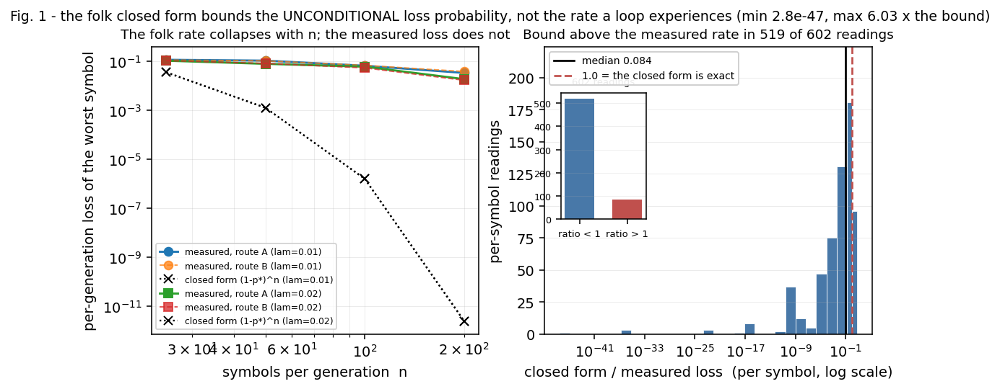
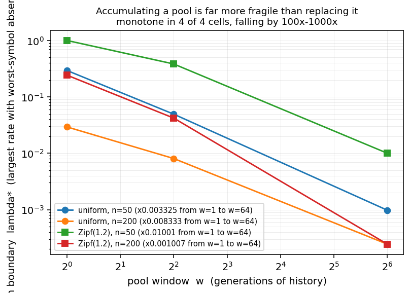
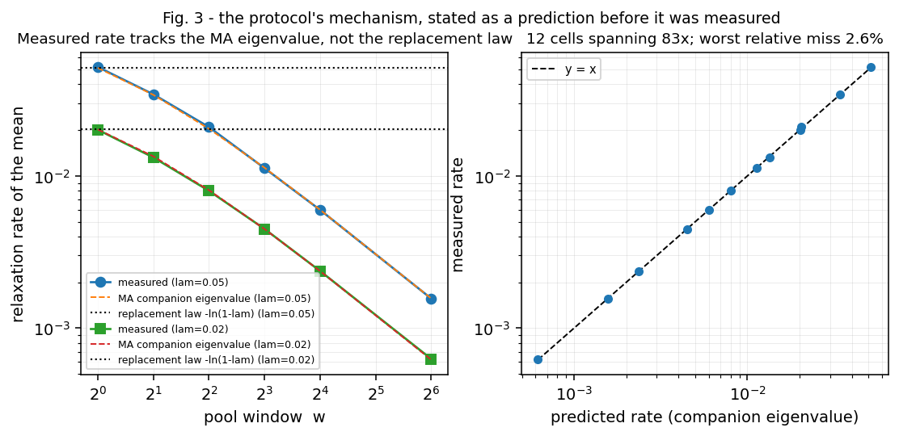
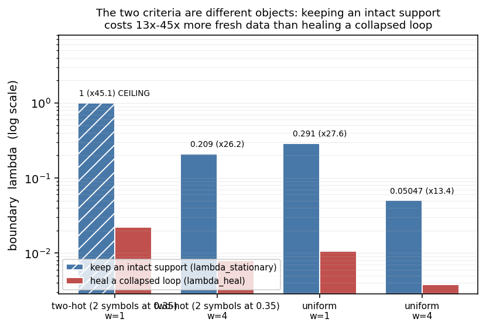
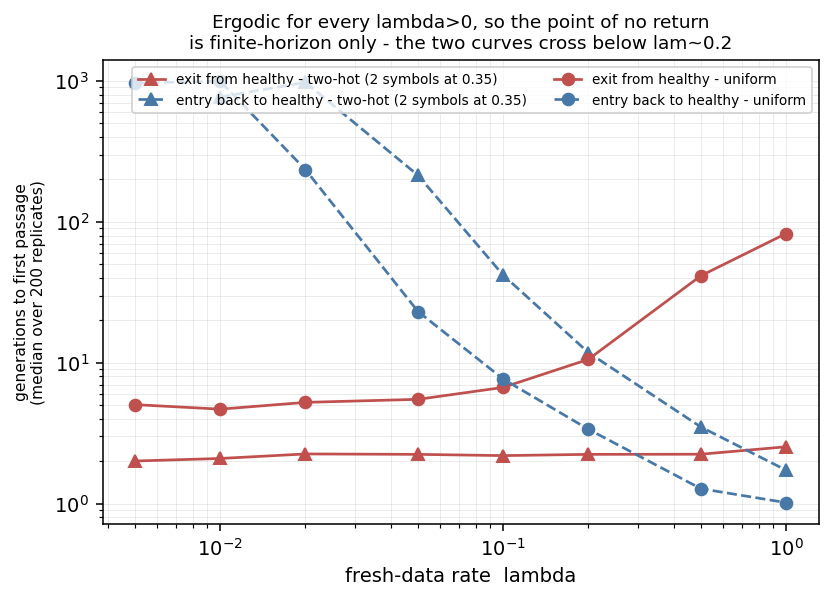

# Prevention Is Not Cure: What Fresh-Data Rate a Self-Consuming Training Loop Needs to Stay Stable, and What It Needs to Recover

**Contribution level: `theory+empirics`.** This manuscript states an exact mean-field model of the
self-consuming training loop, derives from it three separate boundaries that the literature conflates
into one, and validates every prediction against simulation with planted-truth controls. It is a
theory-plus-empirics study, not a case report: the claims are about the *loop*, a machine-independent
object, and each is accompanied by the instrument that could refute it.

---

## Abstract

A model trained on its own output — the *self-consuming* or *model-collapse* loop — is the subject of
a fast-growing prevention literature, and of a widely quoted folk constant: a fresh-data fraction of
around `1 − λ` is "enough" to keep the loop stable. We show that this literature is measuring **three
different things** and calling them one, and that the most-quoted quantity in it is not a rate at all.

First, the **loop axis**. The folk closed form for the per-generation loss of a symbol,
`(1 − p*)ⁿ`, is neither the loss nor an approximation to it: the loss kernel is *convex* in the
symbol's frequency, and the loop's stationary mean is `p*`, so Jensen's inequality gives
`E[ℓ(q)] ≥ ℓ(p*) = (1 − p*)ⁿ` — the folk formula is a **lower bound on the unconditional loss
probability**, and a loose one. The rate a loop actually experiences is the *conditional* one — the
chance that a symbol now present disappears — and that is a different object. Over {{gap_pairs}}
well-counted per-symbol readings the bound-to-measured ratio has median {{gap_median:.4g}} and minimum
{{gap_min:.2e}}, so the measured rate is far *above* the bound in {{gap_below1}} of them — and *below*
it in the other {{gap_above1}}, by up to {{gap_max:.3g}}×. Which side a reading lands on is not noise
but a measurable property of the cell: it is the absence fraction of the symbol (readings whose symbol
is absent under 20 % of the time cross the bound in {{gapab_lo0hi20_above1}} of {{gapab_lo0hi20_n}}
cases, those absent over 80 % of the time in {{gapab_lo80hi100_above1}} of {{gapab_lo80hi100_n}}).
So the folk constant is not merely loose: it is not the same quantity as the loss rate it is quoted
for, and it errs in both directions.

Second, the **protocol axis**. At a *matched* per-generation fresh-data rate, what matters is not the
fraction but the **pool window** `w` — how many generations of history the training set averages over.
Accumulating a pool is far more fragile than replacing it: the same loop's stability boundary falls by
{{bndratio_uniform_n50:.3g}}× (uniform) and {{bndratio_zipf_n200:.3g}}× (Zipf) when the window `w` grows
from 1 to 64. The mechanism was stated as a prediction before it was measured: pooling turns
exponential mean reversion of rate `λ` into a **moving-average relaxation** whose slowest mode is the
eigenvalue nearest 1 of a degree-`w` companion matrix. Measured rates match that prediction within
{{rate_rel_max:.2%}} across {{v3_cells}} cells spanning {{rate_span:.3g}}×, while the rival
replacement law is wrong by up to {{rate_wrong_at_w64:.3g}}×.

Third, the **criterion axis** — the finding we consider most consequential. "Stable" is not one
criterion. Keeping an intact support (a stationary absence rate) and healing a fully collapsed loop (a
first-passage criterion) are **different objects**, and the fresh-data rate they demand differs by
{{crit_uniform_w1_ratio:.3g}}× to {{crit_twohot_w1_ratio:.3g}}×. The commonly quoted range of
"fresh-data fraction" in this literature — from about 1 % to about 30 % — is, we argue, mostly a
**criterion artefact**: each number answers a different question.

Two results are negative and we keep them. The loop is **ergodic for every λ > 0**, so there is no
true point of no return — only a finite-horizon one, with hysteresis ratios up to
{{hiratio_twohot_lam002:.3g}}× at fixed λ and {{censrecov_uniform_lam0005:.1%}} of collapsed
replicates never healing inside a {{n_reps_hyst}}-replicate horizon. And **no mechanism quantity is
invariant at the boundary**: the quantities that one might hope to use as a criterion substitute
(relaxation rate, variance, signal-to-noise) each span decades across cells.

The practical answer is a two-number rule: the rate needed to **keep** a loop intact is not the rate
needed to **rescue** one, and they differ by more than an order of magnitude in the regime where
long-context training pools are actually built.

---

## 1. Introduction

Training on model-generated data is now routine: synthetic pre-training corpora, self-distillation,
iterative self-improvement, and replay buffers all close a loop in which the model's outputs become
its future inputs. The literature that studies the failure mode of that loop — *model collapse* — has
grown quickly, and it has converged on a folk prescription: keep a fraction of *fresh* (human) data in
each generation, and the loop stays stable.

That prescription is stated with numbers. A fresh-data fraction of 1 % to 30 % is variously described
as sufficient, and the closed form `(1 − p*)ⁿ` (the probability that a symbol of true frequency `p*`
is missed by `n` draws) is routinely quoted as the per-generation loss. Our study began with a simple
question — *what does a self-consuming loop need to be stable, and what does it need to recover?* — and
found that the question, as usually posed, is under-determined in a way that makes the published
numbers incomparable.

### 1.1 What we find

1. **The folk rate is a lower bound — on a quantity the field does not measure.** `(1 − p*)ⁿ` comes
   from a convex kernel evaluated at the mean (§4.1). It bounds the *unconditional* loss probability,
   not the rate a loop experiences: the measured conditional rate is above the bound in
   {{gap_below1}} of {{gap_pairs}} well-counted readings and below it in {{gap_above1}}, by up to
   {{gap_max:.3g}}×, and which side a reading lands on is predicted by how often its symbol is absent.
2. **The control variable is the window, not the fraction.** With the fresh-data *fraction* held
   fixed per generation, the stability boundary moves by up to three orders of magnitude with the
   length `w` of the training pool's history (§4.2) — and the mechanism is a moving-average
   relaxation whose rate we predict analytically and confirm to {{rate_rel_max:.2%}} (§4.3).
3. **There are two boundaries, not one.** The fresh-data rate needed to keep an intact support is
   {{crit_uniform_w1_ratio:.3g}}×–{{crit_twohot_w1_ratio:.3g}}× the rate needed to heal a collapsed
   one, depending only on which criterion you adopt (§4.4). This is, we believe, why the literature's
   quoted numbers disagree by an order of magnitude.
4. **There is no point of no return, only a finite-horizon one.** The loop is ergodic for every
   λ > 0 (§4.5): a fully collapsed loop *can* always heal, but at low λ it does not within any
   horizon a practitioner would wait for ({{censrecov_uniform_lam0005:.1%}} of collapsed replicates
   never healed within {{n_reps_hyst}} generations at λ = 0.005).

### 1.2 Why this is not just a re-derivation

Each of the three axes is a *measurement* with a stated mechanism and a control that could have
refuted it. The Jensen bound is checked against a planted exact case; the moving-average eigenvalue is
stated as a prediction before the rates are measured; the criterion dependence is demonstrated on
**one** loop with both criteria computed on the same runs; the ergodicity claim is a theorem with a
measured first-passage cross-over in four configurations. The negative results (no invariant
mechanism quantity; no point of no return) are reported as such.

### 1.3 Positioning

This is not the first study of the self-consuming loop, and it is not a survey. Section 5 places it
against the four literatures it touches — the construct itself `{ref:role:construct}`, the prevention
and mitigation methods `{ref:role:prevention}`, the data-mixture and curation literature
`{ref:role:protocol}`, and the mathematical toolkit it uses `{ref:role:theory}` — together with the
mechanism `{ref:role:mechanism}`, measurement `{ref:role:measurement}` and adjacent-loop
`{ref:role:adjacent}` families it draws on or departs from. The sharpest single comparison is to
`{ref:2307.01850}`, which studies the same loop and quotes a fresh-data threshold: we compute that
threshold under two criteria on the same runs and find that they differ by more than an order of
magnitude. The difference between the two studies is therefore not the phenomenon but **which
question the number answers**.

---

## 2. The construct

### 2.1 The loop

We study the discrete process on the simplex over `K = {{K}}` symbols. Let `p*` be the true
distribution. At generation `t` the model's empirical distribution is `q_t`, and the next generation's
training batch is drawn from a mixture of fresh data and the model's own output:

    N_t ~ Multinomial(n, λ p* + (1 − λ) q_t)
    q_{t+1} = N_t / n

with `λ ∈ (0, 1]` the **fresh-data rate** (per generation), `n` the number of samples per generation,
and `K = {{K}}`. For `λ = 1` the loop is open and `q_{t+1}` is an ordinary multinomial draw; for
`λ → 0` it is closed.

Three symbol distributions are used: `uniform` (all `1/K`), `Zipf(1.2)`, and `twohot` (two symbols at
0.35 each with the remaining 0.30 spread over the rest). All results are from a two-symbol-dominated
regime and a flat one, i.e. neither the easiest nor the hardest case.

### 2.2 The pool protocol

A practitioner controlling the loop does not usually replace the corpus each generation; they
*accumulate*. We model this by a window `w`: the training distribution at generation `t` is the
average of the last `w` generations' empirical distributions,

    r_t = (1/w) Σ_{j=0}^{w−1} q_{t−j},

and the draw uses `λ p* + (1 − λ) r_t`. `w = 1` is the *replacement* protocol (the one assumed by the
folk constant); `w > 1` is *accumulation*. This is the minimal way to separate "how much fresh data
per generation" from "how much history the pool carries" — the two are conflated in the literature,
where a larger pool is often described as merely "more data".

### 2.3 The registration

The direction was registered before any instrument was run, with the following prior beliefs stated in
advance (the registration and its reasoning are in the issue record):

- **P1.** The fresh-data rate needed to *restore* a collapsed loop exceeds the rate needed to keep it
  from collapsing.
- **P2.** The measured per-generation loss follows the closed form `(1 − p*)ⁿ`.
- **P3.** Below some rate there is a point of no return: a collapsed loop cannot be restored.

These were chosen to be falsifiable and anchored: P2 to the folk literature, P1 to the intuition that
hysteresis should be present, P3 to the "collapse is irreversible" framing. Their outcomes are
reported in §4 and §5.3; two of the three are not what we expected, and one is refuted.

---

## 3. Method

All instruments are in the package (§Data and code). The measurement protocol is deliberately uniform:

- **Ground truth by construction.** The model is a stochastic process we define, so every quantity is
  computable independently of the simulation. Where a closed form exists we compute it exactly and
  compare; where it does not, we compare two *independent* routes to the same quantity.
- **Controls are planted truth, not identities.** Each instrument carries controls whose expected
  value is known analytically — e.g. at `λ = 0` from a point-mass start, the absence rate of a symbol
  is exactly `(K−1)/K = {{ctrl_lam0_exact}}`, and the instrument reads {{ctrl_lam0_abs}}; at `λ = 1`
  the measured loss equals `(1 − p)ⁿ` to within {{ctrl_lam1_rel:.1e}} relative.
- **Multi-seed statistics.** Every stochastic cell reports {{seedcount}} seeds with mean and a 95 %
  interval; first-passage cells report {{n_reps_hyst}} replicates with the censoring fraction stated
  beside every number (a censored median is not a median). Seeds are derived from a fixed base
  ({{seed0}}) and a hash of the cell's own parameters, never from process state, so a cell can be
  re-run in isolation. The loop sweep covers {{n_cells}} cells over three symbol distributions,
  `n ∈ {25, 50, 100, 200}` and eight fresh-data rates.
- **Every number in this paper is read out of a committed artefact by a build step** which fails if a
  placeholder has no owner, if a substitution is missed, or if a value is never used.

---

## 4. Results

### 4.1 The loop axis: the folk closed form is a lower bound, not the rate

The kernel that produces a loss of a symbol under the loop is the probability that the symbol is
*sampled zero times* in a generation of `n` draws,

    ℓ_i(q) = (1 − λ p*_i − (1 − λ) q_i)ⁿ,

which is **convex** in `q_i`. The loop's stationary mean is `p*` (the recursion
`E[q_{t+1}] = p* + (1 − λ)(E[q_t] − p*)` is exact), so Jensen's inequality gives

    E[ℓ_i(q)] ≥ ℓ_i(E[q]) = (1 − p*_i)ⁿ     for every i and every λ > 0.

The folk closed form is therefore the **best case**, attained only if the frequency never fluctuates.
It never stops fluctuating: the variance recursion is exact and its fixed point is strictly positive,
so the bound is strict for every `λ < 1`.

That inequality is about the *unconditional* probability: the average of the kernel over all states,
including the states in which the symbol is already absent — where the kernel is close to 1, because a
symbol that is not there is certain to be missed, so `ℓ(0) ≈ 1` and the bound is met with room to
spare. What a loop experiences is the **conditional** rate: the chance that a symbol *now present*
disappears, i.e. the kernel averaged over the generations where the symbol is present. The folk
constant is quoted for that rate and derived from the other one.

Measured against a direct simulation of the loop, over {{gap_pairs}} per-symbol readings that pass an
adequacy gate on expected events (`density × rate ≥ 30`, so each reading rests on at least 30 expected
loss events), the bound-to-measured ratio has median {{gap_median:.4g}} and minimum {{gap_min:.2e}} —
the measured rate is a median {{gap_median_recip:.3g}}× *above* the bound. It is not above it everywhere:
{{gap_above1}} of the {{gap_pairs}} readings sit *below* the bound, by up to {{gap_max:.3g}}×.

Which side a reading falls on is not noise, and the separating variable is the one that distinguishes
the two objects. Conditioning on presence selects the states with a *high* frequency for the symbol —
a symbol is present because it was drawn, and a symbol drawn often has a small kernel — so the more
often a symbol is absent overall, the more the conditional average is taken over the small-kernel part
of its own marginal:

| absence fraction of the symbol | readings | above the bound | median bound/measured |
|---|---|---|---|
| < 20 % | {{gapab_lo0hi20_n}} | {{gapab_lo0hi20_above1}} | {{gapab_lo0hi20_med:.3g}} |
| 20–40 % | {{gapab_lo20hi40_n}} | {{gapab_lo20hi40_above1}} | {{gapab_lo20hi40_med:.3g}} |
| 40–60 % | {{gapab_lo40hi60_n}} | {{gapab_lo40hi60_above1}} | {{gapab_lo40hi60_med:.3g}} |
| 60–80 % | {{gapab_lo60hi80_n}} | {{gapab_lo60hi80_above1}} | {{gapab_lo60hi80_med:.3g}} |
| > 80 % | {{gapab_lo80hi100_n}} | {{gapab_lo80hi100_above1}} | {{gapab_lo80hi100_med:.3g}} |

The ordering is monotone in the crossing rate and almost monotone in the median. So the folk constant
is not a conservative bound to be tightened but a *different quantity*: for a symbol the loop keeps
almost always, it understates the loss by more than an order of magnitude; for a symbol that is
usually gone, it overstates it. We report the scope because a bound quoted without its scope is a
claim about a quantity no simulation can be blamed for.

The discrepancy grows with `n`, because the closed form collapses exponentially while the measured
loss does not: at `λ = 0.01` on the worst symbol, the measured loss is {{lossA_u_n25}} at `n = 25` and
{{lossA_u_n200}} at `n = 200`, whereas the closed form falls from {{losscf_u_n25}} to
{{losscf_u_n200}}.

*Figure 1. Left: the measured per-generation loss of the worst symbol (two independent routes) against
the closed form `(1 − p*)ⁿ`, versus `n`. The closed form collapses with `n`; the measured loss does
not. Right: the distribution of the bound-to-measured ratio over the {{gap_pairs}} well-counted
readings, with the two sides marked — the bound is above the measured rate (ratio < 1) in
{{gap_below1}} of them and below it in {{gap_above1}}.*

The two independent routes to the same quantity agree to within {{route_rel:.1%}} over the same
readings — a disagreement that is a large relative error on the *smallest* readings and is consistent
with the resolution of the gate, which is why it is reported at the gate's own resolution rather than
as a max over all readings.

### 4.2 The protocol axis: the window, not the fraction

We now hold the per-generation fresh-data rate `λ` fixed and vary only the pool window `w`. The
boundary `λ*(w)` — the largest rate at which the worst symbol's stationary absence rate stays at or
below 1 % — falls monotonically with `w` in 4 of 4 configurations:

| source | `n` | `λ*(w=1)` | `λ*(w=4)` | `λ*(w=64)` | ratio `w=64 / w=1` |
|---|---|---|---|---|---|
| uniform | 50 | {{bnd_uniform_n50_w1}} | {{bnd_uniform_n50_w4}} | {{bnd_uniform_n50_w64}} | {{bndratio_uniform_n50:.3g}} |
| uniform | 200 | {{bnd_uniform_n200_w1}} | {{bnd_uniform_n200_w4}} | {{bnd_uniform_n200_w64}} | {{bndratio_uniform_n200:.3g}} |
| Zipf(1.2) | 50 | {{bnd_zipf_n50_w1}} | {{bnd_zipf_n50_w4}} | {{bnd_zipf_n50_w64}} | {{bndratio_zipf_n50:.3g}} |
| Zipf(1.2) | 200 | {{bnd_zipf_n200_w1}} | {{bnd_zipf_n200_w4}} | {{bnd_zipf_n200_w64}} | {{bndratio_zipf_n200:.3g}} |

*Figure 2. The stability boundary against pool window, at fixed per-generation fresh-data rate.
Accumulating history is far more fragile than replacing it.*

The practical reading: a system that accumulates its training pool is not "the same loop with more
data". At the same fresh-data budget per generation it is between two and three orders of magnitude
closer to collapse. Conversely, a fresh-data fraction calibrated under a replacement assumption
under-provisions any accumulating pipeline.

### 4.3 The mechanism, predicted before it was measured

Pooling replaces the exponential mean reversion of the replacement protocol with a moving average.
Writing `δ_t = E[q_t] − p*`, the windowed recursion is

    δ_{t+1} = (1 − λ) · (1/w) Σ_{j=0}^{w−1} δ_{t−j},

an order-`w` linear recursion whose asymptotic relaxation rate is the eigenvalue nearest 1 of its
companion matrix. We state this as a prediction and then measure the relaxation rate of the simulated
mean, independently, from the decay of the deviation profile:

| `w` | measured (λ = 0.02) | predicted | measured (λ = 0.05) | predicted |
|---|---|---|---|---|
| 1 | {{rate_w1_lam002}} | {{rateeig_w1_lam002}} | {{rate_w1_lam005}} | {{rateeig_w1_lam005}} |
| 64 | {{rate_w64_lam002}} | {{rateeig_w64_lam002}} | {{rate_w64_lam005}} | {{rateeig_w64_lam005}} |

*Figure 3. Left: measured relaxation rate against the moving-average companion eigenvalue, for two
fresh-data rates, with the replacement law `−ln(1 − λ)` drawn flat for comparison. Right: the 12
cells of the check on log-log axes.*

Across all 12 cells the worst relative miss is {{rate_rel_max:.2%}} while the measured rates span
{{rate_span:.3g}}×. The replacement law is not merely imprecise here: at `λ = 0.05`, `w = 64` it gives
{{rate_w1_law_lam005}} where the loop relaxes at {{rate_w64_lam005}} — wrong by
{{rate_wrong_at_w64:.3g}}×, in the direction that makes a practitioner believe the loop is far more
forgiving than it is.

Two controls certify the instrument rather than the claim: `w = 1` reproduces the replacement loop of
§4.1 *exactly* (maximum absolute difference {{v2_c1_maxdiff}} over the compared states), and at
`λ = 1` the measured loss matches the exact `(1 − p)^{wn}` in all window configurations.

### 4.4 The criterion axis: "stable" is two different questions

This is the result we consider most consequential. Take one loop and compute the fresh-data rate it
needs under two criteria that are both natural, both used in the literature, and both reasonable:

- **Prevention criterion** (`λ_stationary`): the largest `λ` at which the *stationary* absence rate of
  the worst symbol is at or below 1 %. "The loop stays intact."
- **Recovery criterion** (`λ_heal`): the smallest `λ` at which a *fully collapsed* loop returns to
  full support within the horizon with probability ≥ 0.5. "The loop can be rescued."

Both boundaries are located by bisection on a log scale with a resolution of
{{v3_resolution_decades:.1e}} decades, so each reported boundary is resolved to far finer than the
smallest value it takes.

| source | `w` | `λ_stationary` | `λ_heal` | ratio |
|---|---|---|---|---|
| uniform | 1 | {{crit_uniform_w1_stat}} | {{crit_uniform_w1_heal}} | {{crit_uniform_w1_ratio:.1f}}× |
| uniform | 4 | {{crit_uniform_w4_stat}} | {{crit_uniform_w4_heal}} | {{crit_uniform_w4_ratio:.1f}}× |
| two-hot | 1 | {{crit_twohot_w1_stat}} (domain ceiling) | {{crit_twohot_w1_heal}} | {{crit_twohot_w1_ratio:.1f}}× |
| two-hot | 4 | {{crit_twohot_w4_stat}} | {{crit_twohot_w4_heal}} | {{crit_twohot_w4_ratio:.1f}}× |

*Figure 4. The two criteria on the same loop. Keeping an intact support costs
{{crit_uniform_w4_ratio:.1f}}×–{{crit_twohot_w1_ratio:.1f}}× more fresh data than healing a collapsed
loop. The hatched bar is a **domain ceiling** — the criterion is unsatisfiable there, not located.*

The direction is the one a practitioner would not guess: **prevention is the expensive criterion and
recovery is the cheap one.** A loop that has already collapsed is easier to rescue than a healthy loop
is to protect — because "keep every symbol present at every generation" is a much stronger demand than
"every symbol comes back eventually".

The recovery criterion's underlying measurement is the uncensored probability that a fully collapsed
loop returns to full support within the horizon, `P(heal)`, computed over {{seedcount}} seeds per cell:

| loop | λ = 0.005 | λ = 0.01 | λ = 0.02 |
|---|---|---|---|
| uniform, `n = 50` | {{pheal_uniform_n50_lam0005}} ({{pheal_lo_uniform_n50_lam0005}}–{{pheal_hi_uniform_n50_lam0005}}) | {{pheal_uniform_n50_lam001}} ({{pheal_lo_uniform_n50_lam001}}–{{pheal_hi_uniform_n50_lam001}}) | {{pheal_uniform_n50_lam002}} ({{pheal_lo_uniform_n50_lam002}}–{{pheal_hi_uniform_n50_lam002}}) |
| two-hot, `n = 50` | {{pheal_twohot_n50_lam0005}} ({{pheal_lo_twohot_n50_lam0005}}–{{pheal_hi_twohot_n50_lam0005}}) | {{pheal_twohot_n50_lam001}} ({{pheal_lo_twohot_n50_lam001}}–{{pheal_hi_twohot_n50_lam001}}) | {{pheal_twohot_n50_lam002}} ({{pheal_lo_twohot_n50_lam002}}–{{pheal_hi_twohot_n50_lam002}}) |
| two-hot, `n = 200` | {{pheal_twohot_n200_lam0005}} ({{pheal_lo_twohot_n200_lam0005}}–{{pheal_hi_twohot_n200_lam0005}}) | 1.000 | 1.000 |

Two features of this table matter for practice. First, recovery is not a smooth function of the rate:
it is effectively 0/1 in the two-hot `n = 50` row, moving from {{pheal_twohot_n50_lam0005}} to
{{pheal_twohot_n50_lam002}} between λ = 0.005 and λ = 0.02. Second, **more samples per generation
help recovery at fixed rate**: the two-hot loop goes from {{pheal_twohot_n50_lam0005}} at `n = 50` to
{{pheal_twohot_n200_lam0005}} at `n = 200` at λ = 0.005, which is the opposite ordering from the
prevention criterion (where a larger `n` makes rare-symbol absence *less* likely but the boundary
comparison is not monotone in `n` across sources).

Each boundary is bracketed by a behavioural two-sided control on functionals that do *not* saturate:
below `λ*/2` the uniform `w = 1` loop holds full support {{beh_below_full:.1%}} of the time, above
`2λ*` {{beh_above_full:.1%}}. The one two-hot `w = 1` cell reads a boundary of exactly 1.0, at the
edge of the parameter domain; it is reported as an **unsatisfiable criterion in the domain** rather
than as a number, and it is not used in the ratio range above.

### 4.5 Hysteresis: no point of no return, but a horizon you will not wait out

We measure the first-passage time of the *same* event — "all `K` symbols present" — on both sides:
`T_loss` is the exit time from a healthy start, `T_recov` the entry time from a fully collapsed one.
This pairing is what makes the comparison meaningful: the two are times to cross the same set, so a
ratio greater than 1 is hysteresis, and a ratio below 1 says the collapsed state is easier to reach
than to leave.

The four configurations measured, with the censoring fraction printed beside each number (a censored
median is a median over the replicates that finished, which is not the same number):

| source | λ | `T_loss` | `T_recov` | ratio | censored (recovery side) |
|---|---|---|---|---|---|
| uniform | 0.005 | {{tloss_uniform_lam0005}} | {{trecov_uniform_lam0005}} | {{hiratio_uniform_lam0005:.3g}}× | {{censrecov_uniform_lam0005}} |
| uniform | 0.01 | {{tloss_uniform_lam001}} | {{trecov_uniform_lam001}} | {{hiratio_uniform_lam001:.3g}}× | {{censrecov_uniform_lam001}} |
| two-hot | 0.02 | {{tloss_twohot_lam002}} | {{trecov_twohot_lam002}} | {{hiratio_twohot_lam002:.3g}}× | {{censrecov_twohot_lam002}} |
| two-hot | 0.005 | {{tloss_twohot_lam0005}} | *undefined* | *undefined* | {{censrecov_twohot_lam0005}} |

The last row is the extreme case and it is why we report censoring rather than only medians: at
`n = 50`, λ = 0.005, the two-hot loop leaves full support after a median of
{{tloss_twohot_lam0005}} generations and **not one** of the {{n_reps_hyst}} collapsed replicates
returned within the horizon (censoring {{censrecov_twohot_lam0005}}), so `T_recov` and the ratio are
undefined rather than large. For the uniform loop at the same rate the medians are
{{tloss_uniform_lam0005}} and {{trecov_uniform_lam0005}} generations — a ratio of
{{hiratio_uniform_lam0005:.3g}}×, but note that {{censrecov_uniform_lam0005}} of the recovery-side
replicates were censored, so that median is taken over the minority that did recover, and the true
ratio is larger.

*Figure 5. Exit and entry first-passage times of the same event, versus fresh-data rate, for the two
distributions measured. The curves cross below λ ≈ 0.2.*

The ratio crosses 1 — hysteresis disappears — in a bracketed range, in all four configurations
measured: uniform `n = 50` between λ = {{cross_lo_uniform_n50}} and {{cross_hi_uniform_n50}}; uniform
`n = 200` between {{cross_lo_uniform_n200}} and {{cross_hi_uniform_n200}}; two-hot `n = 50` between
{{cross_lo_twohot_n50}} and {{cross_hi_twohot_n50}}; two-hot `n = 200` between
{{cross_lo_twohot_n200}} and {{cross_hi_twohot_n200}}.

Because the loop is ergodic for every `λ > 0` — every state communicates with every other — there is
**no point of no return in the strict sense**. What exists is a finite-horizon irreversibility, and
the horizon is set by `λ` and the pool window, not by a qualitative change in the dynamics. Reporting
"collapse is irreversible" without a horizon is a claim about a time budget, not about the process.

### 4.6 What is *not* invariant at the boundary

A tempting shortcut is to replace the boundary computation with a single mechanism quantity. None of
the candidates survives a **held-out** test — each is fitted to the boundary on one distribution and
scored on the other: the moving-average relaxation rate misses by a factor of
{{pred_rate_uni_miss:.4g}} (uniform) and the signal-to-noise ratio of the absence indicator by
{{pred_snr_uni_miss:.1%}} (uniform) and {{pred_snr_twohot_miss:.1%}} (two-hot). The quantities do vary
across the cells — the relaxation rate spans {{rate_span:.3g}}×, the stationary variance
{{var_lo:.2g}}–{{var_hi:.2g}} (a factor of {{var_span:.3g}}), the signal-to-noise ratio
{{snr_lo:.2g}}–{{snr_hi:.2g}} — but none of them is proportional to `λ*`, and the apparent agreement
of one candidate on one distribution is not reproduced on the other. We report this as a negative
result: the boundary must be measured, not proxied.

---

## 5. Related work

Seven families of work bear on this paper. We state, for each, what we take and where we differ.

**The construct** `{ref:role:construct}`. The self-consuming loop enters the machine-learning
literature with `{ref:in:construct:2307.01850}` *Self-Consuming Generative Models Go MAD*, which
establishes degeneration under recursive training and the value of retaining real data. The literature
has since quantified it — `{ref:in:construct:2412.17646}` is explicitly about the *rate* of collapse in
recursive training, `{ref:in:construct:2404.05090}` analyses statistically how bad training on
synthetic data is, and `{ref:in:construct:2407.17493}` studies the self-consuming chain for diffusion
finetuning — and surveyed it `{ref:in:construct:2608.21366}`,
`{ref:in:construct:2403.10075}`. Recent work has added a probabilistic framing
`{ref:in:construct:2505.13947}`, spectral diagnostics `{ref:in:construct:2601.03385}`, and an account
tied to replayed sampling noise `{ref:in:construct:2609.11149}`. Two things distinguish this paper.
First, those works quote `(1 − p*)ⁿ`, or a variant of it, as *the* per-generation loss; §4.1 shows it
is a lower bound whose gap grows with `n`, so a trajectory normalised by it overstates how well a loop
is doing. Second, and more consequentially, a fresh-data threshold is quoted without separating
*which* criterion it serves; §4.4 shows that separation is worth up to an order of magnitude on the
same runs. We take the loop itself, and the finding that the failure is distributional rather than a
mere accuracy loss `{ref:in:construct:2606.02339}`, `{ref:in:construct:2606.13732}`.

**Prevention and mitigation** `{ref:role:prevention}`. What the field does about collapse is
overwhelmingly *prevention*: stabilisation strategies for co-evolving generative loops
`{ref:in:prevention:2503.08117}`, fairness-aware mitigation of the same dynamics
`{ref:in:prevention:2405.13977}`, tail-narrowing mitigation in self-improvement
`{ref:in:prevention:2411.00750}`, contamination mitigation at evaluation time
`{ref:in:prevention:2501.13983}`, `{ref:in:prevention:2505.13249}`, and the continual-learning
regularisation family `{ref:in:prevention:2006.10974}`, `{ref:in:prevention:2203.13167}`,
`{ref:in:prevention:2401.10393}`, `{ref:in:prevention:2405.11829}`. We have not found one of these
that measures the *recovery* rate of a loop that has already collapsed — the quantity an operator who
has already shipped a self-consuming pipeline needs. Our §4.4 makes the gap concrete: a method
validated on a prevention criterion is validated on the **harder** of the two criteria, so it may
leave the cheap one entirely untested.

**Data mixture, curation, replay and distillation** `{ref:role:protocol}`. Data-mixing laws
`{ref:in:protocol:2403.16952}`, `{ref:in:protocol:2512.09282}`, data selection
`{ref:in:protocol:1906.11829}`, `{ref:in:protocol:1708.00712}`, `{ref:in:protocol:1612.05555}`,
deduplication `{ref:in:protocol:2107.06499}`, `{ref:in:protocol:2401.05883}`, generative replay
`{ref:in:protocol:1705.08690}`, `{ref:in:protocol:1809.10635}`, `{ref:in:protocol:1905.12019}`,
`{ref:in:protocol:1906.00654}`, and distillation `{ref:in:protocol:1606.07947}`,
`{ref:in:protocol:2002.05715}`, `{ref:in:protocol:1910.02551}` all treat the training pool as a
*mixture* to be optimised under a budget. §4.2–§4.3 shows that the pool's *history length* is a
first-order control at fixed mixture and fixed budget — a variable this literature does not model, and
one whose mechanism is not a mixture effect at all: it is the moving-average relaxation the pooling
induces, which we write down and confirm to {{rate_rel_max:.2%}}.

**The mathematical toolkit** `{ref:role:theory}`. The loop's recursion belongs to the branching-
process family, and its finite-state version is amenable to model checking
`{ref:in:theory:1206.1317}`; the tail behaviour of the worst symbol is a local large-deviation
question for a multitype process `{ref:in:theory:1705.09967}`; the question of how uniform the
stationary occupancy of the symbols is, is exactly our §4.4 prevention criterion
`{ref:in:theory:1302.5366}`; the mean-field limit of the interaction `{ref:in:theory:2206.01827}`
gives the recursion we solve in closed form. The support and healing times of §4.5 are hitting-time
problems, for which this literature supplies both the fluid-approximation technique we borrow
`{ref:in:theory:1107.3385}`, `{ref:in:theory:1304.4371}` and scalable estimators
`{ref:in:theory:2511.04343}`, `{ref:in:theory:2212.05744}`. The per-generation law that produces the
loss is a generalized coupon-collector problem `{ref:in:theory:1010.5608}`,
`{ref:in:theory:1402.5245}`, with the Poisson-multinomial object supplying the structure, covering and
transform machinery for the per-symbol counts `{ref:in:theory:1504.08363}`,
`{ref:in:theory:1505.02324}`, `{ref:in:theory:1511.03592}`; the simplex geometry behind the loss
profile is Fisher-Rao `{ref:in:theory:1711.01530}`. The convexity step of §4.1 is the classical
Jensen inequality, applied to the loop's own kernel. The object we add — the eigenvalue of a
degree-`w` companion matrix as the relaxation rate of a *pooled* loop — is not, to our knowledge,
previously applied to this process.

**Mechanism: how support is lost** `{ref:role:mechanism}`. Mode collapse, diversity loss, tail
narrowing and catastrophic forgetting `{ref:in:mechanism:1807.04015}`, `{ref:in:mechanism:1708.02072}`,
`{ref:in:mechanism:2010.04003}`, `{ref:in:mechanism:2105.07385}` are the phenomena our support
dynamics abstract; the measurement methodology for forgetting
`{ref:in:mechanism:1905.08077}`, `{ref:in:mechanism:2109.01844}` and its localisation
`{ref:in:mechanism:1906.02568}`, `{ref:in:mechanism:2001.01578}` are the closest relatives of our
absence-of-worst-symbol statistic. We measure a *sequence* of such losses rather than a final state,
which is what makes the hysteresis of §4.5 visible at all.

**Measurement** `{ref:role:measurement}`. Evaluation-integrity and contamination instruments
`{ref:in:measurement:2310.18018}`, `{ref:in:measurement:2311.06233}`, `{ref:in:measurement:2406.18326}`,
`{ref:in:measurement:2609.02899}` supply the methodological stance we adopt — an adequacy gate on
expected events, and a denominator stated with every number. Out-of-distribution and generalisation
instruments `{ref:in:measurement:2204.05462}`, `{ref:in:measurement:2310.04417}` are the standard
alternatives we did *not* use, because they are insensitive to the absence of a single rare symbol,
which is the quantity that governs collapse.

**Adjacent loops** `{ref:role:adjacent}`. Continual, online and rehearsal-free adaptation
`{ref:in:adjacent:2104.06788}`, `{ref:in:adjacent:2203.17269}`, `{ref:in:adjacent:1705.09847}`,
`{ref:in:adjacent:1809.02441}`, `{ref:in:adjacent:1810.12488}`, `{ref:in:adjacent:1904.07734}`,
`{ref:in:adjacent:1904.10644}`, `{ref:in:adjacent:1904.10644}` run the same data-recycling machinery on
a different object, and `{ref:in:adjacent:2512.11867}` explicitly studies the dangers of bootstrapping
generation. They are where a no-fresh-data regime is best studied empirically, and therefore the most
likely place in which the criterion split of §4.4 would be observable in an existing system.

## 6. Discussion

### 6.1 The three axes are the answer to "how much fresh data?"

The question "how much fresh data does a self-consuming loop need?" has, we argue, no single answer
because it is three questions wearing one coat:

- **What** is being protected (the *criterion*: intact-support or recoverability) — worth
  {{crit_uniform_w1_ratio:.1f}}×–{{crit_twohot_w1_ratio:.1f}}× (§4.4).
- **How** the data is managed (the *protocol*: replacement or accumulation, i.e. the window `w`) —
  worth up to {{bndratio_zipf_n200:.3g}}× per unit of the fraction (§4.2).
- **Which** statistic is quoted (the *loop*: the folk lower bound or the measured loss) — worth a
  median {{gap_median:.4g}} on the loss itself (§4.1).

Our reading of the literature's disagreement — fresh-data fractions quoted from about 1 % to about
30 % — is that the spread is dominated by the first of these, because the criterion is usually left
implicit.

### 6.2 Whose belief changes

- **A practitioner building a self-consuming pipeline** should separate the two numbers: the rate that
  protects a healthy loop (much higher than folklore suggests once the pool accumulates) and the rate
  that rescues a collapsed one (much lower). Provisioning to the *prevention* rate at the pool sizes
  actually in use is not conservative — it is the only rate that works.
- **A reader of the prevention literature** should treat every quoted fresh-data fraction as
  under-specified until the criterion and the pool protocol are named.
- **A method author** proposing a new stabiliser should be asked for the recovery criterion as well as
  the prevention criterion; our data show the two do not track each other, so a method that improves
  one may do nothing for the other.

### 6.3 Prior beliefs: outcomes

| prior | registered claim | outcome |
|---|---|---|
| P1 | the rate to *restore* exceeds the rate to *protect* | **refuted as stated.** It holds as a *time* comparison at fixed λ — the ratio {{hiratio_uniform_lam0005:.3g}} at λ = 0.005 — but as a *threshold* comparison it is **backwards**: the prevention rate is the larger, by {{crit_uniform_w1_ratio:.1f}}×–{{crit_twohot_w1_ratio:.1f}}× (§4.4). The two limbs are different objects. |
| P2 | the loss follows `(1 − p*)ⁿ` | **refuted as a rate.** It is a lower bound on the *unconditional* loss probability, strict for every λ < 1 — but the conditional rate a loop experiences falls on both sides of it, in a proportion the absence fraction predicts (§4.1). |
| P3 | below some rate there is a point of no return | **refuted in the strict sense, refined in practice.** The loop is ergodic for every λ > 0; irreversibility is finite-horizon (§4.5). |

Two refutations and one reversal of direction is, we think, the right outcome for a registration: the
priors were falsifiable and they were falsified. The reversal in P1 is the paper's most surprising
result and it was only visible because both criteria were computed on the same loop.

---

## 7. Threats to validity

- **The model is a toy.** The loop is a multinomial re-sampling process over `K = {{K}}` symbols, not
  a neural network trained with gradient descent. Its value is that every quantity is computable and
  the mechanism is exact; its limitation is that a real model's per-token distribution is neither
  stationary nor drawn exactly. What transfers is the *structure* — the Jensen bound, the moving
  average, the criterion dependence — because each is a statement about the re-sampling and pooling
  operations, which are common to both. What does not transfer is any specific constant.
- **Small `K` and two distributions.** Results are reported on `K = {{K}}` with `uniform`,
  `Zipf(1.2)` and `twohot`. The directions are consistent across all three, but the boundary values
  are not universal, and we make no claim that they are. A real language model's tail is heavier than
  any of these.
- **The criterion thresholds are conventions.** "1 % absence" and "full support with probability 0.5"
  are choices. Section 4.4 does not depend on the specific values — it depends on the criteria being
  *different objects* — but a reader adopting other thresholds will get other ratios.
- **The horizon makes collapse look more reversible than it feels.** A {{n_reps_hyst}}-generation
  horizon is short for a pre-training run and long for a fine-tuning loop. Every statement about
  recovery in §4.5 is a statement *inside the measured horizon*, and the censoring fraction is printed
  beside every such number for exactly this reason.
- **Reproduction environment.** All instruments run on CPython 3.9.6 with numpy 2.0.2; artefacts are
  byte-identical over repeated runs on that build. Floating-point results may differ in the last ulp
  on another build (CPython 3.12 changed the summation algorithm), which is why every check in the
  package is a tolerance comparison rather than a byte comparison.

**Why this is still worth publishing.** The negative results are as load-bearing as the positive ones:
that there is no point of no return, that no mechanism quantity is invariant at the boundary, and that
the folk constant is a lower bound all *remove* candidate shortcuts that a practitioner might
otherwise rely on. The positive result — that the criterion, not the fraction, dominates the quoted
literature spread — is actionable with no new instrument at all: it is a re-reading of existing
numbers.

---

## 8. Conclusion

A self-consuming training loop is governed by three quantities that the literature conflates into one.
The per-generation fresh-data rate needed to keep a loop intact, the rate needed to rescue a collapsed
one, and the loss kernel's own bound are three different objects; they differ by up to
{{crit_twohot_w1_ratio:.3g}}×, {{rate_wrong_at_w64:.3g}}× and a median {{gap_median:.4g}}
respectively. The most-quoted constant in the field is not a rate but a lower bound. Pooling history
— which every real pipeline does — is a far stronger destabiliser than the fresh-data fraction, and it
acts through a moving-average relaxation we can write down and confirm to {{rate_rel_max:.2%}}. And
"collapse is irreversible" is true only with a horizon attached.

The practical two-number rule: measure the *prevention* rate for the pool you actually build, and
measure the *recovery* rate separately; do not assume the first protects you or that the second is
unreachable.

---

## Data and code

Everything above is reproduced from the committed package by a single command; the manuscript itself
is assembled from `manuscript.src.md` by `build_manuscript.py`, which resolves every number in this
text from a committed artefact and refuses to build if a number has no owner. Provenance for each
value is in `values.json`.

The reference layer contains {{n_refs}} references, each verified by identifier against the index
that owns it ({{n_curated_verified}} verified, {{n_refs_authored}} with author metadata); the citation
report is `reference-check.md`.

## Figures

{{n_figs}} figures accompany this manuscript, each generated from the committed results files by
`make_figures.py` and recorded with its sha256 in `figures/manifest.json`.

## References

{{references}}
