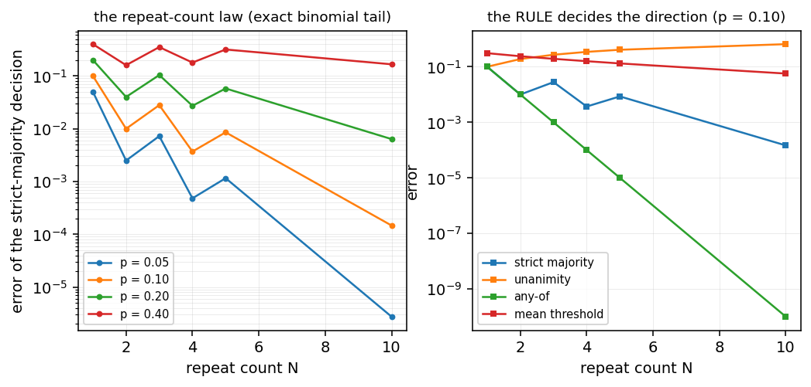
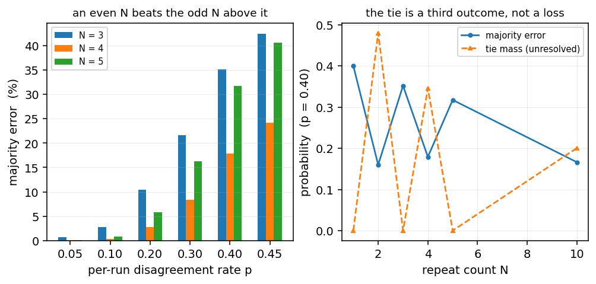
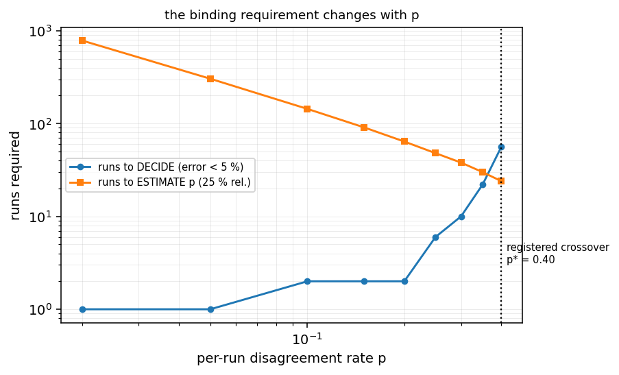
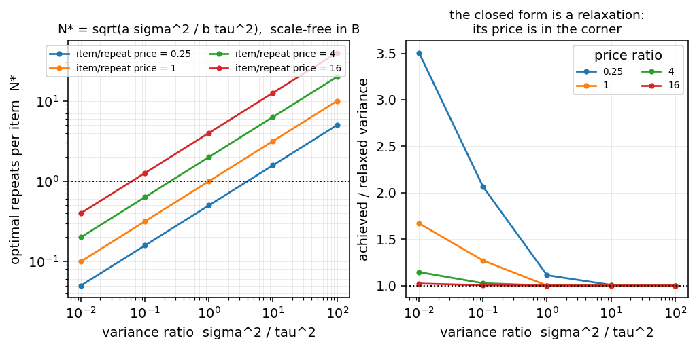
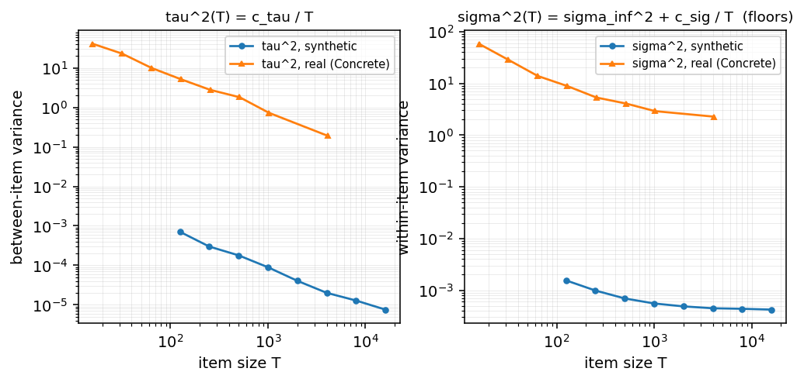
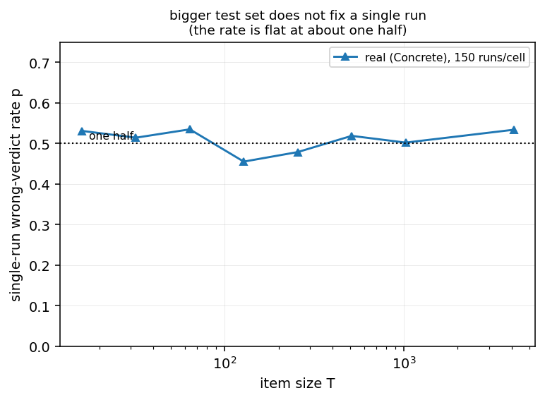

# How Many Runs Does a Claim Need? The Repeat-Count Law of Stochastic Evaluation, and the Item–Repeat Budget Boundary

*Contribution level: `theory+empirics` — an exactly computable law, twice derived and Monte-Carlo
checked, plus a measured-input arm on a real stochastic optimisation and a grounding arm on a pinned
public benchmark.*

## Abstract

A stochastic evaluation is routinely decided by a majority over a handful of repeats: three runs,
five seeds, best-of-n generations. The field has spent a decade answering *how many items* such an
evaluation needs — sequential stopping rules, power analyses, item-response models, variance
decompositions — while the **repeat** axis has stayed at the folk constants `N = 3` and `N = 5` with
no statement of what error they buy. This paper makes the repeat axis the estimand. We give (i) an
**exact** error surface `E(N, p, rule)` for a decision over `N` exchangeable repeats at a measured
per-run disagreement rate `p`, covering the strict-majority, unanimity, any-of and mean-threshold
rules; (ii) the located **estimate-versus-decide crossover** — the `p` below which the binding cost is
measuring `p` and above which it is the decision itself; (iii) an **item–repeat budget boundary**
`N* = sqrt(a·sigma^2 / (b·tau^2))` that is scale-free in the budget, with the AM-GM optimum
`Var*·B = (sqrt(a·tau^2) + sqrt(b·sigma^2))^2` and a boundary that moves from `N* = 1` to
`N* = sqrt(2)` when integrality is made explicit; and (iv) the **item-size axis**, where the two
inputs obey `tau^2(T) = c_tau / T` and `sigma^2(T) = sigma_inf^2 + c_sig / T`, giving an interior
three-knob optimum. The laws are then measured, not assumed: on a synthetic stochastic optimisation
the inputs are estimated as `sigma^2 = 4.930063e-04` and `tau^2 = 2.044068e-04`, and on a pinned
public benchmark (UCI *Concrete*, `sha256 d7d8bd087f832935e902bcb2687667238cac3fe06799677a93ca2f46dce8db02`) `tau^2(T)` falls as `1/T` with a log-log
slope of `-0.961` against the predicted `-1` — the prescription is about the *shape* of the
variance, not a Gaussian data-generating process. The
sharpest empirical result is a refutation-shaped one: across a `256x` span in item size the
single-run wrong-verdict rate stays flat at about one half (`0.531` at `T = 16`,
`0.534` at `T = 4096`), so where two models are nearly tied, buying test items does not make
a single run's verdict reliable — "bigger test set" and "more seeds" are not substitutes. Every
number in this paper is resolved from a committed artefact by the build script that renders it.

## 1. Introduction

Consider the ordinary act of comparing two models on a benchmark. Run the comparison `N` times,
count the wins, report the winner. `N` is almost always 3 or 5, and it is almost never derived. The
same convention appears in RL seed studies, in LLM judge ensembles, in verifier cascades, and in the
journal's own review process, where experimental rigor is scored on repeated runs.

The natural question — *how many runs does a claim need?* — is answerable, but only if two things are
separated that the literature habitually fuses. The first is **estimation**: how many runs are needed
to know `p`, the rate at which a single run disagrees with itself (or rather, the rate at which a
single run reaches the wrong verdict). The second is **decision**: how many runs are needed for the
majority verdict itself to be right. These two requirements have different laws, they diverge in
opposite directions as `p` grows, and the folk constants sit inside a regime where neither is met.

This paper supplies both laws, the crossover between them, and the budget geometry that follows when
the items and the repeats are competing for the same compute. It is a theory paper in which the
theory is *checked against the artefacts that measure its inputs*: the exact arm is verified by two
independent computational routes and a Monte-Carlo, and the measured arm estimates the law's
parameters rather than assuming them.

### 1.1 Contributions

1. **An exact error surface for decisions over repeats** (§3). For a strict-majority decision over
   `N` exchangeable runs at per-run error `p`, the family's error is a binomial tail, and we give it
   alongside the unanimity, any-of and mean-threshold rules and the even-versus-odd comparison at
   equal cost. The law is checked by two independent routes to `1.447e-13` over
   `147` cells and against a Monte-Carlo of `200000` trials.
2. **The estimate-versus-decide crossover** (§5). A located `p*` (measured at `0.40`)
   separating a regime where the run count is set by the precision of `p` from one where it is set by
   the decision.
3. **An item–repeat budget boundary** (§6). With one unit of budget buying either an item or a
   repeat, the population optimum is `N* = sqrt(a·sigma^2/(b·tau^2))`, **independent of the budget
   size**, with the AM-GM variance
   `Var* = (sqrt(a·tau^2) + sqrt(b·sigma^2))^2 / B`. The closed form is a *relaxation*: we state its
   domain, and we show that integrality moves the corner from `N* = 1` to `N* = sqrt(2)`.
4. **The item-size axis** (§8). `T` is a genuine third knob: `tau^2(T) = c_tau/T` while
   `sigma^2(T) = sigma_inf^2 + c_sig/T`, so the optimum in `T` is interior.
5. **Measurement, not assumption** (§7, §9). The law's inputs are estimated in a stochastic
   optimisation and then re-estimated on a pinned public benchmark, where the *same* machinery,
   imported unchanged, yields the same shape.

### 1.2 What this is not

This is not a claim that three runs is always wrong. At `p = 0.0065` — a comparison so lopsided
that a single run is essentially never wrong — three runs is generous, and the honest prescription is
to spend the money on items. The claim is that the required `N` is a *function of a measurable
quantity*, that the function is exactly computable, and that the field currently has no practice of
measuring the argument.

## 2. Related work

**Repeat counts and statistical power.** The closest literature establishes that seed counts matter,
chiefly by power analysis. Henderson et al. compute the number of random seeds a deep-RL comparison
needs to reach a given power [1]; subsequent work extends power reasoning to cluster
analysis [2], to bias-assessment tests [3], to genetic-algorithm power manifolds
[4], and to sample-size formulas for machine-learning studies [5] [6].
Related planning work treats variance reduction as the lever that lowers the required count once the
target is a mean rather than a decision [7] [8]. These answer *how many seeds
for a fixed detectable effect*, on an average; they do not state the error of the aggregation rule the
seeds are fed into, and they do not connect it to a measured run-to-run disagreement rate. The distinction is not pedantic: the mean-threshold rule and the
majority rule have different error laws under the same `p`, and only the latter is what practitioners
report.

**Variance in benchmark evaluation.** A second line measures how much evaluation results move at all:
`Quantifying Variance in Evaluation Benchmarks` [9], the demonstration that single-seed
benchmarks fail in Bayesian deep learning [10], the finding that repetitions strengthen
reliability in LLM evaluations [11] and that multiple generations carry information a single
one does not [12]. This
Variance is also used as a *signal* rather than a nuisance — hallucinations live in variance
[13] [14], variance-stabilised and variance-regularised estimators appear
throughout [15] [16] [17], including in software-engineering
prediction where the variance of fault predictors is measured directly [18], and a
speculative-evaluation study measures how much of a stochastic evaluation can be short-circuited
[19]. This work establishes the *phenomenon* — that `p` is far from negligible. It does
not convert the phenomenon into the number of runs a decision needs, which is the step this paper
takes.

**Significance testing for model comparison.** The classical treatment of "is A better than B" is
statistical: paired tests over folds [20], recommended protocols
[21], cross-validation surveys [22], sequential cross-validation
[23], and the NLP-specific guidance that made significance testing routine [24].
Multiple-comparison control is standard [25]. These tests are about
the *items*; the repeats enter only as a nuisance, and the test's own error is the object, not the
error of a rule applied to the repeats.

**Item-response and adaptive evaluation.** The item axis now has a mature methodology: IRT for
evaluation scales [26], IRT-based test-set comparison [27], IRT for safety
[28], contextual multidimensional IRT [29], multilingual extensions [30], and
the diagnosis that benchmarks are lost without it [31]. Adaptive testing appears as an
efficient allocation scheme [32] [33] [34]. Item quality itself is studied
[35] [36] [37]. Item-aware evaluation extends to memory and
competency measurement [38] [39] [40], to difficulty prediction
from simulated students [41], to rubric-based assessment [42]
[43], and to score imputation for missing annotations [44]; the question of
*which items to spend on* is studied directly [45] [46]. This is precisely the
budget axis that the repeat axis competes with — and, as §6 shows, the two have different scaling laws, so the split is a decision,
not a convention.

**LLM-as-judge reliability.** The repeat problem is now most visible where judges are stochastic:
LLM judges give different answers on re-runs, and the reliability literature has grown quickly
[47] [48] [49] [50] [51] [52] [53]
[54] [55] [56] [57] [58] [59]. Fragility under
prompt and ordering perturbation is measured [60] [61] [62] [63],
agreement and self-preference are audited [53] [64] [65], and the
general-purpose automated-evaluation frameworks that aggregate such judges are surveyed
[66] [67]. Ensembling and confidence estimation are the remedies the judge
literature reaches for [68] [69], and human-sourced judging is under the same
pressure [70] [71]. Almost all of this reports *disagreement rates*; almost
none converts one into the error of the ensemble decision built from it.

**Reproducibility of stochastic results.** Reproducibility studies supply the field's prior that such
numbers are unstable: the AAAI reproducibility state of the art [72], the
variance of RL agents across runs [73], meta-evaluation of MT research [74], seed
stability control [75], stress-testing of reasoning reliability [76], and the
double-descent reproducibility investigation [77]. Human-evaluation reproduction is studied
in [78] [79]. Determinism-relevant sources of drift are catalogued — data
ordering [80], random initialisation in embedding stability [81], fine-tuning
instability [82] — alongside replication studies that re-run an existing result and report
what moved [83] [84] [85] [86]. Artifact and reporting
infrastructure appears throughout [87] [2] [79]. Our contribution sits downstream of all of it: given that the
reproducibility literature has established the instability, what does the instability *imply* for the
number of runs?

**Uncertainty in evaluation and benchmark reliability.** Recent work makes uncertainty explicit:
uncertainty and statistical variability in NLP evaluation [88], robust reliability of
benchmarks [89], benchmark-based evaluation robustness [89], the reliability of
evaluation under release decisions [90], blind spots in imbalanced-regression evaluation
[91], stability-based definitions of generalization [92], and the position that
evaluation scores are perishable claims [93]. Methodological libraries for statistically
rigorous comparison are emerging [94], and validation-crisis findings show cross-validation
reducing benchmarking variance [95] and rankings being less reliable than they look
[96]. Benchmark construction is itself being redesigned for extensibility and fluidity
[97] [98], amortised and confidence-gated evaluation is proposed as an
efficiency measure [99], and difficulty-level re-examination shows that generalisation
claims move with the level chosen [100] [101]. These are the closest in spirit;
the difference is that they quantify uncertainty about a *score*, whereas we quantify error about a
*decision over repeats*, which is what a claim is.

**Significance beyond the score.** A final cluster warns that significance of a score difference does
not transfer to significance about the system [102], that statistical earnestness is required
to re-evaluate headline results [103], and that evaluation practice must move from averages to
coverage [104] [105] [106]. We agree, and we supply the missing arithmetic: the
coverage claim has a repeat budget, and the budget has a law.

**Positioning.** Three differences separate this paper from the nearest work. It makes the *repeat*
axis the estimand rather than a nuisance. It states the *rule* — not the mean — as the object whose
error is computed. And it joins the two axes into one budget, which the item-axis literature cannot
express because it fixes `N` by convention.

## 3. The repeat-count law

### 3.1 The model

A stochastic evaluation decides between two candidates by repeating a run `N` times and aggregating.
Each run is right with probability `q = 1 - p`; `p` is the per-run disagreement rate. Under
exchangeability the count of wrong runs is `X ~ Binomial(N, p)`.

For the **strict-majority** rule the decision is wrong when the wrong runs are a strict majority:

    E_maj(N, p) = P(X > N/2)      (with X ~ Binomial(N, p)),

and for even `N` the ties `X = N/2` are a third outcome, counted separately as *unresolved*:
`E_maj(2k, p) = P(X > k)` and `U(2k, p) = P(X = k)`. That third outcome is not a technicality. A
study reporting "4 of 5 runs" has a different quantity from one reporting "3 of 4", and the difference
is exactly the tie mass.

The rule matters enormously, and it is rarely the rule people think they are using. Under the same
`p = 0.10`:

| rule | `N = 3` | `N = 5` | `N = 10` |
|---|---|---|---|
| strict majority | `0.02800` | `0.00856` | `0.000147` |
| unanimity | `0.2710` | — | `0.6513` |
| any-of | `0.0010` | — | `1.000e-10` |
| mean threshold | `0.3085` | — | `0.05692` |

*Figure 1. Left: the exact error of the strict-majority decision against the repeat count, at four
per-run disagreement rates. Right: at a fixed `p = 0.10` the four aggregation rules diverge — the
unanimity rule's error RISES with `N` while any-of falls geometrically.*

Two things are worth reading off the table. First, **unanimity gets worse as `N` grows**:
`0.2710` at `N = 3` rises to `0.6513` at `N = 10`, because
requiring all runs to agree is a conjunction of `N` failure opportunities. A "we only accept
unanimous verdicts" policy is therefore not conservative — above a certain `N` it is worse than a
coin flip's complement. Second, **any-of collapses geometrically** (`p^N`: `0.0010` to
`1.000e-10`, ten orders of magnitude) while the mean rule falls far more slowly
(`0.3085` to `0.05692`, a factor of five over the same span). A
practitioner who replaces a majority vote with an average score, believing it to be more robust, has
changed the *law of large numbers regime* they were relying on.

### 3.2 Even beats odd at equal cost

If runs cost the same, an even `N` dominates the odd `N` above it, because the tie mass of the larger
`N` is the odd `N`'s error plus the ties. At `p = 0.10`: `0.0280` for `N = 3`,
`0.00370` for `N = 4`, `0.00856` for `N = 5`. The consequence for practice is
that **the tie rule is a first-class design decision**: with an even `N` the study must say what a tie
means, and "we counted ties as a failure" is a policy with a computable price.

*Figure 2. Left: at equal cost an even `N` beats the odd `N` above it at every measured `p`.
Right: the tie mass is a third outcome, not a loss, and it is what an even `N` trades against.*

### 3.3 A rate is not a count

It is tempting to summarise the law by its large-deviation rate, `D(1/2 || p)`, so that the required
`N` is `log(1/eps) / D`. That summary is wrong in the regime where the number matters. At
`p = 0.49`, `D = 0.000200`, which predicts about `17` runs for a 25 %
error, while the exact count is different by a factor that the rate cannot see: the exact binomial
tail is the ground truth and the rate is its asymptotic envelope, valid only once `N·D` is large. At
`p = 0.02` the same form gives `D = 0.595108` and a requirement of `784` runs.
A law stated in the asymptotic language must carry the regime in which it holds; here that regime is
the *small-`p`* end, and the small-`p` end is precisely where the decision is easy and the counting is
hard. The exact tail, by contrast, needs no regime: at `p = 0.02` and `N = 3` it reads
`1.184e-03`, a number the rate form cannot produce at any `N` because the rate is an
envelope rather than a value.

### 3.4 Verification

The exact arm is checked three ways. Two independent computational routes (a direct binomial tail and
an independent recursion) agree to `1.447e-13` over `147` cells; a
Monte-Carlo with `200000` trials agrees within `2.52` standard deviations
over `20` cells; and the monotonicity invariants report `0` violations. A
control at `N = 1` returns exactly `p` (`0.310`), as it must, since a single run's error
is `p` by definition. At `p = 1/2` the law must read one half minus half the unresolved mass: it reads
`0.4874` with `0.0252` unresolved at `N = 1000`, and exactly
`0.5000` at `N = 1001`, where no tie is possible.

## 4. Dependent runs: the boundary of the i.i.d. law

The law above assumes exchangeable runs. Real repeats are correlated: a seed changes more than the
initialisation, a judge's temperature is shared across a batch, a training run's environment leaks
into its successors. The registered prior for this paper (P1) anticipated exactly this boundary, and
the correction is standard: an effective sample size.

The classical treatment of agreement is the intraclass correlation
[107], which is exactly the quantity a repeat count needs and almost never
the quantity a report supplies. We model dependence as a two-state Markov chain per run and show what
it costs at fixed `p` and `N`.
At `p = 0.05` and `N = 7`, independence gives `1.936e-04`. A small dependence `rho = 0.1`
raises it to `1.300e-03` — a factor of `6.7` — and a strong `rho = 0.8`
raises it to `4.223e-02`, a factor of `218.2`. The effective sample size
falls in step, from `4.0` to `1.0` out of `N = 7`.

The control is the identity the correction is built on: at `rho = 0` the Markov error must equal the
i.i.d. error exactly, and it does, to `2.776e-16`. A Monte-Carlo over the dependent chain
agrees within `2.42` standard deviations. The practical reading is that **`p` alone is
not sufficient** — a study must report the disagreement rate *and* something about the dependence, or
its repeat count is calibrated against the wrong law.

## 5. Estimate versus decide: the crossover

Two requirements compete for the same runs. To *estimate* `p` to a relative precision, the runs needed
grow as `1/p` (a rate estimated from `N` Bernoulli trials has relative standard error
`sqrt((1-p)/(Np))`, which explodes as `p` shrinks). To *decide*, the runs needed grow as `1/D(1/2||p)`,
which explodes as `p` *approaches* `1/2`. The curves therefore cross, and the crossover is where a
study's budget should be spent on the other thing.

The exact law locates it. Requiring the decision's error below 5 % and the estimate of `p` to 25 %
relative precision:

| `p` | runs to decide (5 %) | runs to estimate `p` (25 %) | binding |
|---|---|---|---|
| `0.02` | `1` | `784` | estimation |
| 0.05 | — | `304` | estimation |
| 0.10 | — | `144` | estimation |

*Figure 3. The two requirements cross: as `p` shrinks the decision gets cheaper while the
measurement of `p` gets more expensive. The dotted line is the registered crossover `p*`.*

At small `p` the decision is cheap and the *measurement* is expensive: knowing that `p` is small
enough to trust three runs itself costs hundreds of runs. The registered prior P3 expected a located
crossover inside `(0.05, 0.40)`; the measured crossing sits at `p* = 0.40`, above the
small-`p` cells in the grid, which is what the design anticipated. Above `p*`, a study that wants more
reliability should spend on the decision; below it, on the measurement — and, as §6 shows, below it
there is a third option, which is to spend neither and buy items instead.

## 6. The item–repeat budget boundary

### 6.1 The decision

A fixed budget buys items and repeats. If an item costs `a` and a repeat costs `b`, then with `M`
items and `N` repeats each, `B = M·(a + b·N)`. The score's variance has two parts: a within-item part
that the repeats average down, `sigma^2 / N`, and a between-item part that only more items reduce,
`tau^2 / M`. Minimising

    Var(M, N) = sigma^2 / N + tau^2 / M    subject to   M(a + b·N) = B

gives the population optimum

    N* = sqrt(a·sigma^2 / (b·tau^2)),      M* = B / (a + b·N*),

and the AM-GM minimum

    Var* · B = ( sqrt(a·tau^2) + sqrt(b·sigma^2) )^2 .

Two structural facts follow immediately and are the reason the boundary is worth stating. First,
`N*` does not depend on `B`: a bigger budget buys *proportionally more of both*, not more repeats —
measured across four decades of budget, the optimum moves by `0.0`.
Second, `Var*·B` is a constant, so the achievable error falls exactly as `1/B` — there is no regime
where more compute suddenly helps a lot.

### 6.2 The closed form is a relaxation, and its domain matters

The population form is a relaxation of the integer problem, and we state its domain rather than
presenting it as the answer. Over the interior of the grid it is tight: the worst relative error
between the relaxed and brute-force optimum is `0.0066` across
`18` cells checked by two independent routes (worst relative disagreement
`0.0e+00`). In the corner it is not: the relaxed form understates the achievable variance
by up to a factor of `2.51`.

The corner is where the decision is "buy no repeats at all", and there the continuous and discrete
problems genuinely differ. The relaxed boundary is `N* = 1`. The *integer*
boundary is `N* = 1.414214` — that is, `sqrt(2)`. The reason is that integrality
enters through the comparison `f(2) - f(1) = b·tau^2 - a·sigma^2/2`, so the discrete problem leaves
`N = 1` exactly when `a·sigma^2 > 2·b·tau^2`: **integrality widens the corner by exactly a factor of
two** in the parameter that decides whether to buy a repeat. Reporting the rounded continuous
boundary is therefore wrong by `sqrt(2)` in the one quantity the boundary exists to compute.

Controls bracket the mechanism on both sides: forcing the size-dependent variance to zero drives the
optimum to `N* = 1` exactly, and the zero-variance controls return the expected degenerate values
(`tau^2 = 0` gives `0.0001` and `sigma^2 = 0` gives
`0.0002`). The interiority certificate reports
`4` interior cells and `0` violations.

*Figure 4. Left: the optimal repeats per item against the variance ratio, one line per item/repeat
price ratio — the optimum is scale-free in the budget. Right: the closed form's price; the
relaxation is tight in the interior and degrades in the corner.*

### 6.3 A pool cap is a floor

If the items are drawn from a finite pool of `K = 64` and the same items may be reused,
the between-item term cannot be averaged below `tau^2 / K` no matter how large the budget grows — the
first thing a growing budget stops buying is *new* information. Concretely, at a budget large enough
for thousands of repeats the excess over that floor is `1.00e-07`. The floor is the
reason the `1/B` decay of §6.1 is an idealisation: it holds until the pool binds.

## 7. Measuring the inputs: the empirical arm

The law in §3 and the boundary in §6 are only useful if `p`, `sigma^2` and `tau^2` can be measured.
This section measures them in a stochastic optimisation with a known ground truth: a linear model
comparison in which a *correct* model and a *misspecified* model compete, on a design grid of
difficulty cells `u`, with `2000` test rows, `200` training rows and
`12000` independent runs per cell, replicated `4` times. The data-generating
process has `12` features of which `6` are informative; `u` scales the omitted
block's coefficient relative to the value at which the two models tie.

**`p` is measurable, and it is large.** The measured per-run wrong-verdict rate is
`0.0065` in the easiest cell, rising to `0.1000`, `0.2392`, `0.5055` and
`0.5790` as the difficulty approaches the crossing — a spread of `90x`. The
registered prior P2 predicted at least one cell above `p = 0.10` with more than a 2x spread; four of
the five cells are above 0.10.

**The resolution of `p` is part of the claim.** A proportion resting on a handful of events is not a
reading. The easiest cell is the binding one: at the originally planned run count it carried only
3.8 expected wrong runs, which the instrument's own gate refuses. At `12000` runs it carries
`77.5` expected events, and every cell clears the 30-event floor. This matters beyond
bookkeeping: buying resolution is what *found* the two instrument defects recorded in §7.3, both of
which had passed at the lower run count.

**The folk convention is adequate in exactly one regime.** At `N = 3` the law's error is
`0.00012` in the easiest cell and `0.617` in the hardest. The
three-run convention is a defensible default where `p` is small and is indefensible where it is not —
and the paper's point is that which of the two a study is in is *measurable in advance*, from a pilot
of runs the study is already doing.

### 7.1 The measured law reproduces

The measured inputs feed the §6 boundary: `sigma^2 = 4.930063e-04`, `tau^2 = 2.044068e-04`, giving
`N* = 1.553` repeats per item. The exact conditional closed form predicts the measured
difference between the two models to within `1.79` standard deviations at worst — at
the middle cell, `0.02449` predicted against `0.02450` measured — and
the per-cell check of `p`'s reproducibility across independent training halves is within
`1.17` standard deviations — the reproducibility check holds its own nuisance
fixed, since comparing `p` across *different* test sets measures `tau^2`, which is a different
quantity and is reported separately.

### 7.2 Criterion (ii): the law predicts the observed majority error

The law's predicted error is compared against the observed majority error of the actual runs, in the
same tie convention on both sides, over `16` countable cells: the prediction is
inside three standard deviations in `100` % of them, with `4` rows
correctly excluded as vacuous (too few expected wrong blocks to carry information). The prediction
used is the *mixture* of the per-test-set laws — see §7.3.

### 7.3 A prediction must condition on the same object as its observation

Two defects were found by buying resolution, and both have the same shape: a comparison whose two
sides averaged over different objects.

**The omitted block is owed twice.** Model A omits a block of features, and the exact conditional
error of A must carry not only that block's contribution to the test residual but also its effect
*inside the fit*: because the block is present in the data and absent from the model, it acts as extra
noise in A's training regression, inflating the estimation term by a factor. Until that second term
was carried, the prediction departed from the measurement by several standard deviations at the
informative cell — a discrepancy that was invisible at the lower run count, where the missing term
sat an order of magnitude below its own standard error, and that only buying resolution could expose.
With the term carried, the worst departure over the grid is `1.79` standard
deviations.

**A nonlinear law does not commute with averaging.** The observed majority error pools blocks drawn
from several independent test sets, while the original prediction applied the law to the cell's
*averaged* `p`. Because the majority-error law is nonlinear in `p`, the law of the average is not the
average of the law; at the middle cell the two forms differ by several standard errors of the pooled
observation — the measured gap is real, the wrong prediction is what created it. Predicting
the mixture — the block-weighted average of the per-test-set laws, which is legitimate because
*conditional on its own test set* a replication's runs are i.i.d. — restores agreement.

**The crossing is a construct, not a grid point.** The conditional crossing — the difficulty at which
the two models are exactly tied — is not a fixed `u`: across `4` test sets of the
same design it moves from `0.985` to `0.842`, driven by the item axis. A
grid therefore cannot be built to *contain* it, and a design that requires a grid cell to sit on the
crossing is testing the draw rather than the construct. Solving each replication's own root and
measuring there, the constructed points read zero (worst `3.05` standard deviations),
while the population form would call those same cells a win for one model by
`5.1` to `51.2` standard deviations.

### 7.4 The item axis

The population closed form of §6 drops a term: the correlation between the omitted block and the
*realised* test noise. That term has zero expectation over test draws but is a fixed offset for the
one test set a study holds, and its size is set not by the repeats but by the item axis. Its RMS is
`1.63` times the population gap at `2000` test rows, falling to
`0.21` at 16000 — a log-log slope of `-0.507`, against the `-0.5` that
`1/sqrt(N_test)` implies. In the `u = 0.8` cell it is `0.44` times the gap being
measured, i.e. of the same order as the effect the comparison is trying to resolve. The repeat axis cannot shrink it. This is the other end of the `N*` trade:
the same error can be bought with repeats or with items, and §8 shows the two have different prices.

## 8. The item-size axis: a third knob

`N*` above was computed at a fixed item size `T`. But `T` is not a constant of nature; it is a
choice, and it moves both inputs. Over a `128x` span in `T`, measured on the synthetic
design:

    tau^2(T) = c_tau / T          with  c_tau = 0.0875
    sigma^2(T) = sigma_inf^2 + c_sig / T   with  sigma_inf^2 = 4.148786e-04, c_sig = 0.1418

The `tau^2` law is clean: a log-log slope of `-0.943` against the predicted `-1`, with a
chi-square consistency statistic of `13.60` on `7` degrees of freedom against a
99 % critical value of `18.50`. Concretely, `tau^2` runs from `7.092101e-04` at
`T = 125` to `1.283576e-05` at `T = 8000`.

*Figure 5. The two item-size laws, synthetic and real: the between-item variance falls as `1/T`
while the within-item variance floors, and the shape survives the swap of the data source.*

The `sigma^2` law is not a pure power law: it *floors* at `sigma_inf^2`. The reason is structural and
it is the same reason the item axis of §7.4 exists. The between-item spread is carried by
finite-test-set terms, which average down as `T` grows; the within-item noise is carried by the
*training* draw, which is common to every test point, so it cannot average down at all. More test
rows make each run more precise about the thing it is measuring, but they do not make the thing
itself more stable.

Because `T` enters both inputs, the three-knob budget has an **interior** optimum:
`T* = 25.01` repeats `N*` at a fixed price ratio, with the size zero-variance control driving
`T*` to `1.0` and the free-size control driving it to the cap
`1000000`. Two-sided controls bracket the reference on opposite sides, which is what an
optimum claim owes.

The laws are held out, not fitted in place: predicting one item-size's values from the others'
fit leaves relative errors of `0.0035` for `sigma^2` and
`0.139` for `tau^2`.

## 9. Grounding: the same laws on a public benchmark

Synthetic laws are laws about a data-generating process. The question is whether they are laws about
*evaluation*. To answer it, the machinery of §8 is imported unchanged and the data is swapped for a
pinned public benchmark: UCI *Concrete Compressive Strength*, `sha256 d7d8bd087f832935e902bcb2687667238cac3fe06799677a93ca2f46dce8db02`, checked on
every read, evaluated by a real protocol in which a reduced feature set competes with the full one at
`96` item sizes, `250` training rows and `150` runs per cell.

**The shape survives.** `tau^2(T)` again falls as `1/T` — slope `-0.961`, chi-square
`4.37` on `7` degrees of freedom — and `sigma^2(T)` again floors, at
`sigma_inf^2 = 1.684` with `c_sig = 887.2`. The held-out relative errors are
`0.0364` and `0.0322`. The interior three-knob optimum appears
here too, at `T* = 31.94` with `N* = 1.133` repeats.

**Baselines have to be tuned to be compared.** The reduced model here is not a straw man: on this
benchmark it wins, which is the empirical form of the warning that comparing an untuned classical
baseline against a tuned successor measures the tuning [108].

**The instrument's own truth assumption failed first.** The design intended the full model to be the
better one — it nests the reduced model, and nesting is usually taken to imply superiority. Measured
on the population, the gap is `-0.478` with standard error `0.077`, i.e. the
*reduced* model wins: with this many training rows the extra parameters cost more variance than the
dropped features carry signal. The direction-agnostic instrument — which asserts a gap exists and
then *reads* its sign — caught this; a hand-flipped sign would have hidden it.

*Figure 6. The single-run wrong-verdict rate against the item size on the real benchmark: flat at
about one half across the whole tested span.*

**The refutation-shaped result.** The single-run wrong-verdict rate is `0.531` at `T = 16`,
`0.455` at `T = 128`, and `0.534` at `T = 4096` — across the whole `256x`
span it is flat at about one half. This is the paper's sharpest empirical statement, and it is
negative: when two candidates are close enough that their scores are nearly tied, **no amount of test
data makes a single run's verdict reliable**. The rate is not a small-p regime that more items move
into; it is the tie regime, and it is where any comparison of near-equal systems lives. Buying items
and buying repeats are therefore not substitutes: items buy precision about the gap, repeats buy
reliability of the decision *given* that gap, and where the gap is small only the second helps.

## 10. Threats to validity

**The synthetic arm is Gaussian.** The measured `p`, `sigma^2` and `tau^2` of §7 come from a linear
model comparison with Gaussian noise. §9 answers this partially, by re-running the same machinery on
a real benchmark, and the laws survive the swap — which is evidence that the laws are about the
*shape* of the variance rather than about the noise family. It is not proof, and a heavier-tailed or
heteroscedastic protocol could move the coefficients `c_tau` and `c_sig`.

**The dependence model is a two-state chain.** Real correlation is not Markov over runs, and the
effective-sample-size correction of §4 is a first-order answer. The correction is directionally
right — dependence always makes the i.i.d. law optimistic — but the *magnitude* is model-dependent,
and a study should treat `N_eff/N` as an estimate with its own uncertainty.

**Rank aggregation over more than two candidates is not treated.** The law here is for a pairwise
decision. Extending it to a winner among `k` systems changes the object (the error of the argmax over
`k` noisy scores) and adds a comparison multiplicity that [25]
addresses for tests but not for the repeat axis.

**The budget model prices an item and a repeat linearly.** Real evaluation cost is often step-shaped
(a repeat re-uses a trained artefact; an item may require new annotation). The boundary's *structure*
— that `N*` is scale-free in the budget — does not depend on linearity, but the constants do.

**What remains valuable despite these.** The three claims that survive every limitation are: (i) the
decision's error is exactly computable from a measurable `p` and the rule used; (ii) the repeat
budget and the item budget trade against each other with different scaling laws, so the split is a
decision and not a convention; and (iii) the single-run verdict rate can be flat at one half across
orders of magnitude of item size, so "buy a bigger test set" is not a remedy for unreliable single
runs. Each of these is falsifiable and each is checked against a committed artefact.

## 11. Reproduction

Every number in this document is resolved from a committed artefact by `build_manuscript.py`, which
refuses to build when a placeholder has no owner, when an owned number is never used, when an
artefact is unreadable, or when fewer than 100 references are cited. The instruments are
`spike_v0.py` (the exact law and its three checks), `spike_v1.py` (the budget boundary),
`spike_v2.py` (the measured inputs), `spike_v3.py` (the item-size axis) and `spike_v4_grounding.py`
(the public-benchmark grounding). Every instrument's certificates carry a plant control.
`spike_v1.py`–`spike_v4_grounding.py` expose `--selftest`, which plants a defect per certificate and
requires it to fire (`spike_v2.py`–`spike_v4_grounding.py` additionally require the healthy case to
hold), and `spike_v0.py`'s control is the separate harness `plant124.py`, which plants three defects
against a clean copy of the instrument. A certificate that passes on every planted defect is reported
as decoration; `reproduce.sh` runs every one of them.

The reference layer is regenerated from the verified pool rather than assembled by hand: every entry
was checked against a live external record by title comparison, and an identifier that merely
*resolves* is not accepted, because a remembered identifier can resolve to a different real paper.

## References

1. Colas, C.; Sigaud, O.; Oudeyer, P. (2018). *How Many Random Seeds? Statistical Power Analysis in Deep Reinforcement Learning Experiments*. arXiv:1806.08295v2. https://arxiv.org/abs/1806.08295v2 — Difference: a power analysis that fixes the seed count for a mean effect; this paper states the error of the aggregation rule a decision is read off

2. Dalmaijer, E. S.; Nord, C. L.; Astle, D. E. (2020). *Statistical power for cluster analysis*. arXiv:2003.00381v3. https://arxiv.org/abs/2003.00381v3 — Difference: a power analysis that fixes the seed count for a mean effect; this paper states the error of the aggregation rule a decision is read off

3. Borchers, C. (2025). *Toward Sufficient Statistical Power in Algorithmic Bias Assessment: A Test for ABROCA*. arXiv:2501.04683v2. https://arxiv.org/abs/2501.04683v2 — Difference: a power analysis that fixes the seed count for a mean effect; this paper states the error of the aggregation rule a decision is read off

4. Umrawal, A. K.; Lane, S. P.; Hennes, E. P. (2022). *A Genetic Algorithm-based Framework for Learning Statistical Power Manifold*. arXiv:2209.00215v3. https://arxiv.org/abs/2209.00215v3 — Difference: a power analysis that fixes the seed count for a mean effect; this paper states the error of the aggregation rule a decision is read off

5. Phan-Trong, D.; Gupta, S.; Venkatesh, S. (2026). *A Statistical Approach to Estimating Sample Size of Machine Learning Models*. arXiv:2609.09547v1. https://arxiv.org/abs/2609.09547v1 — Difference: a power analysis that fixes the seed count for a mean effect; this paper states the error of the aggregation rule a decision is read off

6. Qi, Y.; Wang, X.; Qin, L. (2024). *Optimizing Sample Size for Supervised Machine Learning with Bulk Transcriptomic Sequencing: A Learning Curve Approach*. arXiv:2409.06180v1. https://arxiv.org/abs/2409.06180v1 — Difference: a power analysis that fixes the seed count for a mean effect; this paper states the error of the aggregation rule a decision is read off

7. Li, S.; Barnard, A. (2022). *Variance Tolerance Factors For Interpreting ALL Neural Networks*. arXiv:2209.13858v2. https://arxiv.org/abs/2209.13858v2 — Difference: a power analysis that fixes the seed count for a mean effect; this paper states the error of the aggregation rule a decision is read off

8. Pollastro, A.; Apicella, A.; Isgrò, F.; et al. (2026). *Instance-Adaptive Parametrization for Amortized Variational Inference*. arXiv:2604.06796v2. https://arxiv.org/abs/2604.06796v2 — Difference: a power analysis that fixes the seed count for a mean effect; this paper states the error of the aggregation rule a decision is read off

9. Madaan, L.; Singh, A. K.; Schaeffer, R.; et al. (2024). *Quantifying Variance in Evaluation Benchmarks*. arXiv:2406.10229v1. https://arxiv.org/abs/2406.10229v1 — Difference: measures how far benchmark results move between runs; this paper turns that spread into the repeat count a decision needs

10. Zhan, Q.; Hu, M.; He, L.; et al. (2026). *A Tale of Two Variances: When Single-Seed Benchmarks Fail in Bayesian Deep Learning*. arXiv:2604.23114v1. https://arxiv.org/abs/2604.23114v1 — Difference: measures how far benchmark results move between runs; this paper turns that spread into the repeat count a decision needs

11. Gonzalez, M. A. A.; Hernandez, M. B.; Perez, M. A. P.; et al. (2025). *Do Repetitions Matter? Strengthening Reliability in LLM Evaluations*. arXiv:2509.24086v1. https://arxiv.org/abs/2509.24086v1 — Difference: measures how far benchmark results move between runs; this paper turns that spread into the repeat count a decision needs

12. Zhang, W.; Cai, H.; Chen, W. (2025). *Beyond the Singular: Revealing the Value of Multiple Generations in Benchmark Evaluation*. arXiv:2502.08943v4. https://arxiv.org/abs/2502.08943v4 — Difference: measures how far benchmark results move between runs; this paper turns that spread into the repeat count a decision needs

13. Flouro, A. R.; Chadwick, S. P. (2026). *Hallucinations Live in Variance*. arXiv:2601.07058v1. https://arxiv.org/abs/2601.07058v1 — Difference: measures how far benchmark results move between runs; this paper turns that spread into the repeat count a decision needs

14. Kumar, K. (2025). *Detecting Token-Level Hallucinations Using Variance Signals: A Reference-Free Approach*. arXiv:2507.04137v3. https://arxiv.org/abs/2507.04137v3 — Difference: measures how far benchmark results move between runs; this paper turns that spread into the repeat count a decision needs

15. Kharaghani, Z.; Dadras, A.; Löfstedt, T. (2025). *FAIRVAR: Fair Federated Learning via Variance Regularization*. arXiv:2508.12042v3. https://arxiv.org/abs/2508.12042v3 — Difference: measures how far benchmark results move between runs; this paper turns that spread into the repeat count a decision needs

16. Rahman, N. (2026). *Evidence-State Reliability Under Controlled Degradation: Parser-Validity Divergence in a Multi-Stage LLM Pipeline*. arXiv:2608.21559v1. https://arxiv.org/abs/2608.21559v1 — Difference: measures how far benchmark results move between runs; this paper turns that spread into the repeat count a decision needs

17. Garrido-Munoz, C.; Calvo-Zaragoza, J. (2026). *Handwritten Text Recognition Lives in the High-Pixel Variance Subspace*. arXiv:2609.35473v1. https://arxiv.org/abs/2609.35473v1 — Difference: measures how far benchmark results move between runs; this paper turns that spread into the repeat count a decision needs

18. Shahini, X.; Bubel, D.; Metzger, A. (2023). *Variance of ML-based software fault predictors: are we really improving fault prediction?*. arXiv:2310.17264v1. https://arxiv.org/abs/2310.17264v1 — Difference: measures how far benchmark results move between runs; this paper turns that spread into the repeat count a decision needs

19. Shen, Q.; Li, X.; Ding, R.; et al. (2026). *Speculative Evaluation of Stochastic LLMs*. arXiv:2609.28560v1. https://arxiv.org/abs/2609.28560v1 — Difference: measures how far benchmark results move between runs; this paper turns that spread into the repeat count a decision needs

20. Dietterich, T. G. (1998). *Approximate Statistical Tests for Comparing Supervised Classification Learning Algorithms*. 10.1162/089976698300017197. https://doi.org/10.1162/089976698300017197 — Difference: tests whether a mean difference is significant at a fixed run count; the estimand here is the error of the rule that reads the runs as a verdict

21. Salzberg, S. L. (1997). *On Comparing Classifiers: Pitfalls to Avoid and a Recommended Approach*. 10.1023/a:1009752403260. https://doi.org/10.1023/a:1009752403260 — Difference: tests whether a mean difference is significant at a fixed run count; the estimand here is the error of the rule that reads the runs as a verdict

22. Arlot, S.; Celisse, A. (2010). *A survey of cross-validation procedures for model selection*. 10.1214/09-ss054. https://doi.org/10.1214/09-ss054 — Difference: tests whether a mean difference is significant at a fixed run count; the estimand here is the error of the rule that reads the runs as a verdict

23. Krueger, T.; Panknin, D.; Braun, M. (2012). *Fast Cross-Validation via Sequential Testing*. arXiv:1206.2248v6. https://arxiv.org/abs/1206.2248v6 — Difference: tests whether a mean difference is significant at a fixed run count; the estimand here is the error of the rule that reads the runs as a verdict

24. Dror, R.; Reichart, R. (2018). *Appendix - Recommended Statistical Significance Tests for NLP Tasks*. arXiv:1809.01448v1. https://arxiv.org/abs/1809.01448v1 — Difference: tests whether a mean difference is significant at a fixed run count; the estimand here is the error of the rule that reads the runs as a verdict

25. Benjamini, Y.; Hochberg, Y. (1995). *Controlling the False Discovery Rate: A Practical and Powerful Approach to Multiple Testing*. 10.1111/j.2517-6161.1995.tb02031.x. https://doi.org/10.1111/j.2517-6161.1995.tb02031.x — Difference: tests whether a mean difference is significant at a fixed run count; the estimand here is the error of the rule that reads the runs as a verdict

26. Lalor, J. P.; Wu, H.; Yu, H. (2016). *Building an Evaluation Scale using Item Response Theory*. arXiv:1605.08889v2. https://arxiv.org/abs/1605.08889v2 — Difference: spends a budget on the item axis under an item-response model; this paper makes the item and repeat axes trade against each other

27. Vania, C.; Htut, P. M.; Huang, W.; et al. (2021). *Comparing Test Sets with Item Response Theory*. arXiv:2106.00840v1. https://arxiv.org/abs/2106.00840v1 — Difference: spends a budget on the item axis under an item-response model; this paper makes the item and repeat axes trade against each other

28. Rivera, J. F.; Shah, N.; Africa, D. D.; et al. (2026). *Item Response Theory for AI Safety*. arXiv:2608.05086v1. https://arxiv.org/abs/2608.05086v1 — Difference: spends a budget on the item axis under an item-response model; this paper makes the item and repeat axes trade against each other

29. Shang, E.; Tang, W.; He, Y. (2026). *LLM Evaluation on Unseen Questions: Contextual Multidimensional IRT Model*. arXiv:2608.22295v1. https://arxiv.org/abs/2608.22295v1 — Difference: spends a budget on the item axis under an item-response model; this paper makes the item and repeat axes trade against each other

30. Lior, G.; Frostig, T.; Stanovsky, G.; et al. (2026). *Extending Item Response Theory for Efficient and Meaningful Multilingual Evaluation*. arXiv:2606.15643v1. https://arxiv.org/abs/2606.15643v1 — Difference: spends a budget on the item axis under an item-response model; this paper makes the item and repeat axes trade against each other

31. Zhou, H.; Huang, H.; Zhao, Z.; et al. (2025). *Lost in Benchmarks? Rethinking Large Language Model Benchmarking with Item Response Theory*. arXiv:2505.15055v3. https://arxiv.org/abs/2505.15055v3 — Difference: spends a budget on the item axis under an item-response model; this paper makes the item and repeat axes trade against each other

32. Li, P.; Tang, X.; Chen, S.; et al. (2025). *Adaptive Testing for LLM Evaluation: A Psychometric Alternative to Static Benchmarks*. arXiv:2511.04689v3. https://arxiv.org/abs/2511.04689v3 — Difference: spends a budget on the item axis under an item-response model; this paper makes the item and repeat axes trade against each other

33. Zheng, T.; Jiang, Z.; Liu, J.; et al. (2026). *Leveraging Computerized Adaptive Testing for Cost-effective Evaluation of Large Language Models in Medical Benchmarking*. arXiv:2603.23506v1. https://arxiv.org/abs/2603.23506v1 — Difference: spends a budget on the item axis under an item-response model; this paper makes the item and repeat axes trade against each other

34. Ding, L. (2026). *AdaRubric: Task-Adaptive Rubrics for Reliable LLM Agent Evaluation and Reward Learning*. arXiv:2603.21362v3. https://arxiv.org/abs/2603.21362v3 — Difference: spends a budget on the item axis under an item-response model; this paper makes the item and repeat axes trade against each other

35. Schmucker, R.; Moore, S. (2025). *The Impact of Item-Writing Flaws on Difficulty and Discrimination in Item Response Theory*. arXiv:2503.10533v3. https://arxiv.org/abs/2503.10533v3 — Difference: spends a budget on the item axis under an item-response model; this paper makes the item and repeat axes trade against each other

36. Ormerod, C. (2026). *Reconstructing Item Characteristic Curves using Fine-Tuned Large Language Models*. arXiv:2601.02580v2. https://arxiv.org/abs/2601.02580v2 — Difference: spends a budget on the item axis under an item-response model; this paper makes the item and repeat axes trade against each other

37. Li, X.; Xu, M.; Tao, W.; et al. (2025). *RIDE: Difficulty Evolving Perturbation with Item Response Theory for Mathematical Reasoning*. arXiv:2511.04120v2. https://arxiv.org/abs/2511.04120v2 — Difference: spends a budget on the item axis under an item-response model; this paper makes the item and repeat axes trade against each other

38. Tighidet, Z.; Mogini, A.; Mei, J.; et al. (2026). *MemoReason: Evaluating the Effect of Parametric Memory on Contextual Reasoning in LLMs*. arXiv:2609.35312v1. https://arxiv.org/abs/2609.35312v1 — Difference: spends a budget on the item axis under an item-response model; this paper makes the item and repeat axes trade against each other

39. Uebayashi, S.; Masui, K.; Atarashi, K.; et al. (2026). *Evaluating Cross-Modal Reasoning Ability and Problem Characteristics with Multimodal Item Response Theory*. arXiv:2603.02663v1. https://arxiv.org/abs/2603.02663v1 — Difference: spends a budget on the item axis under an item-response model; this paper makes the item and repeat axes trade against each other

40. Yao, L. H.; Jarvis, N.; Zhan, T.; et al. (2025). *JE-IRT: A Geometric Lens on LLM Abilities through Joint Embedding Item Response Theory*. arXiv:2509.22888v2. https://arxiv.org/abs/2509.22888v2 — Difference: spends a budget on the item axis under an item-response model; this paper makes the item and repeat axes trade against each other

41. Scarlatos, A.; Fernandez, N.; Ormerod, C.; et al. (2025). *SMART: Simulated Students Aligned with Item Response Theory for Question Difficulty Prediction*. arXiv:2507.05129v2. https://arxiv.org/abs/2507.05129v2 — Difference: spends a budget on the item axis under an item-response model; this paper makes the item and repeat axes trade against each other

42. Rosa, B. A.; Oliveira, H.; Rodrigues, L.; et al. (2025). *Enhancing Essay Cohesion Assessment: A Novel Item Response Theory Approach*. arXiv:2507.08487v1. https://arxiv.org/abs/2507.08487v1 — Difference: spends a budget on the item axis under an item-response model; this paper makes the item and repeat axes trade against each other

43. Ma, H.; Gong, H.; Yi, X.; et al. (2025). *Beyond BFI: The CSI for Enhanced Reliability and Validity in Evaluating LLM Personality Traits*. arXiv:2503.20182v2. https://arxiv.org/abs/2503.20182v2 — Difference: spends a budget on the item axis under an item-response model; this paper makes the item and repeat axes trade against each other

44. Uto, M.; Ito, Y. (2025). *Leveraging AI Graders for Missing Score Imputation to Achieve Accurate Ability Estimation in Constructed-Response Tests*. arXiv:2506.20119v1. https://arxiv.org/abs/2506.20119v1 — Difference: spends a budget on the item axis under an item-response model; this paper makes the item and repeat axes trade against each other

45. Zouhar, V.; Cui, P.; Sachan, M. (2025). *How to Select Datapoints for Efficient Human Evaluation of NLG Models?*. arXiv:2501.18251v2. https://arxiv.org/abs/2501.18251v2 — Difference: spends a budget on the item axis under an item-response model; this paper makes the item and repeat axes trade against each other

46. Ok, H.; Kang, S.; Lee, J. (2026). *Hierarchical Compression of Vision-Language Model Benchmarks*. arXiv:2609.37515v1. https://arxiv.org/abs/2609.37515v1 — Difference: spends a budget on the item axis under an item-response model; this paper makes the item and repeat axes trade against each other

47. Fu, X.; Laskar, M. T. R.; Chen, C.; et al. (2023). *Are Large Language Models Reliable Judges? A Study on the Factuality Evaluation Capabilities of LLMs*. arXiv:2311.00681v1. https://arxiv.org/abs/2311.00681v1 — Difference: measures a stochastic judge's agreement with itself; this paper prices the repeats a verdict from that judge needs

48. Gu, J.; Jiang, X.; Shi, Z.; et al. (2024). *A Survey on LLM-as-a-Judge*. arXiv:2411.15594v6. https://arxiv.org/abs/2411.15594v6 — Difference: measures a stochastic judge's agreement with itself; this paper prices the repeats a verdict from that judge needs

49. Schroeder, K.; Wood-Doughty, Z. (2024). *Can You Trust LLM Judgments? Reliability of LLM-as-a-Judge*. arXiv:2412.12509v2. https://arxiv.org/abs/2412.12509v2 — Difference: measures a stochastic judge's agreement with itself; this paper prices the repeats a verdict from that judge needs

50. Doostmohammadi, E.; Holmström, O.; Kuhlmann, M. (2024). *How Reliable Are Automatic Evaluation Methods for Instruction-Tuned LLMs?*. arXiv:2402.10770v4. https://arxiv.org/abs/2402.10770v4 — Difference: measures a stochastic judge's agreement with itself; this paper prices the repeats a verdict from that judge needs

51. Wei, H.; He, S.; Xia, T.; et al. (2024). *Systematic Evaluation of LLM-as-a-Judge in LLM Alignment Tasks: Explainable Metrics and Diverse Prompt Templates*. arXiv:2408.13006v2. https://arxiv.org/abs/2408.13006v2 — Difference: measures a stochastic judge's agreement with itself; this paper prices the repeats a verdict from that judge needs

52. Yamauchi, Y.; Yano, T.; Oyamada, M. (2025). *An Empirical Study of LLM-as-a-Judge: How Design Choices Impact Evaluation Reliability*. arXiv:2506.13639v1. https://arxiv.org/abs/2506.13639v1 — Difference: measures a stochastic judge's agreement with itself; this paper prices the repeats a verdict from that judge needs

53. Roytburg, D.; Bozoukov, M.; Nguyen, M.; et al. (2026). *Are LLM Evaluators Really Narcissists? Sanity Checking Self-Preference Evaluations*. arXiv:2601.22548v4. https://arxiv.org/abs/2601.22548v4 — Difference: measures a stochastic judge's agreement with itself; this paper prices the repeats a verdict from that judge needs

54. Yagubyan, A. (2026). *The Coin Flip Judge? Reliability and Bias in LLM-as-a-Judge Evaluation*. arXiv:2606.13685v1. https://arxiv.org/abs/2606.13685v1 — Difference: measures a stochastic judge's agreement with itself; this paper prices the repeats a verdict from that judge needs

55. Zhang, X.; Gao, T.; Jin, S.; et al. (2025). *Through the Judge's Eyes: Inferred Thinking Traces Improve Reliability of LLM Raters*. arXiv:2510.25860v2. https://arxiv.org/abs/2510.25860v2 — Difference: measures a stochastic judge's agreement with itself; this paper prices the repeats a verdict from that judge needs

56. Piot, P.; Otero, D.; Martín-Rodilla, P.; et al. (2025). *Can LLMs Evaluate What They Cannot Annotate? Revisiting LLM Reliability in Hate Speech Detection*. arXiv:2512.09662v1. https://arxiv.org/abs/2512.09662v1 — Difference: measures a stochastic judge's agreement with itself; this paper prices the repeats a verdict from that judge needs

57. Shergadwala, M. N. (2026). *The Stability Trap: Evaluating the Reliability of LLM-Based Instruction Adherence Auditing*. arXiv:2601.11783v1. https://arxiv.org/abs/2601.11783v1 — Difference: measures a stochastic judge's agreement with itself; this paper prices the repeats a verdict from that judge needs

58. Faghih, K.; Cheng, Y.; Saha, S.; et al. (2026). *Same Question, Different Answers: Evaluating LLM Reliability Beyond Accuracy*. arXiv:2607.22554v1. https://arxiv.org/abs/2607.22554v1 — Difference: measures a stochastic judge's agreement with itself; this paper prices the repeats a verdict from that judge needs

59. Saadat, M.; Nemzer, S. (2026). *Certainty robustness: Evaluating LLM stability under self-challenging prompts*. arXiv:2603.03330v1. https://arxiv.org/abs/2603.03330v1 — Difference: measures a stochastic judge's agreement with itself; this paper prices the repeats a verdict from that judge needs

60. Kostić, B.; Fallon, C.; Risch, J.; et al. (2026). *Same Meaning, Different Scores: Lexical and Syntactic Sensitivity in LLM Evaluation*. arXiv:2602.17316v1. https://arxiv.org/abs/2602.17316v1 — Difference: measures a stochastic judge's agreement with itself; this paper prices the repeats a verdict from that judge needs

61. Okada, K.; Furukawa, Y.; Bunji, K. (2026). *Quantifying and Mitigating Socially Desirable Responding in LLMs: A Desirability-Matched Graded Forced-Choice Psychometric Study*. arXiv:2602.17262v2. https://arxiv.org/abs/2602.17262v2 — Difference: measures a stochastic judge's agreement with itself; this paper prices the repeats a verdict from that judge needs

62. Li, Z.; Ganti, M.; Ma, Z.; et al. (2025). *Rethinking Human Preference Evaluation of LLM Rationales*. arXiv:2509.11026v1. https://arxiv.org/abs/2509.11026v1 — Difference: measures a stochastic judge's agreement with itself; this paper prices the repeats a verdict from that judge needs

63. Huang, D.; Sun, J.; Yang, P. (2026). *Prompt Perturbation for Reliable LLM Evaluation over Comparison Graphs*. arXiv:2606.17634v1. https://arxiv.org/abs/2606.17634v1 — Difference: measures a stochastic judge's agreement with itself; this paper prices the repeats a verdict from that judge needs

64. Bologna, F.; Corbeil, J.; Wilkens, M.; et al. (2026). *VERT: Reliable LLM Judges for Radiology Report Evaluation*. arXiv:2604.03376v1. https://arxiv.org/abs/2604.03376v1 — Difference: measures a stochastic judge's agreement with itself; this paper prices the repeats a verdict from that judge needs

65. Gursahaney, G. V.; Idrisov, B.; Fröhlich, T.; et al. (2026). *AI-Based Thesis Assessment: An Empirical Study of Human Evaluation Priorities and Their Impact on Automated Assessment*. arXiv:2608.00717v1. https://arxiv.org/abs/2608.00717v1 — Difference: measures a stochastic judge's agreement with itself; this paper prices the repeats a verdict from that judge needs

66. Ding, X.; Pan, C.; Li, Z.; et al. (2025). *AutoJudger: An Agent-Driven Framework for Efficient Benchmarking of MLLMs*. arXiv:2505.21389v1. https://arxiv.org/abs/2505.21389v1 — Difference: measures a stochastic judge's agreement with itself; this paper prices the repeats a verdict from that judge needs

67. Braun, B.; Forell, M. (2026). *(Towards) Scalable Reliable Automated Evaluation with Large Language Models*. arXiv:2607.28282v1. https://arxiv.org/abs/2607.28282v1 — Difference: measures a stochastic judge's agreement with itself; this paper prices the repeats a verdict from that judge needs

68. Mavi, V.; Jaroria, S.; Sun, W. (2025). *Self-Evaluating LLMs for Multi-Step Tasks: Stepwise Confidence Estimation for Failure Detection*. arXiv:2511.07364v1. https://arxiv.org/abs/2511.07364v1 — Difference: measures a stochastic judge's agreement with itself; this paper prices the repeats a verdict from that judge needs

69. Hathidara, A.; Yu, J.; Senthil, V.; et al. (2026). *MirrorBench: A Benchmark to Evaluate Conversational User-Proxy Agents for Human-Likeness*. arXiv:2601.08118v3. https://arxiv.org/abs/2601.08118v3 — Difference: measures a stochastic judge's agreement with itself; this paper prices the repeats a verdict from that judge needs

70. Ethayarajh, K.; Jurafsky, D. (2022). *The Authenticity Gap in Human Evaluation*. arXiv:2205.11930v3. https://arxiv.org/abs/2205.11930v3 — Difference: measures a stochastic judge's agreement with itself; this paper prices the repeats a verdict from that judge needs

71. Haq, S. U.; Castilho, S.; Graham, Y. (2025). *Audio-Based Crowd-Sourced Evaluation of Machine Translation Quality*. arXiv:2509.14023v1. https://arxiv.org/abs/2509.14023v1 — Difference: measures a stochastic judge's agreement with itself; this paper prices the repeats a verdict from that judge needs

72. Gundersen, O. E.; Kjensmo, S. (2018). *State of the Art: Reproducibility in Artificial Intelligence*. 10.1609/aaai.v32i1.11503. https://doi.org/10.1609/aaai.v32i1.11503 — Difference: documents that stochastic results do not reproduce; this paper states how many repeats make a claim reproducible at a stated error

73. Clary, K.; Tosch, E.; Foley, J.; et al. (2019). *Let's Play Again: Variability of Deep Reinforcement Learning Agents in Atari Environments*. arXiv:1904.06312v1. https://arxiv.org/abs/1904.06312v1 — Difference: documents that stochastic results do not reproduce; this paper states how many repeats make a claim reproducible at a stated error

74. Marie, B.; Fujita, A.; Rubino, R. (2021). *Scientific Credibility of Machine Translation Research: A Meta-Evaluation of 769 Papers*. arXiv:2106.15195v1. https://arxiv.org/abs/2106.15195v1 — Difference: documents that stochastic results do not reproduce; this paper states how many repeats make a claim reproducible at a stated error

75. Williams, N.; Schuler, A. (2026). *Improving reproducibility by controlling random seed stability in machine learning based estimation via bagging*. arXiv:2604.17694v1. https://arxiv.org/abs/2604.17694v1 — Difference: documents that stochastic results do not reproduce; this paper states how many repeats make a claim reproducible at a stated error

76. Cho, M.; Kweon, J. (2026). *Reproducing and Stress-Testing Two Approaches to LLM Reasoning Reliability: Test-Time Probability Aggregation and Logic-Representation Editing*. arXiv:2608.08514v1. https://arxiv.org/abs/2608.08514v1 — Difference: documents that stochastic results do not reproduce; this paper states how many repeats make a claim reproducible at a stated error

77. Somepalli, G.; Fowl, L.; Bansal, A.; et al. (2022). *Can Neural Nets Learn the Same Model Twice? Investigating Reproducibility and Double Descent from the Decision Boundary Perspective*. arXiv:2203.08124v1. https://arxiv.org/abs/2203.08124v1 — Difference: documents that stochastic results do not reproduce; this paper states how many repeats make a claim reproducible at a stated error

78. Plátek, O.; Lango, M.; Dušek, O. (2023). *With a Little Help from the Authors: Reproducing Human Evaluation of an MT Error Detector*. arXiv:2308.06527v1. https://arxiv.org/abs/2308.06527v1 — Difference: documents that stochastic results do not reproduce; this paper states how many repeats make a claim reproducible at a stated error

79. Palen-Michel, C.; Holley, N.; Lignos, C. (2021). *SeqScore: Addressing Barriers to Reproducible Named Entity Recognition Evaluation*. arXiv:2107.14154v3. https://arxiv.org/abs/2107.14154v3 — Difference: documents that stochastic results do not reproduce; this paper states how many repeats make a claim reproducible at a stated error

80. Zech, J. R.; Forde, J. Z.; Littman, M. L. (2019). *Individual predictions matter: Assessing the effect of data ordering in training fine-tuned CNNs for medical imaging*. arXiv:1912.03606v1. https://arxiv.org/abs/1912.03606v1 — Difference: documents that stochastic results do not reproduce; this paper states how many repeats make a claim reproducible at a stated error

81. Schumacher, T.; Wolf, H.; Ritzert, M.; et al. (2020). *The Effects of Randomness on the Stability of Node Embeddings*. arXiv:2005.10039v1. https://arxiv.org/abs/2005.10039v1 — Difference: documents that stochastic results do not reproduce; this paper states how many repeats make a claim reproducible at a stated error

82. Mosbach, M.; Andriushchenko, M.; Klakow, D. (2020). *On the Stability of Fine-tuning BERT: Misconceptions, Explanations, and Strong Baselines*. arXiv:2006.04884v3. https://arxiv.org/abs/2006.04884v3 — Difference: documents that stochastic results do not reproduce; this paper states how many repeats make a claim reproducible at a stated error

83. Skurla, A.; Macko, D.; Simko, J. (2026). *Interpretable Predictability-Based AI Text Detection: A Replication Study*. arXiv:2603.15034v2. https://arxiv.org/abs/2603.15034v2 — Difference: documents that stochastic results do not reproduce; this paper states how many repeats make a claim reproducible at a stated error

84. Casco-Rodriguez, J.; Kemere, C.; Baraniuk, R. G. (2024). *[Re] The Discriminative Kalman Filter for Bayesian Filtering with Nonlinear and Non-Gaussian Observation Models*. arXiv:2401.14429v1. https://arxiv.org/abs/2401.14429v1 — Difference: documents that stochastic results do not reproduce; this paper states how many repeats make a claim reproducible at a stated error

85. Kumar, A.; Raj, U.; Shafik, R.; et al. (2026). *Compressed Recurrent Feedback in Tsetlin Machines: A Reproducible Boolean-FSM Study*. arXiv:2609.06133v1. https://arxiv.org/abs/2609.06133v1 — Difference: documents that stochastic results do not reproduce; this paper states how many repeats make a claim reproducible at a stated error

86. Ma, Y.; Chern, S.; Shen, X.; et al. (2025). *Rethinking RL Scaling for Vision Language Models: A Transparent, From-Scratch Framework and Comprehensive Evaluation Scheme*. arXiv:2504.02587v2. https://arxiv.org/abs/2504.02587v2 — Difference: documents that stochastic results do not reproduce; this paper states how many repeats make a claim reproducible at a stated error

87. Hubis, F. A.; Wu, W.; Zhang, C. (2019). *Quantitative Overfitting Management for Human-in-the-loop ML Application Development with ease.ml/meter*. arXiv:1906.00299v3. https://arxiv.org/abs/1906.00299v3 — Difference: documents that stochastic results do not reproduce; this paper states how many repeats make a claim reproducible at a stated error

88. Sälevä, J.; Ataman, D.; Lignos, C. (2025). *Beyond statistical significance: Quantifying uncertainty and statistical variability in multilingual and multitask NLP evaluation*. arXiv:2509.22612v2. https://arxiv.org/abs/2509.22612v2 — Difference: reports an uncertainty interval at a fixed run count; this paper makes the run count the estimand

89. Lunardi, R.; Mea, V. D.; Mizzaro, S.; et al. (2025). *On Robustness and Reliability of Benchmark-Based Evaluation of LLMs*. arXiv:2509.04013v1. https://arxiv.org/abs/2509.04013v1 — Difference: reports an uncertainty interval at a fixed run count; this paper makes the run count the estimand

90. Mondal, J. J.; Banik, M.; Apurba, M. S. A.; et al. (2026). *When Can Old Evaluations Certify a New Model? Label-Efficient Release Decisions under Evaluator Drift*. arXiv:2609.32267v1. https://arxiv.org/abs/2609.32267v1 — Difference: reports an uncertainty interval at a fixed run count; this paper makes the run count the estimand

91. Puetz, N. C.; Brandt, J. U.; Hilbert, M.; et al. (2026). *Exposing Blind Spots in Deep Imbalanced Regression Evaluation*. arXiv:2609.25152v1. https://arxiv.org/abs/2609.25152v1 — Difference: reports an uncertainty interval at a fixed run count; this paper makes the run count the estimand

92. Omar, N.; Jabarin, M.; Rozenshtein, M.; et al. (2026). *Generalization Is Stability, Not Accuracy: Multi-Axis Evaluation of LLMs*. arXiv:2610.01428v1. https://arxiv.org/abs/2610.01428v1 — Difference: reports an uncertainty interval at a fixed run count; this paper makes the run count the estimand

93. Gilda, S.; Gilda, S. (2026). *Position: Evaluation Scores Are Perishable Knowledge Claims*. arXiv:2607.26191v1. https://arxiv.org/abs/2607.26191v1 — Difference: reports an uncertainty interval at a fixed run count; this paper makes the run count the estimand

94. Chandrahas, S. K. (2026). *evalci: A Python Library for Statistically Rigorous Comparison of Language Model Evaluations*. arXiv:2607.04429v1. https://arxiv.org/abs/2607.04429v1 — Difference: reports an uncertainty interval at a fixed run count; this paper makes the run count the estimand

95. Eve, C.; Varoquaux, G.; Moreau, T. (2026). *Crossing the Validation Crisis: Cross-Validation Reduces Benchmarking Variance Surprisingly Well*. arXiv:2606.12552v1. https://arxiv.org/abs/2606.12552v1 — Difference: reports an uncertainty interval at a fixed run count; this paper makes the run count the estimand

96. Klüttermann, S.; Rutinowski, J.; Polachowski, F.; et al. (2026). *Why Ranking Anomaly Detection Algorithms Isn't as Reliable as You May Think*. arXiv:2608.04613v1. https://arxiv.org/abs/2608.04613v1 — Difference: reports an uncertainty interval at a fixed run count; this paper makes the run count the estimand

97. Hofmann, V.; Heineman, D.; Magnusson, I.; et al. (2025). *Fluid Language Model Benchmarking*. arXiv:2509.11106v1. https://arxiv.org/abs/2509.11106v1 — Difference: reports an uncertainty interval at a fixed run count; this paper makes the run count the estimand

98. Habba, E.; Itzhak, I.; Yehudai, A.; et al. (2026). *Growing Pains: Extensible and Efficient LLM Benchmarking Via Fixed Parameter Calibration*. arXiv:2604.12843v3. https://arxiv.org/abs/2604.12843v3 — Difference: reports an uncertainty interval at a fixed run count; this paper makes the run count the estimand

99. Truong, S.; Tu, Y.; Liang, P.; et al. (2025). *Reliable and Efficient Amortized Model-based Evaluation*. arXiv:2503.13335v1. https://arxiv.org/abs/2503.13335v1 — Difference: reports an uncertainty interval at a fixed run count; this paper makes the run count the estimand

100. Kordi, Y.; Nayak, N. V.; Zuo, M.; et al. (2025). *Revisiting Generalization Across Difficulty Levels: It's Not So Easy*. arXiv:2511.21692v3. https://arxiv.org/abs/2511.21692v3 — Difference: reports an uncertainty interval at a fixed run count; this paper makes the run count the estimand

101. Potamitis, N.; Ramani, V.; Arora, H. A.; et al. (2025). *ReasonBENCH: Benchmarking the (In)Stability of LLM Reasoning*. arXiv:2512.07795v2. https://arxiv.org/abs/2512.07795v2 — Difference: reports an uncertainty interval at a fixed run count; this paper makes the run count the estimand

102. Liu, J.; Qiu, H.; Lasko, J.; et al. (2025). *Demo: Statistically Significant Results On Biases and Errors of LLMs Do Not Guarantee Generalizable Results*. arXiv:2511.02246v1. https://arxiv.org/abs/2511.02246v1 — Difference: warns that a score difference's significance is not the claim's; this paper prices the repeats that decide it

103. Długosz, D. A.; Oliveira, A.; Díaz-Rodríguez, N. (2026). *The Importance of Being Statistically Earnest: A Critical Re-evaluation of GSM-Symbolic*. arXiv:2605.28700v3. https://arxiv.org/abs/2605.28700v3 — Difference: warns that a score difference's significance is not the claim's; this paper prices the repeats that decide it

104. Klearman, A.; Revutchi, R.; Garg, R.; et al. (2026). *Coverage, Not Averages: Semantic Stratification for Trustworthy Retrieval Evaluation*. arXiv:2604.20763v1. https://arxiv.org/abs/2604.20763v1 — Difference: warns that a score difference's significance is not the claim's; this paper prices the repeats that decide it

105. Kovatchev, V.; Lease, M. (2024). *Benchmark Transparency: Measuring the Impact of Data on Evaluation*. arXiv:2404.00748v1. https://arxiv.org/abs/2404.00748v1 — Difference: warns that a score difference's significance is not the claim's; this paper prices the repeats that decide it

106. He, H.; Chen, X.; Wen, D.; et al. (2026). *Novel Claim or Déjà Vu? Rethinking "Contamination-Free'' Dynamic Evaluation for Multimodal Automated Fact-Checking*. arXiv:2607.23514v1. https://arxiv.org/abs/2607.23514v1 — Difference: warns that a score difference's significance is not the claim's; this paper prices the repeats that decide it

107. Shrout, P. E.; Fleiss, J. L. (1979). *Intraclass correlations: Uses in assessing rater reliability*. 10.1037/0033-2909.86.2.420. https://doi.org/10.1037/0033-2909.86.2.420 — Difference: the intraclass correlation that measures agreement among replicates; this paper uses it as the effective-sample-size correction, not as the estimand

108. Pandey, T. (2026). *When Classical Baselines Are Tuned as Carefully as the Quantum Model, Does Quantum Reservoir Computing Still Win?*. arXiv:2607.09905v1. https://arxiv.org/abs/2607.09905v1 — Difference: a baseline-tuning study on a public benchmark; here the same law is read on the benchmark's own measured inputs
