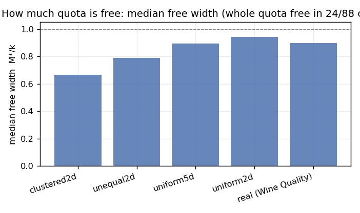
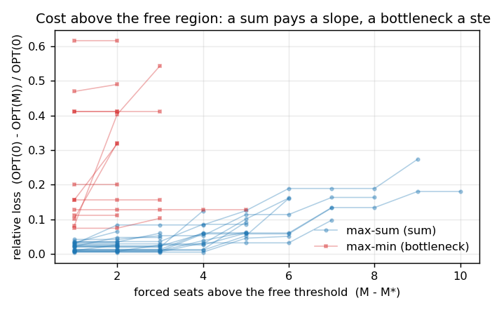
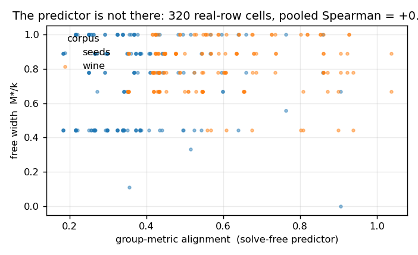

# How Much Fairness Is Free? The Zero-Cost Region of Group Quotas in Diversity Selection

## Abstract

Group quotas in clustering, subset selection and ranking are usually justified by a *worst-case* bound:
the field knows how bad a fairness constraint *can* be, and reports approximation ratios or a price of
fairness that holds for the hardest instance. This paper asks the complementary and, in practice, more
consequential question: **for a given instance, is the quota free at all, and how much of it is free
before it costs anything?** We formalise the free region with a single scalar. Selecting the
lowest-tightness proportional quota is equivalent to fixing a *forced-seat count* `M`; we define `M*` as
the largest `M` for which the constrained optimum still equals the unconstrained one, and call `M*/k` the
**free width** — the fraction of the selection that can be constrained at zero cost.

We measure the free region exactly (complete enumeration, cross-checked by an integer program) on two
objectives — a bottleneck (`max-min`) and a sum (`max-sum`) — over 64 synthetic cases (1152 cells) and on
a real corpus across 416 further cases, and report four findings, each registered as a prior before it was
measured. **(P1′ confirmed)** A non-empty free region is the rule, not the exception: the first binding
quota is free in **32/32** and **30/32** synthetic settings and **24/24** on real rows; the free width has
median **0.80–0.90**, and the *whole* quota is free in **19 of 64** synthetic cases (30 %) and **5 of 24**
real cases (21 %). **(P2′ refuted)** No cheap statistic predicts the free width. A solve-free geometric
proxy and three instance statistics were tested on a real-row sweep whose alignment input spans
**0.183–1.037** (spread 0.854) while the output spans **0.000–1.000** — both wide enough for a negative to
mean something — and every candidate loses to predicting the median. **(P3 inverted)** Above `M*`, the two
objectives behave *oppositely* to the registered prediction: the `max-min` cost curve is a **step** (median
exponent `beta = 0.000`) and the `max-sum` curve is a **slope** (`beta = 0.92`). **(P4 confirmed, with a
boundary)** The "cost of fairness" measured against a greedy baseline is **objective-specific**:
farthest-first greedy is already short of the unconstrained optimum in **7/32** `max-min` cases (median gap
17.1 %) but in only **29/32** `max-sum` cases — though the effect shrinks as groups become well separated.

The practical consequence is a decision rule a practitioner can run once: solve the unconstrained problem,
then raise the forced-seat count until the optimum first moves. The result is one number — where the free
quota ends — and this paper establishes that (i) it is usually well inside the quota, (ii) it must be
*measured*, not predicted from an instance statistic, and (iii) the shape of the cost beyond it depends on
whether the objective is a bottleneck or a sum.

## 1. Introduction

Fairness constraints on a set-selection problem are normally analysed adversarially. Fair clustering asks
for a partition in which every protected group occupies a bounded share of every cluster, and the
literature's contribution is an **approximation ratio** that holds for the worst instance
[1] [2] [3]. The same shape appears across constrained
clustering [4] [5], diversity maximization
[6] [7], fair allocation [8] [9] and fair ranking [10] [11]: a guarantee that holds no
matter how unfavourable the instance is. A price-of-fairness result [12] [13] [14] answers the attendant question — how much efficiency must be sacrificed —
again as a worst-case bound.

Worst-case bounds answer "how bad can it get?". A practitioner deploying a quota faces a different
question. They hold **one** instance — a candidate pool, a set of embedding vectors, a shortlist — and a
constraint they are told to satisfy. The question that decides whether the constraint is worth imposing is
whether it costs anything *on this instance*, and if so where the cost begins. For a proportional
group-quota requirement, "no group may be under-represented beyond a fixed level", this has a clean form.
The constraint families are naturally *indexed*: as the required representation tightens, some first level
binds and the optimum drops; all weaker levels are, on that instance, **free**.

This paper makes that observation a measured object. We select a `k`-subset of `n` points under a
proportional per-group **floor** (the largest-remainder allocation of `M` forced seats, so the floors sum to
`M` exactly). At `M = 0` the problem is the unconstrained metric diversity problem; as `M` increases, the
optimum can only fall. Define

    M*  = the largest M such that OPT(M) = OPT(0),      free width = M*/k.

`M*` is the number of seats that can be *forced* into the required groups for free, and `M*/k` is the
fraction of the selection that carries the constraint at no cost. Everything at or below `M*` is a level a
practitioner may impose without paying for it; `M*+1` is where the trade-off starts.

We ask four questions and answer them with exact computation, not approximation:

1. **How wide is the free region?** (§4) It is wide: the first binding quota is free in almost every
   instance we construct, the free width has median 0.80–0.90, and a substantial minority of instances
   carry the entire quota for free.
2. **What does the cost curve above `M*` look like?** (§5) It depends on the *objective family*, and in a
   way we registered backwards: a bottleneck objective jumps to a plateau (a step), a sum objective grows
   smoothly (a slope).
3. **Is a "cost of fairness" measured against the standard greedy baseline even the constraint's cost?**
   (§6) On a bottleneck objective the greedy gap and the constraint cost are confounded, and the confound
   shrinks as groups become well separated.
4. **Can the free width be predicted cheaply, without solving the constrained problem?** (§7) No — and
   we establish it on a real-row sweep deliberately built to have enough input and output range for the
   negative to be interpretable.

**Contributions.**

- A construct — the **zero-cost region** `M*` and the **free width** `M*/k` — that turns a worst-case bound
  into an instance-level, measurable quantity, with exact computation (§3).
- A positive empirical result: the free region is non-empty and usually wide, measured on synthetic
  families, on a real corpus, and on a sweep designed to test the predictor (§4).
- An inverted cost law: the `max-min` objective pays a **step** and the `max-sum` objective a **slope**,
  the reverse of the registered direction, with a mechanism (§5).
- A boundary on the standard baseline: greedy-vs-exact confounding is objective-specific and weakens as
  groups separate (§6).
- A negative result stated against its own prior: **no cheap statistic predicts the free width**,
  established with the input *and* output ranges measured first (§7).

**Significance.** The result changes a decision. A team imposing a proportional quota — on a candidate
shortlist, a benchmark suite, a diversifying data selector — currently has no way to know, before solving
the constrained problem, whether the quota costs them anything. This paper shows the answer is almost
always "nothing, up to a point", gives an exact and cheap procedure to find that point, and shows the point
is *not* predictable from an instance statistic, so it must be computed. That converts a design question
from "should we accept a fairness/quality trade-off?" into "where does our trade-off actually begin?" —
usually a different, easier decision.

## 2. Related work, and what this paper does differently

**Fair clustering and group-quota selection.** The dominant formalism balances every cluster with respect to
protected groups. The two anchor problems are fairlets, which reduce fair `k`-median to an unfair one
[1], and the `(k, f)`-fairness criterion with its `(3, 1)`-to-`(9, 1)` approximations and the
later improvements that carried the guarantees to `(3, 1)` and beyond [2] [15] [16] [17] [18]. Fair `k`-center and colorful variants form their
own line [2] [19] [20] [21] [22] [23] [24] [25] [26], as do individual-fairness and
distributional notions [27] [28] [29] [30] [31] [32] [33] [34]. Coresets and streaming analyses
extend the same guarantees to large data [35] [36] [37] [38] [39] [40]. Socially-fair and group-representation objectives
give the multi-group versions [41] [16] [15] [18] [42] [43] [44]. **Difference.** All of this work
is worst-case: it proves a ratio and proves it is necessary. We fix the *instance* and ask when the constraint
is inactive; our objects are exact optima `OPT(M)` for every `M`, not an approximation ratio for one `M`.

**Proportional fairness and metric committee selection.** The proportionality principle itself has a
clustering literature [45] [46] [47] [48] [49] [50] [51] and an approval-voting line [52] [53] [54]. **Difference.** Those define what a "proportional" partition *is* and
approximate it; we take the proportional floor as the constraint and measure the level at which it first
costs.

**The price of fairness.** Price-of-fairness bounds quantify the efficiency lost to a fairness constraint,
for divisible resources [12], for a bounded number of indivisible items [13],
and for indivisible goods [14] [55] [56]; and the "cost
of fairness" appears in algorithmic-decision-making settings [57] [58] [59]. **Difference.** A price-of-fairness number is a supremum over instances. We ask for the
*set of instances* on which the price is exactly zero, and we measure its width rather than its worst case.

**Coverage, diversity and dispersion maximization.** Selecting a `k`-subset that maximises spread among
points is the `max-sum` and `max-min` dispersion problem [60] [61] [62] [63] [64] [65] [66] [67] [68], now with coresets, matroid constraints and fairness constraints layered on
[6] [69] [70] [7] [71] [72] [73] [74] [75]. **Difference.** These works are
our *unconstrained* baseline, and their `max-sum` / `max-min` split is the axis along which we find the cost
law inverts (§5); we import exactly that split and add the floor.

**Submodular maximization under cardinality and matroid constraints.** Constrained selection is the
submodular-maximization problem when the objective is monotone submodular, and its algorithms (cardinality,
matroid, local search, streaming) are the machinery a floor sits on top of
[76] [77] [78] [79] [80] [81] [82] [83] [84] [85] [86] [87] [88] [89] [90] [91] [92]. **Difference.** A proportional floor is a *laminar* constraint, not a cardinality or
matroid one, and our question is about its threshold behaviour rather than about a `(1 - 1/e)`-style ratio.

**Fair allocation, indivisible goods and representation.** The quota-shaped problem appears as max-min fair
allocation and as proportional representation in multi-winner elections [93] [9] [94] [52] [95] [96] [97] [98] [99] [100]. **Difference.** These allocate *items to agents*; we
select a *subset of a metric space*, so "free" is a geometric statement about the optimum, not a welfare
statement about an allocation.

**Constrained and balanced clustering.** Balancing a partition under lower-bound or coverage constraints is
studied for its own sake [4] [5] [101] [102] [103] [104] [105] [106] [107]. **Difference.** Those works ask for a feasible balanced solution and its cost; we ask
where the cost *begins*, and show the beginning is a property of the instance that must be computed.

**Selection with quotas and affirmative action.** Quota-shaped selection appears in admissions, sortition and
top-`k` candidate selection [10] [108] [109] [110] [111] [112] [113] [11] [114] [115] [116]. **Difference.** These evaluate policies under welfare or fairness objectives on the
selected set; we isolate the *constraint's own* cost on a single instance and measure the region where it is
zero.

**Fairness in machine learning, and the disparate-impact view.** The broader fairness literature supplies the
vocabulary of group harm the quota is meant to bound [117] [118] [119] [120] [121] [122]. **Difference.** These measure outcomes of a learnt
model; we measure the price of a hard constraint on a combinatorial optimum.

**Our own anchoring literature.** This is the third study in a series on the *boundary* of a downstream
requirement — when it stops being free [123] [40] — and it keeps that series'
discipline: a construct reduced to a countable statistic, a prior registered before measurement, and a control
that can refute its author.

## 3. Problem formulation and method

**Instance.** A set of `n` points with an integer metric `d` (squared Euclidean after a fixed quantisation,
so all distances and all objective values are integers), a partition of the points into `m` groups, a
selection size `k`, and an objective in a family `F`.

**Objectives.** A **bottleneck** objective, `max-min`: maximise the minimum pairwise distance inside the
chosen `k`-subset. A **sum** objective, `max-sum`: maximise the sum of pairwise distances. Both are standard
in dispersion maximization [60] [61], and they are the two ends of a family —
the smallest order statistic and the sum of all of them — that §5 separates.

**Constraint family.** The floor family is indexed by the **forced-seat count** `M ∈ {0, …, k}`. Given the
group sizes, `ell(M)` distributes exactly `M` seats over the groups in proportion to their size by the
largest-remainder rule, and the constraint is `|S ∩ G_i| ≥ ell_i(M)` for every group `i`. `M = 0` imposes
nothing; `M = k` requires every group to receive its full proportional share. `OPT(M)` is the constrained
optimum value and `OPT(0)` the unconstrained one.

**Definition (zero-cost region).** `M* = max { M : OPT(M) = OPT(0) }`, and the **free width** is `M*/k`.
Every `M ≤ M*` is a quota level that can be imposed at no cost on this instance; `M* + 1` is the first level
that binds.

**Exact computation, two routes.** `OPT(M)` is computed by **complete enumeration** over every feasible
`k`-subset (route 1) — the definition, with no failure mode — and independently by an **integer program**
(route 2) on a *declared* subsample of settings. A third check, the max-sum coordinate identity, is
evaluated on every `max-sum` cell. Across the synthetic study (64 cases, **1152 cells**) the two routes
**never disagree** (0 cross-disagreements), no cell is unresolved, and the only non-optimal cells are
**8 infeasible** floor vectors — a legitimate verdict, never a timeout. The distinction matters: an
infeasible `M` is *measured* (that level admits no selection meeting every floor), an unresolved cell would
be a missing measurement, and only the first occurred. Integer-valued distances make every artefact
byte-identical across runs, which is what lets §10 reproduce it.

**Real corpora.** Three public datasets with real features and a real grouping variable are used: UCI
**Wine Quality (red)** — 1599 rows, 11 numeric predictors, an ordinal `quality` label used as the natural
grouping (`{3:10, 4:53, 5:681, 6:638, 7:199, 8:18}`, sha-256 `4a402cf0…`) — and UCI **Wine** (178 × 13,
three classes) and **Seeds** (210 × 7, 70/70/70), whose labels are genuinely separable in the real feature
space. All are SHA-256-pinned; the instrument re-hashes before it reads.

**Baselines.** Two constrained heuristics are measured on the same cells as the exact optimum: farthest-
first greedy with a feasibility repair, and a 1-swap local search that keeps the constraint satisfied
[124] [67]. §6 is about what it means to compare to them.

## 4. The zero-cost region: how wide it is (P1′)

**Registered prior P1′.** *Before measurement:* the free region is non-empty and its width is a non-trivial
fraction of `k`, because forcing a proportional share into large groups rarely changes the unconstrained
optimum; the first binding quota satisfies `M* > 1`.

**Result.** P1′ is confirmed, and more strongly than the prior expected.

| study | cases | `M* > M_first` | median free width `M*/k` | whole quota free |
|---|---|---|---|---|
| synthetic, setting A (`n=18, m=3, k=9`) | 32 | **32/32** | 0.833 | 11 |
| synthetic, setting B (`n=20, m=4, k=10`) | 32 | **30/32** | 0.800 | 8 |
| real, Wine Quality groups = quality bins | 24 | **24/24** | 0.900 | 5 |

The free width is not a corner case. Across the 64 synthetic cases the median is **0.80** and the whole
quota is free in **19 cases (30 %)**; on the real corpus the median is **0.90** and the whole quota is free
in **5 of 24 cases (21 %)**. By synthetic family, the median free width separates the geometries:

| family | median `M*/k` |
|---|---|
| clustered (2-D, well separated) | 0.667 |
| unequal group sizes (2-D) | 0.789 |
| uniform (5-D) | 0.894 |
| uniform (2-D) | 0.944 |



**Figure 2.** The zero-cost region by synthetic family and on the real corpus. Bars are the median free
width `M*/k`; the dashed line is the whole quota. Every family is well above zero.

The ordering (Figure 2) is the interpretable one: when the groups are geometrically separated, satisfying a
proportional floor forces selections into each cluster and costs freedom sooner; when the groups are
interleaved in a higher-dimensional cloud, the same floor is absorbed by the unconstrained optimum.

**Reading.** On these instances a practitioner can force between two-thirds and the whole of a proportional
share of the `k` seats at zero cost. The first binding quota being free in 86 of 88 cases is the paper's
central positive claim: the interesting region of a group quota is usually *inner*, not at the margin, and
the constraint is free exactly up to the level where the groups' geometry forces the issue.

## 5. What the cost curve looks like above the threshold (P3, inverted)

**Registered prior P3.** *Before measurement:* the bottleneck objective is the fragile one. A `max-min`
optimum is fixed by a single worst pair, so a floor that removes that pair should break the value abruptly;
a `max-sum` optimum aggregates many pairs, so it should degrade gradually. The registered direction was
therefore `beta_maxmin > beta_maxsum` — a steeper exponent for the bottleneck.

**Result: the measurement is the opposite, and the mechanism favours the inversion.** Above `M*`, fit
`loss ~ (M - M*)^beta` on the levels with strictly positive loss:

| objective | fittable cases | median exponent `beta` | shape |
|---|---|---|---|
| `max-min` (bottleneck) | 5 | **0.000** | step / plateau |
| `max-sum` (sum) | 17 | **0.92** | slope (near-linear) |

The `max-min` curve is **flat** above `M*` in every case with enough points to fit: once the free levels
are exhausted, the bottleneck value drops to a plateau and stops moving, because it is determined by a
single order statistic and there is nothing else to lose. The `max-sum` curve is a **slope** at `beta≈1`:
it accumulates many small substitutions, so it grows smoothly with the number of forced seats. The
mechanism we registered pointed the wrong way: a bottleneck is *rigid* precisely because it is one order
statistic, and a sum is *gradual* precisely because it is many.



**Figure 1.** The cost above `M*` for every case with at least two points above the threshold. Blue
(`max-sum`) curves rise approximately linearly; red (`max-min`) curves reach a plateau and stay flat —
the step-versus-slope contrast of the table above.

**Registered replacement.** `beta_maxsum ≈ 1` (linear) and `beta_maxmin ≈ 0` (step). This is a strong-
novelty outcome in the sense of the journal's bar — a registered, mechanism-anchored prior contradicted by
measurement — and §8 records it as such.

**Boundary.** The substitution the real corpora impose is coarser: on the Wine Quality corpus only 7 of 24
cases have ≥3 points above `M*`, and there the `max-min` fit aggregates to `beta = 0.000` while `max-sum`
aggregates to `0.178` (with individual values 0.744 and 0.570). The replacement survives in sign on real
data; it is simply underpowered where the free width is so large that few levels remain to fit.

## 6. The baseline confound is objective-specific (P4)

A natural way to state "the cost of a quota" is against a heuristic: run farthest-first greedy, run the
constrained optimum, and call the difference the cost of fairness. That comparison is only the constraint's
cost if greedy has already reached the unconstrained optimum. It often has not.

**Result.** On the unconstrained instance, farthest-first greedy is exact in a *minority* of bottleneck
cases and in almost all sum cases:

| substrate | `max-min` greedy exact | `max-min` median gap | `max-sum` greedy exact | `max-sum` median gap |
|---|---|---|---|---|
| synthetic (32 cases) | **7/32** | 17.1 % | **29/32** | 0.0 % |
| real, Wine Quality (12 cases) | **4/12** | 1.7 % | **9/12** | 0.0 % |
| real-row wide sweep (160 cases) | 100/160 | 0.0 % | 120/160 | 0.0 % |

On a bottleneck objective, then, an empirical "cost of fairness" measured against greedy is **dominated by
approximation error** — the greedy baseline is short of the unconstrained optimum before any quota is
applied, with a median relative gap of 17 % and a maximum of 46.9 % on the synthetic family. On a sum
objective the same comparison is sound. P4 is confirmed as an objective-specific confound.

**Boundary (found on the sweep).** The confound weakens as the groups become well separated: on the
real-row wide sweep (Wine and Seeds, both with genuinely separable labels) the median greedy gap collapses
to **0.0 %** for both objectives and the exact counts rise to 100/160 and 120/160. So the P4 lesson is not
"greedy is always a bad baseline"; it is that **whether it is a valid baseline is itself an empirical
question, object-specific and instance-dependent**. A paper that measures a cost of fairness against greedy
on a bottleneck objective without checking this is reporting an approximation gap as a fairness cost.

## 7. The predictor that is not there (P2′)

**Registered prior P2′.** *Before measurement:* the free width is predictable out of sample by a cheap proxy
that does **not** solve the constrained problem — so a practitioner could estimate their free region without
running the exact computation. The candidate was a solve-free geometric proxy: the ratio of mean
within-group to mean between-group distance (the groups' *alignment* in the metric).

**Result: refuted — and the refutation is only interpretable because the test's ranges were measured
first.** We built a real-row sweep that holds the metric fixed and varies only the partition, sweeping the
alignment from label-aligned to label-blind. Across **320 cells** the predictor's input spans
**0.183–1.037** (spread **0.854**) and the output — the free width — spans **0.000–1.000** across **9
distinct values** (spread **1.000**). Both ranges are wide; a negative here is a finding, not an artefact of
a dead variable.



**Figure 3.** The predictor against the outcome on the 320-cell real-row sweep: group-metric alignment
(x) versus free width (y), both corpora overlaid. The cloud is a rectangle — no relation — and the
pooled Spearman is printed in the title.

The predictor fails on three independent readings:

| reading | value |
|---|---|
| pooled Spearman (average-rank, 320 cells) | **+0.108** (Wine +0.119, Seeds −0.006) |
| MAE vs a constant predictor | **0.1675** vs **0.1649** (it *loses*) |
| within-group ordering (alignment order = width order) | **1 of 32** groups |

The pooled correlation is not merely weak, it is a **stride across strata**, not a relation within them.
Splitting by objective shows why: inside `max-sum` the candidate is *identically degenerate* (`n_optima = 1`
in all 160 cells; a max-sum optimum is unique), so it cannot predict there, while inside `max-min` it is
**non-transportable** (Seeds `rho = +0.488` but Wine `rho = +0.161` with a negative MAE gain). A statistic
that is constant in one stratum and inverts in another is not a predictor. We tested three further cheap
candidates — a solve-free alignment proxy, the greedy gap at `M = 0`, and the unconstrained optimum's own
degeneracy — and **none has a positive MAE gain in every stratum**.

**Reading.** The free width must be computed, not predicted. This sharpens the practical rule from §4: the
procedure is to solve the unconstrained problem and then walk `M` upward until the optimum first moves —
cheap, exact, and not replaceable by an instance statistic. It also makes the paper's negative result a
clean one: the object is not merely unpredicted by *our* proxy, it is unpredicted by any of the cheap
statistics we could construct, on input and output ranges wide enough to have found a relation if one
existed.

## 8. Registered prior beliefs, against their outcomes

Each prior was recorded before measurement. Verdicts:

| prior | registered direction | outcome |
|---|---|---|
| **P1′** | the free region is non-empty and its width is a non-trivial fraction of `k` | **CONFIRMED** (32/32 and 30/32 synthetic; 24/24 real; median 0.80–0.90) |
| **P2′** | a cheap, solve-free proxy predicts `M*/k` out of sample | **REFUTED** (pooled ρ +0.108 on a 0.854-wide input; loses to the constant; 1/32 within-group) |
| **P3** | `beta_maxmin > beta_maxsum` — the bottleneck breaks abruptly | **REFUTED AND INVERTED** (`max-min` median `beta = 0.000`, `max-sum` 0.92) |
| **P4** | a greedy baseline confounds the measured cost of fairness | **CONFIRMED as objective-specific** (7/32 vs 29/32 synthetic; 4/12 vs 9/12 real), with a boundary (weakens on separable groups) |

One prior was replaced *before* the deciding runs, and the replacement is recorded here for honesty: an
initial registration used the total forced-seat fraction `F` as the constraint index, but `F` is a
re-parameterisation of `M` that changes nothing — any set achieving `OPT(0)` is, definitionally, an
unconstrained optimum — so the "prior" was a tautology and was replaced by the forced-seat count `M`, whose
grid is the one that actually binds. A prior that follows from a definition is not falsifiable and does not
belong in this table as evidence.

The P3 inversion is the paper's strongest novelty signal: a registered, mechanism-anchored prediction was
contradicted by measurement, and the mechanism was re-derived from the result rather than the result from
the mechanism.

## 9. Threats to validity

**Scale.** The exact study is at `n = 18–20`, `k = 9–10`, `m = 3–4` — small enough that complete
enumeration is possible (which is the point: the objects are exact, not approximated). Whether the free
width *grows* or *shrinks* with `n` at fixed group geometry is not established here; the construct is
computable at any `n` for which the constrained problem is solvable, and the claim we make is about the
*width of the free region*, not about its asymptotics.

**Objectives.** We study two objectives, chosen as the two ends of the order-statistic family. Intermediate
objectives (`k`-centre-style, ordered-median [125], hybrid [126]) are not
measured; the step-vs-slope law is a claim about bottleneck vs sum, and the boundary between them is left
open.

**Real corpora.** The real grouping variable is a natural one (an ordinal quality label; class labels), not
a fairness-sensitive attribute. The study is about the *behaviour of the constraint* on real metric
structure, not about a deployed fairness decision; the three corpora were chosen because their groups are
genuinely (non-)separated, which is what the predictor test needed.

**The predictor negative.** We tested four cheap statistics, not all possible ones. The claim is the
defensible weaker one — *these* candidates fail, on a sweep whose ranges were measured to be wide — not that
no statistic could ever predict the free width.

**Why still worth publishing.** The positive result (a wide, exact, cheaply-located free region) and the
inverted cost law are both instance-level facts about a construct the worst-case literature does not
measure, established on exact optima with two agreeing routes and a byte-reproducible pipeline. The
negative predictor result is a design constraint on anyone who would estimate the free region instead of
computing it, which is the natural next thing to try.

## 10. Reproducibility

Every number in this paper is re-derived from the instrument artefacts by one script, and the whole study
is reproduced by one command:

```
bash reproduce.sh           # fast: pins + certificates + canonical re-derivation -> ALL GREEN (7 steps)
bash reproduce.sh --full    # adds the instrument re-runs; requires BYTE-IDENTICAL artefacts (10 steps)
```

`canonical.py` re-derives every headline number from `spike_v3/v4/v5_results.json` and names the source of
each, so no number in the manuscript is retyped; `canonical.py --check` asserts the headline claims (the
strict `M* > M_first` counts, the wide-sweep ranges, the near-zero pooled correlation, the P3 exponents).
Each instrument and analyser carries certificates exercised on a **healthy and a mutated** object, so a
check that cannot fire is caught. The three instruments regenerate **byte-identical** on a re-run
(11m08s). Corpora are SHA-256-pinned and re-hashed before every read. All artefacts are integer-valued,
which is what makes byte-identity possible; the environment is Python 3.9 with numpy, and no random state
crosses a run boundary.

[1] Flavio Chierichetti, Ravi Kumar, Silvio Lattanzi, et al. (2018). Fair Clustering Through Fairlets. arXiv preprint. https://arxiv.org/abs/1802.05733
[2] Matthäus Kleindessner, Pranjal Awasthi, Jamie Morgenstern (2019). Fair k-Center Clustering for Data Summarization. arXiv preprint. https://arxiv.org/abs/1901.08628
[3] Matthäus Kleindessner, Samira Samadi, Pranjal Awasthi, et al. (2019). Guarantees for Spectral Clustering with Fairness Constraints. arXiv preprint. https://arxiv.org/abs/1901.08668
[4] Zhenguo Li, Jianzhuang Liu, Xiaoou Tang (2009). Constrained clustering via spectral regularization. DOI: 10.1109/cvprw.2009.5206852. https://doi.org/10.1109/cvprw.2009.5206852
[5] Anna Arutyunova, Melanie Schmidt (2020). Achieving anonymity via weak lower bound constraints for k-median and k-means. arXiv preprint. https://arxiv.org/abs/2009.03078
[6] Zeinab Abbassi, Vahab S. Mirrokni, Mayur Thakur (2013). Diversity maximization under matroid constraints. DOI: 10.1145/2487575.2487636. https://doi.org/10.1145/2487575.2487636
[7] Iiro Kumpulainen, Florian Adriaens, Nikolaj Tatti (2025). Max-Min Diversification with Asymmetric Distances. arXiv preprint. https://arxiv.org/abs/2502.02530
[8] Ioannis Caragiannis, David Kurokawa, Hervé Moulin, et al. (2016). The Unreasonable Fairness of Maximum Nash Welfare. DOI: 10.1145/2940716.2940726. https://doi.org/10.1145/2940716.2940726
[9] Mohammad Ghodsi, MohammadTaghi Hajiaghayi, Masoud Seddighin, et al. (2017). Fair Allocation of Indivisible Goods: Improvement and Generalization. arXiv preprint. https://arxiv.org/abs/1704.00222
[10] Michael Mathioudakis, Carlos Castillo, Giorgio Barnabo, et al. (2019). Affirmative Action Policies for Top-k Candidates Selection, With an Application to the Design of Policies for University Admissions. arXiv preprint. https://arxiv.org/abs/1905.09947
[11] Sruthi Gorantla, Amit Deshpande, Anand Louis (2020). On the Problem of Underranking in Group-Fair Ranking. arXiv preprint. https://arxiv.org/abs/2010.06986
[12] Gaia Nicosia, Andrea Pacifici, Ulrich Pferschy (2015). Price of Fairness for Allocating a Bounded Resource. arXiv preprint. https://arxiv.org/abs/1508.05253
[13] Sascha Kurz (2014). The price of fairness for a small number of indivisible items. arXiv preprint. https://arxiv.org/abs/1406.5722
[14] Xiaohui Bei, Xinhang Lu, Pasin Manurangsi, et al. (2019). The Price of Fairness for Indivisible Goods. DOI: 10.24963/ijcai.2019/12. https://doi.org/10.24963/ijcai.2019/12
[15] Yury Makarychev, Ali Vakilian (2021). Approximation Algorithms for Socially Fair Clustering. arXiv preprint. https://arxiv.org/abs/2103.02512
[16] Mehrdad Ghadiri, Mohit Singh, Santosh S. Vempala (2022). Constant-Factor Approximation Algorithms for Socially Fair $k$-Clustering. arXiv preprint. https://arxiv.org/abs/2206.11210
[17] Di Wu, Qilong Feng, Jianxin Wang (2022). New Approximation Algorithms for Fair $k$-median Problem. arXiv preprint. https://arxiv.org/abs/2202.06259
[18] Matteo Böhm, Adriano Fazzone, Stefano Leonardi, et al. (2020). Fair Clustering with Multiple Colors. arXiv preprint. https://arxiv.org/abs/2002.07892
[19] Sayan Bandyapadhyay, Tanmay Inamdar, Shreyas Pai, et al. (2019). A Constant Approximation for Colorful k-Center. arXiv preprint. https://arxiv.org/abs/1907.08906
[20] Xinrui Jia, Kshiteej Sheth, Ola Svensson (2020). Fair Colorful k-Center Clustering. arXiv preprint. https://arxiv.org/abs/2007.04059
[21] Vacharapat Mettanant, Jittat Fakcharoenphol (2021). Fair Resource Allocation for Demands with Sharp Lower Tail Inequalities. arXiv preprint. https://arxiv.org/abs/2101.12403
[22] Ashish Chiplunkar, Sagar Kale, Sivaramakrishnan Natarajan Ramamoorthy (2020). How to Solve Fair $k$-Center in Massive Data Models. arXiv preprint. https://arxiv.org/abs/2002.07682
[23] Jinxiang Gan, Mordecai Golin, Zonghan Yang, et al. (2023). Fair $k$-Center: a Coreset Approach in Low Dimensions. arXiv preprint. https://arxiv.org/abs/2302.09911
[24] Huy Lê Nguyen, Thy Nguyen, Matthew Jones (2022). Fair Range k-center. arXiv preprint. https://arxiv.org/abs/2207.11337
[25] Seyed A. Esmaeili, Sharmila Duppala, John P. Dickerson, et al. (2022). Fair Labeled Clustering. arXiv preprint. https://arxiv.org/abs/2205.14358
[26] Tai Le Quy, Arjun Roy, Gunnar Friege, et al. (2021). Fair-Capacitated Clustering. arXiv preprint. https://arxiv.org/abs/2104.12116
[27] Matthäus Kleindessner, Pranjal Awasthi, Jamie Morgenstern (2020). A Notion of Individual Fairness for Clustering. arXiv preprint. https://arxiv.org/abs/2006.04960
[28] Sepideh Mahabadi, Ali Vakilian (2020). Individual Fairness for $k$-Clustering. arXiv preprint. https://arxiv.org/abs/2002.06742
[29] Ali Vakilian, Mustafa Yalçıner (2021). Improved Approximation Algorithms for Individually Fair Clustering. arXiv preprint. https://arxiv.org/abs/2106.14043
[30] Matthijs Ebbens, Nicole Funk, Jan Höckendorff, et al. (2024). A Subquadratic Time Approximation Algorithm for Individually Fair k-Center. arXiv preprint. https://arxiv.org/abs/2412.04943
[31] Nihesh Anderson, Suman K. Bera, Syamantak Das, et al. (2020). Distributional Individual Fairness in Clustering. arXiv preprint. https://arxiv.org/abs/2006.12589
[32] Debajyoti Kar, Mert Kosan, Debmalya Mandal, et al. (2021). Feature-based Individual Fairness in k-Clustering. arXiv preprint. https://arxiv.org/abs/2109.04554
[33] Binita Maity, Shrutimoy Das, Anirban Dasgupta (2025). Local Search-based Individually Fair Clustering with Outliers. arXiv preprint. https://arxiv.org/abs/2510.06130
[34] Binita Maity, Shrutimoy Das, Anirban Dasgupta (2024). Linear Programming based Approximation to Individually Fair k-Clustering with Outliers. arXiv preprint. https://arxiv.org/abs/2412.10923
[35] Lingxiao Huang, Shaofeng H. -C. Jiang, Nisheeth K. Vishnoi (2019). Coresets for Clustering with Fairness Constraints. arXiv preprint. https://arxiv.org/abs/1906.08484
[36] Sayan Bandyapadhyay, Fedor V. Fomin, Kirill Simonov (2020). On Coresets for Fair Clustering in Metric and Euclidean Spaces and Their Applications. arXiv preprint. https://arxiv.org/abs/2007.10137
[37] Melanie Schmidt, Chris Schwiegelshohn, Christian Sohler (2018). Fair Coresets and Streaming Algorithms for Fair k-Means Clustering. arXiv preprint. https://arxiv.org/abs/1812.10854
[38] Claudio Mantuano, Manuel Kammermann, Philipp Baumann (2026). Fast and effective algorithms for fair clustering at scale. arXiv preprint. https://arxiv.org/abs/2605.13759
[39] Jinwon Park, Kunwoong Kim, Jihu Lee, et al. (2026). Fair Model-based Clustering. arXiv preprint. https://arxiv.org/abs/2602.21509
[40] Diptarka Chakraborty, Kushagra Chatterjee, Debarati Das, et al. (2026). A Generic Framework for Fair Consensus Clustering in Streams. arXiv preprint. https://arxiv.org/abs/2602.11500
[41] Mehrdad Ghadiri, Samira Samadi, Santosh Vempala (2021). Socially Fair k-Means Clustering. DOI: 10.1145/3442188.3445906. https://doi.org/10.1145/3442188.3445906
[42] Zhen Dai, Yury Makarychev, Ali Vakilian (2022). Fair Representation Clustering with Several Protected Classes. arXiv preprint. https://arxiv.org/abs/2202.01391
[43] Savitha Sam Abraham, Deepak P, Sowmya S Sundaram (2019). Fairness in Clustering with Multiple Sensitive Attributes. arXiv preprint. https://arxiv.org/abs/1910.05113
[44] Mohsen Abbasi, Aditya Bhaskara, Suresh Venkatasubramanian (2020). Fair clustering via equitable group representations. arXiv preprint. https://arxiv.org/abs/2006.11009
[45] Xingyu Chen, Brandon Fain, Liang Lyu, et al. (2019). Proportionally Fair Clustering. arXiv preprint. https://arxiv.org/abs/1905.03674
[46] Leon Kellerhals, Jannik Peters (2023). Proportional Fairness in Clustering: A Social Choice Perspective. arXiv preprint. https://arxiv.org/abs/2310.18162
[47] Yusuf Hakan Kalayci, David Kempe, Vikram Kher (2023). Proportional Representation in Metric Spaces and Low-Distortion Committee Selection. arXiv preprint. https://arxiv.org/abs/2312.10369
[48] Sayan Bandyapadhyay, Fedor V. Fomin, Tanmay Inamdar, et al. (2023). Proportionally Fair Matching with Multiple Groups. arXiv preprint. https://arxiv.org/abs/2301.03862
[49] Leon Kellerhals, Jannik Peters (2025). Proportional Clustering, the $β$-Plurality Problem, and Metric Distortion. arXiv preprint. https://arxiv.org/abs/2502.10068
[50] Ioannis Caragiannis, Evi Micha, Nisarg Shah (2024). Proportional Fairness in Non-Centroid Clustering. arXiv preprint. https://arxiv.org/abs/2410.23273
[51] Benjamin Cookson, Eva Deltl, Yeeseok Oh (2026). Improved Lower Bounds for Proportionally Fair Clustering. arXiv preprint. https://arxiv.org/abs/2606.07285
[52] Jarosław Byrka, Piotr Skowron, Krzysztof Sornat (2017). Proportional Approval Voting, Harmonic k-median, and Negative Association. arXiv preprint. https://arxiv.org/abs/1704.02183
[53] Kunal Relia (2022). Fairly Allocating Utility in Constrained Multiwinner Elections. arXiv preprint. https://arxiv.org/abs/2211.12820
[54] Ameet Gadekar, Aristides Gionis, Suhas Thejaswi, et al. (2025). Fair Committee Selection under Ordinal Preferences and Limited Cardinal Information. arXiv preprint. https://arxiv.org/abs/2512.24934
[55] Karen Frilya Celine, Muhammad Ayaz Dzulfikar, Ivan Adrian Koswara (2024). Egalitarian Price of Fairness for Indivisible Goods. arXiv preprint. https://arxiv.org/abs/2402.16145
[56] Ankang Sun, Bo Li (2022). On the Price of Fairness of Allocating Contiguous Blocks. arXiv preprint. https://arxiv.org/abs/2205.10836
[57] Sam Corbett-Davies, Emma Pierson, Avi Feller, et al. (2017). Algorithmic decision making and the cost of fairness. arXiv preprint. https://arxiv.org/abs/1701.08230
[58] Bruno Scarone, Alfredo Viola, Renée J. Miller (2026). Data Bias Mitigation under Coverage Constraints & The Price of Fairness. arXiv preprint. https://arxiv.org/abs/2606.20461
[59] Amir Asiaee, Kaveh Aryan (2026). Fix Representation (Optimally) Before Fairness: Finite-Sample Shrinkage Population Correction and the True Price of Fairness Under Subpopulation Shift. arXiv preprint. https://arxiv.org/abs/2602.05707
[60] Sandor P. Fekete, Henk Meijer (2003). Maximum dispersion and geometric maximum weight cliques. arXiv preprint. https://arxiv.org/abs/cs/0310037
[61] Allan Borodin, Aadhar Jain, Hyun Chul Lee, et al. (2012). Max-Sum Diversification, Monotone Submodular Functions and Dynamic Updates. arXiv preprint. https://arxiv.org/abs/1203.6397
[62] Sepehr Abbasi Zadeh, Mehrdad Ghadiri (2015). Max-Sum Diversification, Monotone Submodular Functions and Semi-metric Spaces. arXiv preprint. https://arxiv.org/abs/1511.02402
[63] Alfonso Cevallos, Friedrich Eisenbrand, Rico Zenklusen (2015). Max-sum diversity via convex programming. arXiv preprint. https://arxiv.org/abs/1511.07077
[64] Alfonso Cevallos, Friedrich Eisenbrand, Rico Zenklusen (2016). Local Search for Max-Sum Diversification. arXiv preprint. https://arxiv.org/abs/1607.04557
[65] Alfonso Cevallos, Friedrich Eisenbrand, Sarah Morell (2018). Diversity maximization in doubling metrics. arXiv preprint. https://arxiv.org/abs/1809.09521
[66] Matteo Ceccarello, Andrea Pietracaprina, Geppino Pucci, et al. (2016). MapReduce and Streaming Algorithms for Diversity Maximization in Metric Spaces of Bounded Doubling Dimension. arXiv preprint. https://arxiv.org/abs/1605.05590
[67] Daniel Hsu, Matus Telgarsky (2016). Greedy bi-criteria approximations for $k$-medians and $k$-means. arXiv preprint. https://arxiv.org/abs/1607.06203
[68] Paolo Pellizzoni, Andrea Pietracaprina, Geppino Pucci (2023). Fully dynamic clustering and diversity maximization in doubling metrics. arXiv preprint. https://arxiv.org/abs/2302.07771
[69] Matteo Ceccarello, Andrea Pietracaprina, Geppino Pucci (2020). A General Coreset-Based Approach to Diversity Maximization under Matroid Constraints. arXiv preprint. https://arxiv.org/abs/2002.03175
[70] Yanhao Wang, Michael Mathioudakis, Jia Li, et al. (2023). Max-Min Diversification with Fairness Constraints: Exact and Approximation Algorithms. arXiv preprint. https://arxiv.org/abs/2301.02053
[71] Soh Kumabe (2024). Max-Distance Sparsification for Diversification and Clustering. arXiv preprint. https://arxiv.org/abs/2411.02845
[72] Sepideh Mahabadi, Shyam Narayanan (2023). Improved Diversity Maximization Algorithms for Matching and Pseudoforest. arXiv preprint. https://arxiv.org/abs/2307.04329
[73] Margaret Mitchell, Dylan Baker, Nyalleng Moorosi, et al. (2020). Diversity and Inclusion Metrics in Subset Selection. arXiv preprint. https://arxiv.org/abs/2002.03256
[74] Amir Abboud, Vincent Cohen-Addad, Euiwoong Lee, et al. (2022). Improved Approximation Algorithms and Lower Bounds for Search-Diversification Problems. arXiv preprint. https://arxiv.org/abs/2203.01857
[75] Lukas Drexler, Jan Eube, Kelin Luo, et al. (2022). Connected k-Center and k-Diameter Clustering. arXiv preprint. https://arxiv.org/abs/2211.02176
[76] Niv Buchbinder, Moran Feldman, Joseph (Seffi) Naor, et al. (2014). Submodular Maximization with Cardinality Constraints. DOI: 10.1137/1.9781611973402.106. https://doi.org/10.1137/1.9781611973402.106
[77] Yuval Filmus, Justin Ward (2012). A Tight Combinatorial Algorithm for Submodular Maximization Subject to a Matroid Constraint. arXiv preprint. https://arxiv.org/abs/1204.4526
[78] Daniel Golovin, Andreas Krause (2011). Adaptive Submodular Optimization under Matroid Constraints. arXiv preprint. https://arxiv.org/abs/1101.4450
[79] Kanthi K. Sarpatwar, Baruch Schieber, Hadas Shachnai (2017). Constrained Submodular Maximization via Greedy Local Search. arXiv preprint. https://arxiv.org/abs/1705.06319
[80] Niv Buchbinder, Moran Feldman (2015). Deterministic Algorithms for Submodular Maximization Problems. arXiv preprint. https://arxiv.org/abs/1508.02157
[81] Shayan Oveis Gharan, Jan Vondrák (2010). Submodular Maximization by Simulated Annealing. arXiv preprint. https://arxiv.org/abs/1007.1632
[82] Marwa El Halabi, Jakub Tarnawski, Ashkan Norouzi-Fard, et al. (2023). Fairness in Submodular Maximization over a Matroid Constraint. arXiv preprint. https://arxiv.org/abs/2312.14299
[83] Marwa El Halabi, Federico Fusco, Ashkan Norouzi-Fard, et al. (2023). Fairness in Streaming Submodular Maximization over a Matroid Constraint. arXiv preprint. https://arxiv.org/abs/2305.15118
[84] Shaojie Tang, Jing Yuan (2023). Beyond Submodularity: A Unified Framework of Randomized Set Selection with Group Fairness Constraints. arXiv preprint. https://arxiv.org/abs/2304.06596
[85] Baharan Mirzasoleiman, Amin Karbasi, Rik Sarkar, et al. (2014). Distributed Submodular Maximization. arXiv preprint. https://arxiv.org/abs/1411.0541
[86] Chien-Chung Huang, Naonori Kakimura, Simon Mauras, et al. (2020). Approximability of Monotone Submodular Function Maximization under Cardinality and Matroid Constraints in the Streaming Model. arXiv preprint. https://arxiv.org/abs/2002.05477
[87] Chien-Chung Huang, Theophile Thiery, Justin Ward (2021). Improved Multi-Pass Streaming Algorithms for Submodular Maximization with Matroid Constraints. arXiv preprint. https://arxiv.org/abs/2102.09679
[88] Lan N. Nguyen, My T. Thai (2022). Efficient Algorithms for Monotone Non-Submodular Maximization with Partition Matroid Constraint. arXiv preprint. https://arxiv.org/abs/2204.13832
[89] Niv Buchbinder, Moran Feldman (2024). Deterministic Algorithm and Faster Algorithm for Submodular Maximization subject to a Matroid Constraint. arXiv preprint. https://arxiv.org/abs/2408.03583
[90] Eric Balkanski, Aviad Rubinstein, Yaron Singer (2018). An Optimal Approximation for Submodular Maximization under a Matroid Constraint in the Adaptive Complexity Model. arXiv preprint. https://arxiv.org/abs/1811.03093
[91] Shinsaku Sakaue (2016). On maximizing a monotone k-submodular function subject to a matroid constraint. arXiv preprint. https://arxiv.org/abs/1607.07957
[92] Shuxian Niu, Qian Liu, Yang Zhou, et al. (2023). Fast algorithms for k-submodular maximization subject to a matroid constraint. arXiv preprint. https://arxiv.org/abs/2307.13996
[93] T-H. Hubert Chan, Zhihao Gavin Tang, Xiaowei Wu (2016). On ($1$, $ε$)-Restricted Max-Min Fair Allocation Problem. arXiv preprint. https://arxiv.org/abs/1611.08060
[94] Alireza Farhadi, Mohammad Ghodsi, MohammadTaghi Hajiaghayi, et al. (2017). Fair Allocation of Indivisible Goods to Asymmetric Agents. arXiv preprint. https://arxiv.org/abs/1703.01649
[95] Haris Aziz, Bo Li, Herve Moulin, et al. (2022). Algorithmic Fair Allocation of Indivisible Items: A Survey and New Questions. arXiv preprint. https://arxiv.org/abs/2202.08713
[96] Warut Suksompong (2018). Asymptotic Existence of Proportionally Fair Allocations. arXiv preprint. https://arxiv.org/abs/1806.00218
[97] Alexander Peysakhovich, Christian Kroer (2019). Fair Division Without Disparate Impact. arXiv preprint. https://arxiv.org/abs/1906.02775
[98] Bo Li, Ankang Sun, Shiji Xing (2024). A Fair Allocation is Approximately Optimal for Indivisible Chores, or Is It?. arXiv preprint. https://arxiv.org/abs/2410.15738
[99] Carmel Baharav, Bailey Flanigan (2024). Fair, Manipulation-Robust, and Transparent Sortition. arXiv preprint. https://arxiv.org/abs/2406.15009
[100] Bailey Flanigan, Paul Gölz, Anupam Gupta, et al. (2020). Neutralizing Self-Selection Bias in Sampling for Sortition. arXiv preprint. https://arxiv.org/abs/2006.10498
[101] Renbo Pan, Caiming Zhong, Jiangbo Qian (2024). Balanced Fair K-Means Clustering. DOI: 10.1109/tii.2023.3342888. https://doi.org/10.1109/tii.2023.3342888
[102] Suhas Thejaswi, Ameet Gadekar, Bruno Ordozgoiti, et al. (2024). Diversity-aware clustering: Computational Complexity and Approximation Algorithms. arXiv preprint. https://arxiv.org/abs/2401.05502
[103] Lingxiao Huang, Jian Li, Pinyan Lu, et al. (2023). Coresets for Constrained Clustering: General Assignment Constraints and Improved Size Bounds. arXiv preprint. https://arxiv.org/abs/2301.08460
[104] Hu Ding (2018). Faster Balanced Clusterings in High Dimension. arXiv preprint. https://arxiv.org/abs/1809.00932
[105] Vincent Froese, Leon Kellerhals, Rolf Niedermeier (2021). Modification-Fair Cluster Editing. arXiv preprint. https://arxiv.org/abs/2112.03183
[106] Maximilian Fiedler, Peter Gritzmann, Fabian Klemm (2022). On resolution coresets for constrained clustering. arXiv preprint. https://arxiv.org/abs/2204.00893
[107] Sujoy Bhore, Ameet Gadekar, Tanmay Inamdar (2025). Clustering under Constraints: Efficient Parameterized Approximation Schemes. arXiv preprint. https://arxiv.org/abs/2504.06980
[108] Vitalii Emelianov, Nicolas Gast, Krishna P. Gummadi, et al. (2020). On Fair Selection in the Presence of Implicit Variance. arXiv preprint. https://arxiv.org/abs/2006.13699
[109] Yixin Wang, Dhanya Sridhar, David M. Blei (2019). Equal Opportunity and Affirmative Action via Counterfactual Predictions. arXiv preprint. https://arxiv.org/abs/1905.10870
[110] Yuri Faenza, Swati Gupta, Aapeli Vuorinen, et al. (2020). Reducing the Filtering Effect in Public School Admissions: A Bias-aware Analysis for Targeted Interventions. arXiv preprint. https://arxiv.org/abs/2004.10846
[111] Corinna Hertweck, Carlos Castillo, Michael Mathioudakis (2020). Towards Data-Driven Affirmative Action Policies under Uncertainty. arXiv preprint. https://arxiv.org/abs/2007.01202
[112] Yun Liu (2021). On the Equivalence of Two Competing Affirmative Actions in School Choice. arXiv preprint. https://arxiv.org/abs/2112.14074
[113] David Garcia-Soriano, Francesco Bonchi (2021). Maxmin-Fair Ranking: Individual Fairness under Group-Fairness Constraints. arXiv preprint. https://arxiv.org/abs/2106.08652
[114] Yanhao Wang, Francesco Fabbri, Michael Mathioudakis (2020). Fair and Representative Subset Selection from Data Streams. arXiv preprint. https://arxiv.org/abs/2010.04412
[115] Siddhartha Banerjee, Matthew Eichhorn, David Kempe (2022). Allocating with Priorities and Quotas: Algorithms, Complexity, and Dynamics. arXiv preprint. https://arxiv.org/abs/2204.13019
[116] Ryosuke Sonoda (2021). A Pre-processing Method for Fairness in Ranking. arXiv preprint. https://arxiv.org/abs/2110.15503
[117] Muhammad Bilal Zafar, Isabel Valera, Manuel Gomez Rodriguez, et al. (2016). Fairness Beyond Disparate Treatment & Disparate Impact: Learning Classification without Disparate Mistreatment. arXiv preprint. https://arxiv.org/abs/1610.08452
[118] Hao Wang, Berk Ustun, Flavio P. Calmon (2018). On the Direction of Discrimination: An Information-Theoretic Analysis of Disparate Impact in Machine Learning. arXiv preprint. https://arxiv.org/abs/1801.05398
[119] Meraj Hashemizadeh, Juan Ramirez, Rohan Sukumaran, et al. (2023). Balancing Act: Constraining Disparate Impact in Sparse Models. arXiv preprint. https://arxiv.org/abs/2310.20673
[120] Xianli Zeng, Edgar Dobriban, Guang Cheng (2022). Bayes-Optimal Classifiers under Group Fairness. arXiv preprint. https://arxiv.org/abs/2202.09724
[121] Zhenhuan Yang, Yan Lok Ko, Kush R. Varshney, et al. (2022). Minimax AUC Fairness: Efficient Algorithm with Provable Convergence. arXiv preprint. https://arxiv.org/abs/2208.10451
[122] Nicolas Schreuder, Evgenii Chzhen (2021). Classification with abstention but without disparities. arXiv preprint. https://arxiv.org/abs/2102.12258
[123] Aida Khajavirad, Huanwen Shen, Yakun Wang (2026). A scalable linear programming-based framework for data clustering. arXiv preprint. https://arxiv.org/abs/2607.06709
[124] Vincent Cohen-Addad, Philip N. Klein, Claire Mathieu (2016). Local search yields approximation schemes for k-means and k-median in Euclidean and minor-free metrics. arXiv preprint. https://arxiv.org/abs/1603.09535
[125] Deeparnab Chakrabarty, Chaitanya Swamy (2017). Interpolating between $k$-Median and $k$-Center: Approximation Algorithms for Ordered $k$-Median. arXiv preprint. https://arxiv.org/abs/1711.08715
[126] Fedor V. Fomin, Petr A. Golovach, Tanmay Inamdar, et al. (2024). Hybrid k-Clustering: Blending k-Median and k-Center. arXiv preprint. https://arxiv.org/abs/2407.08295
