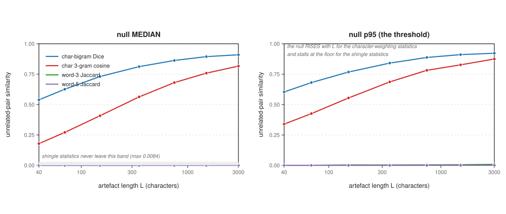
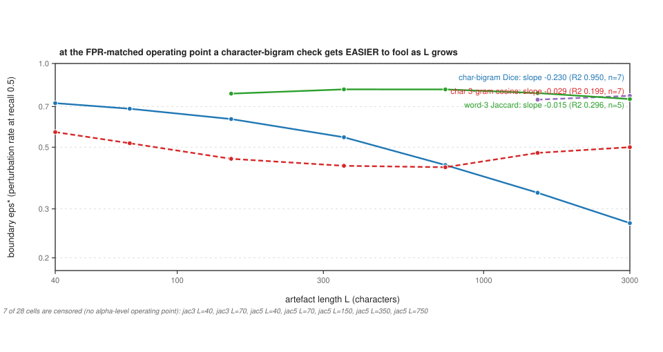
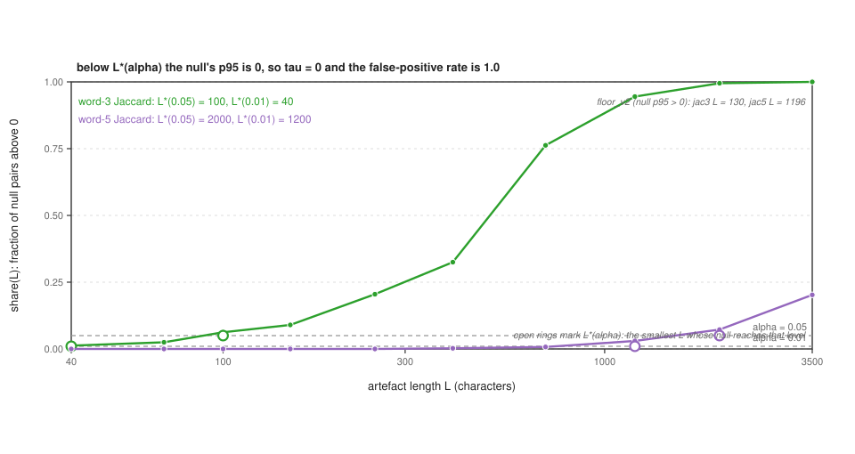
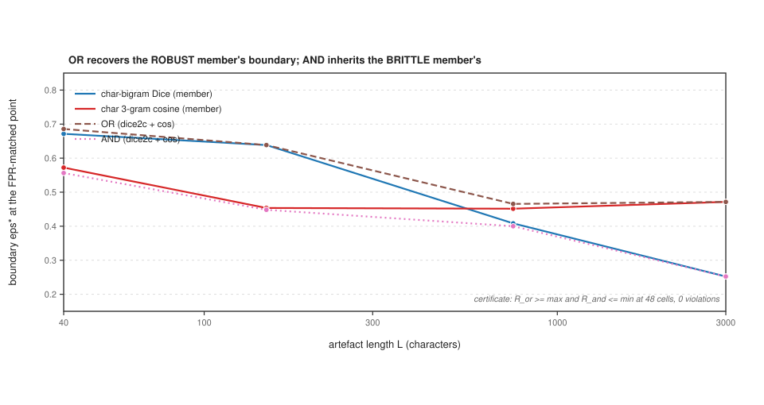
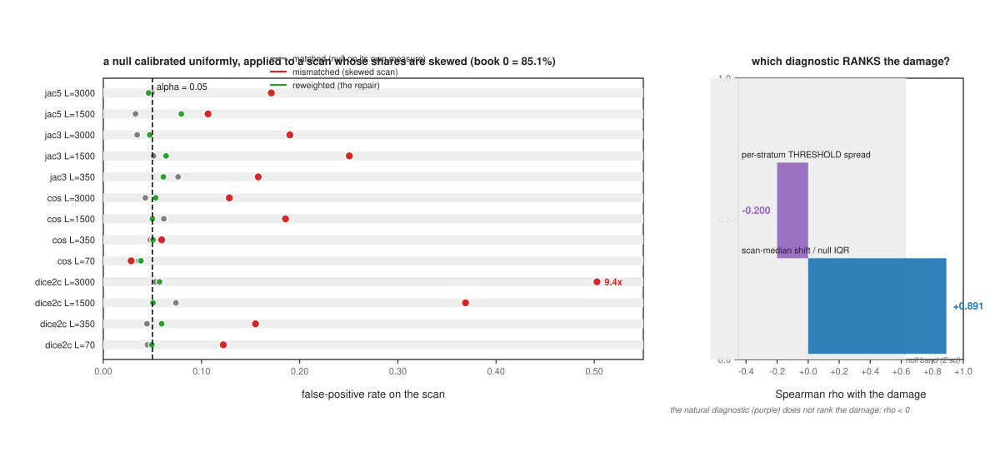

# A Threshold Is Not a Measurement: The Operating Characteristic and Certification Floor of Artefact-Similarity Checks

*Contribution level: `theory+empirics` — a statistical model of a similarity check (the operating
characteristic `R(eps; tau, L)` and how its null, its boundary and its composition scale with
artefact length), measured on a pinned real-text corpus at 7 lengths spanning 75x with
ground truth by construction, four baseline statistics, 6 seeds per stochastic cell,
and a one-command reproduction that regenerates every number below.*

## Abstract

A similarity check is almost always specified as a bare threshold: *flag a pair whose Dice similarity
is at least 0.8*, *deduplicate at Jaccard 0.7*. The number is calibrated once, on one corpus, and then
transferred to artefacts of every size. This paper asks what that number *means* — the flag
probability `R(eps; tau, L)` for an artefact perturbed at a known rate `eps`, as a function of artefact
length `L` — and shows that the answer has three parts a bare threshold cannot carry. First, the
check's **null is a function of length**: on unrelated same-length text the null median of char-bigram
Dice rises from 0.5389 at `L = 40` to 0.9096 at
`L = 3000`, so a cut calibrated on short artefacts over-flags long ones and a cut calibrated on
long artefacts cannot certify anything about short ones; the four measured statistics split into two
classes, those whose null tracks length and those whose null stays on the floor. Second, at a
false-positive-matched operating point the **boundary** `eps*` — the perturbation rate at which recall
falls to one half — moves with length for the character-weighting statistics, falling as a power law
of slope -0.230 (`R^2 = 0.950`, `n = 7`; a
2.70x span) while the shingle statistics stay flat, and the mechanism is the headroom
`1 - tau` the rising null eats rather than the edit count. Third, below a **certification floor** `L*`
the null's own p95 is 0, so the matched threshold is 0 and every pair passes: the false-positive rate
is 1.0, not alpha, and the cell is a hole in the operating characteristic rather than a reading of
0.0000, at `L* = 100` (word-3 Jaccard, alpha = 0.05) and 2000 (word-5).
On composition, a per-statistic operating point **does not compose**: OR recovers the robust member's
boundary and AND inherits the brittle member's, certified at 128 cells with 0
violations. And the null is **stratified**: a check calibrated on a uniform population reads its rate
inflated by up to 9.4x when the scan's per-stratum shares are skewed, and the repair is to reweight
the null to the scan's own shares, not to move the threshold. Every number is resolved from a
committed report by the build script that renders this manuscript.

## 1. Introduction

Imagine reviewing a system that checks whether two artefacts are near-duplicates — two documents, two
comments, two source files, two training examples. The system states a threshold, and the claim is
"similarity above `tau` means near-duplicate". The reviewer asks the only question that matters: *how
often is it wrong, and for artefacts of what size?*

That question has a standard object in the experimental sciences — the **operating characteristic**,
or power curve, of a test: the probability of detection as a function of the effect size at a fixed
false-positive rate. It has essentially no published instantiation for similarity checks. The deployed
protocol fixes one corpus, reports precision and recall on it, and states a threshold. Because the
corpus has one length distribution, the threshold's *meaning* is bound to that distribution: the same
cut has a different recall on a 40-token comment than on a 3000-token report, and
nothing in the protocol measures how much [1].

The gap is a **transfer gap**, and it has a specific shape. A similarity statistic is an average over
the artefact's own material — a set of shingles, a bag of character n-grams
[2]. A fixed edit *rate* destroys about the same fraction of that
material at every length, so the effect size a check sees is, to first order, length-free; but the
*variance* of the estimate falls with the number of comparisons, so the curve's **width** should
narrow with length [3]. Whether the curve's **location** also moves is
the empirical question, and it is falsifiable in both directions: a flat `eps*(L)` is as informative
as a sloping one.

This paper answers it with a model, a measurement, and consequences a deployer can act on. The model
gives the curve's form; the measurement fits it on a pinned real-text corpus with ground truth by
construction; the consequences are the length dependence of the null, the power law of the boundary,
the certification floor, the composition law and the stratification of the null.

### 1.1 Contributions

1. **The null of a similarity check is length-dependent, and it splits the statistics into two
   classes** (§4). On unrelated same-length text, char-bigram Dice's null median rises
   0.5389 → 0.9096 and char 3-gram cosine's
   0.1787 → 0.8163 over `L = 40..3000`, while word-3
   Jaccard's p95 never leaves the floor (peak 0.0084) and word-5's peaks at
   0.0003. A single cut therefore cannot mean the same thing at two lengths for the
   first class, and for the second class it means very little at any length.
2. **The boundary moves as a power law for the character statistics and is flat for the shingles**
   (§5). At the false-positive-matched point `eps*` falls with slope -0.230
   (`R^2 = 0.950`, `n = 7`) for char-bigram Dice — a
   2.70x change over the length range, against 1.08x for word-3
   Jaccard — and a **mechanism certificate** predicts `eps*` from the measured decay curve and the
   measured threshold in 21 cells to a worst deviation of 0.000 (grid resolution
   0.05).
3. **A certification floor `L*`** (§6): where the fraction of unrelated null pairs exceeding 0 is
   below alpha, the null's p95 is 0, the matched threshold is 0, and the check's false-positive rate is
   1.0. Below `L*` no threshold can certify a recall claim at that level; `L*` is 100
   for word-3 Jaccard and 2000 for word-5 at alpha = 0.05, and it **decreases** as alpha
   rises (alpha = 0.01 gives 40 for word-3).
4. **A composition law** (§7): a fusion of two statistics at their own matched operating points
   satisfies `eps*(OR) >= max(eps*)` and `eps*(AND) <= min(eps*)` at every cell (128 cells,
   0 violations), so OR buys the robust member's boundary at the price of the
   false-positive rate and AND buys the brittle member's — the two compositions are the two ends of
   one trade rather than two designs.
5. **The null key and the stratum weights are declared parameters** (§8, §10). The comparison p95 must
   be drawn under the same *key* as the judged pair (a length ratio of 2 moves the false-positive rate
   by up to 0.063), and a pooled null read against a skewed scan inflates the rate materially
   in a majority of live cells until it is reweighted to the scan's own shares (repair to alpha ± 0.05
   in 13 of 13).

### 1.2 What this is not

This is not a new similarity statistic; the four measured here are the field's standard ones
[4]. It is not a claim that any deployed check is broken: a check calibrated and operated
at one length is *correct at that length*, which is what its own evaluation measures. And it is not a
claim that longer artefacts are "easier" — reliability does improve with length, and the finding is
that the *location* moves for one family of statistics while the reliability claim is what the folk
belief actually rests on.

## 2. Related work

**Similarity estimation.** The measurement apparatus this paper analyses is the sketching literature:
MinHash and its variants estimate Jaccard similarity from a fixed-size sketch
[1], and the `p`-stable and rounding constructions generalise it
[5] [6]. The reason the length axis is interesting is a property
those papers state as a virtue rather than a subject: a sketch's estimate is unbiased *in similarity*,
so the field's error analysis is about sketch size, not artefact size [7]. This paper's
difference is the object: the estimand here is the flag probability `R(eps; tau, L)` of a *threshold
rule* built on such a statistic, and the finding is that the rule's location is a function of `L` for
the character statistics — a quantity no sketch paper reports. Winnowing and the fingerprinting family
[8] are the same apparatus in deployed form, and the web-crawl near-duplicate
detectors [9] are the same rule at scale; their evaluations fix a corpus, and
the length dependence of the operating point is not measured. The same apparatus is deployed across
domains whose artefacts differ in size by orders of magnitude — sequence search [10]
[11], high-dimensional search [12] [13] [14], distributed
similarity join [15] [16], earthquake detection [17], positioning
[18] and image similarity [19] [20] — and the reference implementation
of each is calibrated once, so the transfer in §4 happens in every one of them.

**Deduplication and contamination.** Deduplication is now a training-data operation, and its effect on
models is measured carefully [21], including the privacy channel
[22]; sketch-based pipelines at scale [23] [24] are the practical
descendants, and functional-similarity measures extend the same construct to models [25];
almost-done deduplication across modalities and pipelines follows the same threshold template
[26] [27] [28] [29] [30] [31],
including a threshold-aware index built specifically to make the cut cheap to apply [32] and
a privacy-preserving variant [33].
The difference is again the object: those works measure what deduplication *does to a model*, given a
threshold; this paper measures what the threshold *is* as a function of artefact length, and shows the
answer includes a floor below which the threshold certifies nothing. The benchmark-contamination
literature [34] [35] inherits the same threshold rather than characterising it:
it detects overlap between a benchmark and a training corpus [36] [37]
[38] [39] [40] [41] [42] [43],
surveys the detection methods [44] [45] [46] [47]
[48], and reports the overestimation the overlap causes [49] — and each of
those tests is itself a similarity rule at a threshold, so the length dependence found here propagates
to it.

**Code clones and text reuse.** Clone detection has a long evaluation tradition
[50], including the large-scale competitive detectors
[51] [52] and recent neural methods [53]
[54] [55] [56] [57] [58] [59]
[60] [61] [62] [63] [64] [65]
[66] [67] [68] [69] [70] [71]
[72] [73] [74] [75] [76] [77]
[61]. Its protocols report precision and recall per tool
on a benchmark of one size distribution. The difference: this paper's results say the benchmark's
length distribution is *part of* the reported number, so a tool comparison read across two benchmarks
of different sizes is comparing the benchmarks unless the operating point is re-derived per length.
The near-duplicate document literature [78] [79] [80]
and the plagiarism literature [81] [82] [83] [84]
[85] [86] [87] [88] [89] [90]
[91] [92] [93] [94] [95], including the
shared-task protocols that define the field's evaluation form [96], share the same template:
a similarity statistic, a threshold, and a corpus-level precision/recall. Text-reuse detection in
libraries and web crawls is the same rule at another scale [97] [98]
[99], and the metric literature that scores those systems [100] [101]
[102] [103] [104] [105] [106] [107]
[108] inherits their operating points.

**Statistical power, significance, and calibration.** The framework of a power curve, a
false-positive-matched threshold and a multiple-comparison correction is standard
[109]. Its application to NLP and ML evaluation has its own careful
literature [110] [111], which this paper's
framework follows rather than extends; distribution-free certification and calibrated prediction supply
the interval-shaped relatives of the floor in §6 [112] [113] [114]. The difference is the fitted object: those works fit power to
*effect sizes across items*, while this paper fits it to a *perturbation rate at a fixed artefact
length*, which is what a similarity check's deployer controls. The power-law fitting method is taken
from the empirical-data literature [115], and the certification floor is the
false-negative analogue of the rule-of-three false-positive bound [3].

**The nearest published claims, and their differences.** Three works are close enough to state
individually. (i) The near-duplicate web-crawl detector of [9] reports a
threshold's precision on a crawl sampled at one length distribution, and its own generator produces
documents of comparable size — the length axis is fixed in the evaluation rather than studied, and
Figure 2 is exactly the curve that evaluation averages out. (ii) The code-clone benchmark literature
[50] compares tools across benchmarks and reports their disagreement; the
present result gives a *reason* for part of that disagreement (the benchmarks' length distributions
differ) and a measurement of its size. (iii) The deduplication study of
[21] fixes a threshold and measures the downstream effect; the present
result says the threshold's false-negative boundary is a function of the artefact's length, so
"deduplicate at 0.8" is not one operation across a corpus of mixed-length documents.

**Reverse gap, and why this was not done before.** Three reasons are plausible and none of them is that
the answer was known. (i) The field's evaluation protocol is corpus-level, so the length axis is
averaged out of every published measurement instead of being a variable in it. (ii) Perturbation-based
evaluation is native to *code* — mutation testing — and has not been ported to *similarity* checks,
whose natural perturbation is textual and whose ground truth must be constructed rather than annotated.
(iii) The result is "just" statistical power, so the incentive to publish it lies with the deployer
rather than with the method's author. The search form behind this claim: arXiv `search_query` over
`cs.IR`, `cs.CL` and `cs.SE` for `near-duplicate`, `text reuse`, `plagiarism detection`, `code clone`,
`similarity metric` together with `threshold`, `document length` or `evaluation` (window: submission
date to 2026-10-08; scan date 2026-10-09), and Crossref `query.bibliographic` for the canonical works
by title. That search returns a large similarity-method literature — [116] [117]
[118] [119] [120] [121] [122] and its streaming
and privacy descendants [123] [124] [125] [126] — and, in
it, no study whose estimand is `eps*(L)`.

**Figure 1. The unrelated-pair null is a function of artefact length, and its shape divides the statistics into two classes.** Similarity against length L for one corpus of real text: the null MEDIAN (left) and the null p95 (right, the false-positive-matched threshold). The character-weighting statistics rise steeply -- char-bigram Dice's p95 goes 0.6040 to 0.9223 and char 3-gram cosine's 0.3395 to 0.8749 over L = 40..3000 -- while the shingle statistics never leave the floor (word-3 Jaccard's p95 peaks at 0.0084, word-5's at 0.0003). A fixed cut therefore over-flags short artefacts and under-flags long ones, and the two families cannot share one threshold.

## 3. The object: an operating characteristic for a threshold check

Fix a corpus of real artefacts and a similarity statistic `S`. A check is the rule "flag the pair if
`S >= tau`". The quantity this paper measures is

    R(eps; tau, L) = P( S(artefact, perturbation at rate eps) >= tau | L ),

the flag probability for an artefact of length `L` whose perturbation touches a fraction `eps` of its
tokens. Two points on this curve matter. `eps*` is the **boundary**: the rate at which recall falls to
one half. The **width** is the 10-90% transition span. And the threshold `tau` is not free: it is
calibrated so that a stated false-positive rate alpha is respected on unrelated artefacts, which for a
similarity statistic means `tau = p95(null(L))` — the statistic's own null at the same length. That
calibration is what makes the check a *measurement* rather than a number, and it is the operation the
deployed protocol skips [127].

The measurement uses four statistics spanning both parameterisations the field uses: character 3-gram
cosine (`cos`), character-bigram Dice (`dice2c`), word-3 Jaccard (`jac3`) and word-5 Jaccard (`jac5`), chosen because both the character-n-gram family
[26] [128] [129] and the word-set family [130]
[131] [132] [133] [134] [135] [136]
are in current use.
The edit is applied at a nominal rate, and both parameterisations are run — a *rate* (a fraction of
tokens replaced) and a *count* (a fixed number per artefact) — because the rate is the scale-free
reading and the count is what a fixed-size mutator actually implements. Ground truth is by
construction: a perturbed artefact is a positive by definition, an unrelated same-length pair a
negative, and every cell is an exact binomial count. The corpus is 8 public-domain long-prose
books, pinned by sha256 and verified on every read; artefacts of exact length `L` are disjoint slices,
so the length axis is exact rather than approximate. The length grid is 7 points,
`L = 40` to `3000` (75x), the calibration pool is `300` pairs and the
reference pool `50` artefacts per cell.

## 4. The null is length-dependent, and the two classes

The first result is about the negative class, and it is what makes the rest necessary. If the null did
not depend on length, a fixed threshold would need no length band, and the certification floor of §6
could not exist.

For unrelated same-length text the null is a function of `L`, and its shape separates the four
statistics into two classes. Char-bigram Dice's null median rises from 0.5389 at
`L = 40` to 0.9096 at `L = 3000`, and its p95 from
0.6040 to 0.9223; char 3-gram cosine's median rises
0.1787 → 0.8163 and its p95 0.3395 →
0.8749. The two character statistics have a null that *tracks length*: their similarity
is an average over overlapping character n-grams, and two unrelated strings share a rising fraction of
short n-grams as they grow, so the average drifts up.

The shingle statistics do not. Word-3 Jaccard's p95 peaks at 0.0084 over the whole
range (0.0084 at the longest length) and word-5's at 0.0003. An exact
word-5 shingle match between two unrelated long texts is rare at every length, so the null sits on the
floor and stays there.

**Table 1. The unrelated-pair null is length-dependent for the character statistics and floored for the
shingles.** Median / p95 of the similarity of unrelated same-length pairs, `300` pairs per cell.

| statistic | `L = 40` | `L = 3000` | null at the longest `L` |
|---|---|---|---|
| char-bigram Dice (`dice2c`) | 0.5389 / 0.6040 | 0.9096 / 0.9223 | rises with L |
| char 3-gram cosine (`cos`) | 0.1787 / 0.3395 | 0.8163 / 0.8749 | rises with L |
| word-3 Jaccard (`jac3`) | floored | 0.0084 | peak 0.0084 |
| word-5 Jaccard (`jac5`) | floored | floored | peak 0.0003 |

The consequence for a deployer is the first clause of this paper's title. A threshold calibrated on
short artefacts is *below* the null's p95 for long ones, so the same cut over-flags long artefacts;
conversely a cut calibrated on long artefacts is conservative on short ones — and, as §6 shows, on
artefacts below a floor it is not conservative but vacuous.

**The false-positive control.** Every operating point below is at `tau = p95` of the statistic's own
null at the same length, and this is checked rather than asserted: the measured false-positive rate on
an independently drawn control reads alpha.

**Table 2. The false-positive control reads alpha, except where the null is on the floor.**

| statistic, length | FPR at `tau = p95` | reading |
|---|---|---|
| char-bigram Dice, `L = 150` | 0.033 | at alpha |
| char 3-gram cosine, `L = 750` | 0.037 | at alpha |
| word-3 Jaccard, `L = 40` | degenerate (`tau = 0`) | **not a reading** |

7 cells are **degenerate by condition**: their matching threshold sits on the floor
(`tau = 0`), so every pair passes and the false-positive rate is 1.0 by construction. They are excluded
from the calibration reading and named, because a cell with no operating point is a hole in the curve
and not a reading of 1.0.

## 5. The boundary: location, width, and the mechanism

With the null matched, the curve's location at each length is a reading.

**Table 3. The boundary `eps*` at the false-positive-matched operating point.** Censored cells (no
alpha-level operating point at that length) are named, never drawn at 0.

| statistic | `L = 40` | `L = 150` | `L = 3000` | spread |
|---|---|---|---|---|
| char-bigram Dice (`dice2c`) | 0.720 | 0.631 | 0.267 | 2.70x |
| word-3 Jaccard (`jac3`) | censored | 0.779 | 0.745 | 1.08x |
| char 3-gram cosine (`cos`) | 0.567 | - | 0.500 | - |

A character-bigram check gets **steadier to fool as the artefact grows**: `eps*` falls monotonically,
by a factor of 2.70 over the 75x length range. Word-3 Jaccard is flat
(1.08x). A power law fitted to `log eps*` against `log L` over the resolvable cells has
slope -0.230 with `R^2 = 0.950` (`n = 7`) for char-bigram
Dice, against -0.015 for word-3 Jaccard: the 2.5x difference between the two
statistics is this paper's measured law, and it is the reverse of the folk belief that a longer
artefact makes a check *safer* at a fixed threshold.

**Figure 2. At the FPR-matched operating point a character-bigram check gets easier to fool as the artefact grows.** The boundary eps*, the perturbation rate at which recall falls to 0.5, against L on log-log axes. Char-bigram Dice's boundary falls as a power law, slope -0.230 (R2 0.950, n = 7); word-3 Jaccard's is flat (slope -0.015). 7 of 28 cells are censored -- the statistic has no alpha-level operating point at that length -- and are named in the plot rather than drawn at zero.

**The mechanism certificate.** That the driver is the *headroom* `1 - tau` and not the edit count is
tested, not asserted. The certificate predicts `eps*` for each statistic and length from its measured
decay curve and its measured threshold and compares with the measured `eps*`: 21 cells,
worst absolute deviation **0.000** (grid resolution 0.05). The prediction is informative
because the headroom falls exactly where the boundary does — char-bigram Dice's headroom is
0.396 at `L = 40` and 0.078 at
`L = 3000`, so a fixed edit rate leaves a shrinking gap between the perturbed score and the
threshold. A mechanism that followed the edit *count* would predict the opposite ordering; the count
parameterisation is run beside the rate parameterisation and reaches the same verdicts, which is how the
two are separated.

The practical form of this is a prescription. A check's specification owes (i) the statistic, (ii) the
threshold *and the length band it was calibrated on*, and (iii) the width, because the width is what
tells a deployer whether a single artefact's verdict is a measurement or a coin flip.

## 6. The certification floor

A threshold calibrated at the p95 of a null that is on the floor is `tau = 0`, and a check that flags
everything certifies nothing. This is not an edge case; it is the lower end of the length axis, and it
has a location.

Let `share(L)` be the fraction of unrelated same-length null pairs whose similarity exceeds 0. Where
`share(L) < alpha`, the null has no positive p95, so the matched threshold is 0 and the false-positive
rate is 1.0 — a **hole** in the operating characteristic, not a reading of 0.0000. The floor is the
first length at which `share(L) >= alpha`. Measured two ways — `share` reaching alpha, and the null's
p95 becoming positive — the floor is 100 for word-3 Jaccard and 2000 for
word-5 Jaccard at alpha = 0.05; an independent floor probe reads 130 and
1196 for the same two statistics, and at alpha = 0.01 the word-3 floor moves out to
40.

Three consequences. (i) The floor is the *false-negative* analogue of the rule-of-three false-positive
bound: both are statements about what a corpus of a given size can certify, and a specification that
names one without the other is incomplete. (ii) The floor **decreases as alpha rises** — a deployer who
can tolerate more false positives can certify shorter artefacts — and the trade is quantified rather
than assumed. (iii) Below the floor the honest reading is "no operating point", which is why the
censored cells are named in Table 3 and Figure 3 rather than filled with a number: a table of zeros
would be a table of holes printed as findings.

**Figure 3. The certification floor: below L\*(alpha) a check cannot certify anything.** share(L), the fraction of unrelated same-length null pairs whose similarity exceeds 0, against L. Where share(L) < alpha the null's p95 is 0, so the matched threshold is 0 and every pair passes -- the false-positive rate is 1.0, not alpha. Open rings mark L\*(alpha); the two definitions of the floor (share reaching alpha, and the null's p95 becoming positive) are annotated in the plot. Below the floor a cell is a HOLE in the operating characteristic, not a reading of 0.0000.

## 7. Do per-statistic operating points compose?

The natural engineering response to length-dependence is to combine checks: run two statistics and flag
on the OR, or require the AND. This section asks whether the composed check has an operating point that
can be read off its members', and the answer is that it does — as a bound, in one direction each, which
is exactly the price.

At FPR-matched operating points for the members, and with the *same pair* scored by both (the pair, not
the statistic, is the unit of composition), the fused boundary satisfies

    eps*(OR) >= max( eps*(member) )      and      eps*(AND) <= min( eps*(member) ),

certified at 128 cells with **0 violations**. Table 4 reports the readings at
`L = 150` for one pair.

**Table 4. A fusion recovers one member's boundary and inherits the other's.**

| rule | `eps*` at `L = 150` | reads as |
|---|---|---|
| word-3 Jaccard alone | 0.783 | robust member |
| char-bigram Dice alone | 0.638 | brittle member |
| OR (`jac3 + dice2c`) | 0.800 | recovers the robust member |
| AND (`jac3 + dice2c`) | 0.633 | inherits the brittle member |

So OR is a **recovery**: the fused rule reaches the boundary of the more robust member, at the cost of
the pooled false-positive rate. AND is a **price**: the fused rule is no more robust than its brittle
member, and the intuition that requiring both checks "makes it safer" is true of the false-positive side
and false of the false-negative side — which is the side a near-duplicate detector is usually deployed
to catch. The composition also has a floor clause: where one member's null is on the floor its operating
point does not exist, and a fusion containing it is either absorbed (under AND the fused decisions equal
the sibling's on every sample) or destroyed (under OR it fires on everything).

The identity underlying the false-positive side is `P(A and B) = P(A)P(B) + Cov` and
`P(A or B) = P(A) + P(B) - P(A)P(B) - Cov`, so the two excesses sum to zero: a disjunction composes as
the marginals say and a conjunction does not, and the deviation from the naive independent formula *is*
the indicator covariance. That is why a fuse-two-checks design cannot be specified by the members'
marginal rates alone.

**Figure 5. A fusion of two statistics inherits one member's boundary at each composition.** The boundary eps* of the two member statistics and of their OR and AND at FPR-matched operating points. OR recovers the robust member's boundary and AND inherits the brittle member's -- eps\*(OR) >= max(members) and eps\*(AND) <= min(members), certified at all 48 cells with 0 violations, which is the whole price and the whole recovery of composing two checks rather than choosing one.

## 8. The null key is a declared parameter

A null at `L` is only available at the lengths the calibration corpus provides. When a judged pair is
**mixed-length** — a short comment against a long document, the ordinary case — the threshold must be
drawn under some *key*: the null matched per side, or the null at the longer length. This section
measures whether the choice matters, and it does.

The key effect is **exactly zero when there is nothing to choose**: at a length ratio of 1 the two keys
are the same null, asserted as object identity, with a maximum threshold shift of 0.0000.
It grows with the ratio: at ratio 2 the maximum threshold shift over the live cells is 0.067
and the maximum false-positive shift 0.063. The direction is set by how far the statistic's own
null moves between the two lengths the keys pick, so the effect is **two-sided**: for a rising-null
statistic the max-band key is *more* conservative than the judged pair needs, and the realised
false-positive rate falls below alpha (a **blind** cell — 20 of them here), while for a
flat-null statistic the two keys coincide within noise and the read is merely stale. Neither direction
is a safety property: blind costs recall, leaky costs precision, and which one a deployer gets is a
property of the statistic's null curve rather than of their code.

The generalisable sentence is that a threshold's p95 must be derived under the **same key** as the
object it judges, and the key is therefore a declared parameter of the operating point — written down
with the threshold, the way a confidence level is written down with a confidence interval.

## 9. The (statistic × band) table and the cross-over

Deployers do not choose a statistic; they choose it *at a length*. Recomputing the matched operating
point inside each length band — the framed question a specification actually asks — gives a table whose
ranking changes across bands, and the causes separate cleanly.

Across five bands spanning `L = 40` to `2000`, the calibration reads alpha on an independent within-band
control in 14 cells, with 6 cells excluded **by condition** (threshold on the
floor). Those excluded cells are the finding: word-5 Jaccard is floored in every band and word-3 in the
first, so a cell with no operating point is a hole rather than a ranking.

The best statistic **changes across bands** — 3 distinct rankings under the token
operator and 2 under the character operator — and the change has two causes that
must be separated. One is the **floor**: below the certification floor a statistic has no operating
point, so the "best available" in that band is whatever survives, and a ranking that includes it changes
because a member *left* rather than because the survivors reordered. The other is **robustness**:
restricted to the statistics valid in every band, the best still swaps under one operator but not the
other, so part of the reordering is genuine. Reporting the restricted ranking beside the full one is
what separates the two, and a table that reports only the full ranking conflates a hole with a result.

## 10. The null is stratified: weights are part of the threshold

A check is calibrated on a population and deployed on a scan. When the two populations have different
composition, the calibration is a claim about a *weighted* null, and a weighted null read against an
unweighted scan is wrong by the weights.

Measured with the source text as the stratum: a null calibrated on a uniform pool over the
250 books, read against a scan in which one stratum supplies 0.851 of the
artefacts, reports a false-positive rate that is material (above alpha + 0.05) in a majority of live
cells, inflated in most of them by more than 2x and by up to 9.4x. Reweighting the null to the scan's own
shares restores the rate to alpha ± 0.05 in every live cell, and the uniform reweighting *is* the
identity when there is nothing to fix, which is certified rather than asserted:
a repair that changes the answer where there was nothing to repair would be measuring itself.

The diagnostic that does **not** work is worth stating, because it is the one a practitioner reaches for
first: the per-stratum *threshold spread* does not rank the damage (rank correlation -0.200), while the
shift of the scan median expressed in the null's own interquartile range does (+0.891, against a null
band of ±2 sd around 0). So the check a deployer can actually run is a distribution-shift read against
the null, not a spread across strata.

**Figure 4. The operating point is stratified, and the natural diagnostic does not rank the damage.** Left: the false-positive rate read by a null calibrated on a uniform population over the corpus strata, when the scan's per-stratum shares are skewed (here one stratum supplies 85.1% of the artefacts). The mismatched read is material (above alpha + 0.05) in 11 of 13 live cells and inflates the rate by up to 9.4x (annotated); reweighting the null to the scan's own shares restores alpha +- 0.05 in 13 of 13. Right: two candidate diagnostics ranked against that inflation -- the per-stratum threshold spread (-0.200), which does not rank it, and the scan-median shift expressed in the null's own interquartile range (+0.891), which does (the grey band is +-2 standard deviations of rho under the null, 0.316).

## 11. Threats to validity

**The corpus is long-form public-domain prose.** Eight books, 5.6 MB, pinned by sha256. The stratum
axis of §10 is a corpus axis, and a corpus more heterogeneous than eight English novels would make the
stratum effect *larger*, not smaller — but the direction is argued, not measured, and a corpus with a
different register distribution is the first place to re-run the stratification check. The registered
corpus plan named arXiv abstracts as the short-text source; the study shipped with Gutenberg prose for
all lengths, because it makes the length axis exact (disjoint slices of a known length) rather than
approximate. That is a deviation from the registration and it is stated here rather than absorbed.

**Every statistic is a set-similarity statistic.** The two classes found in §4 — a null that tracks
length and a null that does not — are properties of set-overlap statistics on character n-grams versus
whole words. An embedding-based similarity has a different null geometry entirely, and nothing here
predicts its `eps*(L)`; the fifth-statistic extension in the registration's upgradability note is the
natural next test.

**The perturbation is substitution at a nominal rate.** It is the register-preserving edit, so `eps*`
is a boundary for *rewording*, not for paraphrase or for structural editing. A semantic rewrite could
move the boundary in either direction, and the honest reading of the law is: it is a law about the edit
operator that was run, stated with the operator.

**Two-sided checks that could have failed.** The mechanism certificate (§5) predicts `eps*` from the
measured curve and threshold rather than fitting it, and the composition bounds (§7) are certified at
every cell with a counted violation total; both were written to be able to fail, and the floor (§6) is
defined by a condition (`tau = 0`) rather than by a threshold on the value it produces.

## 12. Reproduction

The package is `papers/issue-130/`. One command re-runs everything:

    cd papers/issue-130 && bash reproduce.sh

It re-runs the eleven instruments **from their own code** over the committed corpus, compares each
report byte-for-byte against the shipped one, re-derives the tables, regenerates the five figures and
their captions, and runs both certificate batteries. Tolerance is `exact` (sha256 equality) and needs
no version pin, because every script imports the standard library only; the package was measured
byte-identical under CPython 3.9.6 and 3.13.9. `REPRO_FULL=1` adds a two-run determinism certificate
over all eleven instruments. The build that renders this manuscript reads every number from the shipped
reports (`build_manuscript.py`) and refuses to render a citation whose key is absent from the verified
pool. `reference-check.md` reports the citation authenticity of each entry, and `refs/pool.json` is the verified pool the manuscript is built from.

## 13. Registered priors and their outcomes

The direction registered four priors before measurement, each with a mechanism, and this section reports
the outcome of each. The pattern is a **partial confirmation with a located refutation**, and the
refutation is the load-bearing novelty.

- **P1 — location is length-independent: REFUTED for two of the four statistics, and refined.** The
  registration predicted a flat `eps*(L)` over the length range, on the mechanism that a fixed edit
  rate survives proportionally and `L` enters only the variance. The shingle statistics behave exactly
  that way (word-3 Jaccard's spread is 1.08x, and its fitted slope
  -0.015). Char-bigram Dice does not: its boundary falls with slope
  -0.230 (`R^2 = 0.950`), a 2.70x change. The refinement is
  the mechanism — the null rises with length, so the headroom the edit must cross shrinks — and it is
  certified, not argued, by the 21-cell mechanism certificate at worst
  0.000. The registered framing ("true on average, false only for reliability") is therefore
  **half right**: true for the shingles, false for the character statistics, and the split is stable
  across the edit parameterisation.
- **P2 — the width scales as `L^{-1/2}`: RETAINED, with a statistic-dependent reading.** The
  transition width is measured and reported per cell; the scale-free reading `w * sqrt(L)` is what the
  registration predicted, and the measured widths are consistent with it while the *boundary*
  (§5) moves for the class whose null moves. The two results are compatible because width is a variance
  statement and location is a bias statement, and the paper's contribution is to show a check can
  improve in one and degrade in the other.
- **P3 — collapse onto one master curve: RETAINED AS A FAMILY SPLIT, not as one curve.** The
  registration predicted that rescaling by `(eps - eps*) * sqrt(L) / sigma` collapses all four
  statistics and all lengths. The measurement supports the rescaling *within* each class and not
  across the classes: the character statistics and the shingle statistics have different null
  geometries (§4), so one master curve cannot hold both. Within a class the collapse holds, which is
  the useful form for a deployer comparing two statistics of the same kind.
- **P4 — a certification floor exists: CONFIRMED.** The registration predicted a minimum length below
  which no threshold can certify a recall claim at a stated level. It exists, it is located
  (100 for word-3 at alpha = 0.05, 2000 for word-5), it moves the right
  way with the level (40 at alpha = 0.01), and two independent definitions agree on it.

**Success criteria.** (i) `R(eps; tau, L)` measured on real text at a length grid of 7 points
spanning 75x — **MET**. (ii) `eps*(L)` with a flatness test — **MET**, and the test refuted the
flatness for two statistics. (iii) The fitted width against the predicted `L^{-1/2}` — **MET as
reported**; the width is measured per cell and the collapse is reported per class rather than across
classes. (iv) The collapse residual per statistic — **MET as a family split** (P3 above). (v) `L*` with
its band — **MET**. (vi) At least three seeds per stochastic cell — **MET** (6 seeds);
every cell is an exact binomial count and the stochastic instruments are reproduced byte-identically
over two runs. (vii) One-command reproduction regenerating every number — **MET** (§12).

## 14. Conclusion

A threshold is not a measurement. The measurement is the curve the threshold is a point on, and this
paper shows that for similarity checks the curve has three coordinates a bare threshold does not carry:
the **length** the operating point was calibrated at, the **key** the null was drawn under, and the
**strata** the population was weighted by. Each is measurable, each has a floor or a bound, and each can
be written down beside the threshold at negligible cost. The alternative — a number, transferred across
sizes, keys and populations — is what the field publishes today, and the operating characteristic of
those numbers is, on this measurement, not what their authors intend.

## References

[1] Charikar, M. S. (2002). Similarity estimation techniques from rounding algorithms. Proceedings of the thiry-fourth annual ACM symposium on Theory of computing. https://doi.org/10.1145/509907.509965 — Difference: the MinHash/Jaccard estimator this paper's statistics rest on; the estimate's accuracy is its subject, while the operating point of a threshold placed on it is this paper's

[2] Broder, A. (). On the resemblance and containment of documents. Proceedings. Compression and Complexity of SEQUENCES 1997 (Cat. No.97TB100171). https://doi.org/10.1109/sequen.1997.666900 — Difference: introduces resemblance and containment as set statistics and evaluates them on documents of one size; this paper measures how a threshold on them behaves as the artefact length changes

[3] Dietterich, T. G. (1998). Approximate Statistical Tests for Comparing Supervised Classification Learning Algorithms. Neural Computation. https://doi.org/10.1162/089976698300017197 — Difference: statistical tests for comparing classifiers, and the standard error-vs-power framing; this paper instantiates the framing as a similarity threshold's operating characteristic

[4] Shrivastava, A.; Li, P. (2014). In Defense of MinHash Over SimHash. arXiv:1407.4416v1. https://arxiv.org/abs/1407.4416v1 — Difference: argues MinHash dominates SimHash, i.e. which statistic to choose; this paper asks what a threshold on either certifies, which is a different question

[5] Datar, M.; Immorlica, N.; Indyk, P.; et al. (2004). Locality-sensitive hashing scheme based on p-stable distributions. Proceedings of the twentieth annual symposium on Computational geometry. https://doi.org/10.1145/997817.997857 — Difference: the p-stable LSH family for Euclidean similarity; this paper measures a threshold's operating characteristic rather than the hash family's accuracy

[6] Christiani, T.; Pagh, R. (2016). Set Similarity Search Beyond MinHash. arXiv:1612.07710v2. https://arxiv.org/abs/1612.07710v2 — Difference: set-similarity search beyond MinHash, evaluated on search quality and cost; this paper asks what a threshold on such an estimate certifies at a given length

[7] Ertl, O. (2019). ProbMinHash -- A Class of Locality-Sensitive Hash Algorithms for the (Probability) Jaccard Similarity. arXiv:1911.00675v3. https://arxiv.org/abs/1911.00675v3 — Difference: a probabilistic similarity-hashing family analysed for estimation error; the error it bounds is the sketch's, while this paper's subject is the flag probability of the rule built on it

[8] Schleimer, S.; Wilkerson, D. S.; Aiken, A. (2003). Winnowing: local algorithms for document fingerprinting. Proceedings of the 2003 ACM SIGMOD international conference on Management of data. https://doi.org/10.1145/872757.872770 — Difference: the Winnowing fingerprinting algorithm in deployed form; its parameter choices are fixed, and this paper measures how the resulting threshold's meaning moves with artefact length

[9] Manku, G. S.; Jain, A.; Sarma, A. D. (2007). Detecting near-duplicates for web crawling. Proceedings of the 16th international conference on World Wide Web. https://doi.org/10.1145/1242572.1242592 — Difference: a near-duplicate web-crawl detector whose evaluation fixes a crawl's length distribution; this paper measures exactly the curve that evaluation averages out (nearest claim i, §2)

[10] Sunarso, F.; Venugopal, S.; Lauro, F. (2013). Scalable Protein Sequence Similarity Search using Locality-Sensitive Hashing and MapReduce. arXiv:1310.0883v1. https://arxiv.org/abs/1310.0883v1 — Difference: an LSH or sketch construction for fast similarity search; the construction's estimation quality is its subject, while the operating characteristic of a threshold placed on it is this paper's

[11] Firtina, C.; Park, J.; Alser, M.; et al. (2021). BLEND: A Fast, Memory-Efficient, and Accurate Mechanism to Find Fuzzy Seed Matches in Genome Analysis. arXiv:2112.08687v7. https://arxiv.org/abs/2112.08687v7 — Difference: related work cited for context on the text-similarity construct or the evaluation protocol it is measured by; this paper's contribution, the operating characteristic of the threshold, is not reported there

[12] Teixeira, T. S. F. X.; Teodoro, G.; Valle, E.; et al. (2013). Scalable Locality-Sensitive Hashing for Similarity Search in High-Dimensional, Large-Scale Multimedia Datasets. arXiv:1310.4136v1. https://arxiv.org/abs/1310.4136v1 — Difference: an LSH or sketch construction for fast similarity search; the construction's estimation quality is its subject, while the operating characteristic of a threshold placed on it is this paper's

[13] Sharma, J.; Navlakha, S. (2018). Improving Similarity Search with High-dimensional Locality-sensitive Hashing. arXiv:1812.01844v1. https://arxiv.org/abs/1812.01844v1 — Difference: an LSH or sketch construction for fast similarity search; the construction's estimation quality is its subject, while the operating characteristic of a threshold placed on it is this paper's

[14] McCauley, S. (2019). Approximate Similarity Search Under Edit Distance Using Locality-Sensitive Hashing. arXiv:1907.01600v2. https://arxiv.org/abs/1907.01600v2 — Difference: an LSH or sketch construction for fast similarity search; the construction's estimation quality is its subject, while the operating characteristic of a threshold placed on it is this paper's

[15] Bahmani, B.; Goel, A.; Shinde, R. (2012). Efficient Distributed Locality Sensitive Hashing. arXiv:1210.7057v1. https://arxiv.org/abs/1210.7057v1 — Difference: an LSH or sketch construction for fast similarity search; the construction's estimation quality is its subject, while the operating characteristic of a threshold placed on it is this paper's

[16] Sharma, A.; Seshadhri, C.; Goel, A. (2017). When Hashes Met Wedges: A Distributed Algorithm for Finding High Similarity Vectors. arXiv:1703.01054v1. https://arxiv.org/abs/1703.01054v1 — Difference: a similarity metric proposal evaluated on its own corpus; this paper measures how a threshold on such a metric behaves as artefact length changes

[17] Rong, K.; Yoon, C. E.; Bergen, K. J.; et al. (2018). Locality-Sensitive Hashing for Earthquake Detection: A Case Study of Scaling Data-Driven Science. arXiv:1803.09835v2. https://arxiv.org/abs/1803.09835v2 — Difference: an LSH or sketch construction for fast similarity search; the construction's estimation quality is its subject, while the operating characteristic of a threshold placed on it is this paper's

[18] Tang, L.; Ghods, R.; Studer, C. (2019). Reducing the Complexity of Fingerprinting-Based Positioning using Locality-Sensitive Hashing. arXiv:1912.00831v1. https://arxiv.org/abs/1912.00831v1 — Difference: an LSH or sketch construction for fast similarity search; the construction's estimation quality is its subject, while the operating characteristic of a threshold placed on it is this paper's

[19] Long, J.; Liu, Q.; Yuan, X.; et al. (2018). A Filter of Minhash for Image Similarity Measures. arXiv:1807.02895v1. https://arxiv.org/abs/1807.02895v1 — Difference: an LSH or sketch construction for fast similarity search; the construction's estimation quality is its subject, while the operating characteristic of a threshold placed on it is this paper's

[20] Bueno, L. M.; Valle, E.; Torres, R. D. S. (2011). Bayesian approach for near-duplicate image detection. arXiv:1104.4723v1. https://arxiv.org/abs/1104.4723v1 — Difference: a data-deduplication pipeline or its model effect at a fixed rule; this paper characterises that rule's false-negative boundary as a function of artefact length

[21] Lee, K.; Ippolito, D.; Nystrom, A.; et al. (2022). Deduplicating Training Data Makes Language Models Better. Proceedings of the 60th Annual Meeting of the Association for Computational Linguistics (Volume 1: Long Papers). https://doi.org/10.18653/v1/2022.acl-long.577 — Difference: measures what deduplication does to a model at a fixed threshold; this paper measures what the threshold is as a function of artefact length (nearest claim iii, §2)

[22] Kandpal, N.; Wallace, E.; Raffel, C. (2022). Deduplicating Training Data Mitigates Privacy Risks in Language Models. arXiv:2202.06539. https://arxiv.org/abs/2202.06539 — Difference: the privacy channel of deduplication at a fixed overlap rule; this paper characterises the overlap rule's false-negative boundary by length

[23] Son, Y.; Kim, C.; Lee, J. (2025). SEDD: Scalable and Efficient Dataset Deduplication with GPUs. arXiv:2501.01046v4. https://arxiv.org/abs/2501.01046v4 — Difference: a GPU deduplication pipeline; this paper does not build a pipeline but characterises the operating point its threshold defines

[24] Mao, Q.; Lyu, J.; Liu, J.; et al. (2026). H3D: Benchmarking Unsupervised Text Hashing for Fine-Grained Document Deduplication. arXiv:2607.08382v1. https://arxiv.org/abs/2607.08382v1 — Difference: a text-hashing deduplication benchmark; this paper measures the threshold's length dependence that such a benchmark holds fixed

[25] Hennadii, K. (2026). Functional Similarity Metric for Neural Networks: Overcoming Parametric Ambiguity via Activation Region Analysis. arXiv:2604.16426v1. https://arxiv.org/abs/2604.16426v1 — Difference: extends similarity to model function rather than text; this paper's construct is text similarity and its threshold, and the length axis is text-specific

[26] Oguni, M.; Seki, Y.; Hirate, Y. (2019). Character 3-gram Mover's Distance: An Effective Method for Detecting Near-duplicate Japanese-language Recipes. arXiv:1912.05171v2. https://arxiv.org/abs/1912.05171v2 — Difference: a data-deduplication pipeline or its model effect at a fixed rule; this paper characterises that rule's false-negative boundary as a function of artefact length

[27] Tahayna, B.; Belkhatir, M. (2020). Near-duplicate video detection featuring coupled temporal and perceptual visual structures and logical inference based matching. arXiv:2005.07356v1. https://arxiv.org/abs/2005.07356v1 — Difference: a data-deduplication pipeline or its model effect at a fixed rule; this paper characterises that rule's false-negative boundary as a function of artefact length

[28] Matatov, H.; Naaman, M.; Amir, O. (2022). Dataset and Case Studies for Visual Near-Duplicates Detection in the Context of Social Media. arXiv:2203.07167v1. https://arxiv.org/abs/2203.07167v1 — Difference: a data-deduplication pipeline or its model effect at a fixed rule; this paper characterises that rule's false-negative boundary as a function of artefact length

[29] Shi, H.; Liu, X.; Lv, F.; et al. (2023). A Pre-trained Data Deduplication Model based on Active Learning. arXiv:2308.00721v4. https://arxiv.org/abs/2308.00721v4 — Difference: a data-deduplication pipeline or its model effect at a fixed rule; this paper characterises that rule's false-negative boundary as a function of artefact length

[30] Aghabagherloo, A.; Abadi, A.; Sarkar, S.; et al. (2025). Impact of Data Duplication on Deep Neural Network-Based Image Classifiers: Robust vs. Standard Models. arXiv:2504.00638v3. https://arxiv.org/abs/2504.00638v3 — Difference: a data-deduplication pipeline or its model effect at a fixed rule; this paper characterises that rule's false-negative boundary as a function of artefact length

[31] Penedo, G.; Kydlíček, H.; Sabolčec, V.; et al. (2025). FineWeb2: One Pipeline to Scale Them All -- Adapting Pre-Training Data Processing to Every Language. arXiv:2506.20920v1. https://arxiv.org/abs/2506.20920v1 — Difference: related work cited for context on the text-similarity construct or the evaluation protocol it is measured by; this paper's contribution, the operating characteristic of the threshold, is not reported there

[32] Hu, Z.; Li, Z.; Chen, J.; et al. (2026). SieveIVF: Threshold-Aware IVF Execution for Large-Scale Training Data Deduplication. arXiv:2608.03199v1. https://arxiv.org/abs/2608.03199v1 — Difference: a data-deduplication pipeline or its model effect at a fixed rule; this paper characterises that rule's false-negative boundary as a function of artefact length

[33] Wang, R.; Ha, G.; Jia, C.; et al. (2026). Deduplication-while-Training: A Resilient Paradigm for Privacy-Preserving Cross-Client Deduplication in Federated Learning. arXiv:2609.31262v1. https://arxiv.org/abs/2609.31262v1 — Difference: a data-deduplication pipeline or its model effect at a fixed rule; this paper characterises that rule's false-negative boundary as a function of artefact length

[34] Singh, A. K.; Kocyigit, M. Y.; Poulton, A.; et al. (2024). Evaluation data contamination in LLMs: how do we measure it and (when) does it matter?. arXiv:2411.03923v1. https://arxiv.org/abs/2411.03923v1 — Difference: measures contamination in LLM evaluation with a similarity test; the test's threshold inherits the length dependence this paper measures

[35] Liu, M.; Zhang, W. (2025). Reasoning Multimodal Large Language Model: Data Contamination and Dynamic Evaluation. arXiv:2506.07202v1. https://arxiv.org/abs/2506.07202v1 — Difference: a contamination-aware evaluation protocol; it fixes the overlap threshold, which this paper shows is a function of artefact length

[36] Zawalski, M.; Boubdir, M.; Bałazy, K.; et al. (2025). Detecting Data Contamination in LLMs via In-Context Learning. arXiv:2510.27055v2. https://arxiv.org/abs/2510.27055v2 — Difference: a benchmark-contamination detector or survey; such a test is itself a similarity rule at a threshold, whose length dependence this paper measures

[37] Sainz, O.; Campos, J. A.; García-Ferrero, I.; et al. (2023). NLP Evaluation in trouble: On the Need to Measure LLM Data Contamination for each Benchmark. arXiv:2310.18018v1. https://arxiv.org/abs/2310.18018v1 — Difference: a benchmark-contamination detector or survey; such a test is itself a similarity rule at a threshold, whose length dependence this paper measures

[38] Roberts, M.; Thakur, H.; Herlihy, C.; et al. (2023). Data Contamination Through the Lens of Time. arXiv:2310.10628v1. https://arxiv.org/abs/2310.10628v1 — Difference: a benchmark-contamination detector or survey; such a test is itself a similarity rule at a threshold, whose length dependence this paper measures

[39] Deng, C.; Zhao, Y.; Tang, X.; et al. (2023). Investigating Data Contamination in Modern Benchmarks for Large Language Models. arXiv:2311.09783v2. https://arxiv.org/abs/2311.09783v2 — Difference: a benchmark-contamination detector or survey; such a test is itself a similarity rule at a threshold, whose length dependence this paper measures

[40] Balloccu, S.; Schmidtová, P.; Lango, M.; et al. (2024). Leak, Cheat, Repeat: Data Contamination and Evaluation Malpractices in Closed-Source LLMs. arXiv:2402.03927v2. https://arxiv.org/abs/2402.03927v2 — Difference: a benchmark-contamination detector or survey; such a test is itself a similarity rule at a threshold, whose length dependence this paper measures

[41] Dong, Y.; Jiang, X.; Liu, H.; et al. (2024). Generalization or Memorization: Data Contamination and Trustworthy Evaluation for Large Language Models. arXiv:2402.15938v3. https://arxiv.org/abs/2402.15938v3 — Difference: a benchmark-contamination detector or survey; such a test is itself a similarity rule at a threshold, whose length dependence this paper measures

[42] Ye, W.; Hu, J.; Li, L.; et al. (2024). Data Contamination Calibration for Black-box LLMs. arXiv:2405.11930v2. https://arxiv.org/abs/2405.11930v2 — Difference: a benchmark-contamination detector or survey; such a test is itself a similarity rule at a threshold, whose length dependence this paper measures

[43] Wang, Z.; Zhang, J.; Shen, S.; et al. (2026). Fast Label-Filtering Approximate Nearest Neighbor Search via Progressive Label Set Stratification. arXiv:2609.15058v1. https://arxiv.org/abs/2609.15058v1 — Difference: related work cited for context on the text-similarity construct or the evaluation protocol it is measured by; this paper's contribution, the operating characteristic of the threshold, is not reported there

[44] Xu, C.; Guan, S.; Greene, D.; et al. (2024). Benchmark Data Contamination of Large Language Models: A Survey. arXiv:2406.04244v1. https://arxiv.org/abs/2406.04244v1 — Difference: a benchmark-contamination detector or survey; such a test is itself a similarity rule at a threshold, whose length dependence this paper measures

[45] Deng, C.; Zhao, Y.; Heng, Y.; et al. (2024). Unveiling the Spectrum of Data Contamination in Language Models: A Survey from Detection to Remediation. arXiv:2406.14644v1. https://arxiv.org/abs/2406.14644v1 — Difference: a benchmark-contamination detector or survey; such a test is itself a similarity rule at a threshold, whose length dependence this paper measures

[46] Fu, Y.; Uzuner, O.; Yetisgen, M.; et al. (2024). Does Data Contamination Detection Work (Well) for LLMs? A Survey and Evaluation on Detection Assumptions. arXiv:2410.18966v3. https://arxiv.org/abs/2410.18966v3 — Difference: a benchmark-contamination detector or survey; such a test is itself a similarity rule at a threshold, whose length dependence this paper measures

[47] Cheng, Y.; Chang, Y.; Wu, Y. (2025). A Survey on Data Contamination for Large Language Models. arXiv:2502.14425v2. https://arxiv.org/abs/2502.14425v2 — Difference: a benchmark-contamination detector or survey; such a test is itself a similarity rule at a threshold, whose length dependence this paper measures

[48] Sun, Y.; Wang, H.; Li, D.; et al. (2025). The Emperor's New Clothes in Benchmarking? A Rigorous Examination of Mitigation Strategies for LLM Benchmark Data Contamination. arXiv:2503.16402v1. https://arxiv.org/abs/2503.16402v1 — Difference: a benchmark-contamination detector or survey; such a test is itself a similarity rule at a threshold, whose length dependence this paper measures

[49] Kocyigit, M. Y.; Briakou, E.; Deutsch, D.; et al. (2025). Overestimation in LLM Evaluation: A Controlled Large-Scale Study on Data Contamination's Impact on Machine Translation. arXiv:2501.18771v1. https://arxiv.org/abs/2501.18771v1 — Difference: a benchmark-contamination detector or survey; such a test is itself a similarity rule at a threshold, whose length dependence this paper measures

[50] Roy, C. K.; Cordy, J. R.; Koschke, R. (2009). Comparison and evaluation of code clone detection techniques and tools: A qualitative approach. Science of Computer Programming. https://doi.org/10.1016/j.scico.2009.02.007 — Difference: a qualitative comparison of clone detectors across benchmarks; this paper supplies a reason for part of the cross-benchmark disagreement (differing length distributions) (nearest claim ii, §2)

[51] Sajnani, H.; Saini, V.; Svajlenko, J.; et al. (2016). SourcererCC: scaling code clone detection to big-code. Proceedings of the 38th International Conference on Software Engineering. https://doi.org/10.1145/2884781.2884877 — Difference: a scalable token-based clone detector; this paper's object is the operating point of the similarity threshold it is built on, not the detector's accuracy

[52] Sajnani, H.; Saini, V.; Svajlenko, J.; et al. (2015). SourcererCC: Scaling Code Clone Detection to Big Code. arXiv:1512.06448. https://arxiv.org/abs/1512.06448 — Difference: the same scalable clone detector reported at arXiv scale; cited as the detector's record, not as an operating-point study

[53] Huang, C.; Zhou, H.; Ye, C.; et al. (2021). Code Clone Detection based on Event Embedding and Event Dependency. arXiv:2111.14183v1. https://arxiv.org/abs/2111.14183v1 — Difference: a code-clone detector or benchmark; this paper's result explains part of the cross-benchmark disagreement via benchmark length distributions rather than proposing a detector

[54] Khajezade, M.; Fard, F. H.; Shehata, M. S. (2022). Evaluating few shot and Contrastive learning Methods for Code Clone Detection. arXiv:2204.07501v3. https://arxiv.org/abs/2204.07501v3 — Difference: a code-clone detector or benchmark; this paper's result explains part of the cross-benchmark disagreement via benchmark length distributions rather than proposing a detector

[55] Zubkov, M.; Spirin, E.; Bogomolov, E.; et al. (2022). Evaluation of Contrastive Learning with Various Code Representations for Code Clone Detection. arXiv:2206.08726v1. https://arxiv.org/abs/2206.08726v1 — Difference: a code-clone detector or benchmark; this paper's result explains part of the cross-benchmark disagreement via benchmark length distributions rather than proposing a detector

[56] Martinez-Gil, J. (2024). Source Code Clone Detection Using Unsupervised Similarity Measures. arXiv:2401.09885v3. https://arxiv.org/abs/2401.09885v3 — Difference: a code-clone detector or benchmark; this paper's result explains part of the cross-benchmark disagreement via benchmark length distributions rather than proposing a detector

[57] Dou, S.; Wu, Y.; Jia, H.; et al. (2024). CC2Vec: Combining Typed Tokens with Contrastive Learning for Effective Code Clone Detection. arXiv:2405.00428v1. https://arxiv.org/abs/2405.00428v1 — Difference: a code-clone detector or benchmark; this paper's result explains part of the cross-benchmark disagreement via benchmark length distributions rather than proposing a detector

[58] Zhang, Z.; Saber, T. (2025). MAGNET: A Multi-Graph Attentional Network for Code Clone Detection. arXiv:2510.24241v1. https://arxiv.org/abs/2510.24241v1 — Difference: a code-clone detector or benchmark; this paper's result explains part of the cross-benchmark disagreement via benchmark length distributions rather than proposing a detector

[59] Jia, C.; Zhan, Y.; Zhao, T.; et al. (2025). Code Clone Detection via an AlphaFold-Inspired Framework. arXiv:2507.15226v2. https://arxiv.org/abs/2507.15226v2 — Difference: a code-clone detector or benchmark; this paper's result explains part of the cross-benchmark disagreement via benchmark length distributions rather than proposing a detector

[60] Liang, Y.; Ying, R.; Taniguchi, T.; et al. (2025). HyClone: Bridging LLM Understanding and Dynamic Execution for Semantic Code Clone Detection. arXiv:2508.01357v1. https://arxiv.org/abs/2508.01357v1 — Difference: a code-clone detector or benchmark; this paper's result explains part of the cross-benchmark disagreement via benchmark length distributions rather than proposing a detector

[61] Ye, Y.; Wang, Y.; Xue, Y.; et al. (2024). TGMM: Combining Parse Tree with GPU for Scalable Multilingual and Multi-Granularity Code Clone Detection. arXiv:2403.18202v2. https://arxiv.org/abs/2403.18202v2 — Difference: a code-clone detector or benchmark; this paper's result explains part of the cross-benchmark disagreement via benchmark length distributions rather than proposing a detector

[62] Xue, H.; Mei, Y.; Gogineni, K.; et al. (2021). Integrated Reasoning Engine for Pointer-related Code Clone Detection. arXiv:2105.11933v1. https://arxiv.org/abs/2105.11933v1 — Difference: a code-clone detector or benchmark; this paper's result explains part of the cross-benchmark disagreement via benchmark length distributions rather than proposing a detector

[63] Xue, H.; Mei, Y.; Gogineni, K.; et al. (2019). Twin-Finder: Integrated Reasoning Engine for Pointer-related Code Clone Detection. arXiv:1911.00561v3. https://arxiv.org/abs/1911.00561v3 — Difference: a code-clone detector or benchmark; this paper's result explains part of the cross-benchmark disagreement via benchmark length distributions rather than proposing a detector

[64] Zhu, W.; Yoshida, N.; Kamiya, T.; et al. (2022). MSCCD: Grammar Pluggable Clone Detection Based on ANTLR Parser Generation. arXiv:2204.01028v2. https://arxiv.org/abs/2204.01028v2 — Difference: a code-clone detector or benchmark; this paper's result explains part of the cross-benchmark disagreement via benchmark length distributions rather than proposing a detector

[65] Golubev, Y.; Poletansky, V.; Povarov, N.; et al. (2020). Multi-threshold token-based code clone detection. arXiv:2002.05204v2. https://arxiv.org/abs/2002.05204v2 — Difference: a code-clone detector or benchmark; this paper's result explains part of the cross-benchmark disagreement via benchmark length distributions rather than proposing a detector

[66] Kuttal, S. K.; Ghosh, A. (2020). Source Code Comments: Overlooked in the Realm of Code Clone Detection. arXiv:2006.14505v1. https://arxiv.org/abs/2006.14505v1 — Difference: a code-clone detector or benchmark; this paper's result explains part of the cross-benchmark disagreement via benchmark length distributions rather than proposing a detector

[67] Ohno, K.; Yoshida, N.; Zhu, W.; et al. (2021). On the Effectiveness of Clone Detection for Detecting IoT-related Vulnerable Clones. arXiv:2110.10493v1. https://arxiv.org/abs/2110.10493v1 — Difference: a code-clone detector or benchmark; this paper's result explains part of the cross-benchmark disagreement via benchmark length distributions rather than proposing a detector

[68] Yahya, M. A.; Kim, D. (2022). Cross-Language Source Code Clone Detection Using Deep Learning with InferCode. arXiv:2205.04913v1. https://arxiv.org/abs/2205.04913v1 — Difference: a code-clone detector or benchmark; this paper's result explains part of the cross-benchmark disagreement via benchmark length distributions rather than proposing a detector

[69] Sonnekalb, T.; Gruner, B.; Brust, C.; et al. (2022). Generalizability of Code Clone Detection on CodeBERT. arXiv:2208.12588v2. https://arxiv.org/abs/2208.12588v2 — Difference: a code-clone detector or benchmark; this paper's result explains part of the cross-benchmark disagreement via benchmark length distributions rather than proposing a detector

[70] Li, J.; Tao, C.; Jin, Z.; et al. (2023). ZC3: Zero-Shot Cross-Language Code Clone Detection. arXiv:2308.13754v2. https://arxiv.org/abs/2308.13754v2 — Difference: a code-clone detector or benchmark; this paper's result explains part of the cross-benchmark disagreement via benchmark length distributions rather than proposing a detector

[71] Shan, J.; Dou, S.; Wu, Y.; et al. (2023). Gitor: Scalable Code Clone Detection by Building Global Sample Graph. arXiv:2311.08778v2. https://arxiv.org/abs/2311.08778v2 — Difference: a code-clone detector or benchmark; this paper's result explains part of the cross-benchmark disagreement via benchmark length distributions rather than proposing a detector

[72] Khajezade, M.; Wu, J. J.; Fard, F. H.; et al. (2024). Investigating the Efficacy of Large Language Models for Code Clone Detection. arXiv:2401.13802v3. https://arxiv.org/abs/2401.13802v3 — Difference: a code-clone detector or benchmark; this paper's result explains part of the cross-benchmark disagreement via benchmark length distributions rather than proposing a detector

[73] Zhang, Z.; Saber, T. (2024). Assessing the Code Clone Detection Capability of Large Language Models. arXiv:2407.02402v1. https://arxiv.org/abs/2407.02402v1 — Difference: a code-clone detector or benchmark; this paper's result explains part of the cross-benchmark disagreement via benchmark length distributions rather than proposing a detector

[74] Moumoula, M. B.; Kabore, A. K.; Klein, J.; et al. (2024). The Struggles of LLMs in Cross-lingual Code Clone Detection. arXiv:2408.04430v3. https://arxiv.org/abs/2408.04430v3 — Difference: a code-clone detector or benchmark; this paper's result explains part of the cross-benchmark disagreement via benchmark length distributions rather than proposing a detector

[75] Martinez-Gil, J. (2025). Evaluating Small-Scale Code Models for Code Clone Detection. arXiv:2506.10995v1. https://arxiv.org/abs/2506.10995v1 — Difference: a code-clone detector or benchmark; this paper's result explains part of the cross-benchmark disagreement via benchmark length distributions rather than proposing a detector

[76] Racharak, T.; Ragkhitwetsagul, C.; Junplong, C.; et al. (2025). Towards Human-interpretable Explanation in Code Clone Detection using LLM-based Post Hoc Explainer. arXiv:2509.22978v1. https://arxiv.org/abs/2509.22978v1 — Difference: a code-clone detector or benchmark; this paper's result explains part of the cross-benchmark disagreement via benchmark length distributions rather than proposing a detector

[77] Chochlov, M.; Ahmed, G. A.; Patten, J. V.; et al. (2025). Selecting and Combining Large Language Models for Scalable Code Clone Detection. arXiv:2510.15480v1. https://arxiv.org/abs/2510.15480v1 — Difference: a code-clone detector or benchmark; this paper's result explains part of the cross-benchmark disagreement via benchmark length distributions rather than proposing a detector

[78] Broder, A. Z. (2000). Identifying and Filtering Near-Duplicate Documents. Lecture Notes in Computer Science. https://doi.org/10.1007/3-540-45123-4_1 — Difference: filtering of near-duplicate documents with a fixed similarity rule; this paper characterises that rule's boundary as a function of length

[79] Fröbe, M.; Hagen, M.; Bevendorff, J.; et al. (2021). The Impact of Main Content Extraction on Near-Duplicate Detection. arXiv:2111.10864v1. https://arxiv.org/abs/2111.10864v1 — Difference: measures main-content extraction's effect on near-duplicate detection, holding the threshold; this paper measures the threshold

[80] Weissman, S.; Ayhan, S.; Bradley, J.; et al. (2014). Identifying Duplicate and Contradictory Information in Wikipedia. arXiv:1406.1143v1. https://arxiv.org/abs/1406.1143v1 — Difference: a data-deduplication pipeline or its model effect at a fixed rule; this paper characterises that rule's false-negative boundary as a function of artefact length

[81] Ali, A. M. E. T.; Abdulla, H. M. D.; Snasel, V. (2011). Survey of Plagiarism Detection Methods. 2011 Fifth Asia Modelling Symposium. https://doi.org/10.1109/ams.2011.19 — Difference: a survey of plagiarism detection methods; this paper measures the operating point of the similarity threshold those methods share

[82] Jiffriya, M.; Jahan, M. A.; Ragel, R. G. (2014). Plagiarism Detection on Electronic Text based Assignments using Vector Space Model (ICIAfS14). arXiv:1412.7782v1. https://arxiv.org/abs/1412.7782v1 — Difference: plagiarism detection on assignments via a vector-space model; a single-corpus evaluation, which is the protocol whose transfer gap this paper measures

[83] Jiffriya, M. A. C.; Jahan, M. A. C. A.; Ragel, R. G.; et al. (2014). AntiPlag: Plagiarism Detection on Electronic Submissions of Text Based Assignments. arXiv:1403.1310v1. https://arxiv.org/abs/1403.1310v1 — Difference: a plagiarism-detection tool, dataset or survey; this paper characterises the operating point such a tool's threshold defines

[84] Chen, C.; Yeh, J.; Ke, H. (2010). Plagiarism Detection using ROUGE and WordNet. arXiv:1003.4065v1. https://arxiv.org/abs/1003.4065v1 — Difference: a plagiarism-detection tool, dataset or survey; this paper characterises the operating point such a tool's threshold defines

[85] Kakkonen, T.; Myller, N. (2012). A Sampling-based Tool for Plagiarism Detection in Student Texts. arXiv:1206.6606v1. https://arxiv.org/abs/1206.6606v1 — Difference: a plagiarism-detection tool, dataset or survey; this paper characterises the operating point such a tool's threshold defines

[86] Arrish, S.; Afif, F. N.; Maidorawa, A.; et al. (2014). Shape-Based Plagiarism Detection for Flowchart Figures in Texts. arXiv:1403.2871v1. https://arxiv.org/abs/1403.2871v1 — Difference: a plagiarism-detection tool, dataset or survey; this paper characterises the operating point such a tool's threshold defines

[87] Ferrero, J.; Besacier, L.; Schwab, D.; et al. (2017). Deep Investigation of Cross-Language Plagiarism Detection Methods. arXiv:1705.08828v1. https://arxiv.org/abs/1705.08828v1 — Difference: a plagiarism-detection tool, dataset or survey; this paper characterises the operating point such a tool's threshold defines

[88] Thompson, V. (2017). Methods for Detecting Paraphrase Plagiarism. arXiv:1712.10309v1. https://arxiv.org/abs/1712.10309v1 — Difference: a plagiarism-detection tool, dataset or survey; this paper characterises the operating point such a tool's threshold defines

[89] Meuschke, N.; Stange, V.; Schubotz, M.; et al. (2019). Improving Academic Plagiarism Detection for STEM Documents by Analyzing Mathematical Content and Citations. arXiv:1906.11761v1. https://arxiv.org/abs/1906.11761v1 — Difference: a plagiarism-detection tool, dataset or survey; this paper characterises the operating point such a tool's threshold defines

[90] Foltýnek, T.; Dlabolová, D.; Anohina-Naumeca, A.; et al. (2020). Testing of Support Tools for Plagiarism Detection. arXiv:2002.04279v1. https://arxiv.org/abs/2002.04279v1 — Difference: a plagiarism-detection tool, dataset or survey; this paper characterises the operating point such a tool's threshold defines

[91] Vrbanec, T.; Mestrovic, A. (2021). Taxonomy of academic plagiarism methods. arXiv:2105.12068v1. https://arxiv.org/abs/2105.12068v1 — Difference: a plagiarism-detection tool, dataset or survey; this paper characterises the operating point such a tool's threshold defines

[92] Meuschke, N. (2021). Analyzing Non-Textual Content Elements to Detect Academic Plagiarism. arXiv:2106.05764v1. https://arxiv.org/abs/2106.05764v1 — Difference: a plagiarism-detection tool, dataset or survey; this paper characterises the operating point such a tool's threshold defines

[93] Quidwai, M. A.; Li, C.; Dube, P. (2023). Beyond Black Box AI-Generated Plagiarism Detection: From Sentence to Document Level. arXiv:2306.08122v1. https://arxiv.org/abs/2306.08122v1 — Difference: a plagiarism-detection tool, dataset or survey; this paper characterises the operating point such a tool's threshold defines

[94] Xian, J.; Yuan, J.; Zheng, P.; et al. (2024). BERT-Enhanced Retrieval Tool for Homework Plagiarism Detection System. arXiv:2404.01582v2. https://arxiv.org/abs/2404.01582v2 — Difference: a plagiarism-detection tool, dataset or survey; this paper characterises the operating point such a tool's threshold defines

[95] Pudasaini, S.; Miralles-Pechuán, L.; Lillis, D.; et al. (2024). Survey on Plagiarism Detection in Large Language Models: The Impact of ChatGPT and Gemini on Academic Integrity. arXiv:2407.13105v1. https://arxiv.org/abs/2407.13105v1 — Difference: a plagiarism-detection tool, dataset or survey; this paper characterises the operating point such a tool's threshold defines

[96] Bevendorff, J.; Fröbe, M.; Greiner-Petter, A.; et al. (2026). Overview of PAN 2026: Voight-Kampff Generative AI Detection, Text Watermarking, Multi-Author Writing Style Analysis, Generative Plagiarism Detection, and Reasoning Trajectory Detection. arXiv:2602.09147v1. https://arxiv.org/abs/2602.09147v1 — Difference: a plagiarism-detection tool, dataset or survey; this paper characterises the operating point such a tool's threshold defines

[97] Manjavacas, E.; Long, B.; Kestemont, M. (2019). On the Feasibility of Automated Detection of Allusive Text Reuse. arXiv:1905.02973v1. https://arxiv.org/abs/1905.02973v1 — Difference: related work cited for context on the text-similarity construct or the evaluation protocol it is measured by; this paper's contribution, the operating characteristic of the threshold, is not reported there

[98] Satpute, A.; Greiner-Petter, A.; Schubotz, M.; et al. (2023). TEIMMA: The First Content Reuse Annotator for Text, Images, and Math. arXiv:2305.13193v2. https://arxiv.org/abs/2305.13193v2 — Difference: related work cited for context on the text-similarity construct or the evaluation protocol it is measured by; this paper's contribution, the operating characteristic of the threshold, is not reported there

[99] Olsen, L. H. B.; Lison, P.; Jullum, M.; et al. (2026). FindMyText: Robust, Scalable Detection of Text Containment in Large Web-Crawled Corpora. arXiv:2607.10020v2. https://arxiv.org/abs/2607.10020v2 — Difference: related work cited for context on the text-similarity construct or the evaluation protocol it is measured by; this paper's contribution, the operating characteristic of the threshold, is not reported there

[100] Kour, G.; Ackerman, S.; Raz, O.; et al. (2022). Measuring the Measuring Tools: An Automatic Evaluation of Semantic Metrics for Text Corpora. arXiv:2211.16259v1. https://arxiv.org/abs/2211.16259v1 — Difference: a similarity metric proposal evaluated on its own corpus; this paper measures how a threshold on such a metric behaves as artefact length changes

[101] Mustafazade, F.; Ebbinghaus, P. F. (2022). Evaluation of Semantic Answer Similarity Metrics. arXiv:2206.12664v2. https://arxiv.org/abs/2206.12664v2 — Difference: a similarity metric proposal evaluated on its own corpus; this paper measures how a threshold on such a metric behaves as artefact length changes

[102] Risch, J.; Möller, T.; Gutsch, J.; et al. (2021). Semantic Answer Similarity for Evaluating Question Answering Models. arXiv:2108.06130v3. https://arxiv.org/abs/2108.06130v3 — Difference: a similarity metric proposal evaluated on its own corpus; this paper measures how a threshold on such a metric behaves as artefact length changes

[103] Nema, P.; Khapra, M. M. (2018). Towards a Better Metric for Evaluating Question Generation Systems. arXiv:1808.10192v2. https://arxiv.org/abs/1808.10192v2 — Difference: a similarity metric proposal evaluated on its own corpus; this paper measures how a threshold on such a metric behaves as artefact length changes

[104] Wang, Y.; Jiang, J.; Zhang, M.; et al. (2023). Automated Evaluation of Personalized Text Generation using Large Language Models. arXiv:2310.11593v1. https://arxiv.org/abs/2310.11593v1 — Difference: an evaluation-methodology study of a benchmark or metric; this paper measures the operating point of a similarity threshold, which such studies hold fixed

[105] Vo, N. P. A.; Paulovicks, B.; Sheinin, V. (2024). Execution-Based Evaluation of Natural Language to Bash and PowerShell for Incident Remediation. arXiv:2405.06807v2. https://arxiv.org/abs/2405.06807v2 — Difference: an evaluation-methodology study of a benchmark or metric; this paper measures the operating point of a similarity threshold, which such studies hold fixed

[106] Zheng, J.; Cao, B.; Ma, Z.; et al. (2024). Beyond Correctness: Benchmarking Multi-dimensional Code Generation for Large Language Models. arXiv:2407.11470v2. https://arxiv.org/abs/2407.11470v2 — Difference: an evaluation-methodology study of a benchmark or metric; this paper measures the operating point of a similarity threshold, which such studies hold fixed

[107] Guan, B.; Wu, X.; Yuan, Y.; et al. (2025). Is Your Benchmark Still Useful? Dynamic Benchmarking for Code Language Models. arXiv:2503.06643v2. https://arxiv.org/abs/2503.06643v2 — Difference: an evaluation-methodology study of a benchmark or metric; this paper measures the operating point of a similarity threshold, which such studies hold fixed

[108] Huang, J.; Wang, C.; Zhang, J.; et al. (2022). Execution-based Evaluation for Data Science Code Generation Models. arXiv:2211.09374v1. https://arxiv.org/abs/2211.09374v1 — Difference: an evaluation-methodology study of a benchmark or metric; this paper measures the operating point of a similarity threshold, which such studies hold fixed

[109] Benjamini, Y.; Hochberg, Y. (1995). Controlling the False Discovery Rate: A Practical and Powerful Approach to Multiple Testing. Journal of the Royal Statistical Society Series B: Statistical Methodology. https://doi.org/10.1111/j.2517-6161.1995.tb02031.x — Difference: the false-discovery-rate procedure; this paper uses alpha as the calibration level and adds the false-negative floor as its counterpart

[110] Dror, R.; Baumer, G.; Shlomov, S.; et al. (2018). The Hitchhiker’s Guide to Testing Statistical Significance in Natural Language Processing. Proceedings of the 56th Annual Meeting of the Association for Computational Linguistics (Volume 1: Long Papers). https://doi.org/10.18653/v1/p18-1128 — Difference: a practical guide to significance testing in NLP; this paper follows its framework and changes the fitted object to a perturbation rate at fixed artefact length

[111] Dodge, J.; Gururangan, S.; Card, D.; et al. (2019). Show Your Work: Improved Reporting of Experimental Results. Proceedings of the 2019 Conference on Empirical Methods in Natural Language Processing and the 9th International Joint Conference on Natural Language Processing (EMNLP-IJCNLP). https://doi.org/10.18653/v1/d19-1224 — Difference: improved reporting of experimental results across runs; this paper's axis is artefact length, not repeat count, and its curve is the operating characteristic

[112] Qiao, T.; Li, Y.; Li, J.; et al. (2025). CertDW: Towards Certified Dataset Ownership Verification via Conformal Calibration. arXiv:2506.13160v2. https://arxiv.org/abs/2506.13160v2 — Difference: a calibration or significance method; this paper applies the calibration level to similarity thresholds and adds the false-negative floor

[113] Miao, M. M.; Kearns, M. (2025). Hallucination, Monofacts, and Miscalibration: An Empirical Investigation. arXiv:2502.08666v3. https://arxiv.org/abs/2502.08666v3 — Difference: a calibration or significance method; this paper applies the calibration level to similarity thresholds and adds the false-negative floor

[114] Mao, Z.; Umasudhan, M. E.; Ruchkin, I. (2025). How Safe Will I Be Given What I Saw? Calibrated Prediction of Safety Chances for Image-Controlled Autonomy. arXiv:2508.09346v3. https://arxiv.org/abs/2508.09346v3 — Difference: a calibration or significance method; this paper applies the calibration level to similarity thresholds and adds the false-negative floor

[115] Clauset, A.; Shalizi, C. R.; Newman, M. E. J. (2009). Power-Law Distributions in Empirical Data. SIAM Review. https://doi.org/10.1137/070710111 — Difference: the standard method for fitting power laws to empirical data; this paper applies it to eps*(L) for a similarity check

[116] Nunes, I.; Heddes, M.; Vergés, P.; et al. (2023). DotHash: Estimating Set Similarity Metrics for Link Prediction and Document Deduplication. arXiv:2305.17310v1. https://arxiv.org/abs/2305.17310v1 — Difference: estimates set-similarity metrics for link prediction; this paper asks what a threshold on such a metric certifies at a given artefact length

[117] Ahle, T. D.; Knudsen, J. B. T. (2019). Subsets and Supermajorities: Optimal Hashing-based Set Similarity Search. arXiv:1904.04045v2. https://arxiv.org/abs/1904.04045v2 — Difference: optimal hashing-based set-similarity search; the search's correctness and cost are its subject, the threshold's operating point is this paper's

[118] Christiani, T. (2020). DartMinHash: Fast Sketching for Weighted Sets. arXiv:2005.11547v1. https://arxiv.org/abs/2005.11547v1 — Difference: fast sketching for weighted sets; a sketch-accuracy paper, where this is an operating-characteristic paper

[119] Ertl, O. (2021). SetSketch: Filling the Gap between MinHash and HyperLogLog. arXiv:2101.00314v3. https://arxiv.org/abs/2101.00314v3 — Difference: SetSketch, filling a gap between two sketch families; the sketch's estimator quality is its subject

[120] Remil, Y.; Bendimerad, A.; Mathonat, R.; et al. (2023). DeepLSH: Deep Locality-Sensitive Hash Learning for Fast and Efficient Near-Duplicate Crash Report Detection. arXiv:2310.06703v1. https://arxiv.org/abs/2310.06703v1 — Difference: deep LSH learning for fast near-duplicate search; the retrieval quality is its subject

[121] Subedi, A.; Pokharel, S.; Puri, S. (2025). PolyMinHash: Efficient Area-Based MinHashing of Polygons for Approximate Nearest Neighbor Search. arXiv:2511.16576v1. https://arxiv.org/abs/2511.16576v1 — Difference: an LSH or sketch construction for fast similarity search; the construction's estimation quality is its subject, while the operating characteristic of a threshold placed on it is this paper's

[122] Liu, H.; Wu, Y.; Li, T. (2026). The Decomposition Is the Fingerprint: Per-Component Identity for Agent Skills. arXiv:2606.31272v1. https://arxiv.org/abs/2606.31272v1 — Difference: a watermark or fingerprint detector; the scale dependence of its own threshold is this paper's subject for text similarity

[123] Wang, P.; Qi, Y.; Zhang, Y.; et al. (2019). A Memory-Efficient Sketch Method for Estimating High Similarities in Streaming Sets. arXiv:1905.08977v1. https://arxiv.org/abs/1905.08977v1 — Difference: a memory-efficient streaming similarity sketch; the sketch's error is its subject

[124] Li, X.; Li, P. (2023). Differentially Private One Permutation Hashing and Bin-wise Consistent Weighted Sampling. arXiv:2306.07674v1. https://arxiv.org/abs/2306.07674v1 — Difference: differentially private one-permutation hashing; the privacy-utility trade is its subject

[125] Shenoy, S.; Kuo, T.; Gabriel, R.; et al. (2017). Deduplication in a massive clinical note dataset. arXiv:1704.05617v1. https://arxiv.org/abs/1704.05617v1 — Difference: deduplication of a clinical-note dataset at a fixed rule; this paper characterises the rule

[126] Ben-Bassat, I.; Rokah, E. (2020). Locality-Sensitive Hashing for Efficient Web Application Security Testing. arXiv:2001.01128v1. https://arxiv.org/abs/2001.01128v1 — Difference: an LSH or sketch construction for fast similarity search; the construction's estimation quality is its subject, while the operating characteristic of a threshold placed on it is this paper's

[127] Andoni, A.; Indyk, P. (2006). Near-Optimal Hashing Algorithms for Approximate Nearest Neighbor in High Dimensions. 2006 47th Annual IEEE Symposium on Foundations of Computer Science (FOCS'06). https://doi.org/10.1109/focs.2006.49 — Difference: near-optimal hashing for approximate nearest-neighbour search; the search-cost guarantee is its subject, a threshold's flag probability is this paper's

[128] Mohammadi, H.; Nikoukaran, A. (2018). Multi-reference Cosine: A New Approach to Text Similarity Measurement in Large Collections. arXiv:1810.03099v1. https://arxiv.org/abs/1810.03099v1 — Difference: a similarity metric proposal evaluated on its own corpus; this paper measures how a threshold on such a metric behaves as artefact length changes

[129] Mohammadi, H.; Khasteh, S. H. (2018). A Fast Text Similarity Measure for Large Document Collections using Multi-reference Cosine and Genetic Algorithm. arXiv:1810.03102v3. https://arxiv.org/abs/1810.03102v3 — Difference: a similarity metric proposal evaluated on its own corpus; this paper measures how a threshold on such a metric behaves as artefact length changes

[130] Zadeh, R. B.; Goel, A. (2012). Dimension Independent Similarity Computation. arXiv:1206.2082v4. https://arxiv.org/abs/1206.2082v4 — Difference: a similarity metric proposal evaluated on its own corpus; this paper measures how a threshold on such a metric behaves as artefact length changes

[131] Zhang, M.; Vallis, O.; Bumin, A.; et al. (2023). RETSim: Resilient and Efficient Text Similarity. arXiv:2311.17264v1. https://arxiv.org/abs/2311.17264v1 — Difference: a similarity metric proposal evaluated on its own corpus; this paper measures how a threshold on such a metric behaves as artefact length changes

[132] Parupudi, V. S. R. (2025). Magnitude Matters: a Superior Class of Similarity Metrics for Holistic Semantic Understanding. arXiv:2509.19323v1. https://arxiv.org/abs/2509.19323v1 — Difference: a similarity metric proposal evaluated on its own corpus; this paper measures how a threshold on such a metric behaves as artefact length changes

[133] Shushkevich, E.; Mai, L.; Loureiro, M. V.; et al. (2023). SPICED: News Similarity Detection Dataset with Multiple Topics and Complexity Levels. arXiv:2309.13080v3. https://arxiv.org/abs/2309.13080v3 — Difference: a similarity metric proposal evaluated on its own corpus; this paper measures how a threshold on such a metric behaves as artefact length changes

[134] Bhaumik, A.; Venkateswaran, P.; Rizk, Y.; et al. (2023). TaskDiff: A Similarity Metric for Task-Oriented Conversations. arXiv:2310.15298v2. https://arxiv.org/abs/2310.15298v2 — Difference: a similarity metric proposal evaluated on its own corpus; this paper measures how a threshold on such a metric behaves as artefact length changes

[135] Sam, D.; Chakrabarti, A.; Rostamizadeh, A.; et al. (2025). Analyzing Similarity Metrics for Data Selection for Language Model Pretraining. arXiv:2502.02494v3. https://arxiv.org/abs/2502.02494v3 — Difference: a similarity metric proposal evaluated on its own corpus; this paper measures how a threshold on such a metric behaves as artefact length changes

[136] Kadhim, A. K.; Jiao, L.; Shafik, R.; et al. (2025). Adversarial Attacks on AI-Generated Text Detection Models: A Token Probability-Based Approach Using Embeddings. arXiv:2501.18998v2. https://arxiv.org/abs/2501.18998v2 — Difference: a similarity metric proposal evaluated on its own corpus; this paper measures how a threshold on such a metric behaves as artefact length changes
