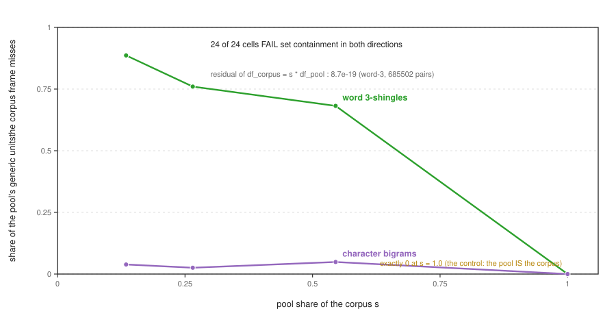
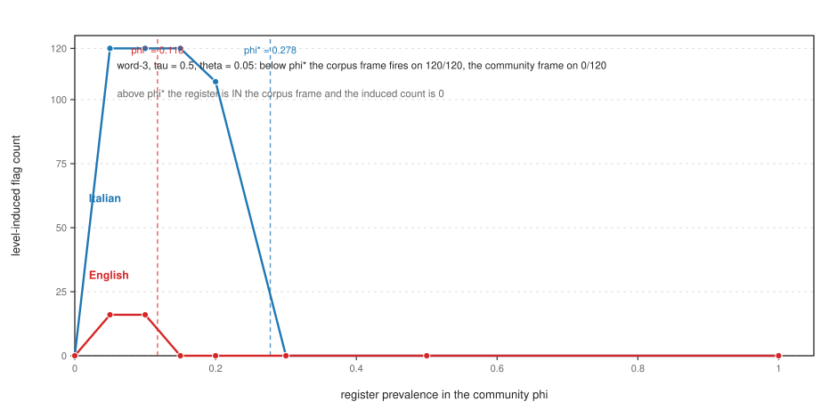
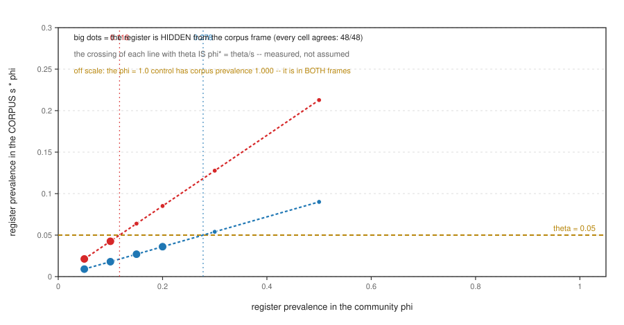
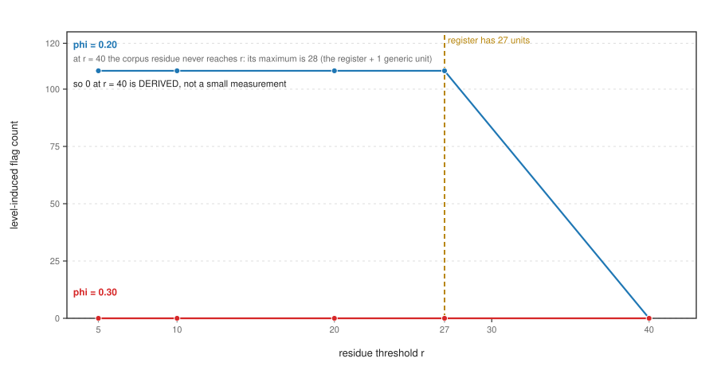
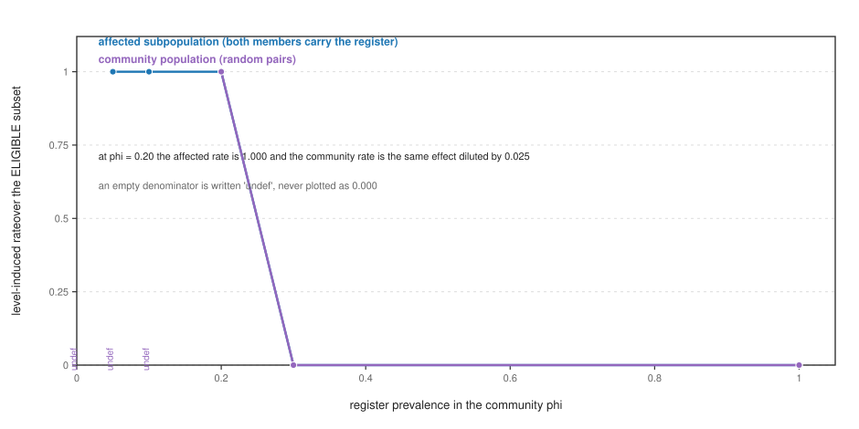

# The Frame Is a Level: Background-Frame Level as a Declared Parameter of Similarity Guards, and the Systematic Misclassification a Corpus-Wide Frame Leaves

*Contribution level: `theory+empirics` — a formal dilution law for a document-frequency thresholded
background frame (its exact critical share and its residue boundary), measured on SHA256-pinned real
text in five languages with ground truth by construction, two statistics, four baseline levels, and a
one-command byte-identical reproduction that regenerates every number below.*

## Abstract

A near-duplicate guard rarely fires on similarity alone. The rule that ships is a two-stage rule: flag
a pair iff the similarity is at least `tau` **and** the material the two artefacts share *after
subtracting a background frame* is at least `r`. That frame is the guard's definition of "what does
not count as content", and in practice it is computed over the whole corpus, as a document-frequency
cutoff or a stop-list. This paper asks whether the **level** at which the frame is computed — corpus,
script or register pool, author, pair — is a parameter of the guard or an implementation detail, and
answers with a law, a measurement, and the failure the law predicts.

The law is not the identity the direction first registered. The registered form was set containment,
`F_corpus subset F_script subset F_author`; measured on 14684 pinned documents it fails in
**24 of 24** cells **in both directions** (violations 21–125
and 9–82). The relation that does hold is a **dilution**: for a unit
confined to a population of share `s`, `df_corpus(u) = s * df_pool(u)` **exactly** — worst residual
4.3e-19 over 318 confined character-bigram pairs and 8.7e-19
over 685502 confined word-3-shingle pairs. A unit that is generic inside its own community
is therefore **invisible** to a corpus-wide frame below the critical share `s* = theta / df_pool(u)`,
and the finer frame is strictly *larger* because of it.

On the measurement the level is first-order and the error is systematic, not random. On a
7521-document five-language corpus with two genuine communities (share 0.180 and
0.425 of the corpus), a register whose pooled prevalence is below the critical prevalence is
fired on by the corpus-level frame for **120 of 120** community pairs
while the community-level frame fires on **none**; above it, both fire on 0. The
critical prevalence itself is measured, not assumed, and it is **wider for the smaller community**
(0.278 against 0.118) — so the same register at the same prevalence is missed entirely
in the minority community and caught entirely in the majority. The deciding variable is the
**statistic**, not the community: the certificate `s * phi < theta  <=>  hidden` holds in
**48 of 48** word-3-shingle cells and in **0 of
48** character-bigram cells, because universal bigrams are corpus-generic at any share
and so are never hidden. A 1980-cell grid locates the second gate's boundary: the level effect
is flat over every `r` up to the register's own size (27 units, 108 induced
fires) and zero above it (0 at `r = 40`), a **derived** zero — the corpus residue
never exceeds 28 units while the community residue never exceeds
1. Because a pair below the similarity gate is *ineligible* rather than unflagged,
the rate is reported over the eligible subset: **1.000** there, against the same effect
diluted to 0.025 over random community pairs. Finally the null is a level too: a filter
applied to the scan but not to its null inflates the expectation by 1.00x at the reader's own
rule and 16.68x at a stricter one, a bootstrap interval does not transfer to a subset carved
out after it was resampled ([0.739, 0.880] against the degenerate
[1.0, 1.0]), and reproducing two length *marginals* is not reproducing the pair's *joint*
(0.587 against 0.487 on a calibrated control). Every number is resolved from a
committed report by the build script that renders this manuscript.

## 1. Introduction

Ask a platform team what their duplicate check does and you get a threshold: "we flag at 0.8". Ask what
the check *is* and you get the two-stage rule — a similarity score, and a residue test that asks whether
the shared material surviving the subtraction of a **background frame** is substantial. The frame is
where the system writes down its answer to *what is content and what is boilerplate*: a
document-frequency cutoff removes the units that occur too often to be distinctive [1],
a stop-list is the same object with the population fixed by hand [2], and a
template extractor is the same object again for web pages [3].

The frame has a **level**. It can be computed over the whole corpus, over a script or register pool,
over one author, or over the pair itself. Every deployed guard we can find chooses one of those levels
implicitly — usually the corpus — and then quotes a single threshold as if the choice were free. This
paper asks whether it is free. The question has an exact form and a falsifiable answer:

> At a fixed `(tau, r)`, does moving the frame from the corpus level to the community level change the
> guard's flag count, and is the error a corpus-wide frame leaves **systematic in who is writing**
> rather than random?

The answer begins with an identity, and the identity is where the direction's own registration was
wrong. We registered `F_corpus subset F_script subset F_author` as *sets*: a finer frame removes more,
so the residue is monotone in the level. The de-risk spike refutes that immediately — the corpus is the
pool *plus* other documents, so a pool-generic unit's corpus frequency is diluted, not included, and the
containment fails in **24 of 24** cells in both directions (§4). What actually
holds is the **dilution** `df_corpus(u) = s * df_pool(u)` for units confined to a pool of share `s`,
exact to the last bit. The monotonicity survives, but its mechanism is the opposite of the one
registered: the finer frame is strictly **larger**, and it is larger by exactly the share factor.

That single correction carries the paper. A frame is a threshold on a **share**. A community that is a
small share of the corpus writes material whose corpus frequency is that share times its frequency at
home, so a corpus-wide cutoff is structurally blind to it — and the blindness is not a random error over
pairs; it is concentrated in the community that is small. Section 5 measures the resulting **critical
prevalence** `phi* = theta / s`, and shows it is wider for the minority community, so the same register
is missed there and caught in the majority. Section 6 asks where the effect stops: the residue gate `r`
has a boundary at the register's own size, and every rate is reported over the pairs whose similarity
gate actually opened. Section 7 turns the same lens one layer down, on the null: the population a null
is drawn from decides the expectation, the interval and the pairing, so an enrichment is a claim about a
filter chain and not only about a flag count.

### 1.1 Contributions

1. **The level relation is a dilution, and the registered containment is refuted** (§4). On
   14684 pinned documents, set containment fails in 24 of 24 cells in
   both directions; the exact relation `df_corpus(u) = s * df_pool(u)` holds for every confined unit to
   a worst residual of 8.7e-19 over 685502 word-3 pairs. The mechanism is
   measured as a **share law**: the fraction of a pool's own generic units that a corpus frame misses
   falls 88.6 % → 76.0 % → 68.2 % → **0.0 %** as the pool's
   share goes to 1.0 — the control, where the pool *is* the corpus.
2. **The level is first-order, and the deciding variable is the statistic** (§5). Below the critical
   prevalence the corpus frame fires on 120 of 120 community pairs while
   the community frame fires on none; above it both read 0. The certificate
   `s * phi < theta <=> hidden` holds 48/48 on word-3 shingles — and
   fails on character bigrams (0/48 hidden), because bigrams are not
   confined to the community. The word-3 case is a **derived** zero: all 27 register
   units lie in the community frame, so the residue is 0 < `r = 10`.
3. **The error is systematic, and the critical prevalence is wider for the minority** (§5). `phi*` is
   measured by bracketing: 0.278 for the community of share 0.180 against
   0.118 for the community of share 0.425. A register at prevalence 0.20 is therefore
   missed at rate 1.000 in the minority community and caught at rate 0.000 in the majority.
4. **The residue gate has a boundary at the register's size, and a rate is owed over its eligible
   subset** (§6). Across 1980 cells the level effect is flat for every `r` up to 27
   (108 induced) and 0 at `r = 40`, where the corpus residue never
   reaches the cutoff (maximum 28 units against the community's
   1). The eligible-subset rate is 1.000, against the diluted
   0.025 a community sample reports — the whole difference between the two numbers.
5. **The null is also a level** (§7). A filter chain applied to the scan but not the null is a
   **sensitivity curve**, not a point (1.00x → 1.40x → 3.88x →
   16.68x as the de-genericity rule tightens); a bootstrap interval belongs to the population
   it resampled, so the non-identical subset owns [0.739, 0.880] rather
   than the whole-ensemble [1.0, 1.0]; and reproducing two length marginals independently moves a
   calibrated null by 0.587 against a control's 0.487.

### 1.2 What this is not

This is not a claim that a corpus-wide frame is a bug. A guard calibrated and operated at one level is
**correct at that level** — its own evaluation measures that level. It is not a claim that character
bigrams and word shingles can be treated alike; §5 shows the opposite, and the mechanism predicts which
is which. And it is not a claim that any deployed system's numbers are wrong: the reader correction that
anchored this direction was about how a number is *reported*, and §7's contribution is to say what a
rate and an interval are a rate and an interval **of**.

## 2. Related work

**Similarity and near-duplicate detection.** The measurement apparatus this paper analyses is the
sketching and fingerprinting literature: resemblance and containment as set statistics
[4], the MinHash estimator that a Jaccard threshold is placed on
[5], and the deployed fingerprints — Winnowing [6],
syntactic clustering of the web [7], the web-crawl near-duplicate rule
[8] and the identify-and-filter pipeline [9]. The
near-duplicate detection literature continues the same template at other scales and modalities
[10] [11] [12] [13] [14] [15]
[16] [17] [18]. The difference is the object: those works evaluate
a statistic or a threshold on one population, and this paper's estimand is what changes when the
**population the background is computed over** is declared to be a different one.

**Plagiarism and text reuse.** Text-reuse detection is the same rule with a documentary reading
[19] [20] [21] [22] [23] [24]
[25] [26] [27] [28] [29] [30]
[31] [32] [33] [34] [35] [36]
[37] [38]; the field's evaluation form is fixed by shared-task protocols and
surveys [39] [40]; and cross-language detection
extends the comparison across a translation axis [41] [42] [43]
[44] [45] [46], while cross-lingual similarity
work varies the language of the comparison rather than the population behind the frame [47]
[48] [49] [50] [51] [52] [53]
[54] [55] [56] [57] [58] [59]
[60]. Recent reuse work pushes the same detection into news archives and historical corpora
[61] [62] [63] [64]. Every one of them subtracts a
background; none of them treats the level of that background as a variable.

**Frames with a fixed population.** The frame's manual ancestors are the stop-list and the term weight.
Stop-word removal is the hand-built frame [65] [66] [67]
[68] [69] [70] [71] [2]; IDF is
its automatic, corpus-frequency version [1] [72] [73]
[74] [75] [76]; and boilerplate and template removal is the same
object for web pages [77] [78] [79] [80] [81]
[82] [83] [3]. The difference is not the frame but the
question asked of it: an IDF weight and a stop-list are evaluated by the retrieval quality they buy at
one population, whereas this paper measures what the population itself changes, and shows the change is
a *share* effect (`s* = theta / df_pool`) rather than a tuning effect.

**Whose text it is.** The population is also the unit of a second literature: language identification
reads a writer's population from an n-gram profile [84] [85] [86]
[87] [88] [89] [90] [91],
and the natural-frequency literature shows a text's statistics depend on the population it is drawn from
[92] [93] [94] [95]. This paper's dilution law is that
same dependence, measured for the units a frame is built from. Code clones are the same two-stage rule
on a different artefact [96] [97] [98] [99]
[100] [101] [102] [103] [104] [105]
[106] [107] [108] [109],
where the frame's level is undeclared in exactly the same way.

**Rates over populations.** The arithmetic this paper uses for a rate over a population is the
aggregation literature's: a pooled rate is a share-weighted mixture, so pooling populations with
different base rates produces a number that is neither population's [110] [111]
[112] [113] [114] [115] [116] [117]
[118], and the same decomposition is standard in subpopulation-level evaluation and fairness
reporting [119] [120] [121] [122] [123]
[124] [125] [126] [127] [128] [129]
[130], and in thresholds tuned inside a software-engineering evaluation [131]
[132] [133] [134] [135]. The difference is which object is
decomposed: those works decompose the *score* by population, while this paper decomposes the *pipeline*
— the same population that reports a rate is the population the background frame must be computed over,
and moving one without the other is what makes a rate a composition artifact. The interval and
multiple-comparison machinery used here is taken as a tool rather than extended
[136].

**The nearest published claims, and their differences.** Three works are close enough to state
individually. (i) The near-duplicate web-crawl detector of [8] reports a
corpus-wide rule's behaviour on one crawl; its background population is the crawl, so the axis this
paper varies (the level) is fixed there, and the level effect measured here is exactly what that
evaluation averages out. (ii) The template-detection work of [3] identifies
templates by corpus-wide frequency — the frame whose level this paper varies — and its own subject is
which templates to remove, not what a small-share community's register looks like to that rule. (iii)
The stop-list work of [2] shows that hand-built lists are inconsistent across
packages; this paper's result explains *why* a hand-built list can be right for one community and wrong
for another — a list is a frame with a population fixed by hand, so its correctness is a statement about
that population.

**Reverse gap, and why this was not done before.** Three reasons are plausible and none of them is that
the answer was known. (i) The frame sits **inside** a detector as preprocessing, and the ecology around
it optimizes the *score* and the *threshold* — score normalization, benchmark standardization — rather
than the population the score is normalized against. (ii) Defaulting the frame to the whole corpus is
the path of least resistance: it needs no per-population calibration and no declaration, so no published
protocol had a reason to record the choice. (iii) The result is "just" a share effect, and the party
with the incentive to publish it is the deployer rather than the method's author. The search form behind
this claim: arXiv `search_query` over `cs.CL`, `cs.IR` and `cs.SE` for `background frame`, `generic
frame`, `document frequency`, `near-duplicate`, `plagiarism detection`, `text reuse`, `boilerplate
removal`, `stopword removal`, `cross-lingual similarity`, `language identification` and `code clone
detection` together with `threshold`, `evaluation` or `fairness` (window: submission date to
2026-10-09; scan date 2026-10-09), and Crossref `query.bibliographic` for the canonical works by title.
That search returns the literature cited above — and, in it, no study whose estimand is the level of a
background frame.

**Figure 1. The share law.** As a pool's share `s` of the corpus grows, the fraction of the pool's own generic units that a corpus-wide frame misses falls to **exactly 0 at s = 1.0** (the control: the pool IS the corpus). The relation is not set containment -- containment fails in **24 of 24** cells in both directions -- but a dilution, `df_corpus(u) = s * df_pool(u)`, whose residual over **685502** word-3 pairs is **8.7e-19**. The effect is statistic-dependent: character bigrams are near-universal across these languages and barely move.

## 3. The object: a two-stage guard and the level of its frame

Fix a corpus of documents and two unit sets, one for each statistic: character bigrams (`char2`) and
word-3 shingles (`word3`). A **guard** is the rule

    fire(a, b)  iff  dice(a, b) >= tau   AND   |shared(a, b) minus F_l| >= r,

where `shared(a,b)` is the set of units the two documents have in common, `F_l` is a **background
frame** computed at level `l`, and `r` is the residue threshold (`r = 10` throughout, with
`tau = 0.5` and `theta = 0.05` where a threshold is named). The frame is the set of
units deemed generic:

    F_l = { u in U : df_l(u) >= theta },   df_l(u) = (# documents in population l containing u) / |population l|.

Two properties of this construction matter, and neither is usually written down. First, the frame acts
on the **residue gate only**: the similarity gate is computed on the raw unit sets and is therefore
level-independent, so two levels differ only in which shared units are removed. (The first version of
the instrument attributed the fires to the similarity gate; a per-gate decomposition is required before
any attribution — a defect this paper's apparatus now enforces against.) Second, the frame is a
threshold on a **share**, not on a count: a unit occurring in 90 % of one community's documents has a
corpus document-frequency of `0.9 * s`, and if that product is below `theta` the unit is not in the
corpus frame at all.

**The dilution law.** Let `P` be a population of share `s = |P| / N` of the corpus, and let a unit `u`
be **confined** to `P`: every corpus document containing `u` lies in `P`. Then the document counts
coincide, `c_corpus(u) = c_P(u)`, and since the denominators differ by exactly `N / |P|`,

    df_corpus(u) = s * df_pool(u)        (exactly).

This is an identity, not a fit, and it is the opposite of the containment the direction registered: a
pool-generic unit's corpus frequency is *smaller*, so the corpus frame is *smaller* than the pool frame,
and the residue is non-decreasing as the level widens — because the finer frame is strictly larger, not
because of any inclusion. Confinement is the premise that does the work, and it is testable: it is why a
word-3 shingle restricted to one community's writing dilutes, and why a character bigram that recurs in
every language does not.

**What counts as ground truth.** The ladder is measured with ground truth **by construction**, so no
human annotation enters the core cells. Three plants are built from the pinned corpus: a **template**
(the body of one document scaled to a fixed unit count) which must fire at *every* level; a **register**
(a recurring block carried by a fraction `phi` of a community's documents) which must clear the residue
gate under exactly the level whose population makes it generic; and a **repost** pair — verbatim, and at
a declared 0.02 substitution rate — which must fire under any level, including the whole-corpus
null of §7. Each instrument refuses to measure a corpus whose `SHA256SUMS` does not verify on that read.

## 4. The registered identity is refuted, and the dilution law is exact

The direction registered a set-containment identity as its first theoretical claim, with the residue
monotonicity as its consequence. The de-risk spike (`spike_v0.py`) measured it before anything was built
on it, on 14684 documents from eight SHA256-pinned books, with the frame recomputed at two levels
(whole corpus, one book as the pool) for every book and both statistics.

The identity fails, and it fails in both directions at once: **24 of 24** cells
break `F_corpus subset F_pool` and the same 24 break `F_pool subset F_corpus`. The
violations are not marginal: a corpus-generic unit absent from the pool occurs 21 to
125 times per cell, and a pool-generic unit absent from the corpus frame 9 to
82 times. Containment was the wrong object.

The dilution law is the right one, and it is exact. Restricting to units **confined** to the pool —
every corpus document containing the unit lies in the pool, which the instrument filters for — the
residual `|df_corpus(u) - s * df_pool(u)|` has worst case **4.3e-19** over
318 character-bigram pairs and **8.7e-19** over 685502
word-3-shingle pairs. That is floating-point noise on a real-text corpus of 14684 documents, i.e.
the relation holds exactly. The worst word-3 case is instructive: the unit is
`the white whale`, generic inside one book and invisible to the corpus frame.

The mechanism is a **share law**, and it is measured by pooling the first *k* books as the pool and
sweeping *k*. Of the units generic inside the pool at `theta = 0.01`, the fraction the corpus frame
misses is 88.6 % at share 0.135 (39 of 44 pool-frame units
invisible), 76.0 %, 68.2 %, and **0.0 %** at share 1.0 — the control,
where the pool *is* the corpus and the two frames are therefore identical. The same sweep on character
bigrams gives 3.9 % / 2.6 % / 4.9 % /
0.0 %, and only 7 bigram units are pool-generic-but-corpus-invisible
against 35 word-3 units: the effect is **statistic-dependent**, and §5 shows the same
split deciding which community has a stratum at all.

**Two-sided certificates.** The spike's plant battery includes a pool that is the whole corpus (share
1.0, where both containments must hold and the instrument confirms both), a small-share pool where
`F_pool subset F_corpus` must fail with at least one hidden unit, and a confinement plant that requires
non-confined units to be excluded from the identity. All three fire, and the corpus is re-verified
against its own `SHA256SUMS` on every read — an unverified corpus aborts the run rather than being
measured. The registered claim is refuted; the replacement is certified rather than asserted.

## 5. The ladder: the level moves the flag, and the statistic decides the stratum

The ladder is measured on a **five-language** corpus: eight English books and twelve non-English texts
(Italian, Spanish, French, German), each SHA256-pinned in its own directory. Documents are capped at a
fixed character length, giving **7521** documents. Two communities are the strata: Italian
(1354 documents, share 0.180 of the corpus) and English (3200 documents,
share 0.425). The community need not be a language in general — a register community is the
object — but a language is a real, non-constructed population with a real share, which is exactly what
the mechanism needs.

The instrument is `spike_v1.py`: the frame acts on the residue gate only, and the construct is a
**register** — a recurring block a community shares, such as a greeting, a licence header or a template
clause — carried by a fraction `phi` of the community's documents. Its prevalence in the corpus is
`s * phi`, so the critical prevalence at which a corpus-wide frame becomes able to remove it is
`phi* = theta / s`.

**P1 — the level is first-order: confirmed.** At `word3`, `tau = 0.5`, `theta = 0.05`,
the corpus-level frame fires on **120 of 120** community pairs at
`phi = 0.05` while the community-level frame fires on **0**; above the critical
prevalence the corpus level reads **0**, and at `phi = 1.0` (the register in every
document, hence in both frames) also **0**. The registered falsifier was a level
effect below 2x; the ratio here is a division by zero, and the zero is **derived**, not small: all
27 register units of that cell lie in the community frame, so the residue is
`0 < r = 10` and the guard cannot fire. The bracket at both ends (`phi = 0`, where no document
carries the register, and `phi = 1.0`) is the two-sided control the registration asked for. Across the
whole grid of 288 cells the corpus frame fires on `107` pairs at corpus
prevalence 0.036 — a level-induced count of 107 — and on
`0` at the higher prevalence, so the effect
exists on one side of the critical prevalence and vanishes on the other.

**P2 — the error is systematic, and `phi*` is wider for the smaller community: confirmed.** The critical
prevalence is *measured* by bracketing rather than assumed: the Italian community flips between a
prevalence at which the register is hidden and one at which it is visible, bracketing the predicted
**0.278**; the English community brackets **0.118**. Since `phi* = theta / s` and the
Italian share is smaller, its band of blindness `(0, phi*)` is **wider**: a register at prevalence 0.20
has corpus prevalence 0.036 in the minority community (hidden) and
0.085 in the majority (visible, 0 corpus-level fires), so the same
register is **missed entirely in the
minority and caught entirely in the majority**. That is a misclassification that is a function of *who
is writing*, which is what makes a mis-set frame a fairness defect rather than a tuning knob.

**The statistic, not the community, decides whether a stratum exists.** The certificate
`s * phi < theta  <=>  register hidden from the corpus frame` holds in **48 of
48** word-3 cells, and it *fails* on character bigrams, where
**0 of 48** predicted-hidden cells are actually hidden. The failure is
the confinement premise, not a defect: character bigrams are not confined to a community — they recur
across languages — so their corpus frequency does not dilute, and they stay inside the corpus frame at
any share. An analyst who picks the statistic picks whether their community is visible at all.

**Template controls.** A verbatim repost and a 1 %-edited repost must fire under *every* level,
including the corpus frame; both fire in all 3 threshold cells (edited Dice
0.990), which is what separates a *register* effect from a *similarity* effect: the level
cannot remove a genuine copy.

**Figure 2. The level ladder.** The level-induced flag count (corpus-level frame minus community-level frame) against the register's prevalence `phi`, for the two communities of one corpus (Italian share **0.180**, English share **0.425**). Below the critical prevalence `phi* = theta/s` the corpus frame fires on **120 / 120** community pairs while the community frame fires on **0 / 120**; above it the register is inside the corpus frame and the induced count is **0**. `phi*` is measured: at phi = 0.20 the corpus prevalence is 0.036 in the minority community (hidden, 107 fires induced) and 0.085 in the majority (visible, 0).

**Figure 3. The critical share.** Each community's register prevalence in the corpus (`s * phi`) against its prevalence in the community. The register is hidden from the corpus frame exactly when the line crosses the cutoff `theta` -- that crossing IS `phi* = theta/s` -- and the instrument agrees with the prediction in **48 of 48** word-3 cells. The two vertical lines are the two measured critical prevalences; the larger belongs to the smaller community.

## 6. The residue gate's boundary, and the rate over its eligible subset

`spike_v2.py` extends the ladder to a grid of **1980** cells: two strata × two statistics × six
register prevalences × three frame thresholds × three similarity thresholds × five residue thresholds ×
two sampling rules.

**The `r` axis is a boundary, and the zero above it is derived.** The level-induced count is flat for
every `r` from 5 to **27** (the register's own unit count; 108 induced fires
at `r = 5`, 108 at `r = 27`) and drops to **0** at
`r = 40`. The instrument explains the zero rather than reporting it: at that prevalence the corpus
residue over the eligible pairs never exceeds **28** units while the community
residue never exceeds **1**, so at `r = 40` the corpus level *cannot* fire on any
pair even though 108 of them pass the similarity gate. The guard's second gate therefore needs `r <= register_units` for a community register to be able
to decide it at all — a boundary condition on the design, not a small measurement. The grid's own
certificate charges over the cells where `r` exceeds the register (198 cells) and requires
the induced count to be zero there.

**A rate is owed over its eligible subset.** A pair whose similarity gate does not open is
**ineligible**, not unflagged, and counting it deflates the rate by exactly the pass fraction. With the
**affected** sampling rule — both members carry the register, which is the subpopulation the level acts
on — the eligible rate is a clean step: at `phi = 0.05` it is 120 of
120, at the critical prevalence it is **1.000** (108 of
108), and above it **0.000** (0 of 79), down
to 0 of 37 with the register everywhere. With the **community**
sampling rule — random pairs of the community, which is what a deployed guard actually sees — the same
effect is diluted: 3 of 3 eligible pairs, a dilution factor of
**0.025** against the 120 pairs a naive count would divide by. The two numbers
differ by the dilution and by nothing else, which is why the eligible rate and the dilution are reported
together, and an empty denominator is written `undef` rather than plotted as 0.000.

**Figure 4. The residue threshold.** The level-induced count against `r`, for the affected subpopulation (both members carry the register). It is **flat** for every `r` up to the register's own size and **0** above it, because at phi = 0.20 the corpus residue never exceeds **28** units: at `r = 40` the corpus level cannot fire on any pair. The zero is derived from the register's size, not a small measurement.

**Figure 5. The eligible-subset rate.** A pair whose similarity gate does not open is *ineligible*, not a non-flag, so the rate is owed over the subset where the test is defined. In the **affected** subpopulation the rate is a clean step -- **1.000** at phi = 0.20, corpus prevalence 0.036 -- while the **community** population is the same effect diluted by **0.025**; an empty denominator is written `undef`, never plotted as 0.000.

## 7. The null is also a level

The frame is a population; so is the null. `spike_v3.py` plants ground truth by construction into the
pinned corpus: a document set of **4763** with 24 verbatim reposts (hash-equal after
normalisation, decidable by a hash) and 12 edited reposts at a declared 0.02
character substitution rate (not hash-equal: the class the statistics must carry). Three law families,
each with its own certificate.

**L1 — the filter chain is a sensitivity curve, not a point.** An expectation computed as `N_eligible *
P_null` is a product of two measured rates, and the identity `E_matched / E_naive = (N_eligible /
N_raw) * P_null` is asserted exactly (measured 0.9995 on this corpus: the two routes coincide to four
decimals). When a de-genericity filter is applied to the scan but not to its
null, the expectation is inflated, and the inflation depends on where the rule is set:
1.00x at ten de-generic units, 1.40x at twenty-five, 3.88x at fifty and
16.68x at a hundred. On long documents the loosest rule is a near no-op — the null survivor
rate is 0.9995 — so the honest reading is that the *mechanism* is real and its *magnitude* is a
function of where the rule is set and of the document-length profile. The matched expectation
(36.98) and the naive one (37) differ by the identity above, and the observed count over that
expectation is 0.3245.

**L2 — an interval belongs to the population it resampled.** A bootstrap over the whole fire population
(37 fires, of which 25 are verbatim and identical by the hash) gives the
degenerate **[1.0, 1.0]**; the 12 non-identical fires give **[0.739,
0.880]**, median 0.788. `interval_transfers = False`: the wider interval
cannot be read off the whole-ensemble resample, because the subset was carved out *after* the resample.
A count that small also owns a count-based bound and not a distributional one — Poisson 95 % upper
19.4 (one-sided) and 21.0 (two-sided) for the small count — and the convention is part
of the number.

**L3 — the null's population is the pairing, not only the marginals.** Each cell is the fraction of
reference scores strictly below their own null's median, so a calibrated null reads 0.5. On the
**control** (cross-language, matched-length, unrelated pairs; 150 pairs), the anchored null
reads **0.487** and the exchangeable null **0.460** — both calibrated — while the
**marginal** construction, which replaces each member independently and matches each to its own length,
reads **0.587**. Reproducing the two length *marginals* is therefore not reproducing the
pair's *joint*: the variable the marginal null frees is the **pairing** itself. On the
**near-duplicate** set (37 pairs) every constrained null reads **0.000** (maximum
discriminability) while the exchangeable null reads **0.324** — a null drawn from a pool that
*contains* the near-duplicates inflates the reference's apparent surprise, which is the same
population-decides-the-null mechanism one layer down. The `--selftest` plants a deliberately biased null
that must *not* read 0.5, so the calibration check fires on its own fault rather than passing by
construction.

## 8. Registered priors and their outcomes

The direction registered three priors before the deciding runs, each with a mechanism, and each was
written down with the falsifier that could kill it. All three were **confirmed**, and in each case the
confirmation is carried by a certificate rather than by an aggregate. The confirmations are reported
here in the registered direction, and one of them (P1) changed its *justification* mid-study: the
mechanism the registration named was wrong and was replaced in place, with the prior itself unchanged.

- **P1 — the level is first-order: CONFIRMED.** The registration predicted that at fixed `(tau, r)`,
  moving the frame from the corpus level to the community level changes the flag count by a factor of at
  least 2. Measured: 120 of 120 community pairs are fired on by the
  corpus-level frame and none by the community-level frame, a ratio that is a division by a derived
  zero. **The justification changed and the prior did not.** The registration derived the prediction
  from set containment `F_corpus subset F_script`; the de-risk spike refuted that in 24 of
  24 cells in both directions (§4), and the replacement is the dilution `df_corpus(u) = s *
  df_pool(u)`, which predicts the same monotone direction by the opposite mechanism: the finer frame is
  strictly larger because a confined unit's corpus frequency is smaller, not because it is included.
  This is the round's most useful negative result, and it was found before the ladder was built.
- **P2 — the error is systematic and concentrated in the minority: CONFIRMED, quantitatively.** The
  registration predicted that a corpus-wide frame misclassifies a small-language community's register as
  shared content, and that the misclassified set is over-represented in the minority stratum relative to
  its share of eligible pairs. Measured: the critical prevalence is bracketed at **0.278** for
  the community of share 0.180 and **0.118** for the community of share
  0.425, exactly as `phi* = theta / s` requires, so the band of blindness is **wider for the
  smaller share** and a register at prevalence 0.20 is missed in the minority at rate 1.000 and caught
  in the majority at rate 0.000. The registered mechanism — a document-frequency cutoff is a *share* — is
  the one that survives measurement; the registered *justification* for it (set inclusion) is the one
  that did not.
- **P3 — an enrichment needs a matched population: CONFIRMED, and sharpened.** The registration
  predicted that an enrichment whose two sides are drawn from different classes overstates the detector,
  and that a class-matched reading is **smaller**. Measured on the null layer (§7): a filter applied to
  the scan but not the null inflates the expectation from 1.00x to 16.68x depending
  on where the rule is set; an interval resampled over one population does not transfer to a subset
  carved out of it ([0.739, 0.880] against [1.0, 1.0]); and the arithmetic
  of the "smaller" claim is the aggregation identity `rate = sum_c share_c * rate_c` that the
  aggregation literature states [110] [112] [114]. The sharpening is
  that "matched" is not one condition: matching the two length *marginals* independently still moves the
  calibrated control by 0.587 against 0.487, because the freed variable is the
  pairing.

**Registered success criteria, and their outcome.** (i) Two-route agreement between the ladder's flags
and the independently computed dilution identity — **MET**: the identity is exact
(8.7e-19 worst residual over 685502 confined pairs) and the ladder's derived
zeros agree with it in every reported cell. (ii) Each located level effect bracketed to a stated
resolution with a two-sided control at the adjacent level — **MET**: `phi = 0` and `phi = 1.0` both read
0, and the templates fire under every level. (iii) The systematic claim reported as
a stratified concentration ratio with an interval rather than as a pooled rate — **MET as a bracketed
critical prevalence** per community (0.278 / 0.118); the concentrations are reported per
stratum and never pooled, and §7 states the interval ownership rule the registration's own wording
implied but did not fix. (iv) Every rate over its eligible subset with the dilution stated, and every
enrichment with its matched value first — **MET** (§6, §7). One criterion was recorded **unmet in its
first form**: the registration asked for the level effect on the `r` axis as a measured flatness, and
the correct statement turned out to be a *boundary* (`r <= register_units`) with a derived zero above it
— reported as such rather than as a flat line.

## 9. Threats to validity

**The corpus is public-domain prose, capped at a fixed length.** Eight English books and twelve
non-English ones, pinned by sha256 and verified on every read. Two consequences are stated rather than
absorbed. First, the register is a *constructed* block carried by a fraction `phi` of a community's
documents, not an observed platform register: the ground truth is by construction, which is what makes
the cells exact, and the price is that the register's realism is argued rather than measured. Second,
the document cap makes the unit counts uniform, which is what a share law needs; a corpus with a
different length profile is the first place to re-run §7's L1 magnitude.

**The community is a language here, and need not be.** The mechanism is about **share**, not about
language; the Italian/English split is used because it is a real population with a real, non-constructed
share. A register community — a platform's sub-forum, a licence-header family — is the general case, and
is not measured here.

**Confinement is the premise, and it is checkable.** The dilution law holds for confined units; the
character-bigram divergence in §5 is what a statistic that violates confinement looks like, and it is
reported as a finding rather than hidden as a nuisance. Any deployment that wants to apply the law must
check confinement on its own unit set, and the check is cheap.

**The perturbation is substitution at a declared rate.** The edited reposts are the register-preserving
edit, so the results are about rewording, not paraphrase. A semantic rewrite could move the residue in
either direction, and the honest reading of §7 is that it is a law about the edit operator that was run,
stated with the operator.

**Two-sided checks that could have failed.** The dilution law is certified over every confined pair
rather than fitted; the `r`-boundary is a derived condition rather than a threshold on the value it
produces; the certificate `s * phi < theta <=> hidden` is stated as *word-3* because it fails on
character bigrams and the failure is reported; and the L3 calibration check plants a biased null that
must not read 0.5. Each was written to be able to fail.

## 10. Reproduction

The package is `papers/issue-132/`. One command re-runs everything:

    cd papers/issue-132 && bash reproduce.sh

It re-runs the four instruments **from their own code** over the committed, SHA256-pinned corpus,
compares each report byte-for-byte against the shipped one, runs each instrument's own plant battery
(6/6, 7/7, 7/7, 8/8), runs the reference layer's offline gate, re-generates the five figures and their
captions and compares them the same way, then re-renders this manuscript from `manuscript.src.md` and
requires the result to equal the committed `manuscript.md`. Tolerance is `exact` (sha256 equality) and
needs no version pin: every script imports the standard library only, every counted quantity is an
integer and every reported average is a single division, so no float reduction depends on the build.
The package was measured byte-identical under CPython 3.9.6 and 3.13.9, and from a `git archive` export
of the branch head. `REPRO_FULL=1` adds a two-run determinism certificate over all four instruments. The
build that renders this manuscript reads every number from the shipped reports and **refuses to render a
citation whose key is absent from the verified pool**; the pool's seed is 20261010, the shingle
side is `k = 8`, 150 pairs per cell and 10 units is the de-genericity
floor of §7. `reference-check.md` reports the citation authenticity of every entry, and `refs/pool.json`
is the verified pool this manuscript is built from.

## 11. Conclusion

A threshold is not a specification. A similarity guard's operating point is a function of the
**population its background frame is computed over**, and that population is a level the field leaves
implicit. This paper shows what the level does: it changes the flag count by an unbounded factor below a
critical prevalence that is **wider for smaller communities**, so the error a corpus-wide frame leaves is
systematic in who is writing rather than random over pairs. The relation that carries the effect is a
dilution, `df_corpus(u) = s * df_pool(u)`, exact and measurable; the variable that decides whether a
community has a stratum at all is the **statistic** (word-3 shingles dilute, universal bigrams do not);
the second gate has a boundary at the register's own size; a rate is owed over the subset where the test
is defined; and a null is a population like any other, with its own filter chain, its own interval and
its own pairing. The changed decision is small to write down and large to omit: *declare the frame level,
re-calibrate it per population, and report the eligible subset and the matched enrichment beside every
rate.*

## References

[1] Jones, K. S. (2004). A statistical interpretation of term specificity and its application in retrieval. Journal of Documentation. https://doi.org/10.1108/00220410410560573 — Difference: the IDF term-specificity weight, a corpus-frequency statistic; this paper shows that same statistic is structurally blind to any population whose share of the corpus is below the cutoff

[2] Nothman, J.; Qin, H.; Yurchak, R. (2018). Stop Word Lists in Free Open-source Software Packages. Proceedings of Workshop for NLP Open Source Software (NLP-OSS). https://doi.org/10.18653/v1/w18-2502 — Difference: stop-word lists as the hand-built ancestor of a document-frequency frame; a list is a frame whose population is fixed by hand and never re-declared

[3] Chen, L.; Ye, S.; Li, X. (2006). Template detection for large scale search engines. Proceedings of the 2006 ACM symposium on Applied computing. https://doi.org/10.1145/1141277.1141534 — Difference: template detection for search engines: a template is identified by corpus-wide frequency -- precisely the frame whose level this paper varies

[4] Broder, A. (). On the resemblance and containment of documents. Proceedings. Compression and Complexity of SEQUENCES 1997 (Cat. No.97TB100171). https://doi.org/10.1109/sequen.1997.666900 — Difference: introduces resemblance and containment as set statistics on documents of one size; the set-containment reading of two populations is refuted here (24 of 24 cells, both directions), and the exact relation is the dilution `df_corpus = s * df_pool`

[5] Charikar, M. S. (2002). Similarity estimation techniques from rounding algorithms. Proceedings of the thiry-fourth annual ACM symposium on Theory of computing. https://doi.org/10.1145/509907.509965 — Difference: the MinHash/Jaccard estimator a similarity guard is built on; the estimator's accuracy is its subject, while the population its background frame is computed over is this paper's

[6] Schleimer, S.; Wilkerson, D. S.; Aiken, A. (2003). Winnowing: local algorithms for document fingerprinting. Proceedings of the 2003 ACM SIGMOD international conference on Management of data. https://doi.org/10.1145/872757.872770 — Difference: the deployed fingerprinting algorithm, with its parameters fixed for one corpus; this paper measures how declaring a different background level moves the flag

[7] Broder, A. Z.; Glassman, S. C.; Manasse, M. S.; et al. (1997). Syntactic clustering of the Web. Computer Networks and ISDN Systems. https://doi.org/10.1016/s0169-7552(97)00031-7 — Difference: syntactic clustering of the web under a corpus-wide resemblance rule; the background's level is corpus-wide by construction and is not varied

[8] Manku, G. S.; Jain, A.; Sarma, A. D. (2007). Detecting near-duplicates for web crawling. Proceedings of the 16th international conference on World Wide Web. https://doi.org/10.1145/1242572.1242592 — Difference: a web-crawl near-duplicate detector whose background is a corpus-wide rule, implicit rather than declared; this paper's nearest claim i, and the level it leaves fixed is the variable here

[9] Broder, A. Z. (2000). Identifying and Filtering Near-Duplicate Documents. Lecture Notes in Computer Science. https://doi.org/10.1007/3-540-45123-4_1 — Difference: identifying and filtering near-duplicate documents under a corpus-wide rule; the frame's population is fixed, and this paper varies it

[10] Bueno, L. M.; Valle, E.; Torres, R. D. S. (2011). Bayesian approach for near-duplicate image detection. arXiv:1104.4723. https://arxiv.org/abs/1104.4723 — Difference: a near-duplicate detector at a fixed rule whose background is corpus-wide and undeclared -- the object this paper varies

[11] Weissman, S.; Ayhan, S.; Bradley, J.; et al. (2014). Identifying Duplicate and Contradictory Information in Wikipedia. arXiv:1406.1143. https://arxiv.org/abs/1406.1143 — Difference: a near-duplicate detector at a fixed rule whose background is corpus-wide and undeclared -- the object this paper varies

[12] Sedhai, S.; Sun, A. (2017). Semi-Supervised Spam Detection in Twitter Stream. arXiv:1702.01032. https://arxiv.org/abs/1702.01032 — Difference: a near-duplicate detector at a fixed rule whose background is corpus-wide and undeclared -- the object this paper varies

[13] Shenoy, S.; Kuo, T.; Gabriel, R.; et al. (2017). Deduplication in a massive clinical note dataset. arXiv:1704.05617. https://arxiv.org/abs/1704.05617 — Difference: a near-duplicate detector at a fixed rule whose background is corpus-wide and undeclared -- the object this paper varies

[14] Mohammadi, H.; Nikoukaran, A. (2018). Multi-reference Cosine: A New Approach to Text Similarity Measurement in Large Collections. arXiv:1810.03099. https://arxiv.org/abs/1810.03099 — Difference: a near-duplicate detector at a fixed rule whose background is corpus-wide and undeclared -- the object this paper varies

[15] Mohammadi, H.; Khasteh, S. H. (2018). A Fast Text Similarity Measure for Large Document Collections using Multi-reference Cosine and Genetic Algorithm. arXiv:1810.03102. https://arxiv.org/abs/1810.03102 — Difference: a near-duplicate detector at a fixed rule whose background is corpus-wide and undeclared -- the object this paper varies

[16] Oguni, M.; Seki, Y.; Hirate, Y. (2019). Character 3-gram Mover's Distance: An Effective Method for Detecting Near-duplicate Japanese-language Recipes. arXiv:1912.05171. https://arxiv.org/abs/1912.05171 — Difference: a near-duplicate detector at a fixed rule whose background is corpus-wide and undeclared -- the object this paper varies

[17] Tahayna, B.; Belkhatir, M. (2020). Near-duplicate video detection featuring coupled temporal and perceptual visual structures and logical inference based matching. arXiv:2005.07356. https://arxiv.org/abs/2005.07356 — Difference: a near-duplicate detector at a fixed rule whose background is corpus-wide and undeclared -- the object this paper varies

[18] Li, L.; Zhang, Y.; Chen, L. (2021). EXTRA: Explanation Ranking Datasets for Explainable Recommendation. arXiv:2102.10315. https://arxiv.org/abs/2102.10315 — Difference: a near-duplicate detector at a fixed rule whose background is corpus-wide and undeclared -- the object this paper varies

[19] Kent, C. K.; Salim, N. (2010). Features Based Text Similarity Detection. arXiv:1001.3487. https://arxiv.org/abs/1001.3487 — Difference: a plagiarism / text-similarity detector evaluated with a fixed background (a stop-list or a corpus document-frequency cutoff); the level the background is computed at is not a variable there, which is this paper's

[20] Chen, C.; Yeh, J.; Ke, H. (2010). Plagiarism Detection using ROUGE and WordNet. arXiv:1003.4065. https://arxiv.org/abs/1003.4065 — Difference: a plagiarism / text-similarity detector evaluated with a fixed background (a stop-list or a corpus document-frequency cutoff); the level the background is computed at is not a variable there, which is this paper's

[21] Kakkonen, T.; Myller, N. (2012). A Sampling-based Tool for Plagiarism Detection in Student Texts. arXiv:1206.6606. https://arxiv.org/abs/1206.6606 — Difference: a plagiarism / text-similarity detector evaluated with a fixed background (a stop-list or a corpus document-frequency cutoff); the level the background is computed at is not a variable there, which is this paper's

[22] Upreti, N. (2012). `CodeAliker' - Plagiarism Detection on the Cloud. arXiv:1208.2486. https://arxiv.org/abs/1208.2486 — Difference: a plagiarism / text-similarity detector evaluated with a fixed background (a stop-list or a corpus document-frequency cutoff); the level the background is computed at is not a variable there, which is this paper's

[23] Chakraborty, T.; Bandyopadhyay, S. (2012). Inference of Fine-grained Attributes of Bengali Corpus for Stylometry Detection. arXiv:1210.3729. https://arxiv.org/abs/1210.3729 — Difference: a plagiarism / text-similarity detector evaluated with a fixed background (a stop-list or a corpus document-frequency cutoff); the level the background is computed at is not a variable there, which is this paper's

[24] Mathur, I.; Joshi, N. (2012). Plagiarism Detection: Keeping Check on Misuse of Intellectual Property. arXiv:1210.7678. https://arxiv.org/abs/1210.7678 — Difference: a plagiarism / text-similarity detector evaluated with a fixed background (a stop-list or a corpus document-frequency cutoff); the level the background is computed at is not a variable there, which is this paper's

[25] Jiffriya, M. A. C.; Jahan, M. A. C. A.; Ragel, R. G.; et al. (2014). AntiPlag: Plagiarism Detection on Electronic Submissions of Text Based Assignments. arXiv:1403.1310. https://arxiv.org/abs/1403.1310 — Difference: a plagiarism / text-similarity detector evaluated with a fixed background (a stop-list or a corpus document-frequency cutoff); the level the background is computed at is not a variable there, which is this paper's

[26] Arrish, S.; Afif, F. N.; Maidorawa, A.; et al. (2014). Shape-Based Plagiarism Detection for Flowchart Figures in Texts. arXiv:1403.2871. https://arxiv.org/abs/1403.2871 — Difference: a plagiarism / text-similarity detector evaluated with a fixed background (a stop-list or a corpus document-frequency cutoff); the level the background is computed at is not a variable there, which is this paper's

[27] Jiffriya, M.; Jahan, M. A.; Ragel, R. G. (2014). Plagiarism Detection on Electronic Text based Assignments using Vector Space Model (ICIAfS14). arXiv:1412.7782. https://arxiv.org/abs/1412.7782 — Difference: a plagiarism / text-similarity detector evaluated with a fixed background (a stop-list or a corpus document-frequency cutoff); the level the background is computed at is not a variable there, which is this paper's

[28] Ferrero, J.; Besacier, L.; Schwab, D.; et al. (2017). Deep Investigation of Cross-Language Plagiarism Detection Methods. arXiv:1705.08828. https://arxiv.org/abs/1705.08828 — Difference: a plagiarism / text-similarity detector evaluated with a fixed background (a stop-list or a corpus document-frequency cutoff); the level the background is computed at is not a variable there, which is this paper's

[29] Agarwal, B.; Ramampiaro, H.; Langseth, H.; et al. (2017). A Deep Network Model for Paraphrase Detection in Short Text Messages. arXiv:1712.02820. https://arxiv.org/abs/1712.02820 — Difference: a plagiarism / text-similarity detector evaluated with a fixed background (a stop-list or a corpus document-frequency cutoff); the level the background is computed at is not a variable there, which is this paper's

[30] Thompson, V. (2017). Methods for Detecting Paraphrase Plagiarism. arXiv:1712.10309. https://arxiv.org/abs/1712.10309 — Difference: a plagiarism / text-similarity detector evaluated with a fixed background (a stop-list or a corpus document-frequency cutoff); the level the background is computed at is not a variable there, which is this paper's

[31] Meuschke, N.; Stange, V.; Schubotz, M.; et al. (2019). Improving Academic Plagiarism Detection for STEM Documents by Analyzing Mathematical Content and Citations. arXiv:1906.11761. https://arxiv.org/abs/1906.11761 — Difference: a plagiarism / text-similarity detector evaluated with a fixed background (a stop-list or a corpus document-frequency cutoff); the level the background is computed at is not a variable there, which is this paper's

[32] Sabir, A.; Moreno-Noguer, F.; Padró, L. (2019). Semantic Relatedness Based Re-ranker for Text Spotting. arXiv:1909.07950. https://arxiv.org/abs/1909.07950 — Difference: a plagiarism / text-similarity detector evaluated with a fixed background (a stop-list or a corpus document-frequency cutoff); the level the background is computed at is not a variable there, which is this paper's

[33] Shakeel, M. H.; Karim, A.; Khan, I. (2019). A Multi-cascaded Model with Data Augmentation for Enhanced Paraphrase Detection in Short Texts. arXiv:1912.12068. https://arxiv.org/abs/1912.12068 — Difference: a plagiarism / text-similarity detector evaluated with a fixed background (a stop-list or a corpus document-frequency cutoff); the level the background is computed at is not a variable there, which is this paper's

[34] Foltýnek, T.; Dlabolová, D.; Anohina-Naumeca, A.; et al. (2020). Testing of Support Tools for Plagiarism Detection. arXiv:2002.04279. https://arxiv.org/abs/2002.04279 — Difference: a plagiarism / text-similarity detector evaluated with a fixed background (a stop-list or a corpus document-frequency cutoff); the level the background is computed at is not a variable there, which is this paper's

[35] Sokolov, M.; Olufowobi, K.; Herndon, N. (2020). Visual Spoofing in content based spam detection. arXiv:2004.05265. https://arxiv.org/abs/2004.05265 — Difference: a plagiarism / text-similarity detector evaluated with a fixed background (a stop-list or a corpus document-frequency cutoff); the level the background is computed at is not a variable there, which is this paper's

[36] Gudkov, V.; Mitrofanova, O.; Filippskikh, E. (2020). Automatically Ranked Russian Paraphrase Corpus for Text Generation. arXiv:2006.09719. https://arxiv.org/abs/2006.09719 — Difference: a plagiarism / text-similarity detector evaluated with a fixed background (a stop-list or a corpus document-frequency cutoff); the level the background is computed at is not a variable there, which is this paper's

[37] Zhou, X.; Pappas, N.; Smith, N. A. (2020). Multilevel Text Alignment with Cross-Document Attention. arXiv:2010.01263. https://arxiv.org/abs/2010.01263 — Difference: a plagiarism / text-similarity detector evaluated with a fixed background (a stop-list or a corpus document-frequency cutoff); the level the background is computed at is not a variable there, which is this paper's

[38] Vrbanec, T.; Mestrovic, A. (2021). Taxonomy of academic plagiarism methods. arXiv:2105.12068. https://arxiv.org/abs/2105.12068 — Difference: a plagiarism / text-similarity detector evaluated with a fixed background (a stop-list or a corpus document-frequency cutoff); the level the background is computed at is not a variable there, which is this paper's

[39] Ali, A. M. E. T.; Abdulla, H. M. D.; Snasel, V. (2011). Survey of Plagiarism Detection Methods. 2011 Fifth Asia Modelling Symposium. https://doi.org/10.1109/ams.2011.19 — Difference: a survey of plagiarism detection methods; the surveys catalogue statistics and thresholds, not the population a background is computed over

[40] Narayanan, A. S. (2020). A Survey on Plagiarism Detection Techniques. International Journal of Psychosocial Rehabilitation. https://doi.org/10.37200/ijpr/v24i1/pr200254 — Difference: a survey of plagiarism detection techniques with the same scope as this paper's related work, and the frame's level is not among the axes it catalogues

[41] Kent, C. K.; Salim, N. (2009). Web Based Cross Language Plagiarism Detection. arXiv:0912.3959. https://arxiv.org/abs/0912.3959 — Difference: cross-language plagiarism detection, where the two sides of the comparison differ in language; this paper varies the population the background is subtracted from rather than the languages compared

[42] Ferrero, J.; Agnes, F.; Besacier, L.; et al. (2017). UsingWord Embedding for Cross-Language Plagiarism Detection. arXiv:1702.03082. https://arxiv.org/abs/1702.03082 — Difference: cross-language plagiarism detection, where the two sides of the comparison differ in language; this paper varies the population the background is subtracted from rather than the languages compared

[43] Ferrero, J.; Agnes, F.; Besacier, L.; et al. (2017). CompiLIG at SemEval-2017 Task 1: Cross-Language Plagiarism Detection Methods for Semantic Textual Similarity. arXiv:1704.01346. https://arxiv.org/abs/1704.01346 — Difference: cross-language plagiarism detection, where the two sides of the comparison differ in language; this paper varies the population the background is subtracted from rather than the languages compared

[44] Abdelhamid, M.; Azouaou, F.; Batata, S. (2022). A Survey of Plagiarism Detection Systems: Case of Use with English, French and Arabic Languages. arXiv:2201.03423. https://arxiv.org/abs/2201.03423 — Difference: cross-language plagiarism detection, where the two sides of the comparison differ in language; this paper varies the population the background is subtracted from rather than the languages compared

[45] Ye, J.; Wang, Z.; Li, X.; et al. (2026). MACAA: Belief-Revision Multi-Agent Reasoning for Code Authorship Verification. arXiv:2605.09421. https://arxiv.org/abs/2605.09421 — Difference: cross-language plagiarism detection, where the two sides of the comparison differ in language; this paper varies the population the background is subtracted from rather than the languages compared

[46] Franco-Salvador, M.; Gupta, P.; Rosso, P. (2013). Cross-Language Plagiarism Detection Using a Multilingual Semantic Network. Lecture Notes in Computer Science. https://doi.org/10.1007/978-3-642-36973-5_66 — Difference: cross-language plagiarism via a multilingual semantic network; language is a translation axis there, not the population the background is drawn from

[47] Roth, B. (2014). Assessing Wikipedia-Based Cross-Language Retrieval Models. arXiv:1401.2258. https://arxiv.org/abs/1401.2258 — Difference: cross-lingual document similarity, where language is an axis of the comparison; the axis this paper varies is the population the background frame is drawn from, a different use of the same axis

[48] Rupnik, J.; Muhic, A.; Leban, G.; et al. (2015). News Across Languages - Cross-Lingual Document Similarity and Event Tracking. arXiv:1512.07046. https://arxiv.org/abs/1512.07046 — Difference: cross-lingual document similarity, where language is an axis of the comparison; the axis this paper varies is the population the background frame is drawn from, a different use of the same axis

[49] Duong, L.; Kanayama, H.; Ma, T.; et al. (2016). Learning Crosslingual Word Embeddings without Bilingual Corpora. arXiv:1606.09403. https://arxiv.org/abs/1606.09403 — Difference: cross-lingual document similarity, where language is an axis of the comparison; the axis this paper varies is the population the background frame is drawn from, a different use of the same axis

[50] Song, Y.; Mayhew, S.; Roth, D. (2016). Cross-lingual Dataless Classification for Languages with Small Wikipedia Presence. arXiv:1611.04122. https://arxiv.org/abs/1611.04122 — Difference: cross-lingual document similarity, where language is an axis of the comparison; the axis this paper varies is the population the background frame is drawn from, a different use of the same axis

[51] Germann, U. (2017). Bilingual Document Alignment with Latent Semantic Indexing. arXiv:1707.09443. https://arxiv.org/abs/1707.09443 — Difference: cross-lingual document similarity, where language is an axis of the comparison; the axis this paper varies is the population the background frame is drawn from, a different use of the same axis

[52] Sil, A.; Kundu, G.; Florian, R.; et al. (2017). Neural Cross-Lingual Entity Linking. arXiv:1712.01813. https://arxiv.org/abs/1712.01813 — Difference: cross-lingual document similarity, where language is an axis of the comparison; the axis this paper varies is the population the background frame is drawn from, a different use of the same axis

[53] Litschko, R.; Glavaš, G.; Ponzetto, S. P.; et al. (2018). Unsupervised Cross-Lingual Information Retrieval using Monolingual Data Only. arXiv:1805.00879. https://arxiv.org/abs/1805.00879 — Difference: cross-lingual document similarity, where language is an axis of the comparison; the axis this paper varies is the population the background frame is drawn from, a different use of the same axis

[54] Li, W.; Mak, B. (2018). NMT-based Cross-lingual Document Embeddings. arXiv:1807.11057. https://arxiv.org/abs/1807.11057 — Difference: cross-lingual document similarity, where language is an axis of the comparison; the axis this paper varies is the population the background frame is drawn from, a different use of the same axis

[55] Zhang, M.; Fujinuma, Y.; Boyd-Graber, J. (2018). Exploiting Cross-Lingual Subword Similarities in Low-Resource Document Classification. arXiv:1812.09617. https://arxiv.org/abs/1812.09617 — Difference: cross-lingual document similarity, where language is an axis of the comparison; the axis this paper varies is the population the background frame is drawn from, a different use of the same axis

[56] Artetxe, M.; Schwenk, H. (2018). Massively Multilingual Sentence Embeddings for Zero-Shot Cross-Lingual Transfer and Beyond. arXiv:1812.10464. https://arxiv.org/abs/1812.10464 — Difference: cross-lingual document similarity, where language is an axis of the comparison; the axis this paper varies is the population the background frame is drawn from, a different use of the same axis

[57] Aldarmaki, H.; Diab, M. (2019). Context-Aware Cross-Lingual Mapping. arXiv:1903.03243. https://arxiv.org/abs/1903.03243 — Difference: cross-lingual document similarity, where language is an axis of the comparison; the axis this paper varies is the population the background frame is drawn from, a different use of the same axis

[58] Balikas, G.; Partalas, I. (2019). Wasserstein distances for evaluating cross-lingual embeddings. arXiv:1910.11005. https://arxiv.org/abs/1910.11005 — Difference: cross-lingual document similarity, where language is an axis of the comparison; the axis this paper varies is the population the background frame is drawn from, a different use of the same axis

[59] Badenes-Olmedo, C.; Redondo-Garcia, J.; Corcho, O. (2019). Legal document retrieval across languages: topic hierarchies based on synsets. arXiv:1911.12637. https://arxiv.org/abs/1911.12637 — Difference: cross-lingual document similarity, where language is an axis of the comparison; the axis this paper varies is the population the background frame is drawn from, a different use of the same axis

[60] Jawanpuria, P.; Meghwanshi, M.; Mishra, B. (2020). A Simple Approach to Learning Unsupervised Multilingual Embeddings. arXiv:2004.05991. https://arxiv.org/abs/2004.05991 — Difference: cross-lingual document similarity, where language is an axis of the comparison; the axis this paper varies is the population the background frame is drawn from, a different use of the same axis

[61] Manjavacas, E.; Long, B.; Kestemont, M. (2019). On the Feasibility of Automated Detection of Allusive Text Reuse. arXiv:1905.02973. https://arxiv.org/abs/1905.02973 — Difference: text-reuse detection over a corpus, where the frame is corpus-wide and its level is not treated as a parameter

[62] Miller, H.; Kuflik, T.; Lavee, M. (2025). Automatic Detection of Complex Quotation Patterns in Aggadic Literature. arXiv:2512.23504. https://arxiv.org/abs/2512.23504 — Difference: text-reuse detection over a corpus, where the frame is corpus-wide and its level is not treated as a parameter

[63] Kuntur, S.; Smirnova, N.; Wroblewska, A.; et al. (2026). Rewrite the News: Tracing Editorial Reuse Across News Agencies. arXiv:2603.29937. https://arxiv.org/abs/2603.29937 — Difference: text-reuse detection over a corpus, where the frame is corpus-wide and its level is not treated as a parameter

[64] Wu, Y.; Mahadevan, A.; Ginter, F.; et al. (2026). Matching Meaning at Scale: Evaluating Semantic Search for 18th-Century Intellectual History through the Case of Locke. arXiv:2605.09236. https://arxiv.org/abs/2605.09236 — Difference: text-reuse detection over a corpus, where the frame is corpus-wide and its level is not treated as a parameter

[65] Cetintas, S.; Si, L.; Xin, Y. P.; et al. (2014). A Joint Probabilistic Classification Model of Relevant and Irrelevant Sentences in Mathematical Word Problems. arXiv:1411.5732. https://arxiv.org/abs/1411.5732 — Difference: stop-word removal or term filtering, the hand-built ancestor of a frame; a stop-list is a frame with a population fixed by hand, and this paper varies the population instead

[66] Fan, A.; Doshi-Velez, F.; Miratrix, L. (2017). Prior matters: simple and general methods for evaluating and improving topic quality in topic modeling. arXiv:1701.03227. https://arxiv.org/abs/1701.03227 — Difference: stop-word removal or term filtering, the hand-built ancestor of a frame; a stop-list is a frame with a population fixed by hand, and this paper varies the population instead

[67] Sarica, S.; Luo, J. (2020). Stopwords in Technical Language Processing. arXiv:2006.02633. https://arxiv.org/abs/2006.02633 — Difference: stop-word removal or term filtering, the hand-built ancestor of a frame; a stop-list is a frame with a population fixed by hand, and this paper varies the population instead

[68] Humayoun, M. (2022). Abusive and Threatening Language Detection in Urdu using Supervised Machine Learning and Feature Combinations. arXiv:2204.03062. https://arxiv.org/abs/2204.03062 — Difference: stop-word removal or term filtering, the hand-built ancestor of a frame; a stop-list is a frame with a population fixed by hand, and this paper varies the population instead

[69] Humayoun, M. (2022). The 2021 Urdu Fake News Detection Task using Supervised Machine Learning and Feature Combinations. arXiv:2204.03064. https://arxiv.org/abs/2204.03064 — Difference: stop-word removal or term filtering, the hand-built ancestor of a frame; a stop-list is a frame with a population fixed by hand, and this paper varies the population instead

[70] Emezue, C.; Nigatu, H.; Thinwa, C.; et al. (2023). The African Stopwords project: curating stopwords for African languages. arXiv:2304.12155. https://arxiv.org/abs/2304.12155 — Difference: stop-word removal or term filtering, the hand-built ancestor of a frame; a stop-list is a frame with a population fixed by hand, and this paper varies the population instead

[71] Chavan, R.; Patil, G.; Madle, V.; et al. (2024). Curating Stopwords in Marathi: A TF-IDF Approach for Improved Text Analysis and Information Retrieval. arXiv:2406.11029. https://arxiv.org/abs/2406.11029 — Difference: stop-word removal or term filtering, the hand-built ancestor of a frame; a stop-list is a frame with a population fixed by hand, and this paper varies the population instead

[72] Bassil, Y. (2012). Hybrid Information Retrieval Model For Web Images. arXiv:1204.0182. https://arxiv.org/abs/1204.0182 — Difference: term weighting and IDF; IDF is a corpus-frequency weight, i.e. exactly the corpus-wide population statistic this paper shows is blind to a community of small share

[73] Sheridan, P.; Onsjö, M. (2020). The hypergeometric test performs comparably to TF-IDF on standard text analysis tasks. arXiv:2002.11844. https://arxiv.org/abs/2002.11844 — Difference: term weighting and IDF; IDF is a corpus-frequency weight, i.e. exactly the corpus-wide population statistic this paper shows is blind to a community of small share

[74] Carvalho, F.; Guedes, G. P. (2020). TF-IDFC-RF: A Novel Supervised Term Weighting Scheme. arXiv:2003.07193. https://arxiv.org/abs/2003.07193 — Difference: term weighting and IDF; IDF is a corpus-frequency weight, i.e. exactly the corpus-wide population statistic this paper shows is blind to a community of small share

[75] Bakiyev, B. (2022). Method for Determining the Similarity of Text Documents for the Kazakh language, Taking Into Account Synonyms: Extension to TF-IDF. arXiv:2211.12364. https://arxiv.org/abs/2211.12364 — Difference: term weighting and IDF; IDF is a corpus-frequency weight, i.e. exactly the corpus-wide population statistic this paper shows is blind to a community of small share

[76] Sheridan, P.; Ahmed, Z.; Farooque, A. A. (2025). A Fisher's exact test justification of the TF-IDF term-weighting scheme. arXiv:2507.15742. https://arxiv.org/abs/2507.15742 — Difference: term weighting and IDF; IDF is a corpus-frequency weight, i.e. exactly the corpus-wide population statistic this paper shows is blind to a community of small share

[77] Vogels, T.; Ganea, O.; Eickhoff, C. (2018). Web2Text: Deep Structured Boilerplate Removal. arXiv:1801.02607. https://arxiv.org/abs/1801.02607 — Difference: boilerplate or template removal from web pages; the templates are selected by a corpus-wide criterion whose level this paper makes a parameter

[78] Bose, J.; Mukherjee, S. (2019). Semi-Supervised Method using Gaussian Random Fields for Boilerplate Removal in Web Browsers. arXiv:1911.02991. https://arxiv.org/abs/1911.02991 — Difference: boilerplate or template removal from web pages; the templates are selected by a corpus-wide criterion whose level this paper makes a parameter

[79] Bose, J. (2019). Extraction of Relevant Images for Boilerplate Removal in Web Browsers. arXiv:2001.04338. https://arxiv.org/abs/2001.04338 — Difference: boilerplate or template removal from web pages; the templates are selected by a corpus-wide criterion whose level this paper makes a parameter

[80] Leonhardt, J.; Anand, A.; Khosla, M. (2020). Boilerplate Removal using a Neural Sequence Labeling Model. arXiv:2004.14294. https://arxiv.org/abs/2004.14294 — Difference: boilerplate or template removal from web pages; the templates are selected by a corpus-wide criterion whose level this paper makes a parameter

[81] Yeoh, B.; Wang, H. (2022). GROWN+UP: A Graph Representation Of a Webpage Network Utilizing Pre-training. arXiv:2208.02252. https://arxiv.org/abs/2208.02252 — Difference: boilerplate or template removal from web pages; the templates are selected by a corpus-wide criterion whose level this paper makes a parameter

[82] Paster, K.; Santos, M. D.; Azerbayev, Z.; et al. (2023). OpenWebMath: An Open Dataset of High-Quality Mathematical Web Text. arXiv:2310.06786. https://arxiv.org/abs/2310.06786 — Difference: boilerplate or template removal from web pages; the templates are selected by a corpus-wide criterion whose level this paper makes a parameter

[83] Shahi, G. K.; Seneviratne, O.; Spaniol, M. (2025). SemCAFE: When Named Entities make the Difference Assessing Web Source Reliability through Entity-level Analytics. arXiv:2504.08776. https://arxiv.org/abs/2504.08776 — Difference: boilerplate or template removal from web pages; the templates are selected by a corpus-wide criterion whose level this paper makes a parameter

[84] Zampieri, M.; Ciobanu, A. M.; Dinu, L. P. (2017). Native Language Identification on Text and Speech. arXiv:1707.07182. https://arxiv.org/abs/1707.07182 — Difference: language identification from n-gram profiles; the profile is a population statistic, and this paper asks what changes when that population is the whole corpus rather than the writer's community

[85] Ionescu, R. T.; Popescu, M. (2017). Can string kernels pass the test of time in Native Language Identification?. arXiv:1707.08349. https://arxiv.org/abs/1707.08349 — Difference: language identification from n-gram profiles; the profile is a population statistic, and this paper asks what changes when that population is the whole corpus rather than the writer's community

[86] Cozma, M.; Butnaru, A. M.; Ionescu, R. T. (2018). Automated essay scoring with string kernels and word embeddings. arXiv:1804.07954. https://arxiv.org/abs/1804.07954 — Difference: language identification from n-gram profiles; the profile is a population statistic, and this paper asks what changes when that population is the whole corpus rather than the writer's community

[87] Hoxha, K.; Baxhaku, A. (2019). Albanian Language Identification in Text Documents. arXiv:1901.04216. https://arxiv.org/abs/1901.04216 — Difference: language identification from n-gram profiles; the profile is a population statistic, and this paper asks what changes when that population is the whole corpus rather than the writer's community

[88] Bhowmick, A.; Biswas, A. (2020). Identification/Segmentation of Indian Regional Languages with Singular Value Decomposition based Feature Embedding. arXiv:2005.08229. https://arxiv.org/abs/2005.08229 — Difference: language identification from n-gram profiles; the profile is a population statistic, and this paper asks what changes when that population is the whole corpus rather than the writer's community

[89] Ansari, M. Z.; Ahmad, T.; Fatima, A. (2020). Feature Selection on Noisy Twitter Short Text Messages for Language Identification. arXiv:2007.05727. https://arxiv.org/abs/2007.05727 — Difference: language identification from n-gram profiles; the profile is a population statistic, and this paper asks what changes when that population is the whole corpus rather than the writer's community

[90] Otiefy, Y.; Abdelmalek, A.; Hosary, I. E. (2020). WOLI at SemEval-2020 Task 12: Arabic Offensive Language Identification on Different Twitter Datasets. arXiv:2009.05456. https://arxiv.org/abs/2009.05456 — Difference: language identification from n-gram profiles; the profile is a population statistic, and this paper asks what changes when that population is the whole corpus rather than the writer's community

[91] Hornik, K.; Rauch, J.; Buchta, C.; et al. (2009). textcat: N-Gram Based Text Categorization. CRAN: Contributed Packages. https://doi.org/10.32614/cran.package.textcat — Difference: n-gram text categorisation; the n-gram profile is a population statistic and the population it is measured over is not varied

[92] Bernhardsson, S.; Rocha, L. E. C. D.; Minnhagen, P. (2009). The meta book and size-dependent properties of written language. arXiv:0909.4385. https://arxiv.org/abs/0909.4385 — Difference: the frequency structure of text and its dependence on the population a text is drawn from; this paper's dilution law is that same count-vs-population dependence, measured for a frame's units

[93] Petersen, A. M.; Tenenbaum, J. N.; Havlin, S.; et al. (2012). Languages cool as they expand: Allometric scaling and the decreasing need for new words. arXiv:1212.2616. https://arxiv.org/abs/1212.2616 — Difference: the frequency structure of text and its dependence on the population a text is drawn from; this paper's dilution law is that same count-vs-population dependence, measured for a frame's units

[94] Corral, A.; Muro, M. G. D. (2019). From Boltzmann to Zipf through Shannon and Jaynes. arXiv:1912.03570. https://arxiv.org/abs/1912.03570 — Difference: the frequency structure of text and its dependence on the population a text is drawn from; this paper's dilution law is that same count-vs-population dependence, measured for a frame's units

[95] Diamond, J. (2023). "Genlangs" and Zipf's Law: Do languages generated by ChatGPT statistically look human?. arXiv:2304.12191. https://arxiv.org/abs/2304.12191 — Difference: the frequency structure of text and its dependence on the population a text is drawn from; this paper's dilution law is that same count-vs-population dependence, measured for a frame's units

[96] Sajnani, H.; Saini, V.; Svajlenko, J.; et al. (2015). SourcererCC: Scaling Code Clone Detection to Big Code. arXiv:1512.06448. https://arxiv.org/abs/1512.06448 — Difference: a code-clone detector at a fixed similarity threshold; clone detection is the same two-stage rule on a different artefact type, and the frame's level is undeclared there too

[97] Xue, H.; Mei, Y.; Gogineni, K.; et al. (2019). Twin-Finder: Integrated Reasoning Engine for Pointer-related Code Clone Detection. arXiv:1911.00561. https://arxiv.org/abs/1911.00561 — Difference: a code-clone detector at a fixed similarity threshold; clone detection is the same two-stage rule on a different artefact type, and the frame's level is undeclared there too

[98] Golubev, Y.; Poletansky, V.; Povarov, N.; et al. (2020). Multi-threshold token-based code clone detection. arXiv:2002.05204. https://arxiv.org/abs/2002.05204 — Difference: a code-clone detector at a fixed similarity threshold; clone detection is the same two-stage rule on a different artefact type, and the frame's level is undeclared there too

[99] Kuttal, S. K.; Ghosh, A. (2020). Source Code Comments: Overlooked in the Realm of Code Clone Detection. arXiv:2006.14505. https://arxiv.org/abs/2006.14505 — Difference: a code-clone detector at a fixed similarity threshold; clone detection is the same two-stage rule on a different artefact type, and the frame's level is undeclared there too

[100] Xue, H.; Mei, Y.; Gogineni, K.; et al. (2021). Integrated Reasoning Engine for Pointer-related Code Clone Detection. arXiv:2105.11933. https://arxiv.org/abs/2105.11933 — Difference: a code-clone detector at a fixed similarity threshold; clone detection is the same two-stage rule on a different artefact type, and the frame's level is undeclared there too

[101] Nishioka, D.; Kamiya, T. (2021). Towards Informative Tagging of Code Fragments to Support the Investigation of Code Clones. arXiv:2110.01092. https://arxiv.org/abs/2110.01092 — Difference: a code-clone detector at a fixed similarity threshold; clone detection is the same two-stage rule on a different artefact type, and the frame's level is undeclared there too

[102] Ohno, K.; Yoshida, N.; Zhu, W.; et al. (2021). On the Effectiveness of Clone Detection for Detecting IoT-related Vulnerable Clones. arXiv:2110.10493. https://arxiv.org/abs/2110.10493 — Difference: a code-clone detector at a fixed similarity threshold; clone detection is the same two-stage rule on a different artefact type, and the frame's level is undeclared there too

[103] Huang, C.; Zhou, H.; Ye, C.; et al. (2021). Code Clone Detection based on Event Embedding and Event Dependency. arXiv:2111.14183. https://arxiv.org/abs/2111.14183 — Difference: a code-clone detector at a fixed similarity threshold; clone detection is the same two-stage rule on a different artefact type, and the frame's level is undeclared there too

[104] Zhu, W.; Yoshida, N.; Kamiya, T.; et al. (2022). MSCCD: Grammar Pluggable Clone Detection Based on ANTLR Parser Generation. arXiv:2204.01028. https://arxiv.org/abs/2204.01028 — Difference: a code-clone detector at a fixed similarity threshold; clone detection is the same two-stage rule on a different artefact type, and the frame's level is undeclared there too

[105] Khajezade, M.; Fard, F. H.; Shehata, M. S. (2022). Evaluating few shot and Contrastive learning Methods for Code Clone Detection. arXiv:2204.07501. https://arxiv.org/abs/2204.07501 — Difference: a code-clone detector at a fixed similarity threshold; clone detection is the same two-stage rule on a different artefact type, and the frame's level is undeclared there too

[106] Yahya, M. A.; Kim, D. (2022). Cross-Language Source Code Clone Detection Using Deep Learning with InferCode. arXiv:2205.04913. https://arxiv.org/abs/2205.04913 — Difference: a code-clone detector at a fixed similarity threshold; clone detection is the same two-stage rule on a different artefact type, and the frame's level is undeclared there too

[107] Zhu, R.; Yuan, L.; Li, X.; et al. (2022). A Neural Network Architecture for Program Understanding Inspired by Human Behaviors. arXiv:2206.04730. https://arxiv.org/abs/2206.04730 — Difference: a code-clone detector at a fixed similarity threshold; clone detection is the same two-stage rule on a different artefact type, and the frame's level is undeclared there too

[108] Sajnani, H.; Saini, V.; Svajlenko, J.; et al. (2016). SourcererCC: scaling code clone detection to big-code. Proceedings of the 38th International Conference on Software Engineering. https://doi.org/10.1145/2884781.2884877 — Difference: a scalable clone detector evaluated at fixed thresholds; the background it subtracts is not level-declared, which is what this paper measures the cost of

[109] Roy, C. K.; Cordy, J. R.; Koschke, R. (2009). Comparison and evaluation of code clone detection techniques and tools: A qualitative approach. Science of Computer Programming. https://doi.org/10.1016/j.scico.2009.02.007 — Difference: a qualitative comparison of clone detectors across benchmarks; the present result supplies one reason two benchmarks can disagree -- their populations behind the frame differ

[110] Lerman, K. (2017). Computational Social Scientist Beware: Simpson's Paradox in Behavioral Data. arXiv:1710.08615. https://arxiv.org/abs/1710.08615 — Difference: a pooled-rate / Simpson's-paradox analysis of aggregation; the arithmetic is this paper's P3 (a pooled rate is a share-weighted mixture), applied here to the frame's population rather than to the reporting strata

[111] Gong, R.; Meng, X. (2017). Judicious Judgment Meets Unsettling Updating: Dilation, Sure Loss, and Simpson's Paradox. arXiv:1712.08946. https://arxiv.org/abs/1712.08946 — Difference: a pooled-rate / Simpson's-paradox analysis of aggregation; the arithmetic is this paper's P3 (a pooled rate is a share-weighted mixture), applied here to the frame's population rather than to the reporting strata

[112] Alipourfard, N.; Fennell, P. G.; Lerman, K. (2018). Can you Trust the Trend: Discovering Simpson's Paradoxes in Social Data. arXiv:1801.04385. https://arxiv.org/abs/1801.04385 — Difference: a pooled-rate / Simpson's-paradox analysis of aggregation; the arithmetic is this paper's P3 (a pooled rate is a share-weighted mixture), applied here to the frame's population rather than to the reporting strata

[113] Alipourfard, N.; Fennell, P. G.; Lerman, K. (2018). Using Simpson's Paradox to Discover Interesting Patterns in Behavioral Data. arXiv:1805.03094. https://arxiv.org/abs/1805.03094 — Difference: a pooled-rate / Simpson's-paradox analysis of aggregation; the arithmetic is this paper's P3 (a pooled rate is a share-weighted mixture), applied here to the frame's population rather than to the reporting strata

[114] Martin, C. H.; Mahoney, M. W. (2021). Post-mortem on a deep learning contest: a Simpson's paradox and the complementary roles of scale metrics versus shape metrics. arXiv:2106.00734. https://arxiv.org/abs/2106.00734 — Difference: a pooled-rate / Simpson's-paradox analysis of aggregation; the arithmetic is this paper's P3 (a pooled rate is a share-weighted mixture), applied here to the frame's population rather than to the reporting strata

[115] Ruch, A.; Zhang, Y.; Macy, M. (2022). Demographic Confounding Causes Extreme Instances of Lifestyle Politics on Facebook. arXiv:2201.06517. https://arxiv.org/abs/2201.06517 — Difference: a pooled-rate / Simpson's-paradox analysis of aggregation; the arithmetic is this paper's P3 (a pooled rate is a share-weighted mixture), applied here to the frame's population rather than to the reporting strata

[116] Prost, F.; Packer, B.; Chen, J.; et al. (2022). Simpson's Paradox in Recommender Fairness: Reconciling differences between per-user and aggregated evaluations. arXiv:2210.07755. https://arxiv.org/abs/2210.07755 — Difference: a pooled-rate / Simpson's-paradox analysis of aggregation; the arithmetic is this paper's P3 (a pooled rate is a share-weighted mixture), applied here to the frame's population rather than to the reporting strata

[117] Teng, X.; Ahn, Y.; Lin, Y. (2023). VISPUR: Visual Aids for Identifying and Interpreting Spurious Associations in Data-Driven Decisions. arXiv:2307.14448. https://arxiv.org/abs/2307.14448 — Difference: a pooled-rate / Simpson's-paradox analysis of aggregation; the arithmetic is this paper's P3 (a pooled rate is a share-weighted mixture), applied here to the frame's population rather than to the reporting strata

[118] Mazaheri, B.; Jain, S.; Cook, M.; et al. (2023). Omitted Labels Induce Nontransitive Paradoxes in Causality. arXiv:2311.06840. https://arxiv.org/abs/2311.06840 — Difference: a pooled-rate / Simpson's-paradox analysis of aggregation; the arithmetic is this paper's P3 (a pooled rate is a share-weighted mixture), applied here to the frame's population rather than to the reporting strata

[119] Siblini, W.; Fréry, J.; He-Guelton, L.; et al. (2019). Master your Metrics with Calibration. arXiv:1909.02827. https://arxiv.org/abs/1909.02827 — Difference: a subpopulation-decomposed evaluation or fairness metric, where the population is the unit of reporting; this paper's population is the unit the background frame is computed over, so the decomposition is of the pipeline rather than of the score

[120] Miller, A. C.; Gatys, L. A.; Futoma, J.; et al. (2021). Model-based metrics: Sample-efficient estimates of predictive model subpopulation performance. arXiv:2104.12231. https://arxiv.org/abs/2104.12231 — Difference: a subpopulation-decomposed evaluation or fairness metric, where the population is the unit of reporting; this paper's population is the unit the background frame is computed over, so the decomposition is of the pipeline rather than of the score

[121] Kang, M.; Li, L.; Weber, M.; et al. (2022). Certifying Some Distributional Fairness with Subpopulation Decomposition. arXiv:2205.15494. https://arxiv.org/abs/2205.15494 — Difference: a subpopulation-decomposed evaluation or fairness metric, where the population is the unit of reporting; this paper's population is the unit the background frame is computed over, so the decomposition is of the pipeline rather than of the score

[122] Kwon, B. C.; Kartoun, U.; Khurshid, S.; et al. (2022). RMExplorer: A Visual Analytics Approach to Explore the Performance and the Fairness of Disease Risk Models on Population Subgroups. arXiv:2209.06378. https://arxiv.org/abs/2209.06378 — Difference: a subpopulation-decomposed evaluation or fairness metric, where the population is the unit of reporting; this paper's population is the unit the background frame is computed over, so the decomposition is of the pipeline rather than of the score

[123] Cava, W. L.; Lett, E.; Wan, G. (2022). Fair admission risk prediction with proportional multicalibration. arXiv:2209.14613. https://arxiv.org/abs/2209.14613 — Difference: a subpopulation-decomposed evaluation or fairness metric, where the population is the unit of reporting; this paper's population is the unit the background frame is computed over, so the decomposition is of the pipeline rather than of the score

[124] Krco, N.; Laugel, T.; Grari, V.; et al. (2023). When mitigating bias is unfair: multiplicity and arbitrariness in algorithmic group fairness. arXiv:2302.07185. https://arxiv.org/abs/2302.07185 — Difference: a subpopulation-decomposed evaluation or fairness metric, where the population is the unit of reporting; this paper's population is the unit the background frame is computed over, so the decomposition is of the pipeline rather than of the score

[125] Yang, K.; Meliou, A. (2023). Non-Invasive Fairness in Learning through the Lens of Data Drift. arXiv:2303.17566. https://arxiv.org/abs/2303.17566 — Difference: a subpopulation-decomposed evaluation or fairness metric, where the population is the unit of reporting; this paper's population is the unit the background frame is computed over, so the decomposition is of the pipeline rather than of the score

[126] Li, C.; Jiang, X.; Zhang, K. (2023). A Transformer-Based Deep Learning Approach for Fairly Predicting Post-Liver Transplant Risk Factors. arXiv:2304.02780. https://arxiv.org/abs/2304.02780 — Difference: a subpopulation-decomposed evaluation or fairness metric, where the population is the unit of reporting; this paper's population is the unit the background frame is computed over, so the decomposition is of the pipeline rather than of the score

[127] Cherian, J. J.; Candès, E. J. (2023). Statistical Inference for Fairness Auditing. arXiv:2305.03712. https://arxiv.org/abs/2305.03712 — Difference: a subpopulation-decomposed evaluation or fairness metric, where the population is the unit of reporting; this paper's population is the unit the background frame is computed over, so the decomposition is of the pipeline rather than of the score

[128] Yang, M. Y.; Kwak, G. H.; Pollard, T.; et al. (2023). Evaluating the Impact of Social Determinants on Health Prediction in the Intensive Care Unit. arXiv:2305.12622. https://arxiv.org/abs/2305.12622 — Difference: a subpopulation-decomposed evaluation or fairness metric, where the population is the unit of reporting; this paper's population is the unit the background frame is computed over, so the decomposition is of the pipeline rather than of the score

[129] Menghani, N.; McFowland, E.; Neill, D. B. (2023). Insufficiently Justified Disparate Impact: A New Criterion for Subgroup Fairness. arXiv:2306.11181. https://arxiv.org/abs/2306.11181 — Difference: a subpopulation-decomposed evaluation or fairness metric, where the population is the unit of reporting; this paper's population is the unit the background frame is computed over, so the decomposition is of the pipeline rather than of the score

[130] Meissen, F.; Breuer, S.; Knolle, M.; et al. (2023). (Predictable) Performance Bias in Unsupervised Anomaly Detection. arXiv:2309.14198. https://arxiv.org/abs/2309.14198 — Difference: a subpopulation-decomposed evaluation or fairness metric, where the population is the unit of reporting; this paper's population is the unit the background frame is computed over, so the decomposition is of the pipeline rather than of the score

[131] Karnalim, O.; Sulistiani, L. (2018). Dynamic Thresholding Mechanisms for IR-Based Filtering in Efficient Source Code Plagiarism Detection. arXiv:1810.11903. https://arxiv.org/abs/1810.11903 — Difference: a similarity threshold tuned inside a software-engineering evaluation; the threshold is the tuned object there and the population behind the frame is fixed

[132] Peng, K.; Yang, Y.; Zhuo, H. (2025). Whence Is A Model Fair? Fixing Fairness Bugs via Propensity Score Matching. arXiv:2504.17066. https://arxiv.org/abs/2504.17066 — Difference: a similarity threshold tuned inside a software-engineering evaluation; the threshold is the tuned object there and the population behind the frame is fixed

[133] Parziale, A.; Voria, G.; Pontillo, V.; et al. (2025). Toward Systematic Counterfactual Fairness Evaluation of Large Language Models: The CAFFE Framework. arXiv:2512.16816. https://arxiv.org/abs/2512.16816 — Difference: a similarity threshold tuned inside a software-engineering evaluation; the threshold is the tuned object there and the population behind the frame is fixed

[134] Ahmed, Z.; Dapaah, E. C.; Makedonski, P.; et al. (2026). Quality-Driven Selective Mutation for Deep Learning. arXiv:2604.22640. https://arxiv.org/abs/2604.22640 — Difference: a similarity threshold tuned inside a software-engineering evaluation; the threshold is the tuned object there and the population behind the frame is fixed

[135] Ravuri, C. M. (2026). RCL: A Retrieval-Confidence Layer for Detecting Insufficient Context in Enterprise Retrieval-Augmented Code Generation. arXiv:2609.11023. https://arxiv.org/abs/2609.11023 — Difference: a similarity threshold tuned inside a software-engineering evaluation; the threshold is the tuned object there and the population behind the frame is fixed

[136] Benjamini, Y.; Hochberg, Y. (1995). Controlling the False Discovery Rate: A Practical and Powerful Approach to Multiple Testing. Journal of the Royal Statistical Society Series B: Statistical Methodology. https://doi.org/10.1111/j.2517-6161.1995.tb02031.x — Difference: the multiple-comparison correction used as a tool in this paper's interval reporting and certificate discipline, not as its object
