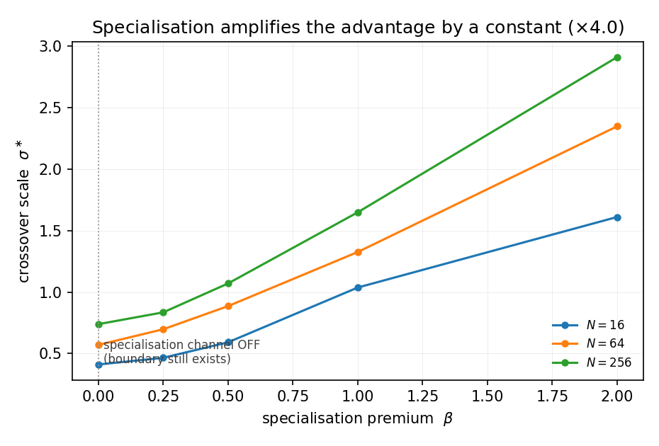

# When Do Agent Markets Beat Planners? A Boundary Law for Decentralised Allocation under Misestimated Costs and Bounded Central Attention

**Contribution level: theory + empirics.**

**Issue:** argszero/silicon-science-cs#38.

## Abstract

Agent systems increasingly choose between two ways of allocating tasks to workers: a **central
planner** that inspects what it can and assigns, and a **market** in which agents bid for tasks.
The recent demonstration that a market can beat centralised orchestration of LLM agents [105] has
made this choice urgent, but it leaves the decision rule open: *how much cost misestimation must
there be before the market wins, and what sets that threshold?* We answer with a controlled
mean-field model in which the ground truth is available by construction — the optimal assignment
is computable, so "regret" is measured against an exact oracle rather than a proxy. The planner
sees a bounded number `m` of agents per task; the market clears on bids `B = C + sigma*z` drawn
from agents' noisy cost estimates. Our main result is that the crossover is a **one-scalar
proportionality**:

> the market beats the planner exactly when `sigma > sigma*`, with `sigma* ~= A * p`, where `p`
> is the planner's own per-task allocation error and `A` is a constant.

`A` has median **2.734** over the law grid (n = 250 cells, 240 usable) and is **distribution-robust**
(uniform 2.446 / lognormal 2.496 / Beta 2.423; 3.2 % on a grid that fixes the block count) but **not
block-count invariant**: with the specialisation channel active it falls by a factor of 2.2 as `K`
goes from 2 to 8, so the law is quoted at `K` = 4 and the dependence is measured in §5.
Fitted on one grid and scored on another, the proportional law's single constant leaves a **median
relative error of 23.0 %** on unseen cells (27.0 % on the disjoint out-of-sample grid, 18.4 % there
with a weak cost-scale correction `gamma^(-0.15)` fitted on that same grid), and on that grid it beats
both the trivial constant baseline (57.6 %) and a fitted power law (28.5 %). We rule out the two
scales that intuition suggests — the cost matrix's own spread and the exact second-best assignment
gap (median error 154 % and 98 % respectively) — and show the constant is **not** an artefact of how
central attention is modelled: cells generated under a fixed-attention-*fraction* reading, never used
in fitting, are predicted by the budget-fitted constant at 12.4 % median error.

All three **registered** prior beliefs fail, each for a measured reason. P1 (the boundary moves
toward planners as the pool grows) is **refuted**: `sigma*` rises with pool size `N` in all 50
series. P2 (a parameter-free constant) is **unmet**: the constant moves with the cost scale. P3
(the advantage comes from specialisation) is **refuted by ablation**: with the specialisation channel
switched off entirely the boundary still exists, and at zero noise the market *is* the oracle. The
mechanism is **scrambling**: a fixed noise scale reshuffles a growing share of the assignment
(Hamming fraction 0.138 to 0.662 over `N` = 16 to 256 at `sigma` = 0.05) while the cost of the
reshuffle stays small, because the edges it moves are near-equal-cost. Practically, an orchestrator
that can estimate its own per-task allocation error `p` can decide centre-versus-market by testing
`sigma < 2.6 p`, that constant being the fitted law evaluated at the law grid's own cost scale, instead
of adopting either institution on principle.

## 1. Introduction

A system that owns a pool of `N` workers and a batch of tasks must decide how each task reaches a
worker. Two institutions are available. A **central planner** inspects the candidate agents for a
task, ranks them, and assigns. A **market** lets agents bid for the tasks they want; the assignment
is whatever the bids produce. The engineering literature has spent decades building the central
side — cluster schedulers with a single resource negotiator [98, 97] and low-latency probing
schedulers [96] — while the cloud-computing literature has argued, largely on vision grounds, that
market allocation is the better institution [99]. Mechanism design supplies the vocabulary for the
market side [10, 12, 13, 17, 19, 20], and the price-of-anarchy literature supplies the vocabulary
for what decentralisation costs when everyone is perfectly informed [52, 53, 56, 61].

What the literature does not supply is a *boundary*: a control variable, a threshold on it, and a
reason the threshold sits where it does. The gap is sharpened by a 2026 result that matters for
practice. "Markets, Not Planners" [105] shows a decentralised market beating centralised
orchestration of LLM agents on four task families, and its own diagnosis names the frictions it
observed (an inserted preference captures roughly twice its share; agents **misestimate their own
costs**). It reports a win at one operating point and gives no boundary in any control variable —
so a system designer who reads it learns that markets can win, but not whether *their* market will.
The classic tools cannot fill the gap, because their assumptions exclude it: mechanism design
takes truthful or known types [10, 17, 20], and price-of-anarchy bounds take a fixed, known cost
model [52, 53].

We therefore ask the boundary question directly, in the smallest setting that can answer it.

*Study question.* Given a planner whose attention is bounded and agents whose cost estimates are
noisy, what is the boundary — in the scale of that noise — between the regime where central
allocation is the better institution and the regime where the market is? What sets the threshold's
location, and what is the mechanism that produces the advantage?

Our contributions are:

**C1 — A boundary law, out of sample.** The frontier between planner and market is a one-scalar
proportionality, `sigma* ~= A * p`, where `p` is the planner's own per-task allocation error — the
quantity an operator can actually estimate — rather than any property of the cost matrix. `A` has
median 2.734 (law grid) and 2.982 by cross-scale fit (closure grid); on cells it was never fitted on
the law holds at 23.0 % median relative error on the closure grid and 27.0 % on the disjoint
out-of-sample grid (§4.2, §4.3).

**C2 — The two "physical" scales are the wrong scales.** The cost matrix's spread (`s`) and the exact
second-best assignment gap (`Delta`, computed by forbidding each optimal edge in turn) both look like
the scale that noise must overcome. Neither predicts the crossing: median error 153.9 % and 98.4 %,
with catastrophic tails (482 % and 2546 %). More parameters are not better either (§4.3, Table 4).

**C3 — The mechanism is scrambling, not specialisation.** We registered a mismatch mechanism and
killed it with a countable statistic: the market's *wrong-block* rate is **exactly 0** for
`sigma <= 0.2` at every `N` once the preference premium is at least 1. What actually happens is that
noise reshuffles a growing fraction of a *correctly blocked* assignment (Hamming fraction 0.138 to
0.662), at low cost, because the reshuffled edges are near-equal-cost (§4.5).

**C4 — Ablation instead of assertion for P3.** With the specialisation channel entirely off, the
boundary still exists (`sigma*` = 0.410 / 0.570 / 0.739 at `N` = 16 / 64 / 256); specialisation is a
roughly constant `×4` amplifier (3.93 / 4.12 / 3.94), not the source. At `sigma = 0` the market is
**exactly** the oracle, so the market's advantage is informational (§4.6).

**C5 — Three registered priors, all falsified, each with a measured reason.** We stated P1–P3 before
running anything (§3) and report the outcome for each. This is a deliberate design choice: a
boundary study whose priors all survive is a confirmation, and confirmations of plausible priors are
weak evidence. Two of our three priors were wrong, and the way they were wrong is what produced C1
and C3.

**Difference from the closest works.** Against [105] we supply the missing boundary: a control
variable (noise scale), a threshold on it, and an out-of-sample test of the functional form; we also
find that its "misestimate your own costs" diagnosis is the *right* variable while its framing as a
specialisation effect is not (C3/C4). Against the price-of-anarchy tradition [52, 53, 56] the
difference is the control variable: those bounds fix the cost model and vary the equilibrium
concept, whereas we fix the equilibrium and vary the *information* available to the allocator —
which is why their worst-case ratios do not predict our measured crossing [59, 60, 58]. Against
bounded-rationality choice models [38, 39, 45, 46, 47] we do the reverse of what that literature
must do: rather than fitting a plausible model of limited attention to observed choice, we *give*
the planner a specified attention budget and measure what it costs in allocation regret, which is
what makes a threshold comparable across institutions.

## 2. Model

### 2.1 Instance

The model is deliberately minimal, and the ground truth is available by construction: the optimal
assignment is exactly computable, so every regret below is measured against an oracle rather than
against a proxy.

- `N` agents are partitioned into `K` blocks of equal size. A block is a group of agents that are
  substitutes for one another (same specialisation).
- A task is a **task-major** row: for each task, every agent has a cost. Costs are drawn
  independently from a distribution standardised to mean 1 and a target spread. Three cost
  distributions are supported: uniform, lognormal and Beta(2,5).
- **Preference premium `beta` >= 0** makes agents inside a task's *own* block
  `(1 + beta)` cheaper than agents outside it, on average. `beta = 0` means blocks carry no
  information at all (the specialisation channel is off); large `beta` means block structure is a
  strong signal.
- **Cost scale `gamma`** multiplies the whole cost matrix. It changes the units in which regret and
  noise are expressed, and is the dimension on which P2 (below) fails.

### 2.2 The four allocators

1. **Oracle** — the exact optimal assignment (Hungarian / Jonker-Volgenant; [1, 2, 9]). Every
   regret is expressed relative to it.
2. **Random** — assign each task an agent uniformly at random. A floor, and the direct analogue of
   the "no-information" planner limit.
3. **Greedy** — each task takes the cheapest agent not yet taken, in task order. The natural
   non-optimal-but-informed baseline [42].
4. **Bounded-attention planner** — for each task, the planner inspects `m` agents drawn uniformly at
   random from the pool and assigns the cheapest one it saw, with conflicts resolved in task order.
   `m` is the attention budget: `m = N` is the full-information optimum, `m = 0` is no information.

The planner is the institution the literature builds [96, 97, 98]; the `m`-limited version is the
honest idealisation of a scheduler that cannot rank the whole pool — the regime the cost-awareness
work in LLM multi-agent systems reports as the binding constraint [117, 119, 118].

### 2.3 The market

Each agent `a` holds a **cost estimate** `C_hat(a, t) = C(a, t) + sigma * z` for the task in front of
it, with `z` a standard normal draw. The market clears by awarding each task to the lowest bid, with
conflicts resolved in task order; a task whose winner is already taken goes to the next-lowest bid.

`sigma` is the **control variable of this paper**. `sigma = 0` means perfect estimates and the market
reproduces the oracle exactly; larger `sigma` means agents bid on worse information about their own
costs — exactly the friction [105] observes.

### 2.4 Regret

For allocator `X`, `regret(X) = (cost(X) - cost(oracle)) / cost(oracle)`, averaged over seeds. The
planner's error is also reported **per task**, `p = planner_regret_per_task`, which is the quantity
that will turn out to set the boundary.

### 2.5 Reductions and anchors (the model is checked before it is used)

Before reporting any result we check that the model degenerates as it must. The canonical runner
asserts **270 reduction cells** and they are exact in every one (Table 1):

**Table 1 — the model is checked before it is used: the reductions that must hold.**

| reduction | expected | observed |
|---|---|---|
| attention unbounded (`m = N`) | planner == oracle | True, 270/270 |
| no noise (`sigma = 0`) | market == oracle | True, 270/270 |

Turning to behavioural anchors, all of the following hold: regrets are non-negative everywhere; the
market's regret is non-decreasing in `sigma` and exactly zero at `sigma = 0`; the planner's regret is
non-increasing in `m` and exact at `m = N`; and greedy is never worse than random
(rate 1.00 over the bracketing cells). These are not claims about the world; they are the checks that
make the subsequent claims about the world worth reading.

## 3. Study question and registered prior beliefs

Before any result was computed, and before the issue was registered, three falsifiable priors were
recorded (issue #38, "Prior beliefs"). They are reproduced here verbatim in substance, together with
the theory that anchored each.

**P1 — The boundary moves toward the planner as the pool grows.** *Prediction:* for a fixed attention
**fraction**, `sigma*` decreases as `N` grows. *Anchor:* a planner that inspects a fixed fraction of
a growing pool is more likely to have seen the block it needs, so allocation error `p` falls with
`N`; if the market's per-bid error tax does not fall as fast, the market's advantage should shrink
with scale. This is the prior that motivated the study.

**P2 — The constant is a constant.** *Prediction:* `sigma*` is proportional to the planner's
per-task error with a coefficient that is a property of the mechanism alone — parameter-free across
cost scales, premiums and pool sizes; equivalently, the market's per-bid tax is approximately
`N`-invariant.

**P3 — The advantage is specialisation.** *Prediction:* the market wins because the *winner's curse*
bites differently across specialisms — agents misjudge their fit for the task, so a noise-perturbed
market mis-allocates tasks to the wrong block, and that mismatch is where its advantage over a
planner (which ranks within the block it can see) lives.

All three were registered with the expectation that they would hold. Two of them are wrong, and the
way in which they are wrong is the paper's content (§4.1, §4.2, §4.5, §4.6).

## 4. Results

### 4.1 P1 is refuted: the boundary moves *away* from the planner as the pool grows

The registered prediction was that a fixed attention fraction becomes more informative as the pool
grows, so the market's edge should shrink with `N`. The opposite happens, in every series.

Over the law grid (250 cells, 240 usable: 2 cost scales × 5 premiums × 5 attention budgets × 5 pool
sizes × 30 seed streams) we track `sigma*(N)` within each (gamma, beta, m) series (Table 2):

**Table 2 — `sigma*(N)` against pool size, counted over the 50 law-grid series.**

| quantity | value |
|---|---|
| series examined | 50 |
| series whose endpoint rises | **50** |
| series whose endpoint falls | **0** |
| series strictly decreasing throughout | **0** |
| adjacent steps examined | 190 |
| steps that are non-negative | 173 |
| steps that are negative (small local dips) | 17 |

We report the 17 negative steps rather than rounding them away: `sigma*(N)` is *not* monotone step by
step — it can dip — but no series ends below where it started, and none decreases monotonically.
P1's prediction (a falling boundary) is falsified in 50/50 series.

The reason is visible in the same artefact and is the seed of the paper's main result. The planner's
per-task error `p` does rise with `N` — for gamma = 1, beta = 2, m = 4 it goes 0.704, 0.903, 0.957,
1.001, 1.078 at `N` = 16 ... 256 — but it **saturates** toward the no-information limit (random
assignment is worth 0.573 regret per task at `N` = 64). The market's per-bid error also rises with
`N`, which is precisely the premise P2 asserts is false (§4.2). The boundary therefore drifts *up*:
both allocators degrade with scale, the planner's degradation is bounded by the random-assignment
limit, and the market starts from a better position.

This is where the registered priors begin to pay. A study that had not written P1 down would have
reported "the boundary rises with `N`" as a finding. It is instead an error we can attribute.

### 4.2 The boundary is a one-scalar proportionality

If `p` (the planner's per-task allocation error) is the variable that moves, the natural question is
whether `sigma*` is a function of `p` alone. It very nearly is.

Regressing `log sigma*` on `log p` over the 240 usable cells gives an exponent of **1.0358** with
**R^2 = 0.9176**. Two things about that fit matter, and both are cautions rather than
achievements.

First, **an in-sample R^2 of 0.92 with roughly 30 % residual scatter is not evidence of a power law**.
A power law fitted with a single value of a dimension is unidentifiable, and our first fit was:
restricting the training set to one cost scale made `numpy.polyfit` pass through a single point and
emit `RankWarning: Polyfit may be poorly conditioned`. The warning was the only signal that the
"law" was an artefact of the training set.

Second, therefore, the form must be raced against trivial alternatives on cells it has never seen.
We fit on one grid and score on another: 240 training cells, 120 held-out cells with unseen cost
scales (gamma = 0.5 interpolation, gamma = 2.0 extrapolation), unseen premiums
(beta in {0.1, 0.75, 1.5, 3.0}), unseen attention budgets (`m` in {3, 6, 12}), unseen pool sizes
(`N` in {24, 48, 96, 192, 384}) and different seed streams.

**Table 3 — the law raced against trivial alternatives on held-out cells.**

| predictor | parameters | median rel. error | max |
|---|---|---|---|
| gamma-aware proportional, `sigma* = c * gamma^a * p` | 2 | **18.4 %** | 72.9 % |
| trivial proportional, `sigma* = c * p` | 1 | **27.0 %** | 84.2 % |
| fitted power law, `sigma* = c * p^b` | 2 | 28.5 % | 88.6 % |
| constant, `sigma* = c` | 1 | 57.6 % | 805.9 % |

The power law loses to the trivial proportional law out of sample (Table 3), and its exponent refit
on the held-out grid is **0.9773** — a drift of **-0.0585** from the pooled value. **The exponent is
1.** Everything the power law appeared to add was overfitting. What survives is a proportionality
whose constant depends weakly on the cost scale (Figure 1). Two held-out fits give it, and they are
quoted separately because they are fitted on different grids: the gamma-aware fit that the 18.4 %
row comes from is `A(gamma) ~= 2.62 * gamma^(-0.145)`, while fitting the closure medians over the
same four scales gives `2.54 * gamma^(-0.092)`. The same data fitted parameter-free reaches 27.0 %
median error, i.e. the cost-scale correction is worth about 9 percentage points and no more.

### 4.3 What the constant is — and what it is not

A proportionality with an unexplained constant is a correlation. So we asked what `A` is, using a
closure grid in which **nothing is ever fitted on the cells it is scored on**: 48 training cells
(gamma in {0.25, 0.5}), 48 test cells (gamma in {1.0, 2.0}, both extrapolations), and 16 robustness
cells (lognormal and Beta cost distributions, `K` in {2, 8}).

**Table 4 — candidate predictors of the boundary, scored on unseen cells.**

| predictor | fitted parameters | median rel. error | max |
|---|---|---|---|
| `sigma* = c * gamma^a * p` (H-gamma) | 2 | **14.2 %** | 46.6 % |
| `sigma* = c * p` (H-const) | 1 | **23.0 %** | 79.5 % |
| `sigma* = c * (1 + beta)^d * p` (H-beta) | 2 | 30.9 % | 94.0 % |
| `sigma* = c * sqrt(p * Delta)` (H-gap2) | 1 | 65.4 % | 411.7 % |
| `sigma* = c * Delta` (H-gap) | 1 | 98.4 % | 2546.3 % |
| `sigma* = c * p * s` (H-scale) | 1 | 153.9 % | 482.3 % |

where `Delta` is the **exact assignment gap** — the second-best assignment cost minus the optimum,
computed by forbidding each optimal edge in turn — and `s = std(C)` is the cost matrix's spread.
Both are the quantities one would name if asked "what scale must the noise overcome?" Both are
**wrong**: the gap form is off by a factor of ~100 % at the median and is catastrophic in the tail,
and multiplying by the cost spread is worse still. The planner's own error is the right variable, and
a single constant gets within 23.0 % of the boundary on cells it never saw. Note also that **more
parameters are not better**: H-beta adds a parameter and loses 8 points.

**A is stable where it should be and reported honestly where it is not (Table 5).**

**Table 5 — the fitted constant `A` across the four cost scales (closure grid).**

| cost scale gamma | 0.25 | 0.5 | 1.0 | 2.0 |
|---|---|---|---|---|
| median A (closure grid) | 2.904 | 2.686 | 2.548 | 2.388 |

An 8× range of cost scale moves `A` by 18 %; the dependence is monotone but weak, and it survives
restricting to `p >= 0.05`, so it is not a small-`p` artefact. Across cost distributions standardised
to the same mean and spread, `A` moves by less than 3 % (uniform 2.446, lognormal 2.496, Beta 2.423)
and the fitted exponent stays near 1 (uniform 1.006 / 0.998 / 0.971 at gamma = 0.5 / 1 / 2;
lognormal 0.933; Beta 0.868). Those three numbers are not de-confounded: the uniform value is
measured at `K` = 4 while the lognormal and Beta values are pooled over `K` in {2, 8}. Repeating the
comparison on a grid where `K` is swept at a fixed distribution and a fixed cost scale gives
2.457 / 2.501 / 2.423 at `K` = 4 — a 3.2 % spread — so the distribution conclusion does not rest on
the block count. The block count does move `A`, and §5 reports by how much.

**The residual is not white, and we report where it lives.** By attention budget on the law grid
(median [min, max], Table 6):

**Table 6 — where the residual lives: `A` by attention budget, median with its range.**

| attention budget `m` | 1 | 2 | 4 | 8 | 16 |
|---|---|---|---|---|---|
| median A | 3.997 | 2.777 | 2.388 | 2.513 | 2.531 |
| range | [2.96, 5.57] | [2.08, 4.05] | [1.83, 3.71] | [1.66, 13.57] | [1.61, 8.13] |

`A` is about 60 % higher at `m = 1` than at `m = 4`, and the extremes (up to A = 13.749) all sit in
the high-premium, small-pool, half-attention corner (beta = 2, `N` = 16, `m` = 8, planner per-task
error 0.063 — a *very* well-informed planner). Restricting to `p >= 0.2` cuts the spread of `A` from
×8.42 to **×3.37** (n = 157). The law is therefore tightest exactly where the planner is genuinely
information-limited, and should not be quoted as a precision instrument at tiny `p`.

### 4.4 The law does not depend on how attention is modelled

The model has an ambiguity we flagged early: is "bounded attention" a fixed **budget** `m` (the
planner inspects `m` agents per task, whatever the pool size) or a fixed **fraction** `alpha`
(`m = round(alpha * N)`)? The two readings give boundary trajectories of opposite slope — the budget
reading is what produced P1's refutation in §4.1 — so if the *law* depended on the reading, the
paper's main claim would be an artefact of a modelling choice.

It does not. We generated 12 cells under the **fraction** reading
(`m = round(alpha * N)`, alpha in {0.0625, 0.25}, gamma = 1.0, beta in {0, 0.5, 2},
`N` in {32, 128}). They were **never used in fitting**. Scored with the constant fitted on
budget-reading cells only (c = 2.507 for that cost scale):

- **median relative error 12.4 %**, maximum 49.9 % — as good as the budget cells' own 15.3 %, and
  better than the cross-cost-scale constant (33.7 %) applied to the same cells;
- the implied `A` values are 2.41, 2.45, 2.05, 1.67, 2.19, 2.54, 2.16, 2.28, 1.80, 2.01, 2.56, 2.49
  — **median 2.232**, i.e. the same constant, with a *tighter* spread (×1.53) than the budget cells.

So the attention-model ambiguity changes the **trajectory** a system traces through (N, sigma) space,
not the **form** of the boundary. A system that reads attention as a fraction and one that reads it as
a budget will cross the boundary at different pool sizes, but both cross where `sigma ~= 2.5 p`. This
is what converts an open sensitivity into a result.

### 4.5 The mechanism is scrambling, not specialisation

We registered a mechanism (P3): noise makes agents misjudge their fit, the market assigns tasks to
the wrong block, and that mismatch is the advantage. The mechanism has a countable signature — the
rate at which the market's assignment puts an agent in a different block from the oracle's — so it
can be killed, and it was (Table 7).

**Table 7 — the P3 signature: the market's wrong-block rate at `sigma` = 0.2, by premium and `N`.**

| preference premium beta (sigma = 0.2, gamma = 1) | `N` = 16 | 64 | 256 |
|---|---|---|---|
| 0.0 | 0.748 | 0.733 | 0.746 |
| 0.25 | 0.448 | 0.296 | 0.186 |
| 0.5 | 0.178 | 0.046 | 0.008 |
| **1.0** | **0.000** | **0.000** | **0.000** |
| **2.0** | **0.000** | **0.000** | **0.000** |

Once the premium is at least 1, **the market's wrong-block rate is exactly 0 at every pool size for
sigma <= 0.2**. The market never assigns outside the correct block; the mismatch channel P3 named
simply does not fire in the regime where the boundary is measured. (At beta = 0 the rate is ~0.74 at
every `N` — but with no premium there is no "correct block" to be wrong about, so that cell is
degenerate, not evidence.)

What the market *does* do is **scramble a correctly blocked assignment** (Table 8):

**Table 8 — the operative mechanism: the market-vs-oracle Hamming fraction against pool size.**

| market-vs-oracle Hamming fraction (gamma = 1, beta = 0.5, sigma = 0.05) | `N` = 16 | 32 | 64 | 128 | 256 |
|---|---|---|---|---|---|
| fraction of assignment differing from the oracle | 0.138 | 0.237 | 0.339 | 0.483 | 0.662 |

A *fixed* noise scale reshuffles a *growing* share of a growing assignment (Figure 2, left panel),
while its cost grows only modestly — because the edges noise moves are near-equal-cost. That is the
operative mechanism, and it is a different object from the one we registered. The planner shows the
same signature (Hamming 0.906 to 0.993 at `m` = 1), which is why the two institutions' relative
performance is stable even though both degrade (Figure 2, right panel).

One more object lesson: the **oracle is not mismatch-free at the smallest pool**. With `K` = 4 blocks
and `N` = 16 there are 4 agents per block and 4 tasks, so a same-block matching forces *every* pair;
mismatch is then genuinely optimal and the oracle's own mismatch rate is 0.0594 — exactly 0 for
`N >= 32`. A "sanity" diagnostic that assumes the oracle never mismatches would have reported a bug
in a correct simulation. When a sanity check fails, the first question is whether the instrument or
the assumption is wrong.

### 4.6 P3 is refuted by ablation: the boundary survives with specialisation off

The mechanism claim can be tested more directly than by its signature: switch the channel off and
see whether the boundary is still there. Setting `beta = 0` removes the specialisation channel
entirely (there is no block structure for an agent to be right or wrong about), and the boundary
remains (Table 9):

**Table 9 — the ablation: `sigma*` with the specialisation channel switched off.**

| specialisation off (beta = 0, gamma = 1, m = 4) | `N` = 16 | 64 | 256 |
|---|---|---|---|
| sigma* | 0.410 | 0.570 | 0.739 |

Specialisation is therefore an **amplifier, not a source**. Comparing beta = 2.0 against beta = 0 at
the same `N` gives an amplification factor of 3.93 / 4.12 / 3.94 at `N` = 16 / 64 / 256 — a roughly
constant ×4 across a 16× range of pool size (Figure 3), which is the signature of a multiplier
rather than a mechanism. The factor is not an artefact of the degenerate `beta` = 0 baseline:
against non-degenerate baselines on the same cells it is 3.47 / 3.37 / 3.49 for `beta` = 2.0 over
`beta` = 0.25, and 2.73 / 2.65 / 2.72 for `beta` = 2.0 over `beta` = 0.5, at `N` = 16 / 64 / 256.
The multiplier shrinks as the contrast shrinks and is stable in `N` at every contrast. (The ablation
grid runs at `gamma` = 1 and `K` = 4; the cost scale and the block count both move `A` and neither
is varied there, so the factor is stated at one cost scale and one block count — §5 measures the
block count.) And the ablation has a closed end: at `sigma = 0` the market's regret is **exactly 0**
— it *is* the oracle — so the market's advantage is informational. The advantage is not that the
market allocates more cleverly; it is that a planner with `m < N` is discarding information that the
market's agents already hold.

That reframes the practical question. "Should we use a market?" becomes "how much of the information
the agents already have can the planner see, and how noisy are the agents' own estimates?" — which is
exactly the two-variable statement in the abstract (falsifiable output for a designer: if you can put
numbers on `sigma` and `p`, you can decide which institution to run, rather than adopting one on
principle).

### 4.7 Baselines

The planner and the market are not compared only to each other. On the same instances the canonical
runner reports: random assignment (the no-information planner limit) at 0.509 / 0.567 / 0.573 /
0.599 / 0.614 regret per task for `N` = 16 ... 256; greedy at or below random in
**100 % of bracketing cells** (45 such cells); the nested planner curve at `N` = 64 falling
monotonically from 36.29 (m = 0) to 0.0 (m = N = 64); and the market curve at `N` = 64 rising from
0.0 (sigma = 0) through 0.056 (0.01), 0.246 (0.02), 0.996 (0.05), 2.343 (0.1), 5.641 (0.2), 13.810
(0.4) to 23.498 (0.8). The planner's curve is the baseline a reviewer should ask for and it is
computed, not assumed: at full attention it is exactly optimal, and at zero attention it is *worse*
than the market by construction.

## 5. Sensitivity and robustness

- **Cost distribution.** Standardised to the same mean and spread: `A` moves < 3 % across uniform,
  lognormal and Beta(2,5) (§4.3). Re-measured on a grid that fixes the block count the spread is 3.2 %
  (2.457 / 2.501 / 2.423 at `K` = 4), so the comparison is not an artefact of the closure robustness
  cells mixing `K` with the distribution.
- **Block count.** Measured, not assumed, and it **does not** support invariance. At `beta` = 0 the
  specialisation channel is off and `K` is inert: `K` in {2, 4, 8} give identical `A`, the maximum
  spread across 3 distributions and 2 pool sizes being exactly 0.0. At `beta` = 2, `gamma` = 1,
  `m` = 4 the median `A` is 3.877 / 2.447 / 1.748 at `K` = 2 / 4 / 8 — monotone in `K`, a factor of
  2.2 across that range. The law is therefore quoted at a fixed `K` = 4 and the block count is a third
  dial rather than a robustness axis; the constant fitted at `K` = 4 is scored on the same 12-cell
  grid per `K`, giving 23.0 % median relative error at `K` = 4 and at `K` = 2, and 38.2 % at `K` = 8.
- **Attention model.** Both the budget and the fraction readings are scored, and the fraction cells
  are never fitted (§4.4).
- **Seed streams.** Every reported cell aggregates 30 independent instance/noise seed pairs (20 on the
  OOS grid, 25 on the ablation grid, 15 on the closure grid), with an explicit seed scheme
  (instance seed `1000*s + N`, noise seed `7*s + 3`, and a disjoint scheme for the held-out grid).
  The held-out grid deliberately uses different seed streams from the training grid, so §4.2's
  comparison cannot be won by reusing noise.
- **Run-level reproducibility.** The canonical artefact was regenerated from scratch and is
  **byte-identical** (sha256 `4935c409...`, §8); the reductions were re-checked in the final round
  (270/270 exact).

## 6. Threats to validity

**It is a model, not a production system.** All results are from a synthetic mean-field simulator.
Costs are drawn from a specified distribution, the market clears by a specified rule, and the planner
is a specified sampling procedure. No claim here is a claim about a deployed orchestrator. What the
model buys is ground truth: the oracle assignment is exact, so regret is measured rather than
proxied, and the "physical" candidate scales (`Delta`, `s`) could be computed exactly instead of
estimated — which is how §4.3 could rule them out rather than merely rank them.

**The law is stated at ~20 % precision, not as a closed form.** `A` is a fitted constant with a weak
cost-scale dependence; the residual concentrates at very small planner error (§4.3). A practitioner
should read `sigma* ~= 2.6 p` — the fitted constant at `gamma` = 1, against a law-grid median of
2.734 — as a first-order decision rule with a ~×3.4 band, not as a three-significant-figure constant.

**The market rule is one of many.** We model a first-price-ish clear-on-bids market with recomputed
bids; we do not model strategic bidding equilibrium, repeated interaction, or rich message spaces
[36, 37]. If the market's strategic equilibrium differs from the mechanical clearing rule, the
constant moves; the *form* of the law could in principle change with it, and that is untested here.
This is the single largest gap between this paper and a mechanism-design result.

**Prior failure is evidence but not proof of generality.** Two of three registered priors failed.
That is informative — it locates the real control variable — but it also means our own intuitions
about this system were poor, so the parts of the model we did *not* sweep (task-major cost structure,
conflict resolution order, block symmetry) are candidates for the same kind of surprise.

**Why it is still worth publishing.** The paper's claims are of the kind that survive being wrong in
the details: "the boundary is set by the allocator's own error, not by properties of the instance"
is falsifiable, was tested out of sample, and defeated two plausible alternatives (`Delta`, `s`) that
the literature would otherwise have kept assuming. It also makes three registered predictions
falsifiable in public, and two of them failed — the record of *how* they failed is what tells a
designer to measure `p` rather than to reason from a specialisation story.

## 7. Related work

We group the relevant literature into ten clusters and state, for each, the specific difference from
this paper rather than a generic contrast. Reference numbers follow §9.

**7.1 Assignment and combinatorial-assignment solvers.** The exact solver we use as the oracle is
classical [1, 2, 9]. The modern literature makes it faster — new auction-style algorithms [3],
numerical revisits of the auction algorithm [4], neural warm starts [6] — or applies it
[5, 7, 8]. All of it is about *solving* an assignment problem better. Our subject is not the solver
but the institution: the same optimal assignment is the ground truth in every cell, and the question
is which allocator approaches it when information is imperfect. Sensitivity analysis of the
assignment problem [5] perturbs the input matrix; we perturb the *agents' knowledge* of it, which is
a different object — an agent that misreads its own cost is not a matrix with perturbed entries.

**7.2 Auctions and mechanism design.** The tradition begins with sealed-tender analysis [10],
continues through laboratory comparisons of double auctions against sealed bid-offer institutions
[11], and includes the common-value bidding framework [17, 18], and continues into optimal auction
design [12, 13, 16], matching and the core [14, 15], and information asymmetry [16]. Its central
assumption is the one we relax: either types are known or revelation is truthful along the
equilibrium path [19, 20]. Contract-net allocation [20] is the direct ancestor of our market rule —
announce, bid, award — but it is never swept in estimation error, so it cannot say where it stops
beating a central allocator. Recent work learns mechanisms end-to-end [22], proves regret bounds for
an auction designer who knows the bid distribution [23], and studies revenue under imprecise
distributions [24] — the closest in spirit to misestimation, but scored in revenue rather than
allocation regret. Strategyproofness results [21] are about incentives, not accuracy.

**7.3 Decentralised and market-based multi-agent allocation.** A large robotics and distributed-AI
literature builds auction- and consensus-based task allocation [25, 26, 27, 28, 29], increasingly
with learned bidding [30] or selective cost estimation [31]. Two recurring features separate it from
this paper: the allocator's cost model is assumed exact when the channel that would make it inexact
is *learned away* [30], and performance is reported at a single operating point rather than as a
function of a control variable. The contract-net line [32, 33, 34] and market-based schemes in
sensor networks [35] share the same structure. Equilibrium-computation work on fair division [36]
presumes fully known utilities, which is exactly the assumption we vary, and coordination-free
learning in matching markets [37] converges under a known preference structure.

**7.4 Bounded rationality, attention limits and estimation error.** The idea that decision capacity
is finite starts with satisficing [38] and continues as rational inattention with an entropy cost
[39, 46], semi-bounded rationality [40], information-theoretic bounded rationality [41], and a
critical literature on when satisficing search harms performance [42, 43, 44]. Behavioural work
establishes that limited-attention choice models are hard to distinguish from one another [45], that
games with rationally inattentive players admit robust predictions [47], and that attention is a
scarce resource contested in markets and media [48, 49]. The psychology of attention [50, 51] gives
the construct but not a parametric cost. We do the reverse of what this literature must do: instead
of fitting a plausible attention model to observed choice, we *give* the allocator a specified
attention budget and measure the resulting allocation regret against an exact oracle. That reversal
is what makes a threshold comparable across institutions — a fitted attention model has no units in
which a market's noise could be compared.

**7.5 Congestion, the price of anarchy and selfish routing.** The standard framing for "what does
decentralisation cost" is the price of anarchy [52, 53, 56] and its many refinements: exact values
for restricted games [55], robustness to payoff perturbation [54], altruistic preferences [57],
bottleneck and routing variants [59, 60, 61], and warnings that minimising the ratio can backfire
[58]. Complexity results for equilibrium computation [62] bound what can be computed at all. These
results fix a *known* cost model and vary the equilibrium concept; we fix the equilibrium (mechanical
clearing by bids) and vary the *information scale*. The difference is not stylistic: their bounds are
worst-case over instances and therefore do not predict a measured crossing, and their control
variable has no counterpart to our `sigma`.

**7.6 Online matching, online allocation, bandits and regret.** A closely related literature
allocates online under uncertainty, with competitive-ratio/variance tradeoffs [63], Byzantine
robustness [64], budget constraints [65], non-stationary customers [66], bandit feedback and advice
[67, 68, 69], applications such as trial design [70] and submodular welfare [71], and methodology for
simulation-based evaluation [72, 73]. The distinction in every case is *where the uncertainty lives*:
there it is in the arrival process or the arm payoffs, and the allocator learns; here it is in the
agents' own cost estimates, and the allocator cannot learn it away. Regret analysis [74, 75] supplies
our metric; it measures regret against a fixed benchmark, whereas we measure a *difference between
two institutions*.

**7.7 Stochastic and robust optimisation.** The machinery for optimisation under uncertainty is well
developed: simheuristics [76], probabilistic constraints [77], surveys [78], contextual two-stage
methods [79], approximation algorithms [80], and the robust-optimisation line with its own failure
modes [81, 82, 83]. All of it hardens a *central* solver against uncertainty; none of it asks when to
stop using a central solver. Budgeted-uncertainty complexity [83] is the closest formal relative of
our `sigma`, but uncertainty there is an adversarial set, not an estimation error with a scale an
operator can measure.

**7.8 Phase transitions and thresholds.** Our claim that the boundary is a threshold in a control
variable is a claim of the same type as phase-transition results elsewhere in computer science and
physics: generalisation transitions in trained networks [84], transitions on graphs under noise [85],
sampling thresholds in compressed sensing [86], stability transitions in distributed control with
multiplicative noise [87], and spectral thresholds in spiked models [88]. The one closest in form
[87] is a stability transition under multiplicative noise; ours is a *relative-performance* transition
between two institutions. Allocation-pattern studies in infrastructure networks [89] show
topology-driven allocation without agents or misestimation.

**7.9 Systems, market microstructure and agent-based simulation.** Deployment-side evidence for
central schedulers is strong [96, 97, 98] and the market-oriented vision has been argued for
decades [99]; auction mechanisms have been proposed for cloud and mobile-cloud allocation [100] and
proven properties obtained for provisioning [101], with decentralised designs for fleets and compute
continua [102, 103]. What is missing there is a regime map: deployments report ceilings and quotas
[97], not the cost of misestimation. Agent-based simulation is the natural instrument for regime maps
[90], and it has been used for fee design [91], market-maker participation [92], policy instruments
[93], mechanism behaviour with human participants [94] and cloud spot pricing [95]. Our simulator is
in that family; the difference is that the deliverable is a boundary rather than a scenario study,
and the ground truth is exact. Language models as auction participants [104] study bidder behaviour
rather than allocator choice.

**7.10 LLM-agent markets, orchestration and routing.** The anchor for this paper is a 2026 result
showing a market beating centralised orchestration of LLM agents on four task families [105]; it
reports a win and names the frictions (inserted preference share; agents misestimating their own
costs) but gives no boundary in any control variable. Around it, benchmark and behavioural work
measures LLM agents in competitive market ecologies [106], under information asymmetry [107],
against exploitation [108], under collusion-inducing prompt optimisation [109], and observes price
dynamics [112, 113]. A policy literature argues for agent economies [110, 111] and for market design
as an alignment layer [114], and frameworks formalise resource-bounded agents [115]. Orchestration
work measures multi-agent frameworks [117], routes on quality-cost tradeoffs [118, 119, 124, 125],
aggregates orchestration traces by reinforcement learning [119] and catalogues architectures [116,
122]. Provider-side mechanism work for LLMs [123] and market-making framings [120] and decentralised
coordination schemes [121] share the market-side assumption. The gap this paper fills is uniform
across the cluster: these works either demonstrate a market win at one operating point or design a
market, while none supplies the control variable, the threshold, or the mechanism for **when** the
market should be used at all. Our contribution is deliberately positioned as the boundary law that
[105] presupposes, tested out of sample and with two candidate scales ruled out.

## 8. Reproducibility

Everything reported here is regenerated from the committed package with one command, and the
artefact carries no wall-clock or environment fields, so a rerun is byte-identical.

- **Package root:** `papers/issue-38/` (the directory containing this manuscript).
- **One command:** `bash reproduce.sh` — runs the canonical runner, regenerates the figures, and
  validates the artefact.
- **Artefact:** `canonical_results.json`, sha256
  `4935c409ecec4fda70f4b5f573a879eded4fd6055623e16ba4439c799fbb4807` (byte-identical across
  repeated runs; verified in this round). This revision adds one artefact block — the block-count
  grid of §5 — and **changes no field that was already there**: the 178 pre-existing leaf fields are
  unchanged and 33 are added.
- **Figures.** Figure 1 (§4.2), Figure 2 (§4.5) and Figure 3 (§4.6) are shown in the body where
  their claims are made; they are regenerated by `make_figures.py` and their digests are recorded in
  `figures/manifest.json`.
- **Validation:** `validate.py` asserts the reductions (270 cells), the anchors, the §4.1 series
  counts, the §4.2 out-of-sample table, the §4.3 closure table, the §4.4 attention-model test, the
  §4.5 mechanism rates and the §4.6 ablation — each assertion tied to a headline number above. It
  also binds the numbers quoted in the abstract, and the §5 block-count and §4.6 amplification
  numbers, to the artefact fields they come from, reading the value out of the manuscript itself, so
  a number that drifts out of the artefact fails here rather than in a review. It
  prints `VALIDATE n/n`; the run is deterministic (`VALIDATE` has no tolerance because every
  quantity is a deterministic function of the seed scheme).
- **Run log:** `run.log` records the configuration, the reductions, the anchors, the law-grid
  summary, the fit, the out-of-sample comparison, the closure table, the mechanism rates and the
  ablation verdict.
- **Seeds:** instance seed `1000*s + N`, noise seed `7*s + 3` on the law/mechanism/closure grids;
  `5000*s + 7*N` and `13*s + 11` on the held-out grid. `s` runs to the per-grid seed count (30 / 20
  / 25 / 15).
- **Runtimes** are machine-dependent and therefore not part of any claim; the runner is CPU-only and
  the whole package is a few minutes.

**References.**

## 9. References

One entry, **[51]**, is printed without an author: no reachable record carries one for its DOI
(Crossref has none, OpenAlex reports no authorships, and the publisher's landing page refuses
automated access). The obstacle is stated on the issue thread rather than filled in by guesswork. The
Kahneman attribution on that entry's `Difference:` line is our judgement about the work, not a field of
any record; the entry's author field is absent because no record supplies one, and the two statements
are about different objects.

[1] Bertsekas, D. (2023). New Auction Algorithms for the Assignment Problem and Extensions. arXiv
    preprint arXiv:2310.03159. https://arxiv.org/abs/2310.03159
    Difference: proposes new auction algorithms for the assignment problem; we do not propose a
    solver, we characterise when a decentralised solver family beats a bounded central one
[2] Alfaro, C. A.; Perez, S. L.; Valencia, C. E.; Vargas, M. C. (2018). The equivalence between two
    classic algorithms for the assignment problem. arXiv preprint arXiv:1810.03562.
    https://arxiv.org/abs/1810.03562
    Difference: shows an equivalence between two classic assignment algorithms; a solver-internal
    result with no central-vs-decentralised comparison
[3] Khosla, M.; Anand, A. (2021). Revisiting the Auction Algorithm for Weighted Bipartite Perfect
    Matchings. arXiv preprint arXiv:2101.07155. https://arxiv.org/abs/2101.07155
    Difference: revisits convergence of the auction algorithm; no cost of misestimated costs, which
    is our crossing variable
[4] Bertsekas, D. (2020). Constrained Multiagent Rollout and Multidimensional Assignment with the
    Auction Algorithm. arXiv preprint arXiv:2002.07407. https://arxiv.org/abs/2002.07407
    Difference: applies the auction algorithm to multidimensional assignment inside a rollout
    scheme; an application of the solver, not a boundary between solver families
[5] Michael, E.; Wood, T. A.; Manzie, C.; Shames, I. (2020). Global Sensitivity Analysis for the
    Linear Assignment Problem. arXiv preprint arXiv:2005.11792. https://arxiv.org/abs/2005.11792
    Difference: global sensitivity analysis of the linear assignment problem; perturbs one input
    matrix rather than modelling agents who bid on noisy estimates of it
[6] Yavlovich, I.; Agbaria, J.; Mhamed, M.; Weinberger, N.; Yallouz, J. (2026). Learning-Augmented
    Scalable Linear Assignment Problem Optimization via Neural Dual Warm-Starts. arXiv preprint
    arXiv:2605.09382. https://arxiv.org/abs/2605.09382
    Difference: learns neural dual warm starts for the assignment problem; accelerates the central
    solver instead of asking when central allocation stops being competitive
[7] Dlask, T.; Savchynskyy, B. (2023). Relative-Interior Solution for the (Incomplete) Linear
    Assignment Problem with Applications to the Quadratic Assignment Problem. arXiv preprint
    arXiv:2301.11201. https://arxiv.org/abs/2301.11201
    Difference: an interior-point solver for incomplete assignment problems; solver quality, not an
    allocation-regime boundary
[8] Makarychev, K.; Manokaran, R.; Sviridenko, M. (2014). Maximum Quadratic Assignment Problem:
    Reduction from Maximum Label Cover and LP-based Approximation Algorithm. arXiv preprint
    arXiv:1403.7721. https://arxiv.org/abs/1403.7721
    Difference: worst-case approximation bounds for quadratic assignment; theory over adversarial
    instances, whereas our boundary is a measured response to estimation noise
[9] Alam, S. T.; Sagor, E.; Ahmed, T.; Haque, T.; Mahmud, M. S.; Ibrahim, S. (2023). Assessment of
    Assignment Problem using Hungarian Method. Proceedings of the International Conference on
    Industrial Engineering and Operations Management. https://doi.org/10.46254/au01.20220498
    Difference: surveys Hungarian-method usage in an application domain; reports solver accuracy, no
    central-vs-market comparison
[10] Vickrey, W. (1961). COUNTERSPECULATION, AUCTIONS, AND COMPETITIVE SEALED TENDERS. The Journal
    of Finance. https://doi.org/10.1111/j.1540-6261.1961.tb02789.x
    Difference: Vickrey's sealed-tender analysis; assumes truthful revelation of valuations, while
    our market bids on estimates of cost and can be wrong
[11] Williams, A. W.; Bratton, W. K.; Vannoni, M. G. (1991). Competitive Market Institutions: Double
    Auctions vs. Sealed Bid-Offer Auctions. Papers in Experimental Economics.
    https://doi.org/10.1017/cbo9780511528354.015
    Difference: compares double auctions with sealed bid-offer institutions in the laboratory; an
    institution comparison without a bounded central counterpart
[12] Skreta, V. (2008). Optimal Auction Design Under Non-Commitment. 10.2139/ssrn.1120963
    (posted-content). https://doi.org/10.2139/ssrn.1120963
    Difference: optimal auction design without commitment; revenue-theoretic, with no cost of
    misestimated values
[13] Ozbek, K. (2025). Optimal Auction Design under Costly Learning. 10.2139/ssrn.5861082
    (posted-content). https://doi.org/10.2139/ssrn.5861082
    Difference: optimal auction design when learning the distribution is costly; closest to our
    misestimation premise but measures the seller's revenue, not which allocator to run
[14] Shapley, L. S.; Shubik, M. (1971). The Assignment Game I: The Core. RAND Corporation.
    https://doi.org/10.7249/r0874
    Difference: the assignment game and its core; a cooperative solution concept with no
    attention-limited planner to compare against
[15] GALE, D.; SHAPLEY, L. (1961). COLLEGE ADMISSIONS AND THE STABILITY OF MARRIAGE.
    10.21236/ad0251958 (report). https://doi.org/10.21236/ad0251958
    Difference: deferred acceptance and stability in two-sided matching; a matching-institution
    result rather than a cost-regret boundary
[16] Stiglitz, J. E. (2013). The market for 'lemons': quality uncertainty and the market mechanism.
    Market Failure or Success. https://doi.org/10.4337/9781781950005.00012
    Difference: information asymmetry between market participants; motivates why bids are noisy but
    says nothing about how much noise flips the allocator choice
[17] Milgrom, P. R.; Weber, R. J. (1982). A Theory of Auctions and Competitive Bidding.
    Econometrica. https://doi.org/10.2307/1911865
    Difference: the common-value bidding framework in which estimates are noisy; predicts
    overbidding, not the margin by which a market beats a planner
[18] Lee, S.; Kim, J. Y. (2022). Revisiting the convergence theorem for competitive bidding in
    common value auctions. Economic Theory Bulletin. https://doi.org/10.1007/s40505-022-00234-2
    Difference: revisits the convergence theorem for competitive bidding in common-value auctions; a
    refinement of the same theory
[19] Zhang, X. (2016). Efficient Mechanisms for Bilateral Trading with Moderately Informed Broker.
    SSRN Electronic Journal. https://doi.org/10.2139/ssrn.2753074
    Difference: efficiency of bilateral trade with an informed broker; two parties, whereas we
    compare an N-agent market against a single planner
[20] SMITH, R. G. (1988). The Contract Net Protocol: High-Level Communication and Control in a
    Distributed Problem Solver. Readings in Distributed Artificial Intelligence.
    https://doi.org/10.1016/b978-0-934613-63-7.50039-5
    Difference: the contract-net protocol, a decentralised announce-bid-award scheme and a direct
    ancestor of our market rule, but never swept in estimation noise
[21] Guo, Y.; Hao, D.; Li, B.; Xiao, M.; Khoussainov, B. (2025). Strategyproofness and Monotone
    Allocation of Auction in Social Networks. arXiv preprint arXiv:2507.14472.
    https://arxiv.org/abs/2507.14472
    Difference: strategyproofness and monotone allocation in a networked auction; incentive
    properties rather than an accuracy boundary
[22] Li, X.; Wang, Z.; Zhu, B.; He, F.; Wang, Y.; Wang, X. (2024). Deep Automated Mechanism Design
    for Integrating Ad Auction and Allocation in Feed. arXiv preprint arXiv:2401.01656.
    https://arxiv.org/abs/2401.01656
    Difference: learns an auction mechanism end-to-end for feed allocation; it optimises a mechanism
    instead of comparing it with a limited planner
[23] Wang, R.; Kocyigit, C.; Rujeerapaiboon, N. (2025). Equitable Auction Design with Provable
    Regret Guarantees. arXiv preprint arXiv:2502.08369. https://arxiv.org/abs/2502.08369
    Difference: regret guarantees for an auction designer who knows the bid distribution; our
    planner is uncertain about its own cost estimates
[24] Li, Y.; Lu, P.; Ye, H. (2019). Revenue Maximization with Imprecise Distribution. arXiv preprint
    arXiv:1903.00836. https://arxiv.org/abs/1903.00836
    Difference: revenue maximisation when the bid distribution is imprecise; closest in spirit to
    misestimation but scored in revenue, not allocation regret
[25] Wang, G.; Han, H.; Liu, X.; Jiang, H.; Zhang, M. (2025). A Group Consensus-Driven Auction
    Algorithm for Cooperative Task Allocation Among Heterogeneous Multi-Agents. arXiv preprint
    arXiv:2508.02015. https://arxiv.org/abs/2508.02015
    Difference: a consensus-plus-auction allocation algorithm for heterogeneous agents; a single
    algorithm reported at one operating point, no regime boundary
[26] Braquet, M.; Bakolas, E. (2021). Greedy Decentralized Auction-based Task Allocation for
    Multi-Agent Systems. arXiv preprint arXiv:2107.00144. https://arxiv.org/abs/2107.00144
    Difference: greedy decentralised auctions for multi-agent task allocation; performance reported
    without a noise sweep or a central baseline
[27] Dahlquist, N.; Lindqvist, B.; Saradagi, A.; Nikolakopoulos, G. (2023). Reactive Multi-agent
    Coordination using Auction-based Task Allocation and Behavior Trees. arXiv preprint
    arXiv:2304.01976. https://arxiv.org/abs/2304.01976
    Difference: auction-based allocation embedded in a behaviour-tree controller; the cost model is
    assumed exact
[28] Engelaar, M. H. W.; Zhang, Z.; Vlahakis, E. E.; Dimarogonas, D. V.; Lazar, M.; Haesaert, S.
    (2024). Risk-Aware Real-Time Task Allocation for Stochastic Multi-Agent Systems under STL
    Specifications. arXiv preprint arXiv:2404.02111. https://arxiv.org/abs/2404.02111
    Difference: risk-aware allocation under temporal-logic specifications; stochastic task
    durations, not misestimated agent costs
[29] Dahlquist, N.; Saradagi, A.; Nikolakopoulos, G. (2023). Reactive Task Allocation for Balanced
    Servicing of Multiple Task Queues. arXiv preprint arXiv:2304.02333.
    https://arxiv.org/abs/2304.02333
    Difference: reactive allocation that balances servicing across queues; a queueing objective
    rather than an allocator comparison
[30] Rodriguez, J.; Tarawneh, C.; Koenig, S.; Dong, W.; Lu, Q. (2026). Auction-Consensus Algorithm
    with Learned Bidding Scheme for Multi-Robot Systems. arXiv preprint arXiv:2605.21932.
    https://arxiv.org/abs/2605.21932
    Difference: learns the bidding scheme itself, which removes exactly the misestimation we vary
[31] Dahlquist, N.; Velhal, S.; Nikolakopoulos, G. (2026). Varying Bundle Size Reactive Multi-Task
    Assignment using Selective Cost Estimation for Multi-Agent Systems. arXiv preprint
    arXiv:2606.24462. https://arxiv.org/abs/2606.24462
    Difference: selective cost estimation for reactive multi-task assignment in robotics; the
    closest robotics work, but with no planner counterpart and no noise scale
[32] Kaur, S.; Kaur, H.; Sehra, S. K. (2013). Modification of Contract Net Protocol(CNP) : A
    Rule-Updation Approach. arXiv preprint arXiv:1312.4259. https://arxiv.org/abs/1312.4259
    Difference: modifies the contract net protocol for rule updates; protocol engineering without a
    control variable
[33] Liu, B.; Deng, M.; Wu, G.; Pei, X.; Li, H.; Pedrycz, W. (2020). Bottom-up mechanism and
    improved contract net protocol for the dynamic task planning of heterogeneous Earth observation
    resources. arXiv preprint arXiv:2007.06172. https://arxiv.org/abs/2007.06172
    Difference: improves the contract net protocol for heterogeneous Earth-observation resources; no
    allocator comparison under noise
[34] Lajili, S.; Brahmi, Z. (2026). Multi-Agent Scheduling with LLM-Assisted Contract Net
    Negotiation for Stream Processing in Mobile Edge Computing. arXiv preprint arXiv:2608.12371.
    https://arxiv.org/abs/2608.12371
    Difference: an LLM-assisted contract net for mobile edge scheduling; reports makespan at one
    configuration rather than a boundary
[35] Wang, D.; Zhang, W.; Song, B.; Du, X.; Guizani, M. (2019). Market-Based Model in CR-WSN: A
    Q-Probabilistic Multi-agent Learning Approach. arXiv preprint arXiv:1902.09687.
    https://arxiv.org/abs/1902.09687
    Difference: a market-based model for a wireless sensor network; a domain application of market
    allocation, not a boundary study
[36] Nan, T.; Gao, Y.; Kroer, C. (2023). Fast and Interpretable Dynamics for Fisher Markets via
    Block-Coordinate Updates. arXiv preprint arXiv:2303.00506. https://arxiv.org/abs/2303.00506
    Difference: computes Fisher-market equilibria quickly; the equilibrium concept presumes fully
    known utilities, which is the assumption we relax
[37] Maheshwari, C.; Mazumdar, E.; Sastry, S. (2022). Decentralized, Communication- and
    Coordination-free Learning in Structured Matching Markets. arXiv preprint arXiv:2206.02344.
    https://arxiv.org/abs/2206.02344
    Difference: coordination-free learning in structured matching markets; converges to a stable
    match under a known preference structure
[38] Simon, H. A. (1953). Behavioral Model of Rational Choice. RAND Corporation.
    https://doi.org/10.7249/p365
    Difference: Simon's behavioural model of rational choice; the origin of satisficing, stated
    qualitatively rather than as a parametric allocation error we can sweep
[39] Caplin, A.; Dean, M. (2013). Behavioral Implications of Rational Inattention with Shannon
    Entropy. 10.3386/w19318 (report). https://doi.org/10.3386/w19318
    Difference: rational inattention with a Shannon-entropy cost; supplies our information-cost
    intuition but has no competing allocator and no measured boundary
[40] Marwala, T. (2013). Semi-bounded Rationality: A model for decision making. arXiv preprint
    arXiv:1305.6037. https://arxiv.org/abs/1305.6037
    Difference: a semi-bounded rationality model for decision making; a modelling proposal without
    an allocator comparison
[41] Grau-Moya, J.; Braun, D. A. (2015). Adaptive information-theoretic bounded rational
    decision-making with parametric priors. arXiv preprint arXiv:1511.01710.
    https://arxiv.org/abs/1511.01710
    Difference: adaptive information-theoretic bounded-rational decision making; optimises a single
    decision-maker's policy rather than comparing institutions
[42] Cushing, W.; Benton, J.; Kambhampati, S. (2011). Cost Based Satisficing Search Considered
    Harmful. arXiv preprint arXiv:1103.3687. https://arxiv.org/abs/1103.3687
    Difference: shows cost-based satisficing search can be harmful; a heuristic-search result, not
    an allocation-regime boundary
[43] Wall, F. (2021). Modeling Managerial Search Behavior based on Simon's Concept of Satisficing.
    arXiv preprint arXiv:2104.14002. https://arxiv.org/abs/2104.14002
    Difference: models managerial search behaviour after Simon's satisficing; an empirical
    description with no market counterpart
[44] Brera, R.; Fu, F. (2023). The satisficing secretary problem: when closed-form solutions meet
    simulated annealing. arXiv preprint arXiv:2302.03220. https://arxiv.org/abs/2302.03220
    Difference: the satisficing secretary problem; a stopping-rule analysis, not a comparison of a
    market against a limited planner
[45] Carpentiere, D.; Petralia, A. (2025). Limited attention and models of choice: A behavioral
    equivalence. arXiv preprint arXiv:2502.14879. https://arxiv.org/abs/2502.14879
    Difference: behavioural equivalence of limited-attention choice models; shows models are hard to
    distinguish rather than measuring a performance boundary
[46] Engh, C. W. (2025). Rational Inattention to States and Choice Characteristics. arXiv preprint
    arXiv:2508.05939. https://arxiv.org/abs/2508.05939
    Difference: rational inattention to states and choice characteristics; a specification of
    preferences, with attention as an assumption not a swept variable
[47] Denti, T.; Ravid, D. (2023). Robust Predictions in Games with Rational Inattention. arXiv
    preprint arXiv:2306.09964. https://arxiv.org/abs/2306.09964
    Difference: robust predictions in games with rational inattention; an equilibrium-analysis
    result, not an allocator comparison
[48] Qiu, X.; Oliveira, D. F. M.; Shirazi, A. S.; Flammini, A.; Menczer, F. (2017). Limited
    individual attention and online virality of low-quality information. arXiv preprint
    arXiv:1701.02694. https://arxiv.org/abs/1701.02694
    Difference: limited individual attention and virality of low-quality information; attention is a
    resource consumers allocate, not an allocator's capacity
[49] Feng, L.; Hu, Y.; Li, B.; Stanley, H. E.; Havlin, S.; Braunstein, L. A. (2014). Competing for
    Attention in Social Media under Information Overload Conditions. arXiv preprint arXiv:1410.1668.
    https://arxiv.org/abs/1410.1668
    Difference: competition for attention under information overload; a social-media mechanism
    rather than an allocation-cost boundary
[50] Bruya, B.; Tang, Y. Y. (2018). Is Attention Really Effort? Revisiting Daniel Kahneman’s
    Influential 1973 Book Attention and Effort. Frontiers in Psychology.
    https://doi.org/10.3389/fpsyg.2018.01133
    Difference: reassesses whether attention is really effort in Kahneman's framework; conceptual,
    giving no parametric form we could enter into a model
[51] Author not established from the record [1997]. Selective Attention. The Psychology of
    Attention, The MIT Press. https://doi.org/10.7551/mitpress/5677.003.0005
    Difference: Kahneman's selective-attention chapter; establishes attention as a scarce resource
    but not how its scarcity costs a central allocator
[52] Roughgarden, T.; Tardos, E. (2002). How bad is selfish routing?. Proceedings 41st Annual
    Symposium on Foundations of Computer Science. https://doi.org/10.1109/sfcs.2000.892069
    Difference: the price-of-anarchy tradition: the cost of decentralisation under a fixed cost
    model, whereas our control variable is the scale of information error
[53] Kannan, R.; Busch, C.; Vasilakos, A. (2010). Polynomial Bottleneck Congestion Games with
    Optimal Price of Anarchy. arXiv preprint arXiv:1010.4812. https://arxiv.org/abs/1010.4812
    Difference: price-of-anarchy bounds for bottleneck congestion games; bounds are over worst-case
    instances with known costs
[54] Bilò, V. (2014). On the Robustness of the Approximate Price of Anarchy in Generalized
    Congestion Games. arXiv preprint arXiv:1412.0845. https://arxiv.org/abs/1412.0845
    Difference: robust approximate price of anarchy in generalised congestion games; robustness to
    perturbation of the game, not to agents' estimation error
[55] Bosse, J. V. D.; Uetz, M.; Walter, M. (2022). Exact Price of Anarchy for Weighted Congestion
    Games with Two Players. arXiv preprint arXiv:2203.01740. https://arxiv.org/abs/2203.01740
    Difference: exact price of anarchy for weighted congestion games with two players; a closed form
    at a fixed information regime
[56] Kannan, R.; Busch, C.; Spirakis, P. (2013). The Price of Anarchy is Unbounded for Congestion
    Games with Superpolynomial Latency Costs. arXiv preprint arXiv:1308.4101.
    https://arxiv.org/abs/1308.4101
    Difference: shows the price of anarchy is unbounded for superpolynomial latency costs; an
    impossibility in the worst case rather than a measured crossing
[57] Chen, P. A.; de Keijzer, B.; Kempe, D.; Schaefer, G. (2011). The Robust Price of Anarchy of
    Altruistic Games. arXiv preprint arXiv:1112.3680. https://arxiv.org/abs/1112.3680
    Difference: the robust price of anarchy of altruistic games; alters agent preferences instead of
    their information
[58] Chandan, R.; Paccagnan, D.; Marden, J. R. (2021). The Unintended Consequences of Minimizing the
    Price of Anarchy in Congestion Games. arXiv preprint arXiv:2107.06331.
    https://arxiv.org/abs/2107.06331
    Difference: unintended consequences of minimising the price of anarchy; warns that the objective
    can backfire, but keeps perfect information
[59] Scherrer, S.; Perrig, A.; Schmid, S. (2020). The Value of Information in Selfish Routing. arXiv
    preprint arXiv:2005.05191. https://arxiv.org/abs/2005.05191
    Difference: the value of information in selfish routing; information is binary (have it or not)
    rather than a continuous error scale
[60] Basu, S.; Yang, G.; Lianeas, T.; Nikolova, E.; Chen, Y. (2017). Reconciling Selfish Routing
    with Social Good. arXiv preprint arXiv:1707.00208. https://arxiv.org/abs/1707.00208
    Difference: reconciling selfish routing with social good; a policy discussion over the same
    equilibrium model
[61] Christodoulou, G.; Mehlhorn, K.; Pyrga, E. (2012). Improving the Price of Anarchy for Selfish
    Routing via Coordination Mechanisms. arXiv preprint arXiv:1202.2877.
    https://arxiv.org/abs/1202.2877
    Difference: improves the price of anarchy via coordination mechanisms; a mechanism-design fix
    rather than a boundary in a control variable
[62] Babichenko, Y.; Rubinstein, A. (2020). Settling the complexity of Nash equilibrium in
    congestion games. arXiv preprint arXiv:2012.04327. https://arxiv.org/abs/2012.04327
    Difference: the computational complexity of Nash equilibrium in congestion games; complexity,
    not allocator performance
[63] Xu, P. (2022). Exploring the Tradeoff between Competitive Ratio and Variance in Online-Matching
    Markets. arXiv preprint arXiv:2209.07580. https://arxiv.org/abs/2209.07580
    Difference: tradeoff between competitive ratio and variance in online-matching markets; a
    frontier in the algorithm's own guarantees
[64] Wang, R.; Ling, Q.; Wai, H. T.; Tian, Z. (2025). Byzantine-Resilient Decentralized Online
    Resource Allocation. arXiv preprint arXiv:2508.08658. https://arxiv.org/abs/2508.08658
    Difference: Byzantine-resilient decentralised online resource allocation; adversarial agents
    rather than honest agents with noisy estimates
[65] Ao, R.; Chen, H.; Simchi-Levi, D.; Zhu, F. (2024). Online Resource Allocation with Average
    Budget Constraints. arXiv preprint arXiv:2402.11425. https://arxiv.org/abs/2402.11425
    Difference: online resource allocation with average budget constraints; constraints on the
    allocator, not on its information
[66] Zhang, X.; Qin, H.; Chou, M. C. (2024). Online Resource Allocation with Non-Stationary
    Customers. arXiv preprint arXiv:2401.16945. https://arxiv.org/abs/2401.16945
    Difference: online allocation with non-stationary customers; non-stationarity of demand, not
    error in the allocator's cost model
[67] Lyu, L.; Cheung, W. C. (2023). Online Resource Allocation: Bandits feedback and Advice on
    Time-varying Demands. arXiv preprint arXiv:2302.04182. https://arxiv.org/abs/2302.04182
    Difference: bandit feedback with advice for time-varying demands; the learner is the allocator
    and there is no market arm
[68] Harada, T.; Ito, S.; Sumita, H. (2025). Bandit Max-Min Fair Allocation. arXiv preprint
    arXiv:2505.05169. https://arxiv.org/abs/2505.05169
    Difference: bandit max-min fair allocation; a fairness objective under bandit feedback
[69] Lim, E.; Tan, V. Y. F.; Soh, H. (2024). Stochastic Bandits for Egalitarian Assignment. arXiv
    preprint arXiv:2410.05856. https://arxiv.org/abs/2410.05856
    Difference: stochastic bandits for egalitarian assignment; fairness as the target rather than
    the allocator's regime
[70] Villar, S. S.; Bowden, J.; Wason, J. (2015). Multi-armed Bandit Models for the Optimal Design
    of Clinical Trials: Benefits and Challenges. arXiv preprint arXiv:1507.08025.
    https://arxiv.org/abs/1507.08025
    Difference: multi-armed bandits for clinical-trial design; an application in which exploration
    cost is ethical, not monetary
[71] Pokhriyal, S.; Jain, S.; Aggarwal, V. (2026). Multi-Agent Combinatorial-Multi-Armed-Bandit
    framework for the Submodular Welfare Problem under Bandit Feedback. arXiv preprint
    arXiv:2602.16183. https://arxiv.org/abs/2602.16183
    Difference: a combinatorial multi-armed-bandit framework for submodular welfare; learning the
    arms, with no competing institution
[72] Fan, W.; Hong, L. J.; Jiang, G.; Luo, J. (2024). Review of Large-Scale Simulation Optimization.
    arXiv preprint arXiv:2403.15669. https://arxiv.org/abs/2403.15669
    Difference: a review of large-scale simulation optimisation; methodology for our simulator, not
    an allocation-boundary claim
[73] Zhang, H.; Chen, H.; Zhan, D.; Zhao, H.; Lam, H.; Tang, W.; et al. (2025). SOCRATES: Simulation
    Optimization with Correlated Replicas and Adaptive Trajectory Evaluations. arXiv preprint
    arXiv:2511.00685. https://arxiv.org/abs/2511.00685
    Difference: simulation optimisation with correlated replicas; variance reduction for our
    machinery rather than a result about allocation
[74] Bubeck, S.; Perchet, V.; Rigollet, P. (2013). Bounded regret in stochastic multi-armed bandits.
    arXiv preprint arXiv:1302.1611. https://arxiv.org/abs/1302.1611
    Difference: bounded regret in stochastic bandits; regret is measured against a fixed benchmark,
    not between two institutions
[75] Bubeck, S.; Cesa-Bianchi, N. (2012). Regret Analysis of Stochastic and Nonstochastic
    Multi-armed Bandit Problems. arXiv preprint arXiv:1204.5721. https://arxiv.org/abs/1204.5721
    Difference: regret analysis of stochastic and nonstochastic bandit problems; the standard
    reference for our regret metric, with no institutional comparison
[76] Berkhout, J. (2024). A new Simheuristics procedure for stochastic combinatorial optimization.
    arXiv preprint arXiv:2408.05214. https://arxiv.org/abs/2408.05214
    Difference: a simheuristics procedure for stochastic combinatorial optimisation; a solver rather
    than a regime boundary
[77] Agrawal, S.; Saberi, A.; Ye, Y. (2008). Stochastic Combinatorial Optimization under
    Probabilistic Constraints. arXiv preprint arXiv:0809.0460. https://arxiv.org/abs/0809.0460
    Difference: stochastic combinatorial optimisation under probabilistic constraints;
    chance-constrained feasibility, not allocator comparison
[78] Le, P. (2024). A survey on combinatorial optimization. arXiv preprint arXiv:2409.00075.
    https://arxiv.org/abs/2409.00075
    Difference: a survey of combinatorial optimisation; general background, no decentralised
    alternative
[79] Bouvier, L.; Prunet, T.; Leclère, V.; Parmentier, A. (2025). Primal-dual algorithm for
    contextual stochastic combinatorial optimization. arXiv preprint arXiv:2505.04757.
    https://arxiv.org/abs/2505.04757
    Difference: primal-dual algorithms for contextual stochastic combinatorial optimisation; uses
    context to reduce uncertainty rather than varying it
[80] Ibrahimpur, S.; Swamy, C. (2020). Approximation Algorithms for Stochastic Minimum Norm
    Combinatorial Optimization. arXiv preprint arXiv:2010.05127. https://arxiv.org/abs/2010.05127
    Difference: approximation algorithms for stochastic minimum-norm combinatorial optimisation;
    worst-case guarantees under a known distribution
[81] Zhu, K.; Bertsimas, D. (2025). Overfitting in Adaptive Robust Optimization. arXiv preprint
    arXiv:2509.16451. https://arxiv.org/abs/2509.16451
    Difference: overfitting in adaptive robust optimisation; a caution about the method, not a
    boundary between institutions
[82] Hartisch, M. (2021). Adaptive Relaxations for Multistage Robust Optimization. arXiv preprint
    arXiv:2106.12858. https://arxiv.org/abs/2106.12858
    Difference: adaptive relaxations for multistage robust optimisation; the central solver becomes
    adaptive but stays central
[83] Goerigk, M.; Henke, D.; Wulf, L. (2026). The Complexity Landscape of Two-Stage Robust Selection
    Problems with Budgeted Uncertainty. arXiv preprint arXiv:2602.16465.
    https://arxiv.org/abs/2602.16465
    Difference: complexity of two-stage robust selection under budgeted uncertainty; uncertainty is
    budgeted, and no market is modelled
[84] Anagnostopoulos, S. J.; Toscano, J. D.; Stergiopulos, N.; Karniadakis, G. E. (2024). Learning
    in PINNs: Phase transition, diffusion equilibrium, and generalization. arXiv preprint
    arXiv:2403.18494. https://arxiv.org/abs/2403.18494
    Difference: phase transition in physics-informed network training; a transition in a learner's
    generalisation, not in an allocator's regime
[85] Liu, J.; Yadav, V.; Sehgal, H.; Olson, J. M.; Liu, H.; Elia, N. (2008). Phase Transitions on
    Fixed Connected Graphs and Random Graphs in the Presence of Noise. arXiv preprint
    arXiv:0808.3230. https://arxiv.org/abs/0808.3230
    Difference: phase transitions on graphs in the presence of noise; the noise is on the graph, not
    on the agents' cost estimates
[86] Wu, Y.; Verdú, S. (2011). Optimal Phase Transitions in Compressed Sensing. arXiv preprint
    arXiv:1111.6822. https://arxiv.org/abs/1111.6822
    Difference: optimal phase transitions in compressed sensing; a sampling-rate threshold, a
    different control variable
[87] Allegra, N.; Bamieh, B.; Mitra, P. P.; Sire, C. (2016). Phase transitions in distributed
    control systems with multiplicative noise. arXiv preprint arXiv:1610.00653.
    https://arxiv.org/abs/1610.00653
    Difference: phase transitions in distributed control with multiplicative noise; closest in form,
    but the transition is in stability rather than allocation cost
[88] Mergny, P.; Ko, J.; Krzakala, F. (2024). Spectral Phase Transition and Optimal PCA in
    Block-Structured Spiked models. arXiv preprint arXiv:2403.03695.
    https://arxiv.org/abs/2403.03695
    Difference: spectral phase transition in block-structured spiked models; a statistical-physics
    threshold with no economic mechanism
[89] Kim, D. H.; Motter, A. E. (2008). Resource allocation pattern in infrastructure networks. arXiv
    preprint arXiv:0801.1877. https://arxiv.org/abs/0801.1877
    Difference: resource-allocation patterns in infrastructure networks; topology-driven allocation,
    no agents and no misestimation
[90] Belcak, P.; Calliess, J. P.; Zohren, S. (2020). Fast Agent-Based Simulation Framework with
    Applications to Reinforcement Learning and the Study of Trading Latency Effects. arXiv preprint
    arXiv:2008.07871. https://arxiv.org/abs/2008.07871
    Difference: an agent-based simulation framework for trading latency; a testbed rather than a
    boundary claim
[91] Yagi, I.; Hoshino, M.; Mizuta, T. (2020). Analysis of the impact of maker-taker fees on the
    stock market using agent-based simulation. arXiv preprint arXiv:2010.08992.
    https://arxiv.org/abs/2010.08992
    Difference: analyses maker-taker fees with an agent-based simulation; a fee-design question at a
    fixed information regime
[92] Zhou, C. (2024). The Impact of Designated Market Makers on Market Liquidity and Competition: A
    Simulation Approach. arXiv preprint arXiv:2409.16589. https://arxiv.org/abs/2409.16589
    Difference: designated market makers, liquidity and competition in simulation;
    market-microstructure policy rather than allocator choice
[93] Liu, R.; Argyros, D.; Jiang, Y.; Ben-Akiva, M. E.; Seshadri, R.; Azevedo, C. L. (2025).
    Assessing the impacts of tradable credit schemes through agent-based simulation. arXiv preprint
    arXiv:2502.11822. https://arxiv.org/abs/2502.11822
    Difference: tradable credit schemes assessed by agent-based simulation; a policy instrument
    evaluated in one domain
[94] Kayongo, P.; Hullman, J.; Hartline, J. (2025). Behavioral Study of Dashboard Mechanisms. arXiv
    preprint arXiv:2507.20985. https://arxiv.org/abs/2507.20985
    Difference: a behavioural study of dashboard mechanisms; asks how humans behave in a mechanism,
    not how much noise a market tolerates
[95] Li, Z.; Zhang, H.; O&#39;Brien, L.; Jiang, S.; Zhou, Y.; Kihl, M.; et al. (2017). Spot Pricing
    in the Cloud Ecosystem: A Comparative Investigation. arXiv preprint arXiv:1708.01401.
    https://arxiv.org/abs/1708.01401
    Difference: compares spot pricing in cloud ecosystems; a survey of offerings rather than a
    controlled comparison of allocators
[96] Ousterhout, K.; Wendell, P.; Zaharia, M.; Stoica, I. (2013). Sparrow. Proceedings of the
    Twenty-Fourth ACM Symposium on Operating Systems Principles.
    https://doi.org/10.1145/2517349.2522716
    Difference: Sparrow's randomised probe-and-hold scheduler; a decentralised scheduler whose
    design point is fixed rather than swept in error
[97] Verma, A.; Pedrosa, L.; Korupolu, M.; Oppenheimer, D.; Tune, E.; Wilkes, J. (2015). Large-scale
    cluster management at Google with Borg. Proceedings of the Tenth European Conference on Computer
    Systems. https://doi.org/10.1145/2741948.2741964
    Difference: Borg's centralised cluster scheduler with a measured scale ceiling; it reports
    quotas and priorities, not a cost-of-misestimation boundary
[98] Vavilapalli, V. K.; Murthy, A. C.; Douglas, C.; Agarwal, S.; Konar, M.; Evans, R.; et al.
    (2013). Apache Hadoop YARN. Proceedings of the 4th annual Symposium on Cloud Computing.
    https://doi.org/10.1145/2523616.2523633
    Difference: YARN's central resource negotiator; the reference design of the central-allocator
    family we model, without a market arm
[99] Buyya, R.; Yeo, C. S.; Venugopal, S. (2008). Market-Oriented Cloud Computing: Vision, Hype, and
    Reality for Delivering IT Services as Computing Utilities. 2008 10th IEEE International
    Conference on High Performance Computing and Communications.
    https://doi.org/10.1109/hpcc.2008.172
    Difference: the market-oriented cloud computing vision; argues market allocation is preferable
    without measuring where it stops being preferable
[100] Zhang, Y.; Niyato, D.; Wang, P. (2013). An Auction Mechanism for Resource Allocation in Mobile
    Cloud Computing Systems. arXiv preprint arXiv:1304.6176. https://arxiv.org/abs/1304.6176
    Difference: an auction mechanism for mobile cloud resource allocation; a mechanism proposal
    evaluated against a central scheduler at one noise level
[101] Zhang, X.; Wu, C.; Li, Z.; Lau, F. C. M. (2016). A Truthful $(1-\epsilon)$-Optimal Mechanism
    for On-demand Cloud Resource Provisioning. arXiv preprint arXiv:1611.07619.
    https://arxiv.org/abs/1611.07619
    Difference: a truthful near-optimal mechanism for on-demand cloud provisioning; truthfulness is
    the target, and estimates are exact along the equilibrium path
[102] Perukari, A. K.; Khoroshevskaya, P. (2025). Resilient and Efficient Allocation for Large-Scale
    Autonomous Fleets via Decentralized Coordination. arXiv preprint arXiv:2511.12879.
    https://arxiv.org/abs/2511.12879
    Difference: resilient allocation for autonomous fleets via decentralised coordination;
    robustness to failures rather than to estimation error
[103] Dinh-Tuan, H.; Nguyen, T. H.; Pandey, S. R. (2025). DREAMS: Decentralized Resource Allocation
    and Service Management across the Compute Continuum Using Service Affinity. arXiv preprint
    arXiv:2509.07497. https://arxiv.org/abs/2509.07497
    Difference: decentralised resource allocation across a compute continuum using service affinity;
    an architecture, with no planner baseline
[104] Shah, A.; Zhu, K.; Jiang, Y.; Wang, J. G.; Dayi, A. K.; Horton, J. J.; et al. (2025). Learning
    from Synthetic Labs: Language Models as Auction Participants. arXiv preprint arXiv:2507.09083.
    https://arxiv.org/abs/2507.09083
    Difference: uses language models as auction participants to study bidding behaviour; a
    behavioural study of bidders, not an allocator boundary
[105] Liu, X.; Li, H.; Li, S.; Fang, H.; Xu, F.; Shi, F.; et al. (2026). Markets, Not Planners:
    Decentralized Orchestration of LLM Agents with Private Information. arXiv preprint
    arXiv:2608.23867. https://arxiv.org/abs/2608.23867
    Difference: the anchor work: it demonstrates a market beating centralised orchestration on four
    task families and names the frictions, but gives no boundary in any control variable
[106] Zhang, X.; Lu, P.; Ye, L.; Liu, P. (2026). ERPBench: Evaluating LLM Agents for Enterprise
    Decision-Making Across Competitive Market Ecologies. arXiv preprint arXiv:2609.04667.
    https://arxiv.org/abs/2609.04667
    Difference: a benchmark for LLM agents in competitive market ecologies; measures agent
    performance rather than the allocator's regime
[107] Erlei, A.; Meub, L. (2026). LLM-Agent Interactions on Markets with Information Asymmetries.
    arXiv preprint arXiv:2603.08853. https://arxiv.org/abs/2603.08853
    Difference: LLM-agent interactions under information asymmetries; studies behaviour under
    asymmetry, not the noise scale at which a market wins
[108] Lei, S.; Nguyen, Q.; Mehta, S. S.; Li, Z.; Fu, H.; Zheng, X.; et al. (2026). Strategic
    Exploitation in LLM Agent Markets: A Simulation Framework for E-Commerce Trust. arXiv preprint
    arXiv:2605.10059. https://arxiv.org/abs/2605.10059
    Difference: strategic exploitation in LLM agent markets for e-commerce trust; a security framing
    rather than an allocation boundary
[109] Tian, Y. (2026). Prompt Optimization Enables Stable Algorithmic Collusion in LLM Agents. arXiv
    preprint arXiv:2604.17774. https://arxiv.org/abs/2604.17774
    Difference: shows prompt optimisation can induce collusion in LLM markets; a failure mode of the
    market arm, not a comparison with a planner
[110] Tomasev, N.; Franklin, M.; Leibo, J. Z.; Jacobs, J.; Cunningham, W. A.; Gabriel, I.; et al.
    (2025). Virtual Agent Economies. arXiv preprint arXiv:2509.10147.
    https://arxiv.org/abs/2509.10147
    Difference: a virtual-agent-economy agenda; positions the field without measurement
[111] Rothschild, D. M.; Mobius, M.; Hofman, J. M.; Dillon, E. W.; Goldstein, D. G.; Immorlica, N.;
    et al. (2025). The Agentic Economy. arXiv preprint arXiv:2505.15799.
    https://arxiv.org/abs/2505.15799
    Difference: an agenda for the agentic economy; vision rather than a controlled result
[112] Saxena, M.; Pangallo, M.; Hommes, C.; Caccioli, F.; del Rio-Chanona, R. M. (2026). Machine
    Spirits: Speculation and Adaptation of LLM Agents in Asset Markets. arXiv preprint
    arXiv:2604.18602. https://arxiv.org/abs/2604.18602
    Difference: speculation and adaptation of LLM agents in asset markets; price dynamics rather
    than allocator choice
[113] Struski, P.; Swistak, J.; Okulska, I.; Biecek, P. (2026). Competitive Market Behavior of LLMs.
    arXiv preprint arXiv:2609.02580. https://arxiv.org/abs/2609.02580
    Difference: competitive market behaviour of LLMs; behavioural observation, no planner
    counterpart
[114] Inverso, O.; Tuosto, E.; Zunic, D. (2026). Fundamental market design as a layer of AI-agent
    alignment. arXiv preprint arXiv:2607.09702. https://arxiv.org/abs/2607.09702
    Difference: market design as a layer of AI-agent alignment; a design proposal without a measured
    boundary
[115] Ye, Q.; Tan, J. (2026). Agent Contracts: A Formal Framework for Resource-Bounded Autonomous AI
    Systems. arXiv preprint arXiv:2601.08815. https://arxiv.org/abs/2601.08815
    Difference: a formal framework for resource-bounded autonomous agents; specifies budgets rather
    than comparing institutions
[116] Derouiche, H.; Brahmi, Z.; Mazeni, H. (2025). Agentic AI Frameworks: Architectures, Protocols,
    and Design Challenges. arXiv preprint arXiv:2508.10146. https://arxiv.org/abs/2508.10146
    Difference: a survey of agentic-AI architectures and protocols; taxonomy, no controlled
    comparison
[117] Orogat, A.; Rostam, A.; Mansour, E. (2026). Understanding Multi-Agent LLM Frameworks: A
    Unified Benchmark and Experimental Analysis. arXiv preprint arXiv:2602.03128.
    https://arxiv.org/abs/2602.03128
    Difference: a unified benchmark and experimental analysis of multi-agent LLM frameworks;
    compares frameworks on tasks, not allocators under noise
[118] Li, S.; Abdelmoniem, A. M.; Wang, S. (2026). ProgRouter: Online Progress-Guided Orchestration
    for Multi-Agent LLM Workflows under Quality-Cost Tradeoffs. arXiv preprint arXiv:2608.25992.
    https://arxiv.org/abs/2608.25992
    Difference: online progress-guided orchestration for LLM workflows under quality-cost tradeoffs;
    a router/policy, not a market-vs-planner boundary
[119] Zhang, C. (2026). Reinforcement Learning for LLM-based Multi-Agent Systems through
    Orchestration Traces. arXiv preprint arXiv:2605.02801. https://arxiv.org/abs/2605.02801
    Difference: reinforcement learning over orchestration traces; improves a central orchestrator
    instead of testing when to abandon it
[120] Gho, B.; Muppavarapu, S.; Shaik, A.; Tsay, T.; Mohan, A.; Begin, J.; et al. (2025). From
    Competition to Coordination: Market Making as a Scalable Framework for Safe and Aligned
    Multi-Agent LLM Systems. arXiv preprint arXiv:2511.17621. https://arxiv.org/abs/2511.17621
    Difference: market making as a framework for safe multi-agent LLM systems; an alignment-oriented
    design, with no central baseline
[121] Yang, Y.; Chai, H.; Shao, S.; Song, Y.; Qi, S.; Rui, R.; et al. (2025). AgentNet:
    Decentralized Evolutionary Coordination for LLM-based Multi-Agent Systems. arXiv preprint
    arXiv:2504.00587. https://arxiv.org/abs/2504.00587
    Difference: decentralised evolutionary coordination for LLM agents; an architecture without a
    noise sweep
[122] Nechepurenko, M.; Shuvalov, P. (2026). Coordination as an Architectural Layer for LLM-Based
    Multi-Agent Systems. arXiv preprint arXiv:2605.03310. https://arxiv.org/abs/2605.03310
    Difference: coordination as an architectural layer for LLM multi-agent systems; a taxonomy of
    layers, no allocator comparison
[123] Duetting, P.; Mirrokni, V.; Leme, R. P.; Xu, H.; Zuo, S. (2023). Mechanism Design for Large
    Language Models. arXiv preprint arXiv:2310.10826. https://arxiv.org/abs/2310.10826
    Difference: mechanism design for large language models, primarily for preference elicitation;
    the mechanism is the subject, not the planner
[124] Hu, Q. J.; Bieker, J.; Li, X.; Jiang, N.; Keigwin, B.; Ranganath, G.; et al. (2024).
    RouterBench: A Benchmark for Multi-LLM Routing System. arXiv preprint arXiv:2403.12031.
    https://arxiv.org/abs/2403.12031
    Difference: a benchmark for multi-LLM routing; measures router accuracy and cost at fixed
    budgets
[125] Dohan, D.; Xu, W.; Lewkowycz, A.; Austin, J.; Bieber, D.; Lopes, R. G.; et al. (2022).
    Language Model Cascades. arXiv preprint arXiv:2207.10342. https://arxiv.org/abs/2207.10342
    Difference: language model cascades as a computational model; a central cascade with no market
    alternative
