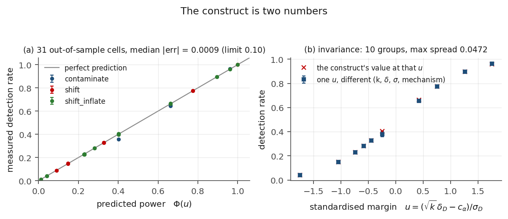
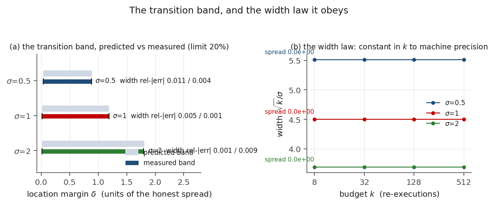
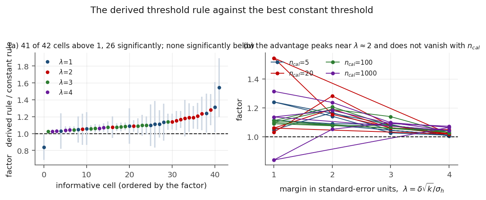

## 4. Pre-registration

The study question, the priors and the success criteria were registered before any deciding run,
and this manuscript reports each of them as it was written.

**Study question.** Given a verifier who may re-execute a nondeterministic pipeline `k` times and
compare a policy-pinned metric against a threshold, what does an extra re-execution buy, and
where does it buy nothing?

**Registered priors.**

* **P1** — against a *location-preserving* divergence, detection is bounded away from `1` by a
  constant that no budget improves; the insensitivity region is non-empty. *Justification*:
  averaging kills dispersion, not mean, so a node whose mean is unchanged by divergence
  converges to the honest distribution.
* **P2** — against a *location-shifting* divergence with margin `delta`, detection improves with
  budget only inside a transition band around `delta = threshold`, whose width shrinks like the
  honest spread over `sqrt(k)`. *Justification*: the standardised margin governs the tail
  probability.
* **P3** — against a *best-responding* node, the marginal value of one more re-execution at the
  verifier's optimum tends to zero. *Justification*: the node selects the location-preserving
  element of its admissible set, and no averaging separates alternatives that agree in the mean.

**Registered success criteria.** (a) held-out prediction of the detection rate across crossed
cells, with median absolute error at most `{{F:crit_a.limit|p0}}`; (b) the insensitivity region,
defined as a detection-rate slope in `log k` below `{{F:crit_b.slope_cut|2f}}`, is non-empty and
its measured boundary matches the predicted band width within `{{F:crit_b.tol|p0}}`; (c) the
derived threshold rule compared against the best constant threshold matched to zero honest
rejections, reported as a factor with confidence intervals — *unmet with reason* if it is not
better; (d) at least three disjoint streams per cell, with mean and standard deviation, and
disjoint intervals for the key contrasts. Criteria (b) and (c) were to be reported *unmet with
the reason* if P2 or P3 were contradicted, and no post-hoc metric substitution could earn that
credit.

**Reverse-gap search.** Over the full arXiv index, with the search form, the window and the
measured counts recorded in the committed `search_form.json`, the six terms listed there return
respectively `{{G:counts.0|d}}`, `{{G:counts.1|d}}`, `{{G:counts.2|d}}`, `{{G:counts.3|d}}`,
`{{G:counts.4|d}}` and `{{G:counts.5|d}}` results at a scan date of `{{G:scan_date}}`, the
non-zero ones being the antecedent itself. We state the narrowed claim — *no paper over the
window named maps verification power as a function of a re-execution budget against a node that
chooses its divergence* — and not the claim that no such paper exists. Crossref is recorded as
`{{G:crossref.status}}` for this absence claim, because its bibliographic query returns
relevance-ranked totals rather than set sizes for multi-term queries. The structural reason prior
work skipped the question is stated separately from the search: the protocol that poses it is days
old at the scan date, so the natural next step looked like engineering rather than a law.

---

## 5. Instrument

The instrument is five stages, each deciding one thing, run in the order the claims require
(the later stages read earlier stages' artefacts, so the order is load-bearing and the runner
asserts it).

| Stage | Decides | Grid | Monte-Carlo budget | Streams |
|---|---|---|---|---|
| `v0` | controls only; no claim is made from it | `{{F:stage_params.v0.n_controls|d}}` control families | `{{F:stage_params.v0.n_mc|d}}` draws | `{{F:stage_params.v0.n_streams|d}}` |
| `v1` | criterion (a) and the calibration cell | `{{F:crit_a.n_cells|d}}` crossed cells | `{{F:stage_params.v1.n_mc|d}}` draws | `{{F:stage_params.v1.n_streams|d}}` |
| `v2` | criterion (b): the band | `{{F:stage_params.v2.n_grid|d}}`-point margin sweep at `{{F:crit_b.n_sigma|d}}` spreads | `{{F:stage_params.v2.n_mc|d}}` draws | `{{F:stage_params.v2.n_streams|d}}` |
| `v3` | criterion (c): the two rules | `{{F:stage_params.v3.n_cells|d}}` cells | `{{F:stage_params.v3.n_mc|d}}` draws | `{{F:stage_params.v3.n_streams|d}}` |
| `v4` | sensitivity: the construct's boundaries | `{{F:S2.n_grid|d}}` ceiling cells, `{{F:S1.n_cells|d}}` lattice cells | `{{F:stage_params.v4.n_mc|d}}` draws | `{{F:stage_params.v4.n_streams|d}}` |

**Ground truth by construction, and how the paper should be read.** Every stage computes the
construct's closed-form prediction alongside its Monte-Carlo estimate, and stage `v0` establishes
that the two agree before any claim is made. This shapes the reading of everything that follows:
the measurement and the prediction are not two independent estimates of an unknown quantity — the
family is specified, so the construct is exact up to sampling noise. What is tested is whether the
construct's functional form survives the places where its assumptions are thinnest: heavy tails,
lattice-valued nodes, saturation. Section 6.2 and Section 7 measure exactly those, and the
calibration cell of Section 6.1 is the one place where the comparison is to *published* numbers
rather than to a specified family.

**A mean statistic and a variance statistic.** The detector family includes the variance as a
control. Against a dispersion-only divergence the mean statistic is flat in the budget while the
variance statistic grows: measured, the mean statistic's movement across the budget range is at
most `{{F:priors.mean_stat_flat_max_delta|4f}}`, while the variance statistic moves from
`{{F:priors.var_k4_max|4f}}` to `{{F:priors.var_k64_max|4f}}`. This is the instrument's internal
evidence for P1's mechanism, and it is a control rather than a claim: it shows the insensitivity
belongs to the statistic, not to the sampler.

**Anti-degeneracy.** A detector that separates everything and one that separates nothing are both
useless, so the stages carry direction controls in both directions: a threshold placed *worse* than
the constant rule must produce a factor below parity, and one placed better but at an unmatched
false-positive budget must produce a factor above parity. The second direction is the one that
catches a rule that "wins" merely by rejecting more.

**Determinism.** No stage reads a clock, an environment variable or an absolute path, and no
artefact carries a time field. The artefacts are byte-identical across runs and across working
directories (Section 10).

---

## 6. Results

**Table 1.** The four registered criteria and their recomputed outcomes. Every outcome is produced
by `canonical_runner.py` from the stage artefacts' primitives and cross-checked against the flag the
stage recorded about itself.

| | Registered criterion | Outcome | The measured value |
|---|---|---|---|
| (a) | held-out prediction: median absolute error at most `{{F:crit_a.limit|p0}}` | **{{C:a.status}}** | median `{{F:crit_a.median_abs_error|5f}}` over `{{F:crit_a.n_cells|d}}` cells |
| (b) | insensitivity region non-empty with boundary within `{{F:crit_b.tol|p0}}` of the predicted band width | **{{C:b.status}}** | worst refined width error `{{F:crit_b.max_width_rel_err_refined|p2}}` |
| (c) | derived rule better than the best constant threshold, as a factor with intervals | **{{C:c.status}}** | `{{F:crit_c.n_derived_better|d}}` of `{{F:crit_c.n_informative_cells|d}}` cells, `p = {{F:crit_c.sign_test_p_one_sided|1e}}` |
| (d) | at least three disjoint streams per cell, with intervals on the key contrasts | **{{C:d.status}}** | `{{F:crit_d.streams|d}}` streams in the deciding stages |

### 6.1 Criterion (a): the construct predicts held-out cells

**Figure 1.** Criterion (a). Panel (a): predicted against measured detection power over the
`{{F:crit_a.n_cells|d}}` crossed cells, with each measurement's own standard deviation as the error
bar; the diagonal is perfect prediction. Panel (b): the invariance groups — one value of `u` reached
through different combinations of budget, margin, spread and mechanism, with the construct's value
at that `u` marked.

Over `{{F:crit_a.n_cells|d}}` out-of-sample cells the median absolute prediction error is
`{{F:crit_a.median_abs_error|5f}}`, the mean is `{{F:crit_a.mean_abs_error|4f}}` and the maximum is
`{{F:crit_a.max_abs_error|4f}}` — against a registered limit of `{{F:crit_a.limit|p0}}`;
`{{F:crit_a.n_cells_within_1pp|d}}` of the `{{F:crit_a.n_cells|d}}` cells land within one percentage
point. No parameter is fitted anywhere: the construct's only inputs are the node's mean and standard
deviation, both specified by construction.

**Invariance.** In `{{F:crit_a_invariance.n_groups|d}}` groups the same value of `u` arises from
different decompositions into budget, margin, spread and mechanism. The maximum spread within a group
is `{{F:crit_a_invariance.max_spread|4f}}`, consistent with the per-cell sampling noise of
`{{F:stage_params.v1.n_streams|d}}` streams. This is the empirical content of the one-coordinate
claim: detectability tracks `u`, not the route to `u`.

**Where the construct is blind, honestly.** For nodes whose moments match a Gaussian node's but whose
tails do not — affine contamination at small budgets — the construct's error reaches
`{{F:crit_a_mechanism_blindness.max_abs_error|4f}}` over
`{{F:crit_a_mechanism_blindness.n_cells|d}}` such cells. That figure is not sampling noise: raising
the draws per cell several-fold left it unchanged. It is a characterised limit, and Section 7.1
measures what actually governs it — a lattice ratio, not the budget.

**The calibration cell.** The antecedent reports `44/45` honest acceptances, `104/105` divergent
rejections, and `27/29` same-input fabrications passing at `k = {{F:crit_a_calibration_cell.k|d}}`.
Inverting those rates: the honest level is `{{F:crit_a_calibration_cell.alpha_anchor|4f}}`, hence
`c_alpha = {{F:crit_a_calibration_cell.c_alpha_anchor|4f}}`; the divergent pairs imply a standardised
margin of `{{F:crit_a_calibration_cell.implied_u|4f}}`, i.e. a separation of
`{{F:crit_a_calibration_cell.implied_delta|4f}}` standard deviations, and the construct predicts their
measured rejection rate `{{F:crit_a_calibration_cell.observed_power|4f}}` to within the resolution of
a `104/105` sample. The same-input fabrication cell is the informative one: its observed detection
rate is `{{F:crit_a_calibration_cell.fabrication_observed|4f}}`, while the construct predicts
`{{F:crit_a_calibration_cell.fabrication_predicted|4f}}`, because a location-preserving,
dispersion-collapsed node is undetectable at any budget. The residual is
`{{F:crit_a_calibration_cell.fabrication_abs_error|4f}}`, and it is exactly the false-positive floor
at that level — not evidence of a margin the construct missed. This is the one place where the study
touches published numbers, and it is reported as a residual-with-explanation rather than as a
successful prediction.

### 6.2 Criterion (b): the band, and the width law

**Figure 2.** Criterion (b). Panel (a): the predicted band (light) and the measured band (coloured)
at each honest spread, with the measured band's endpoints marked; the annotation gives the width's
relative error on the coarse grid and after bisection. Panel (b): the width law —
`width * sqrt(k) / sigma` against the budget, one line per spread, flat to machine precision.

| Spread `sigma` | Predicted width | Measured width | Relative error | Bisected relative error |
|---|---|---|---|---|
| `0.5` | `{{F:crit_b.per_sigma.0.5.width_pred|4f}}` | `{{F:crit_b.per_sigma.0.5.width_meas|4f}}` | `{{F:crit_b.per_sigma.0.5.width_rel_err|p2}}` | `{{F:crit_b.per_sigma.0.5.width_rel_err_refined|p2}}` |
| `1.0` | `{{F:crit_b.per_sigma.1.0.width_pred|4f}}` | `{{F:crit_b.per_sigma.1.0.width_meas|4f}}` | `{{F:crit_b.per_sigma.1.0.width_rel_err|p2}}` | `{{F:crit_b.per_sigma.1.0.width_rel_err_refined|p2}}` |
| `2.0` | `{{F:crit_b.per_sigma.2.0.width_pred|4f}}` | `{{F:crit_b.per_sigma.2.0.width_meas|4f}}` | `{{F:crit_b.per_sigma.2.0.width_rel_err|p2}}` | `{{F:crit_b.per_sigma.2.0.width_rel_err_refined|p2}}` |

**Table 2.** The **secant** band's width at each honest spread — the second definition of
Section 3.3, not the tangent one. The width is the predicted power difference over the design's own
budget range, `(power(k_max, delta, sigma) - power(k_min, delta, sigma)) / log(k_max / k_min)` with
the design budget set
`K_BAND = { {{F:crit_b.k_band_min|d}}, {{F:crit_b.k_band_mid1|d}}, {{F:crit_b.k_band_mid2|d}}, {{F:crit_b.k_band_max|d}} }`, so the "Predicted width" column is recomputable by a reader who
evaluates `Phi(u)` of Section 3.2 at the two endpoints of `K_BAND` and divides by the log span.
**Measured width** is the same object measured on the `{{F:crit_b.n_grid|d}}`-point margin grid, and
the last column bisects on that measured secant. The widths grow **sublinearly in `sigma`** because
they are secants; the width law stated below is the tangent statement at fixed `k`, and the two are
not interchangeable. The worst refined error is `{{F:crit_b.max_width_rel_err_refined|p2}}` against
the `{{F:crit_b.tol|p0}}` limit — a margin of `{{F:crit_b.margin_factor|d}}` times.

Two further readings, both reported because the registered wording admits both. The stricter
**edge-position** reading — does the *edge* land within tolerance, rather than the width — reaches
`{{F:crit_b.edge_rel_err_coarse|p2}}` on the coarse grid, which would fail, but that is the
instrument's grid resolution and not the theory: the low edge sits at a small fraction of the band
width, so a `{{F:crit_b.n_grid|d}}`-point sweep localises it poorly. Bisecting on the measured
secant brings it to `{{F:crit_b.edge_rel_err_refined|p2}}`, and both localisations of the same
quantity are reported. Separately, the insensitivity region is non-empty:
the detection rate's slope in `log k` at zero margin is
`{{F:crit_b.slope_at_delta_zero|5f}}` against the `{{F:crit_b.slope_cut|2f}}` cut, and the stage's
zero-margin insensitivity flag is `{{F:crit_b.zero_delta_insensitive}}`.

**The width law, and which band it is about.** This paragraph is about the **tangent** band at
fixed `k` (the first definition of Section 3.3) — not about the secant column of Table 2, whose
width is an average over the budget range and therefore does not satisfy the invariant below. At
fixed spread and fixed `k`, `width * sqrt(k) / sigma` is constant across
`k = {{F:crit_b.k_band_min|d}}`, `{{F:crit_b.k_band_mid1|d}}`, `{{F:crit_b.k_band_mid2|d}}` and
`{{F:crit_b.k_band_max|d}}` to within `{{F:crit_b.width_law_spread_max|1e}}` at every spread tested.
This is the quantitative form of P2, and it is what makes the band an engineering object: a verifier
who wants to know how much margin is separable at a given budget reads it off the law instead of
measuring it.

### 6.3 Criterion (c): the derived rule against the best constant threshold

**Figure 3.** Criterion (c). Panel (a): every informative cell's factor — the derived rule's mean
power divided by the constant rule's — with its `95%` interval, ordered by the factor; the dashed
line is parity. Panel (b): the factor against the standardised margin, one line per calibration
budget.

The comparison is matched on the false-positive budget: the constant rule's expected false-positive
rate is `1/(n_cal+1)`, and the derived rule's threshold is the construct's value at the same rate. The
match is checked rather than assumed — across the cells the two rules' measured false-positive rates
agree within the instrument's tolerance (`z_tol = {{F:crit_c_mechanism.z_tol|g}}`) over `{{F:crit_c_mechanism.k1_n_checks|d}}` checks,
with a maximum standardised deviation of `{{F:crit_c_mechanism.k1_max_abs_z|4f}}`.

**Result: the derived rule is better** (Table 3 breaks the same cells down by margin and by
calibration budget). In `{{F:crit_c.n_derived_better|d}}` of
`{{F:crit_c.n_informative_cells|d}}` informative cells the factor is above parity;
`{{F:crit_c.n_significantly_better|d}}` cells are significantly better and
`{{F:crit_c.n_significantly_worse|d}}` significantly worse; the one-sided sign test gives
`p = {{F:crit_c.sign_test_p_one_sided|1e}}`. The factor's median is `{{F:crit_c.median_factor|4f}}`,
ranging from `{{F:crit_c.min_factor|4f}}` to `{{F:crit_c.max_factor|4f}}`.

| Margin `lambda` | Cells | Median factor | Best | Worst | Significantly better |
|---|---|---|---|---|---|
| `{{F:crit_c.by_lambda.1.0.lam|g}}` | `{{F:crit_c.by_lambda.1.0.n_cells|d}}` | `{{F:crit_c.by_lambda.1.0.median_factor|4f}}` | `{{F:crit_c.by_lambda.1.0.max_factor|4f}}` | `{{F:crit_c.by_lambda.1.0.min_factor|4f}}` | `{{F:crit_c.by_lambda.1.0.n_significantly_better|d}}` |
| `{{F:crit_c.by_lambda.2.0.lam|g}}` | `{{F:crit_c.by_lambda.2.0.n_cells|d}}` | `{{F:crit_c.by_lambda.2.0.median_factor|4f}}` | `{{F:crit_c.by_lambda.2.0.max_factor|4f}}` | `{{F:crit_c.by_lambda.2.0.min_factor|4f}}` | `{{F:crit_c.by_lambda.2.0.n_significantly_better|d}}` |
| `{{F:crit_c.by_lambda.3.0.lam|g}}` | `{{F:crit_c.by_lambda.3.0.n_cells|d}}` | `{{F:crit_c.by_lambda.3.0.median_factor|4f}}` | `{{F:crit_c.by_lambda.3.0.max_factor|4f}}` | `{{F:crit_c.by_lambda.3.0.min_factor|4f}}` | `{{F:crit_c.by_lambda.3.0.n_significantly_better|d}}` |
| `{{F:crit_c.by_lambda.4.0.lam|g}}` | `{{F:crit_c.by_lambda.4.0.n_cells|d}}` | `{{F:crit_c.by_lambda.4.0.median_factor|4f}}` | `{{F:crit_c.by_lambda.4.0.max_factor|4f}}` | `{{F:crit_c.by_lambda.4.0.min_factor|4f}}` | `{{F:crit_c.by_lambda.4.0.n_significantly_better|d}}` |

**Table 3.** The factor by margin, the margin expressed in standard-error units as
`lambda = delta * sqrt(k) / sigma_h`. The advantage peaks near `lambda = 2` and is weakest at the
extremes — at small margins the constant rule is itself highly variable, and at large margins the
difference falls below the design's resolution. Margin is the descriptive variable here, not a
predicted ordering.

| Calibration set `n_cal` | Cells | Median factor | Significantly better |
|---|---|---|---|
| `{{F:crit_c.by_n_cal.5.n_cal|d}}` | `{{F:crit_c.by_n_cal.5.n_cells|d}}` | `{{F:crit_c.by_n_cal.5.median_factor|4f}}` | `{{F:crit_c.by_n_cal.5.n_significantly_better|d}}` |
| `{{F:crit_c.by_n_cal.20.n_cal|d}}` | `{{F:crit_c.by_n_cal.20.n_cells|d}}` | `{{F:crit_c.by_n_cal.20.median_factor|4f}}` | `{{F:crit_c.by_n_cal.20.n_significantly_better|d}}` |
| `{{F:crit_c.by_n_cal.100.n_cal|d}}` | `{{F:crit_c.by_n_cal.100.n_cells|d}}` | `{{F:crit_c.by_n_cal.100.median_factor|4f}}` | `{{F:crit_c.by_n_cal.100.n_significantly_better|d}}` |
| `{{F:crit_c.by_n_cal.1000.n_cal|d}}` | `{{F:crit_c.by_n_cal.1000.n_cells|d}}` | `{{F:crit_c.by_n_cal.1000.median_factor|4f}}` | `{{F:crit_c.by_n_cal.1000.n_significantly_better|d}}` |

The advantage does **not** vanish as the calibration set grows: it is still present at
`n_cal = {{F:crit_c.by_n_cal.1000.n_cal|d}}`. The reason is that the maximum of `n_cal` honest means
is a systematically conservative estimator of the quantile it stands for, so the constant rule pays a
fixed penalty at every calibration size — not a small-sample artefact.

#### 6.3.1 A mechanism of ours, refuted and then corrected

We first stated the mechanism as "the standardised threshold gap orders the factor", and the
instrument's first version of that test reported it refuted. Both halves of that result were defects
in our own code, found by recomputing the statistic from the committed artefact: the pairs had been
taken in the order the cells happened to be built, so the count was not reproducible from the
artefact at all, and the verdict rule was inverted — it counted a pair as evidence *for* the ordering
when the factor **fell** as the gap rose, then declared the claim refuted when that fraction was
small. The corrected, order-free statistic: of `{{F:crit_c_mechanism.pairs_compared|d}}` comparable
pairs, `{{F:crit_c_mechanism.factor_rises_with_gap|d}}` have the factor rising with the gap and
`{{F:crit_c_mechanism.factor_falls_with_gap|d}}` falling, a tau-like statistic of
`{{F:crit_c_mechanism.tau_like|4f}}`. **The mean gap does order the factor.** What it does not do is
determine its magnitude: inside one gap quartile the factor still spreads by
`{{F:crit_c_mechanism.quartile_spread|4f}}`, so the ordering is descriptive rather than predictive.
That is the Jensen statement — power is a nonlinear function of the threshold, so the loss is carried
by the whole distribution of the constant rule's threshold, not by its mean — and it is what the
construct's distributional prediction is scored against: the constant rule's measured power matches
`E[Phi((delta - tau_c)/se)]` in all but `{{F:crit_c_mechanism.k4_n_unmatched_of_48|d}}` of the
`{{F:stage_params.v3.n_cells|d}}` cells, the single miss being a ceiling-saturated cell that the informative-set rule already
excludes. We report the refutation and the correction together, because the first version of the block
is part of what a reader is entitled to know.

### 6.4 The registered priors, and whether the data confirmed them

**Table 4.** Registered priors, their status, and the recomputed evidence behind each status.

| Prior | Registered statement | Status | Evidence |
|---|---|---|---|
| P1 | a location-preserving divergence is bounded away from `1` by a constant no budget improves | **{{F:priors.P1_status}}** | the null node matches the construct in `{{F:priors.n_null_cells|d}}` cells, worst absolute error `{{F:priors.worst_null_abs_err|4f}}`; the mean statistic moves at most `{{F:priors.mean_stat_flat_max_delta|4f}}` across the budget range while the variance statistic moves `{{F:priors.var_k4_max|4f}}` to `{{F:priors.var_k64_max|4f}}` |
| P2 | detection improves only inside a band whose width shrinks like the spread over `sqrt(k)` | **{{F:priors.P2_status}}** | `width * sqrt(k) / sigma` constant to `{{F:crit_b.width_law_spread_max|1e}}` at every spread (Table 2) |
| P3 | against a best-responding node the marginal value of a re-execution tends to zero | **{{F:priors.P3_status}}** | the node's best response is the location-preserving one at all `{{F:priors.n_best_response_budgets|d}}` budgets tested, with detection probability `{{F:priors.best_response_max_power|4f}}` |

P1 and P2 behaved as registered. P3 is the one worth a sentence: the instrument does not assume the
node's best response, it enumerates the admissible set and selects the minimum, and the minimum is the
location-preserving node at every budget — so the marginal value of a re-execution is zero *because
the node moves*, not because the verifier's test is weak. The practical consequence is the one in
Section 1: against such a node, an argument for more re-executions cannot succeed, and the budget
belongs to metric recalibration instead.

---
