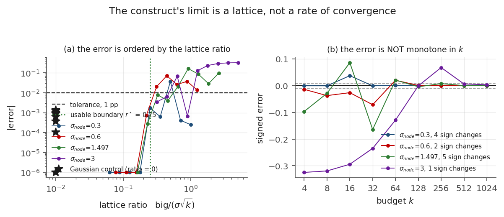
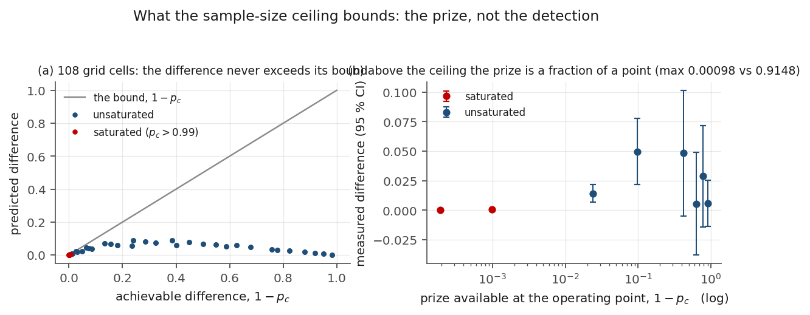
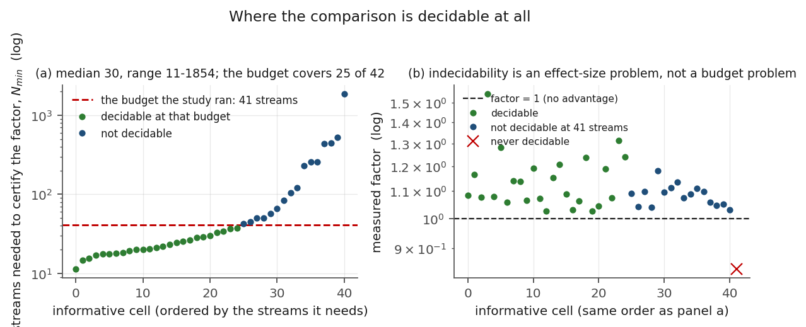

## 7. Sensitivity: the construct's own boundaries, measured

The registered criteria ask whether the construct works where it is supposed to. This section asks
the complementary question — where it stops — and reports three measured boundaries rather than three
caveats. All three are computed by the same runner from the same stage artefacts, and each is scored
by a named check so that a reader can see which claim would break first.

### 7.1 S1: the construct's limit is a lattice ratio, not a rate of convergence

**Figure 4.** S1. Panel (a): the absolute error against the lattice ratio `big / (sigma * sqrt(k))`,
one line per node spread, with the usable boundary marked and the Gaussian control (which has lattice
ratio zero) as stars. Panel (b): the same error against the budget — the error changes sign as the
budget grows, so it is not monotone in `k`. That non-monotonicity belongs to the **approximation
error**, not to the power: power is monotone in `k` for a fixed node (Section 3.2), and it is the
rule comparison that is non-monotone in the budget (Section 1).

For a two-point node with mass `q` at `big` and the rest at zero, the sample mean is a lattice
variable with spacing `big/k`, so the quantity that governs the construct's error is the *lattice
ratio* `big / (sigma * sqrt(k))` — not the budget alone (`sigma` here is the node's own standard
deviation, which is what makes the ratio the only scale-free input). Over `{{F:S1.n_cells|d}}`
node-by-budget cells the error is ordered by that ratio (Table 5): every cell with ratio at most
`{{F:S1.r_star|2f}}` lands within `{{F:S1.tol_pp|p0}}` of the construct
(`{{F:S1.n_cells_inside_boundary|d}}` cells, worst `{{F:S1.worst_abs_error_inside|5f}}`), while the
worst error over all measured cells is `{{F:S1.worst_abs_error_overall|4f}}`. We report both the tight
safe value and the largest ratio at which a cell still exceeds tolerance,
`{{F:S1.largest_ratio_exceeding|2f}}`, because a boundary without its counterexample invites
over-reading.

| Lattice-ratio bin | Median absolute error | Worst absolute error |
|---|---|---|
| `{{F:S1.bin_labels.0}}` | `{{F:S1.median_abs_error_by_ratio_bin.0-0.25|5f}}` | `{{F:S1.max_abs_error_by_ratio_bin.0-0.25|4f}}` |
| `{{F:S1.bin_labels.1}}` | `{{F:S1.median_abs_error_by_ratio_bin.0.25-0.5|5f}}` | `{{F:S1.max_abs_error_by_ratio_bin.0.25-0.5|4f}}` |
| `{{F:S1.bin_labels.2}}` | `{{F:S1.median_abs_error_by_ratio_bin.0.5-1|5f}}` | `{{F:S1.max_abs_error_by_ratio_bin.0.5-1|4f}}` |
| `{{F:S1.bin_labels.3}}` | `{{F:S1.median_abs_error_by_ratio_bin.1-2|5f}}` | `{{F:S1.max_abs_error_by_ratio_bin.1-2|4f}}` |
| `{{F:S1.bin_labels.4}}` | `{{F:S1.median_abs_error_by_ratio_bin.2-100|5f}}` | `{{F:S1.max_abs_error_by_ratio_bin.2-100|4f}}` |

**Table 5.** Absolute error by lattice-ratio bin. The first bin is numerically zero; at the other
end the worst error is `{{F:S1.worst_abs_error_overall|4f}}` against a tolerance of `{{F:S1.tol_pp|p0}}`.
`{{F:S1.r_star|2f}}`, not where the budget passes some threshold.

**The Gaussian control.** A Gaussian node has lattice ratio zero, and its worst error over the same
grid is `{{F:S1.gaussian_max_abs_error|4f}}` — `{{F:S1.gaussian_tighter_by|d}}` times tighter than the
worst lattice error. This is the two-sided control for Section 7.1: it shows the error is a property
of the lattice, not of the sample size or of an implementation detail.

**Where the budget still misleads.** Because the ratio carries `sqrt(k)`, a node's error is *not*
monotone in the budget: the measured number of sign changes in the error as `k` grows is
`{{F:S1.sign_flips_ties_excluded.0.3|d}}`, `{{F:S1.sign_flips_ties_excluded.0.6|d}}`,
`{{F:S1.sign_flips_ties_excluded.1.497|d}}` and `{{F:S1.sign_flips_ties_excluded.3.0|d}}` across the
four node spreads (exact zeros excluded; the stage's own counting rule, which admits ties, gives
`{{F:S1.sign_flips_stage_rule.0.3|d}}`, `{{F:S1.sign_flips_stage_rule.0.6|d}}`,
`{{F:S1.sign_flips_stage_rule.1.497|d}}`, `{{F:S1.sign_flips_stage_rule.3.0|d}}` — both are printed
because they answer different questions, and the discrepancy is entirely tie-handling). The mirror
control confirms the sign flips symmetrically under reflection of the node's support:
`{{F:S1.mirror_opposite}}`.

### 7.2 S2: the ceiling bounds the prize, not the detection

**Figure 5.** S2. Panel (a): the measured gain against the bound `1 - p_c` at each measured cell, one
marker per cell, with saturation flagged; the diagonal is the bound. Panel (b): the gain against the
standardised margin, showing the saturation boundary crossing the grid.

Of the `{{F:S2.n_grid|d}}` ceiling cells, `{{F:S2.n_saturated|d}}` saturate (Table 6 lists the
measured cells; the grid itself is a plotting grid in Figure 5). The maximum gain in the
saturated group is `{{F:S2.saturated_max_gain|5f}}` against `{{F:S2.unsaturated_max_gain|4f}}` in the
unsaturated group — a factor of `{{F:S2.saturated_gain_ratio|d}}` between the two regimes, and it is the *difference*
between the two rules that shrinks, not their detectability. The bound `1 - p_c` is never violated:
the largest overshoot over the measured cells is `{{F:S2.max_overshoot|1e}}`, i.e. the measured gain
lies below the bound at every cell. Of the `{{F:S2.n_measured|d}}` measured cells,
`{{F:S2.n_measured_ci_excludes_zero|d}}` have an interval that excludes zero, so the saturation claim
is not a significance claim: in a saturated cell the prediction is that the gain is *small*, and the
interval is wide enough that the honest statement is "consistent with the bound", not "significantly
below parity".

| `n_cal` | `k` | `lambda` | Bound `1 - p_c` | Measured gain | `95%` interval |
|---|---|---|---|---|---|
| `{{F:S2.measured.0.n_cal|d}}` | `{{F:S2.measured.0.k|d}}` | `{{F:S2.measured.0.lam|g}}` | `{{F:S2.measured.0.bound|4f}}` | `{{F:S2.measured.0.difference|4f}}` | `[{{F:S2.measured.0.ci_lo|4f}}, {{F:S2.measured.0.ci_hi|4f}}]` |
| `{{F:S2.measured.1.n_cal|d}}` | `{{F:S2.measured.1.k|d}}` | `{{F:S2.measured.1.lam|g}}` | `{{F:S2.measured.1.bound|4f}}` | `{{F:S2.measured.1.difference|4f}}` | `[{{F:S2.measured.1.ci_lo|4f}}, {{F:S2.measured.1.ci_hi|4f}}]` |
| `{{F:S2.measured.2.n_cal|d}}` | `{{F:S2.measured.2.k|d}}` | `{{F:S2.measured.2.lam|g}}` | `{{F:S2.measured.2.bound|4f}}` | `{{F:S2.measured.2.difference|4f}}` | `[{{F:S2.measured.2.ci_lo|4f}}, {{F:S2.measured.2.ci_hi|4f}}]` |
| `{{F:S2.measured.3.n_cal|d}}` | `{{F:S2.measured.3.k|d}}` | `{{F:S2.measured.3.lam|g}}` | `{{F:S2.measured.3.bound|4f}}` | `{{F:S2.measured.3.difference|4f}}` | `[{{F:S2.measured.3.ci_lo|4f}}, {{F:S2.measured.3.ci_hi|4f}}]` |
| `{{F:S2.measured.4.n_cal|d}}` | `{{F:S2.measured.4.k|d}}` | `{{F:S2.measured.4.lam|g}}` | `{{F:S2.measured.4.bound|4f}}` | `{{F:S2.measured.4.difference|4f}}` | `[{{F:S2.measured.4.ci_lo|4f}}, {{F:S2.measured.4.ci_hi|4f}}]` |
| `{{F:S2.measured.5.n_cal|d}}` | `{{F:S2.measured.5.k|d}}` | `{{F:S2.measured.5.lam|g}}` | `{{F:S2.measured.5.bound|4f}}` | `{{F:S2.measured.5.difference|4f}}` | `[{{F:S2.measured.5.ci_lo|4f}}, {{F:S2.measured.5.ci_hi|4f}}]` |
| `{{F:S2.measured.6.n_cal|d}}` | `{{F:S2.measured.6.k|d}}` | `{{F:S2.measured.6.lam|g}}` | `{{F:S2.measured.6.bound|4f}}` | `{{F:S2.measured.6.difference|4f}}` | `[{{F:S2.measured.6.ci_lo|4f}}, {{F:S2.measured.6.ci_hi|4f}}]` |
| `{{F:S2.measured.7.n_cal|d}}` | `{{F:S2.measured.7.k|d}}` | `{{F:S2.measured.7.lam|g}}` | `{{F:S2.measured.7.bound|4f}}` | `{{F:S2.measured.7.difference|4f}}` | `[{{F:S2.measured.7.ci_lo|4f}}, {{F:S2.measured.7.ci_hi|4f}}]` |

**Table 6.** The measured ceiling cells: the bound from the constant rule's own power, the measured
gain, and the between-stream interval. The cells with the tightest bounds are exactly the saturated
ones, and their intervals contain zero — which is the honest reading of "the prize is gone".

### 7.3 S3: the comparison is decidable for a minority of cells at this budget

**Figure 6.** S3. Panel (a): per-cell `N_min` — the streams a cell needs for its interval to clear
parity — against the measured effect size, with the budget this study ran drawn as a horizontal line.
Panel (b): decidability by margin and calibration budget, the informative cells marked.

The headline comparison of Section 6.3 is a *between-stream* comparison, so each cell has a streams
requirement of its own. Inverting the cell intervals: `{{F:S3.n_decidable|d}}` of
`{{F:S3.n_cells|d}}` informative cells certify an advantage at the `{{F:crit_d.streams|d}}` streams
this study ran, `{{F:S3.n_indecidable|d}}` do not, and `{{F:S3.n_never_decidable|d}}` cell
(`{{F:S3.never_decidable_cells.0}}`) would need more streams than any budget in the design grid can
supply, because its effect size is below the noise floor at every budget tested. Among the decidable
and indecidable cells together, the median requirement is `{{F:S3.n_min_median|d}}` streams, with a
range from `{{F:S3.n_min_min|d}}` to `{{F:S3.n_min_max|d}}`.

This is where the paper's headline should be read with care, and we state it as a limitation of our
own evidence rather than of the construct: the *sign* of the comparison is settled —
`{{F:crit_c.n_derived_better|d}}` of `{{F:crit_c.n_informative_cells|d}}` cells favour the derived
rule, sign test `p = {{F:crit_c.sign_test_p_one_sided|1e}}` — but at `{{F:crit_d.streams|d}}` streams
only `{{F:S3.n_decidable|d}}` of the `{{F:S3.n_cells|d}}` cells are individually certified, and
`{{F:crit_c.strict_reading_n_failures|d}}` cells fail the strict reading that requires each cell's own
interval to clear parity. A verifier who needs per-cell certification must budget
`{{F:S3.n_min_median|d}}` streams (median), not `{{F:crit_d.streams|d}}`; a verifier who needs the
direction of the effect can stop earlier. The agreement between this inversion and the stage's own
cell-by-cell verdict is `{{F:S3.n_agree|d}}` of `{{F:S3.n_cells|d}}` cells.

---

## 8. Threats to validity, and why the result is still worth publishing

**Threat 1: the family is synthetic.** Detection is measured on a specified node family with ground
truth by construction, not on deployed pipelines. *Mitigation and residual*: the construct's inputs
are the node's first two moments, and the study's job is to test the functional form; the one
external check is the calibration cell of Section 6.1, which is an inversion of published rates and
lands within one sample's resolution. The residual is that a real fabrication mechanism with a
non-Gaussian, heavier-tailed profile at small budgets behaves like the contaminated cells of
Section 6.1 — error `{{F:crit_a_mechanism_blindness.max_abs_error|4f}}` — until the lattice ratio
explains it (Section 7.1). A field deployment could shift the *constants* in the band; it cannot
remove the band, because the band comes from the standard error, not from the family.

**Threat 2: the budget grids are finite.** `k` is measured at
`{{F:crit_b.k_band_min|d}}`–`{{F:crit_b.k_band_max|d}}` in the band experiment and
`{{F:stage_params.v3.k_grid.0|d}}`–`{{F:stage_params.v3.k_grid.2|d}}` in the rule comparison, so the
`1/sqrt(k)` law is established over a finite range. *Mitigation*: the law's invariant is flat to
`{{F:crit_b.width_law_spread_max|1e}}`, and the analytic form predicts the extrapolation; the honest
statement is that the law is verified where it was measured, and that extrapolation beyond
`k = {{F:crit_b.k_band_max|d}}` is an inference from the derivation rather than a measurement.

**Threat 3: our own first mechanism claim was wrong.** Section 6.3.1 reports a mechanism statement
that began as "the gap orders the factor", was refuted by our own instrument, and was corrected after
the error in the *test* was found. *Why this is not fatal, and why it is reported*: the corrected
statistic is reproducible from the committed artefact (order-free), and the claim that survives is
weaker and checkable — the gap orders the factor, the gap does not determine it. A reader can
re-derive both numbers from `results_v3.json` without re-running the study.

**Threat 4: single-machine, single-precision, single-seed-family.** The study is CPU-only, run on one
machine, with streams derived from a fixed seed policy. *Mitigation*: the artefacts carry no clock,
no host name and no absolute path, and `reproduce.sh` regenerates all six figures and every number
byte-identically from a clean checkout; the multi-stream structure (41 streams in the deciding
stages) is the study's own variance control, and the reported intervals are between-stream.
*Residual*: a different BLAS or libm could move the last digits; the checks are therefore stated at
the precision the manuscript prints, not at bit level, and the byte-identity claim is scoped to the
Python and matplotlib versions recorded in the README.

**Threat 5: the comparison's per-cell decidability is limited at this budget.** As Section 7.3 states,
`{{F:S3.n_decidable|d}}` of `{{F:S3.n_cells|d}}` cells are individually certified at
`{{F:crit_d.streams|d}}` streams and the median requirement is `{{F:S3.n_min_median|d}}`.
*Mitigation*: the direction of the effect is settled by the sign test and the magnitude is bounded by
the per-cell factors; the strict per-cell reading is reported with its failure count so a reader can
choose which claim to rely on.

**Why it is still worth publishing.** The decision the paper informs is a budget decision, and the
decision rule it produces is cheap to apply: read the node's mean shift and dispersion, compute `u`,
and compare it against the band. Three of the four consequences are invisible to a one-point
comparison — a budget response confined to a band, a rule comparison that is non-monotone in the
budget, a ceiling that bounds the prize, and a location-preserving
node that no budget can separate. The last one is not a curiosity: it is the case the antecedent's
conditional result described, it is the best response of a strategic node, and it is the reason "more
re-executions" cannot be the answer to a disagreement with a fabricating counterparty. Even where our
evidence is weakest — per-cell decidability at the budget we ran — the paper's contribution is the map
of *where* the evidence is weak, which is what lets the next study spend its budget in the right
cells.

---

## 9. Conclusion

We asked what a re-execution budget buys. The answer is a curve with a boundary, not a number:
detection power is a function of one standardised coordinate, `u = (sqrt(k) delta_D - c_alpha) /
sigma_D`, so budget buys power only for nodes inside a transition band whose width shrinks as
`1/sqrt(k)` (measured flat to `{{F:crit_b.width_law_spread_max|1e}}`), the achievable gain inside a
saturated regime collapses to `{{F:S2.saturated_max_gain|5f}}` from
`{{F:S2.unsaturated_max_gain|4f}}`, and a location-preserving node is separated by no budget at all.
The derived rule beats the best matched constant threshold in
`{{F:crit_c.n_derived_better|d}}` of `{{F:crit_c.n_informative_cells|d}}` informative cells
(`p = {{F:crit_c.sign_test_p_one_sided|1e}}`), and the construct's own limit is a lattice ratio
(`{{F:S1.r_star|2f}}`) rather than a convergence rate. The operational summary a verifier can carry
away: measure the node's location shift and dispersion, compute `u`, and spend the next unit of budget
where the band is — or stop, and recalibrate the metric, when the node is the one that moves.

## 10. Reproduction

`bash reproduce.sh` regenerates every number and every figure in this manuscript from a clean
checkout, in one command, with no network access.

* **Numbers.** The five stage scripts are re-run, then `canonical_runner.py` recomputes the criteria,
  the sensitivity block and the `manuscript_facts` block from the stage artefacts' primitives and
  cross-checks each recomputation against the flag the stage recorded about itself:
  `{{F:stage_params.v0.n_mc|d}}`+ draws per cell as listed in Table 1,
  `{{X:cross_checks.n_checks|d}}` cross-checks, 0 failures. The run prints `REPRODUCE: ALL GREEN` and exits non-zero on any mismatch, so a
  logging accident cannot outrank the verdict.
* **Expected output.** `canonical_results.json`; criteria `a`, `b`, `c`, `d` all `MET`; the
  three registered priors all `CONFIRMED`. The run prints the artefact's `sha256` and compares
  two consecutive runs against each other, so neither this manuscript nor the README has to
  quote a digest that a run could retire.
  `a`,`b`,`c`,`d` all `MET`; the four registered priors all `CONFIRMED`.
* **Figures.** `make_figures.py` draws all six figures from the stage artefacts (no number is typed
  into the plotting code), and `verify_figures.py` re-checks them by content (digests re-read off the
  drawn artists), render (every promised label is drawn) and canvas (every positioned element inside
  the axes). `verify_figures_mutations.py` demonstrates that each of those checks fires on a mutated
  input.
* **Tolerance.** Integers and counts are exact; printed decimal numbers are compared at the precision
  the manuscript prints; PNG bytes are pinned to the matplotlib version recorded in the README, and
  the data they are drawn from is pinned absolutely. If matplotlib is absent, the figure steps are
  skipped with a notice; `REQUIRE_FIGURES=1` makes that fatal.
* **What is not reproduced.** The reverse-gap search of Section 4 is hand-recorded evidence in
  `search_form.json` (arXiv is rate-limited and its totals are not stable enough to assert in a
  loop); the reference checks of the bibliography are recorded in `reference-check.md` with the
  method used for each entry.

---

## References

<!-- REFERENCES -->
