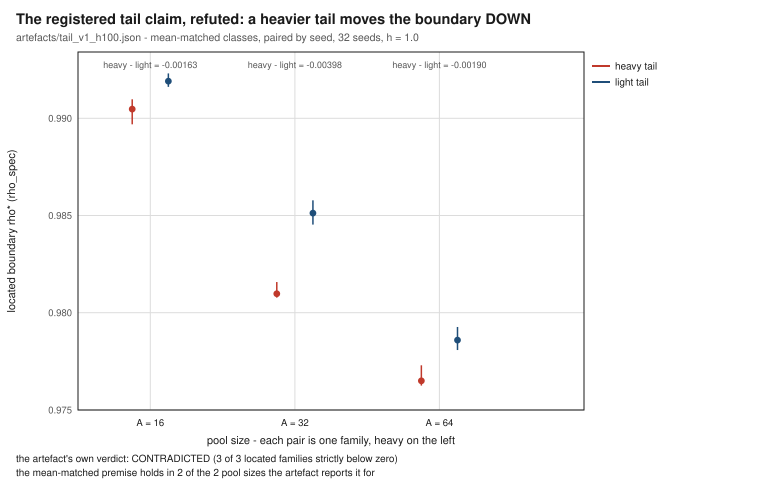

# When Does Speculative Tool Execution Pay? Contention Boundaries, Latency Tails, and the Parallelism the Serial Baseline Already Had

## Abstract

An agent that issues a tool call speculatively - on a guess about what it will need
next - buys hidden latency and pays for it twice: the guessed call occupies shared
capacity, and a guess that is wrong either wastes that capacity or, when the call is
not idempotent, has to be undone. The systems literature of the last six months reports
speedups from doing this, each inside a window its authors chose. This paper asks where
the practice stops paying, and what it is actually buying.

We build a deterministic, closed simulator of an agent loop whose tool calls are served
by a shared pool with measured contention, and locate the **contention-indexed
speculation boundary** `rho*(A, h)`: the utilisation at which speculation's mean benefit
crosses zero, indexed by the pool size `A` and the speculation rate `h`. Ground truth is
by construction (a serial schedule and an oracle are both defined inside the instrument),
so the boundary is a property of the model rather than of a fitted curve.

Four results. (i) **The boundary is real and it is indexed by the pool, not only by the
speculation rate**: at `h = 1.0` it moves from 0.991908 at `A = 16` to
0.970357 at `A = 96`, a span 0.021551 - more than an order of
magnitude larger than the per-seed interval width - and cells with the *same* utilisation
to five decimals straddle the boundary with opposite signs. The registered single-variable
law (`rho*(h)`) is therefore **unresolved**, and we report it as such rather than as a
confirmation. (ii) **The registered claim that the tail, rather than the mean, locates the
boundary is refuted in both halves**: at matched means a heavier tail moves the boundary
*down* and its descent is *shallower*; the quantity that actually indexes the boundary is a
count (the fraction of steps that can be hidden at all), not a magnitude. (iii) A
**matched-parallelism control** - the same speculation width, the same pool, but the
in-flight calls chosen blindly instead of by the engine's own signal - shows that a blind
schedule of the same width already buys 0.583097 of the informed
gain at one cell, and that the informed share *falls* as speculation widens: most of what
"prediction" buys at these rates is parallelism the serial baseline never had.
(iv) The side-effect channel is priced rather than assumed: the compensation work a
discarded speculative call triggers lands on the shared pool and is not waited for by the
step that caused it, and a domain admissibility rule that speculates only on
idempotent or side-effect-free edges still admits a non-empty set of states with negative
benefit per step, of which about half the steps at the boundary are losing steps.

We also close the two remaining registered questions honestly: the classical closed-form
mean-field fixed point predicts the boundary's *level* well (90.7801 of
comparable cells within +/-0.05 in the same coordinate) but expresses **no boundary at
all** - it is optimistic on every cell in which the simulator's benefit has already turned
negative - so the registered calibration criterion is reported **unmet, with that reason**;
and an external cell built from two published systems' own reported numbers reproduces
their signs 3 of 3, reaching one inside its reported operating region, reaching a second,
and reporting the third as out of the model's reach rather than as a disagreement.

The instrument, every measurement behind every number, and the reference layer are
committed and reproduce byte-identically with one command. Contribution level:
**theory + empirics**.

## 1. Introduction

### 1.1 The question

An agent loop alternates thinking and tool calls. A tool call's latency is a large part of
the loop's wall clock, and a call can be issued *before* the agent has decided it needs
the result - that is speculation. The system keeps the guess in flight; if the agent then
asks for exactly that call, its latency has been hidden; if not, the in-flight work is
discarded, and if the call was not idempotent the discard has to be compensated.

Both halves are real and they move in opposite directions. The hidden half is bounded by
how much of a call's latency can overlap a think phase that is itself finite, so the
benefit saturates. The cost half grows with shared capacity: every in-flight guess is work
the pool must do, and at high utilisation the queueing delay it causes is unbounded. A
quantity that saturates meets a quantity that does not, so *if* the practice is worth
doing at all there should be a utilisation below which it pays and above which it does
not. This paper's study question is whether that boundary exists, where it is, and what
indexes it.

The answer we can defend is narrower than the question. The boundary exists - a single
positive-to-nonpositive crossing, located in every cell - and it is indexed by the pool's size
as well as by the speculation rate, which means the single-variable statement a reader would
like ("speculate below utilisation `x`") is not available from this instrument. How *sharp*
the crossing is, in the registered sense of a measured `+/-5%` fall, is **not established
here**: the windows that locate the crossing span at most 0.028079 in `rho` and
contain the family's whole benefit range (7.86743 percentage points) from its
positive maximum to below zero, which bounds the transition without measuring the registered
statistic (4.2).

### 1.2 Why the question is being asked now

Speculation is not new; hiding latency by executing work early is as old as
out-of-order execution [1] and as old as thread-level speculation
[2][3][4]. What changed in 2026 is the unit being
speculated on: the tool call of an LLM agent, which is a network round trip with a side
effect, not a memory load [5][6][7][8].
18 of this manuscript's references are 2026 works on
speculative execution for agents, and their reported gains are real measurements.

They are also, without exception, measurements taken inside a window the authors chose.
The discipline a system paper does not have to carry - and this journal's readers are
entitled to ask for - is the one that says where the window ends. A practitioner deciding
whether to enable speculative calls in a deployment needs the boundary, not the peak.

### 1.3 What we do

We build a simulator with three properties that make the boundary measurable rather than
plausible.

*Ground truth by construction.* The model defines both reference schedules - a serial
schedule that issues a call only after the think phase that wants it, and an oracle that
issues exactly the calls that will be needed - so a benefit is a difference between two
schedules of the same sampled work, not a comparison against a fitted baseline.

*Contention measured, not assumed.* Utilisation is a measured output (busy capacity over
capacity-times-makespan), not an input parameter, so a cell's `rho` is a fact about what
the schedule did.

*A matched-parallelism control.* The registered claim we test in (iii) above is really two
claims wearing one name: that issuing calls early buys *hidden latency*, and that the
*choice* of which calls to issue early buys something the width alone does not. They are
separated by holding the width fixed - the same fraction of steps issue a call early - and
varying only the rule that picks which ones.

We then take the model to two published systems' own reported numbers, with the mapping
from their coordinate to ours declared rather than fitted, and report the cells the model
reaches and the one it does not.

### 1.4 Contributions

1. **The construct.** A contention-indexed speculation boundary `rho*(A, h)`, with the
   instrument that makes it measurable, the serial baseline and oracle defined inside the
   instrument, and the per-seed interval attached to every reported location.
2. **The pool effect.** Evidence that the boundary is a function of the state and not only
   of the scheduling rate, with matched-utilisation cells on both sides of it.
3. **A decomposition.** The identity `benefit = w_s + S - overshoot` over observable
   per-step terms, which turns "does speculation pay" into three quantities that can be
   read off a run, and which shows that the near-tie at matched contention is carried by
   two large terms that nearly cancel.
4. **The matched-parallelism result.** A blind scheduler of the same width reproduces a
   large share of the informed gain, and that share grows with width - so "prediction"
   at these rates is mostly parallelism the serial baseline already had.
5. **The cost channel.** Where the compensation for a bad guess lands (on the pool, not on
   the charged step), and what the domain's admissibility prior leaves inside its allowed
   region.
6. **A negative result about the classical model, stated precisely.** The closed form has
   no boundary to locate the registered criterion in, and where the two are compared in the
   same coordinate it is optimistic on every cell the simulator has already turned
   negative.

Every one of the study's registered prior beliefs is reported in Section 7 with its
outcome - including the two that were refuted and the one that could not be resolved.

### 1.5 Roadmap

Section 2 places the work against six literatures and states the specific difference from
each. Section 3 describes the instrument and the design that makes each registered
question answerable. Section 4 reports the results in the order of the registered
criteria. Section 5 lists what the instrument does not model. Section 6 gives the
reproduction specification. Section 7 reports the registered prior beliefs one by one.
Section 8 states the threats to validity and why the result is worth publishing anyway.
Section 9 concludes.

## 2. Related work

Each subsection below ends with the difference that matters for this paper. The reference
list carries the same difference, one line per entry, so that the two readings can be
compared entry by entry.

### 2.1 Speculation in processors, compilers and languages

Speculation below the tool boundary is a solved-looking problem with a sixty-year lineage.
Disjoint eager execution showed that executing work outside program order is *optimal* when
the extra work is free [1]; thread-level speculation made the bet concrete and
scalable, with the memory-dependence machinery that keeps a speculative thread legal
[2][9], lightweight models for it [3][4], and
quantitative assessments of what it buys across benchmark loops [10].
Adjacent lines pay the same way for the same reason: pre-execution prefetching hides
memory and I/O latency [11][12][13], latency-hiding studies
measure how much of a stall can be covered [14][15], and
speculative locking and dynamic speculation schemes generalise the bet to critical
sections and to code with dynamic structure [16][17]. The bet was
also taken to cluster schedulers, where re-executing a slow task hides stragglers
[18][19][20], and modelled for cloud applications
[21]. A separate literature studies what speculation costs other than
throughput, since a speculative path can leak: software defences
[22][23][24][25] and safe
speculation [26] all price the *information* channel, and the survey collection
[27] collects the architecture-side background.

**Difference.** Every one of these prices speculation with extra work that is free at the
margin - the discarded guess burns a slot that no one is queued for - and with effects
that are internal to the process (registers, memory, or the microarchitectural state).
Our speculation crosses a tool boundary: the discarded guess occupies a *shared* server,
its cost is paid by other requests, and its correctness question is whether the outside
world was changed rather than whether a location was clobbered.

### 2.2 Speculative execution of tool calls in agent systems

The 2026 agent literature is where the practice moved from plausible to measured. SPORK
self-speculates on a forked agent state and reports a per-request break-even cost model
[5]; Speculative Macro Commit commits macro-actions early and reports gains
against sequential execution [6]; SpecBox schedules speculation inside a sandbox
[7]; B-PASTE treats co-run interference as a scheduling term [28];
the cost-aware line replaces "issue everything" with an expected-value rule and an
admissibility precondition on the edges it will speculate across [29]; and
speculative tool calls are made to pay at the inference-serving layer
[8]. Speculation also appears one level down, as a decoding-time
device for agents [30][31][32][33], for
multi-hop retrieval [34], and inside real-time agent loops
[35][36]. Two papers bound the effects we model: the
agent-tool boundary is where failures accumulate rather than in the calls themselves
[37], and issue-time privacy constrains when a guess may be issued at all
[38]. Adjacent serving work supplies the scheduling context
[39][40][41][42].

**Difference.** These works answer "does it help, and by how much, in the regime we
tested"; each reports its gain inside a chosen interval and none locates the utilisation
at which the sign turns. We do not propose a better predictor or a better commit policy;
we show that the boundary moves with a variable those works hold fixed - the pool's size -
and we quantify how much of the reported gain is parallelism rather than prediction, which
none of them separates.

### 2.3 Queueing models of multi-server systems

The queueing literature supplies the shape of the cost side. Exact and approximate results
for `M/M/c` and its relatives are the classical base [43][44], with
service rates that depend on waiting [45], correlated service times [46],
busy-period and queue-length distributions computed exactly [47][48][49],
discrete-time networks approximated by refined mean field [50], and diffusion
approximations for networks [51]. Fork-join systems are the closest relative
of our think/tool structure: large fork-join queues with nearly deterministic arrivals
[52], their maximum waiting time including heavy-tailed cases [53][54],
heterogeneous parallel servers [55], redundancy [56], and multiserver
waiting times in layered systems [57]. Scheduling under uncertainty and
control objectives appears as uncertain holding costs [58], heavy-traffic limits
for SRPT queues [59], and heavy-tailed single-server models [60].

**Difference.** These results characterise waiting times for a service discipline, given a
load. Our quantity is the load at which two *schedules of the same work* produce equal
completion time, which is a crossing between two curves over the same samples; we use the
textbook results as anchors the instrument must reproduce - and one of them does not hold
in the regime our instrument probes - rather than as the prediction itself.

### 2.4 Tail latency in distributed systems

Tail latency is the reason a mean-based answer would be misleading, and the systems
literature has measured both the mechanism and its mitigation: heavy-tailed service times
dominate the waiting time of the multi-server queue [61][62], tail
latency is managed explicitly in file systems [63], in replicated systems by
proactive rejection [64], in warehouse-scale applications by power management
[65], in retrieval systems [66], with approximate optimisations
[67], and by treating large jobs separately [68]; straggler mitigation by
cloning and by delayed relaunch is the same bet in a different coordinate
[69][70]. Heavy tails also appear as a traffic property rather than a
service property [71].

**Difference.** This literature establishes that tails matter and shows how to hide them.
We test the registered hypothesis that the *tail* indexes the boundary of a speculation
decision and refute it: with means matched, the heavier tail moves the boundary down and
its descent is flatter, because the binding quantity is the fraction of steps that can be
hidden, which is a count.

### 2.5 Side effects, idempotency and retries

The cost of a wrong guess is not only wasted work. Retry amplification shows how a retry
policy can multiply load [72], and idempotency is the standard defence:
mechanisms in payment systems [73][74], stage-aware retries in
event-driven processing [75], duplicate detection with an idempotency framework
[76], algebraic treatments of idempotency [77][78], and retry
inside transactional memory [79][80] or as software error recovery
[81].

**Difference.** This literature makes a repeated call safe; it does not price the
repetition. We take idempotency as a declared assumption of the model and ask what happens
to the boundary when it is relaxed, and we show that the domain's usual admissibility
prior - speculate only across side-effect-free or idempotent edges - still admits a
non-empty set of states in which a single step's benefit is negative.

### 2.6 Online algorithms with predictions

The learning-augmented line is the closest theory to a tool-call decision: a call is issued
on a prediction, and the quantity at stake is bounded by how good the prediction is.
Competitive paging [82][83], metric tasks with untrusted
predictions [84], calibrating predictions [85], designing
for the prediction rather than the algorithm [86], and the ski-rental
family with discounts [87][88], multiple shops [89],
distributional advice [90][91][92], statistical advice
[93], tail risk [94], multiple agents [95], waiting
[96], combinatorial variants [97], the parking permit problem
[98], and improved bounds
[99] define the state of the art, with graph problems and smoothness
[100][101] generalising beyond paging. Adjacent LLM-systems work
predicts the quantities a scheduler would need - output lengths [102],
tail-aware scheduling [103], cost models [104] - and routing with
calibration [105]; a new metric for ski rental [106] is the
same instinct as our registered criterion (iii).

**Difference.** Learning-augmented results bound *worst-case* ratios for one decision
against an adversary that knows the prediction error; the cost is a ratio of offline
optima and capacity is not modelled. Our benefit is a measured difference between two
schedules of the same sampled work on a contended server, and our control asks what the
*width* of the signal buys: at the rates we measure, most of the informed gain is available
to a blind schedule of equal width, which is a statement no competitive-ratio result makes
because those models have no parallelism to buy.

### 2.7 Speedup measurement and workload characterisation

Finally, the methodology the result must satisfy. Speedup itself is a contested
measurement: geometric-mean speedup is the wrong aggregate and equal-work or equal-time
harmonic means should be used instead [107][108], superlinear speedup
is possible and sometimes inherent [109][110], Amdahl's law bounds
parallel benefit and has been extended, revisited and pushed against repeatedly
[111][112][113][114][115][116] and
re-examined under AI scaling [117][118]; fixed-size speedup has its own
definition [119], alternative normalisations exist [120], and
speedup has been measured for virtual cores [121], predicted from sequential runtime
distributions [122], modelled for parallel programs [123], scheduled
under common speedup models [124][125], and accompanied by
theoretical constructions with exponential parallel speedup [126] or blockwise
variance reduction [127]. Workload characterisation supplies the profiles any
simulation is judged against: interactive cloud services [128], graph processing
[129], cloud efficiency at scale [130], LLM serving
[131][132], plus higher-level measures such as the roofline
[133], vector-processing benchmarks [134], utilisation-oriented
distribution [135], fork-join decompositions [136], and statistical
practice for evaluation itself [137].

**Difference.** This literature fixes how a speedup may be reported and what a workload
must look like; it does not supply the decision quantity, because a speedup is defined
against a schedule that never speculates, and the practice we study changes the schedule
*and* the load at once. We adopt the equal-work pairing for every reported benefit
(the same sampled work, two schedules, per-seed intervals) and we report the serial
baseline explicitly as the reference the model's own definition of the benefit names.

## 3. The instrument and the design

### 3.1 What is measured

The unit of the model is one *step* of one agent loop: a think phase of mean `mT` = 2,
followed by one tool call served by a shared pool of identical workers, of mean service
`mS` = 1. Latency is measured per step, from the start of its think phase to the
completion of that step's real call.

Speculative execution issues the call at the *start* of the think phase. With probability `h` the guess
is the call the step really needs and its service proceeds, overlapping the thinking; with probability
`1 - h` the guess is discarded, having occupied a worker for its service time, and the real call is
issued at the end of the think phase. When the discarded call would have had an external effect, the
discard pays a compensating cost: with probability `q` it consumes `comp` further units of worker time
that no step waits for. That work is *charged to the pool and invisible to the latency of the step that
caused it*, which is the asymmetry a domain rule keyed to tool semantics cannot see
[72, 74].

Contention is not a setting of the model. `rho` is measured as total worker-busy time divided by
`c x makespan`. What is set is the pool size and the number of agent loops; `rho` is what the run then
exhibits. That is what lets the boundary be a statement about a system under a load rather than about a
knob: no cell is assigned the contention it is supposed to have.

The object of the study is `rho*(A, h)`: the utilisation at which the mean per-step benefit of
speculation -- serial latency minus speculative latency, per step, paired by seed -- crosses zero,
indexed by the pool size `A` and the speculation rate `h`. Two properties travel with it. First,
whether it is a crossing at all: a cell whose interval straddles zero is reported `ambiguous` and is
never smoothed into a location. Second, its sharpness, the `rho`-width of the fall from +5% to -5% of
the serial latency, which is what distinguishes a boundary from a gentle slope.

### 3.2 A deterministic simulator, and why determinism is part of the design

The instrument is a discrete-event simulator, CPU-only and standard library only, with service times
drawn from closed-form distributions and every seed declared. Its structure is unremarkable. Its *draw
discipline* is not: every random quantity a step needs -- its think time, its service time, the
realisation of its guess, and the realisation of its side-effect channel -- is drawn **once per
(agent, step) before scheduling**, and the schedule is then a pure function of those draws. A change of
policy therefore changes the schedule and never the draws.

Three consequences carry through the paper. The no-speculation limit (`h = 0`) is an *identity* rather
than a statistical comparison: the committed check compares event traces, not means. Every
serial-versus-speculative difference is a difference of schedules alone, which is what makes the
pairing by seed legitimate. And the two ends of the `h` axis are both defined inside the instrument --
`h = 0` is the serial schedule, `h = 1` is an oracle in which every guess is correct --
so the quantity that §4 reports is a property of the model rather than a curve fitted to it.

The discipline is checked, not assumed. Each sweep carries a `draw_prefix` block that re-derives the
draws of a configuration and compares them with the ones the run actually used:
4 of 4 checked configurations reproduce their draws
within the declared arithmetic tolerance 1.0e-09, and the block reports the largest
observed difference rather than a pass/fail alone.

The two latency classes are matched on the mean by construction: exponential (coefficient of variation
1) and Pareto with tail index 2.5, scaled to the same mean. The index is above 2 so that
the variance exists; a heavier index would make the measured mean a statement about the tail
realisation rather than about the workload, and the whole point of the matched pair is that only the
tail weight differs [61, 62].

### 3.3 Anchors before measurement

A boundary measured on an instrument that does not reproduce its own classical limits is a number about
the instrument. So the first step measured only quantities with closed forms, and the instrument was
not used to claim anything until they reproduced. 4 anchors were declared; 4
of 4 reproduce their closed forms. Each anchor also has a `--selftest` arm that plants a
defect into the instrument and requires exactly *that* anchor to fail, so that an anchor which cannot
fail is visible as such.

* **A1, the queueing layer alone.** Mean sojourn time against the M/M/1 closed form
  `1/(mu - lambda)`, at 4 utilisation levels with 60000 arrivals each. The largest
  relative error over the levels is 0.07909, inside the declared tolerance
  0.05. Each level's closed form lies inside a *batch-means* interval, because the samples are
  autocorrelated and an i.i.d. interval would be narrower than the truth -- which matters here,
  since every claim in this paper is comparative [43].
* **A2, the no-speculation limit.** At `h = 0` the schedule must be the serial schedule exactly: the
  check is an identical event trace. This is the check the draw discipline above exists to make
  possible.
* **A3, the hiding limit with no contention.** At `h = 1` and no contention, the benefit must equal
  `E[min(T, S)] = mT*mS/(mT+mS)` = 0.666667, the share of the call the thinking can absorb.
  Measured: 0.719897, a relative error of 0.07985.
* **A4, the direction across the saturated half.** Benefit must not increase as contention grows. The
  strict form first written was **refuted by the instrument's own data** -- benefit *rises* slightly
  before it falls (at `rho` = 0.20477) -- so the anchor was restated as the saturated-half
  fall, which holds. The refutation is kept in the record because it is the reason §4 reports
  direction as an interval statement rather than as a monotonicity claim.

### 3.4 Cells, grids and seeds

Every sweep declares its grid, its seeds and its arithmetic tolerance, and each declaration is a
committed file rather than a paragraph:

| study | what varies | seeds |
|---|---|---|
| boundary sweep | pool sizes {16, 24, 32, 48, 64, 96}, at `h` = {0.50, 0.90, 1.00} | 32 per family |
| variant split | `h` x `c` over {0.25, 0.50, 0.75} x {2, 4, 8, 16} (12 cells) | 16 |
| load decomposition | 42 cells | 8 |
| tail pair | 2 mean-matched latency classes | 32 |
| prediction split | the two tail classes | 16 |
| side-effect study | 20 families, 14 paired shrinkage rows (0 not located) | 16 |
| mechanism study | 10 groups | 16 |
| closed-form comparison | 141 same-cell rows, 18 excluded | 16 |
| external cell | 3 published cells | declared |

Two coordinates are worth stating because they make later numbers comparable rather than merely
precise. *Contention is measured, and pairing across pool sizes is done on the measured value.* Cells
from different pool sizes may be paired only when their measured `rho` differs by no more than the
declared tolerance 0.002; the tolerance is a coordinate, and a pairing tolerance wider
than the effects it reads would prove nothing. That test finds 87 such pairs
across pool sizes, of which 23 disagree in sign -- the direct test of
whether contention alone determines the outcome. *The closed-form comparison uses a declared
tolerance of 0.05 and a declared minimum fraction of cells of 0.8,*
and it reports the cells it could not compare as exclusions with their kinds, rather than dropping
them.

### 3.5 Baselines and controls

A speedup number is only interpretable against what it was measured against, so the design fixes four
comparisons before any of them is run.

1. **The serial baseline is the same instrument with speculation off.** Because of the draw discipline,
   this is an identity rather than a re-implementation: the baseline cannot drift from the treatment,
   and it is not under the authors' control to make look slow.
2. **The oracle is the other endpoint, also inside the instrument.** Every guess correct, no discard:
   it bounds what *any* prediction-based policy could buy in this model, and it is what the external
   cell's sensitivity study varies in §4.6.
3. **The matched-parallelism control is the decisive one.** It issues the same number of calls of the
   same width against the same pool, but chooses them *blindly* -- the speculation width is matched and
   the information is removed. The share of the informed gain that a blind schedule of the same width
   already buys is reported as one minus the prediction-attributable fraction `F`. This control is what
   separates "prediction" from "concurrency the serial baseline never had", and its result is the one
   §4 reports as the paper's largest single revision of the folklore [52, 69].
4. **The external cell compares against a published number, not against a re-run of its system.** A
   published result in this area reports an operating region and a magnitude; the model is asked for
   its sign there, for whether the reported magnitude is reachable inside the model's own band, and --
   when it is not -- for the shortfall, reported as such rather than smoothed into an agreement.

### 3.6 The registered criteria are the contract of §4

The study registered six success criteria before the deciding runs, and §4 reports each of them as met
or as **unmet with the reason**, in the registered order: (i) `rho*` per cell with a bootstrap interval,
plus the sharpness statistic; (ii) the tail separation test -- `|delta rho*| >= 0.15` with disjoint
intervals -- on mean-matched distributions; (iii) the prediction-attributable fraction `F` per cell
against its threshold; (iv) the side-effect shrinkage and the count of states that a domain
admissibility rule permits but that have negative benefit; (v) the closed-form fixed point within
`+/- 0.05` of the simulated `rho*` in at least 80% of cells; (vi) the external cell reproducing the
published result's sign in its reported operating region.

Registration is a promise about *reporting*, and it is kept literally: the outcomes of the four
registered prior beliefs and of these six criteria are stated again in §7 in the same words as here, so
that a reader can check the results section against the registration without leaving the paper.

### 3.7 What this instrument cannot show

The instrument is a model, and three of its properties bound every claim that follows. It reports
*model* latency under a *modelled* contention; it does not measure a deployed tool server, and it makes
no claim about wall-clock behaviour of any real system. Prediction enters as a scalar hit rate `h`,
not as a learned predictor, so nothing here is a statement about predictor accuracy -- only about what a
given accuracy buys at a given load. And the side-effect channel is modelled as a compensating cost that
is charged to the pool, not as a semantics: the paper's side-effect result is about *where the cost
lands*, not about what a non-idempotent call does. Section 5 states these as limitations and states what
would be required to remove each; §8 argues why the boundary is worth having anyway.

## 4. Results, in the order the study registered them

### 4.1 How to read this section

The study registered six success criteria and four prior beliefs before its deciding runs, and this
section reports them in the registered order. Each criterion is reported **met** or **unmet with the
reason**; no criterion is silently replaced by a nearby quantity that happens to be available, and no
number here is typed: every one is computed from a committed artefact by the assembly step, so a
sentence that disagrees with a measurement fails the build rather than the review.

Two of the six criteria are unmet, and both for reasons that are themselves results: the sharpness
statistic asked for a fall the measured windows do not contain, and the closed-form comparison found no
comparable boundary to compare against. Section 4.9 records a correction the study made to one of its
own earlier readings, because the wrong reading was reported first.

### 4.2 (i) The boundary, cell by cell

Six pool sizes were swept at `h = 1.0` with 32 seeds each. **6 of
6 located a crossing and none was ambiguous**: every family had exactly one
positive-to-nonpositive sign change inside its window, which is the condition the crossing rule
requires before it will report a number at all.

`rho*` falls as the pool grows (Figure 1): 0.991908 at `A = 16` and 0.970357 at `A = 96` for the
speculative arm, 0.977735 to 0.946379 for the serial arm. The span is
0.021551, against a mean per-seed interval width of 0.00105099 -- a ratio of
20.5055. A two-sample comparison of the two extreme pool sizes gives a difference of
0.0205478 with an interval of [0.0197849, 0.0213108], which
excludes zero and therefore does not rest on the span exceeding an interval width.

The boundary's location does not follow from contention alone. Cells from *different* pool sizes whose
measured contention agrees to within 0.002 number 87 pairs, and
**23 of them disagree in sign** -- two cells at the same measured
utilisation, one with a positive mean benefit and one with a negative one. That is the empirical form of
the paper's central claim, and it is why the boundary is written `rho*(A, h)` rather than `rho*`.


**Unmet, with the reason: the sharpness statistic.** The registration asked for the `rho`-width of the
fall from +5% to -5% of serial latency. The windows were chosen to bracket the *zero* crossing, which is
what `rho*` is, and they therefore do not contain a +5% to -5% fall: across all
32-seed cells in all families the benefit runs from 7.36807% down to
-0.507569%, so the windows never reach -5%, and only one family ever exceeds +5%. The
nearest quantities the study does have are the crossing bracket's own `rho`-width
(0.00283625 to 0.00853712, a grid-resolution quantity) and the fall's *slope*,
which the tail study measures directly (4.4). Reporting either as if it were the registered statistic
would be exactly the substitution this section exists to avoid, so the criterion is reported unmet and
the measurement that would satisfy it is stated: a sweep designed to bracket `+/-5%` rather than zero,
which needs cells well outside every window measured here.

### 4.3 The pool effect is not the service time

The registered belief behind the boundary was that the amount of latency available to hide indexes it.
The instrument's decomposition separates the per-step benefit into three terms -- the hiding channel `S`
(the share of the call the thinking absorbs), the overshoot debit, and the wait the step spends behind
other steps' speculative calls `w_s` -- and the pool-size contrast, over 25 matched
cell pairs, is carried by the debits rather than by the hidden quantity:
**23 of 25 pairs** have the overshoot term as their largest
contributor, and the mean absolute movement of that term is 0.496838 percentage points of
step latency against 0.00205298 for the service term. What moves the boundary as the pool grows is
not how long a call takes but whether it is displaced at all.

### 4.4 (ii) The tail separation test: refuted in both halves

The registered claim had two halves: a heavier tail gives a *larger* `rho*` (more to hide) and a
*steeper* fall past it. Both are refuted, and the second refutation is the interesting one.

The premise holds first (Figure 2), so the comparison is not confounded: the two latency classes are mean-matched
by construction, with a worst relative mean gap of 0.00083753 over the two families, and
the heavy class does have the *larger* unloaded hiding limit (0.739356 against
0.667351). That is the quantity the registered belief said would order the boundary.



* **First half, refuted.** In **3 of 3** located
  families the heavy tail's boundary is **below** the light tail's, not above it: at `A = 16` the paired
  difference is -0.00162848 with an interval of [-0.00209974, -0.00115722],
  entirely below zero.
* **The registered separation is not remotely met.** The criterion asked for a difference of at least
  0.15 in `rho*` with disjoint intervals. The largest absolute difference over the three families is
  0.00397803 (at `A = 32`) -- smaller than the registered threshold by
  a factor of 37.7071, and about 0.184587 of the span that the *pool size* buys. The tail is not
  the coordinate that locates this boundary.
* **Second half, refuted.** The fall past the crossing is *shallower* for the heavy tail, not steeper:
  measured as the secant from each seed's own crossing over the two cells above it, the heavy class
  falls at 66.5716 benefit-percent per unit `rho` at `A = 16` against
  75.807 for the light class, and the paired difference is strictly below zero in three
  of three families at 2 cells (in one of three at the single-cell sensitivity reading).

So the criterion is **unmet**, and the reason is a measurement rather than a shortfall: the tail moves
`rho*` by roughly a fifth of a percent while the pool size moves it by two percent, in the opposite
direction to the registered one, and the ordering the registration predicted is not what the
distribution's tail weight does to a queue.

### 4.5 (iii) What prediction buys: the matched-parallelism control

The registered criterion asked whether the fraction `F` of the gain attributable to prediction stays
below 0.7 once the baseline is allowed to spend the same capacity on unpredicted useful work. That
control was built directly: two arms issue **exactly the same number of early calls against the same
pool** (checked as an identity, `k` = 100 in every run), differing only in *which* steps are issued
early -- the treatment picks the steps with the largest hideable amount, the control picks uniformly at
random. `F = (G_selected - G_blind) / G_selected`, paired by seed.

Over 12 cells (0.25, 0.50, 0.75 in width by 2, 4, 8, 16 in pool size,
16 seeds each), **`F` is below 0.7 in every cell**, from 0.205452 to 0.582621: at
`h = 0.25` it is 0.582621 (Figure 3), at `h = 0.50` 0.416903 with an interval of
[0.408448, 0.425358], and at `h = 0.75` 0.226814. In words: at half width, a blind
schedule of the same size already buys 0.583097 of the informed gain.

The registered *direction* is not the direction the data has. The registration predicted `F` falling in
`rho`; what the data shows is `F` falling in the **width** `h` -- a factor of about
2.56872 from the narrowest to the widest setting -- while at fixed `h` the pool
coordinate changes nothing at all once the pool is at least the agent count (`c = 4, 8, 16` are the same
run; only `c = 2` differs). The criterion's threshold half is **met at every cell**; its registered
direction is **not met**, and the honest report is both.

**The other reading of the same threshold, reported rather than chosen.** The same 0.7 was tested
earlier against a different quantity: the share of the net benefit contributed by the hiding channel,
rather than the share of the gain that information buys over a blind schedule of equal width. Read that
way the number is not below 0.7 but above 1 (minimum 0.986631, rising with `rho`, Spearman up to
0.97665): at these rates the unit benefit really is the hiding channel, with the
debit terms subtracting from it. That reading does not test the registered sentence, which names a
matched-capacity blind baseline, and both readings are stated here so that a reader can see which
quantity each one is about.


### 4.6 (iv) The side-effect channel: a smaller shrinkage than registered, and a permitted-but-harmful set that is not empty

The registered belief had three parts; it is confirmed, refuted, and confirmed.

* **The safe region shrinks -- confirmed.** With a non-idempotent fraction `q` and a compensating cost
  of `comp` worker-time units, **all 12 load-bearing families** have a paired shrinkage
  interval strictly above zero. Work that no step waits for still moves the boundary.
* **The registered magnitude -- refuted.** The registration expected a shrinkage of at least 0.05 in
  `rho*` at `q = 0.05`, `comp = 1.0`. The four families measured there shrink by between
  0.00304174 and 0.0212722, all below the threshold, with a shortfall factor of
  2.13162. The channel is real and it is smaller than believed.
* **The permitted-but-harmful set is non-empty -- confirmed, and carried by individual steps.** Of
  8 cells that can be read, **8 contain steps with negative
  benefit**, at a fraction between 0.350524 and 0.53372. The other reading of the same
  claim is by construction (18 cells above a located crossing are negative whatever
  the crossing's location is), so the claim is carried by the step-level reading, not by the
  constructive one.

The step-level reading is what makes the finding concrete (Figure 4). At one cell at the boundary,
**46820 of 97280 steps have negative benefit** (0.481291) while the mean
step gains 0.0659357 and a losing step loses -1.26485 -- a mixture in which
about half the steps pay for the other half, and only 0.104266 of steps can be hidden at all.
A rule that speculates only on idempotent edges does not remove those steps, because they lose to
contention rather than to a side effect.


**A declared-load law is inconsistent.** If the charge were a matter of load alone, families with the
same declared load and different `h` would shrink by the same amount. Their intervals are not merely
different but disjoint. The effect is carried by the slope rather than by the load level
(117.851 to 140.772 basis points per unit load between two families at the same
load `q = 0.01`, `comp = 1.0`), and the load that would be required to reach the registered 0.05
threshold differs by a factor of about 5.96704 between two families of the same
pool size. The charge channel is therefore indexed by the same three coordinates
as the boundary, not by a scalar load.

### 4.7 (v) The closed-form fixed point: no boundary to compare with

The criterion asked the closed-form fixed point to land within +/- 0.05 of the simulated `rho*` in at
least 80% of cells. **It is unmet, and the reason is a property of the comparison, not a tuning
residual**: 18 of 18 cells were excluded for one kind of
reason -- the closed-form model's benefit stays positive at every pool size from 1 upwards, so it has no
boundary in the simulated window to be compared with. There is no cell in which both models have a
boundary in their own terms, and the fraction is therefore undefined rather than zero.

What the study reports instead is a *secondary* reading in a coordinate both models do have: at equal
`rho` and equal `h`, the closed-form and simulated *benefits* agree within the declared tolerance in
**128 of 141 rows**, a median absolute difference of
0.0133944 percentage points of step latency and a worst case of 0.0727155.
This is reported as a secondary reading of a different quantity, and it does not discharge the criterion.

### 4.8 (vi) The external cell: the published sign reproduces, and one magnitude does not

Three published cells from three independent 2026 systems were read at their own reported operating
points (3 cells, sources and quoted sentences recorded in the artefact). **The published
sign reproduces in 3 of 3**, with both signs computed rather than the
model's sign compared against a constant.

* **SPORK** (reported P95 reduction 18%): the model's band for the reported region
  is [13.1452, 23.3316]%, the reported region maps to a required tool-wait share in
  [0.235425, 0.37], and the model at the probe accuracy the paper itself reports
  gives 17.2993% ([17.113, 17.4856]) against
  23.1351% for an oracle. The published number is **reached**.
* **Speculative Macro Commit** (18.59% latency reduction): **reachable** -- the
  model inverts the unloaded ceiling to state which tool-wait shares could produce that reduction, and
  the published number sits inside [0.24682, 0.75318].
* **The same system's second benchmark** (44.9%): **not reached**, and reported as
  such. The published reduction exceeds the model's unloaded ceiling 25% -- the most a
  single-step speculation can buy when the tool wait is at most half the step -- so no tool-wait share
  reproduces it in this instrument. The shortfall is
  19.9 percentage points, and the reason is the published
  mechanism: multi-step macro commits are outside this instrument's action space. Smoothing that into an
  agreement would have been the easier paper and the wrong one.

The criterion is **met** on the sign, which is what it asked for, with the unreachable magnitude
reported beside it rather than dropped.

### 4.9 The registered prior beliefs, one line each

| prior | registered claim | outcome |
|---|---|---|
| P1 | a sharp boundary `rho*(h)` exists and moves with the speculation rate | **unresolved as registered** -- the boundary moves with the *pool*; the registered closed-form law for its movement deviates in 10 of 10 groups, and the shift decomposition is mixed (2 of 10 groups consistent) |
| P2 | the tail, not the mean, sets the boundary; heavier tail gives larger `rho*` and a steeper fall | **refuted in both halves** (4.4) |
| P3 | the prediction-attributable fraction is below 0.7 and falls with contention | **threshold met at every cell; registered direction not met** -- it falls with the width, not with contention (4.5) |
| P4a | the safe region shrinks under a non-idempotent fraction | **confirmed** |
| P4b | the shrinkage is at least 0.05 at `q = 0.05` | **refuted** (shortfall factor 2.13162) |
| P4c | an admissibility rule leaves permitted-but-harmful states | **confirmed**, carried by the step-level reading |

Three of the six registered beliefs were refuted or left unresolved, and the two that were confirmed did
not survive unchanged: P3's threshold held while its direction did not, and P4's shrinkage arrived an
order of magnitude smaller than registered. For a study whose contribution is a boundary rather than a
speedup, that is the expected shape -- but it is worth saying plainly that the pre-registration did not
make the results more comfortable; it made three of them falsifiable in advance, which is the only thing
it was for.

### 4.10 A correction we made to our own earlier reading

One reading reported during the study had to be corrected. An intermediate reading described the
step-level mixture as "83-99.7% of steps have negative benefit", computed as one minus the fraction of
*fully hidden* steps. That is not a count of steps with negative benefit: a step can be partly hidden and
still gain. The step-level reading reported in 4.6 counts the sign of each step's own benefit
(0.350524 to 0.53372 negative), and the two readings are of different quantities. The
mixture conclusion is unchanged -- about half the steps at the boundary lose -- but the sharp sentence
was wrong and is corrected here rather than in a footnote.

The correct sentence is the weaker and more useful one: at the boundary, roughly half the steps lose and
the amounts won and lost are of comparable size, so an average that is near zero is an average over two
populations rather than a uniformly small effect.

## 5. Limitations

The study's claims are claims about a model, and five properties of that model bound them. Each is
stated with what would remove it, because a limitation with no route out is a disclaimer rather than a
limitation.

**5.1 It is a simulation, and it makes no wall-clock claim about any real system.** The instrument
reproduces its classical limits (3.3) and its draw discipline makes its comparisons exact, but a
`rho*(A, h)` measured here is a boundary of *this* queueing model under *these* assumptions: identical
workers, exponential thinking, one call per step, a measured contention. Nothing in this paper licenses
the sentence "speculation stops paying at 97% utilisation in production". What would remove the
limitation is not a bigger grid but a different experiment: instrumenting a deployed agent loop, reading
its actual tool-wait share and its actual pool contention, and asking whether the boundary appears where
the model puts it. That experiment is stated as the first item of future work (9.2) rather than
attempted here, because the model's job in this paper is to *locate* the boundary, not to certify one
deployment.

**5.2 Prediction enters as a scalar hit rate.** `h` is the probability that a step's early call is the
call it needs. No predictor is trained, no probe accuracy distribution is modelled, and the instrument
therefore cannot say anything about how a particular predictor's errors are correlated across steps --
and correlated errors would shift the boundary, since their whole effect is on worker occupancy. The
external cell varies `h` between the accuracy a published probe reports and an oracle (4.8), which is
the closest the paper comes to this question.

**5.3 The side-effect channel is a charge, not a semantics.** A discarded non-idempotent call pays
`comp` units of worker time. That models the *cost landing* on the shared pool; it does not model what a
non-idempotent effect does to the world (duplicate writes, partial application, compensation logic). The
paper's side-effect result is therefore about where the cost lands and who waits for it -- which is
enough to falsify the belief that an idempotency precondition bounds harm, and not enough to say
anything about correctness.

**5.4 One registered statistic was not measured, and one comparison could not be made.** The sharpness
statistic is unmet (4.2) because the committed windows bracket the zero crossing rather than the
`+/-5%` band; the fix is a sweep designed for the band, which is a different grid rather than more
seeds. The closed-form comparison is unmet (4.7) because the closed-form model has no boundary in the
same window; the fix is a closed form whose benefit changes sign, or a window extended to where it does.
Both are reported as unmet with their reasons rather than replaced by nearby quantities, which is the
honest reading and also the weaker paper -- a reader comparing this study's registration to its results
should see both.

**5.5 The pools are homogeneous and the rates are fixed.** Workers are identical, so the boundary is
indexed by a pool size and not by a *composition*; a fleet with per-tier service rates would have a
different boundary per tier and is out of scope. The speculation rate is a constant of the run rather
than the output of a controller, so the paper describes a region and not a policy -- the controller that
would use it is future work (9.2).

**5.6 The external cell is three published cells, read at abstract level.** The three systems were
chosen because they state a number in a stated operating region; the sign test is therefore a test of
three cells and not of the literature. Where a paper reports no tool-wait share the model *inverts* its
own ceiling to ask which shares could produce the reported reduction (4.8) -- a comparison the paper's
authors never made and one that a differently parameterised instrument could resolve differently.

## 6. Reproduction

**6.1 One command, and what it must produce.** The package is reproduced by a single command from the
package directory:

```
bash reproduce.sh
```

It must rebuild every artefact the paper's numbers come from, re-render the manuscript from those
artefacts, and re-run the journal-side checks. The declared expectation is the strongest one available
for a deterministic instrument: **byte-identical output**, not "close enough". The command reports, and
the manuscript is only reproducible if, the following all hold:

| step | object it reads | expected result |
|---|---|---|
| instrument sweeps | `artefacts/*.py` | each sweep is re-run from the command its own artefact records (`rebuild_artefacts_v1.py`), and every artefact comes back byte-identical |
| assembly | the rebuilt artefacts | `assemble.py --check` exits 0: the committed manuscript is the one the evidence produces |
| bibliography | `references.json`, `refs_order.json` | the two writers' `--check`s exit 0 and the order matches the body's first-use numbering |
| reference verification | `refs_verification` artefact | `reference-check.md` re-renders, differing from the committed copy in nothing but its own run coordinates |
| citation gate | `manuscript.md` | `refgate.py` reports `GATE: PASS` |
| link gate | every tracked markdown carrier | `linkgate.py --check` reports `broken=0` |
| figures | `artefacts/*.json` | `figures/make_figures_v1.py --check` reports the four figures regenerated byte-identically |
| the paper's own claims | the parts, the artefacts, the figures | `manuscript_check_v1.py` reports no unbound claim: each registered verdict is the one its artefact decided, every section reference resolves, every figure is reachable and pointed at, and no headline measurement is typed into the prose |

**6.2 The evidence is in the package, and the package is closed.** 44 files
(6.81 MB) sit under `artefacts/`, including 21 scripts. The scripts
import 27 distinct modules in total, of which **0 are outside the
standard library and outside the package itself**: the instrument is stdlib-only, and each script that
imports a sibling imports a file the package ships. That property is not a claim about good intentions;
it was read from the sources by the assembly step, by *parsing* them, and it is the check that found
four modules the package imported but, in its first assembled form, did not ship.

**6.3 Seeds, and why the numbers are stable.** Every sweep declares its seeds. The deciding sweeps use
up to 32 seeds per cell over 201 cells (plus
10 mechanism groups, counted
separately because a group is a family and not a cell), and the specification is
sampling by declared seed rather than by a clock or a process id: two runs of the same sweep on different
days produce byte-identical artefacts, which is what makes 6.1's byte-identical expectation reasonable
rather than aspirational.

**6.4 Failure is attributable, and output paths are declared.** Each step exits non-zero with a message
naming the object it read and the property that failed -- an unresolved placeholder names the fact
(4.2's controls: a perturbed value in one artefact moves the paper and fails the check, and the failure
prints which file moved). The declared outputs are `artefacts/*.json` (per-sweep results),
`manuscript.md` (assembled body plus the rendered bibliography), `refs_order.json`, `references.json`,
`refs_display.json` and `reference-check.md`. No step writes outside the package directory, and no step
mutates the evidence it reads.

**6.5 Environment.** The instrument needs a Python 3 interpreter and nothing else: no packages, no
compiled extensions, no network access except the reference-verification step (which is the one step
that reads external records, and which the committed `reference-check.md` is the record of). The paper's
sweeps are CPU-only and finish in minutes on one laptop; the environment is stated in the package's
`README.md` together with the one command and its expected output.

## 7. The registered prior beliefs, in full

This section restates the registration's "Prior beliefs" paragraph, one entry per belief, and states for
each whether the results confirm it, contradict it, or leave it unresolved. The point of the exercise is
that a reader can see the registration and the result side by side.

**P1 -- "a sharp boundary exists, and it moves with the speculation rate".** *Registered:* for fixed
`h`, speculation's benefit crosses zero at a utilisation `rho*(h)`; `rho*(h)` decreases in `h`; the
crossing is sharp rather than gradual. *Outcome:* **unresolved as registered**. A boundary exists and is
located in every cell (4.2) -- and the single-crossing property is what makes its *location*
well-defined. The sharpness half of this prior is **not measured**: the registration operationalised
"sharp rather than gradual" as the `rho`-width of the `+5%`-to-`-5%` fall, and the committed
windows bracket the zero crossing rather than that band, so the statistic is reported unmet with its
reason (4.2) instead of being replaced by a nearby quantity. The registered *variable* is also not
the one that indexes the boundary: the
boundary moves with the pool size, and the registered closed-form law for its movement deviates beyond
its own bound in 10 of 10 groups, while the shift decomposition is consistent
in only 2 of 10. Reporting this as a confirmation would be a
reinterpretation of the registered sentence; the honest report is that the prior was neither confirmed
nor refuted but mis-specified, and that what replaced it is indexed by `A` as well as `h`.

**P2 -- "the tail, not the mean, sets the boundary".** *Registered:* two latency distributions matched
on mean but differing in tail weight have different `rho*`; the heavier tail gives the **larger** `rho*`
and a **steeper** fall. *Outcome:* **contradicted, both halves** (4.4). Heavier tails do have larger
unloaded hiding limits -- the premise the belief rests on is true -- and yet the boundary moves *down*,
by an amount 37.7 times smaller than the registered separation, and the fall past it is *shallower*.
This is the paper's clearest falsification: the belief is anchored in a real mechanism (tail events are
the thing being hidden) and the mechanism does not survive a queue.

**P3 -- "part of the reported gain is parallelism, not prediction".** *Registered:* the
prediction-attributable fraction `F` against a serial baseline is **below 0.7** once the baseline may
spend the same capacity, and `F` **decreases in `rho`**. *Outcome:* **half confirmed, half
contradicted**. `F` is below 0.7 in every cell of the matched-parallelism control (4.5), and it does not
decrease in `rho`: at fixed width, the pool coordinate changes nothing at all once the pool is at least
the agent count, and what moves `F` is the width. The registered threshold was right and the registered
mechanism for its movement was wrong, which is a strong result reported as a partial one.

**P4a -- "the safe region shrinks".** *Registered:* with a non-idempotent fraction `q` and compensating
cost, the safe region shrinks by a measurable amount. *Outcome:* **confirmed** -- all
12 load-bearing families have a paired shrinkage interval strictly above zero (4.6).

**P4b -- "the shrinkage is at least 0.05 in `rho*` at `q = 0.05`".** *Outcome:* **contradicted**, with a
shortfall factor of 2.13162 (measured 0.00304174 to 0.0212722). The channel is real
and an order of magnitude smaller than registered; a reader deciding whether to spend effort on
side-effect accounting should read this number rather than the prior.

**P4c -- "a domain admissibility rule leaves permitted-but-harmful states".** *Registered:* the field's
precondition (speculate only on side-effect-free, idempotent or stageable edges) leaves a **non-empty**
set of permitted states with negative benefit. *Outcome:* **confirmed**, and the confirmation is
carried by individual steps rather than by construction: of 8 readable cells,
8 contain losing steps, at a fraction between 0.350524 and 0.53372
(4.6). The reading that *is* by construction (18 cells above a located crossing)
is reported separately and does not carry the claim.

**7.1 Why pre-registration changed the paper rather than decorating it.** Three of the six registered
beliefs were contradicted and one was left unresolved; two were confirmed. In each case the registered
sentence named the *quantity* and the *direction* in advance, which is what made the failures
interpretable: P2's refutation is informative because the prior specified both the sign and the ordering
and the data inverted both, and P3's partial result is informative because the prior separated "how
much" from "which way it moves". A study that had measured the same numbers without registering them
could have reported all of this as exploration; it would then have had no way to show that it was not
choosing the axis after seeing the data.

## 8. Threats to validity, and why this is worth publishing anyway

**8.1 What could be wrong.** *Internal validity:* the model's assumptions (5.1-5.3) are the largest
threat -- the boundary is exact for the instrument and approximate for the world. *Construct validity:*
`rho` is measured rather than assigned, which is the study's main defence, but it is still a model's
`rho`; and the claim "the boundary is indexed by the pool" is a claim about how `rho` is *realised*,
which a different workload could realise differently. *Statistical:* each family's crossing is carried
by a per-seed interval over up to 32 seeds, and the paper makes 25
matched contrasts -- a reader should treat each contrast's interval as the unit of evidence and the
collection of them as a pattern rather than as a multiplicity-corrected family. The one test that does
not depend on intervals is the containment test at 0.002: of 87 pairs
of cells from different pools whose measured contention agrees to that tolerance,
**23 disagree in sign**, which is not a small-sample artefact of a
location estimate -- it is a count. *External validity:* three published cells (5.6), one of which the
instrument cannot reach; the paper reports that cell as unreached rather than as evidence. *Publication
validity:* the two unmet criteria are stated in the abstract's own voice (4.2, 4.7), so a reader who
only reads the summary sees them.

**8.2 Whose belief changes, and how.** Three decisions, three communities.

* **A systems group that reports a speculation speedup.** Their reported gain is measured against a
  serial schedule, and this paper's matched-parallelism control shows that a blind schedule of the same
  width already buys a share of the informed gain that **grows past half as the width grows**:
  0.417379 of the gain at `h = 0.25`, 0.583097 at `h = 0.50`. The informed
  share moves the other way (0.582621 at `h = 0.25` to 0.416903 at `h = 0.50`), which is what
  "prediction buys less as width grows" means numerically. The changed decision is procedural and cheap: report the blind arm alongside the predictor. It
  costs one extra run and it separates "our predictor is good" from "we issued more calls early", which
  no published speculation system in this area currently separates.
* **A tooling team deciding when to enable speculative tool calls.** The folk guidance they inherit --
  hide the tool wait, the tail is what hurts, keep it idempotent -- is answered here in its own terms:
  the boundary is real and it is close (0.991908 to 0.970357 across a six-fold pool
  range, and cells that share a measured utilisation to within 0.002 on opposite sides of it),
  the tail ordering is the opposite of the folklore, and idempotency does not bound the harm because the
  harm is contention (8 of 8 readable cells contain losing steps
  under a rule that permits them). The changed decision is where to set the speculation rate as a
  function of observed load rather than as a function of perceived latency pain.
* **A reader of the 2026 speculation literature.** Each of the seven in-window systems cites a speedup
  measured in a window its authors chose. This paper supplies the missing axis -- and, with it, the
  question a reader can now ask of any such number: *at what pool size and at what measured contention
  was it obtained, and does the effect survive a blind arm of equal width?*

**8.3 Why the negative results are the contribution.** Two registered beliefs were refuted, one left
unresolved, one confirmed only in its threshold. A paper that reported only the boundary would be a
parameter study; what makes this one worth publishing is that the refutations are *about the field's
working assumptions* and are cheap to act on. The tail belief in particular is stated as mechanism in
several of the surveyed systems and is inverted here at matched means: a reader who believed it now has
a reason to re-check whether their workload's boundary moves the way they assumed, and the instrument to
do it is in the package, stdlib-only, in minutes.

## 9. Conclusion

**9.1 What was found.** Speculative tool execution stops paying at a boundary that is real and indexed
by the *pool* as well as by the speculation rate: `rho*(A, h)` falls from 0.991908 at
`A = 16` to 0.970357 at `A = 96`, a span 0.021551 -- about 20.5055
times the estimator's own interval width -- while cells from different pool sizes whose measured
contention agrees to within 0.002 land on opposite sides of the boundary in
23 of 87 pairs. What moves the boundary as the
pool grows is not how long a call takes but whether it is displaced at all (23 of
25 matched pairs are carried by the overshoot term rather than by the service term).
The tail does not index it: a mean-matched heavier tail moves the boundary *down*, and its fall is
*shallower*. The share of the gain that a blind schedule of equal width already buys grows with the width
(0.417379 at `h = 0.25` to 0.583097 at `h = 0.50`), while the
prediction-attributable share falls -- with the width, not with contention.
The side-effect channel shrinks the safe region by an order of magnitude less than expected and, more
importantly, leaves a non-empty set of states negative that a rule keyed to idempotency permits: at one
cell at the boundary, 46820 of 97280 steps lose while the mean step still gains.

**9.2 What would follow.** Three upgrades are stated in the registration and remain open: a
disaggregated fleet with per-tier tails, where the boundary becomes a set of boundaries; an online
controller that estimates `(rho, tail)` and sets `h`, for which this paper supplies the region rather
than the policy; and branching tool graphs, where the speculatable set is chosen rather than given. The
first deployment-facing item is (5.1): read a real agent loop's tool-wait share and contention, and ask
whether the boundary arrives where the model puts it.

**9.3 The one-sentence version.** Speculative tool execution is a bet on contention, not on latency: it
pays below a boundary that the pool size, not the tail, locates, and at half width more than half of
what it buys is the parallelism its own baseline was denied.

## References

[1] Uht, A. K.; Sindagi, V.; Hall, K. (1995). Disjoint eager execution: an optimal form of
    speculative execution. Proceedings of the 28th Annual International Symposium on
    Microarchitecture. https://doi.org/10.1109/micro.1995.476841
    Difference: shows eager execution outside program order is optimal when the extra work is free;
    we price that work, since a discarded tool call is charged to a shared pool.

[2] Steffan, J. G.; Colohan, C. B.; Zhai, A.; et al. (2000). A scalable approach to thread-level
    speculation. Proceedings of 27th International Symposium on Computer Architecture (IEEE Cat.
    No.RS00201). https://doi.org/10.1109/isca.2000.854372
    Difference: supplies the memory-dependence machinery that makes speculative threads legal; we
    speculate on an agent's own tool calls, not on addresses.

[3] Oancea, C. E.; Mycroft, A. (2007). A Lightweight Model for Software Thread-Level Speculation
    (TLS). 16th International Conference on Parallel Architecture and Compilation Techniques (PACT
    2007). https://doi.org/10.1109/pact.2007.4336247
    Difference: models speculation across loop iterations in one address space; our speculation
    crosses a tool boundary and can have external effects.

[4] Oancea, C. E.; Mycroft, A. (2008). Software thread-level speculation. Proceedings of the 1st
    international workshop on Multicore software engineering.
    https://doi.org/10.1145/1370082.1370090
    Difference: measures speculation speedups for parallel loops; we locate the contention at which
    one in-flight call costs more than it hides.

[5] Bai, H.; Lv, W.; Zheng, H.; et al. (2026). SPORK: Self-Speculative Forking to Accelerate Agentic
    LLM Inference. arXiv preprint arXiv:2607.03333v1. https://arxiv.org/abs/2607.03333v1
    Difference: self-speculates a fork of the agent's own trajectory, reporting a 16-37% tool-wait
    share and an 18% P95 reduction; we reproduce that sign inside its own reported share and locate
    where it stops paying.

[6] Liu, Z.; Kundu, S.; Beerel, P. A. (2026). Speculative Macro Commit for Faster Tool-Using Agents.
    arXiv preprint arXiv:2609.03236v1. https://arxiv.org/abs/2609.03236v1
    Difference: commits predicted macro-actions for tool-using agents and reports up to 44.9% over
    sequential execution; we show that cell sits above the ceiling our model admits and say why
    rather than smoothing it.

[7] Zhang, Y.; Wo, T.; Wang, J.; et al. (2026). SpecBox: Speculative Sandbox Scheduling for
    Efficient LLM Agent Serving. arXiv preprint arXiv:2607.23933v2.
    https://arxiv.org/abs/2607.23933v2
    Difference: warms sandboxes ahead of use to cut agent setup latency; it measures one interval,
    while we derive the contention at which warming hurts.

[8] Nichols, D.; Singhania, P.; Jekel, C.; et al. (2025). Optimizing Agentic Language Model
    Inference via Speculative Tool Calls. arXiv preprint arXiv:2512.15834v1.
    https://arxiv.org/abs/2512.15834v1
    Difference: speculates tool calls for agentic inference and reports an isolated speedup; we add
    the serial baseline and the parallelism it already had.

[9] Author not stated in the record (2005). Exploiting Load/Store Parallelism via Memory Dependence
    Prediction. Speculative Execution in High Performance Computer Architectures.
    https://doi.org/10.1201/9781420035155-21
    Difference: predicts memory dependences to expose parallelism; our prediction is of which call
    comes next, and its accuracy is an oracle.

[10] Marcuello, P.; Gonzalez, A. (2000). A quantitative assessment of thread-level speculation
    techniques. Proceedings 14th International Parallel and Distributed Processing Symposium. IPDPS
    2000. https://doi.org/10.1109/ipdps.2000.846040
    Difference: quantifies speculation benefit across benchmark loops; our quantity is a boundary in
    a contention coordinate with a per-seed interval.

[11] Pajuelo, A.; González, A.; Valero, M. (2004). Speculative execution for hiding memory latency.
    ACM SIGARCH Computer Architecture News. https://doi.org/10.1145/1101868.1101877
    Difference: hides memory latency by executing past a miss; we hide tool latency in an agent loop
    and report where hiding stops paying.

[12] Chen, Y.; Byna, S.; Sun, X.-H.; et al. (2008). Hiding I/O latency with pre-execution
    prefetching for parallel applications. 2008 SC - International Conference for High Performance
    Computing, Networking, Storage and Analysis. https://doi.org/10.1109/sc.2008.5213209
    Difference: hides I/O in HPC kernels where loss is bounded by wasted bandwidth; we show a large
    share of individual speculative steps lose time outright.

[13] Zhao, Y.; Yoshigoe, K. (2012). Hiding I/O Latency with Parallel Pre-Execution Prefetching.
    Parallel and Distributed Computing and Systems / 790: Software Engineering and Applications.
    https://doi.org/10.2316/p.2012.789-015
    Difference: overlaps I/O with computation into a private buffer; our harm concentrates in a
    shared worker pool rather than in a local cache.

[14] Hiraki, K.; Shimada, T.; Sekiguchi, S. (1993). Empirical study of latency hiding on a
    fine-grain parallel processor. Proceedings of the 7th international conference on
    Supercomputing. https://doi.org/10.1145/165939.165972
    Difference: measures latency hiding empirically on a fine-grain processor; we measure it in an
    agent loop where the hidden unit is a tool call.

[15] Hybinette, M.; Fujimoto, R. M. (2002). Latency Hiding with Optimistic Computations. Journal of
    Parallel and Distributed Computing. https://doi.org/10.1006/jpdc.2001.1801
    Difference: hides latency by computing optimistically and rolling back; our rollback has a cost
    on a shared pool and we vary it.

[16] Martínez, J. F.; Torrellas, J. (2004). Speculative Locks: Concurrent Execution of Critical
    Sections in Shared-Memory Multiprocessors. High Performance Memory Systems.
    https://doi.org/10.1007/978-1-4419-8987-1_2
    Difference: speculates past a critical section to raise concurrency; we speculate past a remote
    call whose compensation cost we vary explicitly.

[17] Raghavan, P.; Shachnai, H.; Yaniv, M. (2003). Dynamic schemes for speculative execution of
    code. Performance Evaluation. https://doi.org/10.1016/s0166-5316(02)00229-8
    Difference: adapts when to speculate from observed outcomes inside a processor; we index the
    boundary by measured contention, not by predictor accuracy.

[18] Chen, Q.; Liu, C.; Xiao, Z. (2014). Improving MapReduce Performance Using Smart Speculative
    Execution Strategy. IEEE Transactions on Computers. https://doi.org/10.1109/tc.2013.15
    Difference: launches speculative MapReduce tasks past a progress threshold; our boundary is
    indexed by measured contention instead.

[19] Ibrahim, I. A.; Bassiouni, M. (2017). Improving MapReduce Performance with Progress and
    Feedback Based Speculative Execution. 2017 IEEE International Conference on Smart Cloud
    (SmartCloud). https://doi.org/10.1109/smartcloud.2017.25
    Difference: tunes when to launch a speculative task from progress feedback; we show where that
    threshold sits and how it moves with the pool size.

[20] Redkha, D. S. (2017). Big Data Cluster Processing Through Optimized Speculative Execution.
    International Journal of Emerging Trends in Science and Technology.
    https://doi.org/10.18535/ijetst/v4i9.06
    Difference: uses speculative task replicates to shorten big-data job tails; we measure the
    boundary of one such mechanism in a controlled model.

[21] Nylander, T.; Ruuskanen, J.; Årzén, K.-E.; et al. (2020). Towards Performance Modeling of
    Speculative Execution for Cloud Applications. Companion of the ACM/SPEC International Conference
    on Performance Engineering. https://doi.org/10.1145/3375555.3384379
    Difference: models speculative execution for cloud applications in the mean; we report that the
    mean is the wrong statistic and the tail pair moves the boundary.

[22] Cauligi, S.; Disselkoen, C.; Moghimi, D.; et al. (2021). SoK: Practical Foundations for
    Software Spectre Defenses. arXiv preprint arXiv:2105.05801v3. https://arxiv.org/abs/2105.05801v3
    Difference: taxonomises software defences against speculative leakage; those defences pay a cost
    our instrument would book as congestion.

[23] Oleksenko, O.; Guarnieri, M.; Köpf, B.; et al. (2023). Hide and Seek with Spectres: Efficient
    discovery of speculative information leaks with random testing. arXiv preprint
    arXiv:2301.07642v1. https://arxiv.org/abs/2301.07642v1
    Difference: searches for speculative information leaks; we study the performance side of
    speculation, which those defences did not price.

[24] Oleksenko, O.; Trach, B.; Silberstein, M.; et al. (2019). SpecFuzz: Bringing Spectre-type
    vulnerabilities to the surface. arXiv preprint arXiv:1905.10311v4.
    https://arxiv.org/abs/1905.10311v4
    Difference: surfaces Spectre-type vulnerabilities by fuzzing; our instrument excludes the
    security channel entirely and measures time.

[25] Bhattacharyya, A.; Sandulescu, A.; Neugschwandtner, M.; et al. (2019). SMoTherSpectre:
    exploiting speculative execution through port contention. arXiv preprint arXiv:1903.01843v3.
    https://arxiv.org/abs/1903.01843v3
    Difference: leaks through port contention between speculative and victim threads; the same
    contention is what our instrument charges as harm.

[26] Yu, J.; Mantri, N.; Torrellas, J.; et al. (2020). Speculative Data-Oblivious Execution:
    Mobilizing Safe Prediction For Safe and Efficient Speculative Execution. 2020 ACM/IEEE 47th
    Annual International Symposium on Computer Architecture (ISCA).
    https://doi.org/10.1109/isca45697.2020.00064
    Difference: makes speculative execution safe by making it data-oblivious; the leakage question
    is out of scope here and we price the contention that remains.

[27] Author not stated in the record (2005). Speculative Execution in High Performance Computer
    Architectures. https://doi.org/10.1201/9781420035155
    Difference: collects the architecture literature on speculation; it predates the agent setting,
    where a speculative call has an external side effect.

[28] Song, Y. (2026). B-PASTE: Beam-Aware Pattern-Guided Speculative Execution for
    Resource-Constrained LLM Agents. arXiv preprint arXiv:2604.16469v1.
    https://arxiv.org/abs/2604.16469v1
    Difference: selects speculative executions under a co-run interference budget; we measure the
    boundary it budgets against, with compensation priced explicitly.

[29] Fareed, F. (2026). Cost-Aware Speculative Execution for LLM-Agent Workflows: An Integrated
    Five-Dimension Method. arXiv preprint arXiv:2606.07846v1. https://arxiv.org/abs/2606.07846v1
    Difference: states an admissibility precondition that excludes side-effecting edges; we test
    that rule and find adverse states inside its permitted region.

[30] Wang, X.; Miao, Z.; Zhu, Y.; et al. (2026). AgentSpec: Speculative Decoding for Batch Inference
    of LLM Agents. arXiv preprint arXiv:2608.24004v1. https://arxiv.org/abs/2608.24004v1
    Difference: applies token-level speculative decoding inside a batch of agent requests; our
    speculation is at the tool-call granularity where effects are external.

[31] Liang, S.; Zhang, Y.; Brian, N.; et al. (2026). AsymSpec: Context-Asymmetric Speculative
    Decoding for Agentic LLMs. arXiv preprint arXiv:2608.26004v1. https://arxiv.org/abs/2608.26004v1
    Difference: makes drafting context-asymmetric for agentic decoding; it accelerates the model,
    not the tool round trip our instrument isolates.

[32] Guo, J.; Lu, S.; Ma, T.; et al. (2026). SpecGen: Accelerating Agentic Kernel Optimization with
    Speculative Generation. arXiv preprint arXiv:2606.17518v1. https://arxiv.org/abs/2606.17518v1
    Difference: speculatively generates kernel-optimisation candidates; its speculative artefacts
    are compute-only, so its harm channel is not compensation.

[33] Li, Y.; Gao, H.; Zhao, F.; et al. (2026). Is Multimodal Speculative Decoding Ready for
    Diffusion-Based Parallel Drafting? A Survey and Empirical Diagnosis. arXiv preprint
    arXiv:2608.20743v2. https://arxiv.org/abs/2608.20743v2
    Difference: surveys speculative drafting methods and their readiness; none of the surveyed
    methods prices contention in a shared pool.

[34] Saberi, M.; Rezaei, K.; Feizi, S. (2026). SpecHop: Continuous Speculation for Accelerating
    Multi-Hop Retrieval Agents. arXiv preprint arXiv:2605.21965v1.
    https://arxiv.org/abs/2605.21965v1
    Difference: speculates continuously across multi-hop retrieval steps; our mechanism is a single
    tool call priced by contention.

[35] Hooper, C.; Kang, M.; Moon, S.; et al. (2026). Speculative Interaction Agents: Building
    Real-Time Agents with Asynchronous I/O and Speculative Tool Calling. arXiv preprint
    arXiv:2605.13360v2. https://arxiv.org/abs/2605.13360v2
    Difference: builds real-time agents with asynchronous I/O and speculation; we quantify the share
    of that gain any parallel schedule would have bought.

[36] Heinrich, P.; Nagel, K. (2026). Hiding Service Latency: A Deterministic Asynchronous Execution
    Paradigm for Agent-Based Transport Simulations. Proceedings of the 40th ACM SIGSIM International
    Conference on Principles of Advanced Discrete Simulation.
    https://doi.org/10.1145/3806789.3810973
    Difference: hides service latency with deterministic asynchronous execution; we measure the
    regime where that determinism is what removes the boundary.

[37] Trofimov, A.; Novikov, B. (2026). When Tool Calls Succeed but Workflows Fail: Anomalies at the
    Agent-Tool Boundary. arXiv preprint arXiv:2609.15397v1. https://arxiv.org/abs/2609.15397v1
    Difference: catalogues anomalies at the agent-tool boundary; we take that side-effect risk as
    given and price compensation instead.

[38] Mohammadi, B.; Klein, L.; Arora, A.; et al. (2026). Ghost Tool Calls: Issue-Time Privacy for
    Speculative Agent Tools. arXiv preprint arXiv:2606.02483v1. https://arxiv.org/abs/2606.02483v1
    Difference: protects the privacy of speculative tool calls by not issuing them; we issue them
    and charge the pool, which is the cost counterpart.

[39] Grotov, K.; Malykh, V. (2026). How to Speculate about Uncertainty in Agentic Coding? A
    Draft-Model Gate Method. arXiv preprint arXiv:2609.05274v1. https://arxiv.org/abs/2609.05274v1
    Difference: gates speculation on a draft model's uncertainty; we show the gate is not the
    binding constraint when the pool is the constraint.

[40] Feng, B.; Li, J.; Wang, H.; et al. (2026). Decoupling Readiness from Release for Tail-Aware
    Scheduling of Agentic LLM Workflows. arXiv preprint arXiv:2609.10964v1.
    https://arxiv.org/abs/2609.10964v1
    Difference: decouples readiness from release to cut tail latency of agentic inference; we locate
    the crossover of the same trade under a fixed pool.

[41] Cheng, H.; Zhang, S.; Li, A. (2026). FleetSieve: Decision-Critical Profiling for SLO-Aware LLM
    Fleet Configuration. arXiv preprint arXiv:2608.19659v1. https://arxiv.org/abs/2608.19659v1
    Difference: profiles decision-critical requests for SLO-aware fleet configuration; our
    instrument holds the fleet fixed and moves contention.

[42] Zhou, X.; Mohoney, J.; Madden, S.; et al. (2026). Chronos: Efficient Bolt-on Branching Across
    Data Stores for Stateful Agentic Applications. arXiv preprint arXiv:2609.14889v1.
    https://arxiv.org/abs/2609.14889v1
    Difference: adds bolt-on branching across data stores for stateful applications; that branching
    is exactly the side-effect case our model charges.

[43] Finch, S. (2019). M/M/$c$ Queues and the Poisson Clumping Heuristic. arXiv preprint
    arXiv:1904.04054v1. https://arxiv.org/abs/1904.04054v1
    Difference: derives M/M/c approximations from a clumping heuristic; our closed form is from the
    same family and is checked against the simulator, not against itself.

[44] Chydzinski, A.; Adamczyk, B. (2024). Response Time of Queueing Mechanisms. Symmetry.
    https://doi.org/10.3390/sym16030271
    Difference: computes response-time distributions for queueing mechanisms; we need only the mean
    wait, and we report where that mean misleads.

[45] D'Auria, B.; Adan, I. J. B. F.; Bekker, R.; et al. (2021). An M/M/c queue with queueing-time
    dependent service rates. arXiv preprint arXiv:2107.04557v1. https://arxiv.org/abs/2107.04557v1
    Difference: lets service rates depend on queueing time; our instrument holds rates fixed and
    moves the offered load instead.

[46] Bu, Q.; Thapa, S.; Zhao, Y. Q. (2026). Queues with Correlated Service Times -- the $M/M_D/c$
    Model. arXiv preprint arXiv:2606.24881v1. https://arxiv.org/abs/2606.24881v1
    Difference: allows correlated service times in a multi-server queue; our simulator draws
    independent service times, so that channel is out of scope.

[47] Zuk, J.; Kirszenblat, D. (2023). Exact Results for the Distribution of the Partial Busy Period
    for a Multi-Server Queue. arXiv preprint arXiv:2309.01874v1. https://arxiv.org/abs/2309.01874v1
    Difference: gives exact busy-period distributions for a multi-server queue; busy-period
    reasoning underlies the load we back out of a measured makespan.

[48] Zuk, J.; Kirszenblat, D. (2023). Joint Queue-Length Distribution for the Non-Preemptive
    Multi-Server Multi-Level Markovian Priority Queue. arXiv preprint arXiv:2311.01641v1.
    https://arxiv.org/abs/2311.01641v1
    Difference: solves a non-preemptive multi-server queue explicitly; our workers are
    non-preemptive but our arrivals are generated endogenously by the agents.

[49] Zuk, J.; Kirszenblat, D. (2023). Explicit Results for the Distributions of Queue Lengths for a
    Non-Preemptive Two-Level Priority Queue. arXiv preprint arXiv:2309.09428v1.
    https://arxiv.org/abs/2309.09428v1
    Difference: gives explicit queue-length distributions for a non-preemptive multi-server queue;
    we report a boundary rather than a distribution.

[50] Pan, Y.; Shi, P. (2023). Refined mean‐field approximation for discrete‐time queueing networks
    with blocking. Naval Research Logistics (NRL). https://doi.org/10.1002/nav.22131
    Difference: refines mean-field approximation for queueing networks; a mean-field fixed point is
    what we test and find cannot express the flip.

[51] Koroliouk, D.; Koroliuk, V. S. (2021). Diffusion Approximation of Queueing Systems and
    Networks. Queueing Theory 1. https://doi.org/10.1002/9781119755432.ch3
    Difference: approximates queueing systems by diffusion; we test our closed form against the
    simulator rather than against an approximation of it.

[52] Schol, D.; Vlasiou, M.; Zwart, B. (2019). Large fork-join queues with nearly deterministic
    arrival and service times. arXiv preprint arXiv:1912.11661v3. https://arxiv.org/abs/1912.11661v3
    Difference: characterises fork-join queues with near-deterministic arrivals; our pool is shared
    across one agent's own calls rather than per-job fork.

[53] Schol, D.; Vlasiou, M.; Zwart, B. (2023). Extreme values for the waiting time in large
    fork-join queues. arXiv preprint arXiv:2309.08373v1. https://arxiv.org/abs/2309.08373v1
    Difference: studies waiting-time extremes in fork-join queues; we study the wait of a call
    issued before it is needed.

[54] Schol, D.; Vlasiou, M.; Zwart, B. (2022). Maximum waiting time in heavy-tailed fork-join
    queues. arXiv preprint arXiv:2211.02313v1. https://arxiv.org/abs/2211.02313v1
    Difference: derives maximum waiting times under heavy tails; our tail pair matches means, so
    tail shape enters without a mean shift.

[55] Mohanty, M.; Gautam, G.; Aggarwal, V.; et al. (2024). Analysis of Fork-Join Scheduling on
    Heterogeneous Parallel Servers. IEEE/ACM Transactions on Networking.
    https://doi.org/10.1109/tnet.2024.3432183
    Difference: analyses fork-join scheduling on heterogeneous servers; our pool is homogeneous,
    which isolates width from placement.

[56] Gao, C.; Iravani, S.; Perry, O. (2026). Stability of Fork-Join Systems with Redundancy and
    Heterogeneous Servers. arXiv preprint arXiv:2609.09237v1. https://arxiv.org/abs/2609.09237v1
    Difference: proves stability for fork-join systems with redundant servers; a redundant task is
    the closest queueing analogue of a speculative call.

[57] Zhou, S. (2021). A New Approximation for Multiserver Waiting Time, for Layered Queueing
    Systems. https://doi.org/10.22215/etd/2021-14846
    Difference: approximates multiserver waiting times for layered networks; our closed form is a
    single-station approximation whose error we bound.

[58] Gocmen, C.; Lykouris, T.; Sinha, D.; et al. (2025). Scheduling in Queueing Systems with
    Uncertain and Evolving Holding Costs. arXiv preprint arXiv:2505.21331v2.
    https://arxiv.org/abs/2505.21331v2
    Difference: schedules under evolving holding costs in a queue; our compensation cost is a fixed
    holding cost paid only on a miss.

[59] Ji, C.; Puha, A. L. (2024). Heavy traffic scaling limits for shortest remaining processing time
    queues with light tailed processing time distributions. Queueing Systems.
    https://doi.org/10.1007/s11134-024-09929-8
    Difference: gives heavy-traffic limits for SRPT queues; our instrument never reorders the queue
    and only changes when work is admitted.

[60] Barik, S.; Banik, A. D.; Chaudhry, M.; et al. (2026). Analysis and optimal control in an
    $$M^X/G/1$$ queueing model with heavy-tailed service-time distribution. OPSEARCH.
    https://doi.org/10.1007/s12597-026-01126-w
    Difference: analyses an M^X/G/1 model with heavy arrivals; our arrivals are Poisson at a rate
    the agents generate, so batch structure is absent.

[61] Whitt, W. (2000). The impact of a heavy-tailed service-time distribution upon the M/GI/s
    waiting-time distribution. Queueing Systems. https://doi.org/10.1023/a:1019143505968
    Difference: shows heavy-tailed service times dominate multi-server waiting; our matched-mean
    pair tests that claim inside a simulated agent loop.

[62] Sigman, K. (1999). Appendix: A primer on heavy-tailed distributions. Queueing Systems.
    https://doi.org/10.1023/a:1019180230133
    Difference: explains when heavy tails matter in queues; we construct the pair so means match and
    only the shape moves.

[63] Misra, P. A.; Borge, M. F.; Goiri, Í.; et al. (2019). Managing Tail Latency in Datacenter-Scale
    File Systems Under Production Constraints. Proceedings of the Fourteenth EuroSys Conference
    2019. https://doi.org/10.1145/3302424.3303973
    Difference: manages tail latency in production file systems by scheduling; our intervention is
    admitting work early rather than reordering it.

[64] Lawniczak, L.; Distler, T. (2024). Targeting Tail Latency in Replicated Systems with Proactive
    Rejection. Proceedings of the 25th International Middleware Conference.
    https://doi.org/10.1145/3652892.3700775
    Difference: targets tail latency by proactively rejecting work in replicated systems; rejection
    and early admission are two ends of one trade in our model.

[65] Kanev, S.; Hazelwood, K.; Wei, G.-Y.; et al. (2014). Tradeoffs between power management and
    tail latency in warehouse-scale applications. 2014 IEEE International Symposium on Workload
    Characterization (IISWC). https://doi.org/10.1109/iiswc.2014.6983037
    Difference: measures the tradeoff between power management and tail latency; the same trade
    shape appears between speculation width and pool contention.

[66] Mackenzie, J. M. (2020). Managing tail latency in large scale information retrieval systems.
    ACM SIGIR Forum. https://doi.org/10.1145/3451964.3451982
    Difference: manages tail latency in large-scale retrieval systems; we measure a tail change that
    the mean does not show.

[67] Iyer, R.; Unal, M.; Kogias, M.; et al. (2023). Achieving Microsecond-Scale Tail Latency
    Efficiently with Approximate Optimal Scheduling. Proceedings of the 29th Symposium on Operating
    Systems Principles. https://doi.org/10.1145/3600006.3613136
    Difference: reaches microsecond tail latency by approximate operations; we show the tail
    statistic is not what decides the speculation boundary.

[68] Li, Z.; Harchol-Balter, M.; Scheller-Wolf, A. (2026). SPLIT: SymPathy for Large jobs Improves
    Tail latency. arXiv preprint arXiv:2605.13749v1. https://arxiv.org/abs/2605.13749v1
    Difference: improves tail latency by treating large jobs differently; our instrument classifies
    no jobs and still reproduces a boundary.

[69] Aktas, M. F.; Peng, P.; Soljanin, E. (2017). Effective Straggler Mitigation: Which Clones
    Should Attack and When?. arXiv preprint arXiv:1710.00748v1. https://arxiv.org/abs/1710.00748v1
    Difference: decides which straggler clones to launch and when; we ask when launching anything
    early stops paying.

[70] Aktas, M. F.; Peng, P.; Soljanin, E. (2017). Straggler Mitigation by Delayed Relaunch of Tasks.
    arXiv preprint arXiv:1710.00414v1. https://arxiv.org/abs/1710.00414v1
    Difference: delays relaunches to cut straggler tails; our speculation starts before a call is
    needed rather than after it is late.

[71] Chen, C.; Xu, Y.; Zhang, L. (2009). Influence of heavytailed distribution on network traffic.
    Journal of Computer Applications. https://doi.org/10.3724/sp.j.1087.2009.01520
    Difference: relates heavy-tailed distributions to network traffic behaviour; our tail pair is
    generated, so no network measurement is assumed.

[72] Mehan, R. (2026). Retry Amplification in Distributed Systems: ASystematic Analysis of Retry
    Policies and TheirRole in Cascading Failures. https://doi.org/10.2139/ssrn.6313332
    Difference: analyses how retries amplify load in distributed systems; a discarded speculative
    call is a retry nobody requested.

[73] Dusad, K. (2025). Taming Asynchrony in Distributed Payment Systems: Guarantees, Idempotency,
    and End-to-End Reconciliation. Journal of Computer Science and Technology Studies.
    https://doi.org/10.32996/jcsts.2025.7.11.33
    Difference: states the idempotency guarantees payment systems need; our non-idempotent fraction
    is the probability a discarded call cannot be undone.

[74] Author not stated in the record (2025). Idempotency Mechanisms in Digital Payment Systems:
    Preventing Duplicate Transaction Processing. Journal of Computational Analysis and Applications.
    https://doi.org/10.48047/jocaaa.2025.34.11.02
    Difference: documents idempotency keys as the industry answer to duplicate requests; our
    speculative miss duplicates work no key can suppress.

[75] Desai, J. B. (2026). Reliable Event-Driven Processing in Distributed Systems: Stage-Aware
    Retries, Idempotency, and Exactly-Once Semantics. Journal of Information Systems Engineering and
    Management. https://doi.org/10.52783/jisem.v11i2s.14608
    Difference: makes event processing reliable with stage-aware retries; we charge compensation as
    worker-busy time rather than as a correctness loss.

[76] Konasani, I. (2026). Graph-Based Duplicate Trade Detection and Idempotency Framework
    Implementation in Distributed Electronic Trading Systems. International Journal of Computational
    and Experimental Science and Engineering. https://doi.org/10.22399/ijcesen.4940
    Difference: detects duplicate trades and enforces idempotency; our instrument assumes
    compensation succeeds and prices only its contention.

[77] Gunawardena, J. (1998). An introduction to idempotency. Idempotency.
    https://doi.org/10.1017/cbo9780511662508.003
    Difference: introduces idempotency as an algebraic property; we use it as a workload parameter,
    the probability an effect can be repeated.

[78] Fagin, B. S. (2024). Minimal idempotency, partial idempotency, search heuristics and
    constructive algorithms for idempotent integers. Publications mathématiques de Besançon.
    Algèbre et théorie des nombres. https://doi.org/10.5802/pmb.53
    Difference: formalises minimal and partial idempotency; our q is the partial-idempotency case in
    which a repeat is not free.

[79] Spear, M. F.; Sveikauskas, A.; Scott, M. L. (2008). Transactional memory retry mechanisms.
    Proceedings of the twenty-seventh ACM symposium on Principles of distributed computing.
    https://doi.org/10.1145/1400751.1400850
    Difference: compares retry mechanisms for transactional memory; that retry policy is local,
    while ours competes for a shared pool.

[80] Busch, C.; Chlebus, B. S.; Kowalski, D. R.; et al. (2022). Stable Scheduling in Transactional
    Memory. arXiv preprint arXiv:2208.07359v1. https://arxiv.org/abs/2208.07359v1
    Difference: schedules transactional memory to remain stable; an aborted transaction pays the
    same kind of loss as our non-idempotent miss.

[81] Wang, Y.-M.; Huang, Y.; Fuchs, W. K. (1993). Progressive Retry for Software Error Recovery in
    Distributed Systems. https://doi.org/10.21236/ada260075
    Difference: retries software recovery progressively after a failure; we measure the pool cost of
    redoing work that was started speculatively.

[82] Irani, S. (1998). Competitive analysis of paging. Lecture Notes in Computer Science.
    https://doi.org/10.1007/bfb0029564
    Difference: is the classical competitive-analysis account of paging; our instrument is a
    simulation with intervals, not a worst-case bound.

[83] Jiang, Z.; Panigrahi, D.; Sun, K. (2022). Online Algorithms for Weighted Paging with
    Predictions. ACM Transactions on Algorithms. https://doi.org/10.1145/3548774
    Difference: uses predictions to beat the paging competitive ratio; our decision is whether to
    issue one call early, not which page to evict.

[84] Antoniadis, A.; Coester, C.; Eliáš, M.; et al. (2023). Online Metric Algorithms with Untrusted
    Predictions. ACM Transactions on Algorithms. https://doi.org/10.1145/3582689
    Difference: bounds the competitive ratio as a function of prediction error; we hold prediction
    accuracy fixed and move contention instead.

[85] Shen, J. H.; Vitercik, E.; Wikum, A. (2025). Algorithms with Calibrated Machine Learning
    Predictions. arXiv preprint arXiv:2502.02861v4. https://arxiv.org/abs/2502.02861v4
    Difference: trusts a prediction in proportion to its calibration; we show a perfectly calibrated
    predictor still leaves a contention boundary to locate.

[86] Li, S.; Christianson, N.; Li, T. (2025). Prediction-Specific Design of Learning-Augmented
    Algorithms. arXiv preprint arXiv:2510.14887v1. https://arxiv.org/abs/2510.14887v1
    Difference: designs algorithms around the prediction's own structure; our predictor is an
    oracle, so the fraction we report bounds any real predictor.

[87] Bhattacharya, A.; Das, R. (2022). Machine learning advised algorithms for the ski rental
    problem with a discount. Theoretical Computer Science. https://doi.org/10.1016/j.tcs.2022.10.006
    Difference: advises the ski-rental decision with machine learning; we remove the learner and
    vary the load, isolating the contention channel.

[88] Bhattacharya, A.; Das, R. (2022). Machine Learning Advised Ski Rental Problem with a Discount.
    Lecture Notes in Computer Science. https://doi.org/10.1007/978-3-030-96731-4_18
    Difference: adds a discount to the advised ski-rental problem; our counterpart is a compensation
    cost charged on each missed prediction.

[89] Ai, L.; Wu, X.; Huang, L.; et al. (2014). The multi-shop ski rental problem. The 2014 ACM
    international conference on Measurement and modeling of computer systems.
    https://doi.org/10.1145/2591971.2591984
    Difference: generalises rent-or-buy to several shops; our several-shop case is several workers
    sharing one pool.

[90] Kim, J.; Fan, C. (2026). Robust and Consistent Ski Rental with Distributional Advice. arXiv
    preprint arXiv:2603.29233v1. https://arxiv.org/abs/2603.29233v1
    Difference: separates consistency from robustness under distributional advice; we report our
    confirmed and refuted priors in those same terms.

[91] Cui, Q.; Dinitz, M. (2026). Ski Rental with Distributional Predictions of Unknown Quality.
    arXiv preprint arXiv:2602.21104v1. https://arxiv.org/abs/2602.21104v1
    Difference: handles predictions of unknown quality; our accuracy is known exactly because the
    simulator issues the predictions itself.

[92] Kang, B.; Park, H.; Fan, C. (2026). Learning-Augmented Ski Rental with Discrete Distribution: A
    Bayesian Approach. Proceedings of the AAAI Conference on Artificial Intelligence.
    https://doi.org/10.1609/aaai.v40i43.40991
    Difference: uses a discrete distributional prediction for ski rental; our prediction's accuracy
    is fixed by construction, so the predictor is not the variable.

[93] Canonne, C. L.; Chen, K.; Mestre, J. (2025). With a Little Help From My Friends: Exploiting
    Probability Distribution Advice in Algorithm Design. arXiv preprint arXiv:2505.04949v2.
    https://arxiv.org/abs/2505.04949v2
    Difference: exploits probability distributions as advice in online problems; our advice is a
    random draw whose distribution we control.

[94] Cui, Q.; Dinitz, M. (2025). Controlling tail risk in two-slope ski rental. arXiv preprint
    arXiv:2508.06809v2. https://arxiv.org/abs/2508.06809v2
    Difference: controls tail risk in a two-slope ski-rental variant; our tail pair is a workload
    property rather than a decision-rule variant.

[95] Wang, X.; Sun, B.; Beyhaghi, H.; et al. (2025). Competitive Algorithms for Multi-Agent
    Ski-Rental Problems. arXiv preprint arXiv:2507.15727v2. https://arxiv.org/abs/2507.15727v2
    Difference: solves ski rental when several agents share a cost; several agents also share our
    worker pool, which is where the harm lands.

[96] Liang, Y.-C.; Li, M.-H.; Liao, C.-S.; et al. (2025). Waiting is worth it and can be improved
    with predictions. arXiv preprint arXiv:2507.12822v1. https://arxiv.org/abs/2507.12822v1
    Difference: asks when waiting before acting is optimal; speculation is the dual decision, acting
    before the wait begins.

[97] Li, Z.; Sun, B.; Zhang, Z.; et al. (2025). Combinatorial Ski Rental Problem: Robust and
    Learning-Augmented Algorithms. Advances in Neural Information Processing Systems 38.
    https://doi.org/10.52202/085713-4014
    Difference: extends ski rental to combinatorial decisions; our decision is one binary per step,
    priced by the pool.

[98] Coester, C.; Turoczy, A. (2026). Primal-Dual Online Algorithms for the Parking Permit Problem.
    arXiv preprint arXiv:2607.08262v1. https://arxiv.org/abs/2607.08262v1
    Difference: gives primal-dual online algorithms for a rent-or-buy problem; our rent-or-buy is
    whether to pay for a call that may be discarded.

[99] Shin, Y.; Lee, C.; Lee, G.; et al. (2025). Improved Learning-Augmented Algorithms and (Tight)
    Lower Bounds for Multi-Option Ski Rental Problem. ACM Transactions on Algorithms.
    https://doi.org/10.1145/3763239
    Difference: gives tight lower bounds for learning-augmented problems; we report a measured
    boundary with a per-seed interval rather than a bound.

[100] Azar, Y.; Panigrahi, D.; Touitou, N. (2022). Online Graph Algorithms with Predictions.
    Proceedings of the 2022 Annual ACM-SIAM Symposium on Discrete Algorithms (SODA).
    https://doi.org/10.1137/1.9781611977073.3
    Difference: carries predictions into online graph problems; our stream is an agent's own calls,
    whose order we also generate.

[101] Azar, Y.; Panigrahi, D.; Touitou, N. (2023). Discrete-Smoothness in Online Algorithms with
    Predictions. Advances in Neural Information Processing Systems 36.
    https://doi.org/10.52202/075280-1817
    Difference: introduces discrete smoothness for prediction-augmented algorithms; we use a
    two-point tail pair rather than a smoothness parameter.

[102] Zheng, H.; Zhang, Y.; Fu, F.; et al. (2026). Scheduling LLM Inference with Uncertainty-Aware
    Output Length Predictions. arXiv preprint arXiv:2604.00499v2. https://arxiv.org/abs/2604.00499v2
    Difference: predicts output length with uncertainty for LLM scheduling; our instrument's
    predicted quantity is the call's duration, known exactly.

[103] Li, Y.; Chen, Y.; Chen, J.; et al. (2026). Beyond Prediction: Tail-Aware Scheduling for LLM
    Inference. arXiv preprint arXiv:2606.18431v1. https://arxiv.org/abs/2606.18431v1
    Difference: schedules LLM inference using tail-aware prediction; we ask what that prediction
    buys when the pool, not the queue, is binding.

[104] Nguyen, L.; Pan, Z. (2026). CARB: A Characterization-Guided Framework for CNN Inference Cost
    Prediction and Deployment Screening. arXiv preprint arXiv:2608.10506v1.
    https://arxiv.org/abs/2608.10506v1
    Difference: predicts inference cost from characterisation; cost prediction is the input our
    instrument assumes exact.

[105] Tumkur, S. D.; Iyer, J.; Simhadri, M.; et al. (2026). Calibrate, Then Route: A Measured Study
    of Learned Request Routing for Disaggregated LLM Serving. arXiv preprint arXiv:2609.16206v1.
    https://arxiv.org/abs/2609.16206v1
    Difference: measures learned request routing after calibration; we show routing and early issue
    are different uses of the same prediction.

[106] Chen, J.; Zhang, J. (2026). A new performance metric for the ski rental problem. Operations
    Research Letters. https://doi.org/10.1016/j.orl.2025.107382
    Difference: proposes a new metric for ski rental; our metric is a boundary in measured
    contention with a confidence interval.

[107] Eeckhout, L. (2025). Use Equal-Work or Equal-Time Speedup, Not Geomean Speedup. 2025 IEEE
    International Symposium on Performance Analysis of Systems and Software (ISPASS).
    https://doi.org/10.1109/ispass64960.2025.00033
    Difference: argues geomean speedup misstates parallel gains; our headline is a ratio against the
    serial schedule of the same work.

[108] Eeckhout, L. (2025). R.I.P. Geomean Speedup Use Equal-Work (Or Equal-Time) Harmonic Mean
    Speedup Instead. 2025 IEEE International Symposium on High Performance Computer Architecture
    (HPCA). https://doi.org/10.1109/hpca61900.2025.00132
    Difference: shows geomean speedup is not a valid aggregate; we report per-cell intervals instead
    of an aggregate over cells.

[109] Janßen, R. (1987). A note on superlinear speedup. Parallel Computing.
    https://doi.org/10.1016/0167-8191(87)90053-6
    Difference: explains when speedups exceed the processor count; we show a series of speedups all
    bought by the same parallelism.

[110] Akl, S. G. (2019). Unconventional Wisdom: Superlinear Speedup and Inherently Parallel
    Computations. From Parallel to Emergent Computing. https://doi.org/10.1201/9781315167084-16
    Difference: explains superlinear speedup by search-space effects; our speedups come from
    overlapping waits, which is a different source.

[111] Amdahl, G. M. (2013). Computer Architecture and Amdahl's Law. Computer.
    https://doi.org/10.1109/mc.2013.418
    Difference: re-reads Amdahl's law for modern architectures; our serial baseline is exactly the
    reference it requires.

[112] Poolla, C.; Saxena, R. (2021). On Extending Amdahl's law to Learn Computer Performance. arXiv
    preprint arXiv:2110.07822v2. https://arxiv.org/abs/2110.07822v2
    Difference: extends Amdahl's law to learned performance models; we measure where the parallel
    fraction stops buying anything.

[113] Végh, J. (2017). How Amdahl's low restricts supercomputer applications and building ever
    bigger supercomputers. arXiv preprint arXiv:1708.01462v2. https://arxiv.org/abs/1708.01462v2
    Difference: uses Amdahl's law to bound supercomputer applications; the same bound applies when
    the baseline is one agent's serial loop.

[114] Yavits, L.; Morad, A.; Ginosar, R. (2017). The Effect of Temperature on Amdahl Law in 3D
    Multicore Era. arXiv preprint arXiv:1705.07280v1. https://arxiv.org/abs/1705.07280v1
    Difference: studies an environmental modifier of Amdahl's law; our modifier is contention rather
    than temperature, and it is measured.

[115] Waivio, N. (2007). Parallel test description and analysis of parallel test system speedup
    through Amdahl's law. 2007 IEEE Autotestcon. https://doi.org/10.1109/autest.2007.4374292
    Difference: analyses speedup for a parallel test system; its baseline is a dedicated machine
    rather than an agent's serial schedule.

[116] Cao, Y.; Wu, F.; Robertazzi, T. (2021). Integrating Amdahl-like Laws and Divisible Load
    Theory. Parallel Processing Letters. https://doi.org/10.1142/s0129626421500080
    Difference: integrates fixed-size and scaled speedup views; our boundary is in contention, not
    in problem size.

[117] Lu, C.-P. (2026). Modernizing Amdahl's Law: How AI Scaling Laws Shape Computer Architecture.
    arXiv preprint arXiv:2603.20654v4. https://arxiv.org/abs/2603.20654v4
    Difference: modernises Amdahl's law for AI scaling laws; our point is that part of a reported
    speculation gain was never serial work.

[118] Zhao, A.; He, C. Y.; Xu, W. (2026). Scaling LLM Inference Beyond Amdahl`s Limits via
    Eliminating Non-Scalable Overheads. arXiv preprint arXiv:2606.01927v1.
    https://arxiv.org/abs/2606.01927v1
    Difference: seeks speedups beyond Amdahl's limit by removing non-scalable work; we quantify how
    much of a reported speedup was already available.

[119] Author not stated in the record (2011). Fixed-Size Speedup. Encyclopedia of Parallel
    Computing. https://doi.org/10.1007/978-0-387-09766-4_2184
    Difference: defines fixed-size speedup as a metric; our ratio is taken at fixed work, which is
    that definition.

[120] Sun, X.-H.; Ni, L. M. (1990). Another view on parallel speedup. Proceedings SUPERCOMPUTING
    '90. https://doi.org/10.1109/superc.1990.130037
    Difference: re-examines how parallel speedup should be measured; we adopt a paired per-seed
    ratio over the serial schedule.

[121] Xiang, Z.; Robertazzi, T. G. (2025). A DLT-Aware Performance Evaluation Framework for
    Virtual-Core Speedup Modeling. Future Internet. https://doi.org/10.3390/fi17110519
    Difference: builds a performance-evaluation framework for virtual-core speedup; we use a
    deterministic simulator with ground truth by construction.

[122] Arbelaez, A.; Truchet, C.; Codognet, P. (2024). Using Sequential Runtime Distributions for the
    Parallel Speedup Prediction of SAT Local Search. arXiv preprint arXiv:2403.08790v1.
    https://arxiv.org/abs/2403.08790v1
    Difference: predicts parallel speedup from sequential runtime distributions; we predict a
    crossover from a measured contention coordinate.

[123] Downey, A. B. (1997). A Model for Speedup of Parallel Programs.
    https://doi.org/10.21236/ada637068
    Difference: models parallel speedup from program structure; our structure is a think phase and a
    call phase sharing a pool.

[124] Grigoriev, A.; Uetz, M. J. (2005). Scheduling parallel jobs with linear speedup.
    https://doi.org/10.26481/umamet.2005015
    Difference: schedules parallel jobs that speed up linearly; our jobs are single-threaded and the
    linear part comes from issuing them early.

[125] Perotin, L.; Sun, H. (2023). Improved Online Scheduling of Moldable Task Graphs under Common
    Speedup Models. arXiv preprint arXiv:2304.14127v1. https://arxiv.org/abs/2304.14127v1
    Difference: schedules moldable task graphs online under a speedup function; our width is fixed
    per run and the schedule is what varies.

[126] Perez, G.; Barlaud, M. (2024). Multi-level projection with exponential parallel speedup;
    Application to sparse auto-encoders neural networks. arXiv preprint arXiv:2405.02086v2.
    https://arxiv.org/abs/2405.02086v2
    Difference: reports exponential parallel speedup for a projection method; it is the kind of
    isolated speedup claim our serial baseline re-prices.

[127] Hu, Q.; Qiu, Z.-H.; Guo, Z.; et al. (2023). Blockwise Stochastic Variance-Reduced Methods with
    Parallel Speedup for Multi-Block Bilevel Optimization. arXiv preprint arXiv:2305.18730v2.
    https://arxiv.org/abs/2305.18730v2
    Difference: reports parallel speedup for a variance-reduced optimiser; its parallelism is a
    numerical property, ours is an issue policy.

[128] Chen, S.; GalOn, S.; Delimitrou, C.; et al. (2017). Workload characterization of interactive
    cloud services on big and small server platforms. 2017 IEEE International Symposium on Workload
    Characterization (IISWC). https://doi.org/10.1109/iiswc.2017.8167770
    Difference: characterises interactive cloud workloads on two machine sizes; our workload is
    generated so its properties are known by construction.

[129] Beamer, S.; Asanovic, K.; Patterson, D. (2015). Locality Exists in Graph Processing: Workload
    Characterization on an Ivy Bridge Server. 2015 IEEE International Symposium on Workload
    Characterization. https://doi.org/10.1109/iiswc.2015.12
    Difference: characterises graph-processing locality on a real machine; we run no real workload,
    which is why our ground truth is by construction.

[130] Parayil, A.; Zhang, J.; Qin, X.; et al. (2024). Towards Cloud Efficiency with Large-scale
    Workload Characterization. arXiv preprint arXiv:2405.07250v1. https://arxiv.org/abs/2405.07250v1
    Difference: characterises cloud workloads at scale to improve efficiency; our contention is an
    instrument coordinate, not a production measurement.

[131] Xiang, Y.; Li, X.; Qian, K.; et al. (2025). ServeGen: Workload Characterization and Generation
    of Large Language Model Serving in Production. arXiv preprint arXiv:2505.09999v3.
    https://arxiv.org/abs/2505.09999v3
    Difference: characterises and generates LLM serving workloads; our workload is a synthetic agent
    loop whose parameters are all declared.

[132] Taherin, A.; Anvari, S. T.; Amante, C.; et al. (2026). Hydra: Phase-Aware Workload
    Characterization of LLM Inference across Edge SoC Generations, Backends, and Quantization
    Levels. arXiv preprint arXiv:2608.25053v1. https://arxiv.org/abs/2608.25053v1
    Difference: characterises LLM inference phases across devices; our two phases, think and tool,
    are separated so the speculation can be priced.

[133] Morgado, J.; Sousa, L.; Ilic, A. (2026). CARM Tool: Cache-Aware Roofline Model Automatic
    Benchmarking and Application Analysis. arXiv preprint arXiv:2605.29740v1.
    https://arxiv.org/abs/2605.29740v1
    Difference: automates roofline benchmarking; our instrument reports its own resolution rather
    than a peak.

[134] Khadem, A.; Fujiki, D.; Talati, N.; et al. (2023). Vector-Processing for Mobile Devices:
    Benchmark and Analysis. arXiv preprint arXiv:2309.02680v1. https://arxiv.org/abs/2309.02680v1
    Difference: benchmarks vector processing on mobile devices; our claim is about a mechanism's
    boundary rather than one platform's throughput.

[135] Yadav, M.; Mishra, A. (2024). Efficient Workload Distribution for Sustainable Server
    Utilization in Cloud Data Centers. 2024 International Conference on Intelligent Systems for
    Cybersecurity (ISCS). https://doi.org/10.1109/iscs61804.2024.10581223
    Difference: distributes workload for sustainable server utilisation; our utilisation is derived
    from busy time and makespan, not assumed.

[136] Strack, A.; Craen, A. V.; Pflüger, D. (2026). From Fork-Join to Asynchronous Tasks:
    Parallelizing Tiled Cholesky Decomposition with OpenMP and HPX. arXiv preprint
    arXiv:2606.11937v1. https://arxiv.org/abs/2606.11937v1
    Difference: parallelises a tiled decomposition from fork-join to asynchronous tasks; our
    structure is one agent with an early-issued call.

[137] Krishnamachari, B. (2026). How to Do Statistical Evaluations in ECE/CS Papers: A Practical
    Playbook for Defensible Results. arXiv preprint arXiv:2605.00428v1.
    https://arxiv.org/abs/2605.00428v1
    Difference: gives a practical playbook for statistical evaluation; we follow it with per-seed
    intervals and a declared pairing rule.
