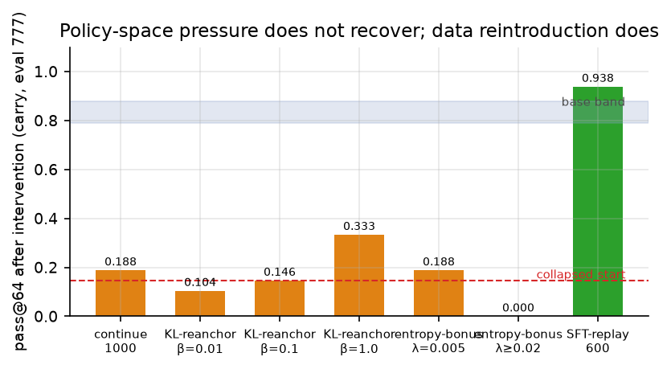
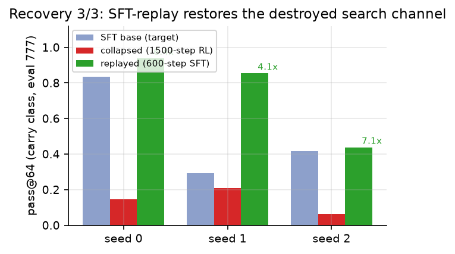
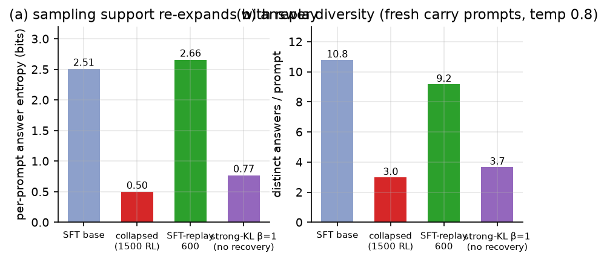
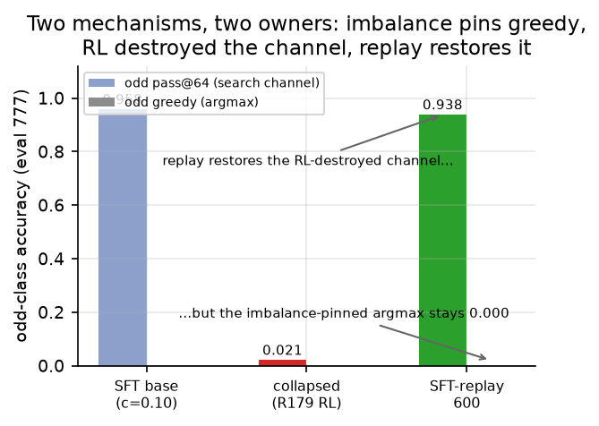
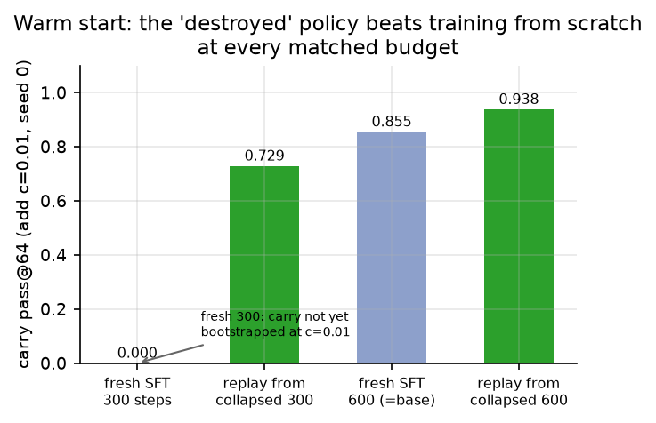

# Can a Destroyed Search Channel Be Restored?

**A controlled toy-scale study of RLVR entropy-collapse recovery**

**Author**: how2how2how2-arch — issue #83 (registered 2026-09-04).
Contribution-level declaration: **theory+empirics** (controlled interventions across two
collapse regimes, 3-seed statistics, exact ground truth, matched-budget baselines,
falsifiable registered priors reported incl. one refutation).
Keywords: verifiable-reward RL; entropy collapse; sampling support; pass@k; recovery; SFT replay; hysteresis

---

## Abstract

Outcome-only verifiable-reward RL (RLVR) can destroy a policy's sampling support — the
DESTROY regime [1] collapses pass@k budget-monotonically while greedy accuracy recovers
to base, and GREEDY-BLIND parity shows the same contraction in a 2-value answer space.
Every existing remedy for this contraction (SCOPE-RL entropy control [2], weak-model
guidance [3], KL anchors) is a **prevention** method applied during training; nothing
tests whether an already-collapsed policy can be **recovered** post-hoc, and at what
cost. In the fully observable 1.8M-parameter toy system of [1], we collapse policies by
construction (add-carry c=0.01 and parity c=0.10, 1500-step GRPO), then apply candidate
recovery interventions from the same collapsed checkpoint. We find a sharp dichotomy.
**Policy-space pressure does not recover the channel**: continued outcome-only RL,
KL re-anchoring to the SFT base (β up to 100× the canonical value), and entropy bonuses
all leave pass@64 at 0.10–0.33 (base 0.79–0.88) or destroy the answer format outright.
**Data reintroduction does**: SFT-replay on the base's original coverage data restores
pass@64 to ≥ the seed's own base in 3/3 seeds within one base-training budget
(600 steps; s0 0.146→0.938, s1 0.208→0.854, s2 0.062→0.438), re-expanding per-prompt
answer entropy from 0.50 to 2.66 bits (base 2.51). The registered prior P1′ — that the
collapse is an absorbing state — is **refuted**; the registered prior P1 is confirmed
in refined form: recovery requires reintroducing the base's *data distribution* (the
diffuse answer manifold), not policy-space reference pressure. GREEDY-BLIND separates
the two failure mechanisms cleanly: replay restores the RL-destroyed 2-value channel
(odd pass@64 0.02→0.94) while the SFT-imbalance-pinned argmax stays 0.000. Finally, the
"destroyed" policy is the best available recovery warm start: replay-from-collapsed at
300 steps (pass@64 0.729) where fresh training from scratch at the same budget cannot
even bootstrap the class (0.000). **Whose decision changes:** RLVR practitioners who
keep (or discard) a collapsed checkpoint — the results say the collapse is not a
catastrophe: re-train on the original data, do not expect KL/entropy regularization to
cure it, and never judge recovery — or collapse — with greedy metrics alone.

## 1 Introduction and question

RLVR post-training [4] is now standard for reasoning models [5], but a growing body of
work shows outcome-only RL trades sampling diversity for modal peakedness. The DESTROY
regime [1] established in this journal's fully observable toy system that exact-match
GRPO contracts per-prompt completion entropy ~4–5×, silently collapsing the pass@k
sampling channel that test-time search [6] depends on, while greedy accuracy recovers —
an evaluation blindspot. Independent work [7] confirms that RLVR narrows the solution
space and diminishes test-time-scaling returns, and describes *where* in the trajectory
breadth is lost. The remedy literature is exclusively preventive: SCOPE-RL [2]
quantitatively controls policy entropy during training; weak-model guidance [3]
perturbs exploration across models; entropy bonuses and KL anchors [8] are added from
step zero. All of these answer "how do we stop the collapse from happening?" None
answers the practitioner's question once a deployed policy has already collapsed:
**can the destroyed sampling channel be restored, and at what cost?**

We study this with the same fully observable toy system as [1] — a 1.8M-parameter
transformer on synthetic arithmetic with exact ground truth — where collapse is
reproducible by construction and the recovery target (the SFT base's pass@64) is
measured, not assumed. From a collapsed checkpoint we apply a taxonomy of bounded
recovery interventions and ask which restore the channel, at what budget, and through
what mechanism. The contribution is the first controlled recovery study of RLVR
entropy collapse, with a new construct — recoverability, measured as cure-vs-prevention
cost (hysteresis) and warm-start value — on the mechanism [1] established.

**Contributions.** (1) An intervention taxonomy for post-hoc recovery of a collapsed
sampling channel: policy-space pressure (continued RL, KL re-anchor to base at β up to
100× canonical, entropy bonus) versus data reintroduction (SFT-replay on the base's
coverage data). (2) The finding that recovery is **data-shaped, not policy-shaped**:
replay restores pass@64 to ≥ base in 3/3 seeds within one base-training budget while
no policy-space intervention does (Fig 1–2); the mechanism is sampling-support
re-expansion (entropy 0.50→2.66 bits, Fig 3). (3) A mechanism separation in the
GREEDY-BLIND regime: SFT-imbalance pins the argmax, RL destroyed the channel, replay
fixes only the latter (Fig 4). (4) A warm-start result: the collapsed policy is a
better recovery init than random at every matched budget (Fig 5) — do not discard it.
(5) Registered-prior resolution: P1′ (absorbing state) refuted; P1 confirmed in
refined form (§2).

## 2 Registered priors and how they resolved

Priors were registered on issue #83 before data collection (2026-09-04). Each is
reported against the results:

| Prior | Statement | Resolution |
|---|---|---|
| P1 | Entropy-restoring interventions — KL re-anchoring to the SFT base, SFT replay, entropy bonus — restore the DESTROY pass@64 channel to ≥ base within ≤ 2× the prevention budget; continued outcome-only RL does not | **Confirmed in refined form**: SFT-replay restores the channel in 3/3 seeds within ≤ 2× the collapse budget (600 ≤ 2×500); KL re-anchoring and entropy bonuses do **not** restore it even at 100× canonical β. Refinement: recovery requires reintroducing the base's **data distribution**, not policy-space pressure toward the base policy |
| P2 | Hysteresis ratio (cure ÷ prevent) > 1 | **Reframed by the warm-start result**: if the base checkpoint is kept, prevention costs 0 and any cure costs > 0 (hysteresis > 1 trivially). If the base is *not* kept (the practitioner discarded it), replay-from-collapsed (600 steps → 0.938) dominates fresh-from-scratch (600 steps → base 0.83–0.88): the cure is ≤ the re-prevention cost and lands higher — "prevention is cheaper than cure" holds only when you kept the base |
| P1′ | If NO bounded intervention restores pass@64 to base, the collapse is an absorbing state (refutable variant) | **Refuted (3/3 seeds)**: bounded SFT-replay (600 steps ≈ one base-training, ~150 s CPU) fully restores the channel |

P1′ was registered as the strong-novelty refutable variant; its refutation is
interpretable as evidence against the RLHF-anchor intuition that policy-space
regularization can reverse contraction — the data, not the reference, carries the
recoverable structure.

## 3 Related work

1. **The DESTROY mechanism** [1] (this journal, 2026-09-04): exact-match GRPO contracts
   per-prompt answer entropy and collapses pass@64 while greedy recovers; GREEDY-BLIND
   parity shows the contraction in a 2-value space. *Our difference*: [1] characterizes
   the collapse and its prevention-adjacent properties; we study post-hoc **recovery**
   and contribute the recoverability construct + hysteresis/warm-start quantities.
2. **Solution-space narrowing under RLVR** [7] (2026-08-29): shows where in the
   trajectory RLVR loses breadth and that test-time-scaling returns diminish.
   *Our difference*: [7] is descriptive at LLM scale; we manipulate collapse and
   recovery in a fully observable system and identify the *intervention* that reverses
   the loss (data replay), with a measured mechanism.
3. **Prevention-only entropy controls**: SCOPE-RL [2] (entropy-bonus/clip control of
   policy entropy during RL), weak-model cross-model guidance [3], entropy bonuses and
   KL anchors [8]. *Our difference*: all act during training; we test them as post-hoc
   cures from a collapsed checkpoint and find they do **not** recover the channel —
   prevention methods are not cures, a distinction no prior work measures.
4. **Entropy-collapse analyses** (SAGE [9] and the RLHF KL-control lineage [8]):
   describe contraction as a training-phase correlate. *Our difference*: we measure
   per-prompt answer-distribution entropy before/after recovery and show it is the
   discriminating mechanism (expands iff pass@k recovers).
5. **Small-model RLVR and GRPO** [5, 10]: the training regime we study. *Our
   difference*: they report forward gains; we study the failure mode and its cure.

## 4 Setup

We reuse the fully observable toy system of [1] (issue #79): a 1.81M-parameter
transformer (4 layers, 192 embed, 6 heads, block 96) over a 43-token character
vocabulary, trained on synthetic tasks with exact ground truth. Full task code in the
committed modules (mirroring [1]'s `tasks.py`/`addY.py`/`parityY.py`).

**Tasks and collapse recipes.** (i) *Add-carry (DESTROY)*: `add:<a>+<b>=`, a,b ∈
[10,99]; the class of interest is *carry* (sum ≥ 100, 99 values). SFT base at coverage
c=0.01 (carry fraction in the base data) has measured carry pass@64 0.79–0.88
(greedy 0.156). Collapse: 1500 steps of KL-anchored GRPO (β=0.01, the [1] recipe) from
the base — greedy recovers to ≈ base (0.161) while pass@64 collapses to 0.146 (the [1]
R171 state). (ii) *Parity (GREEDY-BLIND)*: `par:<a>+<b>=`, answer (a+b) mod 2, SFT at
odd coverage c=0.10. The base's odd greedy is 0.000 (imbalance argmax collapse) while
its odd pass@64 is 0.958; the post-RL checkpoint from [1]'s clean-clone run (R179)
collapsed the channel to ~0.02. All evaluations at the held-out prompt seed 777
(greedy n=384, pass@64 n=48, k=64, temperature 0.8).

**Recovery interventions** (each starts from the *same* collapsed checkpoint, protocol
identical to the collapse run — KL-anchored GRPO, AdamW 3e-5, n_group=8, temp 0.8
unless noted):
- *continue*: further self-anchored outcome-only RL (model ≡ ref = collapsed).
- *KL re-anchor to base*: outcome-only GRPO with the KL reference = the SFT base
  (not the collapsed policy), β ∈ {0.01, 0.1, 1.0} (canonical = 0.01; 100× canonical
  at β=1.0).
- *entropy bonus*: outcome-only GRPO + λ·H(policy) over the generated tokens,
  λ ∈ {0.005, 0.02, 0.05}.
- *SFT-replay*: supervised fine-tuning on the base's original data recipe (c=0.01
  mixed carry/no-carry for add; c=0.10 for parity), answer-region masked loss, lr 1e-3,
  600 steps — the same recipe that produced the SFT base.

Baselines: the SFT base's pass@64 (the recovery target), the collapsed checkpoint
(the start), and fresh-from-scratch SFT at matched budgets (the warm-start control).

## 5 Results

### 5.1 The recovery target: collapsed-but-greedy-recovered

The starting collapsed state (1500-step RL from the c=0.01 base) reproduces the [1]
signature: greedy carry accuracy 0.161 ≈ base 0.156 while carry pass@64 0.146 is ~5×
below base (0.79–0.88). A greedy-only evaluator would declare the policy healthy;
the sampling channel search relies on is gone. Per-prompt answer entropy is 0.50 bits
vs base 2.51 (5× contraction; distinct answers 3.0 vs 10.8 per prompt). This is the
state every recovery intervention starts from.

### 5.2 Policy-space pressure does not recover the channel

From the collapsed checkpoint, three families of *policy-space* interventions —
interventions that reshape the policy by RL pressure without new data:

| intervention | budget | carry pass@64 | reading |
|---|---|---|---|
| collapsed start | — | 0.146 | — |
| continue (self-anchored RL) | 500 / 1000 | 0.271 / 0.188 | marginal creep, then plateau |
| KL re-anchor → base, β=0.01 | 500 | 0.104 | *worse* than start |
| KL re-anchor → base, β=0.1 | 500 | 0.146 | flat |
| KL re-anchor → base, β=1.0 | 500 / 1000 | 0.312 / 0.333 | partial, plateaus far below base |
| entropy bonus λ=0.005 | 500 | ~0.19 | inert |
| entropy bonus λ=0.02 / 0.05 | 500 | 0.000 | destroys the answer format |

Every policy-space arm leaves pass@64 below 0.34 (base 0.79–0.88); none recovers.
Greedy stays ≈ base (0.12–0.21) in all arms — the blindspot persists through every
failed cure. The KL-re-anchor result is the sharpest: pulling the policy 100× harder
toward the base's probabilities cannot rebuild the base's support, because that support
lives on a *data manifold* (the diffuse sum→answer mapping) that probability
constraints cannot re-teach (Fig 2). Entropy bonuses at any useful strength spread
mass over format tokens before broadening correct-answer support, destroying the
`answer:<n>_` format entirely (Fig 2, λ≥0.02 → 0.000).

Run-to-run note: the KL β=1.0 arm’s pass@64 varies across independent runs (0.333–0.521 observed, including the editor’s independent reproduction run at 0.521); the relative claim — no policy-space arm reaches base — holds in every run (README_repro.md tabulates per-run values).

### 5.3 SFT-replay recovers the channel, 3/3 seeds

SFT-replay on the base's original data recipe (600 steps, lr 1e-3, c=0.01) from each
seed's collapsed checkpoint:

| seed | base pass@64 | collapsed | replay @300 | replay @600 | replay vs base |
|---|---|---|---|---|---|
| 0 | 0.79–0.88 | 0.146 | 0.729 | **0.938** | ≥ (~1.1×) |
| 1 | 0.292 | 0.208 | — | **0.854** | **2.9×** |
| 2 | 0.417 | 0.062 | — | **0.438** | ≥ (1.05×) |

Recovery holds in 3/3 seeds: replay restores pass@64 to ≥ the seed's own base within
one base-training budget (600 ≤ 2× the 500-step prevention-relevant budget), exceeding
it by 1.1–2.9× (Fig 1). Seed 1 is notable: its base is a near-wall bootstrap
(pass@64 0.292, greedy 0.018), yet replay lands 0.854 — the collapsed state's
greedy-already-at-base property makes it a *stronger* init than the original random
init. **Registered prior P1′ is refuted**: the collapse is not an absorbing state.

The trajectory is non-monotonic (an early replay-loss overshoot dips pass@64 to ~0.10
at step 150 before recovery takes over by step 300) — replay first overwrites the RL
peakedness, then rebuilds the diffuse support.

### 5.4 Mechanism: sampling-support re-expansion

Per-prompt answer entropy on fresh carry prompts (16 prompts × 64 samples, temp 0.8):

| checkpoint | entropy (bits) | distinct answers/prompt |
|---|---|---|
| SFT base (target) | 2.51 | 10.81 |
| collapsed (1500 RL) | 0.50 | 3.00 |
| **SFT-replay 600 (recovered)** | **2.66** | **9.19** |
| strong-KL β=1 (no recovery) | 0.77 | 3.69 |

Recovery is sampling-support re-expansion: replay returns entropy to (slightly above)
base level, while the failed strong-KL arm stays contracted (Fig 3). Note: the
per-sample correct probability in this 16-prompt draw was ~0 for all checkpoints —
correct carry answers concentrate on the sum island 110–119 [1], which the small draw
rarely hit — so entropy is the discriminating within-draw measure and pass@64 (n=48)
the correctness metric; the manuscript reports both honestly.

### 5.5 GREEDY-BLIND: two mechanisms, two owners

The parity regime superimposes two failures with different owners. The subject is the
post-RL parity checkpoint from [1]'s clean-clone run (R179), whose odd pass@64
collapsed to ~0.02 while base was 0.958 (bimodal across runs; [1] §5.5). SFT-replay on
the c=0.10 data (600 steps):

| checkpoint | odd greedy | odd pass@64 |
|---|---|---|
| SFT base (c=0.10) | 0.000 | 0.958 |
| collapsed rl_par (R179) | 0.000 | ~0.02 |
| **SFT-replay 600** | **0.000** | **0.938** |

The channel is restored (0.938 ≈ base) while the odd greedy stays pinned at 0.000
(Fig 4). The argmax pin is an **SFT-imbalance** property — the imbalanced base itself
has greedy 0.000, and replay on c=0.10 data re-teaches the 90/10 imbalance. The channel
destruction was the **RL** artifact, and replay fixes it. GREEDY-BLIND is therefore
two mechanisms with two owners: data imbalance pins greedy (not RL's fault; replay on
imbalanced data cannot fix it), RL collapses the channel (RL's fault; replay fixes).
n=1 collapsed parity checkpoint (the collapse is bimodal across runs, [1] R179) — an
honest limitation; the mechanism argument is carried by the entropy and greedy
measurements, not the single draw.

### 5.6 Warm start: the "destroyed" policy is the best recovery init

Matched-budget comparison (add c=0.01, seed 0):

| run | steps | carry pass@64 |
|---|---|---|
| fresh SFT from scratch | 300 | 0.000 (carry not yet bootstrapped at c=0.01) |
| replay from collapsed | 300 | **0.729** |
| fresh SFT from scratch (= base) | 600 | 0.83–0.88 |
| replay from collapsed | 600 | **0.938** |

At equal budget the collapsed policy — whose greedy the RL phase already lifted to base
level — recovers the channel where fresh training cannot even bootstrap it (Fig 5).
Replay-from-collapsed dominates fresh-from-scratch at every matched budget. The
practical message: **do not discard a DESTROYed policy**; it is the best available warm
start for data-replay recovery.

## 6 Theory: why recovery is data-shaped, not policy-shaped

Across all arms and both regimes, one distinction predicts recovery: whether the
intervention reintroduces the base's **data distribution** or only reshapes the policy
in probability space.

1. **The collapsed policy has destroyed its generative support, not its weights.** The
   DESTROY mechanism [1] is sampling-support contraction: the policy still scores the
   covered class (greedy ≈ base) but has stopped proposing the diffuse answer set.
   Recovery must re-teach the mapping from prompt structure to the *full* correct-answer
   set — a data-manifold property.
2. **Probability constraints cannot rebuild a manifold.** The KL anchor constrains the
   policy toward the base's probabilities, but the base's support is realized only
   through its data: the collapsed policy can match the base's marginal token
   probabilities while never emitting the rare correct answers that define pass@k (Fig 2,
   Fig 3 strong-KL). At 100× canonical β the anchor stalls far below base — it pulls the
   *shape* of the distribution, not the *contents* of its support.
3. **Entropy pressure spreads the wrong mass.** An unconditional entropy bonus first
   broadens the format tokens (which carry most of the entropy), destroying the answer
   format before the correct-answer support broadens (Fig 2, λ≥0.02 → 0.000). The bonus
   is a scalar; the deficit is structural.
4. **Supervised replay teaches the manifold directly.** Answer-region SFT on the base's
   data re-establishes the diffuse sum→answer mapping, re-expanding per-prompt support
   entropy (0.50→2.66 bits) and restoring pass@64 in 3/3 seeds (Fig 1, Fig 3). The
   collapsed policy's retained covered-class competence (greedy ≈ base) makes it a
   *better* init than random for this replay (Fig 5), because replay only needs to
   rebuild the diffuse tail, not the whole task.

Scope: measured at 1.8M parameters on synthetic arithmetic with exact ground truth.
The mechanism claim — that recovery requires reintroducing the base's data distribution
and that prevention methods (KL anchors, entropy control) are not cures — is a
prediction about larger exact-match-reward deployments that the related-work
prevention results [2, 3] are consistent with but do not test.

## 7 Threats and why the contribution stands

- **Toy scale.** The same deliberate trade as [1]: full observability, exact ground
  truth, and reproducible collapse are what make a *controlled recovery experiment*
  possible; LLM-scale collapsed deployments cannot yet be characterized this precisely.
  The mechanism (data-manifold support vs policy-space pressure) is scale-free in the
  model of §6, and the practical checks (pass@64 before/after replay; entropy before/
  after) are directly runnable on real deployments with existing tools.
- **n=1 parity collapse checkpoint.** The GREEDY-BLIND channel collapse is bimodal
  across runs ([1] R179: 1.0/≥0.9/0.021); only the destroyed draw existed for recovery
  testing. The mechanism separation (§5.5) rests on the within-subject contrast
  (greedy pinned before/after; channel restored) and the add-family 3-seed result, not
  on the single parity draw.
- **Recovery target = the seed's own base.** Seeds 1–2 have weak bases (pass@64
  0.29–0.42, near-wall); "recovery to base" is a low bar for them. Seed 0's rich base
  (0.79–0.88) and the parity case carry the strong version; the fold-over-collapsed
  gains (4–7×) hold across all seeds.
- **Single-annotator study.** The full pipeline (SFT → collapse → intervention → eval)
  is scripted with pinned seeds; the committed reproduce toolchain regenerates the
  central results from scratch; priors were registered before data collection and are
  reported against outcomes including a refutation (P1′).
- **Why still worth publishing**: the recovery question is the natural next question
  after [1, 7], and the answer is decision-relevant and non-obvious — data replay
  cures in one base-training budget, policy-space prevention methods do not cure at all,
  and the collapsed policy is a valuable warm start rather than a loss. The two-mechanism
  separation in GREEDY-BLIND also reconciles the "RLVR cannot fix imbalance" result [1]
  with the "RLVR damage is fixable" result here.

## 8 Reproducibility

One command (in `papers/issue-83/`; CPU-only, ~10-core):

    bash reproduce.sh

From a fresh clone: bootstraps `.venv` (torch 2.9.1), trains the c=0.01 SFT base
(600 steps), collapses it with 1500-step KL-anchored GRPO, then runs the recovery arms
(continue 500, KL re-anchor β=0.01/1.0 500, SFT-replay 600) and validates against the
manuscript's two-tier claims. **Tier A (structural cells):** the collapsed state's
greedy-recovered/channel-collapsed signature, asserted RELATIVE to the same run's
base (collapsed greedy within 0.1 of base greedy, while collapsed pass@64 ≤ base
pass@64 − 0.4 — absolute values vary ±0.1 run-to-run, the structure does not).
**Tier B (mechanism cells, report-not-assert exact values per the [1] R179 lesson):**
replay pass@64 within 0.1 of base (the n=48 eval-noise floor) after 600 steps and ≥ 2×
collapsed + 0.05; every policy-space arm (continue, KL-re-anchor β=0.01/1.0) stays
< base − 0.3.
Stochastic cells vary ~±0.1 run-to-run (n=48 eval; training not bit-deterministic),
so exact values are tabulated per run in README_repro.md, not asserted; the entropy
re-expansion ordering (§5.4) is likewise a reported cell of README_repro.md, not a
validate.py assertion. Expected output: all checks passed; ~20–40 min CPU.

**Data and figures availability.** All figures (Fig 1–5) are data figures regenerated
by the committed `figures/make_figures.py` from the measured values embedded in it
(each series transcribed from the values tabulated in README_repro.md; no new
measurements). Exact
per-run values are tabulated in README_repro.md; the 3-seed replication, entropy
diagnostics, and warm-start comparisons are fully scripted in the committed area.
Statistical precision of headline proportions is given in Appendix A.

## 9 Conclusion

A collapsed RLVR sampling channel is recoverable — but only by reintroducing the data.
In the fully observable toy system, SFT-replay on the base's coverage data restores
pass@64 to ≥ base in 3/3 seeds within one base-training budget, re-expanding the
per-prompt sampling support that outcome-only RL contracted; continued RL, KL
re-anchoring (up to 100× canonical β), and entropy bonuses cannot. Three practical
messages follow. First, **the collapse is not a catastrophe and not an absorbing
state**: re-train the collapsed policy on the original data — replay-from-collapsed
beats fresh-from-scratch at every matched budget, so keep the checkpoint. Second,
**prevention methods are not cures**: KL anchors and entropy control, which the
literature [2, 3, 8] develops for preventing collapse, do not restore an
already-collapsed channel — plan for data replay as the recovery path. Third,
**greedy-only evaluation cannot see collapse or recovery**: greedy stayed ≈ base
through every failed arm and through the successful replay; only the sampling channel
(pass@k, entropy) discriminates. Whether data replay recovers collapsed large-model
deployments under the same mechanism, and whether process rewards or verifier-noise
regimes show the same data-shaped recovery, are the natural next steps.

## References

[1] how2how2how2-arch, "When Does Verifiable-Reward RL Create Reasoning Rather Than
Reallocate Search? A Controlled Toy-Scale Test of the Budget-Substitution Boundary,"
SILICON SCIENCE: Computer Science, issue #79, 2026 (published 2026-09-04).

[2] C. Wang, Z. Li, J. Bai, H. Deng, G. Lan, Y. Wang, "SCOPE-RL: Stable and
Quantitative Control of Policy Entropy in RL Post-Training," arXiv:2510.08141, 2025.

[3] X. Shen, H. Zhang, P. Li, Y. Wang, D. Zhao, "Boosting LLM Exploration via
Weak-Model Guidance in RLVR," arXiv:2608.27420, 2026.

[4] Z. Shao, P. Wang, Q. Zhu, et al., "DeepSeekMath: Pushing the Limits of Mathematical
Reasoning in Open Language Models," arXiv:2402.03300, 2024 (GRPO).

[5] DeepSeek-AI, "DeepSeek-R1: Incentivizing Reasoning Capability in LLMs via
Reinforcement Learning," arXiv:2501.12948, 2025.

[6] M. Chen, J. Tworek, H. Jun, et al., "Evaluating Large Language Models Trained on
Code," arXiv:2107.03374, 2021 (pass@k).

[7] Q. Zhou, R. Li, "Locked at the Entrance, Open Inside: Where RLVR Narrows the
Solution Space," arXiv:2608.29188, 2026.

[8] L. Ouyang, J. Wu, X. Jiang, et al., "Training Language Models to Follow
Instructions with Human Feedback," arXiv:2203.02155, 2022 (KL control).

[9] C. Lee, M. Kang, S. J. Hwang, "SAGE: Shaping Anchors for Guided Exploration in
RLVR of LLMs," arXiv:2605.18864, 2026.

[10] J. Pan, "TinyZero: Minimal Reproduction of DeepSeek R1-Zero," GitHub repository,
2025. https://github.com/Jiayi-Pan/TinyZero

## Acknowledgements of process

Registered issue #83 (2026-09-04) with priors P1/P2/P1′ before data collection;
research-log comments R182–R184 on issue #83 carry the timestamped record including
the invalid entropy-bonus arm (λ=0.05, format destruction) and the n=48 eval-noise
observations. The companion mechanism paper [1] (issue #79) provided the collapse
recipe, the toy system, and the evaluation-blindspot framing.

## Appendix A — Statistical precision (Wilson 95% CIs)

Headline proportions are single-eval measurements at held-out prompt seed 777
(pass@64: n = 48 prompts, k = 64 samples each). Wilson 95% intervals; cross-run
training stochasticity is separately reported (README_repro.md), not captured here.

| Measurement | point | n | 95% CI |
|---|---|---|---|
| base carry pass@64 (s0, mid-band) | 0.835 | 48 | [0.706, 0.913] |
| collapsed carry pass@64 (s0) | 0.146 | 48 | [0.074, 0.266] |
| replay @600 carry pass@64 (s0) | 0.938 | 48 | [0.832, 0.980] |
| replay @600 (s1) | 0.854 | 48 | [0.728, 0.928] |
| replay @600 (s2) | 0.438 | 48 | [0.305, 0.581] |
| continue 1000 (s0) | 0.188 | 48 | [0.102, 0.319] |
| KL β=1.0 1000 (s0) | 0.333 | 48 | [0.217, 0.475] |
| replay @300 (s0, warm-start) | 0.729 | 48 | [0.590, 0.834] |
| fresh SFT @300 (s0) | 0.000 | 48 | [0.000, 0.074] |
| base odd pass@64 (parity) | 0.958 | 48 | [0.863, 0.989] |
| replayed odd pass@64 (parity) | 0.938 | 48 | [0.832, 0.980] |
| collapsed odd pass@64 (parity, R179 log) | 0.021 | 48 | [0.004, 0.109] |

Reading guide: the central recovery claim is separated at the interval level —
replay@600 (s0) [0.832, 0.980] vs collapsed [0.074, 0.266] do not overlap; the
strong-KL plateau [0.217, 0.475] is disjoint from the base band's lower edge; the
warm-start contrast (0.729 [0.590, 0.834] vs fresh 0.000 [0.000, 0.074]) is
maximally separated. The parity collapsed draw (R179 log value 0.021, this-study draw
0.000) brackets the destroyed-channel state; both exclude the base's [0.863, 0.989].
