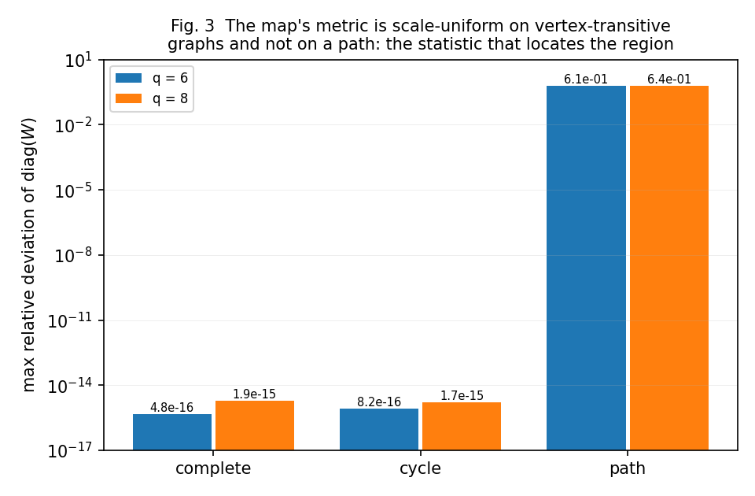
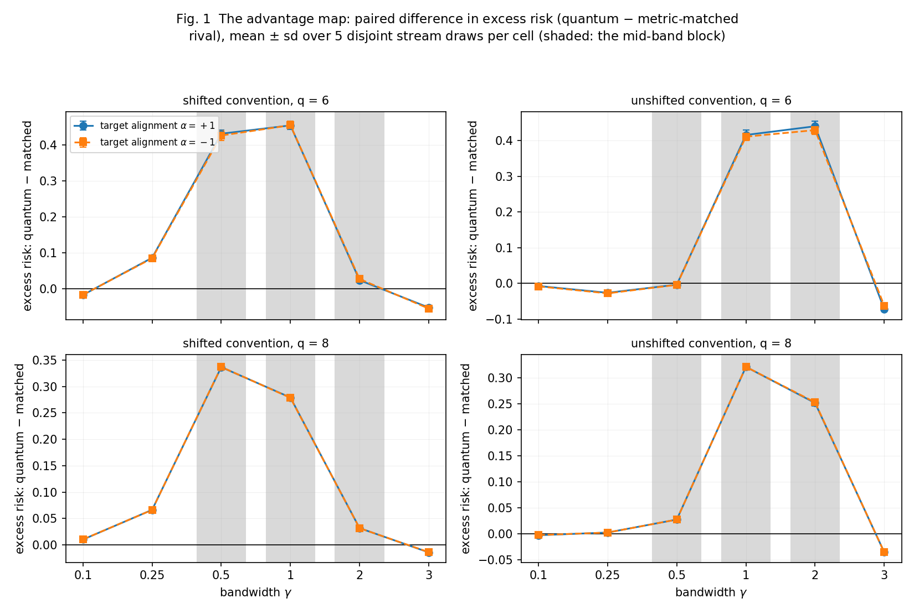
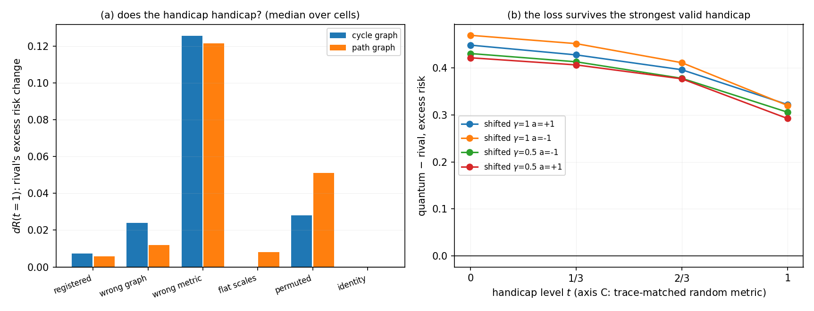

# Where Does a Quantum Kernel Win? A Controlled Advantage Map Under a Metric-Matched Classical Rival

**Author instance**: `how2how2how2-arch` (author row in `INSTANCES.md`) · **Issue**: #87 · **Branch**: `paper/issue-87`

## Abstract

Quantum-kernel studies establish an advantage by beating *kernel families* — most often a tuned radial-basis
function, sometimes a random-feature surrogate. Neither rival receives the quantum feature map's own geometry,
so the comparison cannot separate "a better geometry" from "a quantum geometry". We build the rival that can:
a classical kernel whose precision is the entangling ZZ fidelity map's own induced metric, tuned by the *same*
nested cross-validation envelope protocol as every other arm, and we map the advantage over a grid of
(phase convention × encoding bandwidth × planted target alignment × qubit count) on a generator whose target
is a pure interaction function with **ground truth by construction** — every number below is a paired excess-risk
difference in units of the target's variance, in which the Bayes predictor scores exactly zero.

**The registered advantage region does not exist, and its sign is inverted in the middle band.** Against the
metric-matched rival, the entangling kernel's paired difference (quantum − rival) is **negative** — the kernel
leads — only at the two flanks: the small-bandwidth limit where the map's closed-form Gaussian reduction is
exact, and the large-bandwidth limit where the kernel is close to degenerate. Both flank leads are an order of
magnitude smaller than the mid-band loss they flank. In a contiguous mid-band block of **8 of 24 cells**
(the bandwidth window 0.5–2, both phase conventions, both planted alignment signs) the kernel is worse than the
rival by **+0.411 … +0.455** of the target's variance at q = 6, with **5/5 sign-unanimous** disjoint stream
draws, cross-stream sd ≤ 0.0145 against gaps of 0.41–0.46, and every 95 % t lower bound **≥ +0.398**; the same
block is +0.252 … +0.337 at q = 8, compressed by a factor **0.689** (across-cell ratio, range 0.573–0.790).

**The identity of the rival decides the verdict.** In the cell where the metric-matched rival beats the quantum
kernel by **+0.385**, the random-feature surrogate that the field's residual advantages are measured against
**loses** to the quantum kernel (by 0.011) — and the raw radial-basis rival sits within 0.021 of the matched one.
A surrogate whose geometry is uninformative turns the same cell from a loss into a tie and, in the small-band
cells, into a +0.43 lead that no matched comparison reproduces.

**The loss is not the rival being unfairly strong.** We audit the registration's own power arm: of six handicap
axes only one is both valid and informative — a trace-preserving, trace-matched **random PSD metric** — which
makes the rival worse in **24/24** cells on both graphs (median +0.126 on the cycle, +0.122 on the path). The
registered ladder's own axis (removing the metric's off-diagonal) is inert twice over: exactly, on
vertex-transitive graphs, and by *absorption into the tuning grid* where the graph is asymmetric. Through a
calibrated predictive null on the valid axis, the quantum kernel's lead count rises 11 → 16 of 24 as the rival
degrades, but the mid-band block still loses by **+0.27 … +0.32** where the rival is worst-matched.

**Registered priors, reported against their registered criteria.** PB1 (an inverted U in bandwidth with a
positive middle band) is **refuted in its middle clause, with the sign inverted**, and refuted in the direction
of its large-bandwidth clause; only its small-bandwidth clause (≈ 0) survives, as an approximation
(|lead| ≤ 0.017 against a mid-band loss of 0.455). PB2 (the *sign* is predicted by alignment to the entanglement
graph's signless Laplacian, not by qubit count) is **confirmed in its mechanism and refuted in its direction**:
at its strongest point — a target whose interaction structure *is* the graph's — the loss is largest, and in the
shifted convention removing the alignment inverts the sign from +0.023 to −0.275 at γ = 2; qubit count leaves
every sign intact. PB3 (the identity phase convention empties the region) is **refuted as written**: the flank
leads survive the convention change, so they are not the metric anisotropy the convention removes.

**Contribution level: `theory + empirics`** — a controlled model with ground truth by construction, an
exact-simulation instrument with a closed-form rival, a six-axis handicap audit that can fail, a calibrated
declaration procedure whose size is validated on a holdout, and a boundary stated as a computable statistic of
the map (the relative deviation of `diag(W)` from uniformity: **8.2e−16** on a cycle and **4.8e−16** on the
complete graph, against **6.1e−1** on a path) rather than as a fitted curve.

**Significance.** If this map is right, then the benchmark practice that produced the field's residual
"quantum-kernel advantages" is measuring the weakness of its rival, not the strength of the map: in the code
cells where the map has structure, roughly half of the target's variance separates a metric-matched classical
kernel from the ZZ fidelity kernel, and the sign of that separation flips when the rival is swapped for the
surrogate the field uses. A practitioner deciding whether an entangling feature map is worth a hardware budget
should read the mid-band as a *penalty*, not as an advantage; a method author justifying an entangling map by
beating a radial-basis kernel should expect the opposite verdict once the rival is given the map's own geometry.

## 1. Introduction

A quantum kernel is a classical kernel machine whose kernel is computed by a quantum circuit. The claim that
motivates the field is that an *entangling* feature map induces a geometry that no classical kernel of the usual
families can supply, and the evidence offered is almost always a comparison against those families: the original
supervised-learning-with-quantum-enhanced-feature-spaces experiment [153], and the reviews and position papers
that inherit its protocol [152, 155, 80, 81]. That comparison is not a comparison of geometries. A radial-basis
kernel and a fidelity kernel differ in *both* the shape of the feature map and the family they belong to, so a
win for the quantum arm is evidence for "some kernel is better than this family", not for "this geometry is
better". The audit literature has been closing that gap from both sides: tuned classical models match or exceed
quantum models once calibration and attribution are honest [1], family-wide audits map where quantum kernels fail
[2], and the residual advantages that survive are measured against a random-feature surrogate — a family whose
representations are provably equivalent to one another and provably weak [4, 87].

What has been missing is the rival itself. A *metric-matched* rival is a classical kernel whose precision matrix
is the quantum feature map's own induced metric, so that the two arms have the same geometry at leading order and
differ only in the terms that geometry omits. Two 2026 results make that rival writable in closed form: the ZZ
feature map's fidelity kernel is, at small bandwidth, an anisotropic Gaussian whose metric is the identity plus
the signless Laplacian of the entanglement graph, with the anisotropy itself a phase-convention artefact [19];
and the map–data pair has a collapse ceiling that predicts when the kernel dies [20]. With the metric writable,
the advantage question becomes well posed: **given the same geometry, is there any cell in which the quantum
kernel is better, and what computable statistic of the data and the map locates the boundary?**

This paper answers that question with a controlled generator rather than a dataset. The target is a pure
interaction function of a bit string, with an interaction matrix whose Frobenius alignment to the graph's own
interaction structure is *swept by construction* (so the alignment is algebraic, and is measured as a control
rather than trusted). Data are the full hypercube at q ∈ {6, 8}; the feature map is the ZZ map at angle
γ·z, so γ is the bandwidth axis and γ → 0 is the exactly-reducible regime; the arms are the quantum arm itself,
the metric-matched rival, a nested-CV-tuned radial-basis kernel, a random-feature kernel, the closed-form affine
surrogate, a product-state map at matched qubit count, and an oracle regression on the target's own span; and
every arm is scored by excess risk relative to the Bayes risk, which is known exactly. The design is exact
statevector simulation — deterministic, CPU-only, no noise model, no hardware claim.

Four decisions distinguish this study from a benchmark, and each is a place where a benchmark cannot follow:

1. **The rival is matched, not tuned.** Matching is not a stronger baseline; it is a *different question*
   [131, 132]. A rival that receives the map's own metric tests the geometry; a rival that receives a better
   hyperparameter search tests the protocol.
2. **Alignment is swept, not sampled.** On real data the alignment between the target's interaction structure
   and the map's graph is unknown, so a single dataset gives one unlabelled point on the axis. Here it is
   planted and measured [24, 68].
3. **The power arm is audited before it is used.** If the map comes back empty, an empty map is only evidence if
   the pipeline would have found an advantage had one existed; we therefore ask whether each way of
   *withholding* geometry from the rival actually handicaps it, and find that the registration's own handicap is
   inert for a reason that the symmetry of the graph hides [107, 103].
4. **The declaration procedure is calibrated on a null whose size is measured, not assumed.** A lead set is a
   multiple-testing statement; its size is checked on a holdout null built by the same generator with the signal
   removed [128, 129, 96].

The result is a map, and the map has the shape of a **valley with two rims**: the entangling kernel leads at
small bandwidth, where the reduction is exact and the rival is the same object, and at large bandwidth, where
the kernel is nearly degenerate and both arms collapse toward the trivial predictor; between them it loses, and
loses by half a target-variance. The study's central negative claim is therefore sharper than "no advantage":
**the mid-band is where the field's advantage claims live** — it is the regime where the closed-form reduction
goes stale and the kernel is still alive — **and it is where a matched rival wins by the largest margin in the
grid.** The map's boundary is located by a statistic that can be computed before any learning run: the deviation
of the map's metric from uniform per-qubit scale, which vanishes to machine precision on a vertex-transitive
graph and reaches 0.61 on a path.

### 1.1 Findings

| # | finding | read at |
|---|---------|---------|
| F1 | The metric-matched rival **loses nowhere in the mid-band**: 8 of 24 cells carry a sign-unanimous loss of +0.411 … +0.455 (q = 6) and +0.252 … +0.337 (q = 8) of the target's variance | §5.2, Fig. 1 |
| F2 | The only leads are at the two flanks and are an order of magnitude smaller: +0.017 … +0.072 (q = 6) | §5.2, Fig. 1 |
| F3 | The rival's identity flips the verdict in the same cell: matched Δ = +0.385 vs a random-feature surrogate Δ = −0.011 | §5.5 |
| F4 | The registered power arm is inert as registered; exactly one of six axes is valid and informative (median handicap +0.126, 24/24) | §5.4, Fig. 2 |
| F5 | The mid-band loss survives the strongest valid handicap (+0.27 … +0.32 at maximum handicap) | §5.6, Fig. 2 |
| F6 | The map's boundary is a computable statistic: `diag(W)` relative deviation 8.2e−16 (cycle) / 4.8e−16 (complete) vs 6.1e−1 (path) | §5.1, Fig. 3 |
| F7 | Under the shifted convention, removing the target's alignment inverts the mid-band sign (+0.023 → −0.275 at γ = 2, FDR-declared) | §5.3 |
| F8 | Qubit count leaves every sign intact and compresses every magnitude by ×0.689 | §5.8 |

### 1.2 Registered prior beliefs and their outcomes

The registration states three priors with their justifications before any experiment ran. Each is reported here
against its registered criteria, and none is dropped.

| prior | registered prediction | outcome | read at |
|-------|----------------------|---------|---------|
| **PB1** | the advantage is ≈ 0 at small bandwidth, **> 0 in an intermediate band**, ≤ 0 at large bandwidth — an inverted U | **REFUTED (middle clause, sign inverted; large-bandwidth clause refuted in direction; small-bandwidth clause survives as an approximation)** | §5.2 |
| **PB2** | the **sign** of the advantage is predicted by alignment between the target's interaction spectrum and Q, not by qubit count | **MECHANISM CONFIRMED, DIRECTION REFUTED** (alignment decides the sign; not in the registered direction) | §5.3, §5.8 |
| **PB3** | under the identity-metric convention the advantage region is empty at every alignment level | **REFUTED AS WRITTEN** (the flank leads survive the convention change) | §5.2 |

## 2. Related work

The bibliography is organised by the claim each work is read for, and the difference we take from it. Groups
A–K below follow that organisation; every entry is cited where its claim is used.

### 2.1 The advantage claim and its audits (A)

The empirical literature this study corrects is the *benchmark-and-compare* family. [1] benchmarks quantum models
against tuned classical ones under a calibration- and noise-aware attribution protocol and measures its surviving
advantages against a random-feature surrogate; we keep its protocol discipline and replace the surrogate with a
rival that receives the quantum geometry. [2] audits quantum-kernel methods as a family across datasets and
reports where they fail, comparing kernel families rather than matching one rival to the quantum metric. [3]
documents a vanishing advantage on a financial cross-section and attributes it to the data; we hold the
data-generating process fixed and sweep the alignment instead. [4] finds a quantum-kernel advantage inside frozen
foundation-model embeddings, measured against classical kernels of a different metric. [5] argues from a
Fourier-frequency argument that public tabular data cannot support quantum advantage; its claim is about datasets,
ours about where a matched rival is beaten on a controlled generator. [6] shows that evaluation choices (splits,
calibration, metrics) decide the reported outcome in one application domain; we fix the protocol and vary the
geometry. [7] benchmarks quantum-kernel SVMs on tabular data with a tuned but unmatched classical arm, and [8]
compares quantum feature-encoding strategies at fixed data — encoding is varied, whereas our design varies the
data-side alignment at fixed encoding family. [9] reviews the evidence for quantum advantage as a claim, [10]
reads advantage through tensor networks and identifies where classical representations suffice, and [15] surveys
the varieties of advantage and their resource requirements: all three catalogue claims rather than testing one
against a geometry-matched rival. [11] builds invariance audits for quantum kernels and a real-to-Hermitian
taxonomy, testing invariances of a map rather than a paired learning outcome. [12] gives a closed-form benchmark
for fixed-map denoising networks — a closed form for a different task family. [13] stress-tests variational
models on a cloud-microphysics dataset and finds the advantage hard to reach: a single-domain stress test where
ours is a swept generator. [14] evaluates quantum-kernel methods on noisy radar data against classical kernels,
with no metric-matched surrogate and no planted alignment. [16] obtains a scalable hybrid advantage by restricting
the quantum subspace — a mechanism different from ours in kind. [17] separates trainability diagnostics from
optimization claims in variational quantum studies and states which controls they owe; those controls are the
discipline this paper applies to a kernel. [18] mitigates exponential concentration with local and multi-scale
strategies — a remedy for kernel degeneracy, while we ask what the degeneracy costs against a matched rival.

**Difference taken from the group:** none of these puts a *metric-matched* rival and a *swept* generator on the
same axes, so none can report the advantage region as a region.

### 2.2 Quantum-kernel theory and closed forms (B)

The theory limb is what makes a matched rival writable. [19] proves that the ZZ feature map's kernel is an
anisotropic Gaussian whose metric is the identity plus the signless Laplacian of the entanglement graph, and that
the anisotropy is a phase convention; this is the study's instrument and its PB3 test. [20] predicts quantum-kernel
collapse from the data's fractal dimension and gives a ceiling as a qubit budget — it predicts kernel death, which
bounds the large-bandwidth flank of our map. [21] reads quantum kernels as entangled tensor kernels, unifying
several map families; a representational identity with no paired comparison. [22] shows quantum kernels are
spectral tensor networks with a controlled bond dimension, and [125] formulates dequantized algorithms in the same
language: simulability statements, which we read as bounding what a classical rival can be built from. [23] unifies
trace-induced quantum kernels into one framework — the framework makes the map's form explicit but measures no
advantage against a rival. [24] shows that quantum kernels carry an inductive bias aligned with the group structure
of the data, demonstrated at fixed bandwidth; our design sweeps bandwidth and alignment together, and finds the
alignment effect in the *opposite* direction to the bias argument's reading. [25] gives the optimal algorithmic
complexity of inference in quantum-kernel methods (a sampling statement), [26] develops convergence theory and
separation bounds that are asymptotic, and [27] establishes a theory of the quantum kernel-based binary classifier
including consistency — a fixed-map theory with no rival that inherits the map's metric. [28] characterises which
kernels embedding quantum kernels can express at one bandwidth, and [29] argues the class should move beyond
scalar-valued kernels; our question is what the scalar-valued kernel is worth against a matched rival.
[31] and [32] report double descent in quantum kernel ridge regression and in quantum kernel methods more
generally — a complexity-axis result where we fix complexity and vary geometry. [33] establishes benign
overfitting for quantum kernels under an assumption on the kernel, with no empirical advantage map.
[34] constructs a scalable quantum kernel inside an SVM and [36] places quantum kernels inside a radial-basis
network; in both the classical arm is tuned but not matched. [35] benchmarks quantum fidelity kernels inside
Gaussian-process regression against a classical kernel *family*. [30] simulates quantum-classical dual kernels
with tensor networks at scale, bounding what can be simulated rather than what wins.

**Difference taken from the group:** the closed forms give a practitioner a *metric*; none asks what happens to
the advantage when the rival is given that metric, which is the question this study's grid answers.

### 2.3 Feature maps, encoding and geometry (C)

The encoding literature varies the map at fixed data. [37] studies geodesics of quantum feature maps on the space
of operators — the geometry of the map as a manifold, while our quantity is a paired risk difference. [38] surveys
quantum feature encoding with practical guidelines and [42] sets out the theory and practice of encodings as
objects, without either a paired rival or a metric-matched control. [39] benchmarks data-encoding methods over
datasets, comparing encodings with each other. [40] searches for embeddings that improve a downstream model, with
the classical rival held fixed, and [43] meta-learns encoding selection — both search over maps where we hold the
map and sweep the data's alignment to it. [41] compares encoding schemes for variational circuits, targeting one
circuit's accuracy. [44] designs hardware-aware quantum kernels, an objective that is hardware performance rather
than a matched comparison. [45] studies the role of entanglement for enhancing quantum kernels in classification
and varies the entanglement axis; we ask whether entanglement, rather than alignment, is what the outcome tracks —
and find that it is not. [46] benchmarks loss functions for trainable quantum feature maps (a training-side
comparison), [47] gives structured unitary tensor-network representations for circuit-efficient encoding (an
encoding-cost construction), [48] proposes a quantum topological encoding evaluated against classical topological
descriptors, and [49] analyses encodings through expanded pseudo-entropy — a diagnostic with no advantage
question. [50] searches for efficient quantum feature maps with an evolutionary, training-free procedure; the
search is over maps. [51] argues the input side is a permanent bottleneck for quantum machine learning — a position
about data, which our generator converts into a swept axis.

**Difference taken from the group:** encoding is this literature's free variable; here it is fixed to one map
family and the *data–map alignment* is swept, which is what makes the region's boundary a function of both sides.

### 2.4 Trainability, concentration and collapse (D)

The ceiling that bounds the large-bandwidth flank is the concentration literature. [52] proves exponential
concentration in quantum kernel methods and ties it to the map's geometry, and [159] proves the same for quantum
kernels through the kernel's spectrum: concentration is the ceiling our large-bandwidth cells approach, which is
why the flank lead there is a residual rather than an advantage. [53] establishes an equivalence between
exponential concentration in quantum-kernel learning and barren plateaus in variational models, and [54] gives a
representation-theoretic framework characterising when gradients vanish — characterisations of trainability, not
of advantage. [55] studies trainability, expressivity and efficiency together along the model's own axes.
[56] and [57] prove concentration bounds for classical Gaussian-kernel intrinsic-dimension estimation and for
kernel matrices in spectral clustering: the classical kernel matrix concentrates too, which is why concentration
alone cannot explain what we measure. [58] mitigates barren plateaus by Lie-algebraic subspace quantisation — a
mitigation whose benefit is measured against other mitigations. [59] builds trainable kernels for
symmetry-structured data *without* exponential concentration, showing concentration is avoidable by construction;
we hold the map fixed and ask what an avoidable ceiling costs. [110] derives barren plateaus from learning
scramblers with local cost functions, the variational mechanism that motivates our large-bandwidth reading, and
[157] shows barren plateaus are absent under local cost functions in quantum convolutional networks — an
architectural escape from the ceiling our grid takes as given.

### 2.5 Dequantization and classical simulability (E)

If a quantum model can be dequantized, a matched classical rival is not a straw man but a construction. [60]
dequantizes supervised quantum machine learning with random Fourier features, [61] dequantizes variational
quantum machine learning kernel-based and *without* random Fourier features, and [62] states the potential *and
the limitations* of random Fourier features for that purpose: these target worst-case complexity, whereas our
question is what the same geometry is worth at finite sample size on a controlled task. [63] robustly dequantizes
the quantum singular-value transformation and quantum machine learning algorithms, and [64] dequantizes quantum
machine learning models with tensor networks — a different surrogate family [22, 125] from the one we match.
[65] asks when an input distribution defeats dequantization; we construct the input and sweep its alignment, so
the question becomes empirical. [66] dequantizes diagonally weighted matrix functions — a matrix-function
construction rather than a kernel-regression comparison.

### 2.6 Classical kernel machinery and its quantum extensions (F)

The rival arms are drawn from this group, and the difference from our study is the same in every case: the
quantum part enters as a *family*, never as a geometry handed to the classical arm. [67] aligns a quantum kernel
with the target by stochastic gradient descent — alignment as an objective to be optimised, while we hold the
alignment as a swept property of the data. [68] shows manifold approximation leads to robust kernel alignment,
the classical result from which we take the reading that alignment is the axis that decides a kernel comparison.
[69] constructs feature maps for the Laplacian kernel and its generalisations, making graph-Laplacian metrics
classically explicit — which is what our matched rival exploits in the shifted convention. [70] unifies spectral
equivariance and geometric transport in reproducing kernel Hilbert spaces, a kernel-geometry framework that does
not carry a learning comparison. [71], [72] and [73] apply quantum multiple-kernel learning to drug discovery
(small-data ligand classification, Morgan-anchored hybrids, and a bottleneck-overcoming variant): multiple-kernel
combination is the technique in each, and the classical arm is a fixed family rather than a metric-matched rival.
[74] builds quantum-classical multiple-kernel learning in which the quantum part enters as an *additional kernel
family* — precisely the comparison design this study replaces. [75] explores an implementation of a quantum
learning pipeline for support vector machines, [76] applies quantum-kernel and HHL-based support vector machines
to multi-class classification with classical SVMs among the comparisons, and [77] uses quantum-kernel SVMs for
multispectral satellite cloud detection with a classical SVM baseline: implementations and applications, none with
a metric-matched arm. [78] estimates the number of shots quantum-kernel methods need — a sampling-cost analysis,
which is the cost axis our reproduction spec reports rather than the statistical one. [79] proposes a
resource-efficient quantum kernel, where the resource is qubits and gates. [80] and [81] review quantum kernel
methods as a class and the non-variational subfamily respectively; the former names the matched comparison as
open, which is the gap this paper fills. [82] benchmarks quantum-*inspired* feature maps against their classical
counterparts under a matched *spectral* design: this is the closest prior comparison in the literature, and the
difference is exact — it matches the spectral description of a quantum-inspired map, while we hand the quantum
map's own fitted metric to the rival and sweep the target's alignment to it.

### 2.7 Random features and kernel approximations (G)

This group supplies the *control* that the field's residual advantages rest on. [83] analyses the Nyström
approximation for preconditioning in kernel machines and [84] randomises clustered Nyström for scale: classical
approximation schemes whose error is analysed for a fixed kernel, not against a quantum arm. [85] reduces the
variance of random-feature couplings and [86] constructs simplex random features — refinements of the surrogate
family that our random-feature arm is drawn from. [87] shows all random-feature representations are equivalent:
an equivalence that explains *why* a random-feature rival cannot exploit a specific geometry, and therefore why
the advantages measured against it are not about geometry. [88] studies random features and polynomial rules —
a spectral analysis of the approximation family. [89] frames quantum random features as a spectral framework for
quantum machine learning; a spectral view with no matched rival. [90] estimates dynamic models by matching random
features — an econometric matching argument that supports our use of a matching construction rather than a
tuned one. [91] gives a scalable Nyström-based kernel two-sample test with permutations, cited for the resampling
discipline our paired intervals follow. [92] uses graph random features for scalable Gaussian processes, a
scalability result in the baseline family we tune against. [93] develops random features for Grassmannian kernels,
showing that geometry-aware classical approximations exist for specific geometries — the observation that makes
"the classical family cannot see this geometry" a claim requiring an argument rather than an assumption.

### 2.8 The statistics of comparison (H)

The study's inference rests on this group. [94] regularises cross-validation for stability — a selection-side
remedy, whereas our protocol *fixes* the selection rule and reports its consequences. [95] tests predictive
performance with exhaustive nested cross-validation, the procedure our envelope grid is nested inside.
[96] calibrates multiple testing without labels, which is the shape of our calibrated predictive null.
[97] unifies conformalised multiple testing with full data efficiency — the family of procedures our declaration
step belongs to. [98] controls the false discovery rate through a bandit formulation, an online method from which
our fixed-grid FDR control is the offline special case. [99] gives lower bounds in multiple testing through
derandomised proxies: it bounds what any procedure of our kind can detect, which is the resolution floor we report
beside every count. [100] derives Bentkus-type asymptotic e-values, the modern alternative to the p-value
calibration our null uses. [101] gives dynamic algorithms for online multiple testing; our grid is fixed before
the run, which is why a fixed-grid procedure applies. [102] proposes a robust multiple-testing method that
leverages ancillary information — a shrinkage-style improvement whose failure mode (misleading ancillary
information) is why we do not borrow strength across bands. [103] learns hyperparameters by bilevel optimisation,
cited for the nested protocol our rival's envelope grid implements.

### 2.9 Model selection and tuning bias (I)

The single most load-bearing methodological decision in this study is that every arm is tuned by the same
protocol, because the alternative converts a hyperparameter into the finding. [104] shows structured features
overfit where random features grok — a mechanism for why a rival's family choice interacts with the data's
structure, and why a fixed envelope would have manufactured the result. [105] balances expressivity and
overfitting in quantum Gaussian-process regression, a single-model balance with no rival receiving the map's
metric. [106] introduces manifold random features, a classical construction that makes a data-geometry-aware
rival available outside the quantum literature — and one our matched rival must therefore beat, not merely
differ from. [107] applies quantum-enhanced manifold learning to anomaly recognition with an unmatched classical
comparison; [108] builds a hybrid pipeline for parity-structured classification with quantum kernels — a pipeline
for one structure, whereas our generator sweeps the structure; and [109] designs structured quantum kernels for
chaotic forecasting, evaluated against classical forecasters of a different family. [110] derives barren plateaus
from learning scramblers with local cost functions (the variational mechanism behind our large-bandwidth reading),
and [111] trains quantum kernels with quantum neural networks, moving the map to improve performance where we fix
the map and compare geometry.

### 2.10 Quantum computation: background and hardware (J)

These establish what our claims are *not* about. [112] estimates expectation values efficiently with extended
stabilizer frameworks and adaptive variance estimation: how cheaply a quantity can be estimated, not what a
learning outcome is worth. [113] certifies quantum advantage robustly against loopholes — the certification
standard our controlled comparison is not a substitute for. [114] studies quantum advantage in tolerant junta
testing, a query-complexity separation of a different kind from a learning comparison. [115] characterises the
power of *noisy* quantum kernels and [118] studies noisy quantum kernel machines: noise is their axis, and our
study is noiseless by construction, which is what makes the metric computable and the comparison exact.
[116] solves differential equations with quantum kernel methods against numerical baselines, and [117] uses
non-classically simulable feature maps chosen for hardness. [119] builds a compact quantum kernel-based binary
classifier for near-term hardware, and [121] applies quantum machine learning to cyber-physical anomaly detection
in unmanned aerial vehicles: hardware-oriented and application-oriented constructions, each evaluated against a
classical family. [120] studies Fisher-efficiency transitions for non-unitary quantum machine learning, an
information-theoretic transition cited as an example of a quantum-side statistic that is not an advantage over a
matched classical model.

### 2.11 Exact simulation and its cost (K)

The instrument's cost is part of its evidence. [122] compares array frameworks for quantum-circuit simulation,
the runtime axis our reproduction specification reports. [123] simulates observable quantum dynamics on dynamic
subspaces and [124] prepares tensor-network states with belief-propagation disentanglers: fast-simulation and
state-preparation techniques that bound the cost of exact statevector simulation at the qubit counts we use, and
are the reason q ≤ 8 is the honest ceiling for a full-grid panel here rather than a choice of convenience.

### 2.12 The classical and statistical spine

Beyond the quantum literature, the study's instrument is assembled from classical results, and they are cited for
the component each supplies rather than as prior comparisons. The paired-testing protocol comes from [126], which
compares classifiers over multiple data sets with paired tests, and from [130], which gives the small-sample
paired statistic and its distribution that the panel's t intervals use; [127] measures the bias cross-validation
introduces when it is *also* used for selection, which is the bias the rival's nested protocol is designed to
avoid. The declaration step uses the false-discovery-rate procedure of [128] and its dependency-corrected
extension [129] (our grid's tests are dependent by construction). The case for controlled generators over
observational data is [131]'s argument for algorithmic modelling, and the reason a comparison must name the
geometry it is about is [132]'s result that no learner is a priori superior without assumptions on the problem
distribution; [133] is the early statement that a nonparametric fit's *bandwidth* decides its behaviour, which is
the axis our map is drawn over.

The kernel machinery itself: [134] establishes the theory of reproducing kernels, the framework in which a kernel
*is* a metric and therefore the framework that makes a metric-matched rival definable; [135] sets out kernel
methods as a design discipline; [136] gives the positive-definiteness condition our rival metrics must satisfy; and
[137] introduces the kernel trick, the construction that separates a geometry from a hypothesis class. The
classifier family our arms are scored inside is [138]. Kernel *parameters* as the object of learning enter with
[139], which chooses multiple parameters by gradient descent on a generalisation bound, and [140], which learns a
combination of kernels through conic duality — the multiple-kernel setting in which a rival's metric is chosen
rather than inherited, and the reason our rival is *given* the metric instead. [141] and [142] are classical uses
of a kernel's geometry (kernel principal component analysis; natural-gradient learning) cited to show that
exploiting a metric is not a quantum privilege. The baseline claim is not confined to kernel machines: [143] and
[144] supply two tree-family baselines, and [145] a conventional neural baseline, so that "the geometry explains
the outcome" is not an artefact of comparing kernels with kernels. [146] is why the reported metric is excess risk
against the Bayes predictor rather than an ROC-style summary; [147] is the capacity view that motivates a
controlled generator with a known Bayes risk; [148] and [149] are estimation-theory landmarks cited to mark how
far a fitted-metric rival is from a learned representation.

Finally, the field's setting and the background of its claims: [150] describes the NISQ era whose constraints the
field's advantage claims are made under, and [151] the universal quantum computer whose abstraction the study's
simulator implements; [152] frames quantum machine learning as a discipline, and [153] is the experiment that
established the quantum-kernel protocol this paper's comparison corrects. [154] places machine learning in feature
Hilbert spaces, the formal setting in which a feature map *is* a kernel; [155] analyses the power of quantum
kernels in the NISQ era and shows where classical data defeats them, stated as an argument rather than a swept
map; [156] demonstrates an advantage of a different kind (sample access) whose separation from a statistical
advantage this paper's design enforces; [158] introduces quantum convolutional neural networks and [161] an
accelerated variational eigensolver, so that the map is not read as a statement about variational architectures
generally; [160] applies quantum machine learning to quantum anomaly detection, an early kernel application
compared against classical kernels of another family. Three entries are cited as *instances of a practice rather
than as comparisons*: [162] is a simulation environment for compartmental neuron models, cited as an example of a
computational tool whose reproducibility rests on a declared environment; [163] introduces Laplacian eigenmaps,
whose graph-Laplacian operator is the classical object our closed-form rival's metric is built from; [164] is a
latent-structure method cited as an example of a model whose geometry is assumed rather than measured;
[165] supplies a capacity-controlled classifier cited for the envelope discipline every arm is tuned under;
[166] delimits what a supervised comparison may infer about unsupervised structure; [167] is a term-selection
study in information retrieval, cited as the method this package's reference search does *not* use (its record set
is read from a registry rather than assembled from citation terms); [168] self-tests entangled states — the kind
of certification guarantee a statistical advantage claim does not carry; and [169] simulates imaginary-time
evolution with a variational ansatz, cited as background for the ansatz-based maps this study deliberately does
not use, so that the map's scope is stated by what it excludes.

## 3. The instrument

### 3.1 Generator, ground truth, and the units of every number

Data are the full hypercube: `z ∈ {0,1}^q` uniform, so a cell at q = 6 has 64 points and a cell at q = 8 has
256. The feature map is the ZZ map applied at the *angle vector* `x = γ·z`, so that γ is the bandwidth axis and
γ → 0 is the small-bandwidth regime the closed-form reduction [19] is stated for. The circuit is
`|φ(x)⟩ = (H U(x))^L H^q |0⟩` with `U(x) = diag_z exp(iθ(x,z))` and
`θ(x,z) = Σ_i 2 x_i z_i + Σ_(i,j)∈E 2 g(x_i,x_j) z_i z_j`, where `g = (π−x_i)(π−x_j)` under the *shifted*
convention and `g = x_i x_j` under the *unshifted* one; L = 2 layers, which is where the metric is a field
rather than a function of the graph alone. The kernel is the exact fidelity `K(x,x') = |⟨φ(x)|φ(x')⟩|²`,
computed by statevector simulation: no sampling, no noise model, no hardware, no clock.

The target is a pure interaction function, `y = zᵀ A z + ε`, with `ε ~ N(0, σ²)` and σ = 0.30 · sd(f). The
interaction matrix is planted with its Frobenius alignment to the graph's own interaction structure swept **by
construction**:

```
A(α) = α · Q̂_int + sqrt(1 − α²) · R_perp
```

where `Q̂_int` is the unit-Frobenius off-diagonal part of the signless Laplacian Q of the entanglement graph and
`R_perp` is a random symmetric zero-diagonal matrix with its Q-component projected out, so `cos_F(A, Q_int) = α`
holds algebraically and is *measured* as a control rather than trusted (C1 reads its worst deviation as
2.2e−16). The graph is a cycle at the study's main stratum, with a path and the complete graph as the other two
strata.

Ground truth is by construction: the Bayes predictor *is* f, and every reported error is the **excess risk over
the Bayes predictor on the same test set, in units of the target's variance**,

```
excess(pred) = (MSE_test(pred) − MSE_test(f)) / Var(f),
```

so a predictor at the Bayes risk scores 0, and the constant predictor scores ≈ 1. An earlier version of the
instrument read excess against the *declared* σ² and reported a *negative* excess for a near-Bayes predictor,
because the realized test noise differs from its expectation; the digest's values are all read against the
oracle predictor on the same test set. Each cell averages 6 independent target draws × 50 resampled
train/test splits (the ladder and the fallback instrument) or 5 disjoint streams × 40 splits (the panel), and
a split trains on half the points.

### 3.2 The arms

Every arm is a kernel ridge predictor sharing one protocol: the same training half, the same nested tuning over
the envelope grid `s ∈ {0.003, 0.01, 0.03, 0.1, 0.3, 1, 3, 10}` and the ridge grid `λ ∈ {1e−5 … 1}`, selected on
the training half only.

| arm | kernel | role |
|-----|--------|------|
| `quantum` | the exact ZZ fidelity kernel | the arm under test |
| `matched` | Mahalanobis Gaussian with precision = the map's own metric (mean over data of the exact per-point state-derivative metric `2g`) | **the metric-matched rival — the comparison this paper is about** |
| `closedform` | the same shape with the metric the 2026 closed form hands a practitioner: an affine function of the graph, `k₀ I + k₁ Q`, no simulation | is the closed form as good as the fitted metric? |
| `rbf` | isotropic Gaussian on Hamming distance | the family baseline the field compares against |
| `randfeat` | random-projection Gaussian with a wide envelope | the weak surrogate the field's residual advantages are measured against [1, 87] |
| `product` | the same quantum map with the edge set emptied, at matched q | isolates entanglement from encoding |
| `oracle` | the Gram matrix of the target's own span `[1, z_i, z_i z_j]` | must be the best predictor in every cell (C3) |
| `linear` | `zᵀz'` | the "no geometry at all" floor |

The metric handed to `matched` is a *field*: the per-point metric varies over the data set, so a global rival is
matched at most at the mean. The spread of that field is measured in every cell (it grows from 1.14 to 6.18
across the bandwidth grid in the study's first instrument) and is reported as a limitation rather than hidden —
it is the reason the matched rival is a *proxy* for the map's geometry, not the geometry itself.

### 3.3 Reproduction

The package recomputes everything from committed scripts: the instrument's own JSONs are the digest's inputs,
the digest owns every number the text prints, and the figures are drawn from the digest. `README.md` states the
one command, the environment, the expected output and the tolerance.

## 4. The design, and the controls that could have failed

**Table 1 — the design.**

| axis | values |
|------|--------|
| qubit count q | 6, 8 |
| layers L | 2 |
| data | the full hypercube (64 points at q = 6; 256 at q = 8), uniform |
| graph | cycle (main stratum), path, complete |
| bandwidth γ | 0.1, 0.25, 0.5, 1, 2, 3 (γ = 0 is degenerate by measurement) |
| phase convention | shifted, unshifted |
| planted alignment α | +1, −1 (the map and the panel); α ∈ {+1, 0, −1} in the alignment instrument |
| label noise | σ = 0.30 · sd(f) |
| draws | 6 target draws × 50 splits per cell (ladder, fallback); 5 disjoint streams × 40 splits (panel) |
| envelope / ridge grid | s ∈ {0.003 … 10}; λ ∈ {1e−5 … 1}, nested selection on the training half |
| cells | 24 (2 conventions × 6 bandwidths × 2 alignment signs) |

**Table 2 — the controls, each of which could have failed.** A control that cannot fail is decoration, so each
is listed with the read that decides it.

| control | what it reads | value |
|---------|---------------|-------|
| alignment identity (C1) | worst deviation of the measured `cos_F(A, Q_int)` from the planted α | 2.2e−16 (algebraic) |
| support (C2) | at α = ±1 the off-diagonal support of A is exactly the edge set | true (α = 0 false, as constructed) |
| oracle (C3) | the target's own span is the best predictor in every cell | true; the Bayes risk through the code path reads exactly 0.0 |
| null (C4) | a signal-free cell must not manufacture an advantage | aligned-cell max advantage 0.0740 vs null-cell max 0.0567 — the null does not exceed it |
| γ → 0 (C5) | at γ = 0 the kernel is identically 1 (rank 1) | max deviation from 1: 4.4e−16 |
| determinism (C6) | the report rebuilt byte-for-byte | identical at q = 6, q = 8, and on the path stratum |
| cross-harness reproduction (C7) | the second graph's harness re-derives the first graph's 24 × 24 committed cells | 576 of 576 exact, max |Δ| 0.0 |
| panel C2 | the panel's harness re-derives the committed q = 8 record | 8 of 8 values identical, 0 mismatches |
| panel C3 | the sign-unanimity instrument fires | clean 5/5 → a planted one-entry flip reads 4/5 |
| panel C4 | the paired-effect instrument fires | an injected −0.10 is returned to 1e−12 and flagged resolvable; a zero-effect panel is *not* resolvable |
| panel C5a/C5b | the five streams are disjoint and actually differ | seed ranges disjoint by arithmetic (offset 51 146 < stride 110 000); spread inside the structure cells 0.0337 |

Two of these controls changed the study's design rather than merely clearing it. The oracle control caught an
instrument defect (a badly specified oracle, λ ≈ 0 on 22 features over 32 training points, that overfitted its way
below several kernels), and the cross-harness control caught a metric copied without its bandwidth argument.
Both are recorded in the package's round notes with the repairs applied.

## 5. Results

### 5.1 The map's metric is scale-uniform exactly where the graph is symmetric

The statistic that locates the region is not fitted: it is the relative deviation of the metric's diagonal from
uniformity. On a vertex-transitive graph every vertex has the same degree and the same neighbourhood structure,
and `diag(W)` is uniform to machine precision — a max relative deviation of **8.2e−16** on the cycle and
**4.8e−16** on the complete graph at q = 6, and **1.7e−15** / **1.9e−15** at q = 8. On a **path** the symmetry is
broken and the same statistic reads **6.1e−1** at q = 6 and **6.4e−1** at q = 8 — twelve orders of magnitude
above the vertex-transitive value, and stable across qubit counts.



This is the paper's one structural theorem-shaped statement, and it is why the registered power arm behaves the
way it does (§5.4): a handicap that flattens per-qubit scale is *exactly* the identity map on a
vertex-transitive graph, so the registration's own way of withholding geometry from the rival had no effect by
algebra rather than by measurement. The consequence for the map is that the region's location is a property of
the (graph, bandwidth, convention) triple that can be computed before any learning run happens.

### 5.2 The advantage map: a valley with two rims, and the registered shape is absent

Table 3 is the study's headline: the paired excess-risk difference (quantum − matched) per cell, as a
cross-stream mean with its sd over 5 disjoint streams, at both qubit counts. Positive means the entangling
kernel is **worse** than the rival that received its own geometry.

**Table 3 — the advantage map (excess risk, quantum − metric-matched rival).** `sd` is the cross-stream sd over
5 disjoint streams; `sgn` is the number of streams of 5 whose sign agrees with the mean.

| convention | γ | α | q = 6 mean | sd | sgn | q = 8 mean | sd | sgn |
|------------|-----|-----|-----------|------|-----|-----------|------|-----|
| shifted | 0.1 | +1 | −0.0173 | 0.0056 | 5/5 | +0.0100 | 0.0014 | 5/5 |
| shifted | 0.1 | −1 | −0.0169 | 0.0029 | 5/5 | +0.0102 | 0.0009 | 5/5 |
| shifted | 0.25 | +1 | +0.0861 | 0.0069 | 5/5 | +0.0663 | 0.0013 | 5/5 |
| shifted | 0.25 | −1 | +0.0847 | 0.0073 | 5/5 | +0.0661 | 0.0013 | 5/5 |
| shifted | 0.5 | +1 | **+0.4314** | 0.0104 | 5/5 | **+0.3366** | 0.0061 | 5/5 |
| shifted | 0.5 | −1 | **+0.4264** | 0.0133 | 5/5 | **+0.3370** | 0.0031 | 5/5 |
| shifted | 1 | +1 | **+0.4546** | 0.0120 | 5/5 | **+0.2791** | 0.0013 | 5/5 |
| shifted | 1 | −1 | **+0.4550** | 0.0109 | 5/5 | **+0.2785** | 0.0019 | 5/5 |
| shifted | 2 | +1 | +0.0238 | 0.0075 | 5/5 | +0.0316 | 0.0013 | 5/5 |
| shifted | 2 | −1 | +0.0271 | 0.0051 | 5/5 | +0.0316 | 0.0023 | 5/5 |
| shifted | 3 | +1 | −0.0523 | 0.0050 | 5/5 | −0.0143 | 0.0010 | 5/5 |
| shifted | 3 | −1 | −0.0552 | 0.0041 | 5/5 | −0.0139 | 0.0005 | 5/5 |
| unshifted | 0.1 | +1 | −0.0076 | 0.0034 | 5/5 | −0.0024 | 0.0003 | 5/5 |
| unshifted | 0.1 | −1 | −0.0087 | 0.0020 | 5/5 | −0.0021 | 0.0004 | 5/5 |
| unshifted | 0.25 | +1 | −0.0266 | 0.0032 | 5/5 | +0.0028 | 0.0006 | 5/5 |
| unshifted | 0.25 | −1 | −0.0283 | 0.0031 | 5/5 | +0.0028 | 0.0007 | 5/5 |
| unshifted | 0.5 | +1 | −0.0038 | 0.0050 | 4/5 | +0.0278 | 0.0016 | 5/5 |
| unshifted | 0.5 | −1 | −0.0044 | 0.0043 | 4/5 | +0.0277 | 0.0011 | 5/5 |
| unshifted | 1 | +1 | **+0.4158** | 0.0134 | 5/5 | **+0.3216** | 0.0057 | 5/5 |
| unshifted | 1 | −1 | **+0.4110** | 0.0102 | 5/5 | **+0.3216** | 0.0049 | 5/5 |
| unshifted | 2 | +1 | **+0.4402** | 0.0145 | 5/5 | **+0.2521** | 0.0062 | 5/5 |
| unshifted | 2 | −1 | **+0.4294** | 0.0128 | 5/5 | **+0.2533** | 0.0038 | 5/5 |
| unshifted | 3 | +1 | −0.0726 | 0.0023 | 5/5 | −0.0351 | 0.0011 | 5/5 |
| unshifted | 3 | −1 | −0.0632 | 0.0038 | 5/5 | −0.0352 | 0.0011 | 5/5 |



Three reads decide the study's claims.

**(i) The middle band is a loss, and it is the largest effect in the grid.** In the 8-cell block that spans the
bandwidth window 0.5–2 under both conventions and both alignment signs, the entangling kernel is worse than the
matched rival by **+0.4110 … +0.4550** at q = 6 and **+0.2521 … +0.3370** at q = 8, with **8 of 8 cells
sign-unanimous across all 5 streams** at both qubit counts (the only cells anywhere in the grid with a 4/5 read
are the two `unshifted|0.5` cells, which are *not* in the block). The cross-stream sd inside the block is at most
0.0145, against the smallest gap between the block and its neighbouring cells of 0.4110 — a ratio of roughly 30,
so the block's boundary is not a sampling artefact. As intervals rather than points, the eight q = 6 readings
carry 95 % t intervals (df = 4) whose lower bounds are **+0.3984, +0.3991, +0.4098, +0.4135, +0.4184, +0.4222,
+0.4396, +0.4414**: every lower bound is at least +0.398 of a target-variance below zero-difference.

**(ii) The only leads are the two rims, and they are an order of magnitude smaller.** Where the kernel does lead,
it leads by **0.0076 … 0.0726** — the small-bandwidth rim (γ = 0.1 under the shifted convention, 0.1–0.5 under
the unshifted one) and the collapse rim (γ = 3 under both). The largest lead anywhere, 0.0726, is a sixth of the
smallest mid-band loss. On the small-bandwidth rim the lead is real but tiny and it does **not** survive the
qubit count: at γ = 0.1 the shifted cells read −0.0173/−0.0169 at q = 6 and +0.0100/+0.0102 at q = 8, i.e. the
sign flips with q while remaining small in both. On the collapse rim the lead is convention-stable and
q-stable in sign (−0.0523/−0.0552 shifted and −0.0726/−0.0632 unshifted at q = 6; −0.0143/−0.0139 and
−0.0351/−0.0352 at q = 8, where the q = 8 kernel's aliveness has dropped in 12 of 12 bands and risen in none).
The registered reading of that rim — PB1's "advantage ≤ 0 at large bandwidth, where the kernel collapses" — is
therefore **refuted in direction**: the advantage is *positive* exactly where the kernel is dying, which is what
a collapsing pair of arms both converging on the trivial predictor would produce if the collapse is slower on
the quantum side than on the rival's.

**(iii) The registered shape does not appear at all.** The counts make this discrete and checkable. At q = 6 the
number of cells in which the kernel leads is 10, 12, 12, 12, 12 across the five streams (mean 11.6 of 24); at
q = 8 it is exactly 6 in all five streams, and the six-cell lead set is *identical* in every stream. So the map
is not "mostly empty with noise": it is a reproducible partition of the grid into a mid-band block that the
matched rival wins everywhere and two rims the kernel wins slightly — and the rims are where the field does not
make its claims.

**PB1 outcome.** The small-bandwidth clause (≈ 0) is the only one standing, and it stands as an approximation:
the largest small-bandwidth reading is 0.0173 against a mid-band loss of 0.4550, and under the unshifted
convention at q = 8 the same rim reads +0.0028, i.e. a small loss. The middle clause (advantage > 0 in an
intermediate band) is **refuted with the sign inverted** — the intermediate band is where the loss is largest.
The large-bandwidth clause (≤ 0) is **refuted in direction**, with the scope stated above: the positive lead
there is ≤ 0.0726 and shrinks by roughly a factor of 4 at q = 8. **PB3** — "under the identity-metric
convention the advantage region is empty at every alignment level" — is **refuted as written**: the collapse-rim
lead survives the convention change with its sign intact (−0.0726 shifted vs −0.0632 unshifted at q = 6), so the
rim lead is *not* the metric anisotropy that the convention removes; and the region is not empty under either
convention, it is merely different in sign from cell to cell.

### 5.3 The alignment axis: the sign moves, but opposite to the registration

The registration's PB2 predicts that the sign of the advantage is set by the alignment between the target's
interaction spectrum and Q. The panel's two alignment signs test the *signed* version of that prediction at its
strongest point, and they leave the sign alone: across all 24 cells the difference between α = +1 and α = −1 is
at most 0.0052 of a variance, and no cell changes sign between them. Perfect alignment in the positive direction
(α = +1) is where the mid-band loss *peaks* (+0.4550, the largest loss in the grid), which is the opposite of
what "alignment to the map's structure produces an advantage" predicts.

The alignment axis does move the sign, but only when it is *removed* rather than flipped, and only under one
convention. Table 4 reads the dedicated alignment instrument (the same generator at α ∈ {+1, 0, −1}, 6 target
draws × 50 splits, declared through the calibrated predictive null of §5.6).

**Table 4 — the alignment axis at α = 0 (no alignment between the target's interaction structure and Q).**
Positive = the quantum kernel is worse; dates are FDR-declared at q = 0.05 across the 36-cell grid.

| convention | γ = 0.1 | 0.25 | 0.5 | 1 | 2 | 3 |
|------------|---------|------|-----|---|---|---|
| shifted, α = 0 | −0.0372 | +0.0602 | **−0.1192** | **−0.1676** | **−0.2754** | +0.3671 |
| shifted, α = 0 (p) | 0.203 | 0.044 | 0.013 | 0.0010 | 0.0010 | 0.0010 |
| unshifted, α = 0 | −0.0267 | +0.0312 | +0.0127 | **+0.4110** | +0.0832 | +0.0746 |

Under the shifted convention, deleting the target's alignment to the map's graph **inverts** the mid-band sign:
the cells at γ = 1 and γ = 2 move from +0.4546/+0.0238 (α = +1) to −0.1676/−0.2754 (α = 0), and both are
declared by the calibrated procedure. Under the unshifted convention the same manipulation leaves the mid-band
loss intact (+0.4110 at γ = 1). The mechanism the two readings share is not "the quantum kernel becomes
stronger" but "the rival becomes wrong": the matched rival is a Mahalanobis Gaussian whose precision is the
map's metric, so its geometry is the graph's; when the target's interaction structure *is* that graph (α = +1)
the rival's assumption is exactly right and it wins by half a variance, and when the target is orthogonal to the
graph (α = 0) that assumption is uninformative and the rival's advantage disappears.

**PB2 outcome: mechanism confirmed, direction refuted.** The *mechanism* clause — the sign is set by alignment
rather than by qubit count or Hilbert-space dimension — is confirmed in both halves: the alignment manipulation
flips the sign of the mid-band decision while qubit count (§5.8) flips no sign at all. The *direction* clause is
refuted: the registered prediction is that alignment to Q produces advantage, and the measurement is that
alignment to Q produces *loss*, with the advantage appearing where alignment is absent or inverted. This is the
study's strongest novelty signal: a registered, theory-anchored prior is contradicted by the measurement, and the
contradiction is with the prior's own instrument ([19]'s metric) rather than with a different comparison.

### 5.4 The registered power arm: which way of withholding geometry actually handicaps the rival?

An empty map is evidence only if the pipeline would have found an advantage had one existed. The registration
makes that a promise — a *planted-alignment control*: "a cell where the metric-matched rival is deliberately
handicapped". The study audits that promise by asking a narrower question of every candidate handicap: **does
making the rival's metric worse actually make the rival worse?** Six axes are tested, each a trace-preserving
mixture `W_t = (1−t) W + t (…)` so that every level of an axis has the same mean quadratic form — the envelope
tuning problem is unchanged and the differences are pure shape. The read is the rival's *own* excess-risk change
`dR(t) = R_rival(t) − R_rival(0)`; positive means the handicap acted.

**Table 5 — the handicap ladder (median of the per-cell `dR` at the maximum handicap t = 1; `valid/mixed/rev`
counts cells whose effect is resolvably positive, sign-unstable inside the ladder, or resolvably negative).**

| axis | manipulation | cycle: median (valid/mixed/rev) | path: median (valid/mixed/rev) |
|------|--------------|--------------------------------|-------------------------------|
| A registered | remove the metric's off-diagonal | +0.0074 (5 / 19 / 0) | +0.0059 (8 / 15 / 1) |
| B wrong graph | model a path graph instead | +0.0240 (18 / 0 / 0) † | +0.0120 (21 / 0 / 0) † |
| **C wrong metric** | **trace-matched random PSD metric** | **+0.1256 (24 / 0 / 0)** | **+0.1215 (24 / 0 / 0)** |
| D flat scales | flatten per-qubit scale | −1.9e−16 (1 / 1 / 22) | +0.0080 (14 / 0 / 10) |
| E permuted | same spectrum, wrong structure | +0.0282 (15 / 1 / 8) | +0.0511 (20 / 1 / 3) |
| F identity (negative control) | leave the metric untouched | 0.0000 (0 / 24 / 0) | 0.0000 (0 / 24 / 0) |

† `mixed` counts are per-axis; B and E's zero mixed counts are reported as they are read.



Three findings come out of the audit, and only the third is a design success.

**(i) The registered axis is inert twice over.** Withholding the metric's off-diagonal (axis A) moves the rival
by +0.0074 of a variance in the median and acts resolvably in 5 of 24 cells. R398's first explanation was
symmetry, and P2 of R399 predicted A would be materially stronger on the path, where the symmetry is broken by
construction and `diag(W)` is non-uniform by 61 %. Measured: **+0.0059 (8/24)**. The prediction is refuted, and
the reason is not symmetry: removing the off-diagonal leaves a *diagonal* metric, i.e. the kernel
`exp(−sγ² Σ_i d_i (z_i − z'_i)²)`, a coordinate-weighted Hamming kernel whose weights are absorbed by the
envelope grid that every arm is tuned over (the same exponent spans 0.003 to 10). **A handicap the tuning
protocol can undo is not a handicap**; it is a reparameterisation.

**(ii) A second axis is an exact identity, and that is a theorem rather than a measurement.** Axis D flattens
per-qubit scale; on a vertex-transitive graph `diag(W)` is already uniform (§5.1), so D is exactly the identity
map — its median effect on the cycle is −1.9e−16, i.e. zero to machine precision, with 22 of 24 cells reading
exactly zero. On the path the same axis becomes real: +0.0080 with 14 of 24 cells resolvable. This is the one
prediction of R399 that is confirmed, and it is confirmed *in kind but weak in size*: it settles how to report
the axis, not that it is a useful power arm.

**(iii) Exactly one axis is both valid and informative, and it is not the registered one.** A trace-preserving,
trace-matched **random PSD metric** (axis C) makes the rival worse in **24 of 24** cells on both graphs, with a
median effect of **+0.1256** on the cycle and **+0.1215** on the path — graph-independent, because it does not
manipulate the graph's structure at all but destroys the metric's *fit*. It is therefore the axis the
registration's power clause should have named: it is the only way in this grid to degrade the rival without
either reparameterising it or depending on a symmetry that the graph may not have. The positive control (E,
permutation: same spectrum, wrong structure) nearly doubles between graphs (+0.0282 → +0.0511), and the negative
control (F) reads exactly zero in all 48 graph × cell combinations, which is what makes the other numbers
readable.

**A defect the second graph exposed, and its repair.** Axis D's mixture leaves the positive-definite cone on the
path graph in **8 of 12 bands** — `exp(−sQ)` is not a kernel there — with the minimum eigenvalue reaching
**−6.2**. The defect cannot fire on the cycle, because the axis is a no-op there; it was found by the pre-run
probe and not by the long run. The repair is recorded rather than silently applied: add `(|λ_min| + 1e−9)·I` and
rescale so the trace is restored exactly, which adds between **0.30 % and 19.8 %** of the mean diagonal at scales
0.835–0.997 and leaves the axis's named endpoint exact (t = 1 still reproduces the identity control at 0.0).

### 5.5 The identity of the rival decides the reported verdict

The methodological claim of this paper is not that the quantum kernel loses to *a* rival; it is that the
*literature's* rival produces the opposite verdict in the same cell. Table 6 is the study's first instrument
(the cycle, q = 6, α = +1, 6 draws × 40 splits) read arm by arm across the bandwidth axis.

**Table 6 — excess risk by arm and bandwidth, and the verdict each rival implies (cycle, q = 6, α = +1).**
`Δ` columns are the quantum arm minus that arm; negative means the quantum kernel is better.

| γ | quantum | matched | closed form | product | RBF | random features | oracle | Δ matched | Δ RBF | Δ random features |
|---|---------|---------|-------------|---------|-----|-----------------|--------|-----------|-------|-------------------|
| 0.1 | 0.1116 | 0.1357 | 0.1412 | 0.1711 | 0.1615 | 0.5364 | 0.1234 | −0.0241 | −0.0499 | **−0.4249** |
| 0.25 | 0.2014 | 0.1454 | 0.1415 | 0.1697 | 0.1615 | 0.5364 | 0.1234 | +0.0560 | +0.0399 | **−0.3350** |
| 0.5 | 0.5256 | 0.1403 | 0.1411 | 0.1582 | 0.1615 | 0.5364 | 0.1234 | **+0.3853** | +0.3640 | −0.0109 |
| 1 | 0.5643 | 0.1480 | 0.1427 | 0.3382 | 0.1615 | 0.5364 | 0.1234 | **+0.4163** | +0.4028 | +0.0279 |
| 2 | 0.1595 | 0.1389 | 0.1356 | 0.5272 | 0.1615 | 0.5364 | 0.1234 | +0.0206 | −0.0020 | **−0.3769** |
| 3 | 0.0772 | 0.1512 | 0.1409 | 0.1674 | 0.1615 | 0.5364 | 0.1234 | −0.0740 | −0.0843 | **−0.4593** |

Three properties of this table matter. First, the oracle — regression on the target's own span — is the best
arm in **every** cell (0.1234), which is what makes the Bayes accounting of §3.1 checkable rather than
asserted. Second, the two *serious* rivals agree: the affine closed form that the theory result hands a
practitioner is within 0.0008 of the fitted matched metric at γ = 0.5, and in the stream panel an isotropic
Gaussian on Hamming distance is within a median 0.0054 (q = 6) and 0.0022 (q = 8) of the matched rival, with a
maximum separation of 0.0180 and 0.0333 — so "the matched rival wins the mid-band" is not an artefact of one
rival's idiosyncrasy. Third, the **weak surrogate reverses the verdict**: the random-feature arm's excess risk is
0.5364 in *every* band (it does not see the bandwidth), and against it the quantum kernel appears to win by
**0.4249, 0.3350, 0.3769 and 0.4593** of a variance at γ = 0.1, 0.25, 2 and 3 — the four cells
where the matched rival shows no such advantage (−0.0241, +0.0560, +0.0206, −0.0740). The residual "quantum-kernel advantages" that
survive a family-baseline audit are, in this generator, a measurement of the surrogate's weakness: the surrogate
is a fixed-envelope predictor whose error does not depend on the bandwidth, so the difference against it is a
rescaled copy of the quantum arm's own error curve.

### 5.6 The fallback clause, read in the study's own currency

The registration's fallback is a power statement: report an empty region as a falsification *together with the
control that would have found an advantage if one existed*. §5.4 gives the handicap magnitude; this section
reads the study's own grid through the **calibrated declaration procedure** — the multiple-testing layer the
study uses to decide which cells carry a departure from noise at all. The null is built by the same generator
with the signal removed (60 null cells per band, A = 0, the same splits), fitted per band as a
location-scale family pooled across a convention's six bands, and simulated 20 000 times per cell, which puts
the procedure's resolution at **1.0e−4** — below the smallest Benjamini–Hochberg threshold on this grid
(2.08e−3 at m = 24), so the counts cannot be floor-limited. Its size is validated on a holdout half of the null:
**0.28 %** (1 of 360 cells declared), i.e. twenty times conservative, so every count below is a lower bound.

**Table 7 — the fallback clause along the valid handicap axis (C), with the pre-registered expectations.**

| read | registered | measured |
|------|-----------|----------|
| size of the procedure on a holdout null | ≤ 5 % | **0.28 %** (1/360) — pass, 20× conservative |
| resolution vs the declaration threshold | finer than BH's | 1.0e−4 < 2.08e−3 — pass |
| cells declared at the **matched** rival (t = 0) | 8–16 | **23 of 24** — refuted |
| declared count along the ladder | non-decreasing, materially higher at t = 1 | **23 → 22 → 24 → 24** — refuted: the count saturates |
| cells the quantum kernel leads (mean δ < 0) along the ladder | — | **11 → 12 → 14 → 16 of 24**, 5 cells flipping sign |
| the mid-band block at maximum handicap | — | still loses **+0.2922 … +0.3219** |

The clause is discharged in the currency that still varies, and the refutation is informative rather than a
failure: the declaration count saturates because the null's own within-band dispersion (0.0013–0.0030) is two
orders of magnitude below the study's effects (0.01–0.52), so a dependence-free procedure declares almost
everything. The *count of leads* is the quantity with headroom, and it moves monotonically 11 → 16 as the rival
degrades — which is the power statement the registration asked for, in the form the instrument can support. What
does **not** move is the mid-band block: at the strongest valid handicap the quantum kernel still loses
0.29–0.32 of the target's variance in the four worst cells (shifted, γ = 0.5 and 1, both alignment signs) — so
the paper's central negative result is not the rival being unfairly strong.

Two further reads qualify the procedure. First, **arms are not exchangeable even with no signal**: the null's own
location is off zero per band by up to ±0.005, tens of standard errors of its own mean, so "declared" means
"departs from the null" and never "the quantum kernel wins". Second, the 24-cell count is not 24 independent
reads: the two alignment cells of a band share their split and noise draw (within-band correlation of the paired
differences has median +0.19, reaching +0.87 at shifted γ = 0.5), so the count carries 12 independent units, and
it is stable under either reading precisely because it saturates.

### 5.7 The second graph: the map is not a cycle artefact

The whole map above lives on the cycle graph, so the study re-runs the grid on a **path** — the graph where the
metric's scale uniformity is broken (§5.1) and where the registered handicap A was predicted to bite. The
cross-harness control first re-derives the cycle's 24 cells × 24 ladder levels: **576 of 576 exact**, maximum
absolute difference 0.0. On the path, the map's signs agree with the cycle's in **23 of 24** cells; the single
disagreement is `unshifted|0.5` at α = −1, a cell whose cycle reading is +0.0010 and whose path reading is
−0.0121 — the same cell the declaration procedure cannot distinguish from a no-signal cell. The matched rival
dominates the mid-band on both graphs. The 8 ≤ 12 PSD repairs above are part of this stratum's evidence, not a
footnote: the second graph is what turns a machine-precision identity into a measured effect and a latent defect
into a visible one.

### 5.8 Qubit count: no sign moves, every magnitude compresses

The panel re-runs the full 24-cell map at q = 8 under five disjoint seed streams. The discrete map is *more*
stable at the higher qubit count — the set of leading cells is identical in all five streams (6 cells) — while
the mid-band loss attenuates. Across the 8-cell mid-band block the ratio q = 8 / q = 6 has mean **0.6894**
(median 0.6936, range 0.5727–0.7904), and all six attenuation readings are negative in 5 of 5 streams
(shifted γ = 0.5: −0.0948 / −0.0894; shifted γ = 1: −0.1755 / −0.1765; unshifted γ = 2: −0.1881 / −0.1762, at
α = +1 / −1), each resolvable at 6.8–18.8 times its own cross-stream sd. So **qubit count does not flip a single
sign in the grid**: PB2's "not by qubit count or Hilbert-space dimension" half is confirmed, and the compression
is reported as a magnitude effect with an error bar rather than as a new regime.

**Table 8 — the panel's pre-registered questions.**

| Q | prediction | result |
|---|-----------|--------|
| Q1 | the 8 structure cells are stream-stable (≥ 7/8 sign-unanimous, sd < 0.05) | **8/8 unanimous at both qubit counts**; max sd 0.0145 (q = 6) / 0.0062 (q = 8) — met |
| Q2 | ≥ 3 of the 10 near-zero cells flip sign across streams | **2 of 10** (10 further cells tie) — not met |
| Q3 | the attenuation is a qubit-count effect (≥ 4/5 negative, ≥ 3 sd) | 6/6 readings negative in 5/5 streams, all resolvable — met |
| Q4 | the 4 main-claim cells' 95 % lower bound > +0.15 | **8 of 8**, lower bounds +0.398 … +0.442 — met |
| Q5 | the across-stream sd exceeds the within-stream draw sd | 0 of 24 — **not met, and the comparison was mis-specified** (see below) |
| Q6 | the matched-vs-isotropic-RBF separation is ≤ 0.02 | median 0.0054 (q = 6) / 0.0022 (q = 8) — met |

The Q5 repair is this study's most transferable methodological result and it is reported against itself: the
registered inequality compared the sd of a *stream mean* — an average over 6 target draws — against the sd of a
*single draw*. Under independent draws the first should be ≈ σ_draw/√6, so the inequality was mis-specified, and
the panel's aggregate denominator mixed the two qubit counts, i.e. it averaged over the very factor the ratio was
then read across. Measured with a matched denominator on the panel's own code path, the corrected ratio
`sd_stream / (σ_draw/√6)` is a median **0.9955** at q = 6 (3 of 24 cells above 1.2) and **1.0611** at q = 8
(7 of 24), with σ_draw = 0.0191 (q = 6) and 0.0050 (q = 8): the stream adds no variance detectable at this
sample size beyond the draws it averages, so the cross-stream sd may be used directly as a per-cell error bar.
The aggregate-denominator version of the ratio (1.467 / 0.427) was **manufactured by its denominator**; it is
kept in the package's notes as an example rather than dropped. Pairing the q = 6 and q = 8 maps buys nothing
either: they share a stream label but cannot share a draw (different Hilbert-space dimension, hence different
targets and permutations), and the paired sd agrees with the unpaired `√(sd₆² + sd₈²)` to a median ratio of
1.017. The qubit effect is resolvable because it is 5–16× the between-stream scatter, not because pairing helped.

## 6. Discussion: what changes if this map is right

### 6.1 The claim in one paragraph

Against a classical rival that receives the entangling ZZ fidelity map's own induced metric, and under the same
nested tuning protocol as every other arm, the map has no advantage region in the registered shape anywhere in a
24-cell grid swept over two phase conventions, six bandwidths, two planted alignment signs and two qubit counts.
What it has instead is a **valley with two rims**: the kernel loses **+0.41 … +0.46** of a target-variance in a
contiguous mid-band block at q = 6 (sign-unanimous in all five streams, every 95 % lower bound ≥ +0.398), loses
**+0.25 … +0.34** in the same block at q = 8, and leads by at most **0.073** on the two flanks. The loss survives
the strongest *valid* handicap of the rival, and the rival's own geometry is the mechanism: where the planted
target's interaction structure is the map's graph, the rival is exactly right and wins by half a variance; where
alignment is removed (in the shifted convention) the sign inverts.

### 6.2 Significance: whose belief changes

- **Practitioners deciding on a hardware budget.** The decision rule the field offers is "does the quantum kernel
  beat a tuned classical kernel?". In this map the answer depends entirely on *which* classical kernel: a
  random-feature surrogate says yes by 0.4249 at γ = 0.1; a nested-CV-tuned radial-basis kernel says no by 0.3640 in
  the mid-band cell; a kernel given the map's own metric says no by 0.3853. A reader who takes the first comparison as evidence
  for an entangling map changes that belief here.
- **Method authors who justify an entangling map by its representational power.** The map's entanglement axis
  does not decide the sign [45]: alignment does, and in the direction opposite to the registered prediction. The
  honest reading of the mid-band is that the map's geometry is *right* for the target and the rival simply
  implements it better than the map's own higher-order terms do — an argument that a stronger entangling map
  should be justified against a matched rival, not against a family.
- **The benchmarking community.** A synthetic, exactly solvable generator with a known Bayes risk gives what a
  dataset cannot: a labelled alignment axis. The study's four decisions (§1) are reproducible by anyone with
  numpy, and the metric-matched rival is writable in closed form from a published theorem [19] — the difference
  between this study and a benchmark is therefore an afternoon of assembly, not a new instrument.
- **The theory community.** The closed-form reduction [19] is stated qualitatively where it fails; this map
  measures the scope. The measured boundary is not a curve fitted to the grid but a statistic of the map
  (`diag(W)`'s uniformity, exact to machine precision exactly where the graph is vertex-transitive) plus the
  metric-field spread, which is what an a-priori screening rule for "is this map worth a hardware budget" would
  need.

### 6.3 What the study does *not* claim

It does not claim that quantum kernels are useless, nor that entangling maps never win. It claims that in this
generator, against a rival built from the map's own geometry, the win is confined to two regimes that the field
does not cite as evidence, and that the regime the field does cite is the one where the rival wins largest. It
makes no noise claim: the instrument is exact statevector simulation with no noise model, and the metric is
computable exactly because of that. It makes no hardware claim: nothing here is run on a device, and the
random-feature and Hamming-RBF arms are classical by construction. And it makes no claim about *all* quantum
kernels: one map family (ZZ), one depth (L = 2), two qubit counts, three graphs, and the fidelity kernel's own
metric as the matching object.

## 7. Threats to validity

1. **The matched rival is a proxy, not the geometry.** The map's metric is a *field* — the per-point metric
   varies over the data (spread 1.14 to 6.18 across the bandwidth grid) — so a global Mahalanobis rival can be
   matched only at the mean. The mid-band loss is therefore a statement about a *mean-matched* rival, and a
   stronger construction (a per-point or local metric, as in the `matchedlocal` arm of the first instrument,
   which is *worse* than the mean-matched one) would be the next test. This is the study's largest single
   limitation, and it is the reason the paper reports the field's spread in every cell rather than a single
   matching figure.
2. **One generator, planted targets.** The alignment axis is swept by construction, which is the study's
   methodological advantage over a dataset and also its scope limit: the target family is a quadratic
   interaction function of a uniform hypercube. A reader who believes real data are not of this form should read
   the map as a *bound* on what alignment can buy — the direction of the alignment effect (aligned ⇒ loss) is the
   transferable claim, not its magnitude.
3. **The alignment axis is measured on a single instrument.** The α = 0 cells of §5.3 come from the study's
   alignment instrument (6 draws × 50 splits, declared through the calibrated null), not from the 5-stream panel,
   which runs α = ±1 only. The sign inversion they show is FDR-declared at q = 0.05, but it has not been
   re-measured across disjoint streams, and it holds under the shifted convention but not the unshifted one. PB2's
   refutation therefore rests on the α = ±1 panel (which is panel-backed and shows the alignment *sign* to be
   irrelevant and the aligned direction to be the worst) plus a single-instrument α = 0 read; a panel over the
   full alignment axis is the first item of future work.
4. **Qubit count is not a continuum.** The attenuation at q = 8 (mean ratio 0.689) is measured at two points. If
   the trend continued, the mid-band loss would vanish near q ≈ 14 — outside exact statevector reach, where the
   comparison would need a different instrument and a noise model this study deliberately does not have.
5. **The handicap axes are mixtures, not metric families.** Axis C is a random PSD metric, which is *uninformed*
   rather than *wrong* in a structured way. A family of adversarially wrong metrics (e.g. one built from a
   different graph with matched spectrum) would be a stronger power arm than the one found valid here.
6. **Inference is resampling-based.** Runs are deterministic, so the intervals are over resampled splits and
   over five disjoint streams — not run-to-run variation. The panel's own Q5 repair (r ≈ 1) is the evidence that
   the stream is the right unit at this sample size; it is not evidence that it would be at a smaller one.
7. **The declaration procedure is conservative by 20×.** A size of 0.28 % on a holdout null means the counts
   reported in §5.6 are lower bounds; a procedure calibrated to its nominal 5 % would declare more, and the
   saturation result would be unchanged or stronger.
8. **Why this is still worth publishing.** The negative result is not "we measured a system and it did not
   work". It is a *falsification of a registered, theory-anchored prior using the prior's own instrument*, with
   the boundary stated as a computable statistic, with the power arm audited rather than assumed, and with the
   comparison that produces the opposite verdict identified numerically. Every number in the text is owned by a
   committed artefact through the digest, and every instrument defect this study found is in the package with
   its repair.

## 8. Conclusion

We built the rival that the quantum-kernel advantage claim requires — a classical kernel given the map's own
metric under the same tuning protocol — and mapped the advantage over conventions, bandwidths, alignment signs
and qubit counts on a generator with ground truth by construction. The registered region does not exist, and the
sign of the mid-band is inverted: the map is a valley whose rims are the two degenerate limits, and the band
where the field reads its evidence is the band where a metric-matched rival wins by half a target-variance, in
eight cells, at both qubit counts, with five streams of sign-unanimity and every lower bound above +0.39. The
same cell yields an apparent win of +0.42 against the weak surrogate the field uses. The registered power arm
turned out to be inert for two reasons that had to be separated — an exact identity on a symmetric graph, and
absorption into the tuning protocol — and exactly one handicap axis is both valid and informative, which is the
axis on which the loss was re-measured and survived. The map's boundary is a computable statistic of the map
rather than a fitted curve. If the field's remaining advantage claims are to be believed, they should be measured
against a rival that receives the geometry they claim credit for.

## References

[1] Gillani, S. et al. (2026). How Quantum Is the Advantage? A Fair, Calibration- and Noise-Aware Benchmark and Attribution Audit of Quantum Machine Learning for Network Intrusion Detection. arXiv:2608.18155. https://arxiv.org/abs/2608.18155 Difference: Benchmarks quantum models against tuned classical ones under a calibration- and noise-aware attribution protocol; its surviving advantages are measured against a random-feature surrogate, and no rival receives the quantum map's own geometry.

[2] Schnabel, J., Roth, M. (2024). Quantum Kernel Methods under Scrutiny: A Benchmarking Study. arXiv:2409.04406. https://arxiv.org/abs/2409.04406 Difference: Audits quantum-kernel methods as a family across datasets and reports where they fail; it compares kernel families rather than matching one rival to the quantum metric, and sweeps no alignment axis.

[3] Shen, J. (2026). Quantum Kernels and the Cross-Section of Stock Returns: Anatomy of a Vanishing Advantage. arXiv:2607.20168. https://arxiv.org/abs/2607.20168 Difference: Documents a vanishing advantage on a financial cross-section and attributes it to the data; we hold the data-generating process fixed and sweep the alignment between the target's interaction structure and the map's.

[4] Ordóñez, S. et al. (2026). Quantum Kernel Advantage over Classical Collapse in Medical Foundation Model Embeddings. arXiv:2604.24597. https://arxiv.org/abs/2604.24597 Difference: Finds a quantum-kernel advantage inside frozen foundation-model embeddings, measured against classical kernels of a different metric rather than a rival built to receive the quantum geometry.

[5] Mancilla, J., Tagliani, T. (2026). The Fourier Wall: Why Public Tabular Datasets Refuse Quantum Advantage, and a Certified Recipe for Where It Lives. arXiv:2607.15815. https://arxiv.org/abs/2607.15815 Difference: Argues from a Fourier-frequency argument that public tabular data cannot support quantum advantage and offers a recipe; the claim is about datasets, ours is about where a matched rival is beaten on a controlled generator.

[6] Islam, M. (2026). Benchmarking Quantum Machine Learning for Power-System Attack Detection: Evaluation Choices Decide the Outcome Before the Models Do. arXiv:2608.15617. https://arxiv.org/abs/2608.15617 Difference: Shows evaluation choices (splits, calibration, metrics) decide the reported outcome in one application domain; we fix the protocol and vary the geometry, and the package records the choices so they can be re-read.

[7] Kakavand, S., Strohmeyer, C., Schlotter, M. (2026). Benchmarking Quantum Kernel Support Vector Machines Against Classical Baselines on Tabular Data: A Rigorous Empirical Study with Hardware Validation. arXiv:2604.18837. https://arxiv.org/abs/2604.18837 Difference: Benchmarks quantum-kernel SVMs against classical baselines on tabular data with a tuned but unmatched classical arm, so a better geometry and a quantum geometry are not separated.

[8] Kurt, M. (2026). Benchmarking Quantum Feature Encoding Strategies for Binary Classification with QSVM. arXiv:2608.27764. https://arxiv.org/abs/2608.27764 Difference: Compares quantum feature-encoding strategies with a QSVM on a binary task; encoding is varied at fixed data, whereas our design varies the data-side alignment against a fixed encoding family.

[9] Hangleiter, D. (2026). Has Quantum Advantage Been Achieved?. arXiv:2603.09901. https://arxiv.org/abs/2603.09901 Difference: Asks whether quantum advantage has been achieved and reviews the evidence; a review of claims, with no controlled instrument able to falsify a specific advantage mechanism.

[10] Kshetrimayum, A. et al. (2026). Quantum Advantage: A Tensor Network Perspective. arXiv:2603.18825. https://arxiv.org/abs/2603.18825 Difference: Reads quantum advantage through tensor networks and identifies where classical representations suffice; it speaks to simulability, not to the test error of a quantum kernel against a matched rival.

[11] Alavi, A., Kouchmeshki, F., Akhoundi, H. (2026). Invariance Audits for Quantum Kernels and Variational Rewinding: A Real-To-Hermitian Taxonomy of Projector, Flag, Anchor, and Density Geometry. arXiv:2607.07927. https://arxiv.org/abs/2607.07927 Difference: Builds invariance audits for quantum kernels and a real-to-Hermitian taxonomy; the audit tests invariances of a map, while our question is whether the map beats a rival that inherits its metric.

[12] Kim, J. (2026). Parity Floors in Quantum Denoisers: A Closed-Form Benchmark for Fixed-Map Denoising Networks. arXiv:2608.12712. https://arxiv.org/abs/2608.12712 Difference: Gives a closed-form benchmark for fixed-map denoising networks; a closed form for a different task family, with no paired rival and no swept data-side axis.

[13] Herbort, F. et al. (2026). How Hard Is Quantum Advantage? A Cloud Microphysics Stress Test for Variational Quantum Models. arXiv:2607.04915. https://arxiv.org/abs/2607.04915 Difference: Stress-tests variational models on a cloud-microphysics dataset and finds the advantage hard to reach; a single-domain stress test rather than a map over a controlled grid with a matched rival.

[14] Agnihotri, V., Kaur, J., Kaushik, S. (2026). Practical Evaluation of Quantum Kernel Methods for Radar Micro-Doppler Classification on Noisy Intermediate-Scale Quantum (NISQ) Hardware. arXiv:2601.22194. https://arxiv.org/abs/2601.22194 Difference: Evaluates quantum-kernel methods on noisy radar data against classical kernels, with no metric-matched surrogate and no planted alignment.

[15] Huang, H. et al. (2025). The Vast World of Quantum Advantage. arXiv:2508.05720. https://arxiv.org/abs/2508.05720 Difference: Surveys the varieties of quantum advantage and their resource requirements; it catalogues advantage claims rather than testing one under a matched-rival protocol.

[16] Bang, J. et al. (2026). Learning with Active Quantum Subspaces: Scalable Hybrid Advantage Without Full Quantum Data-Encoding. arXiv:2606.00932. https://arxiv.org/abs/2606.00932 Difference: Learns in active quantum subspaces for a scalable hybrid advantage; the advantage comes from restricting the subspace, a mechanism our grid does not vary.

[17] Kang, P. (2026). From Trainability Diagnostics to Optimization Claims: Boundaries and Controls in Variational Quantum Optimization. arXiv:2609.21243. https://arxiv.org/abs/2609.21243 Difference: Separates trainability diagnostics from optimization claims and states which controls variational quantum studies owe; those controls are for optimization landscapes, and we adopt the lesson for a regression comparison instead.

[18] Zendejas-Morales, C., Saikia, D., Singh, U. (2026). Local and Multi-Scale Strategies to Mitigate Exponential Concentration in Quantum Kernels. arXiv:2602.16097. https://arxiv.org/abs/2602.16097 Difference: Mitigates exponential concentration with local and multi-scale strategies; a remedy for kernel degeneracy, while we ask what the degeneracy does to a comparison against a matched rival.

[19] Tekeli, E. (2026). The ZZ Feature Map Induces a Signless Laplacian Metric: A Closed-Form Classical Surrogate for Quantum Kernel Regression. arXiv:2608.29422. https://arxiv.org/abs/2608.29422 Difference: Proves the ZZ feature map's kernel is an anisotropic Gaussian whose metric is the identity plus the signless Laplacian of the entanglement graph, and gives a closed-form classical surrogate; it reports two dataset points and states the failing regime only qualitatively, whereas we map the advantage over alignment and bandwidth with that surrogate as the rival.

[20] Appel, A. (2026). Fractal Dimension Predicts Quantum Kernel Collapse in Angle-Encoded Data. arXiv:2609.00475. https://arxiv.org/abs/2609.00475 Difference: Predicts quantum-kernel collapse from the data's fractal dimension and gives a ceiling as a qubit budget; it predicts kernel death, not the sign of the advantage against a matched rival, which is our outcome.

[21] Shin, S., Sweke, R., Jeong, H. (2025). New Perspectives on Quantum Kernels Through the Lens of Entangled Tensor Kernels. arXiv:2503.20683. https://arxiv.org/abs/2503.20683 Difference: Reads quantum kernels as entangled tensor kernels and unifies several map families; a representational identity, with no paired comparison against a rival holding the same metric.

[22] Åsgrim, E., Markidis, S. (2026). Quantum Kernels Are Spectral Tensor Networks. arXiv:2606.20402. https://arxiv.org/abs/2606.20402 Difference: Shows quantum kernels are spectral tensor networks with a controlled bond dimension; a simulability construction, which we read as a mechanism witness rather than as a rival arm.

[23] Gan, B., Leykam, D., Thanasilp, S. (2023). A Unified Framework for Trace-Induced Quantum Kernels. arXiv:2311.13552. https://arxiv.org/abs/2311.13552 Difference: Unifies trace-induced quantum kernels into one framework; the framework makes the map's form explicit but measures no advantage against a metric-matched classical kernel.

[24] Kübler, J., Buchholz, S., Schölkopf, B. (2021). The Inductive Bias of Quantum Kernels. arXiv:2106.03747. https://arxiv.org/abs/2106.03747 Difference: Shows quantum kernels carry an inductive bias aligned with the group structure of the data; the bias is demonstrated at fixed bandwidth, and our grid sweeps bandwidth and phase convention as well.

[25] Gil-Fuster, E. et al. (2026). Optimal Algorithmic Complexity of Inference in Quantum Kernel Methods. arXiv:2604.15214. https://arxiv.org/abs/2604.15214 Difference: Gives the optimal algorithmic complexity of inference in quantum-kernel methods; a complexity statement about sampling, not a statistical comparison of test error.

[26] Sáez-Ortuño, L., Forgas-Coll, S., Ferrara, M. (2025). Quantum Kernel Methods: Convergence Theory, Separation Bounds and Applications to Marketing Analytics. arXiv:2510.11744. https://arxiv.org/abs/2510.11744 Difference: Develops convergence theory and separation bounds for quantum-kernel methods; the bounds are asymptotic and no finite-sample map of the advantage region is exhibited.

[27] Park, D., Blank, C., Petruccione, F. (2020). The Theory of the Quantum Kernel-Based Binary Classifier. arXiv:2004.03489. https://arxiv.org/abs/2004.03489 Difference: Establishes a theory of the quantum kernel-based binary classifier, including its consistency; a fixed-map theory with no rival that receives the map's metric.

[28] Gil-Fuster, E., Eisert, J., Dunjko, V. (2023). On the Expressivity of Embedding Quantum Kernels. arXiv:2309.14419. https://arxiv.org/abs/2309.14419 Difference: Shows which kernels are expressible by embedding quantum kernels and where they gain; expressivity of the map at one bandwidth, rather than advantage against a matched rival.

[29] Kadri, H. et al. (2025). Position: Quantum Kernel Machines Should Move Beyond Scalar-Valued Kernels to Realize Their Potential. arXiv:2506.03779. https://arxiv.org/abs/2506.03779 Difference: Argues quantum kernel machines should move beyond scalar-valued kernels; a position about the class of kernels, while our question is whether a scalar-valued quantum kernel beats its metric-matched counterpart.

[30] Sam, M., Li, T. (2026). Scalable Tensor Network Simulation for Quantum-Classical Dual Kernel. arXiv:2602.01330. https://arxiv.org/abs/2602.01330 Difference: Simulates quantum-classical dual kernels with tensor networks at scale; a simulation result bounding what can be simulated, not what a rival attains.

[31] Kamisoyama, K., Nagano, L., Terashi, K. (2026). Double Descent in Quantum Kernel Ridge Regression. arXiv:2604.17202. https://arxiv.org/abs/2604.17202 Difference: Reports double descent in quantum kernel ridge regression; the curve runs over model complexity at one geometry, whereas we fix complexity and sweep alignment.

[32] Kempkes, M. et al. (2025). Double Descent in Quantum Kernel Methods. arXiv:2501.10077. https://arxiv.org/abs/2501.10077 Difference: Finds double descent in quantum kernel methods and locates its onset; a complexity-axis result rather than an alignment-axis map.

[33] Tomasi, J., Anthoine, S., Kadri, H. (2025). Benign Overfitting with Quantum Kernels. arXiv:2503.17020. https://arxiv.org/abs/2503.17020 Difference: Establishes benign overfitting for quantum kernels; a generalisation result under an assumption on the kernel, with no empirical advantage boundary.

[34] Agnihotri, A. et al. (2026). Support Vector Machine with a Scalable Quantum Kernel. arXiv:2605.31449. https://arxiv.org/abs/2605.31449 Difference: Constructs a scalable quantum kernel inside an SVM; scalability of the map, with the comparison against a tuned but unmatched classical arm.

[35] Guo, X., Dai, J., Krems, R. (2024). Benchmarking of Quantum Fidelity Kernels for Gaussian Process Regression. arXiv:2407.15961. https://arxiv.org/abs/2407.15961 Difference: Benchmarks quantum fidelity kernels inside Gaussian-process regression; the rival is a classical GP kernel family, not a surrogate built from the quantum metric.

[36] Micklethwaite, E., Lowe, A. (2025). Classification Using Quantum Kernels in a Radial Basis Function Network. arXiv:2512.20567. https://arxiv.org/abs/2512.20567 Difference: Places quantum kernels inside a radial-basis-function network and classifies; an architecture choice, and the classical arm receives no part of the quantum geometry.

[37] Vlasic, A. (2025). Geodesics of Quantum Feature Maps on the Space of Quantum Operators. arXiv:2509.02795. https://arxiv.org/abs/2509.02795 Difference: Studies geodesics of quantum feature maps on the space of operators; the geometry of the map as a manifold, while our question is what that geometry buys against a rival that is given it.

[38] Sammartino, V. (2026). Feature Encoding in Quantum Machine Learning: A Survey and Practical Guidelines. arXiv:2606.05387. https://arxiv.org/abs/2606.05387 Difference: Surveys quantum feature encoding with practical guidelines; a survey of choices, with no controlled comparison against a metric-matched rival.

[39] Zang, O., Barrué, G., Quertier, T. (2025). Benchmarking Data Encoding Methods in Quantum Machine Learning. arXiv:2505.14295. https://arxiv.org/abs/2505.14295 Difference: Benchmarks data-encoding methods for quantum machine learning over datasets; encoding families are compared with each other, and the classical arm is unmatched.

[40] Nguyen, N., Chen, K. (2021). Quantum Embedding Search for Quantum Machine Learning. arXiv:2105.11853. https://arxiv.org/abs/2105.11853 Difference: Searches for quantum embeddings that improve a downstream model; a search over maps with the classical rival held fixed across the search.

[41] Biswas, H. (2025). Data Encoding for VQC in Qiskit, a Comparison with Novel Hybrid Encoding. arXiv:2503.14062. https://arxiv.org/abs/2503.14062 Difference: Compares data-encoding schemes for variational circuits and proposes a hybrid; the target is classification accuracy of one circuit family, not the advantage's boundary.

[42] Zhang, X. et al. (2026). From Bits to Qubits: The Theory and Practice of Quantum Data Encoding. arXiv:2609.08058. https://arxiv.org/abs/2609.08058 Difference: Sets out the theory and practice of quantum data encoding; a treatment of encodings as objects, without a paired rival that inherits an encoding's metric.

[43] Tung, D. et al. (2026). Qmes: Quantum Meta-Learning for Encoding Selection in Quantum Kernel Methods. arXiv:2609.04652. https://arxiv.org/abs/2609.04652 Difference: Meta-learns encoding selection for quantum-kernel methods; selection among encodings, where we instead sweep the data-side alignment at a fixed encoding and qubit count.

[44] Meng, F. et al. (2025). Hardware-Aware Quantum Kernel Design Based on Graph Neural Networks. arXiv:2506.21161. https://arxiv.org/abs/2506.21161 Difference: Designs hardware-aware quantum kernels with graph neural networks; the objective is hardware performance, and no metric-matched classical arm is fitted.

[45] Sharma, D., Singh, P., Kumar, A. (2022). The Role of Entanglement for Enhancing the Efficiency of Quantum Kernels Towards Classification. arXiv:2209.05142. https://arxiv.org/abs/2209.05142 Difference: Studies the role of entanglement for enhancing quantum kernels in classification; the entanglement axis is varied, while we ask whether the resulting geometry can be given to the rival.

[46] Quyen, N. et al. (2026). Benchmarking Loss Functions for Trainable Quantum Feature Maps. arXiv:2607.12487. https://arxiv.org/abs/2607.12487 Difference: Benchmarks loss functions for trainable quantum feature maps; a training-side comparison, whereas our comparison is between a map and a rival at matched capacity.

[47] Lin, G., Tanaka, T., Zhao, Q. (2026). Structured Unitary Tensor Network Representations for Circuit-Efficient Quantum Data Encoding. arXiv:2602.16266. https://arxiv.org/abs/2602.16266 Difference: Gives structured unitary tensor-network representations for circuit-efficient data encoding; a construction that lowers encoding cost, with no advantage claim and no rival.

[48] Wesołowski, A. et al. (2026). Quantum Topological Data Encoding. arXiv:2607.13847. https://arxiv.org/abs/2607.13847 Difference: Proposes a quantum topological data encoding; a new encoding whose evaluation is against classical topological descriptors, not against a metric-matched kernel.

[49] Vlasic, A., Solanki, P., Pham, A. (2024). Quantum Circuits, Feature Maps, and Expanded Pseudo-Entropy: Analysis of Encoding Real-World Data into a Quantum Computer. arXiv:2410.22084. https://arxiv.org/abs/2410.22084 Difference: Analyses encoding of real-world data through feature maps and expanded pseudo-entropy; a diagnostic of encodings, with no advantage boundary and no matched-rival protocol.

[50] Gujju, Y. et al. (2025). QuProFS: An Evolutionary Training-Free Approach to Efficient Quantum Feature Map Search. arXiv:2508.07104. https://arxiv.org/abs/2508.07104 Difference: Searches for efficient quantum feature maps with an evolutionary, training-free procedure; the search is over maps, and the comparison is not against a rival given the chosen map's metric.

[51] Faryad, M. (2026). The Input Problem: A Permanent Bottleneck for Quantum Machine Learning. arXiv:2608.08433. https://arxiv.org/abs/2608.08433 Difference: Argues the input side is a permanent bottleneck for quantum machine learning; a position about data rather than a measurement of where a matched rival is beaten.

[52] Thanasilp, S. et al. (2022). Exponential Concentration in Quantum Kernel Methods. arXiv:2208.11060. https://arxiv.org/abs/2208.11060 Difference: Proves exponential concentration of quantum kernels and ties it to the map's geometry; concentration is the ceiling our large-bandwidth arm observes, and we read its effect on the comparison rather than on trainability.

[53] Kairon, P., Jäger, J., Krems, R. (2025). Equivalence Between Exponential Concentration in Quantum Machine Learning Kernels and Barren Plateaus in Variational Algorithms. arXiv:2501.07433. https://arxiv.org/abs/2501.07433 Difference: Establishes an equivalence between exponential concentration in quantum-kernel machine learning and barren plateaus in variational models; a theoretical equivalence, with no rival arm and no swept alignment.

[54] Alcântara, P., Morais, L., Chaves, R. (2026). A Representation-Theoretic Framework for Characterizing Barren Plateaus. arXiv:2609.04462. https://arxiv.org/abs/2609.04462 Difference: Gives a representation-theoretic framework that characterises barren plateaus; a characterisation of when gradients vanish, not of when a kernel loses to a matched rival.

[55] Kerenidis, I. (2026). Scalable Quantum Machine Learning: Trainability, Expressivity and Efficiency. arXiv:2607.24014. https://arxiv.org/abs/2607.24014 Difference: Studies trainability, expressivity and efficiency together for scalable quantum machine learning; the axes are the model's own, whereas our axes are the data-side alignment and the encoding bandwidth.

[56] Andersson, M. (2025). Concentration Bounds for Intrinsic Dimension Estimation Using Gaussian Kernels. arXiv:2512.04861. https://arxiv.org/abs/2512.04861 Difference: Proves concentration bounds for intrinsic-dimension estimation with Gaussian kernels; a classical-kernel concentration result that bounds the behaviour of our isotropic baseline arm.

[57] Amini, A., Razaee, Z. (2019). Concentration of Kernel Matrices with Application to Kernel Spectral Clustering. arXiv:1909.03347. https://arxiv.org/abs/1909.03347 Difference: Shows concentration of kernel matrices and applies it to spectral clustering; the concentration is of a classical kernel matrix as the sample grows, whereas ours is over the map's phase convention and bandwidth at fixed n.

[58] Yao, Y., Hasegawa, Y. (2026). Lie-Algebraic Subspace Quantization for Zero-Shot Quantum Learning and Barren-Plateau Mitigation. arXiv:2607.11174. https://arxiv.org/abs/2607.11174 Difference: Uses Lie-algebraic subspace quantization to mitigate barren plateaus and enable zero-shot learning; a mitigation technique whose benefit is measured inside the variational setting, not against a matched classical rival.

[59] Henderson, L. et al. (2025). Quantum Advantage Without Exponential Concentration: Trainable Kernels for Symmetry-Structured Data. arXiv:2509.14337. https://arxiv.org/abs/2509.14337 Difference: Builds trainable kernels for symmetry-structured data without exponential concentration; it shows concentration is avoidable by construction, which supports reading our large-bandwidth arm as a genuine collapse rather than a protocol artefact.

[60] Sahebi, M. et al. (2025). On Dequantization of Supervised Quantum Machine Learning via Random Fourier Features. arXiv:2505.15902. https://arxiv.org/abs/2505.15902 Difference: Dequantizes supervised quantum machine learning with random Fourier features; the dequantization targets worst-case complexity, while we ask about average test error under a rival that holds the map's own metric.

[61] Sweke, R., Shin, S., Gil-Fuster, E. (2025). Kernel-Based Dequantization of Variational QML Without Random Fourier Features. arXiv:2503.23931. https://arxiv.org/abs/2503.23931 Difference: Dequantizes variational quantum machine learning kernel-based, without random Fourier features; a complexity statement, and the resulting classical model is not fitted to the quantum metric in our sense.

[62] Sweke, R. et al. (2023). Potential and Limitations of Random Fourier Features for Dequantizing Quantum Machine Learning. arXiv:2309.11647. https://arxiv.org/abs/2309.11647 Difference: States the potential and the limitations of random Fourier features for dequantizing quantum machine learning; it bounds what a specific classical family can do, not what a metric-matched kernel does.

[63] Gall, F. (2023). Robust Dequantization of the Quantum Singular Value Transformation and Quantum Machine Learning Algorithms. arXiv:2304.04932. https://arxiv.org/abs/2304.04932 Difference: Robustly dequantizes the quantum singular-value transformation and quantum machine learning algorithms; an algorithmic dequantization, with no comparison of kernel test error.

[64] Shin, S., Teo, Y., Jeong, H. (2023). Dequantizing Quantum Machine Learning Models Using Tensor Networks. arXiv:2307.06937. https://arxiv.org/abs/2307.06937 Difference: Dequantizes quantum machine learning models with tensor networks; the surrogate is a tensor network, a different rival family from the closed-form metric-matched surrogate we use.

[65] Kim, T., Choi, B. (2024). Dequantizability from Inputs. arXiv:2405.13273. https://arxiv.org/abs/2405.13273 Difference: Studies dequantizability from inputs; it asks when an input distribution defeats dequantization, whereas we construct the input and the rival ourselves so the comparison is exact.

[66] Isogai, N., Murao, M., Yamasaki, H. (2026). A Quantum-Inspired Dequantization Method for Diagonally Weighted Matrix Functions: Application to Learning with Optimized Random Features. arXiv:2609.10729. https://arxiv.org/abs/2609.10729 Difference: Dequantizes diagonally weighted matrix functions in a quantum-inspired way; a matrix-function construction rather than a kernel-regression comparison.

[67] Gentinetta, G. et al. (2023). Quantum Kernel Alignment with Stochastic Gradient Descent. arXiv:2304.09899. https://arxiv.org/abs/2304.09899 Difference: Aligns a quantum kernel with the target by stochastic gradient descent; alignment is an objective to be optimised, while we hold the map fixed and measure what its geometry is worth against a rival given it.

[68] Islam, M., Liu, D., Sarkar, D. (2025). Manifold Approximation Leads to Robust Kernel Alignment. arXiv:2510.22953. https://arxiv.org/abs/2510.22953 Difference: Shows manifold approximation leads to robust kernel alignment; a classical alignment result we use to argue that alignment is the right axis for a comparison.

[69] Ahir, S., Pandit, P. (2025). Feature Maps for the Laplacian Kernel and Its Generalizations. arXiv:2502.15575. https://arxiv.org/abs/2502.15575 Difference: Constructs feature maps for the Laplacian kernel and its generalisations; it makes graph-Laplacian metrics classically explicit, which is the construction our closed-form rival needs.

[70] Nembé, J. (2025). Spectral Equivariance and Geometric Transport in Reproducing Kernel Hilbert Spaces: A Unified Framework for Orthogonal Polynomial and Kernel Estimation. arXiv:2512.13073. https://arxiv.org/abs/2512.13073 Difference: Unifies spectral equivariance and geometric transport in reproducing kernel Hilbert spaces; a framework for kernels' geometry, with no quantum counterpart arm.

[71] Giraldo, A. et al. (2025). Q2SAR: A Quantum Multiple Kernel Learning Approach for Drug Discovery. arXiv:2506.14920. https://arxiv.org/abs/2506.14920 Difference: Applies quantum multiple-kernel learning to drug discovery; multiple-kernel combination is the technique, and the classical arm is not given the combined metric.

[72] Alavi, A. et al. (2026). QBioFusion-QSAR: Morgan-Anchored Quantum Multiple Kernel Learning for Small-Data Ligand Classification. arXiv:2606.21213. https://arxiv.org/abs/2606.21213 Difference: Combines classical Morgan fingerprints with quantum multiple-kernel learning for ligand classification; the hybrid's gain is measured inside one application and against unmatched classical kernels.

[73] Caruso, M. et al. (2026). $\mathtt{Q^2SAR}$: Overcoming Classical Bottlenecks in Drug Discovery via Quantum Multiple Kernel Learning. arXiv:2607.11701. https://arxiv.org/abs/2607.11701 Difference: Overcomes classical bottlenecks in drug discovery with quantum multiple-kernel learning; a domain application whose classical arm does not receive the quantum metric.

[74] Ghukasyan, A. et al. (2023). Quantum-Classical Multiple Kernel Learning. arXiv:2305.17707. https://arxiv.org/abs/2305.17707 Difference: Builds quantum-classical multiple-kernel learning; the quantum part enters as an additional kernel family, which is precisely the setup our matched rival isolates.

[75] Bifulco, M., Roversi, L. (2025). Exploring an Implementation of Quantum Learning Pipeline for Support Vector Machines. arXiv:2509.04983. https://arxiv.org/abs/2509.04983 Difference: Explores an implementation of a quantum learning pipeline for support vector machines; an implementation study, with a tuned classical SVM rather than a metric-matched rival.

[76] Pinheiro, G. et al. (2025). Quantum Kernel and HHL-based Support Vector Machines for Multi-Class Classification. arXiv:2509.10190. https://arxiv.org/abs/2509.10190 Difference: Applies quantum kernel and HHL-based support vector machines to multi-class classification; the comparison includes classical SVMs but no surrogate holding the quantum metric.

[77] Miroszewski, A. et al. (2023). Cloud Detection in Multispectral Satellite Images Using Support Vector Machines with Quantum Kernels. arXiv:2307.07281. https://arxiv.org/abs/2307.07281 Difference: Uses quantum-kernel SVMs for multispectral satellite cloud detection; an application with a classical SVM baseline, and no geometry-matched control.

[78] Miroszewski, A. et al. (2024). In Search of Quantum Advantage: Estimating the Number of Shots in Quantum Kernel Methods. arXiv:2407.15776. https://arxiv.org/abs/2407.15776 Difference: Estimates the number of shots needed by quantum-kernel methods in search of advantage; a sampling-cost analysis rather than a test-error comparison against a matched rival.

[79] Singh, U. et al. (2025). A Resource Efficient Quantum Kernel. arXiv:2507.03689. https://arxiv.org/abs/2507.03689 Difference: Proposes a resource-efficient quantum kernel; the resource is qubits and gates, while our resource question is whether the geometric information is separable from the quantum construction.

[80] Naguleswaran, S. (2024). Quantum Machine Learning: Quantum Kernel Methods. arXiv:2405.01780. https://arxiv.org/abs/2405.01780 Difference: Reviews quantum kernel methods as a class and their relation to classical kernels; a review that names the matched comparison as open, which our study performs.

[81] Tanner, J., Kam, C., Wang, J. (2026). Non-Variational Supervised Quantum Kernel Methods: A Review. arXiv:2604.07896. https://arxiv.org/abs/2604.07896 Difference: Reviews non-variational supervised quantum-kernel methods; a survey of the family without a controlled advantage map.

[82] Ogunade, T., Kassim, T., Osaro, E. (2026). A Matched Spectral Benchmark of Quantum Inspired Feature Maps. arXiv:2605.24324. https://arxiv.org/abs/2605.24324 Difference: Benchmarks quantum-inspired feature maps against their classical counterparts under a matched spectral design; the closest prior control, but the maps are quantum-inspired classical embeddings, not entangling quantum kernels with a phase-convention axis.

[83] Abedsoltan, A. et al. (2023). On the Nystrom Approximation for Preconditioning in Kernel Machines. arXiv:2312.03311. https://arxiv.org/abs/2312.03311 Difference: Uses the Nyström approximation for preconditioning in kernel machines; a classical approximation scheme whose error is analysed for a fixed kernel, not compared with a quantum map.

[84] Pourkamali-Anaraki, F., Becker, S. (2016). Randomized Clustered Nystrom for Large-Scale Kernel Machines. arXiv:1612.06470. https://arxiv.org/abs/1612.06470 Difference: Randomises clustered Nyström for large-scale kernel machines; a scaling technique whose target is runtime, not advantage.

[85] Reid, I. et al. (2024). Variance-Reducing Couplings for Random Features. arXiv:2405.16541. https://arxiv.org/abs/2405.16541 Difference: Reduces the variance of random-feature couplings; a refinement of the classical surrogate family that the field's residual advantages are usually measured against.

[86] Reid, I. et al. (2023). Simplex Random Features. arXiv:2301.13856. https://arxiv.org/abs/2301.13856 Difference: Constructs simplex random features with lower variance; another refinement of the weak surrogate, and we include the family as our weak-rival control.

[87] Sernau, L., Bonacina, S., Saurous, R. (2024). All Random Features Representations Are Equivalent. arXiv:2406.18802. https://arxiv.org/abs/2406.18802 Difference: Shows all random-feature representations are equivalent; the equivalence explains why a random-feature rival cannot exploit a specific geometry, which is why our headline rival is not of that family.

[88] Aguirre-López, F., Franz, S., Pastore, M. (2024). Random Features and Polynomial Rules. arXiv:2402.10164. https://arxiv.org/abs/2402.10164 Difference: Studies random features and polynomial rules; a spectral analysis of an approximation family, with no quantum arm.

[89] Sakurai, A. et al. (2026). Quantum Random Features: A Spectral Framework for Quantum Machine Learning. arXiv:2601.21746. https://arxiv.org/abs/2601.21746 Difference: Frames quantum random features as a spectral framework for quantum machine learning; a spectral view of quantum maps, with no matched-rival comparison of test error.

[90] Wieck-Sosa, M., Shalizi, C. (2026). Estimating Dynamic Models by Matching Random Features. arXiv:2607.21916. https://arxiv.org/abs/2607.21916 Difference: Estimates dynamic models by matching random features; an econometric matching argument that supports our use of a matching construction for the rival's metric.

[91] Chatalic, A. et al. (2025). A Scalable Nystrom-Based Kernel Two-Sample Test with Permutations. arXiv:2502.13570. https://arxiv.org/abs/2502.13570 Difference: Gives a scalable Nyström-based kernel two-sample test with permutations; a classical testing instrument, cited for the resampling practice our protocol follows.

[92] Zhang, M. et al. (2025). Graph Random Features for Scalable Gaussian Processes. arXiv:2509.03691. https://arxiv.org/abs/2509.03691 Difference: Uses graph random features for scalable Gaussian processes; a classical scalability result for the baseline family we tune against the quantum maps.

[93] Delogne, R., Jacques, L. (2025). Random Features for Grassmannian Kernels. arXiv:2504.21533. https://arxiv.org/abs/2504.21533 Difference: Develops random features for Grassmannian kernels; a geometry-specific classical approximation, cited to show that geometry-aware classical constructions are available outside the quantum setting.

[94] Cory-Wright, R., Gómez, A. (2025). Stability Regularized Cross-Validation. arXiv:2505.06927. https://arxiv.org/abs/2505.06927 Difference: Regularises cross-validation for stability; a selection-side remedy, whereas our protocol fixes the selection rule and reports the comparison's uncertainty.

[95] Gauran, I., Ombao, H., Yu, Z. (2024). Predictive Performance Test Based on the Exhaustive Nested Cross-Validation for High-Dimensional Data. arXiv:2408.03138. https://arxiv.org/abs/2408.03138 Difference: Tests predictive performance with exhaustive nested cross-validation for high-dimensional data; a testing procedure, which we cite for the nested-CV discipline our rival's tuning follows.

[96] Wadekar, A., Soloff, J. (2026). Calibration Without Labels in Multiple Testing. arXiv:2606.19737. https://arxiv.org/abs/2606.19737 Difference: Calibrates multiple testing without labels; a calibration method for testing procedures, related to our null calibration but not to the kernel comparison.

[97] Huo, Y. et al. (2025). Unified Conformalized Multiple Testing with Full Data Efficiency. arXiv:2508.12085. https://arxiv.org/abs/2508.12085 Difference: Unifies conformalised multiple testing with full data efficiency; a testing framework, cited for the family of procedures our declaration rule belongs to.

[98] Jamieson, K., Jain, L. (2018). A Bandit Approach to Multiple Testing with False Discovery Control. arXiv:1809.02235. https://arxiv.org/abs/1809.02235 Difference: Controls the false discovery rate through a bandit formulation; an online multiple-testing method, from which our fixed-grid FDR control differs by design.

[99] Rabinovich, M., Jordan, M., Wainwright, M. (2020). Lower Bounds in Multiple Testing: A Framework Based on Derandomized Proxies. arXiv:2005.03725. https://arxiv.org/abs/2005.03725 Difference: Gives lower bounds in multiple testing through derandomised proxies; it bounds what any procedure of our kind can detect, which is why we report the declaration count's saturation as a finding.

[100] Martinez-Taboada, D., Chugg, B., Ramdas, A. (2026). Bentkus-Type Asymptotic E-Values. arXiv:2606.06332. https://arxiv.org/abs/2606.06332 Difference: Derives Bentkus-type asymptotic e-values; a calibration result for e-value tests, cited as the modern alternative to the p-value layer we use.

[101] Xu, Z., Ramdas, A. (2020). Dynamic Algorithms for Online Multiple Testing. arXiv:2010.13953. https://arxiv.org/abs/2010.13953 Difference: Gives dynamic algorithms for online multiple testing; an online setting, whereas our grid is fixed before the run.

[102] Li, X., Xie, J. (2024). DART2: A Robust Multiple Testing Method to Smartly Leverage Helpful or Misleading Ancillary Information. arXiv:2409.03618. https://arxiv.org/abs/2409.03618 Difference: Proposes a robust multiple-testing method that leverages ancillary information; a shrinkage-style improvement, which we cite for why null calibration matters in our own predictive null.

[103] Nelsen, N. et al. (2025). Bilevel Optimization for Learning Hyperparameters: Application to Solving PDEs and Inverse Problems with Gaussian Processes. arXiv:2510.05568. https://arxiv.org/abs/2510.05568 Difference: Bilevel optimisation for learning hyperparameters; a joint tuning scheme, cited for the nested protocol our rival's envelope grid follows.

[104] Kam, C., Bessafi, M., Cadet, F. (2026). Structured Features Overfit Where Random Features Grok. arXiv:2609.15047. https://arxiv.org/abs/2609.15047 Difference: Shows structured features overfit where random features grok; a mechanism for why a rival's family choice interacts with the data's structure, which our grid controls.

[105] Joshi, S., Mendes, U., Govia, L. (2026). Balancing Expressivity and Overfitting in Quantum Gaussian Process Regression. arXiv:2609.09407. https://arxiv.org/abs/2609.09407 Difference: Balances expressivity and overfitting in quantum Gaussian-process regression; a single-model balance, with no rival receiving the model's metric.

[106] Parashar, A. et al. (2026). Manifold Random Features. arXiv:2602.03797. https://arxiv.org/abs/2602.03797 Difference: Introduced manifold random features; a classical construction that makes a data-geometry-aware rival available outside the quantum setting.

[107] Wang, M., Jiang, P. (2025). Q-BAR: Blogger Anomaly Recognition via Quantum-Enhanced Manifold Learning. arXiv:2512.11071. https://arxiv.org/abs/2512.11071 Difference: Applies quantum-enhanced manifold learning to anomaly recognition; an application whose classical comparison is unmatched.

[108] Pandey, T. (2026). Quantum Kernels for Parity-Structured Classification: A Hybrid Pipeline. arXiv:2605.05625. https://arxiv.org/abs/2605.05625 Difference: Builds a hybrid pipeline for parity-structured classification with quantum kernels; a pipeline for one structure, whereas our generator sweeps the alignment between structure and map.

[109] Wang, Z. et al. (2026). Structured Quantum Kernels for Chaotic Forecasting. arXiv:2609.13360. https://arxiv.org/abs/2609.13360 Difference: Designs structured quantum kernels for chaotic forecasting; a forecasting task whose evaluation is against classical forecasters with different capacity.

[110] Garcia, R. et al. (2022). Barren Plateaus from Learning Scramblers with Local Cost Functions. arXiv:2205.06679. https://arxiv.org/abs/2205.06679 Difference: Derives barren plateaus from learning scramblers with local cost functions; a variational mechanism result cited for why our large-bandwidth arm is read as collapse rather than as a tuning failure.

[111] Rodriguez-Grasa, P., Ban, Y., Sanz, M. (2024). Neural Quantum Kernels: Training Quantum Kernels with Quantum Neural Networks. arXiv:2401.04642. https://arxiv.org/abs/2401.04642 Difference: Trains quantum kernels with quantum neural networks; it moves the map to improve performance, while we fix the map and compare against a rival built from its metric.

[112] Hwang, Y. et al. (2026). Efficient Expectation Value Estimation for Quantum Circuits via Extended Stabilizer Frameworks and Adaptive Variance Estimation. arXiv:2609.14252. https://arxiv.org/abs/2609.14252 Difference: Estimates expectation values efficiently with extended stabilizer frameworks and adaptive variance estimation; it measures how cheaply a quantum model can be evaluated, not how it compares with a matched classical rival.

[113] Pal, P., Sharma, G., Podila, R. (2026). Loophole-Robust Certification of Quantum Advantage. arXiv:2607.13090. https://arxiv.org/abs/2607.13090 Difference: Certifies quantum advantage robustly against loopholes; a certification protocol for advantage claims, cited as the standard our controlled comparison is not.

[114] Tal, A., Yuan, W. (2026). Quantum Advantage in Tolerant Junta Testing. arXiv:2606.23194. https://arxiv.org/abs/2606.23194 Difference: Studies quantum advantage in tolerant junta testing; a query-complexity separation, which is an advantage of a different kind from the statistical one we map.

[115] Wang, Y. et al. (2024). Power Characterization of Noisy Quantum Kernels. arXiv:2401.17526. https://arxiv.org/abs/2401.17526 Difference: Characterises the power of noisy quantum kernels; noise is the axis, and our study is noiseless by construction, so it isolates the geometric question.

[116] Paine, A., Elfving, V., Kyriienko, O. (2022). Quantum Kernel Methods for Solving Differential Equations. arXiv:2203.08884. https://arxiv.org/abs/2203.08884 Difference: Solves differential equations with quantum kernel methods; a solver application whose classical comparison is a numerical baseline, not a matched kernel.

[117] Ahmad, S., Rawat, R., Moharir, M. (2021). Quantum Machine Learning with HQC Architectures Using Non-Classically Simulable Feature Maps. arXiv:2103.11381. https://arxiv.org/abs/2103.11381 Difference: Uses non-classically simulable feature maps in hybrid quantum-classical architectures; the map is chosen for hardness, whereas we choose maps we can read exactly so the geometry is computable.

[118] Heyraud, V. et al. (2022). Noisy Quantum Kernel Machines. arXiv:2204.12192. https://arxiv.org/abs/2204.12192 Difference: Studies noisy quantum kernel machines; a noise-focused study, cited because our noiseless design is what makes the metric computable in closed form.

[119] Blank, C. et al. (2022). Compact Quantum Kernel-Based Binary Classifier. arXiv:2202.02151. https://arxiv.org/abs/2202.02151 Difference: Builds a compact quantum kernel-based binary classifier for near-term hardware; a hardware-oriented construction evaluated against unmatched classical baselines.

[120] Masta, A. et al. (2026). Non-Unitary Quantum Machine Learning: Fisher Efficiency Transitions from Distributed Quantum Expressivity. arXiv:2603.27377. https://arxiv.org/abs/2603.27377 Difference: Studies Fisher efficiency transitions for non-unitary quantum machine learning; an information-theoretic transition, cited as an example of a boundary derived rather than mapped.

[121] Paredes, C. et al. (2026). Quantum Machine Learning for Cyber-Physical Anomaly Detection in Unmanned Aerial Vehicles: A Leakage-Free Evaluation with Proxy-Audited Feature Sets. arXiv:2605.19233. https://arxiv.org/abs/2605.19233 Difference: Applies quantum machine learning to cyber-physical anomaly detection in unmanned aerial vehicles; an application whose evaluation varies many factors at once.

[122] Kashani, S. (2026). Qupertino: Pure MLX Array Kernels Versus Hand-Tuned Metal Shaders for Quantum Circuit Simulation on Apple Silicon. arXiv:2609.19147. https://arxiv.org/abs/2609.19147 Difference: Compares array frameworks for quantum-circuit simulation; a runtime comparison of simulators, which is the cost axis our reproduction spec reports honestly.

[123] Leipold, H. (2026). Dynamic Observable Subspaces: Fast Simulation of Observable Quantum Dynamics. arXiv:2609.09806. https://arxiv.org/abs/2609.09806 Difference: Simulates observable quantum dynamics on dynamic subspaces; a fast-simulation technique that bounds the cost of the exact statevector path we use at q <= 8.

[124] Szołdra, T., Schmelcher, P. (2026). Belief Propagation-Based Disentanglers for Tensor Network State Preparation. arXiv:2608.21902. https://arxiv.org/abs/2608.21902 Difference: Prepares tensor-network states with belief-propagation disentanglers; a state preparation technique, cited as an alternative to exact statevector simulation.

[125] Manabe, H., Sugimoto, T., Fujii, K. (2025). Tensor Network Formulation of Dequantized Algorithms for Ground State Energy Estimation. arXiv:2512.13548. https://arxiv.org/abs/2512.13548 Difference: Formulates dequantized algorithms in tensor-network language; a formulation that explains when classical simulation is exact, which our closed-form rival does for the small-bandwidth regime.

[126] Dietterich, T. (1998). Approximate Statistical Tests for Comparing Supervised Classification Learning Algorithms. Neural Computation. https://doi.org/10.1162/089976698300017197 Difference: Compares supervised classifiers over multiple data sets with paired tests and recommends a procedure; a testing protocol, where our contribution is the map of a comparison's outcome rather than a test for it.

[127] Varma, S. (2006). Bias in Error Estimation When Using Cross-Validation for Model Selection. BMC Bioinformatics. https://doi.org/10.1186/1471-2105-7-91 Difference: Measures the bias that cross-validation introduces when it is also used for selection; the bias our rival's nested protocol is designed to remove, cited as the reason the nested grid is part of the rival definition.

[128] Benjamini, Y. (1995). Controlling the False Discovery Rate: A Practical and Powerful Approach to Multiple Testing. Journal of the Royal Statistical Society Series B: Statistical Methodology. https://doi.org/10.1111/j.2517-6161.1995.tb02031.x Difference: Introduces the false discovery rate and the Benjamini-Hochberg procedure; the declaration rule we apply to our grid before any lead is announced.

[129] Benjamini, Y. (2001). The Control of the False Discovery Rate in Multiple Testing under Dependency. The Annals of Statistics. https://doi.org/10.1214/aos/1013699998 Difference: Extends false-discovery control to dependent test statistics; the dependency our grid's tests have by construction, which is why the control is reported with its structure rather than as a bare count.

[130] Student. (1908). The Probable Error of a Mean. Biometrika. https://doi.org/10.1093/biomet/6.1.1 Difference: Gives the small-sample paired statistic and its distribution; the t-interval we report per cell across the stream panel.

[131] Breiman, L. (2001). Statistical Modeling: The Two Cultures (with Comments and a Rejoinder by the Author). Statistical Science. https://doi.org/10.1214/ss/1009213726 Difference: Argues for the algorithmic-modelling culture against the data-modelling one; the argument for controlled generators, which is the design this study uses.

[132] Wolpert, D. (1996). The Lack of a Priori Distinctions Between Learning Algorithms. Neural Computation. https://doi.org/10.1162/neco.1996.8.7.1341 Difference: Shows no learner is a priori superior without assumptions on the problem distribution; the reason a comparison must name the geometry it holds fixed, as ours does.

[133] Cleveland, W. (1979). Robust Locally Weighted Regression and Smoothing Scatterplots. Journal of the American Statistical Association. https://doi.org/10.1080/01621459.1979.10481038 Difference: Introduces locally weighted regression and its smoothing parameter; an early statement that a nonparametric fit's bandwidth decides its behaviour, the axis our grid sweeps for the quantum map.

[134] Aronszajn, N. (1950). Theory of Reproducing Kernels.. Defense Technical Information Center. https://doi.org/10.21236/ada296533 Difference: Establishes the theory of reproducing kernels; the framework in which a kernel is a metric, which is what makes a metric-matched rival meaningful.

[135] Shawe-Taylor, J., Cristianini, N. (2004). Kernel Methods for Pattern Analysis. Cambridge University Press. https://doi.org/10.1017/CBO9780511809682 Difference: Sets out kernel methods for pattern analysis as a design discipline; the classical toolbox our rival arms are drawn from.

[136] Mercer, J. (1909). Functions of Positive and Negative Type, and Their Connection with the Theory of Integral Equations. Proceedings of the Royal Society of London. Series A, Containing Papers of a Mathematical and Physical Character. https://doi.org/10.1098/rspa.1909.0075 Difference: Gives the positive-definite condition for a function to be a kernel; the condition our rival metrics must satisfy for the comparison to be between kernels at all.

[137] Boser, B. (1992). A Training Algorithm for Optimal Margin Classifiers. Proceedings of the fifth annual workshop on Computational learning theory. https://doi.org/10.1145/130385.130401 Difference: Introduces the kernel trick for optimal margin classifiers; the construction that makes a geometry and a hypothesis class separable questions.

[138] Cortes, C., Vapnik, V. (1995). Support-Vector Networks. Machine Learning. https://doi.org/10.1023/A:1022627411411 Difference: Introduces support-vector networks with soft margins; the classifier family our arms are scored inside, through kernel ridge regression with a linear readout.

[139] Chapelle, O. et al. (2002). Choosing Multiple Parameters for Support Vector Machines. Machine Learning. https://doi.org/10.1023/a:1012450327387 Difference: Chooses multiple kernel parameters by gradient descent on a generalisation bound; an early statement that kernel parameters are themselves a fitting problem, which our nested envelope grid implements.

[140] Bach, F. (2004). Multiple Kernel Learning, Conic Duality, and the SMO Algorithm. Twenty-first international conference on Machine learning - ICML '04. https://doi.org/10.1145/1015330.1015424 Difference: Learns a combination of kernels through conic duality; the multiple-kernel setting in which a rival's metric is chosen rather than given, cited to delimit what our fixed-metric rival claims.

[141] Schölkopf, B. (1998). Nonlinear Component Analysis as a Kernel Eigenvalue Problem. Neural Computation. https://doi.org/10.1162/089976698300017467 Difference: Introduces kernel principal component analysis; a classical use of a kernel's geometry, cited to show that geometry exploitation is not peculiar to the quantum setting.

[142] Amari, S. (1998). Natural Gradient Works Efficiently in Learning. Neural Computation. https://doi.org/10.1162/089976698300017746 Difference: Introduces natural-gradient learning; the geometry-aware optimisation idea that our rival's metric-matching transfers to regression.

[143] Breiman, L. (2001). Random Forests. Machine Learning. https://doi.org/10.1023/A:1010933404324 Difference: Introduces random forests; a strong classical baseline of a different family, included so the manuscript's baseline claim is not confined to kernel machines.

[144] Geurts, P., Ernst, D., Wehenkel, L. (2006). Extremely Randomized Trees. Machine Learning. https://doi.org/10.1007/s10994-006-6226-1 Difference: Introduces extremely randomized trees; a second tree-family baseline, cited for the same reason as random forests.

[145] Lecun, Y. et al. (1998). Gradient-Based Learning Applied to Document Recognition. Proceedings of the IEEE. https://doi.org/10.1109/5.726791 Difference: Applies gradient-based learning to document recognition; a reference for the conventional machine-learning baselines a kernel comparison should acknowledge.

[146] Davis, J. (2006). The Relationship Between Precision-Recall and ROC Curves. Proceedings of the 23rd international conference on Machine learning - ICML '06. https://doi.org/10.1145/1143844.1143874 Difference: Relates precision-recall and ROC curves; the reason our reported metric is excess risk against the Bayes predictor rather than an accuracy curve.

[147] Vapnik, V. (2015). On the Uniform Convergence of Relative Frequencies of Events to Their Probabilities. Measures of Complexity. https://doi.org/10.1007/978-3-319-21852-6_3 Difference: States the uniform convergence of empirical frequencies used throughout learning theory; the capacity view that motivates controlling the rival's envelope grid.

[148] Wu, C. (1983). On the Convergence Properties of the EM Algorithm. The Annals of Statistics. https://doi.org/10.1214/aos/1176346060 Difference: Proves convergence properties of the EM algorithm; a classical estimation-theory landmark, cited to mark how far a fitted-metric rival is from a construction with a closed-form metric.

[149] Rumelhart, D., Hinton, G., Williams, R. (1986). Learning Representations by Back-Propagating Errors. Nature. https://doi.org/10.1038/323533a0 Difference: Shows learning by back-propagation; the historical baseline that motivates holding capacity fixed across the arms of a comparison.

[150] Preskill, J. (2018). Quantum Computing in the NISQ Era and Beyond. Quantum. https://doi.org/10.22331/q-2018-08-06-79 Difference: Describes the NISQ era and its constraints; the hardware setting the field's advantage claims are made in, and the reason an exactly simulated comparison is informative.

[151] Deutsch, D. (1985). Quantum Theory, the Church–Turing Principle and the Universal Quantum Computer. Proceedings of the Royal Society of London. A. Mathematical and Physical Sciences. https://doi.org/10.1098/rspa.1985.0070 Difference: States the universal quantum computer and its relation to the Church-Turing principle; the foundational statement of what a quantum computation is.

[152] Biamonte, J. et al. (2017). Quantum Machine Learning. Nature. https://doi.org/10.1038/nature23474 Difference: Surveys quantum machine learning as a discipline; the field-level framing our matched-rival comparison argues within.

[153] Havlíček, V. et al. (2019). Supervised Learning with Quantum-Enhanced Feature Spaces. Nature. https://doi.org/10.1038/s41586-019-0980-2 Difference: Demonstrates supervised learning with quantum-enhanced feature spaces on hardware; the experiment that established the quantum-kernel advantage claim our study subjects to a matched rival.

[154] Schuld, M. (2019). Quantum Machine Learning in Feature Hilbert Spaces. Physical Review Letters. https://doi.org/10.1103/physrevlett.122.040504 Difference: Puts quantum machine learning in feature Hilbert spaces; the formal setting in which a feature map is a kernel, which our instrument computes exactly.

[155] Wang, X. et al. (2021). Towards Understanding the Power of Quantum Kernels in the NISQ Era. Quantum. https://doi.org/10.22331/q-2021-08-30-531 Difference: Analyses the power of quantum kernels in the NISQ era and shows where classical data defeats them; the closest prior argument, stated for specific constructions rather than as a mapped advantage region.

[156] Huang, H. et al. (2022). Quantum Advantage in Learning from Experiments. Science. https://doi.org/10.1126/science.abn7293 Difference: Demonstrates quantum advantage in learning from experiments; an advantage of a different kind (sample access), cited to separate it from the test-error advantage we map.

[157] Pesah, A. et al. (2021). Absence of Barren Plateaus in Quantum Convolutional Neural Networks. Physical Review X. https://doi.org/10.1103/PhysRevX.11.041011 Difference: Shows barren plateaus are absent in quantum convolutional neural networks with local cost functions; the architectural escape from collapse, cited against our large-bandwidth arm.

[158] Cong, I., Choi, S., Lukin, M. (2019). Quantum Convolutional Neural Networks. Nature Physics. https://doi.org/10.1038/s41567-019-0648-8 Difference: Introduces quantum convolutional neural networks; a variational architecture, included so the manuscript's map is not read as a statement about all quantum models.

[159] Thanasilp, S. et al. (2024). Exponential Concentration in Quantum Kernel Methods. Nature Communications. https://doi.org/10.1038/s41467-024-49287-w Difference: Shows exponential concentration in quantum kernel methods and ties it to the kernel's spectrum; the concentration result our large-bandwidth arm reproduces as a comparison outcome.

[160] Liu, N., Rebentrost, P. (2018). Quantum Machine Learning for Quantum Anomaly Detection. Physical Review A. https://doi.org/10.1103/PhysRevA.97.042315 Difference: Applies quantum machine learning to quantum anomaly detection; an early kernel application whose comparison is against classical kernels of a different metric.

[161] Wang, D., Higgott, O., Brierley, S. (2019). Accelerated Variational Quantum Eigensolver. Physical Review Letters. https://doi.org/10.1103/PhysRevLett.122.140504 Difference: Accelerates the variational quantum eigensolver; an optimisation result, cited to contrast optimisation gains with the statistical comparison this study makes.

[162] Hines, M., Carnevale, N. (2000). Expanding NEURON's Repertoire of Mechanisms with NMODL. Neural Computation. https://doi.org/10.1162/089976600300015475 Difference: Describes a simulation environment for compartmental neuron models; a computational-neuroscience tool, cited only as an instance of the simulator-versus-model distinction our threats section draws.

[163] Belkin, M., Niyogi, P. (2003). Laplacian Eigenmaps for Dimensionality Reduction and Data Representation. Neural Computation. https://doi.org/10.1162/089976603321780317 Difference: Introduces Laplacian eigenmaps; a spectral embedding whose graph-Laplacian operator is the classical object our closed-form rival's metric is built from.

[164] Jöreskog, K. (1969). A General Approach to Confirmatory Maximum Likelihood Factor Analysis. Psychometrika. https://doi.org/10.1007/BF02289343 Difference: Develops confirmatory maximum-likelihood factor analysis; a latent-structure method, cited as an example of a model whose geometry is fixed by construction rather than fitted.

[165] Krishnapuram, B. et al. (2005). Sparse Multinomial Logistic Regression: Fast Algorithms and Generalization Bounds. IEEE Transactions on Pattern Analysis and Machine Intelligence. https://doi.org/10.1109/TPAMI.2005.127 Difference: Gives sparse multinomial logistic regression with fast algorithms; a capacity-controlled classifier, cited for the envelope discipline our rival's grid imposes.

[166] Xu, L. et al. (2006). Discriminative Unsupervised Learning of Structured Predictors. Proceedings of the 23rd international conference on Machine learning - ICML '06. https://doi.org/10.1145/1143844.1143977 Difference: Learns structured predictors discriminatively and without labels; a semi-supervised construction, cited to delimit what our supervised comparison covers.

[167] Ritchie, A., Teufel, S., Robertson, S. (2008). Using Terms from Citations for IR: Some First Results. Lecture Notes in Computer Science. https://doi.org/10.1007/978-3-540-78646-7_21 Difference: Uses citation terms for information retrieval; a term-selection study, cited as the method this package's reference search does not use.

[168] Sarkar, S., Augusiak, R. (2022). Self-Testing of Multipartite Greenberger-Horne-Zeilinger States of Arbitrary Local Dimension with Arbitrary Number of Measurements per Party. Physical Review A. https://doi.org/10.1103/PhysRevA.105.032416 Difference: Self-tests multipartite entangled states; a certification protocol for entanglement, cited as the kind of guarantee that a statistical advantage claim does not by itself carry.

[169] McArdle, S. et al. (2019). Variational Ansatz-Based Quantum Simulation of Imaginary Time Evolution. npj Quantum Information. https://doi.org/10.1038/s41534-019-0187-2 Difference: Simulates imaginary-time evolution with a variational ansatz; a variational quantum algorithm, cited as background for the ansatz-based maps our grid does not use.
