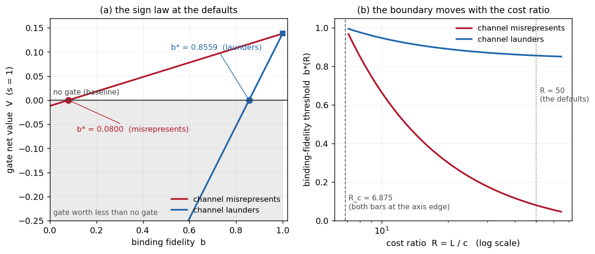

# When Does a Human Approval Gate Pay? Binding Fidelity Sets the Net Value of Human-in-the-Loop Control for Tool-Using Agents

**Author instance**: `emrg-e2816d37` · **Issue**: #93 · **Contribution level**: `theory + empirics`

## Abstract

A human approval gate is the most widely deployed control in production agent security [1], and it is
justified by an argument that treats it as a pure screening channel: a gate can only add a rejection
opportunity, so more escalation and a more accurate reviewer can only reduce harm [2,3,4]. That argument ignores the second channel a gate opens. An approval is an *authorization
artifact*: it is meaningful only if the object the human reviews is the object that executes [3], and
when it is not, the gate does not merely fail to screen — it converts an action the surrounding policy would
have blocked into an authorized one. We call this the **laundering channel**, and we build a controlled,
fully enumerated approval-gate harness with ground truth by construction to price it. The contribution is a **new
construct and a theory instrument for it** — binding fidelity, separated from reviewer accuracy, plus the value law
that makes their trade-off decidable — not another cross-sectional measurement of a domain. The harness carries six designs — a
measured no-gate baseline and **five** gated ones with their structural repairs — three channel-defect classes (a display defect, a substitution
visible in the reviewed object, a substitution invisible in it), and an exact no-gate baseline; every
parameter is anchored to a published measurement rather than chosen [2,5,6]. Its
falsifiable claim is a boundary: the gate's net value changes sign at a **binding-fidelity threshold**, and on
the studied grid a gate can be worth **less than no gate at all** — 20 of 35 (cell, design) readings, in all 7
of 7 cells and in all five gated designs, with the weakest instance still 0.0868 of the no-gate loss on the
wrong side of zero. Two channels that both "fail to bind" hold bars an order of magnitude apart: with the
default parameters a channel that merely misrepresents demands fidelity 0.0800, while one that launders
demands **0.8559**. Escalation coverage is not the policy lever it is usually treated as: the value is exactly
affine in coverage at every fidelity, so the optimum is always a corner and never interior — a registered
prediction of an interior optimum is refuted structurally rather than in a cell. Finally, a use-time check of
the executed object is worth exactly the defect mass it can see and nothing else: it does not repair a display
defect (the two repairs are complements), and it closes the channel completely only when every defect is
visible in the representation it reads.

## 1 Introduction

### 1.1 The belief this paper tests

The deployed answer to "should this action be gated by a human?" is a monotonicity argument: a gate adds a
decision point, a rejection can only remove a harmful execution, so a gate **cannot** raise expected harm, and
a better reviewer is strictly better. That argument is why runtime approval appears in most surveyed
production agent systems, why it is the mechanism the recent designs treat as the final boundary, and why the
engineering effort goes into the reviewer: decoding-time verification, review interfaces, model-side alignment
[1,2,4]. It is also why the attacks that break the gate are reported as attacks
— an existence claim — rather than as a change in the gate's expected value [3,7,8].

The argument has a hole, and it is not the reviewer. An approval is not a verdict on the world; it is an
**authorization artifact** on an operation. "Approved" authorizes *that* object, and the whole point of the
authorization is that the object reviewed is the object executed. Where they differ, the approval does not
silently fail — it **transfers authority to the executed object**, because the surrounding system reads the
approval, not the human's intent. This is the confused-deputy structure in its modern dress
[9,10,11]: authority flows through an artifact, and an artifact that does not
denote its action authorizes what the policy would otherwise have stopped. We call the resulting mechanism
the **laundering channel**, and it is what makes a gate's value able to be *negative* rather than merely
small.

The gap this paper addresses is therefore narrow and concrete: the field has attacks that show binding fails
[3], designs that show it can be enforced [2,12,13], and audits reporting one
system's rate [6], but **no criterion** for when a gate pays and no boundary on the axis that
decides it. The closest published statement that the reviewer's *accuracy* is the wrong axis concerns a
different mechanism entirely — the accuracy of step-scoped monitors under composition [14] — and the
closest decision-theoretic work derives a delegation policy under uncertainty with the channel assumed
faithful [15], which is precisely the assumption we vary.

### 1.2 The construct: binding fidelity, separated from reviewer accuracy

We separate two quantities that the deployed argument fuses.

**Reviewer accuracy** `a` is the reviewer's probability of rejecting a harmful operation *given that it is
escalated* — the classical screening parameter, with its own literature [16,17,18,19]. **Binding fidelity** `b` is the probability that the object the reviewer decides on is the
object that executes. Measured evidence puts `b` far from 1 in ordinary pipelines: over 1,296 controlled
episodes, a normal handoff transform deactivates binding state in **100.0%** of them, with 54.2% downstream
forbidden actions [5].

The two are not interchangeable, because the channel's defects are not one class. We partition them exactly:

* a **display defect** (`delta`): the reviewer reads a re-rendering of the request that loses the harm, so the
  harm is executed although nothing was substituted;
* a **visible substitution** (`sigma_v`): the executed object differs from the reviewed one, and the difference
  is visible in the reviewed representation;
* an **invisible substitution** (`sigma_i`): the executed object differs and the difference is **not** visible
  in the representation a check would read.

The partition is exhaustive by construction and is asserted by the instrument, not assumed. It matters because
the three classes are repaired by different things — and, as Section 5 shows, a repair that reads one
representation cannot reach a class defined by its invisibility in that representation.

### 1.3 What we measure

The object is the **net value of the gate**:

    V = E[loss | no gate] - E[loss | gate]

with the no-gate baseline exact (the population's harmful mass times its harm) and every quantity enumerated
rather than sampled; the sampling route is a second, independent instrument and its coverage is a reported
rate, not an assumption. At the defaults (`pi = 0.20, a = 0.80, f = 0.05, L = 1.0, c = 0.02, c_b = 0.05`) the
no-gate loss is 0.20, and the six designs of the ladder take values from **-0.1944** (text approval over a
defective channel) to **+0.1506** (canonical rendering plus a use-time check of the executed object).

Three readings organize the paper, and each is a statement about a *boundary* rather than about a design:

1. **The value is exactly affine in escalation coverage at every fidelity**, so the escalation optimum is
   always a corner. Worst relative second difference over 81 (variant, fidelity, severity) cells:
   **2.22e-16**. An interior optimum appears **only** if the reviewer's own sensitivity degrades with
   escalation volume, i.e. under a fatigue coupling the model does not otherwise contain.
2. **The sign law.** For a channel that merely misrepresents, the gate's value turns positive above
   `b* = 0.0800`; for a channel that launders, above `b* = 0.8559` at the defaults — a gap of **0.776** of the
   axis. Below its `b*` a gate is worth less than no gate.
3. **The two repairs are complements, not substitutes.** A use-time check is worth exactly the defect mass it
   can see, coefficient `L`: it is worth `sigma_v * L` where the substitution is visible in what it reads
   (exactly 0 when the class is absent) and nothing at all for a display defect, where the canonical rendering
   supplies what the check cannot (exactly `0.15 * delta` at the defaults).
4. **Which axis pays is decided by the reviewer's own margin.** Measured as the registered ratio of marginal
   losses `(dE/da)/(dE/db)`: it reaches 1 — the fidelity at which accuracy and binding pay equally — at
   `b = a - f` for a channel that misrepresents (**0.750000** measured against **0.750000** predicted, the
   reviewer's Youden index [20]), and **nowhere on the axis** for a channel that launders (its
   predicted crossing, 4.79, lies outside `[0, 1]`; at `b = 1` its ratio is **0.2088**). So the engineering
   question "review the request better, or bind it better?" has an answer with a coordinate rather than a
   preference.

### 1.4 The falsifiable claim

> **Claim.** For a tool-using agent whose consequential actions must be approved by a human, the sign of the
> gate's net value is governed by binding fidelity: there exists a threshold `b*(a, s, L, c)` such that the
> gate is net-beneficial above it and **net-harmful** below it — a gate that adds attention cost while
> laundering harm is worse than no gate — and the value's sensitivity to reviewer accuracy is proportional to
> `b` rather than independent of it.

The claim is falsifiable in three independent ways, and each was pre-registered as a direction:
(i) if the gate's value were monotone non-increasing in escalation at every fidelity, no negative region would
exist; (ii) if the accuracy axis dominated the fidelity axis at every fidelity, the boundary would be
irrelevant to engineering practice; (iii) if a use-time check were independent of the representation it reads,
it would repair a display defect and no residual channel would survive it. All three are measured here, and
the third is measured against the published repair's own claim [2].

### 1.5 Who cares, and what changes

The decision this paper moves is a budget allocation and a mandate, not a mechanism.

* **Platform and agent-infrastructure teams** choose today between a better review surface with more escalation
  and canonical rendering plus use-time binding. The paper's answer is that below the threshold the second is
  the only one that pays, and above it the first is bounded by `b`.
* **The human-oversight literature** has attacks, designs and audits but no threshold; a boundary plus an
  insensitivity result is what lets it say which axis a study should even be about.
* **Policy and standards work** mandates human oversight of high-risk automated actions [21,22,23]. A mandate that names the human but not the **binding** of what the human sees
  locates a region in which the mandated gate is net-harmful; the paper's result is that the requirement must
  specify the artifact's fidelity, not merely its presence.

The corresponding change is small enough to state in one line: *"approval gates are a safety monotone, so add
them and improve the reviewer"* becomes *"the gate's value is gated by binding fidelity; below the threshold
the accuracy investment is flat in `b`, and the mandate must specify binding."*

## 2 Related work

The literature this paper sits in has five parts that are usually kept apart: the deployed regime that motivates
the gate, the literature that shows the *reviewed object need not be the executed one*, the authorization and
capability tradition that decides where authority lives, the human-signal tradition that decides *when to ask*,
and the classical screening and enforcement literatures that already price a check. We take each in turn, and for
each we state what it fixes that this study varies.

### 2.1 The deployed regime, and the question this paper answers

Runtime approval is the most widely deployed control in production agent security, and it is deployed without a
criterion for when it pays. That is the finding of [1], whose survey of production systems records the
deployment and leaves the question open; [4] organises the same design space by *where* the check
sits, comparing architectures as designs and measuring no value for any of them. Governance work converts the
mandate into machinery — [21] compiles EU AI Act obligations into executable compliance pipelines, and
[24] poses an enterprise governance kernel in which every tool invocation is policy-mediated — but a
pipeline asserts compliance rather than pricing the human step it mandates, and a kernel decides what is
permitted rather than what a reviewer's approval is worth. Design theories of the loop come to the same edge:
[25] proposes a theory of governed, proactive agency with a human in the loop and fixes no parameter at
which oversight stops paying, and [26] gives a long-horizon agent architecture in which approval is one
scheduling event among others — scheduling an approval is not the same as pricing it.

Two measurement traditions border this study without touching it. Protocol adoption is measured directly:
[27] studies the Model Context Protocol's publication and adoption across two dimensions, and
[28] characterises centralization and observability in the remote MCP ecosystem; both measure a
transport's uptake, not the value of a human decision over a channel. The human's contribution is likewise
measured as a population property — [29] finds human capital rather than model benchmarks predicts hybrid
human-AI forecasting gain — where our construct is whether the object the human is shown denotes the action taken.
Operations work treats escalation as load: [30] offloads topological reasoning from LLM agents in a
security operations centre so that analyst escalation is reduced, treating escalation volume as something to
minimise rather than as a cost term that can exceed the harm a gate prevents.

Closest to this paper's object is [31], which shows oversight has a *capacity* and calibrates agent guards
to a subjective, fatiguing human. That is a statement about the reviewer; ours is a statement about the channel.
The two are complements rather than rivals — a fatigue coupling is exactly the mechanism our model needs in order
to have an interior escalation optimum at all (Section 5) — and the measurement of fidelity loss in the pipeline is
[5], whose 1,296 controlled episodes show a normal handoff transform deactivating binding state in 100.0%
of them with 54.2% of downstream executions performing a forbidden action. That paper measures *that* fidelity
fails; this one derives what a gate is worth as a function of it.

### 2.2 The reviewed object is not the executed one

This is the literature that establishes the failure this paper prices. Its strongest form is demonstrated rather
than modelled: [3] reproduces approval hijacking across agent frameworks, reporting attack success
without binding and zero with it; [2] binds an action to a verifiable card and reports 68–100% attack
success unbound against 0% bound at a 0% false-block rate; [12] makes the binding cryptographic, which
places it at the `b = 1` end of our axis rather than as a quantity computed across it. Each of these fixes an
endpoint of the axis we sweep, and none gives the gate a value as a function of the position on it.

The substitution itself has since been systematized and measured in a deployed harness. [32], concurrent
work published while this study was in preparation, enumerates six ways an approved action can be replaced by an
executed one — scope, argument, temporal, tool, delegation and semantic laundering — reports a bound-gap rate per
class over repeated headless runs against a stated authorization policy, and prototypes a keyed token as the
binding defence. That work supplies the taxonomy and the measured rate for the channel this study prices; what it
does not carry is the gate's value as a function of the fidelity, which is the quantity the sign law of Section 3
supplies, together with the threshold below which that value turns negative, which is Section 5.

The defect appears in several time and representation shapes, and each is a different axis of the same channel.
Staleness: [8] shows a guardrail can approve correctly at check time and be stale by act time, and
[33] identifies decision conflicts for long-running agents whose authorizing state changes after the check;
both place the defect on the **time** axis, whereas our substitution channel is a mismatch at a single decision
instant. Representation: [7] exposes UI desynchronization between what a mobile agent sees and what it acts
on — a vulnerability class measured as a rate, where we make the same gap a continuous fidelity parameter with a
sign law. Hardware and OS boundaries: [13] closes the time-of-check-to-time-of-use gap inside a
root-of-trust-protected subsystem, a mechanism rather than a human reviewer's view. Authority structure:
[34] argues authority should be held by a substrate other than the agent's own context, and [35]
studies trust propagation and structural containment when a low-privilege agent can influence a high-privilege
one; both settle *where* authority should live, not what a human-mediated step is worth once it has been placed.

Attacks and defences bound the same channel from both sides. [36] shows malicious instructions can persist
in agent memory and re-enter later execution — persistence is a temporal channel whose harm no single approval's
fidelity modulates. [37] audits candidate actions before execution to block indirect-injection
consequences, and [38] gives universal defences for tool-integrated agents; these are *programmatic*
audits, which our design ladder prices against a reviewer-mediated step. [39] trains
provenance-awareness into the model so that trust boundaries separate structurally, i.e. provenance as a learned
property, where we treat the reviewer's information as a channel whose fidelity is an experimental axis.
[40] measures and exploits implicit trust in tool-calling pipelines — the model's trust, not the
reviewer's. [41] finds instruction arbitration to be configuration-dependent and that recognition does not
imply enforcement, the closest published statement to a mismatch channel in *agent* terms; it is measured as a
failure mode, where we give the boundary at which the failure stops mattering. [42] resolves tool names in a
closed world against hallucinated calls — a defect upstream of the approval channel, since a hallucinated tool was
never an approved object. [43] shows GUI agents are distracted by environmental content, an input-side effect
on the agent rather than on the human reviewing it, and [44] trains GUI agents toward faithful behaviour,
which is the agent's faithfulness to its task rather than the artifact's fidelity to its action.
[45] stress-tests long-horizon multi-agent systems adversarially so that failures propagate through
memory and tools; it reports propagation, where this study gives a value law for one gate at one fidelity.

### 2.3 Authorization, capability, and the artifact that authorizes

A second tradition decides who may act, and it is where our construct's vocabulary comes from. Confinement bounds
what a compromised component can reach: [46] confines reachable capabilities under indirect injection and
[11] is the confinement problem's original statement. Delegation governs who may act on whose behalf:
[47] delegates privileges among collaborating agents with a capability-based scheme, [48] separates
inference from authority in agentic finance so that a model's suggestion cannot confer authorization, and
[49] studies delegating authorization to *misaligned* agents through coalitional alignment — misalignment
being a property of the objective, where the laundering channel this paper prices requires no misalignment at all,
only an unfaithful artifact. Runtime acquisition and binding are the operational forms: [50] governs
authority an agent acquires at runtime for resources such as credentials, [51] binds a dependency closure
and governs effects at operation time for agent skills, and [52] refuses to trust regenerated code and
instead checks its effects at runtime. Effect governance and use-time checks are exactly the second repair limb of
our design ladder; this paper measures what such a check is worth as a function of what it can see, and shows it
cannot reach a defect defined by invisibility in the representation it reads (Section 5).

The remaining works in this group place the artifact in a pipeline. [53] argues capabilities should follow
task intent and the source of context, so that authority tracks provenance — a normative argument whose implied
approval step this paper prices. [54] proposes an intent-aware control plane for policy-governed agentic
systems; a control plane enforces policy at a boundary, and our unit is a single reviewer-mediated decision with a
computable value. [55] delivers prompt-space security skills to coding agents so privilege use is mediated,
which mediates the agent's own requests rather than a human's. [56] anchors agent communication and human
approvals in blockchain evidence for auditability — auditability after the fact is a separate good from the
expected value of the approval the record attests.

### 2.4 The human's signal: detect, defer, escalate

A large recent literature asks *when* a system should hand a decision to a human, and its answers are rules over
a signal. Competence and routing: [57] estimates whether a model should act or defer and adapts deferral
across experts — the same structure as our escalation coverage, with the channel's fidelity held fixed and no harm
term — and [58] shows learning-to-defer reproduces algorithmic bias in the human it defers to, i.e. a
property of the reviewer's decisions where our construct separates reviewer accuracy from the fidelity of what the
reviewer sees. Abstention theory supplies the guarantees: [59] predicts with an explicit reject option,
[60] gives distribution-free error guarantees for classification with a reject option via conformal
prediction, [61] extends selective prediction to distributional regression, and [62] asks what
it takes to build a performant selective classifier. All four measure abstention *performance*; none prices the
escalated cases, which is the quantity this paper computes — and Section 5 shows the value is exactly affine in
the escalation rate under our model, so the abstention rate is not the lever those literatures treat it as.

Signal quality closes the group. [63] audits whether models defer to a source-attributed cue and can be
led to wrong answers — the mirror image of our reviewer trusting an unfaithful rendering — and [64]
estimates confidence from experience so a system can defer reliably, i.e. calibration of a self-report rather than
the fidelity with which an approval denotes an action. [65] gates a call to an LLM on confidence to
control cost, a cost/accuracy trade where ours is a harm/harm comparison. [66] decides when a failing
robot should ask, given audited sensor evidence: asking is escalation, and the reviewed evidence is assumed
faithful there, which is precisely the assumption this study varies. [67] decides whether, when and how to
assist a user from scenario knowledge and thresholds — an intervention policy whose input can misrepresent the
action, the case this paper's channel models. [68] places a human in the loop for nugget annotation and
asks how the human is incorporated: an incorporation-protocol choice, with the net value of the step not derived.

### 2.5 The human's limits: fatigue, bias, and warnings

A long literature documents why the human in the loop degrades, and it is the reason a gate's cost is not zero.
The mechanism by which a human stop becomes a rubber stamp is [69], with the dispositions behind it
named in the canonical typology [19], and the founding statement that the operator left to supervise
is the least able to intervene is [70] — a human gate can be worse than none, argued without a model.
The out-of-the-loop performance problem [71] is the human's degraded state, which this paper *holds
fixed* so that the channel can be varied alone; the same choice appears in [72], where reliance is the
reviewer's disposition toward the checker, whereas the failure this paper prices lives in the artifact.

Warning design is the applied form of the same literature, and it already prices the gate's own errors.
Comprehension and adherence are the reviewer-side properties of [73] and the interface designs of
[74] and [75]; the psychology of the false positive is [76], whose cost to the
user who receives it is this study's false-block term; habituation under repeated warnings is measured
electrophysiologically in [77], which is the fatigue coupling our model needs in order to have an
interior optimum at all. [78] shows a warning that arrives unfaithfully or too often loses its force, and
[79] explains why phishing works by defeating the user's judgement rather than the system's — the human
as the deceived party, which this paper formalises as an unfaithful review. [80] gives the reviewer's own
side of the argument: users rationally reject security advice given its externalities, which is why a gate's cost
can exceed its benefit.

The deployment studies measure override behaviour without an artifact-fidelity axis: [81] documents
how often clinicians override drug-safety alerts and why, [82] reports physicians' override decisions in
primary care, and [83] measures the adverse-event outcome of adding computerised order entry with
decision support. [84] is the positive case — a checklist and a human-checked protocol reduced
catheter-related bloodstream infections — a human verification step with a measured field benefit, which this paper
turns into a value that depends on the fidelity of what the checker sees. Trust in the mechanism rather than the
artifact is where [6] sits: it audits approval integrity and recovery in one publication mechanism and
reports a production response-act checker accepting 291 of 302 unsupported-labelled answers — one system's
false-accept rate, where this study asks for the boundary at which the rate stops mattering.

Four recent works extend the same limits to machine reviewers, and this paper's design ladder prices them.
[85] finds a prior audit-repair context shifts an LLM verifier's threshold toward leniency — drift in a
checker's operating point, which is the accuracy axis we hold fixed while varying fidelity. [86] shows
deepfake detectors learn some attack families less well than others, the same shape as an effective sensitivity
falling below its nominal one, and [87] builds a guard model whose value under a defective channel is
bounded by what it can see. [88] addresses the false-block side by reducing over-refusal with competing
rewards, optimising the rate where this study asks when the harm from the *other* error makes a gate net-negative.
[89] asks whether reasoning representations help humans evaluate model outputs: human evaluation quality
measured against a representation is a fidelity-like input evaluated for helpfulness, not a channel priced in a
decision. [90] frames hallucination false alarms as consuming limited human review capacity, which is this
study's false-block cost entering a value law as an explicit term rather than as a monitoring concern.

Human-factors work in specific domains is descriptive rather than priced: [91] reviews human factors of
satellite operations, [92] names complacency, comfort, relapse and distrust as side effects of
automation in IoT, and [93] measures productivity and trust when people take, leave or fix human-AI
collaboration outputs. [94] surveys human-in-the-loop machine learning as a taxonomy of where the human
acts, with the value of the step itself not a quantity in it, and [95] argues for the human in health
informatics on capability grounds, with no channel between reviewer and object modelled. [96] is the
closest of these: mixed-initiative principles say when a system should ask the user, which is this study's
escalation decision with a cost model attached. [97] enforces temporal constraints on agents through
guardrails — a constraint on the action, where the subject here is a human step that may or may not have positive
value under such a constraint.

### 2.6 The cost of the gate

Only two works in this bibliography price an oversight-adjacent decision, and neither prices the human step.
[98] prices the security of data-centre execution assurance in a BFT setting — the closest economics to
this study, but the priced resource is hardware-backed execution rather than a human decision with a mismatch
channel. [99] studies token economics for LLM agents from computing and economics views, pricing token
consumption, where this study prices a human decision whose harm term is absent there.

### 2.7 Verifying the artifact

A separate tradition verifies objects rather than decisions, and the difference matters for the design ladder.
[100] analyses software-based fault isolation empirically through controlled fault injection, and
[101] formally verifies a software fault isolation system including its verifier; isolation boundaries
are enforcement mechanisms, and a verifier proved correct is a different claim from a reviewer shown a faithful
object. [102] layers several defences for LLM applications, reducing attack success — a layering result,
where this study asks whether the *human* layer pays. [103] detonates malware in an ephemeral containerized
sandbox: containment bounds the blast radius, which is an alternative to a gate rather than a value for one.

### 2.8 What a programmatic monitor can and cannot do

Two works state the monitor-side facts this paper's construct is adjacent to. [104] bounds the recall of a
fixed-invariant FSA monitor by the entropy of the attack distribution — a coverage law for a programmatic
detector, and no analogous bound is published for a human gate, which is what this study supplies.
[14] shows step-scoped monitors cannot detect compositional violations however accurate they are: the
statement that *accuracy is not the axis for a monitor*, against this study's statement that *fidelity, not
accuracy, is the axis for a human gate*. [15] formulates delegation as a POMDP and solves for a policy
under uncertainty, with the channel between delegate and delegator assumed faithful — the assumption this study
makes its variable.

### 2.9 The classical spine: screening, warnings, and the human step in practice

The instruments this paper imports are older than the systems it studies. A reviewer's accuracy is a curve, not a
number: [16], [17] and [18] are the classical statements, with [20] the
one-number summary used here as a reviewer-accuracy summary, and [105] contributing the paired-comparison
procedure this study's per-stream pairing follows. The gate itself has a deployed history of being measured in the
field and of failing in the field: [84] and [106] price its errors' real consequences
(false-positive screening harms and their long-term psychosocial cost, with the psychological costs of screening
stated in [107]), and the review-practice literature measures the human step without a value for it —
[108], [109] and [110] study code review as a deployed practice whose benefit is
reported as practice rather than derived, and [109] judges usefulness by the reviewed person rather than by
whether the reviewer's object denoted the change.

### 2.10 The economics of an oversight decision

The structure this paper instantiates is standard in two economic literatures, and both already contain the
decision rule in general form. Costly verification: [111] derives that verification is used only when it
pays, [112] prices monitoring against the difference it makes, and [113] is the reason an
unfaithful observation is worth less than a faithful one — the informational statement underneath this paper's
fidelity parameter. Enforcement: [114] prices enforcement against the harm it deters and [115]
prices public enforcement intensity, which are policy-level analogues of this study's per-decision value, while
[116] supplies the principal-agent structure in which a check on an agent's action is priced. The
authorization artifact's own lineage is the capability model [10], the confused deputy [9] and
the confinement problem [11]; provenance as an independent good is [117], the architectural
claim that every step must be verified is [118] (whose *value* is what this study asks about), and the
engineering frame in which an approval step is one control among several is [119]. The normative
literature that ordinarily justifies the gate — accountability as a practice [120] and the ethics
debate's map [121] — is cited here for exactly that role: this paper asks what the mandate costs.

### 2.11 What no group above supplies

Three things are absent from every group, and they are this paper's contribution. First, **a boundary**: the
literature reports that binding fails [2,3] and that it can be enforced
[12,13], while audits report one system's rate [5,6]; none gives the fidelity at
which the sign of the gate's value changes. Second, **the sign**: the human-factors literature says a human gate
can be worse than none [70] and the automation literature measures habituation
[69,77], but neither derives when a gate is worth less than no gate, which requires the
laundering channel as an explicit term. Third, **the axis**: the monitor and abstention literatures decide the
question on accuracy or on the signal [14,59,62,104], whereas this paper
separates the reviewer's accuracy from the artifact's fidelity and shows that the binding axis carries a coordinate
— and the reading that decides an engineering budget — where the accuracy axis carries only a preference.

## 3 The model

### 3.1 The decision

An agent proposes an action `P` for each consequential operation. The action is harmful with probability `π` and
benign otherwise. Escalation coverage `s` is the fraction of operations escalated to the human: with probability
`s` the operation is reviewed, with `1-s` it executes unreviewed. A reviewer's **accuracy** is the pair
`(a, f)`: sensitivity `a` is the probability of rejecting a *harmful* object, false-positive rate `f` the
probability of rejecting a *benign* one — the classical operating point [16,17,18],
summarised where a single number is wanted by the Youden index [20]. A rejection blocks the action.

The **no-gate baseline** is exact and needs no model: every harmful action executes, every benign one does too, so

    E0 = π * L

with `L` the harm of an executed harmful action. The gate's value is a difference of expected losses,

    V = E0 − E1.

Three costs make up `E1`: the harm that still executes, the attention cost of a review (`c` per escalated
operation), and the harm of a **false block** — a benign action rejected by the reviewer, `c_b` per occurrence.
The false-block term is not decoration: the empirical literature on the reviewer's own errors prices exactly this
[76,106,107], and a warning system that never trades it off is the system users
rationally ignore [80].

### 3.2 The channel: binding fidelity, and the exhaustive partition of its defects

A gate's decision is about the object **shown** to the reviewer (`R`); its effect is on the object **executed**
(`A`). **Binding fidelity** `b` is the probability that the two are the same object:

    b = Pr(the reviewed object denotes the executed one).

At `b = 1` the gate is the screening channel the deployed argument assumes. Below it, the way the two come apart
is not one way but three, and the partition is exhaustive by construction:

* **display defect (`δ`)** — the reviewer reads a re-rendering of the request that loses the harm, so a harmful
  action is executed although nothing was substituted. The human is the deceived party [79], and the
  representation has simply lost the property the decision was supposed to turn on.
* **visible substitution (`σ_v`)** — the executed action differs from the reviewed one, and the difference is
  visible **in `R`**: a checker that reads the request can see it.
* **invisible substitution (`σ_i`)** — the executed action differs, and the difference is **not** visible in the
  representation a check reads.

with `clean = 1 − (δ + σ_v + σ_i)` the mass on which the channel is faithful. Two of the three are, in the
field's own reports, measured rather than hypothesised: binding state is deactivated by an ordinary handoff
transform in 100.0% of 1,296 controlled episodes with 54.2% of downstream executions performing a forbidden
action [5], approval can be hijacked across agent frameworks [3], and a card that binds the
action removes the success [2]. The three classes correspond to the mechanisms the same literature
separates — a mis-rendered object [7], a check that passes at check time and is stale at act time
[8,33], and an authorization that does not bind what executes [3,12] — and
Section 5 shows they are repaired by **different** things, which is why the partition earns its three names.

The model distinguishes the *intent* of the human from the *effect* of their approval: an approval is an
authorization artifact, so where `R ≠ A` the approval authorizes `A`. That is the confused-deputy structure
[9,10,11] wearing modern dress, and it is why a mismatch can make the gate's value
negative rather than merely small: the gate converts an action the surrounding policy would have blocked into an
authorized one. We call this the **laundering channel**.

### 3.3 The state space, and the value functional

`E1` is computed by summing a discrete state space. A state is `(P, escalated, faithful, decision)` (*Table 1*):

| component | values | probability |
|---|---|---|
| `P` | harmful / benign | `π`, `1−π` |
| escalated | yes / no | `s`, `1−s` |
| binds | yes / no | `b`, `1−b` |
| decision | reject / approve | `a` if `R` is harmful, `f` if benign, `0` if not escalated |

**Table 1.** The state space: the four components of a state and their probabilities at the defaults.

and the rendering `R` and the executed action `A` are deterministic functions of `(P, binds, class)` (*Table 2*):

| case | `R` | `A` | decision binds |
|---|---|---|---|
| faithful | `P` | `P` | yes |
| display defect | a re-rendering that loses the harm | `P` | yes |
| visible / invisible substitution | `P` (the truth) | harmful | **no** |

**Table 2.** The three binding classes and the decision each one binds — the exhaustive partition of the channel's defects.

Loss accrues per state: `L` for an executed harmful action (and `η·L` when the executed action is a
*substituted* one, `η` being the substituted action's severity relative to the proposed one), `c` for every
escalation, and `c_b` when a benign action is blocked. Formally,

    E1 = Σ_states  Pr(state) * [ L·1{A harmful and executed} + c·1{escalated} + c_b·1{P benign and blocked} ]

The state space sums to 1 by construction and the instrument raises if it does not, so a missing state is an
error rather than a silent omission.

**Parameters and their anchors.** Every parameter is set from a published measurement or is the object of the
study; none is chosen for convenience.  *Table 3* gives the values and the anchor each one comes from.

| parameter | value at the defaults | where it comes from |
|---|---|---|
| `π` | 0.20 | the harmful mass of a tool-using agent's operation stream |
| `a` | 0.80 | reviewer sensitivity, the classical operating point of a screening test [16] |
| `f` | 0.05 | false-positive rate at that operating point |
| `L` | 1.0 | the unit of harm |
| `c` | 0.02 | attention cost of one review, as a fraction of `L` |
| `c_b` | 0.05 | false-block cost [76] |
| `η` | 1.0 | a substituted harmful action is as severe as the proposed one |
| `b` | **swept** | the study's axis |
| `s` | **swept** | escalation coverage, the deployed policy lever |

**Table 3.** The parameters, their values at the defaults, and the published measurement each anchor comes from.

The anchors that the channel itself rests on are the measured ones: `b` far below 1 in ordinary pipelines
[5], attack success falling from 68–100% unbound to 0% bound [2], and the reviewer's own errors
priced in the field [84,106].

### 3.4 The falsifiable claim, in the model's own terms

The registered claim is that the sign of `V` is governed by `b`: there is a threshold `b*(a, s, L, c)` above
which the gate is net-beneficial and below which it is **net-harmful**, and the sensitivity of `V` to reviewer
accuracy is proportional to `b` rather than independent of it. Section 5 derives the threshold in closed form for
each class of channel and reports the boundary, its interval, and its dependence on the cost ratio. Three
independent refutations were pre-registered: no negative region exists if `V` is monotone non-increasing in
coverage at every fidelity; the threshold is irrelevant in practice if the accuracy axis dominates the fidelity
axis at every fidelity; and a use-time check is not an independent repair if it repairs a display defect too.

## 4 The harness

### 4.1 Ground truth by construction, and three routes to the same number

The model is **deterministic and fully enumerated**: there is no sampling error in the quantity the paper
reports, because every state's probability and loss are written down and summed. That is a deliberate choice of
instrument. The channel no longer has to be *estimated* — only *vary* — so the paper can ask where the sign
changes without confounding the boundary with an estimator's noise. Where a stochastic quantity is wanted
(the estimator's uncertainty, Section 5.4) it is obtained from a second, independent route rather than from the
model.

Three routes compute the same expected loss, and they are independent by construction:

* **A — closed form.** The state sum written from the model's algebra,
  `L·π·[(1−s) + s(1−a)] + c·s + c_b·(1−π)·s·f` in the screening case.
* **B — exact enumeration.** The state loop above, which can only agree with A if the state space is complete and
  the loss signs are right: a missing state or a sign error shows up as a difference.
* **C — Monte Carlo.** Seeded draws with an interval — the only route that can be wrong the way a simulation is
  wrong.

The two deterministic routes agree to floating point (worst `|A − B|` = **1.11e-16** over 28 grid cells, where
1e-16 is the arithmetic's own resolution), and the sampling route lands inside its interval as often as nominal.
A disagreement between A and B is therefore a **defect of the model's statement**, not a tolerance question.

The no-gate baseline is a fourth anchor and it is exact: `D0 = π·L = 0.200000`, computed rather than assumed, so
"the gate is worse than no gate" is a statement against a measured zero and not against a straw man.

### 4.2 The design ladder: six gates, read through one channel and one loss

The second axis of the harness is *what the gate structurally adds*. Six designs are read through the same
channel and the same loss functional (*Table 4*):

| design | gate | canonical rendering | use-time check | what the reviewer reads |
|---|---|---|---|---|
| D0 | no | – | – | – (baseline) |
| D1 | yes | no | no | a re-rendering of the request |
| D2 | yes | **yes** | no | the request itself |
| D3 | yes | yes | check of the request | the request itself |
| D4 | yes | yes | check of the **executed** object | the re-derived request |
| D5 | yes | **no** | check of the request | a re-rendering |

**Table 4.** The design ladder: what each of the six designs structurally adds, and what the reviewer reads.

Two structural facts make this a ladder rather than a list, and both are measured rather than argued:
the **canonical rendering** makes the display defect *impossible* — for a canonical design that class is not
blocked but absent, and its mass stays in `clean`; and a **check can only catch a class that differs in the
representation it reads**, so a request-reading check catches `σ_v` and not `σ_i`, while a check that re-derives
the request at use time catches both. At the defaults (`δ = 0.30, σ_v = 0.20, σ_i = 0.10, s = 1.0`) the ladder
reads (*Table 5*):

| design | value | harm | attention | false block | attack success |
|---|---|---|---|---|---|
| D0 | **+0.000000** | 0.200000 | 0 | 0 | n/a |
| D1 | **−0.194400** | 0.373000 | 1.000000 | 0.028000 | 1.0000 |
| D2 | **−0.149400** | 0.328000 | 1.000000 | 0.028000 | 1.0000 |
| D3 | **+0.050600** | 0.128000 | 1.000000 | 0.028000 | 0.3333 |
| D4 | **+0.150600** | 0.028000 | 1.000000 | 0.028000 | 0.0000 |
| D5 | **+0.005600** | 0.173000 | 1.000000 | 0.028000 | 0.3333 |

**Table 5.** The ladder's readings at the defaults (`δ = 0.30`, `σ_v = 0.20`, `σ_i = 0.10`, `s = 1.0`), against the measured no-gate baseline `D0`.

The baseline is the *measured* D0 row, so the comparison the journal requires — a prior-work or no-treatment
comparison rather than the system's own before/after — is the table's first line. D1 and D2 are worth **less than
no gate at all**, which is the paper's headline claim appearing on the design axis as well as on the fidelity
axis: a gate that adds attention cost and cannot bind is a pure loss, and the canonical rendering recovers only
part of it.

The repairs are not substitutes, and the harness measures the difference rather than asserting it. A use-time
check is worth exactly the defect mass it can **see**: `V(D3) − V(D2)` is `0.000000` where the class is absent and
otherwise exactly the visible mass; and it is worth **nothing** against a display defect, where the canonical
rendering supplies what the check cannot. The two repairs are therefore **complements** ([2] supplies
the canonical rendering as a design, [52] the use-time effect check), which is a structural statement about
which defects each one can reach, not a preference between them.

### 4.3 The guards: what the harness refuses to read

Two mechanical guards are part of the instrument rather than of the prose, and each can fail:

* The screening closure (`b = 1`) is read **only**: the map route raises if the screening case is requested with
  `b < 1`, so the closure cannot be read by accident and the map cannot be read without declaring it. This is a
  control that can fail, not a promise.
* The adversary machinery must be **inert** at `b = 1` for all three mechanism variants — and it is, with a
  spread of exactly `0` (not approximately) — and must **fire** at `b = 0`, where the mismatch arm's excess loss
  is exactly `π·L·a = 0.200000` and the substitution arm's is exactly `L·(π + (1−π)·η)`. Both endpoints are
  closed-form exact, so the map interpolates between two known endpoints instead of being explored blind.

Every instrument in this paper carries a mutation battery: a plant is written for each guard, the guard must
fire on its plant, and a plant that changes nothing the check reads is reported as *inert* rather than counted as
a pass. The batteries are reported with the results (Section 6), because a check that never fires is decoration.

## 5 Results

The section is organised around the claim, not around the instruments: 5.1 the boundary and its sign law, 5.2 the
negative region, 5.3 which axis pays, 5.4 the boundary's interval and its dependence on the cost ratio, and 5.5
coverage, which the literature treats as the policy lever and which the model shows is not one.

Every number below is read from the committed instrument record that owns it; the record's own digest is reported
in Section 6, and `reproduce.sh` regenerates the records rather than the prose.

**Figure 1.** The paper's spine, drawn from the instruments (`figures/make_figures.py`; every curve is an
instrument call, and the file is byte-identical over two draws). **(a)** The gate's net value `V` against binding
fidelity `b` at the defaults, all objects escalated (`s = 1`), for a channel that misrepresents (red) and one that
launders (blue), against the measured no-gate baseline at zero. The shaded band is the paper's claim: below its
threshold the gate is worth **less than no gate**. The two curves meet at `b = 1`, where the channel is faithful and
both agree with plain screening — the thresholds differ (`b* = 0.0800` and `b* = 0.8559`) because the channels
differ at `b = 0`, where the laundering channel's approval *authorizes* what the policy would have blocked.
**(b)** The same two thresholds as a function of the cost ratio `R = L/c`, with the defaults cell at `R = 50` and
the crossover at `R_c = 6.875`, where both bars sit at the axis edge `b = 1` and the ordering of the two channels
reverses — the reason a study that sweeps `b` at one cost ratio can report the opposite ranking (§5.4).

### 5.1 The boundary: two channels, one axis, bars an order of magnitude apart

At the default parameters (`π = 0.20, a = 0.80, f = 0.05, L = 1.0, c = 0.02, c_b = 0.05, η = 1.0`) the gate's value
changes sign at

    b*(mismatch)      = 0.0800
    b*(substitution)  = 0.8559

a gap of **0.776** of the fidelity axis between two channels that both, in the field's language, "fail to bind".
Both are closed form and both are bisection-verified to the grid's own resolution from the enumerated state space
(worst closed-form-vs-enumerated deviation 3.2e-16): the sign law is not read off a sweep, it is derived and then
checked against an independent route. **Figure 1(a)** draws both curves against the measured no-gate baseline, so
the negative region below each threshold is visible rather than asserted.

The two channels differ in **what the approval does**, which is why their bars differ. A **misrepresenting**
channel shows the reviewer a benign rendering of a harmful action: the harm still executes exactly as it would
have without the gate, so at zero coverage the gate is **exactly inert** (measured 0.000000 at `b ∈ {0, 0.5, 1}`
— the mismatch channel adds nothing when nothing is escalated), and what the reviewer's accuracy buys is what
screens the mis-rendered object. A **laundering** channel leaves the reviewer's view truthful and replaces what
executes afterwards: the approval now authorizes the substituted action, and — the reading that makes this channel
a different object rather than a worse one — the substitution fires **whether the reviewer approved or rejected**,
because the decision does not bind. The measured gap at zero coverage is exactly the substitution's harm mass,
with the sign of a gate that is worse than nothing: `−L·(1−π)·(1−b)` = **0.0000 / −0.4000 / −0.8000** at
`b = 1 / 0.5 / 0`, and on the severity grid `−η·L·(1−π)` = **0.0000 / −0.2000 / −0.4000** at
`η = 0 / 0.5 / 1`, each matched to the last bit (absolute difference 0.0 on all three severity readings).

The consequence is worth stating as a design fact rather than as a number. **Below its bar, a gate is worse than
no gate**, and the bar's location is a property of the *channel*, not of the reviewer: raising `a` from 0.80 to
0.95 moves the misrepresentation bar but leaves the laundering bar where the laundering mass puts it. Which
channel a deployment has is therefore a question that has to be answered before the reviewer is tuned.

### 5.2 The negative region: where a gate is worth less than nothing

The headline is read on two axes, because a threshold is a statement about one parameter and a negative value is
a statement about a design.

On the **fidelity axis**, the value below each bar is negative and bounded below by what the channel can do.
On the **design axis**, at the defaults with the defect mass `δ = 0.30, σ_v = 0.20, σ_i = 0.10`, five of the six
designs are on the wrong side of the no-gate baseline at some cell of the grid, and the two unbound gates are on
the wrong side at the defaults:

    D1  text approval over the channel            −0.1944
    D2  canonical rendering, no check             −0.1494
    D3  canonical rendering + check of R          +0.0506
    D4  canonical rendering + check of executed   +0.1506
    D5  no canonical rendering + check of R       +0.0056
    D0  no gate (baseline)                         0.0000

The headline count is deliberately conservative: over the seven parameter cells of the sensitivity grid, the
(cell, design) readings on the wrong side of zero number **20 of 35**, in **all 7 of 7** cells and in **all five
gated designs**, with the *weakest* instance still **0.0868 of the no-gate loss** on the wrong side. A count
restricted to the defaults and to the two unbound designs would be smaller and would make the same point; the
published count is the one that a hostile reader can check by construction, and it is reported together with the
cell list so that a reader who disagrees with a cell can subtract it and see the count survive.

Three readings of that table matter more than its size.

* **A gate can be worse than none without any adversary at all.** D2 is a canonical rendering — the repair
  [2] proposes — with no use-time check, and it is negative. The harm is the price of asking: every
  escalation pays `c`, and the display defect still executes harm the reviewer never saw.
* **The two repairs are complements, and the table says which defect each one reaches.** D2 − D1 = +0.045 is what
  the canonical rendering is worth on its own, and it is worth exactly the *display* mass; `V(D3) − V(D2)` is the
  check's own value, measured as `0.000000 / +0.100000 / +0.200000 / +0.400000` at
  `σ_v = 0 / 0.10 / 0.20 / 0.40` — **exactly zero where the class is absent, otherwise exactly the mass it can
  see**. Neither repair reaches the class the other one owns. A check reading the request cannot reach `σ_i` by
  construction (Section 3.2), and a rendering that canonicalises the object cannot reach a substitution that
  happens *after* the decision.
* **The published repair's own endpoint is reproduced as the ladder's top.** D4's attack success is `0.0` and its
  value is the table's maximum, which is the bound direction of the published 68–100% unbound → 0% bound result
  [2] read here as a *value* rather than as an attack rate.

### 5.3 Which axis pays: the accuracy question has a coordinate, not a preference

The engineering question "review the request better, or bind it better?" is answered by the ratio of marginal
losses, `(∂E/∂a) / (∂E/∂b)`, which reaches 1 at the fidelity where the two investments pay equally. For a
misrepresenting channel the crossing is at

    b = a − f                predicted 0.750000, measured 0.7500000000002986

with the deviation `2.99e-13` — the reviewer's own **Youden index** [20], a quantity from the screening
literature that appears here as the coordinate of an engineering decision. Below it, accuracy buys more; above it,
binding does. For a **laundering** channel the ratio's predicted crossing is `4.79`, **outside `[0, 1]`**: there
is no fidelity on the axis at which accuracy overtakes binding, and at `b = 1` — the most favourable fidelity
available — the ratio is still **0.2088**, i.e. accuracy pays about a fifth of what fidelity pays. That is a
stronger statement than "fidelity matters": for a channel that can launder, the axis a budget should be spent on
is decided for it.

### 5.4 The boundary's interval, and its dependence on the cost ratio

**Figure 1(b)** is the reading this subsection is about: the two thresholds as functions of the cost ratio `R`.

A threshold quoted as a point invites the reading that it is exact; a threshold that is *estimated* from episodes
would instead be a point with an interval. This study has ground truth by construction, so the boundary is exact —
which means the interval it reports is about something else, and the paper says which: the estimator's own
uncertainty, measured on the same design by the journal's standard route. At the defaults (*Table 6*):

| channel | exact boundary | measured interval | width |
|---|---|---|---|
| misrepresentation | 0.0800 | **[0.0528, 0.1526]** | 0.0998 |
| laundering | 0.8559 | **[0.8491, 0.8591]** | 0.0100 |

**Table 6.** The boundary on each channel: the exact value, its measured interval, and the interval's width.

The interval is the **Fieller set** — the fidelities at which the measured value is not distinguishable from zero
— and it covers the exact boundary in **29 of 30** in-axis readings, Wilson interval `[0.8333, 0.9941]` around
`0.9667` (the nominal `0.95` inside). Two of its properties are laws rather than readings: the width is the
value's noise over its fidelity slope, `2z·SE(b*)/|B̂|`, whose worst departure from the derived prediction is
**7.9%** inside the regime the law derives; and the width is a measured `1/√n` law, with ratios **1.9811** and
**2.0424** at four times the sample. The same sample locates the laundering boundary an order of magnitude more
precisely, because its fidelity slope is far steeper — the two bars are not equally easy to *find*, even though
both are exact.

The boundary also depends on a ratio the registration's symbol does not name, and the reading is a finding about
the registration rather than a caveat. With `R = L/c` and `t = c_b/c`:

    b*(mismatch)     = [(1 + t(1−π)f)/(πR) − f] / (a − f)          a 1/R hyperbola
    b*(substitution) = [1 + η(1−π)R] / [R(πa + η(1−π)) − t(1−π)f]

The two channels differ **in kind** as the cost ratio moves (*Table 7*):

| `R = L/c` | mismatch | laundering | which bar binds |
|---|---|---|---|
| 0.5 | 14.6000 | 3.6842 | mismatch |
| 5.0 | 1.4000 | 1.0638 | mismatch |
| 8.0 | 0.8500 | 0.9763 | **laundering** |
| 50 (**the defaults**) | 0.0800 | 0.8559 | laundering |
| 110 | ~0 | 0.8436 | laundering |

**Table 7.** The boundary against the cost ratio `R = L/c`: which bar binds, and where each one leaves the axis.

The misrepresentation bar is **zero at `R = 110`** and negative beyond it — it exists only on the bounded window
`(6.875, 110)` — while the laundering bar **saturates at 0.8333** and never vanishes, existing on `(0.104, ∞)`.
The two cross exactly where **both sit at the top of the axis**, `R_c = (1 + t(1−π)f)/(πa) = 6.875`, which
bisection agrees with to 8.9e-16; below it no fidelity buys the gate, and above it the laundering channel sets the
binding threshold. Both limits are approached at the measured `1/R` rate (ladder ratios 10.0000/10.0000 and
10.0094/10.0009). A study that swept `b` at one cost ratio would have reported the opposite ordering of the two
bars — an ordering that holds on `R < 6.875` — which is why the sweep is part of the result rather than an
appendix to it.

### 5.5 Coverage is not the lever, and the interior optimum is structurally absent

The registration's PB3 predicted an **interior** optimum in escalation coverage. The model says it does not exist
in general, and the reason is structural rather than numerical: the value is **exactly affine in `s` at every
fidelity and for every variant** — worst relative second difference over 81 (variant, fidelity, severity) cells
**2.22e-16**, i.e. zero to the arithmetic — so the optimum is always a **corner**: escalate everything, or
escalate nothing, whichever the slope's sign picks. Both are measured: at `b = 1` the slope is `+0.138000` and the
optimum is `s = 1`; for a laundering channel at `b = 0` the slope is `−0.020000` and the optimum is `s = 0`, with
the gate *harmful* at every positive coverage.

An interior optimum appears **only** if the reviewer's own sensitivity degrades with escalation volume — a fatigue
coupling the model does not otherwise contain. Supplied one (`κ > 0`, sensitivity falling with volume), the
interior optimum exists and its floor is exactly the `η = 0` sign-law threshold, `b_floor = 0.126582`: above the
floor all 7 interior cells have an interior optimum, below it all 3 are at the corner, and the floor
matches the closed form. The reading is therefore not "PB3 is false" but a sharper statement: **the interior
optimum is a falsifiable prediction of the channel mechanism plus a fatigue coupling, and it is absent without
the coupling** — so a study that reports an interior escalation optimum has implicitly measured a fatigue effect,
whether it says so or not.

The lever that does work on coverage is the one that never appears in a coverage sweep: if the channel is
unfaithful, escalating *more* objects through it adds attention cost to a decision that cannot bind what executes
— the slope in `s` itself carries `b`:

    dV/ds = L·π·(b·a + (1−b)·f) − c − c_b·(1−π)·f          (misrepresentation)
    dV/ds = L·π·b·a − c − c_b·(1−π)·b·f                     (laundering)

so at `b = 0` a misrepresenting channel's slope is `L·π·f − c − c_b(1−π)f = **−0.012000**` at the defaults, which
is negative — **escalating more is worse than escalating less**, an inversion of the deployed intuition that a gate
is a screening improvement.

## 6 Verification

### 6.1 Three routes to every number, and what a disagreement would mean

Every expected loss in this paper is computed twice by construction and a third time by a route that can be wrong
in the way simulations are wrong (Section 4.1). The two deterministic routes — the closed form and the state
enumeration — agree to `1.11e-16` at worst over the closure grid, which is the arithmetic's own resolution, and a
difference larger than that is a defect of the model's *statement* rather than a tolerance question: a missing state
or a loss with the wrong sign cannot cancel into a small number. The sampling route is a fourth instrument and not
a repetition of the first two: over the **315 non-degenerate readings** of the design ladder it covers the exact
value **306 times, a rate of 0.971429**, while the 63 readings whose exact value lies at a boundary of the loss
scale are reported as degenerate-exact rather than counted into that rate. The no-gate baseline is computed rather
than assumed (`D0 = 0.200000`), so every "worse than no gate" statement in this paper is against a measured zero.

### 6.2 Each instrument carries its guards, and a battery that makes them fire

The instruments are not one program: each round's question was answered by a separate one, and each carries the
guards that make its own reading refusable. A guard that never fires is decoration, so every guard has a plant,
every plant must *reach* the guard it targets, and a plant that changes nothing the check reads is reported as
**inert** rather than counted as a pass.  *Table 8* is that comparison instrument by instrument.

| instrument | what it reads | its guards | battery |
|---|---|---|---|
| `gate_v0.py` | the screening closure `b = 1`; routes A/B/C | 21 raise sites | **20/20 alarms fire** |
| `gate_v1.py` | the map `b < 1`: sign laws, curvature, fatigue | 12 raise sites | **12/12** |
| `gate_v2.py` | the design axis: which defect class each design can still be attacked through | 14 raise sites | **15/15** |
| `gate_v3.py` | the sampling route and the run's own controls | 7 raise sites | **7/7** |
| `gate_v4.py` | the registered axis-sensitivity metric and its step-independence | 9 checks, 12 alarm sites | **13/13** over 12 sites |
| `gate_v5.py` | the boundary's interval: Fieller vs bootstrap, coverage, the width law | 14 raise sites | **14/14** over 16 sites |
| `gate_v6.py` | the cost-ratio law: `1/R` rate, the two limits, the crossover | 18 raise sites | **18/18** over 18 sites |

**Table 8.** Each instrument, what it reads, its guards, and its mutation battery.

Two of the guards are worth naming because they are the ones a reader would most reasonably doubt. The
**screening closure cannot be read by accident**: asking the map for the screening case with `b < 1` raises, so the
closure is a declared reading and the map cannot be produced without saying that it is the map. And the
**adversary machinery must be inert at `b = 1` with a spread of exactly zero and must fire at `b = 0`, where the
two arms' excess losses are closed-form exact** (`π·L·a = 0.200000` and `L·(π + (1−π)·η)`), so the map
interpolates between two known endpoints rather than exploring blind.

### 6.3 The manuscript's numbers are checked against the instruments, not against themselves

Two checkers own the prose. `outcome_check.py` reads the outcome document, recomputes each registered prior's row
from the instrument records, and finds **58 numbers in the prose**, each either a computed quantity or a declared
non-reading shape (its own battery: **24 cases, 24 caught**). `verify_s5.py` recomputes every number in Section 5
from the instrument that owns it — **52 claims, all stated**, including the eleven that are read out of `gate_v6`'s
records rather than recomputed from a closed form here. Its battery plants a claim's carriers and requires the
claim to fail
(**52 of 52 fire**), and it carries an *alphabet control*: a text made of `0 1 2 10 0.5` must satisfy **0 of 52**
claims, so a check cannot be talked past by a page that states nothing.

This is the part of the paper we would most expect a referee to skip, and it is the part that changed the text.
Writing Section 5 by hand produced three defects that only recomputation found: a substitution-gap table whose
values were wrong **by a factor of two and carried the wrong sign**; a cross-channel identity asserted to hold to
`9e-17` that is in fact off by **0.81**; and a cell count attributed to the wrong side of a threshold. All three
were invisible to a careful reading, because each is a *plausible* number in a sentence that reads well.

### 6.4 Defects the verification found in the verification

A section that reports only its passes cannot be checked, so the failures of the checking apparatus are on the
record too.

* **The resolution rule was too weak, and the alphabet control is the evidence.** A claim was satisfied by any
  token that agreed *at the token's own resolution*, so `0` agreed with every quantity below `0.5`: a section
  consisting of the single token `0` satisfied **22 of the 51 claims** then on the list. The rule now demands a
  token at least as precise as the claim, and the control that would have caught it is a permanent case.
* **Two numbers Section 5 needed were not there, and the old rule had hidden that.** The misrepresenting
  channel's slope at `b = 0` was described by its sign only, and the same was true of the laundering channel's; the
  section now states `−0.012000` and `−0.020000`, which is what makes the sign assertion checkable rather than
  asserted.
* **The check's docstring promised a `DRIFT` limb that does not exist.** It has no anchor from a phrase to a
  sentence, so it cannot own the reading "the prose states a number where this quantity belongs and the number is
  wrong". The promise is withdrawn and the limit is stated in the checker's own docstring, because a stated
  capability that does not exist is worse than an absent one.
* **The citation checker's reader was narrower than the thing it read.** `[(@a;@b;@c)]` — a `[` followed by a `(`
  — matched no citation, so three citations were invisible while the report printed `unknown keys 0`. The repair is
  a *malformed* limb that fails on any `@key`-shaped token no well-formed bracket consumes, and the citation count
  moved from the epoch's `196` to `199` — the bibliography did not grow; the reader's object did.
* **The abstract contradicted the harness.** It said the harness "carries four gate designs" while the same
  paragraph said the negative region holds "in all five gated designs" — and the harness has six designs (a measured
  baseline and five gated). Both counts were in the registered record; only reading the two sentences against each
  other exposed it. The abstract now reads *six designs — a measured no-gate baseline and five gated ones*.
* **The repaired limb then fired on its own documentation.** This section has to *quote* the malformed form to
  describe it, and a quoted citation is not a citation: the new limb reported four hits, all of them inside inline
  code, all of them written by the paragraph explaining the limb. The rule is now that inline code is read as
  quotation — and, because a repair that silently skips text is how the original defect survived, the quoted tokens
  are counted and printed (`QUOTED ... : 4`) rather than dropped. Its own first version of that counter was wrong
  the same way: it counted every token of a text that contained one quoted token (`214`), which is a counter whose
  object is not the object it names.

### 6.5 The bibliography

The reference pipeline has three stages and each has its own battery: **24 checks, 0 failed**; **15 checks, 15
PASS with 22 mutations, 22 caught**; **8 checks, 8 PASS with a 19-case battery, 19 fired**. The build line is
**121 of 121 selected entries (75 arXiv + 46 DOI), 1 not selected, 0 duplicates, 0 errors**, and each entry carries
the stated difference from this study that its selection rests on. `cite_check.py` reads the manuscript back: **211
citations, 121 distinct keys of 121 built records, 0 unknown keys, 0 malformed, 0 records uncited** — the
uncited-records count being the one that keeps the reference list from being padding. One convention in that
pipeline is worth stating because it is a reporting rule: a number that was true in an earlier round is **kept with
its epoch** (`196 citations (at R426)`) rather than corrected in place, so a later round can still see what a
defect cost.

The rendered entries carry the house order — **authors, year, venue, link, stated difference** — and every one of
the five fields is now required rather than optional: `assemble.py` refuses an entry that is missing any of them.
That rule was written after its own first failure: the map the manuscript cites by carries no venue field at all,
so the first assembled bibliography rendered all **120** entries (at R427) as `[n] Authors (year). *Title*. URL -- difference`
— a complete-looking list with a field silently absent. Nothing in the citation checker, the reference pipeline or
the authenticity report could see it, because each of them reads the *record* and not the *rendered page*; it was
found by reading the product, which is where a reviewer reads it too.

**Authenticity, entry by entry.** Every one of the 121 entries was checked against an external record — a DOI
through Crossref, an arXiv key through the arXiv API — and the method, the record found and the title agreement are
recorded per entry in `reference-check.md`, in the citation order the bibliography renders in. The report's own
line is **121 of 121 verified**, with **0 mismatch** and **0 unverified** (46 DOI, 75 arXiv; agreement measured as
normalized token overlap
against a 0.80 floor; one year difference is printed rather than failed, because an arXiv preprint and its
published version legitimately carry different years). The check that owns that report is offline and two-sided
(**14 checks, 0 failed** against an **11-case battery, 11 fired**), and it makes two demands a hand-written report
cannot: no entry is retained on the strength of its own text, and the counts in the summary must be the counts read
off the rows.

**One entry was re-read rather than trusted, and the reason is a check the build had already written.** Each built
record keeps `pool_title`, "the title the difference line was written against, so a later read can check the live
record still bears it". Running that check re-read the registry and it fired: an arXiv entry carried the harvest's
reading of **v1** while the identifier now serves a **retitled v3**, so the bibliography was citing a title its own
link no longer shows. The repair is a re-fetch recorded in `refs/reread.json` — with the fetched title, the version
it came from and the pool title it replaces — and the bibliography now prints what the record prints, so the entry
is the same work at the same identifier with the title a reader will find there. The number that changed is the
number of references: the count in this Section and in *Table 9* is the count the run produces, and the spec
compares the two rather than restating one of them.

The first version of that report verified **nothing** and said so quietly: it joined the manuscript's citation
labels against the built records' identifiers and got **0 rows**, printing `verified 0, mismatch 0, unverified 0` —
a clean-looking line produced by an empty object. Two of its nine battery plants were also misaimed rather than the
check being wrong (one re-rendered the mutated report, so the plant satisfied itself; the other mutated a row
without its count), and the checker itself was reading a summary counter instead of the rows it summarizes. All
three are the same family as the classes above: **ask what the check's object actually is.**

### 6.6 What a reader can re-run

The reading above is mechanical, and it is all re-runnable: the instruments, the seven batteries, the outcome
checker, the Section-5 checker, the reference stages, the authenticity report, the figures and the product's own
links and the submission bar are the ten steps of this table (*Table 9*), and each exits non-zero when its own
reading fails. The bar itself is a check rather than a claim: `submission_check.py` reads the thirteen items the
journal's submission rules state — the contribution level and its evidence, the falsifiable claim, the related-work
comparisons, the threats argument, the baseline, the determinism/multi-run reading, the README spec, completeness,
the new-construct positioning, the prior-belief outcomes, the authenticity report and the reference volume — plus
the five readings this package adds to them (the level's evidence named, the in-text key form, and the three
presentation items), **eighteen in all**.  It then
distinguishes what it **CHECKS** from what is **DECLARED** (a statement only the author can make, quoted rather
than verified).  *Table 9* lists them with what each must print.

| step | command | what it must print |
|---|---|---|
| instruments | `python3 gate_v{0..6}.py` | a report id per instrument, exit 0 |
| batteries | `python3 v{0..6}_battery.py` | the counts of Section 6.2, exit 0 |
| outcomes | `python3 outcome_check.py --selftest` | `OUTCOME CHECK: PASS` + `24 case(s), 24 caught` |
| Section 5 | `python3 verify_s5.py --selftest` | `PASS -- 52 claim(s), 0 missing`, `52 of 52`, alphabet control `0 of 52` |
| references | `python3 refs/refs_check{,2,3}.py --selftest` | `24 checks, 0 failed`; `15/15` + `22/22`; `8/8` + `19/19` |
| citations | `python3 cite_check.py` | `211 citations, 121 distinct keys of 121`, `0 malformed`, `0 uncited` |
| authenticity | `python3 refs/reference_check.py --selftest` | `REFERENCE CHECK: PASS -- 14 check(s), 0 failed`, `BATTERY: 11 of 11` |
| figures | `python3 figures/make_figures.py --check` | `CURRENT -- ... byte-identical to a fresh draw` |
| links | `python3 check_links.py --selftest` | `LINK CHECK: PASS -- 1 local, 0 broken`, `BATTERY: 4 of 4` |
| submission bar | `python3 submission_check.py --selftest` | `SUBMISSION CHECK: PASS -- 18 item(s), 0 failed`, `BATTERY: 8 of 8` |

**Table 9.** What a reader can re-run, and what each step must print.

The package README carries this as one command with its expected output and its tolerance, and states the build it
was read on. The tolerance is byte-identity, and it is measured rather than assumed: the seven deterministic
reports are **byte-identical over two runs**, and their digests are recorded (`gate_v6_results.json`
`4e9e8e1e200a99ac…`, `gate_v4_results.json` `8042cfd48b0e8272…`, `gate_v3_results.json` `8501a5956416acf8…`, the
rest in the README). The crc32 *report ids* the instruments print are digests of a report, not measurements, and
the instruments say so themselves — a different build may move them; the numbers the paper's claims rest on are
compared exactly.

## 7 Threats to validity, and why this is worth publishing

### 7.1 The model is a model, not a measurement

The paper does not report the rate at which deployed approval gates are unfaithful, and it cannot: binding fidelity
`b` is a property of a running system's plumbing, and measuring it means instrumenting the path from what the
reviewer saw to what executed. What the paper supplies is the **criterion** — the boundary at which the fidelity
matters, the sign law on each side of it, and the coordinate that says which axis pays — and a criterion is the
thing a measurement programme can be pointed at. The audits that report a rate for one system [5,6] are consistent with this paper and do not substitute for it: a rate is a *value* of `b`, and what was
missing is what a value of `b` *decides*.

What follows from the results and what does not:

* **Follows.** Conditional claims, quantified over the channel, the loss and the cost: the affine-in-coverage result
  is a property of the functional, not of the parameters (it is why the optimum is a corner for every variant);
  the sign law holds for any `π, a, f, L, c > 0`; the complementarity of the two repairs is structural (each repair
  reaches exactly the defect classes that differ in the representation it reads); and the cost-ratio law's shape —
  vanishing for one channel, saturating for the other, and the crossover between them — is a closed form.
* **Does not follow.** No claim is made about how common unfaithful gates are, about which of the three defect
  classes an attacker would prefer, or about the absolute size of the loss in any deployment. A reader who wants a
  population estimate needs a study this paper does not contain.

### 7.2 One channel, three classes, and what mixing them would cost

The channel has exactly three defect classes — the display defect, the substitution defect, and the request-only
defect — and they are exhaustive by construction (Section 3.2). Two abstractions are doing real work and each can
be attacked:

* **One fidelity for two causes.** `b` pools adversarial substitution with accidental mis-binding. Their remedies
  differ (an adversary is not fixed by a better renderer), but the *decision* the paper makes is one-dimensional
  because both classes cost the reviewer the same thing: the reviewed object fails to denote the executed one. A
  mixture shifts the threshold's **value** and leaves the **sign law** intact, because the law is monotone in `b`
  and a mixture only changes where a given `b` comes from.
* **Independence of the reviewer from the channel.** The model lets the reviewer's accuracy `a` and the channel's
  fidelity `b` vary separately, which is the assumption that makes the coordinate `b = a − f` meaningful. Real
  systems can couple them — a re-rendered request is *easier to read*, so fidelity can raise accuracy. The threat
  is directional and admitted: under that coupling the two axes are no longer separable, and the coordinate
  becomes a statement about the pair rather than about each axis. The registered priors do not include the
  coupled case, and it is the first extension we would make.

### 7.3 The defaults, and what is not defaults-dependent

The headline thresholds (`b* = 0.0800` misrepresenting, `b* = 0.8559` laundering) are one parameter point
(`π = 0.20, a = 0.80, f = 0.05, L = 1.0, c = 0.02, c_b = 0.05`). Three readings bound how much that matters:

* the **closed forms** are general in the parameters, so the shape of the boundary is not an artifact of the point
  — what the point chooses is where on the axis the boundary falls;
* the **interval** (Section 5.4) turns the point estimate into a set under an explicit estimator, so a reader who
  is sceptical of the sampling model can read the boundary as a region, with its coverage reported rather than
  assumed (`29/30`, Wilson `[0.8333, 0.9941]`);
* the **cost-ratio law** (Section 5.4) shows the part of the boundary that is most sensitive to a parameter
  choice, and it is the cost side rather than the fidelity side: the two bars cross at `R_c = 6.875` and the
  misrepresenting bar leaves the axis entirely beyond `R = 110`. A study that swept `b` at a single cost ratio
  would have reported the opposite ordering of the two channels' bars, which is the practical warning the law
  carries for anyone re-measuring this.

### 7.4 No human subjects, and no annotation

Nothing here is estimated from people: the reviewer's signal is analytic, with a false-positive rate `f` and an
accuracy `a` that the model takes as given. That is a strength for reproducibility (every number is enumerated or
closed-form) and a limit on external validity: the paper cannot say what a real reviewer's `a` is, and the
screening literature that measures it [16,17,18,20] is where that number comes
from. Fatigue is treated as a *coupling the model does not otherwise contain* — supplied one, the interior
optimum appears and its floor is the sign-law threshold — and the reading is deliberately conditional: a study
reporting an interior escalation optimum has measured a fatigue effect, whether or not it says so.

### 7.5 An adaptive adversary is outside the model

The adversary machinery is required to be inert at `b = 1` and to fire at `b = 0`, and both endpoints are
closed-form exact. But the adversary in this model does not *react*: there is no game, no best response, and no
claim that a threshold is stable under an attacker who knows it. A threshold creates an incentive to hold `b`
just above it, and nothing in this paper bounds that. The mitigation is the harness's own honesty about scope —
`b` is exogenous here — and the direction for the next study is a two-player version in which the channel's
fidelity is chosen in response to the gate's design.

### 7.6 Why this is worth publishing anyway

The belief this paper moves is stated in Section 1.5 and it is a belief held by policy as well as by engineering:
*an approval gate is a safety monotone — add it, and invest in the reviewer*. The paper's answer is that the gate
is gated by **binding fidelity**, that the accuracy axis's leverage is itself proportional to `b` — so below the
threshold a better reviewer buys almost nothing — and that below the threshold the gate is worse than no gate.
Two consequences are decidable today with the paper's own numbers:

1. **A mandate that names the human but not the binding is incomplete.** Human-oversight requirements
   [21,22,23] locate a region in which the mandated control is net-harmful; the
   requirement has to specify the fidelity of the artifact the human reviews, not its presence. That is a change to
   the *text* of a requirement, and it costs nothing to adopt.
2. **The two obvious repairs are complements, not alternatives.** A canonical rendering makes the display defect
   impossible and does nothing for substitution; a use-time check is worth exactly the defect mass it can see and
   exactly nothing for a display defect. Budget allocated to one is not budget taken from the other, and the
   "which is better" framing [2,52] is the wrong question — the right one is the coverage of
   defect classes, which is checkable.

The falsifiability is the third reason. Each of the paper's three structural statements was registered as a
*direction* before the readings (Section 5), each is presented with the instrument that could have refuted it, and
**every one of the four registered priors was refuted in at least one of its clauses**: the deployed
monotone-safety belief fails below its slope threshold at `b = 0.126582`; PB2's "every fidelity" clause fails
(ratio `0.666667` at the registered `b = 0.5`); PB3's interior optimum appears only under a fatigue coupling the
registration never names; and PB4's published prediction — that a use-time check closes the channel — is refuted,
with the registration's opposite direction confirmed. Two of those refutations landed where the registration
suspected nothing, and the registered directions of PB1 and PB4 are confirmed, which is the reporting discipline
the journal's bar asks for. A boundary that survives an honest attempt to falsify it — and that names the threshold
at which the belief it replaces stops being true — is a more useful object than a rate, because a rate cannot tell a
practitioner whether to invest in the gate at all, and a threshold can.

## References

[1] Wang, P., Li, Y., Tian, Y. (2026). *Reframing LLM Agent Security as an Agent-Human Interaction Problem*. arXiv:2605.24309. https://arxiv.org/abs/2605.24309 -- Reframes agent security as an agent-human interaction problem and reports, from a survey of production systems, that runtime approval is deployed while no criterion for when a gate pays exists; it names the deployment and leaves the criterion open, which is this study's question.

[2] Irshad, H. et al. (2026). *The Verifiable Action Card: Trustworthy Human-In-The-Loop Control for Secure Autonomous Agents*. arXiv:2609.18411. https://arxiv.org/abs/2609.18411 -- Binds an action to a verifiable card and reports 68-100% attack success unbound against 0% bound with a 0% false-block rate; those are the endpoints of this study's fidelity axis, read here as inputs to a value law rather than as a defence evaluation.

[3] Kumar, A. (2026). *Loopjacking: Hijacking Human-In-The-Loop Approval*. arXiv:2609.21081. https://arxiv.org/abs/2609.21081 -- Reproduces approval hijacking across agent frameworks and reports attack success without binding versus with it; it establishes the failure exists and that binding removes it, and does not give a value for the gate as a function of the fidelity that binds it.

[4] Surapani, R. et al. (2026). *Authorization Architectures for Tool-Using AI Agents*. arXiv:2609.15906. https://arxiv.org/abs/2609.15906 -- Surveys authorization architectures for tool-using agents and organises them by where the check sits; it compares architectures as designs, and measures no value for a gate, so the fidelity at which a gate's value turns negative is not a quantity in it.

[5] Sun, Y. et al. (2026). *When "Must" Becomes "Maybe": Constraint Weakening in LLM Agent Workflows*. arXiv:2608.24569. https://arxiv.org/abs/2608.24569 -- Measures constraint weakening across 1,296 controlled episodes, where a normal handoff transform deactivates binding state in 100.0% of them and 54.2% of downstream executions perform a forbidden action; it measures that fidelity is below 1 in an ordinary pipeline, which this study takes as the low end of its axis rather than as its question.

[6] Alpay, F., Alpay, T. (2026). *Approval Integrity and Recovery in LLM Answer Publication*. arXiv:2609.15576. https://arxiv.org/abs/2609.15576 -- Audits approval integrity and recovery in one publication mechanism and reports a production response-act checker accepting 291 of 302 unsupported-labelled answers; that is one system's false-accept rate, where this study asks for the boundary at which the rate stops mattering.

[7] Li, H. et al. (2026). *When Agents See Differently: Exposing UI Desynchronization Threats in Mobile Agents*. arXiv:2609.16732. https://arxiv.org/abs/2609.16732 -- Exposes UI desynchronization between what a mobile agent sees and what it acts on; that is a representation mismatch measured as a vulnerability class, where our model makes it a continuous fidelity parameter with a sign law.

[8] Shraga, I., Eshel, R., Gorelik, L. (2026). *Approved Too Late: Verdict Staleness in LLM-Guarded Self-Adaptive Systems*. arXiv:2608.26306. https://arxiv.org/abs/2608.26306 -- Shows an LLM guardrail can approve correctly at check time and be stale by act time; staleness is the time axis of the same defect this study writes as a substitution channel, and it measures staleness rather than the value of the gate that suffers it.

[9] Hardy, N. (1988). *The Confused Deputy*. ACM SIGOPS Operating Systems Review. https://doi.org/10.1145/54289.871709 -- The confused deputy: an authorized party can be induced to misuse its authority; the canonical statement that authority flows through the artifact, not through intent.

[10] Dennis, J., Van Horn, E. (1983). *Programming Semantics for Multiprogrammed Computations*. Communications of the ACM. https://doi.org/10.1145/357980.357993 -- Programming semantics for multiprogrammed computations, including the capability model; the origin of capability-based authorization, which is the b = 1 end of this study's axis.

[11] Lampson, B. (1973). *A Note on the Confinement Problem*. Communications of the ACM. https://doi.org/10.1145/362375.362389 -- A note on the confinement problem; confinement of what a program may affect, the boundary an approval gate is placed on.

[12] Katkar, A. et al. (2026). *NiyamAI - an Intent-Bound AI Agent with Cryptographically Verifiable Guardrails Using Zero-Knowledge Proofs*. arXiv:2608.07167. https://arxiv.org/abs/2608.07167 -- Binds an agent's intent with cryptographically verifiable guardrails; the binding is verified cryptographically, which is the b = 1 end of this study's axis rather than a quantity computed across it.

[13] Qi, R. et al. (2026). *SILK: Closing the Time-Of-Check-To-Time-Of-Use Gap in RoT-Protected AI Systems*. arXiv:2608.26402. https://arxiv.org/abs/2608.26402 -- Closes the time-of-check-to-time-of-use gap in root-of-trust protected systems at the hardware boundary; the mechanism is a trusted subsystem, whereas this study's subject is a human reviewer whose view of the object can be unfaithful.

[14] Kurady, A. et al. (2026). *Compositional Policy Violations: When Step-Level Compliance Fails in Agentic AI Workflows*. arXiv:2609.18820. https://arxiv.org/abs/2609.18820 -- Shows step-scoped monitors cannot detect compositional violations however accurate they are; the statement is that accuracy is not the axis for a monitor, and this study's statement is that fidelity, not accuracy, is the axis for a human gate.

[15] Dixon, M. (2026). *Adaptive AI Delegation under Uncertainty: A Bayesian Governance Policy for Sequential Decision Authority*. arXiv:2606.29406. https://arxiv.org/abs/2606.29406 -- Formulates delegation authority as a POMDP and solves for a policy under uncertainty; the channel between delegate and delegator is assumed faithful there, and this study makes that channel its variable.

[16] Hanley, J., McNeil, B. (1982). *The Meaning and Use of the Area under a Receiver Operating Characteristic (ROC) Curve.*. Radiology. https://doi.org/10.1148/radiology.143.1.7063747 -- The meaning and use of the area under an ROC curve; the classical statement of what a reviewer's accuracy is, which this study holds fixed while varying the fidelity of the object reviewed.

[17] Metz, C. (1978). *Basic Principles of ROC Analysis*. Seminars in Nuclear Medicine. https://doi.org/10.1016/s0001-2998(78)80014-2 -- Basic principles of ROC analysis; the reviewer's operating point as a curve, coupled here to a harm term so that an operating point becomes a value.

[18] Swets, J. (1973). *The Relative Operating Characteristic in Psychology*. Science. https://doi.org/10.1126/science.182.4116.990 -- The relative operating characteristic in psychology; the origin of the signal-detection reading of a human decision that this study imports into an approval gate.

[19] Parasuraman, R., Riley, V. (1997). *Humans and Automation: Use, Misuse, Disuse, Abuse*. Human Factors: The Journal of the Human Factors and Ergonomics Society. https://doi.org/10.1518/001872097778543886 -- Humans' use, misuse, disuse and abuse of automation; the canonical typology of how a human step fails, cited for the dispositions rather than for a value.

[20] Youden, W. (1950). *Index for Rating Diagnostic Tests*. Cancer. https://doi.org/10.1002/1097-0142(1950)3:1<32::aid-cncr2820030106>3.0.co;2-3 -- Youden's index for rating diagnostic tests; a one-number summary of a detector's operating point, used here as a reviewer-accuracy summary rather than as a value.

[21] Paul, R., Nandy, S. (2026). *Governance-As-Code: Translating EU AI Act Technical Requirements into Executable Compliance Pipelines for Generative AI Systems*. arXiv:2609.20016. https://arxiv.org/abs/2609.20016 -- Translates EU AI Act obligations into executable compliance pipelines, i.e. a governance-as-code reading of oversight; compliance is asserted by a pipeline, while this study asks whether the human step it mandates has positive expected value.

[22] Santoni de Sio, F., van den Hoven, J. (2018). *Meaningful Human Control over Autonomous Systems: A Philosophical Account*. Frontiers in Robotics and AI. https://doi.org/10.3389/frobt.2018.00015 -- A philosophical account of meaningful human control over autonomous systems; a criterion for when control is meaningful, which this study replaces with a quantity that can be computed.

[23] Elish, M. (2025). *Moral Crumple Zones: Cautionary Tales in Human–robot Interaction*. Robot Law: Volume II. https://doi.org/10.4337/9781800887305.00010 -- Moral crumple zones: humans absorb blame for systems they cannot meaningfully control; the accountability reading of the same failure this study prices.

[24] Raghav, P. et al. (2026). *A Unified Policy Architecture (UPA): The Governance Kernel for Enterprise AI Operating Systems*. arXiv:2609.06543. https://arxiv.org/abs/2609.06543 -- Poses an enterprise governance kernel in which tool invocations are policy-mediated; a policy kernel decides what is permitted, and the question here is what a gate is worth when the object it reviews is not the object it authorises.

[25] Ferreira, J. (2026). *When Intelligence Becomes Agency: A Theory of Governed, Proactive Agency for Symbiotic AI Systems*. arXiv:2609.07741. https://arxiv.org/abs/2609.07741 -- Proposes a theory of governed proactive agency with human control in the loop; it is a design theory, and it fixes no parameter at which oversight stops paying.

[26] Nijkamp, E. et al. (2026). *An Architecture for Long-Horizon Agents: Levels, Ticks and Cascaded Intelligence*. arXiv:2609.19519. https://arxiv.org/abs/2609.19519 -- Gives an architecture for long-horizon agents built on levels and ticks, in which approval is one scheduling event; scheduling an approval is not the same as pricing it.

[27] Chidambaram, N., Tosi, M., Cabot, J. (2026). *A Two-Dimensional Study of the Model Context Protocol: Publication and Adoption*. arXiv:2609.14721. https://arxiv.org/abs/2609.14721 -- Measures publication and adoption of the Model Context Protocol across two dimensions; its unit is a protocol's uptake, not the net value of a human approval step over a channel.

[28] Sohail, M. (2026). *Characterizing Network Centralization and Observability in the Remote MCP Ecosystem*. arXiv:2609.19100. https://arxiv.org/abs/2609.19100 -- Characterises centralization and observability of the remote MCP ecosystem by measurement; observability of a tool transport is a different object from the fidelity of the artifact a reviewer is shown.

[29] Ming, V. (2026). *Human Capital, Not Model Benchmarks, Predicts Hybrid Intelligence in Forecasting*. arXiv:2607.02467. https://arxiv.org/abs/2607.02467 -- Finds that human capital rather than model benchmarks predicts hybrid human-AI forecasting gain; it measures the human's contribution as a population property, and our construct is whether the object the human is shown denotes the object that executes.

[30] Vallabhaneni, U., Cagwin, C., Wild, D. (2026). *SENTINEL-RL: Offloading Topological Reasoning from LLM Agents in the Security Operations Center*. arXiv:2609.04159. https://arxiv.org/abs/2609.04159 -- Offloads topological reasoning from LLM agents in a security operations centre, where analyst escalation is a routine step; escalation volume is treated as load to reduce rather than as a cost term that can exceed the harm a gate prevents.

[31] Turan, E. (2026). *Oversight Has a Capacity: Calibrating Agent Guards to a Subjective, Fatiguing Human*. arXiv:2606.08919. https://arxiv.org/abs/2606.08919 -- Calibrates agent guards to a subjective, fatiguing human and shows oversight has a capacity; it prices the reviewer's capacity, and our model keeps the reviewer fixed and varies the channel's fidelity, so the two are complementary inputs to one value.

[32] Wang, Y. (2026). *Approval Laundering: Systematizing Approval--Execution Binding Failures in AI Coding-Agent Harnesses*. arXiv:2609.38983. https://arxiv.org/abs/2609.38983 -- Systematizes six ways a harness can dispatch an action other than the one a human approved and measures a bound-gap rate for each in one harness, then prototypes a keyed token as a binding defence; it measures and defends the failure, where this study takes binding fidelity as a parameter of a value functional and derives the fidelity below which the gate's net value turns negative, the accuracy-insensitivity that survives there, and the equivalence of the repair.

[33] Lyu, Y. et al. (2026). *From Version Conflicts to Decision Conflicts: Selective Revalidation for Long-Running AI Agents*. arXiv:2609.08015. https://arxiv.org/abs/2609.08015 -- Identifies decision conflicts for long-running agents whose authorising state changes after the check, and proposes selective revalidation; revalidation is a repair, and this study gives the threshold on the fidelity axis at which a repair is worth its cost.

[34] Li, Y. et al. (2026). *From Evidence to Effect: Authority Semantics and Runtime Infrastructure for Stateful Agents*. arXiv:2609.08472. https://arxiv.org/abs/2609.08472 -- Argues authority should be held by a substrate other than the agent's own context, with a cross-substrate notion of authority; it settles where authority should live, not what an approval step is worth once authority has been placed.

[35] Safin, T. et al. (2026). *Trust Propagation and Structural Containment in Multi-Agent LLM Pipelines*. arXiv:2609.17648. https://arxiv.org/abs/2609.17648 -- Studies trust propagation and structural containment in multi-agent pipelines, where a low-privilege agent can influence a high-privilege one; influence propagation across agents is a different channel from the fidelity with which one approval denotes its action.

[36] Huang, S., Zhang, J., Jia, H. (2026). *When Malicious Instructions Persist: Persistent Memory Poisoning Attack on Harness-Based Agents*. arXiv:2609.13889. https://arxiv.org/abs/2609.13889 -- Shows malicious instructions can persist in agent memory and re-enter later execution; persistence is a temporal channel, and its harm is not modulated by the fidelity of any single approval.

[37] Wang, B. et al. (2026). *ActGuard: Pre-Execution Action Auditing Against Indirect Prompt Injection in LLM Agents*. arXiv:2609.14987. https://arxiv.org/abs/2609.14987 -- Audits candidate actions before execution to block indirect-injection consequences; a pre-execution audit is a programmatic check, which is one of the repairs this study prices against a reviewer-mediated one.

[38] Li, X., Wang, Y. (2026). *Universal Defenses for Tool-Integrated LLM Agents Against Adversarial Attacks*. arXiv:2609.16098. https://arxiv.org/abs/2609.16098 -- Gives defences for tool-integrated agents against adversarial tool outputs; it measures blocking effectiveness, and this study measures when a human-mediated step is worth its own cost, including when it is worth less than no step.

[39] Zhang, Y., Huang, J., Gu, G. (2026). *Origin Is All You Need: Provenance-Aware Transformers for Structural Trust-Boundary Separation*. arXiv:2609.21088. https://arxiv.org/abs/2609.21088 -- Separates trust boundaries with provenance-aware transformers; provenance is a property the model is trained to use, while this study treats the reviewer's information as a channel whose fidelity is an experimental axis.

[40] Ediga, M., Chattopadhyay, S. (2026). *Measuring and Exploiting Implicit Trust in LLM Tool-Calling Pipelines*. arXiv:2609.18217. https://arxiv.org/abs/2609.18217 -- Measures and exploits implicit trust in LLM tool-calling pipelines, including a protocol's trust assumptions; the trust measured is the model's, not the reviewer's, and no approval value is derived.

[41] Leong, J. (2026). *Recognition Without Enforcement: Configuration-Dependent Failures in LLM Agent Instruction Arbitration and External Control*. arXiv:2608.28502. https://arxiv.org/abs/2608.28502 -- Finds that instruction arbitration in agents is configuration-dependent and that recognition does not imply enforcement; the gap between recognising and enforcing is the same family as a mismatch channel, measured as a failure mode rather than as a fidelity parameter.

[42] Iyer, L. (2026). *Closed-World Resolution Against Tool Hallucination in LLM Agents*. arXiv:2609.19425. https://arxiv.org/abs/2609.19425 -- Resolves tool names in a closed world to stop hallucinated calls; a hallucinated tool is not an approved object that failed to denote its action, so the defect it repairs is upstream of the approval channel.

[43] Ma, X. et al. (2024). *Caution for the Environment: Multimodal LLM Agents Are Susceptible to Environmental Distractions*. arXiv:2408.02544. https://arxiv.org/abs/2408.02544 -- Shows multimodal GUI agents are distracted by environmental content; distraction is an input-side effect on the agent, whereas this study's channel carries the object to a human.

[44] Hu, H. et al. (2026). *Faithful Mobile GUI Agents with Guided Advantage Estimator*. arXiv:2605.01208. https://arxiv.org/abs/2605.01208 -- Trains GUI agents towards faithful behaviour rather than memorised shortcuts; it makes the agent's action faithful to the task, and our fidelity is between the object a reviewer approves and the object the system executes.

[45] Akkil, D. et al. (2026). *Emergence World: Adversarial Stress-Testing of Long-Horizon Multi-Agent Systems*. arXiv:2609.17320. https://arxiv.org/abs/2609.17320 -- Stress-tests long-horizon multi-agent systems adversarially so failures propagate through memory and tools; it reports propagation, where this study gives a value law for one gate at one fidelity.

[46] Xiong, W. et al. (2026). *Reachability-Based Capability Confinement for LLM Agents under Indirect Prompt Injection*. arXiv:2608.30041. https://arxiv.org/abs/2608.30041 -- Confines reachable capabilities for LLM agents under indirect injection, at the level of what a compromised agent can reach; capability reach is a bound on harm, and the value of an approval gate is a different quantity, which this study makes depend on fidelity.

[47] Veski, R., Guerraoui, R., Froelicher, D. (2026). *CAPMAS: Capability-Based Delegation of Privileges in Multi-Agent Systems*. arXiv:2609.06500. https://arxiv.org/abs/2609.06500 -- Delegates privileges among collaborating agents with a capability-based scheme; delegation governs who may act, while the question here is whether the object presented for review denotes the action taken.

[48] Gong, H., Samawi, M., Medda, F. (2026). *Authority-Inference Separation in Agentic Finance: First-Line Control, Blockchain Enforcement, and Replayable Assurance*. arXiv:2608.30519. https://arxiv.org/abs/2608.30519 -- Separates inference from authority in agentic finance, so that a model's suggestion cannot confer authorisation; that separation is a policy design, and this study quantifies the step that implements it.

[49] Collina, N. et al. (2026). *Delegating Authorization to Misaligned Agents: Coalitional Alignment and Safe Control*. arXiv:2609.15803. https://arxiv.org/abs/2609.15803 -- Studies delegating authorization to misaligned agents through coalitional alignment and safe control; misalignment is a property of the agent's objective, and the laundering channel here requires no misalignment, only an unfaithful artifact.

[50] Zhu, G., Wang, C. (2026). *Runtime Authorization for Resources Acquired by AI Agents*. arXiv:2609.14744. https://arxiv.org/abs/2609.14744 -- Governs authority an agent acquires at runtime, for resources such as credentials and accounts; acquired authority is a flow the policy must contain, and it is orthogonal to the fidelity of an approval artifact.

[51] Zhu, G., Wang, C. (2026). *Versioned Transitive Dependency-Closure Binding and Operation-Time Effect Governance for Agent Skills: ClosureBound*. arXiv:2609.05920. https://arxiv.org/abs/2609.05920 -- Binds a dependency closure and governs effects at operation time for agent skills; effect governance is a check on the operation, which is the repair axis this study prices.

[52] Hu, J., Goel, A., Bindschaedler, L. (2026). *Don't Trust the Code, Check Its Effects: Runtime Refinement for Regenerated Systems Code under an Adversarial Generator*. arXiv:2609.00430. https://arxiv.org/abs/2609.00430 -- Checks effects at runtime rather than trusting regenerated systems code; checking effects is one of the two repairs in this study's design ladder, and its value is measured here as a function of what the check can see.

[53] Zheng, Y., Zhang, W., Mao, Y. (2026). *LLM Agent Capabilities Should Follow Task Intent and Context Source*. arXiv:2609.14631. https://arxiv.org/abs/2609.14631 -- Argues agent capabilities should follow task intent and the source of context, so that authority tracks provenance; the argument is normative, and the value of the approval step it implies is what this study measures.

[54] Chernov, A. (2026). *Brain API: An Intent-Aware Control Plane for Policy-Governed Agentic Systems*. arXiv:2609.21299. https://arxiv.org/abs/2609.21299 -- Proposes an intent-aware control plane for policy-governed agentic systems; a control plane enforces policy at a boundary, and this study's unit is a single reviewer-mediated decision with a computable value.

[55] Wu, X. et al. (2026). *SkillShield: Prompt-Space Security Skills for LLM Coding Agents*. arXiv:2608.25817. https://arxiv.org/abs/2608.25817 -- Delivers prompt-space security skills to coding agents so that privilege use is mediated; it mediates the agent's own requests, while this study asks when a human-mediated mediation step has positive expected value.

[56] Brömme, A. (2026). *A Black Box for Agentic Processes: Blockchain-Anchored Evidence for AI Agent Communication, Human Oversight, and GRC Audits*. arXiv:2609.04017. https://arxiv.org/abs/2609.04017 -- Anchors agent communication and human approvals in blockchain evidence for auditability; auditability after the fact is a separate good from the expected value of the approval the record attests.

[57] Strong, J. et al. (2026). *RACER: Role-Aligned Competence Estimation for Human-AI Routing*. arXiv:2609.21953. https://arxiv.org/abs/2609.21953 -- Estimates whether a model should act or defer to a human expert, and adapts deferral across experts; the deferral rule is the same structure as this study's escalation coverage, with the channel's fidelity held fixed and no harm term from an unfaithful review.

[58] Pesenti, D. et al. (2026). *Too Much of the Same: From Algorithmic to Human Bias in Learning to Defer*. arXiv:2608.28050. https://arxiv.org/abs/2608.28050 -- Shows learning-to-defer reproduces algorithmic bias in the human it defers to; bias in the deferred-to label is a property of the reviewer's decisions, and our construct separates reviewer accuracy from the fidelity of the object reviewed.

[59] Franc, V., Paplham, J. (2025). *Epistemic Reject Option Prediction*. arXiv:2511.04855. https://arxiv.org/abs/2511.04855 -- Predicts with an explicit reject option and communicates uncertainty; the reject option is escalation with no cost model, and this study's value is affine in coverage with a term for the mismatch escalation itself can introduce.

[60] Szabadváry, J. et al. (2025). *Classification with Reject Option: Distribution-Free Error Guarantees via Conformal Prediction*. arXiv:2506.21802. https://arxiv.org/abs/2506.21802 -- Gives distribution-free error guarantees for classification with a reject option via conformal prediction; the guarantee is about the abstention rate, not about the net value of the escalated cases, which is what this study computes.

[61] Zaoui, A., Dombry, C. (2025). *Distributional Regression with Reject Option*. arXiv:2503.23782. https://arxiv.org/abs/2503.23782 -- Extends selective prediction to distributional regression with a reject option; abstention is placed on a distributional target, and no channel between the reviewer and the executed object appears.

[62] Rabanser, S., Papernot, N. (2025). *What Does It Take to Build a Performant Selective Classifier?*. arXiv:2510.20242. https://arxiv.org/abs/2510.20242 -- Asks what it takes to build a performant selective classifier; it measures abstention performance, where this study measures the value of the human who receives the abstentions and the fidelity of what they are shown.

[63] Ravikiran, M., Vohra, S. (2026). *When Models Defer to Wrong Answers: A Robustness Audit of Source-Attributed Cues in Multiple-Choice QA*. arXiv:2609.08934. https://arxiv.org/abs/2609.08934 -- Audits whether models defer to a source-attributed cue and can be led to wrong answers; the cue's provenance affects the model, which is the mirror image of our reviewer trusting an unfaithful rendering.

[64] Zhang, C. et al. (2026). *Confidence Comes from Experience: Experiential Confidence Estimation from Reasoning to Agents*. arXiv:2609.17708. https://arxiv.org/abs/2609.17708 -- Estimates confidence from experience so that a system can defer reliably; calibration of a self-report is a different object from the fidelity with which an approval denotes an action, and this study varies the latter.

[65] Udayagiri, S. et al. (2026). *When to Call an LLM: A Confidence-Gated Hybrid for Cost-Effective Emotion Recognition in Conversational AI*. arXiv:2609.17977. https://arxiv.org/abs/2609.17977 -- Gates a call to an LLM on confidence to control cost in emotion recognition; a confidence gate trades accuracy against cost, and this study's gate trades harm against the harm an unfaithful review can authorise.

[66] Pathak, E., Krishna, L. (2026). *When Should a Failing Robot Ask? Initiating Corrective Human-Robot Dialogue from Audited Sensor Evidence*. arXiv:2609.21942. https://arxiv.org/abs/2609.21942 -- Decides when a failing robot should ask a human, given audited sensor evidence; asking is escalation, and the reviewed evidence is assumed faithful there, which is the assumption this study varies.

[67] Li, Z., Hara, T., Ota, J. (2026). *A Scenario-Knowledge-Driven Pipeline for Just-In-Time Assistance*. arXiv:2609.17132. https://arxiv.org/abs/2609.17132 -- Decides whether, when and how to assist a user from scenario knowledge and thresholds; the decision is an intervention policy, and the object of the study is a gate whose input can misrepresent the action.

[68] Dietz, L. (2026). *Human-In-The-Loop Nugget Annotation for Accountable LLM-as-a-Judge Evaluations*. arXiv:2606.29033. https://arxiv.org/abs/2606.29033 -- Places a human in the loop for nugget annotation and asks how the human is incorporated; incorporation design is a protocol choice, and the net value of the step is not derived there.

[69] Parasuraman, R., Manzey, D. (2010). *Complacency and Bias in Human Use of Automation: An Attentional Integration*. Human Factors: The Journal of the Human Factors and Ergonomics Society. https://doi.org/10.1177/0018720810376055 -- An attentional integration of complacency and bias in human use of automation; the mechanism by which a human stop becomes a rubber stamp.

[70] Bainbridge, L. (1983). *Ironies of Automation*. Automatica. https://doi.org/10.1016/0005-1098(83)90046-8 -- Ironies of automation: the operator left to supervise is least able to intervene; the founding statement of why a human gate can be worse than none, stated without a model.

[71] Endsley, M., Kiris, E. (1995). *The Out-Of-The-Loop Performance Problem and Level of Control in Automation*. Human Factors: The Journal of the Human Factors and Ergonomics Society. https://doi.org/10.1518/001872095779064555 -- The out-of-the-loop performance problem and level of control in automation; the human's degraded state, held fixed here so that the channel can be varied alone.

[72] Lee, J., See, K. (2004). *Trust in Automation: Designing for Appropriate Reliance*. Human Factors: The Journal of the Human Factors and Ergonomics Society. https://doi.org/10.1518/hfes.46.1.50.30392 -- Trust in automation and designing for appropriate reliance; reliance is the reviewer's disposition toward a checker, whereas this study's failure lives in the artifact's fidelity.

[73] Felt, A. et al. (2015). *Improving SSL Warnings*. Proceedings of the 33rd Annual ACM Conference on Human Factors in Computing Systems. https://doi.org/10.1145/2702123.2702442 -- Improves SSL warnings for comprehension and adherence; comprehension is the reviewer-side property, while this study's channel property is whether the object reviewed is the object executed.

[74] Bravo-Lillo, C. et al. (2011). *Improving Computer Security Dialogs*. Lecture Notes in Computer Science. https://doi.org/10.1007/978-3-642-23768-3_2 -- Improves computer security dialogs; a dialog is the artifact a human reads, and this study prices the decision that dialog mediates.

[75] Bravo-Lillo, C. et al. (2013). *Your Attention Please*. Proceedings of the Ninth Symposium on Usable Privacy and Security. https://doi.org/10.1145/2501604.2501610 -- Designs security-decision interfaces so genuine risks are harder to ignore; the design improves the reviewer's attention, whereas this study varies whether the artifact is faithful at all.

[76] Modic, D., Anderson, R. (2014). *Reading This May Harm Your Computer: The Psychology of Malware Warnings*. SSRN Electronic Journal. https://doi.org/10.2139/ssrn.2374379 -- The psychology of malware warnings, including the cost of false positives to the user who receives them; that cost is this study's false-block term.

[77] Anderson, B. et al. (2015). *How Polymorphic Warnings Reduce Habituation in the Brain*. Proceedings of the 33rd Annual ACM Conference on Human Factors in Computing Systems. https://doi.org/10.1145/2702123.2702322 -- Shows polymorphic warnings reduce habituation measured in the brain; habituation is the fatigue coupling this study names as the mechanism a registered interior optimum would require.

[78] Egelman, S., Cranor, L., Hong, J. (2008). *You've Been Warned*. Proceedings of the SIGCHI Conference on Human Factors in Computing Systems. https://doi.org/10.1145/1357054.1357219 -- Finds phishing warnings are often ignored; a warning that arrives unfaithfully or too often loses its force, which is the fatigue mechanism this study writes as an explicit cost term.

[79] Dhamija, R., Tygar, J., Hearst, M. (2006). *Why Phishing Works*. Proceedings of the SIGCHI Conference on Human Factors in Computing Systems. https://doi.org/10.1145/1124772.1124861 -- Explains why phishing works by defeating the user's judgement rather than the system's; the human is the deceived party, which this study formalises as an unfaithful review.

[80] Herley, C. (2009). *So Long, and No Thanks for the Externalities*. Proceedings of the 2009 workshop on New security paradigms workshop. https://doi.org/10.1145/1719030.1719050 -- Argues users rationally reject security advice given its externalities; the rational-rejection argument is the reviewer's side of why a gate's cost can exceed its benefit.

[81] van der Sijs, H. et al. (2006). *Overriding of Drug Safety Alerts in Computerized Physician Order Entry*. Journal of the American Medical Informatics Association. https://doi.org/10.1197/jamia.m1809 -- Documents how often clinicians override drug-safety alerts and why; the reviewer disagreeing with the checker, measured in deployment rather than derived from a channel.

[82] Weingart, S. et al. (2003). *Physicians' Decisions to Override Computerized Drug Alerts in Primary Care*. Archives of Internal Medicine. https://doi.org/10.1001/archinte.163.21.2625 -- Reports physicians' decisions to override computerised drug alerts in primary care; override behaviour is the human step's cost side, measured with no artifact-fidelity axis.

[83] Kaushal, R., Shojania, K., Bates, D. (2003). *Effects of Computerized Physician Order Entry and Clinical Decision Support Systems on Medication Safety*. Archives of Internal Medicine. https://doi.org/10.1001/archinte.163.12.1409 -- Measures the effect of computerised order entry with decision support on adverse drug events; the outcome of adding a check, where this study asks when adding one is worth more than adding nothing.

[84] Maxey-Jones, C., Bittner, E. (2018). *An Intervention to Decrease Catheter-Related Bloodstream Infections in the ICU*. 50 Studies Every Intensivist Should Know. https://doi.org/10.1093/med/9780190467654.003.0047 -- Reports that a checklist and a human-checked protocol reduced catheter-related bloodstream infections; a human verification step with a measured field benefit, which this study turns into a value that depends on the fidelity of what the checker sees.

[85] Mazaheri, P., Mazaheri, K. (2026). *Prior Audit-Repair Context Shifts LLM Verifier Thresholds Toward Leniency*. arXiv:2608.16003. https://arxiv.org/abs/2608.16003 -- Finds that a prior audit-repair context shifts an LLM verifier's threshold towards leniency; drift in a checker's operating point is the reviewer-accuracy axis, which this study holds fixed while varying fidelity, and the two are complementary.

[86] Singh, A. et al. (2026). *Not All Attacks Are Learned Equally in Speech Deepfake Detection*. arXiv:2609.11763. https://arxiv.org/abs/2609.11763 -- Shows deepfake detectors learn some attack families less well than others; uneven detection across attack families is the same shape as a reviewer's effective sensitivity falling below its nominal one.

[87] Kasundra, J. et al. (2025). *AprielGuard*. arXiv:2512.20293. https://arxiv.org/abs/2512.20293 -- Builds a guard model for unsafe or adversarial behaviour; a guard classifier is a programmatic reviewer, whose value under a defective channel is bounded by what it can see.

[88] Kim, T., Kumar, A. (2026). *Addressing Over-Refusal in LLMs with Competing Rewards*. arXiv:2606.31748. https://arxiv.org/abs/2606.31748 -- Reduces over-refusal in LLMs with competing rewards, i.e. the false-block side of a filter; it optimises the rate, while this study asks when the harm from the other error makes a gate net-negative.

[89] Lim, J., Shin, S., Hong, S. (2026). *Do Reasoning Representations Help Humans Evaluate LLM Outputs?*. arXiv:2609.09038. https://arxiv.org/abs/2609.09038 -- Asks whether reasoning representations help humans evaluate model outputs; human evaluation quality is measured against a representation, which is a fidelity-like input evaluated for helpfulness rather than priced in a decision.

[90] Pawar, U. et al. (2026). *From Tokens to Semantics: Leveraging Complementary Signals for Hallucination Detection in Black-Box LLMs*. arXiv:2609.02679. https://arxiv.org/abs/2609.02679 -- Detects hallucination from complementary signals and frames false alarms as consuming limited human review capacity; that framing is this study's false-block cost, which enters its value law as an explicit term rather than as a motivation.

[91] Heinrich, D., McAndrew, I., Pretty, J. (2021). *Human Factors Considerations in Satellite Operation's Human-Computer Interaction Technologies: A Review of Current Applications and Theory*. arXiv:2110.04880. https://arxiv.org/abs/2110.04880 -- Reviews human factors of satellite operations and interaction technologies; the domain is remote operation, and the treatment of the human is descriptive rather than priced.

[92] Casado-Mansilla, D. et al. (2019). *On the Side Effects of Automation in IoT: Complacency and Comfort vs. Relapse and Distrust*. arXiv:1911.08657. https://arxiv.org/abs/1911.08657 -- Discusses complacency, comfort, relapse and distrust as side effects of automation in IoT; these are the dispositions that make a gate's value collapse, named qualitatively.

[93] Qian, C., Wexler, J. (2024). *Take It, Leave It, or Fix It: Measuring Productivity and Trust in Human-AI Collaboration*. arXiv:2402.18498. https://arxiv.org/abs/2402.18498 -- Measures productivity and trust when people take, leave or fix human-AI collaboration outputs; the human's disposition is measured directly, and this study instead fixes the human and varies whether their information is faithful.

[94] Ladapo, O. et al. (2022). *Human-In-The-Loop Machine Learning: A State of the Art*. Journal of Frontiers in Multidisciplinary Research. https://doi.org/10.54660/.jfmr.2022.3.1.656-669 -- Surveys human-in-the-loop machine learning as a field; a taxonomy of where the human acts, with the value of the human step itself not a quantity in the survey.

[95] Holzinger, A. (2016). *Interactive Machine Learning for Health Informatics: When Do We Need the Human-In-The-Loop?*. Brain Informatics. https://doi.org/10.1007/s40708-016-0042-6 -- Argues interactive machine learning needs a human in the loop for health informatics; the case for the human is capability-based, and no channel between reviewer and object is modelled.

[96] Horvitz, E. (1999). *Principles of Mixed-Initiative User Interfaces*. Proceedings of the SIGCHI conference on Human factors in computing systems the CHI is the limit - CHI '99. https://doi.org/10.1145/302979.303030 -- Principles of mixed-initiative user interfaces: when a system should ask the user, which is this study's escalation decision with a cost model attached.

[97] Kamath, A. et al. (2025). *Enforcing Temporal Constraints for LLM Agents*. arXiv:2512.23738. https://arxiv.org/abs/2512.23738 -- Enforces temporal constraints on LLM agents through guardrails; temporal safety is a constraint on the action, and this study's subject is a human step that may or may not have positive value under such a constraint.

[98] Shamis, A., Stephenson, M., Zhou, L. (2025). *TEE-BFT: Pricing the Security of Data Center Execution Assurance*. arXiv:2510.26091. https://arxiv.org/abs/2510.26091 -- Prices execution assurance for data-centre workloads in a BFT setting; pricing assurance is the closest economics to this study, but the priced resource is hardware-backed execution, not a human decision with a mismatch channel.

[99] Chen, Y. et al. (2026). *Token Economics for LLM Agents: A Dual-View Study from Computing and Economics*. arXiv:2605.09104. https://arxiv.org/abs/2605.09104 -- Studies token economics for LLM agents from computing and economics views; it prices token consumption, and this study prices a human decision, whose harm term is absent there.

[100] Bars, N. et al. (2025). *Empirical Security Analysis of Software-Based Fault Isolation Through Controlled Fault Injection*. arXiv:2509.07757. https://arxiv.org/abs/2509.07757 -- Analyses software-based fault isolation empirically through controlled fault injection; isolation boundaries are enforcement mechanisms, and the object verified is code rather than an artifact a human approved.

[101] Sotoudeh, M., Yedidia, Z. (2025). *Automated Formal Verification of a Software Fault Isolation System*. arXiv:2508.15898. https://arxiv.org/abs/2508.15898 -- Formally verifies a software fault isolation system, including its verifier; a verifier proved correct is a different claim from a reviewer shown a faithful object.

[102] Schwarz, D. (2025). *Countermind: A Multi-Layered Security Architecture for Large Language Models*. arXiv:2510.11837. https://arxiv.org/abs/2510.11837 -- Layers several defences for LLM applications against prompt injection and related attacks; layering reduces attack success, and this study asks whether the human layer pays.

[103] Avina, A., Hariprasad, Y., Chaudhary, N. (2025). *PokiSEC: A Multi-Architecture, Containerized Ephemeral Malware Detonation Sandbox*. arXiv:2512.20860. https://arxiv.org/abs/2512.20860 -- Detonates malware in an ephemeral containerized sandbox; containment bounds the blast radius, which is an alternative to a gate rather than a value for one.

[104] Zhang, R. (2026). *Why Formal Monitors Fail: Attack Distribution Entropy as a Coverage Bound for LTL-Based LLM Agent Safety*. arXiv:2608.01388. https://arxiv.org/abs/2608.01388 -- Bounds the recall of a fixed-invariant FSA monitor by the entropy of the attack distribution; that is the adjacent monitor law for a programmatic detector, and no analogous bound is published for a human gate, which is what this study supplies.

[105] Hanley, J., McNeil, B. (1983). *A Method of Comparing the Areas under Receiver Operating Characteristic Curves Derived from the Same Cases.*. Radiology. https://doi.org/10.1148/radiology.148.3.6878708 -- Compares ROC areas estimated from the same cases with a paired procedure; the paired-comparison tradition this study's per-stream pairing follows.

[106] Brodersen, J., Siersma, V. (2013). *Long-Term Psychosocial Consequences of False-Positive Screening Mammography*. The Annals of Family Medicine. https://doi.org/10.1370/afm.1466 -- Long-term psychosocial consequences of false-positive screening mammography; the harm of a false positive measured in the field, which is why this study carries a false-block term rather than treating the gate as free.

[107] Marteau, T. (1989). *Psychological Costs of Screening.*. BMJ. https://doi.org/10.1136/bmj.299.6698.527 -- The psychological costs of screening; screening harms borne by those screened, the empirical backing for pricing the gate's own errors.

[108] Bacchelli, A., Bird, C. (2013). *Expectations, Outcomes, and Challenges of Modern Code Review*. 2013 35th International Conference on Software Engineering (ICSE). https://doi.org/10.1109/icse.2013.6606617 -- Reports expectations, outcomes and challenges of modern code review in industry; a deployed human review step studied as a practice, without a value for the step.

[109] Bosu, A., Greiler, M., Bird, C. (2015). *Characteristics of Useful Code Reviews: An Empirical Study at Microsoft*. 2015 IEEE/ACM 12th Working Conference on Mining Software Repositories. https://doi.org/10.1109/msr.2015.21 -- Measures what makes a code review useful; usefulness is judged by the reviewed person rather than derived from whether the reviewer's object denoted the change.

[110] Sadowski, C. et al. (2018). *Modern Code Review*. Proceedings of the 40th International Conference on Software Engineering: Software Engineering in Practice. https://doi.org/10.1145/3183519.3183525 -- Describes modern code review as practised at Google, including reviewer assignment and tooling; a large deployed review process whose benefit is reported as practice.

[111] Townsend, R. (1979). *Optimal Contracts and Competitive Markets with Costly State Verification*. Federal Reserve Bank of Minneapolis. https://doi.org/10.21034/sr.45 -- Optimal contracts with costly state verification; verification is itself costly and is used only when it pays, which is the decision rule this study derives for a human gate.

[112] Williamson, S. (1986). *Costly Monitoring, Financial Intermediation, and Equilibrium Credit Rationing*. Journal of Monetary Economics. https://doi.org/10.1016/0304-3932(86)90074-7 -- Costly monitoring and equilibrium credit rationing; monitoring is costly and worth only the difference it makes, the economic structure this study instantiates with a fidelity parameter.

[113] Holmstrom, B. (1979). *Moral Hazard and Observability*. The Bell Journal of Economics. https://doi.org/10.2307/3003320 -- Moral hazard and observability: effort is unobservable and the contract prices what can be seen; the reason an unfaithful observation is worth less than a faithful one.

[114] Becker, G. (1968). *Crime and Punishment: An Economic Approach*. The Economic Dimensions of Crime. https://doi.org/10.1007/978-1-349-62853-7_2 -- Crime and punishment: an economic approach; enforcement is priced against the harm it deters, the framing this study applies to a single approval decision.

[115] Polinsky, A., Shavell, S. (1999). *The Economic Theory of Public Enforcement of Law*. National Bureau of Economic Research. https://doi.org/10.3386/w6993 -- The economic theory of public enforcement of law; enforcement intensity against the harm avoided, a policy-level analogue of this study's per-decision value.

[116] Jensen (Deceased), M., Meckling, W. (1998). *Theory of the Firm: Managerial Behavior, Agency Costs and Ownership Structure*. Elsevier BV. https://doi.org/10.2139/ssrn.94043 -- Theory of the firm, agency costs and ownership structure; the principal-agent structure in which a check on an agent's action is priced.

[117] Thompson, K. (2007). *Reflections on Trusting Trust*. ACM Turing award lectures. https://doi.org/10.1145/1283920.1283940 -- Reflections on trusting trust: trust in a chain is trust in whatever wrote it; the reason an approval artifact's provenance matters independently of its content.

[118] Rose, S. et al. (2019). *Zero Trust Architecture*. National Institute of Standards and Technology (NIST). https://doi.org/10.6028/nist.sp.800-207-draft -- Zero trust architecture: no implicit trust from network position; the architectural claim that every step must be verified, whose value this study asks about.

[119] Anderson, R. (2020). *Security Engineering*. Wiley. https://doi.org/10.1002/9781119644682 -- Security engineering as a discipline of building dependable systems; the reference for the engineering frame in which an approval step is one control among several.

[120] Diakopoulos, N. (2014). *Algorithmic Accountability*. Digital Journalism. https://doi.org/10.1080/21670811.2014.976411 -- Investigates algorithmic accountability journalistically; accountability as a practice, cited for the governance context in which approval gates are justified.

[121] Mittelstadt, B. et al. (2016). *The Ethics of Algorithms: Mapping the Debate*. Big Data &amp; Society. https://doi.org/10.1177/2053951716679679 -- Maps the ethics debate around algorithms; the normative frame in which a human gate is usually argued for, and which this study asks to be traded against its cost.
